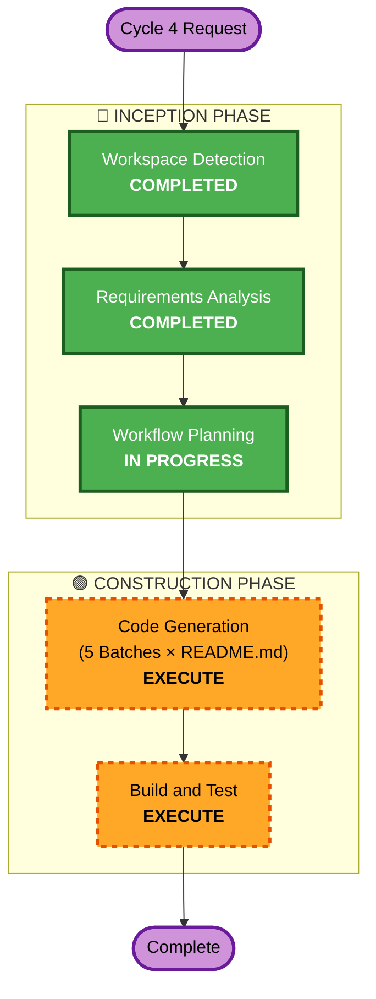

# Cycle 4 — Execution Plan: README.md for Every Standard

## Detailed Analysis Summary

### Change Impact Assessment
- **User-facing changes**: Yes — developers consuming the repo get human-readable docs
- **Structural changes**: No — adding README.md alongside existing YAML files
- **Data model changes**: No
- **API changes**: No
- **NFR impact**: No

### Risk Assessment
- **Risk Level**: Low (additive only — no existing code modified except 1 lightweight README)
- **Rollback Complexity**: Easy (delete generated files)
- **Testing Complexity**: Simple (validate markdown renders, check completeness)

## Workflow Visualization



### Text Fallback
```
Cycle 4 Request
  → Workspace Detection (COMPLETED)
  → Requirements Analysis (COMPLETED)
  → Workflow Planning (IN PROGRESS)
  → Code Generation — 5 Batches (EXECUTE)
  → Build and Test (EXECUTE)
  → Complete
```

## Phases to Execute

### 🔵 INCEPTION PHASE
- [x] Workspace Detection (COMPLETED)
- ~~Reverse Engineering~~ — SKIP (brownfield but no code changes needed)
- [x] Requirements Analysis (COMPLETED)
- ~~User Stories~~ — SKIP (no user-facing application)
- [x] Workflow Planning (IN PROGRESS)
- ~~Application Design~~ — SKIP (no new components, just docs)
- ~~Units Generation~~ — SKIP (batches defined in requirements)

### 🟢 CONSTRUCTION PHASE
- ~~Functional Design~~ — SKIP (README template IS the design)
- ~~NFR Requirements~~ — SKIP (no runtime NFRs)
- ~~NFR Design~~ — SKIP (no runtime NFRs)
- ~~Infrastructure Design~~ — SKIP (no infra changes)
- [ ] Code Generation — **EXECUTE** (5 batches, 43 READMEs)
  - Batch 1: Foundational (11 files)
  - Batch 2: Application Architecture (9 files)
  - Batch 3: Infrastructure (7 files)
  - Batch 4: Security & Quality (10 files)
  - Batch 5: Integration & Data (6 files)
- [ ] Build and Test — **EXECUTE**
  - Validate all 43 README.md files exist
  - Verify markdown syntax
  - Check all internal links

### 🟡 OPERATIONS PHASE
- ~~Operations~~ — SKIP (placeholder, no deployment)

## Code Generation Plan

For each YAML file, the README.md generation follows this process:
1. Read the full YAML standard
2. Extract all sections per FR-01 template
3. Generate Mermaid decision tree from `decision_tree` entries
4. Write README.md with text fallback
5. Validate markdown syntax

## Success Criteria
- **Primary Goal**: 43 comprehensive README.md files
- **Key Deliverables**: 1 README.md per standard directory
- **Quality Gates**: All READMEs follow identical template, all Mermaid diagrams valid, all links work
