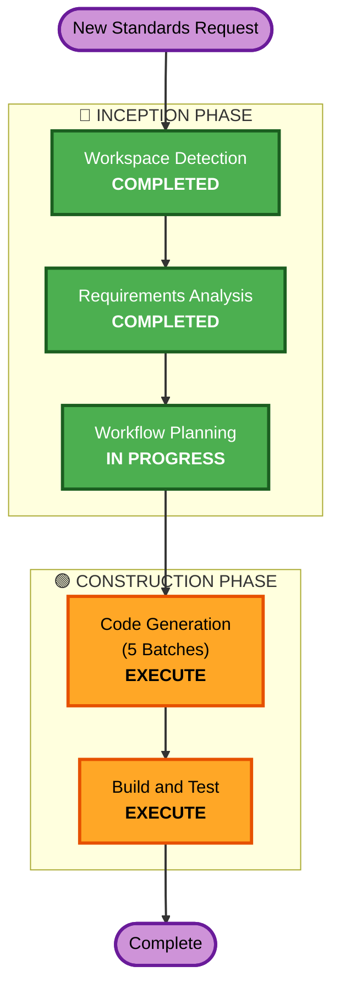

# Execution Plan — Cycle 2 (10 New Standards)

## Detailed Analysis Summary

### Transformation Scope
- **Transformation Type**: Content expansion — adding 10 new YAML standard entries to existing 33-entry catalog
- **Primary Changes**: 10 new `{domain}.yaml` files, index updates, category index updates, README catalog updates
- **Related Components**: `index.yaml`, 4× `_index.yaml` category files, `README.md`, MCP server (auto-loads), validation pipeline

### Change Impact Assessment
- **User-facing changes**: No (content standards consumed by AI assistants)
- **Structural changes**: No (same base-template.yaml v3 schema)
- **Data model changes**: No (YAML schema unchanged)
- **API changes**: No (MCP server dynamically loads all YAML — no code changes needed)
- **NFR impact**: No (validation pipeline handles any count of entries)

### Risk Assessment
- **Risk Level**: Low — isolated new entries, well-understood schema, existing validation pipeline
- **Rollback Complexity**: Easy — each YAML file is self-contained
- **Testing Complexity**: Simple — `python3 tools/validate.py` validates all entries

---

## Workflow Visualization



### Text Alternative
```
Phase 1: INCEPTION
  - Workspace Detection (COMPLETED)
  - Requirements Analysis (COMPLETED)
  - Workflow Planning (IN PROGRESS)
  - User Stories — SKIP
  - Application Design — SKIP
  - Units Generation — SKIP

Phase 2: CONSTRUCTION
  - Functional Design — SKIP
  - NFR Requirements — SKIP
  - NFR Design — SKIP
  - Infrastructure Design — SKIP
  - Code Generation — EXECUTE (5 batches)
  - Build and Test — EXECUTE

Phase 3: OPERATIONS
  - Operations — PLACEHOLDER
```

---

## Phases to Execute

### 🔵 INCEPTION PHASE
- [x] Workspace Detection (COMPLETED)
- ~~Reverse Engineering~~ — SKIP (brownfield but artifacts from cycle 1 exist)
- [x] Requirements Analysis (COMPLETED)
- ~~User Stories~~ — SKIP (no user-facing application — same rationale as cycle 1)
- [x] Workflow Planning (IN PROGRESS)
- ~~Application Design~~ — SKIP (same component structure as cycle 1: each standard = 1 YAML file following base-template.yaml)
- ~~Units Generation~~ — SKIP (units are the 5 batches defined in requirements — no complex decomposition needed)

### 🟢 CONSTRUCTION PHASE
- ~~Functional Design~~ — SKIP (the base-template.yaml IS the functional design — each YAML entry follows the same schema)
- ~~NFR Requirements~~ — SKIP (NFRs defined in requirements-cycle2.md: consistency, enterprise depth, validation compliance)
- ~~NFR Design~~ — SKIP (format-level NFRs — no additional design needed)
- ~~Infrastructure Design~~ — SKIP (no cloud infrastructure — MCP server auto-loads new entries)
- [ ] **Code Generation — EXECUTE** (5 batches)
  - **Rationale**: Core work — generating 10 new YAML standard files plus index/README updates
  - **Batch 1**: security-quality/ (4 standards: client-platform-security, secure-sdlc, compliance-data-privacy, security-monitoring)
  - **Batch 2**: foundational/ (3 standards: authorization, session-management, secrets-management)
  - **Batch 3**: application-architecture/ (2 standards: resilience-chaos-engineering, feature-flags)
  - **Batch 4**: infrastructure/ (1 standard: api-gateway-edge-security)
  - **Batch 5**: Distribution updates (index.yaml, 4× _index.yaml, README.md)
- [ ] **Build and Test — EXECUTE**
  - **Rationale**: Validate all 43 entries pass schema, cross-reference integrity, and completeness checks

### 🟡 OPERATIONS PHASE
- ~~Operations~~ — PLACEHOLDER (no deployment steps)

---

## Code Generation Batch Details

### Batch 1: Security & Quality Standards (4 files)
| # | Domain | File Path | Prerequisites |
|---|--------|-----------|---------------|
| 1 | client-platform-security | `security-quality/client-platform-security/client-platform-security.yaml` | encryption, authentication |
| 2 | secure-sdlc | `security-quality/secure-sdlc/secure-sdlc.yaml` | code-quality, testing-strategies |
| 3 | compliance-data-privacy | `security-quality/compliance-data-privacy/compliance-data-privacy.yaml` | encryption, logging-observability |
| 4 | security-monitoring | `security-quality/security-monitoring/security-monitoring.yaml` | logging-observability, authentication |

### Batch 2: Foundational Standards (3 files)
| # | Domain | File Path | Prerequisites |
|---|--------|-----------|---------------|
| 5 | authorization | `foundational/authorization/authorization.yaml` | authentication |
| 6 | session-management | `foundational/session-management/session-management.yaml` | authentication |
| 7 | secrets-management | `foundational/secrets-management/secrets-management.yaml` | configuration-management, encryption |

### Batch 3: Application Architecture Standards (2 files)
| # | Domain | File Path | Prerequisites |
|---|--------|-----------|---------------|
| 8 | resilience-chaos-engineering | `application-architecture/resilience-chaos-engineering/resilience-chaos-engineering.yaml` | error-handling |
| 9 | feature-flags | `application-architecture/feature-flags/feature-flags.yaml` | ci-cd, configuration-management |

### Batch 4: Infrastructure Standards (1 file)
| # | Domain | File Path | Prerequisites |
|---|--------|-----------|---------------|
| 10 | api-gateway-edge-security | `infrastructure/api-gateway-edge-security/api-gateway-edge-security.yaml` | api-design, rate-limiting |

### Batch 5: Distribution Updates
- [ ] Update `index.yaml` — add 10 new entries (total: 43)
- [ ] Update `security-quality/_index.yaml` — add 4 new domains
- [ ] Update `foundational/_index.yaml` — add 3 new domains
- [ ] Update `application-architecture/_index.yaml` — add 2 new domains
- [ ] Update `infrastructure/_index.yaml` — add 1 new domain
- [ ] Update `README.md` — expand catalog tables

---

## Success Criteria
- **Primary Goal**: 10 new enterprise-grade YAML standards added to the cookbook
- **Key Deliverables**: 10 YAML files, updated indexes, updated README
- **Quality Gates**:
  - All 43 entries pass `python3 tools/validate.py`
  - Schema compliance (base-template.yaml v3)
  - Cross-reference integrity (all prerequisites and related_standards resolve)
  - Completeness (≥4 patterns, ≥3 anti-patterns, ≥1 example, ≥4 recipes per entry)
  - MCP server loads all 43 entries
  - Security Baseline extension compliance
  - PBT extension compliance (where applicable)

---
