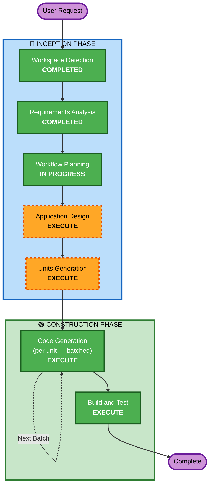

# Execution Plan

## Detailed Analysis Summary

### Project Classification
- **Project Type**: Greenfield knowledge repository (YAML-based architectural standards)
- **Nature**: Content generation — not traditional software. Each "unit of work" is a cookbook entry (YAML file) conforming to base-template.yaml v3.
- **Primary Deliverables**: 33 YAML cookbook entries + distribution packaging (Skills, MCP, prompt files) + governance docs (CONTRIBUTING.md, README)

### Change Impact Assessment
- **User-facing changes**: N/A — no end-user application; consumers are AI code assistants
- **Structural changes**: Yes — defining the entire repository structure, schema, and distribution model
- **Data model changes**: Yes — base-template.yaml v3 IS the data model (already complete)
- **API changes**: Yes — MCP server will expose tools for querying standards
- **NFR impact**: Yes — token efficiency, parsing reliability, search/filtering for AI consumption

### Risk Assessment
- **Risk Level**: Medium
- **Rationale**: Large scope (33 entries) but each entry is independent. Schema is finalized. Risk is primarily in maintaining quality consistency across entries.
- **Rollback Complexity**: Easy — each entry is self-contained
- **Testing Complexity**: Moderate — need schema validation + content quality checks

## Workflow Visualization



### Text Alternative
```
INCEPTION:
  1. Workspace Detection    → COMPLETED
  2. Requirements Analysis  → COMPLETED
  3. Workflow Planning       → IN PROGRESS
  4. Application Design     → EXECUTE (repo structure, distribution architecture)
  5. Units Generation       → EXECUTE (define 33 entries + distribution + governance units)

CONSTRUCTION (per unit, batched):
  6. Code Generation        → EXECUTE (generate YAML entries, distribution packages, docs)
  7. Build and Test         → EXECUTE (schema validation, content quality, distribution testing)
```

## Phases to Execute

### 🔵 INCEPTION PHASE
- [x] Workspace Detection (COMPLETED)
- [x] Requirements Analysis (COMPLETED)
- [x] Workflow Planning (IN PROGRESS)
- [ ] Application Design - **EXECUTE**
  - **Rationale**: Need to define repository directory structure, distribution architecture (Skills/MCP/prompt files), cross-reference system between entries, and the schema validation approach. This is the "architecture" of the cookbook itself.
- [ ] Units Generation - **EXECUTE**
  - **Rationale**: 33 cookbook entries + distribution packaging + governance docs need structured decomposition into batched units. Entries have a natural priority order (foundational → application → infrastructure → security → integration). Batching by priority group enables incremental delivery.

### 🔵 INCEPTION PHASE — Skipped Stages
- Reverse Engineering — **SKIP** (Greenfield project)
- User Stories — **SKIP** (Knowledge repository with no user-facing application; consumers are AI assistants, not human end-users with personas/journeys)

### 🟢 CONSTRUCTION PHASE
- Functional Design — **SKIP** (per unit)
  - **Rationale**: No business logic to design. Each entry follows the v3 template schema — the "design" is the template itself.
- NFR Requirements — **SKIP** (per unit)
  - **Rationale**: NFRs are captured in requirements.md (NFR-01 through NFR-05). No per-unit NFR analysis needed — all entries share the same quality requirements.
- NFR Design — **SKIP** (per unit)
  - **Rationale**: No NFR design artifacts needed. Token efficiency and parsing are addressed by the YAML format decision (AD-01).
- Infrastructure Design — **SKIP** (per unit)
  - **Rationale**: No cloud infrastructure. MCP server infrastructure will be addressed within Code Generation as a distribution unit.
- Code Generation — **EXECUTE** (per unit, batched)
  - **Rationale**: Core work — generate all 33 YAML entries, distribution packages, governance docs. Batched by priority group for incremental delivery.
- Build and Test — **EXECUTE**
  - **Rationale**: Schema validation (all entries conform to base-template.yaml v3), content quality checks, distribution packaging verification.

### 🟡 OPERATIONS PHASE
- Operations — **PLACEHOLDER** (Future: publishing pipeline, versioning automation)

## Proposed Unit Batching Strategy

### Batch 0: Foundation (already done)
- [x] base-template.yaml v3
- [x] authentication/authentication.yaml

### Batch 1: Core Foundational Standards (Priority Group 1)
1. api-design/api-design.yaml
2. error-handling/error-handling.yaml
3. logging-observability/logging-observability.yaml
4. data-persistence/data-persistence.yaml
5. input-validation/input-validation.yaml
6. messaging-events/messaging-events.yaml
7. configuration-management/configuration-management.yaml

### Batch 2: Application Architecture (Priority Group 2)
8. layered-architecture/layered-architecture.yaml
9. service-architecture/service-architecture.yaml (micro vs mono vs modular)
10. domain-driven-design/domain-driven-design.yaml
11. state-management/state-management.yaml
12. dependency-injection/dependency-injection.yaml
13. repository-pattern/repository-pattern.yaml
14. design-patterns/design-patterns.yaml (SOLID + GoF)

### Batch 3: Infrastructure & Deployment (Priority Group 3)
15. containerization/containerization.yaml
16. orchestration/orchestration.yaml
17. ci-cd/ci-cd.yaml
18. infrastructure-as-code/infrastructure-as-code.yaml
19. cloud-architecture/cloud-architecture.yaml
20. database-migration/database-migration.yaml

### Batch 4: Security & Quality (Priority Group 4)
21. encryption/encryption.yaml
22. rate-limiting/rate-limiting.yaml
23. testing-strategies/testing-strategies.yaml
24. code-quality/code-quality.yaml
25. performance-optimization/performance-optimization.yaml
26. accessibility/accessibility.yaml

### Batch 5: Integration & Data (Priority Group 5)
27. third-party-integration/third-party-integration.yaml
28. webhooks/webhooks.yaml
29. file-storage/file-storage.yaml
30. search/search.yaml
31. data-transformation/data-transformation.yaml
32. versioning/versioning.yaml

### Batch 6: Distribution & Governance
33. Distribution packaging (Skills, MCP server, prompt files)
34. CONTRIBUTING.md + PR checklist
35. README.md (comprehensive)
36. Schema validation tooling

## Success Criteria
- **Primary Goal**: Complete, enterprise-grade knowledge repository of 33 architectural standards
- **Key Deliverables**:
  - 33 YAML cookbook entries conforming to base-template.yaml v3
  - Multi-format distribution (Skills, MCP, prompt files, raw repo)
  - Community governance (CONTRIBUTING.md, PR process)
  - Schema validation tooling
- **Quality Gates**:
  - Every entry validates against base-template.yaml v3 schema
  - Every entry has ≥3 patterns, ≥3 anti-patterns, ≥1 example, ≥4 prompt recipes
  - All required fields populated (no placeholders in published entries)
  - Cross-references between related standards are bidirectional
