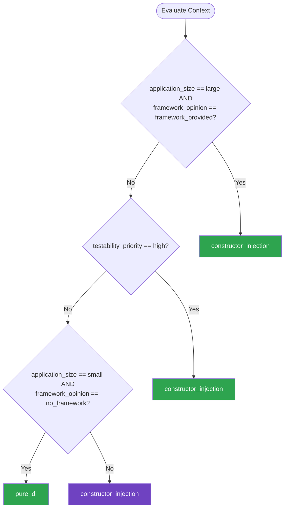

# Dependency Injection — Summary

**Purpose**
- Dependency injection and inversion of control patterns for building testable, modular applications
- Scope: constructor injection, composition root, service locator (anti-pattern recognition), and DI container usage

## Related Standards

| Standard | Relationship | Context |
|----------|-------------|---------|
| [layered-architecture](../layered-architecture/) | complementary | DI is the mechanism that wires layers together respecting the dependency rule |
| [design-patterns](../design-patterns/) | complementary | DI implements the Dependency Inversion Principle from SOLID |
| [repository-pattern](../repository-pattern/) | complementary | Repositories are typically injected into services via DI |

## Context Inputs

These inputs drive the decision tree — provide them to get a tailored recommendation.

| Input | Type | Required | Default | Values | Description |
|-------|------|----------|---------|--------|-------------|
| language_ecosystem | enum | yes | general | java_kotlin, dotnet, python, typescript_javascript, go, general | Primary programming language — determines DI tooling options |
| application_size | enum | yes | medium | small, medium, large | Size and complexity of the application |
| testability_priority | enum | yes | high | low, medium, high | How critical is unit testing with isolated dependencies? |
| framework_opinion | enum | yes | framework_provided | no_framework, framework_provided, custom_needed | Does the framework provide a built-in DI container? |

## Decision Tree

### Mermaid Diagram



### Text Fallback

- **Priority 1** → `constructor_injection` — when application_size == large AND framework_opinion == framework_provided. Large applications with framework DI should use constructor injection as the primary pattern — maximum explicitness and framework support.
- **Priority 2** → `constructor_injection` — when testability_priority == high. Constructor injection makes dependencies explicit and easily substitutable in tests.
- **Priority 3** → `pure_di` — when application_size == small AND framework_opinion == no_framework. Small applications without a framework don't need a DI container — manual wiring at the composition root is sufficient and simpler.
- **Fallback** → `constructor_injection` — Constructor injection is the universal default — explicit, testable, framework-agnostic

> **Confidence**: high | **Risk if wrong**: medium

---

## Patterns

### 1. Constructor Injection

> Dependencies are provided through the constructor at object creation time. The class declares its dependencies explicitly, and the DI container (or manual wiring) provides concrete implementations. The most recommended DI pattern across all languages and frameworks.

**Maturity**: standard

**Use when**
- Default choice for all dependency injection
- Dependencies are required for the object to function
- Maximum explicitness about what a class needs
- Framework or container supports constructor injection

**Avoid when**
- Circular dependencies exist (refactor the design instead)
- Object must be created by a third-party library that doesn't support DI

**Tradeoffs**

| Pros | Cons |
|------|------|
| Dependencies are explicit — visible in the constructor signature | Constructor parameter lists can grow large (signals class does too much) |
| Object is fully initialized after construction — no partial initialization | Framework must support constructor injection or use composition root |
| Easy to substitute in tests — pass fakes/mocks via constructor | |
| Immutable dependencies — set once, never changed | |
| Supported by every DI container across all major languages | |

**Implementation Guidelines**
- Accept interfaces (abstractions), not concrete implementations
- All required dependencies in the constructor — no optional deps as constructor params
- Use method injection for optional or context-specific dependencies
- If constructor has >4 dependencies, the class likely violates SRP — refactor
- Never call virtual methods in the constructor

**Common Errors**

| Error | Impact | Fix |
|-------|--------|-----|
| Accepting concrete classes instead of interfaces | Cannot substitute implementations in tests or swap at runtime | Define an interface for each dependency; accept the interface in the constructor |
| Constructor doing work (I/O, complex logic) | Object creation has side effects; difficult to test; slow instantiation | Constructor should only assign dependencies to fields — no work |
| Too many constructor parameters (>5) | Class has too many responsibilities; hard to test and maintain | Apply SRP; group related dependencies into aggregate services |

**Standards & References**

| Standard | Type | Role | Reference |
|----------|------|------|-----------|
| Dependency Injection Principle | pattern | Core DI pattern for providing dependencies | — |

---

### 2. Composition Root

> A single location in the application where the entire object graph is composed (wired together). All dependency resolution happens here — no DI container references scattered through the codebase. The composition root is as close to the application entry point as possible.

**Maturity**: standard

**Use when**
- Any application using dependency injection
- Container registration should be centralized and auditable
- Preventing container reference leaks into business logic

**Avoid when**
- Never — composition root is always recommended when using DI

**Tradeoffs**

| Pros | Cons |
|------|------|
| Single place to see the entire object graph wiring | Can become large in big applications — split into modules/installers |
| Business logic has no dependency on DI container | All registrations must be maintained as the app evolves |
| Easy to swap entire implementations for testing or different environments | |
| Container is an implementation detail, not a dependency | |

**Implementation Guidelines**
- Place the composition root in the application startup (Main, Program, app factory)
- Register all services, repositories, and infrastructure in the composition root
- No DI container references in business logic, domain, or application layers
- Use module/installer patterns to organize registrations by feature
- Environment-specific registrations via configuration (dev vs prod adapters)

**Common Errors**

| Error | Impact | Fix |
|-------|--------|-----|
| Injecting the DI container itself into classes | Container becomes a Service Locator; dependencies are hidden | Only the composition root should reference the container; classes accept explicit deps |
| Multiple composition roots (registration scattered across the app) | Hard to understand the full object graph; conflicting registrations | Centralize all registration in one composition root; use installer/module pattern for organization |

**Standards & References**

| Standard | Type | Role | Reference |
|----------|------|------|-----------|
| Composition Root Pattern | pattern | Centralized dependency graph wiring | — |

---

### 3. Pure DI (Manual Wiring)

> Dependencies wired manually at the composition root without a DI container. The composition root uses plain constructors to build the object graph. Eliminates container dependency while keeping DI benefits.

**Maturity**: standard

**Use when**
- Small to medium applications with manageable dependency graphs
- Team wants DI benefits without container complexity
- Language lacks good DI container options
- Container magic causes more confusion than it solves

**Avoid when**
- Large application with complex object graph and lifetime management
- Framework provides excellent built-in DI (e.g., ASP.NET Core, Spring)

**Tradeoffs**

| Pros | Cons |
|------|------|
| No container dependency — pure language constructs | Manual wiring becomes tedious for large applications |
| Compile-time safety — wiring errors caught at build time | No automatic lifetime management (singleton, scoped, transient) |
| Easy to debug — follow constructor calls, no reflection magic | Must manually update wiring when dependencies change |
| Full DI benefits (explicit deps, testability, abstraction) | |

**Implementation Guidelines**
- Build the entire object graph in the composition root using constructors
- Use factory methods for objects needing runtime parameters
- Implement singleton pattern manually for shared instances
- Group wiring by feature for readability

**Common Errors**

| Error | Impact | Fix |
|-------|--------|-----|
| Wiring scattered across multiple files instead of one composition root | Object graph not visible in one place; conflicting wiring | Centralize all wiring in one entry-point function or class |

**Standards & References**

| Standard | Type | Role | Reference |
|----------|------|------|-----------|
| Pure DI (Mark Seemann) | pattern | Container-less dependency injection | — |

---

## Examples

### Constructor Injection with Composition Root
**Context**: Wiring a service layer with repository and external dependencies

**Correct** implementation:
```text
# Interfaces (abstractions)
class OrderRepository(Protocol):
    def save(self, order: Order) -> str: ...
    def find(self, order_id: str) -> Order: ...

class PaymentGateway(Protocol):
    def charge(self, amount: Money) -> PaymentResult: ...

class NotificationService(Protocol):
    def notify(self, user_id: str, message: str) -> None: ...

# Service accepts interfaces via constructor
class OrderService:
    def __init__(self, repo: OrderRepository, payments: PaymentGateway,
                 notifications: NotificationService):
        self.repo = repo
        self.payments = payments
        self.notifications = notifications

    def place_order(self, cmd: PlaceOrderCommand) -> str:
        order = Order.create(cmd.customer_id, cmd.items)
        result = self.payments.charge(order.total)
        order_id = self.repo.save(order)
        self.notifications.notify(cmd.customer_id, f"Order {order_id} placed")
        return order_id

# Composition Root — single place to wire everything
def create_app():
        db = PostgresOrderRepository(connection_string)
        payments = StripePaymentGateway(api_key)
        notifications = EmailNotificationService(smtp_config)
        order_service = OrderService(db, payments, notifications)
        return App(order_service=order_service)

# Tests — substitute fakes via constructor
def test_place_order():
    fake_repo = InMemoryOrderRepository()
    fake_payments = FakePaymentGateway(always_succeeds=True)
    fake_notifications = FakeNotificationService()
    service = OrderService(fake_repo, fake_payments, fake_notifications)
    order_id = service.place_order(PlaceOrderCommand(...))
    assert fake_repo.find(order_id) is not None
```

**Incorrect** implementation:
```text
# WRONG: Service Locator pattern — dependencies hidden
class OrderService:
    def place_order(self, cmd):
        repo = ServiceLocator.resolve(OrderRepository)    # Hidden dependency
        payments = ServiceLocator.resolve(PaymentGateway)  # Hidden dependency
        notifications = ServiceLocator.resolve(NotificationService)  # Hidden

        # Dependencies not visible in constructor
        # Cannot test without configuring global ServiceLocator
        # Class appears to have no dependencies but actually has three
```

**Why**: The correct version uses constructor injection — all dependencies are visible in the constructor signature and easily substitutable in tests. The composition root wires everything in one place. The incorrect version uses Service Locator, hiding dependencies and making testing require global state configuration.

---

### DI Container Registration with Module Pattern
**Context**: Organizing DI registrations for a large application

**Correct** implementation:
```text
# Registration organized by feature module
class OrderModule:
    def register(self, container):
        container.register(OrderRepository, SqlOrderRepository, lifetime="scoped")
        container.register(OrderService, lifetime="scoped")

class PaymentModule:
    def register(self, container):
        container.register(PaymentGateway, StripeGateway, lifetime="singleton")
        container.register(PaymentService, lifetime="scoped")

# Composition root assembles modules
def create_app():
    container = Container()
    OrderModule().register(container)
    PaymentModule().register(container)
    # All registration in one visible location
    return container.build()
```

**Incorrect** implementation:
```text
# WRONG: Registrations scattered across the codebase
# In order_service.py:
container.register(OrderRepository, SqlOrderRepository)  # Scattered!

# In payment_controller.py:
container.register(PaymentGateway, StripeGateway)  # Another location!

# In startup.py:
container.register(NotificationService, EmailService)
# Cannot see the full object graph in any single place
```

**Why**: The correct version uses module/installer pattern to organize registrations by feature, all assembled at the composition root. The incorrect version scatters registrations across the codebase, making the object graph impossible to understand from any single location.

---

## Security Hardening

### Transport
- DI container configuration does not expose service endpoints or connection strings in logs

### Data Protection
- DI container does not serialize or log dependency graph details including sensitive config

### Access Control
- DI container configuration is read-only after application startup
- Runtime service resolution restricted to the composition root scope

### Input/Output
- DI container does not accept external input for service resolution (injection attacks)

### Secrets
- Secrets injected via DI, never hardcoded — composition root reads from secret manager
- Secret-holding services registered as singletons to avoid repeated secret fetches

### Monitoring
- DI container initialization logged for debugging — without exposing secret values

---

## Anti-Patterns

| Anti-Pattern | Severity | Description | Fix |
|-------------|----------|-------------|-----|
| Service Locator | high | Classes resolve their own dependencies from a global container or registry. Dependencies are hidden — not visible in the constructor. Tightly couples code to the container. Makes testing require global state configuration. | Use constructor injection; resolve dependencies only at the composition root |
| Captive Dependency | high | A shorter-lived service (scoped/transient) injected into a longer-lived service (singleton). The shorter-lived instance is 'captured' and reused beyond its intended lifetime, causing stale data or concurrency issues. | Verify lifetime hierarchies: singleton → singleton, scoped → scoped or transient; use factory for dynamic resolution |
| Constructor Over-Injection | medium | Class constructor accepts more than 5 dependencies, indicating the class has too many responsibilities and violates the Single Responsibility Principle. | Apply SRP: split the class or introduce a facade that groups related dependencies |
| Ambient Context | high | Using static properties or thread-local storage to provide dependencies implicitly. Dependencies are invisible, untestable, and thread-unsafe. | Replace with explicit constructor injection; pass context as a parameter |

---

## Checklist

| ID | Category | Description | Severity |
|----|----------|-------------|----------|
| DI-01 | design | Constructor injection used as the primary DI pattern | high |
| DI-02 | design | Single composition root at the application entry point | high |
| DI-03 | correctness | Interfaces (abstractions) injected, not concrete implementations | high |
| DI-04 | correctness | No Service Locator pattern — container not injected into classes | high |
| DI-05 | correctness | No captive dependencies — lifetime hierarchies verified | high |
| DI-06 | maintainability | No constructor over-injection — max 5 dependencies per class | medium |
| DI-07 | security | Secrets injected via DI from secret manager, never hardcoded | critical |
| DI-08 | correctness | Constructors perform no work — only assign dependencies to fields | medium |
| DI-09 | maintainability | DI registrations organized by feature module or installer | low |
| DI-10 | reliability | All registered interfaces have at least one implementation | high |

---

## Compliance

| Standard | Relevance |
|----------|-----------|
| OWASP Injection Prevention | DI containers must not resolve services from user-controlled input |
| ISO/IEC 25010 | DI supports modularity, reusability, and testability quality attributes |

---

## Prompt Recipes

### Set up dependency injection for a new project
**Scenario**: greenfield
```text
Set up dependency injection for a {language} project using {framework}.

1. Define interfaces for all infrastructure dependencies (DB, APIs, messaging)
2. Create a composition root at the application entry point
3. Register all services with appropriate lifetimes (singleton, scoped, transient)
4. Wire environment-specific implementations (dev vs prod)
5. Show how to substitute fakes in unit tests

Use constructor injection as the primary pattern.
No service locator. No static resolution.
```

### Introduce DI into an existing codebase
**Scenario**: migration
```text
Introduce dependency injection into this {language} codebase that currently
uses direct instantiation (new/create) throughout:

1. Identify all classes that create their own dependencies
2. Extract interfaces for external dependencies
3. Refactor to constructor injection one class at a time
4. Create a composition root to wire everything
5. Add unit tests using fake implementations

Migrate incrementally — don't rewrite everything at once.
```

### Audit DI configuration for issues
**Scenario**: audit
```text
Audit the dependency injection configuration in this {language} project:

1. Find Service Locator usage (resolving from container outside composition root)
2. Check for concrete class injection (should be interfaces)
3. Identify captive dependencies (scoped injected into singleton)
4. Find classes with >5 constructor dependencies (SRP violation)
5. Check for work in constructors (I/O, complex logic)
6. Verify all interfaces have registered implementations
```

### Handle complex DI scenarios
**Scenario**: edge-case
```text
Help me handle these DI challenges in {language}:

1. Factory pattern for objects needing runtime parameters
2. Decorator pattern for cross-cutting concerns (logging, caching)
3. Strategy pattern with multiple implementations of same interface
4. Lazy initialization for expensive dependencies
5. Conditional registration based on configuration

Use {framework}'s DI container capabilities. Show test approach for each.
```

---

## Links
- Full standard: [dependency-injection.yaml](dependency-injection.yaml)
