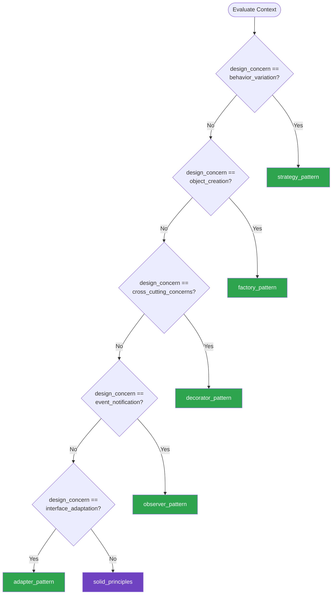

# Design Patterns — Summary

**Purpose**
- SOLID principles and essential Gang of Four design patterns for AI-assisted development
- Scope: the most impactful patterns for modern software — strategy, observer, factory, decorator, and adapter — with SOLID as the guiding foundation

## Related Standards

| Standard | Relationship | Context |
|----------|-------------|---------|
| [dependency-injection](../dependency-injection/) | complementary | DI implements the Dependency Inversion Principle from SOLID |
| [layered-architecture](../layered-architecture/) | complementary | SOLID principles guide how responsibilities are distributed across layers |
| [domain-driven-design](../domain-driven-design/) | complementary | DDD tactical patterns (entities, value objects) apply SOLID principles to domain modeling |

## Context Inputs

These inputs drive the decision tree — provide them to get a tailored recommendation.

| Input | Type | Required | Default | Values | Description |
|-------|------|----------|---------|--------|-------------|
| design_concern | enum | yes | behavior_variation | behavior_variation, object_creation, interface_adaptation, cross_cutting_concerns, event_notification, solid_violations | What design problem are you trying to solve? |
| language_paradigm | enum | yes | object_oriented | object_oriented, functional, multi_paradigm | Primary language paradigm |
| codebase_maturity | enum | yes | established | greenfield, established, legacy | Maturity of the existing codebase |

## Decision Tree

### Mermaid Diagram



### Text Fallback

- **Priority 1** → `strategy_pattern` — when design_concern == behavior_variation. Strategy pattern encapsulates interchangeable algorithms behind a common interface. Preferred over switch/if chains for behavior selection.
- **Priority 2** → `factory_pattern` — when design_concern == object_creation. Factory patterns encapsulate complex creation logic, returning the right implementation based on context.
- **Priority 3** → `decorator_pattern` — when design_concern == cross_cutting_concerns. Decorator adds behavior (logging, caching, auth) without modifying the original class — perfect for cross-cutting concerns.
- **Priority 4** → `observer_pattern` — when design_concern == event_notification. Observer decouples event producers from consumers — one-to-many notification without tight coupling.
- **Priority 5** → `adapter_pattern` — when design_concern == interface_adaptation. Adapter translates between incompatible interfaces — essential for integrating third-party libraries and legacy systems.
- **Fallback** → `solid_principles` — Start with SOLID principles — they guide you to the right pattern

> **Confidence**: high | **Risk if wrong**: low

---

## Patterns

### 1. SOLID Principles

> Five foundational principles for maintainable object-oriented design: Single Responsibility (SRP), Open/Closed (OCP), Liskov Substitution (LSP), Interface Segregation (ISP), and Dependency Inversion (DIP). These principles prevent design rot and guide pattern selection.

**Maturity**: standard

**Use when**
- Always — SOLID applies to any object-oriented or multi-paradigm codebase
- Code review criteria for design quality
- Deciding whether a class needs refactoring
- Choosing between design pattern options

**Avoid when**
- Trivial scripts or one-off tools where design longevity is irrelevant

**Tradeoffs**

| Pros | Cons |
|------|------|
| Code is easier to test, maintain, and extend | Over-application creates excessive abstraction for simple problems |
| Changes are localized — one change, one place | More interfaces and classes than a naïve implementation |
| Interfaces are focused and cohesive | Learning curve for teams new to the principles |
| Dependencies point toward abstractions, not implementations | |

**Implementation Guidelines**
- SRP: A class should have one reason to change — one responsibility
- OCP: Open for extension, closed for modification — use strategy/decorator to add behavior
- LSP: Subtypes must be substitutable for their base types without breaking behavior
- ISP: Clients should not depend on interfaces they don't use — split fat interfaces
- DIP: Depend on abstractions, not concretions — use constructor injection

**Common Errors**

| Error | Impact | Fix |
|-------|--------|-----|
| God class with multiple responsibilities (SRP violation) | Every change risks breaking unrelated functionality | Extract each responsibility into its own class with a focused interface |
| Modifying existing classes to add new behavior (OCP violation) | Existing behavior may break; shotgun surgery across the codebase | Use strategy or decorator to add behavior without modifying existing code |
| Subclass that throws NotImplementedException (LSP violation) | Code using the base type breaks when it encounters the subclass | Redesign the hierarchy; use composition over inheritance if the subtype can't fulfill the contract |

**Standards & References**

| Standard | Type | Role | Reference |
|----------|------|------|-----------|
| SOLID Principles (Robert C. Martin) | pattern | Foundational design principles for OOP | — |

---

### 2. Strategy Pattern

> Defines a family of algorithms, encapsulates each in a class, and makes them interchangeable. The client selects the strategy at runtime. Eliminates conditional logic (if/switch) for behavior selection.

**Maturity**: standard

**Use when**
- Multiple algorithms or behaviors that vary by context
- Want to replace if/else or switch chains with polymorphism
- Algorithm selection should be configurable at runtime
- Need to add new behaviors without modifying existing code (OCP)

**Avoid when**
- Only two simple options — an if/else may be clearer
- Behavior never varies — no need for indirection

**Tradeoffs**

| Pros | Cons |
|------|------|
| Algorithms independently testable | More classes than a simple conditional |
| New algorithms added without modifying existing code | Client must know about available strategies |
| Runtime algorithm swapping | |
| Eliminates complex conditional logic | |

**Implementation Guidelines**
- Define strategy interface with a single method matching the algorithm contract
- Each concrete strategy implements one algorithm variation
- Context class accepts a strategy via constructor injection
- In functional languages, use function parameters instead of strategy objects

**Common Errors**

| Error | Impact | Fix |
|-------|--------|-----|
| Strategy interface with too many methods | Strategies become coupled; violates ISP | One method per strategy interface; compose multiple strategies if needed |
| Context class choosing strategy internally (factory inside context) | Strategy pattern's flexibility negated; conditional logic just moved | Strategy injected from outside; selection logic in a factory or configuration |

**Standards & References**

| Standard | Type | Role | Reference |
|----------|------|------|-----------|
| GoF Strategy Pattern | pattern | Behavioral pattern for algorithm interchangeability | — |

---

### 3. Factory Pattern

> Encapsulates object creation logic, returning the appropriate implementation based on input parameters or configuration. Includes Factory Method (subclass decides) and Abstract Factory (family of related objects).

**Maturity**: standard

**Use when**
- Object creation involves complex logic or conditional branching
- The concrete type to create depends on runtime context
- Want to decouple client code from specific implementations
- Creating families of related objects that must be used together

**Avoid when**
- Simple construction — just use the constructor
- Only one implementation exists

**Tradeoffs**

| Pros | Cons |
|------|------|
| Creation logic centralized in one place | Additional indirection for simple cases |
| Client code decoupled from concrete types | Factory can become a God class if it creates too many types |
| Easy to add new implementations without changing client code | |
| Enforces consistent creation (validation, defaults, logging) | |

**Implementation Guidelines**
- Factory returns interface type, not concrete type
- Factory Method: define creation in base class, override in subclasses
- Abstract Factory: create families of related objects together
- Simple Factory (static method): pragmatic starting point before full pattern
- Register implementations for Open/Closed compliance

**Common Errors**

| Error | Impact | Fix |
|-------|--------|-----|
| Factory that requires modification for every new type (OCP violation) | Adding new types requires changing the factory | Use registration-based factory or dependency injection |
| Factory returning concrete types instead of interfaces | Client coupled to implementation; factory provides no abstraction | Factory signature returns the interface; concrete type is internal |

**Standards & References**

| Standard | Type | Role | Reference |
|----------|------|------|-----------|
| GoF Factory Method / Abstract Factory | pattern | Creational pattern for encapsulated object creation | — |

---

### 4. Decorator Pattern

> Wraps an object to add behavior without modifying the original. Decorators implement the same interface as the wrapped object. Perfect for cross-cutting concerns like logging, caching, retry, and authorization.

**Maturity**: standard

**Use when**
- Adding cross-cutting concerns (logging, caching, timing, auth)
- Need to compose behaviors dynamically at runtime
- Want to add behavior without modifying existing classes (OCP)
- Middleware or pipeline patterns

**Avoid when**
- Decoration depth makes debugging difficult
- Performance-critical code where wrapper overhead matters

**Tradeoffs**

| Pros | Cons |
|------|------|
| Original class unchanged — follows OCP | Deep nesting makes debugging harder (wrapper inside wrapper) |
| Behaviors composable: logging + caching + retry stacked | Lots of small classes for each concern |
| Each decorator independently testable | Must implement entire interface even for wrapping one method |
| Applied selectively — not all instances need decoration | |

**Implementation Guidelines**
- Decorator implements same interface as the wrapped object
- Accepts the wrapped object via constructor
- Delegates to wrapped object, adding behavior before/after
- Stack decorators for multiple concerns: cache(log(service))
- In DI containers, use decorator registration support

**Common Errors**

| Error | Impact | Fix |
|-------|--------|-----|
| Decorator modifying the wrapped object's state | Side effects leak across decorators; unpredictable behavior | Decorators should only add behavior around delegation, not mutate the wrapped object |
| Ordering-dependent decorators without clear documentation | Wrong ordering produces incorrect behavior (e.g., caching before auth) | Document decorator order requirements; enforce in composition root |

**Standards & References**

| Standard | Type | Role | Reference |
|----------|------|------|-----------|
| GoF Decorator Pattern | pattern | Structural pattern for composable behavior addition | — |

---

### 5. Adapter Pattern

> Translates one interface into another that a client expects. Allows incompatible interfaces to work together. Essential for integrating third-party libraries, legacy systems, and external APIs.

**Maturity**: standard

**Use when**
- Integrating third-party library with incompatible interface
- Wrapping legacy code behind a modern interface
- Converting between domain and infrastructure types
- Implementing ports in hexagonal architecture

**Avoid when**
- Interfaces are already compatible
- Adapter would just pass through without translation

**Tradeoffs**

| Pros | Cons |
|------|------|
| Decouples client from third-party or legacy interfaces | Additional indirection for every external integration |
| Client code stable even when external library changes | Must maintain adapter when either interface changes |
| Adapters independently testable | |
| Natural fit for hexagonal architecture driven/secondary adapters | |

**Implementation Guidelines**
- Adapter implements the target interface (what the client expects)
- Adapter holds a reference to the adaptee (the incompatible object)
- Translation logic lives in the adapter — domain stays clean
- One adapter per external system; multiple adapters for same port allowed

**Common Errors**

| Error | Impact | Fix |
|-------|--------|-----|
| Business logic in the adapter | Logic split between domain and infrastructure; untestable without external system | Adapter only translates interfaces; business logic stays in domain/application layer |
| Adapter exposing adaptee types to the client | Abstraction leaks; client coupled to external system types | Adapter methods accept and return domain types only |

**Standards & References**

| Standard | Type | Role | Reference |
|----------|------|------|-----------|
| GoF Adapter Pattern | pattern | Structural pattern for interface translation | — |

---

### 6. Observer Pattern

> Defines a one-to-many dependency between objects so that when one object changes state, all dependents are notified automatically. Decouples event producers from consumers. Foundation for event-driven architectures, reactive programming, and pub/sub systems.

**Maturity**: standard

**Use when**
- One-to-many notification when an object changes state
- Decoupling event producers from consumers
- UI event handling or reactive data binding
- Domain events within an application

**Avoid when**
- Simple direct method calls suffice and there is only one consumer
- Notification order matters and is hard to control
- Distributed systems where messaging infrastructure is more appropriate

**Tradeoffs**

| Pros | Cons |
|------|------|
| Loose coupling — subject doesn't know concrete observers | Notification order may be unpredictable |
| New observers added without modifying the subject | Memory leaks if observers are not unsubscribed |
| Supports broadcast communication | Debugging event flows can be difficult |
| Foundation for reactive and event-driven patterns | Cascade of updates if observers trigger further notifications |

**Implementation Guidelines**
- Subject maintains a list of observers and notifies them on state change
- Observers implement a common interface (e.g., on_event, update)
- Provide subscribe and unsubscribe methods on the subject
- In modern languages, use built-in event/signal mechanisms or reactive libraries
- For distributed systems, graduate to messaging infrastructure (pub/sub, event bus)

**Common Errors**

| Error | Impact | Fix |
|-------|--------|-----|
| Observers not unsubscribed when no longer needed | Memory leak; ghost observers receive notifications and may fail | Use weak references or explicit lifecycle management; unsubscribe on disposal |
| Observer modifying subject state during notification | Infinite notification loops; unpredictable state | Observers should react to events, not mutate the subject; use command pattern for state changes |

**Standards & References**

| Standard | Type | Role | Reference |
|----------|------|------|-----------|
| GoF Observer Pattern | pattern | Behavioral pattern for event notification | — |

---

## Examples

### Single Responsibility Principle — Extracting Responsibilities
**Context**: Refactoring a class that handles validation, persistence, and notification

**Correct** implementation:
```text
# Each class has one responsibility
class OrderValidator:
    def validate(self, order):
        if not order.items:
            raise ValidationError("Order must have items")
        if order.total <= 0:
            raise ValidationError("Order total must be positive")

class OrderRepository:
    def save(self, order):
        self.db.insert("orders", order.to_dict())

class OrderNotifier:
    def notify_placed(self, order):
        self.email.send(order.customer_email, "Order placed", order.summary)

# Orchestrator composes single-responsibility classes
class PlaceOrderUseCase:
    def __init__(self, validator, repo, notifier):
        self.validator = validator
        self.repo = repo
        self.notifier = notifier

    def execute(self, order):
        self.validator.validate(order)
        self.repo.save(order)
        self.notifier.notify_placed(order)
```

**Incorrect** implementation:
```text
# WRONG: God class with multiple responsibilities
class OrderService:
    def place_order(self, order):
        # Validation (responsibility 1)
        if not order.items:
            raise Error("No items")
        # Persistence (responsibility 2)
        self.db.insert("orders", order.to_dict())
        # Notification (responsibility 3)
        self.email.send(order.customer_email, "Order placed", order.summary)
        # Logging (responsibility 4)
        self.logger.info(f"Order placed: {order.id}")
        # Any change to validation, persistence, or notification touches THIS class
```

**Why**: The correct version separates each responsibility into its own class. Changes to validation logic don't risk breaking persistence or notification. Each class is independently testable. The incorrect version mixes all concerns in one class, making it fragile and hard to test in isolation.

---

### Strategy Pattern — Replacing Conditional Logic
**Context**: Pricing calculator with different discount strategies

**Correct** implementation:
```text
# Strategy interface
class DiscountStrategy(Protocol):
    def calculate(self, order_total: float) -> float: ...

# Concrete strategies
class NoDiscount:
    def calculate(self, order_total):
        return order_total

class PercentageDiscount:
    def __init__(self, percent):
        self.percent = percent
    def calculate(self, order_total):
        return order_total * (1 - self.percent / 100)

class TieredDiscount:
    def calculate(self, order_total):
        if order_total > 1000:
            return order_total * 0.85
        if order_total > 500:
            return order_total * 0.90
        return order_total

# Context uses strategy — no conditional logic
class PricingService:
    def __init__(self, discount: DiscountStrategy):
        self.discount = discount

    def calculate_total(self, order):
        subtotal = sum(item.price * item.qty for item in order.items)
        return self.discount.calculate(subtotal)

# New discount types added without modifying PricingService
```

**Incorrect** implementation:
```text
# WRONG: Conditional logic for every discount type
class PricingService:
    def calculate_total(self, order, discount_type):
        subtotal = sum(item.price * item.qty for item in order.items)
        if discount_type == "none":
            return subtotal
        elif discount_type == "percentage":
            return subtotal * 0.9
        elif discount_type == "tiered":
            if subtotal > 1000: return subtotal * 0.85
            if subtotal > 500: return subtotal * 0.90
            return subtotal
        # Every new discount type = modify this method (OCP violation)
```

**Why**: The correct version encapsulates each discount algorithm in a strategy class. New discount types are added by creating new classes, not by modifying PricingService. The incorrect version uses a growing switch/if chain that violates OCP and requires modification for every new discount type.

---

## Security Hardening

### Transport
- Adapter pattern implementations validate all external data before translation

### Data Protection
- Strategy implementations handling sensitive data follow data protection standards
- Decorator chains do not log sensitive data in cross-cutting decorators

### Access Control
- Factory pattern enforces authorization before creating privileged objects
- Strategy selection validated against allowed strategies per user role

### Input/Output
- Adapter pattern sanitizes all input from external systems
- Factory pattern validates creation parameters

### Secrets
- Pattern implementations receive secrets via injection, never hardcoded

### Monitoring
- Decorator pattern ideal for adding monitoring without modifying business code
- Factory creation events logged for audit trail

---

## Anti-Patterns

| Anti-Pattern | Severity | Description | Fix |
|-------------|----------|-------------|-----|
| God Class | critical | A single class with too many responsibilities — hundreds of methods, thousands of lines, touching every part of the system. Violates SRP. | Extract responsibilities into focused classes; compose them in a use case or facade |
| Shotgun Surgery | high | A single logical change requires modifications in many different classes scattered across the codebase. Indicates poor cohesion and responsibility distribution. | Move related logic into a single class or module; apply SRP to group by reason-to-change |
| Premature Pattern Application | medium | Applying complex design patterns to simple problems that don't warrant the indirection. Creates unnecessary abstraction that obscures intent. | Start with the simplest implementation; introduce patterns when complexity demands them |
| Inheritance Abuse | high | Using inheritance for code reuse instead of polymorphism. Deep inheritance hierarchies that violate LSP and create fragile base class problems. | Prefer composition over inheritance; use interfaces and delegation |
| Feature Envy | medium | A method that uses more features of another class than its own. Indicates the method belongs in the other class. | Move the method to the class whose data it primarily uses |

---

## Checklist

| ID | Category | Description | Severity |
|----|----------|-------------|----------|
| DP-01 | design | Classes follow SRP — each class has one reason to change | high |
| DP-02 | design | New features added by extension, not modification (OCP) | high |
| DP-03 | correctness | Subtypes fully substitutable for base types (LSP) | high |
| DP-04 | design | Interfaces focused — clients don't depend on methods they don't use (ISP) | medium |
| DP-05 | design | Dependencies on abstractions, not concretions (DIP) | high |
| DP-06 | maintainability | Conditional logic (switch/if chains) replaced with strategy pattern where appropriate | medium |
| DP-07 | maintainability | Cross-cutting concerns (logging, caching) applied via decorator, not scattered | medium |
| DP-08 | design | Complex object creation encapsulated in factories | low |
| DP-09 | maintainability | Third-party integrations wrapped in adapters | high |
| DP-10 | design | Composition preferred over inheritance for code reuse | high |
| DP-11 | correctness | No God classes — maximum class size enforced by code quality tools | high |
| DP-12 | design | Patterns applied only when complexity warrants — no premature abstraction | medium |

---

## Compliance

| Standard | Relevance |
|----------|-----------|
| ISO/IEC 25010 | Design patterns directly support maintainability, reusability, and modularity |
| SOLID Principles | SOLID is the foundation — patterns are implementations of these principles |

---

## Prompt Recipes

### Apply SOLID principles when designing new classes
**Scenario**: greenfield
```text
Design {class_description} following SOLID principles:

1. **SRP**: Identify distinct responsibilities — one class per responsibility
2. **OCP**: Identify variation points — use strategy or decorator for extensibility
3. **LSP**: If using inheritance, ensure subtypes are fully substitutable
4. **ISP**: Define focused interfaces — clients depend only on what they use
5. **DIP**: Depend on abstractions — accept interfaces via constructor injection

Show the class design, interfaces, and how to compose them.
```

### Refactor existing code to apply design patterns
**Scenario**: migration
```text
Refactor this {language} code to address design pattern violations:

1. Identify SOLID violations (God classes, switch chains, broken substitution)
2. For each violation, recommend the appropriate pattern:
   - Switch/if chains → Strategy pattern
   - Cross-cutting concerns → Decorator pattern
   - Complex creation → Factory pattern
   - Interface mismatch → Adapter pattern
3. Apply the pattern incrementally — one refactoring at a time
4. Ensure all tests pass after each refactoring
```

### Audit codebase for SOLID violations and pattern opportunities
**Scenario**: audit
```text
Audit this {language} codebase for design quality:

1. **SRP violations**: Classes with >1 responsibility (look for "and" in descriptions)
2. **OCP violations**: Places where adding features requires modifying existing code
3. **LSP violations**: Subclasses throwing NotImplemented or breaking base contracts
4. **ISP violations**: Fat interfaces forcing clients to depend on unused methods
5. **DIP violations**: Classes instantiating their own dependencies

For each violation, recommend the fix and appropriate design pattern.
```

### Select the right design pattern for a specific problem
**Scenario**: architecture
```text
I need a design pattern for: {problem_description}

Analyze the problem and recommend the most appropriate pattern:
1. What is the core design concern? (variation, creation, adaptation, cross-cutting, notification)
2. Which GoF pattern addresses this concern?
3. Show the pattern applied to my specific problem
4. Show the before (without pattern) and after (with pattern)
5. Explain when this pattern would be over-engineering
```

### Debug design pattern implementation issues
**Scenario**: debugging
```text
Debug this {pattern_name} implementation in {language}:

1. Verify the pattern is implemented correctly (interface contracts, delegation)
2. Check for common mistakes specific to this pattern
3. Verify SOLID principles are followed in the implementation
4. Suggest simplification if the pattern is over-applied
5. Show corrected implementation with tests
```

---

## Links
- Full standard: [design-patterns.yaml](design-patterns.yaml)
