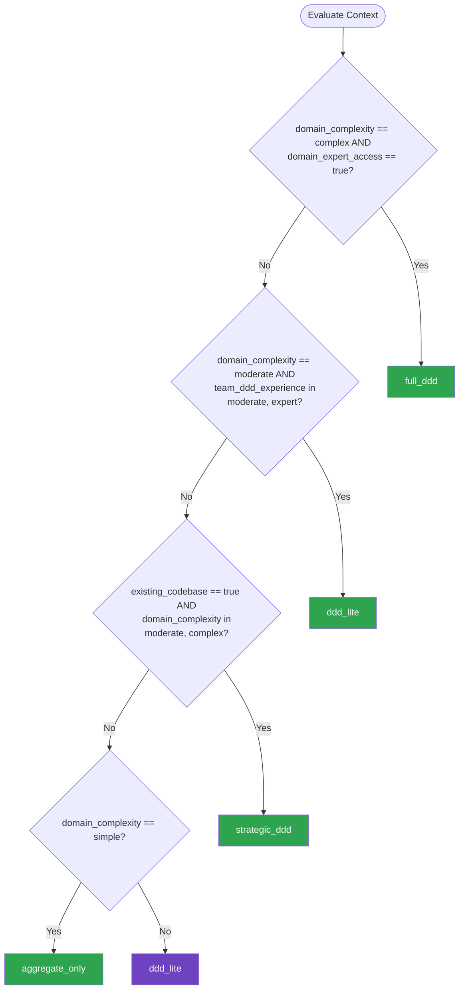

# Domain Driven Design — Summary

**Purpose**
- Domain-Driven Design strategic and tactical patterns for modeling complex business domains
- Scope: bounded contexts, aggregates, entities, value objects, domain events, and context mapping

## Related Standards

| Standard | Relationship | Context |
|----------|-------------|---------|
| [service-architecture](../service-architecture/) | complementary | Bounded contexts from DDD define microservice boundaries |
| [messaging-events](../../foundational/messaging-events/) | complementary | Domain events are published and consumed via messaging infrastructure |
| [repository-pattern](../repository-pattern/) | complementary | Repositories persist and retrieve aggregates as defined by DDD |
| [layered-architecture](../layered-architecture/) | complementary | DDD tactical patterns live in the domain layer of clean/hexagonal architectures |

## Context Inputs

These inputs drive the decision tree — provide them to get a tailored recommendation.

| Input | Type | Required | Default | Values | Description |
|-------|------|----------|---------|--------|-------------|
| domain_complexity | enum | yes | complex | simple, moderate, complex | How complex is the business domain? |
| domain_expert_access | boolean | yes | true | — | Does the team have access to domain experts for modeling sessions? |
| team_ddd_experience | enum | yes | moderate | none, basic, moderate, expert | Team's experience with DDD concepts |
| existing_codebase | boolean | yes | false | — | Is there an existing codebase to refactor? |
| consistency_requirements | enum | yes | strong_within_aggregate | eventual_everywhere, strong_within_aggregate, strong_across_aggregates | How strong are transactional consistency requirements? |

## Decision Tree

### Mermaid Diagram



### Text Fallback

- **Priority 1** → `full_ddd` — when domain_complexity == complex AND domain_expert_access == true. Complex domains with domain expert access benefit from full DDD — strategic design for boundaries, tactical patterns for modeling.
- **Priority 2** → `ddd_lite` — when domain_complexity == moderate AND team_ddd_experience in [moderate, expert]. Moderate complexity with experienced team benefits from tactical DDD patterns without full strategic design overhead.
- **Priority 3** → `strategic_ddd` — when existing_codebase == true AND domain_complexity in [moderate, complex]. Existing codebases benefit from strategic DDD first — discover bounded contexts and relationships before applying tactical patterns.
- **Priority 4** → `aggregate_only` — when domain_complexity == simple. Simple domains need only aggregate patterns for consistency boundaries; full DDD is over-engineering.
- **Fallback** → `ddd_lite` — DDD-lite with tactical patterns is the safest starting point for most teams

> **Confidence**: high | **Risk if wrong**: medium

---

## Patterns

### 1. Full Domain-Driven Design

> Complete DDD implementation including strategic design (bounded contexts, context maps, ubiquitous language) and tactical design (aggregates, entities, value objects, domain events, repositories, domain services). Requires close collaboration with domain experts.

**Maturity**: enterprise

**Use when**
- Complex business domain with many rules and invariants
- Domain experts are available for modeling workshops
- Multiple teams working on the same business domain
- System will evolve significantly over years

**Avoid when**
- Simple CRUD application
- No access to domain experts
- Team has no DDD experience and short timeline

**Tradeoffs**

| Pros | Cons |
|------|------|
| Software model closely mirrors business reality | Significant upfront investment in domain modeling |
| Ubiquitous language reduces communication gaps | Requires ongoing access to domain experts |
| Bounded contexts create natural service boundaries | Steep learning curve for the full pattern catalog |
| Domain events enable loose coupling between contexts | Over-engineering risk if applied to simple domains |

**Implementation Guidelines**
- Start with Event Storming to discover domain events and bounded contexts
- Define ubiquitous language per bounded context — enforce in code and conversation
- Model aggregates as consistency boundaries — one transaction per aggregate
- Use value objects for concepts defined by attributes, not identity
- Publish domain events when aggregate state changes — other contexts subscribe
- Repository per aggregate root — never for entities inside an aggregate

**Common Errors**

| Error | Impact | Fix |
|-------|--------|-----|
| One ubiquitous language for the entire system | Terms have different meanings in different contexts, causing confusion | Each bounded context has its own ubiquitous language; translate at boundaries |
| Aggregates too large — spanning multiple consistency boundaries | Concurrency conflicts; performance issues; difficulty reasoning about invariants | Follow the rule: small aggregates with consistency boundaries around true invariants |
| Domain events carrying too much data | Tight coupling between contexts; events become shared data contracts | Events carry only the identity and state change; consumers query for details if needed |

**Standards & References**

| Standard | Type | Role | Reference |
|----------|------|------|-----------|
| Domain-Driven Design (Eric Evans) | pattern | Original DDD reference — strategic and tactical patterns | — |
| Implementing Domain-Driven Design (Vaughn Vernon) | pattern | Practical DDD implementation guide | — |

---

### 2. DDD-Lite (Tactical Patterns Only)

> Apply DDD tactical patterns (aggregates, value objects, domain events, repositories) without the full strategic design overhead. Good for teams that want rich domain modeling without bounded context analysis.

**Maturity**: advanced

**Use when**
- Moderate domain complexity
- Team wants better domain modeling but lacks time for full strategic DDD
- Single bounded context application
- Existing clean architecture codebase adding domain richness

**Avoid when**
- Multiple teams with overlapping domain concepts (need strategic DDD)
- Simple CRUD where entities are just data containers

**Tradeoffs**

| Pros | Cons |
|------|------|
| Lower adoption cost than full DDD | May miss important bounded context boundaries |
| Rich domain model with proper invariant enforcement | Without ubiquitous language discipline, naming inconsistencies grow |
| Good aggregate design prevents consistency bugs | Harder to decompose later without context maps |
| Domain events improve decoupling within the application | |

**Implementation Guidelines**
- Identify aggregates by grouping entities that must be consistent together
- Use value objects for all concepts without identity (money, addresses, date ranges)
- Domain services for operations that don't belong to a single entity
- Publish domain events from aggregates for side effects and notifications
- Repository pattern for aggregate persistence — load and save whole aggregates

**Common Errors**

| Error | Impact | Fix |
|-------|--------|-----|
| Treating all entities as aggregate roots | No consistency boundaries; every entity independently loadable and mutable | Only aggregate roots are accessible; child entities accessed through the root |
| Value objects with setters (mutable) | Shared value object instances can be modified, breaking invariants | Value objects are always immutable; create new instances for changes |

**Standards & References**

| Standard | Type | Role | Reference |
|----------|------|------|-----------|
| Implementing Domain-Driven Design (Vaughn Vernon) | pattern | Practical reference for tactical DDD patterns | — |

---

### 3. Strategic DDD (Context Mapping)

> Focus on strategic patterns: bounded contexts, context maps, and integration patterns between contexts (Shared Kernel, Anti-Corruption Layer, Open Host Service, Published Language). Best for brownfield systems where you need to understand existing domain boundaries.

**Maturity**: enterprise

**Use when**
- Multiple teams working on related business domains
- Existing system needs domain boundary clarification
- Planning microservice extraction from a monolith
- Different parts of the system model the same concept differently

**Avoid when**
- Single team, single bounded context
- Greenfield with simple, well-understood domain

**Tradeoffs**

| Pros | Cons |
|------|------|
| Clarifies team boundaries and ownership | Requires multi-team coordination for context mapping |
| Reveals hidden coupling between system parts | Context maps need ongoing maintenance as domains evolve |
| Anti-corruption layers protect domain integrity during integration | Strategic patterns are abstract — harder to learn without examples |
| Natural input for microservice boundary decisions | |

**Implementation Guidelines**
- Map existing system into bounded contexts based on language and data ownership
- Document context relationships: Shared Kernel, Customer-Supplier, Conformist, ACL
- Use Anti-Corruption Layer when integrating with legacy or external systems
- Open Host Service for contexts that serve many consumers
- Published Language (e.g., canonical data model) for standardized context integration

**Common Errors**

| Error | Impact | Fix |
|-------|--------|-----|
| No Anti-Corruption Layer when integrating with legacy systems | Legacy model leaks into new domain code; new system constrained by legacy schema | Always put an ACL between legacy and new contexts; translate at the boundary |
| Conformist pattern used when you have leverage to negotiate | Your domain model forced to match an upstream that doesn't serve your needs | Use Customer-Supplier when you can influence upstream; Conformist only when you cannot |

**Standards & References**

| Standard | Type | Role | Reference |
|----------|------|------|-----------|
| Domain-Driven Design (Eric Evans) — Part IV | pattern | Strategic design patterns for bounded contexts and context mapping | — |

---

### 4. Aggregate Pattern (Standalone)

> Use the aggregate pattern purely as a consistency boundary design tool, without adopting the full DDD vocabulary. Aggregates group related entities and enforce invariants atomically.

**Maturity**: standard

**Use when**
- Need consistency boundaries but domain is not complex enough for full DDD
- Team understands transaction boundaries but not full DDD
- Data model has clear clusters of related entities

**Avoid when**
- Domain is truly anemic — just CRUD with no invariants
- System is read-heavy with few write-side consistency requirements

**Tradeoffs**

| Pros | Cons |
|------|------|
| Clear transactional boundaries without full DDD overhead | Without full DDD context, aggregate boundaries may be arbitrary |
| Prevents inconsistent state across related entities | Missing value objects and domain events reduces expressiveness |
| Works with any architecture style | |

**Implementation Guidelines**
- Group entities that must be atomically consistent into aggregates
- Designate one entity as the aggregate root — all access goes through it
- One transaction per aggregate — cross-aggregate operations use eventual consistency
- Keep aggregates small — large aggregates cause contention

**Common Errors**

| Error | Impact | Fix |
|-------|--------|-----|
| Loading and modifying entities outside their aggregate root | Invariants bypassed; inconsistent state | All modifications go through the aggregate root's methods |

**Standards & References**

| Standard | Type | Role | Reference |
|----------|------|------|-----------|
| Aggregate Pattern (DDD) | pattern | Consistency boundary design | — |

---

## Examples

### Aggregate Design — Order with Line Items
**Context**: Designing an Order aggregate that enforces business invariants

**Correct** implementation:
```text
# Order is the aggregate root; LineItem is a child entity
class Order:
    def __init__(self, customer_id):
        self.id = generate_id()
        self.customer_id = customer_id
        self.line_items = []
        self.status = "draft"

    def add_item(self, product_id, quantity, price):
        if self.status != "draft":
            raise DomainError("Cannot modify a submitted order")
        item = LineItem(product_id, quantity, price)
        self.line_items.append(item)
        self.domain_events.append(ItemAdded(self.id, product_id))

    def submit(self):
        if not self.line_items:
            raise DomainError("Cannot submit empty order")
        self.status = "submitted"
        self.domain_events.append(OrderSubmitted(self.id, self.total))

    @property
    def total(self):
        return sum(item.subtotal for item in self.line_items)

# Repository loads and saves the entire aggregate
class OrderRepository(Protocol):
    def find(self, order_id) -> Order: ...
    def save(self, order: Order) -> None: ...
```

**Incorrect** implementation:
```text
# WRONG: LineItem independently accessible; no invariant enforcement
class OrderService:
    def add_item(self, order_id, product_id, quantity, price):
        item = LineItem(order_id=order_id, product_id=product_id,
                        quantity=quantity, price=price)
        self.line_item_repo.save(item)  # Bypass Order aggregate

    def submit_order(self, order_id):
        order = self.order_repo.find(order_id)
        order.status = "submitted"  # No validation
        self.order_repo.save(order)
        # LineItems might be inconsistent — loaded separately
```

**Why**: The correct version enforces all business rules through the Order aggregate root. Line items can only be added through Order.add_item(), which checks the order status invariant. The incorrect version bypasses the aggregate, allowing line items to be added to submitted orders and submitting empty orders.

---

### Bounded Contexts — Same Concept, Different Models
**Context**: Customer concept modeled differently in Sales vs Shipping contexts

**Correct** implementation:
```text
# Sales Context — Customer is about purchasing behavior
# sales/models.py
class Customer:
    def __init__(self, id, name, credit_limit, discount_tier):
        self.id = id
        self.name = name
        self.credit_limit = credit_limit  # Sales-specific
        self.discount_tier = discount_tier  # Sales-specific

# Shipping Context — Customer is about delivery address
# shipping/models.py
class Recipient:  # Different name! Different ubiquitous language
    def __init__(self, id, name, address, delivery_preferences):
        self.id = id
        self.name = name
        self.address = address  # Shipping-specific
        self.delivery_preferences = delivery_preferences  # Shipping-specific

# Anti-Corruption Layer translates between contexts
class ShippingACL:
    def recipient_from_order(self, order_placed_event) -> Recipient:
        return Recipient(
            id=order_placed_event.customer_id,
            name=order_placed_event.shipping_name,
            address=order_placed_event.shipping_address,
            delivery_preferences=self.lookup_preferences(order_placed_event.customer_id)
        )
```

**Incorrect** implementation:
```text
# WRONG: Single shared Customer model used everywhere
class Customer:
    def __init__(self, id, name, credit_limit, discount_tier,
                 address, delivery_preferences, support_tier,
                 billing_address, tax_id, loyalty_points):
        # God object — every context adds fields
        pass

# Sales uses Customer.credit_limit
# Shipping uses Customer.address
# Billing uses Customer.tax_id
# Support uses Customer.support_tier
# Changes to any field risk breaking all contexts
```

**Why**: The correct version models Customer differently in each bounded context, using the language natural to that context (Recipient in Shipping). An ACL translates between contexts. The incorrect version uses a shared God object that couples all contexts and accumulates every field any context needs.

---

## Security Hardening

### Transport
- Domain events encrypted in transit when crossing context boundaries
- Context-to-context communication uses authenticated channels

### Data Protection
- Aggregate serialization excludes sensitive fields not needed by consumers
- PII handled per-context with data minimization — each context stores only what it needs

### Access Control
- Domain services enforce business authorization rules (e.g., ownership checks)
- Aggregate methods validate caller permissions before state changes

### Input/Output
- Value objects validate input at construction — invalid values cannot exist
- Anti-Corruption Layers sanitize all incoming data from external contexts

### Secrets
- Domain layer has no awareness of secrets — infrastructure adapters handle credentials

### Monitoring
- Domain events include correlation IDs for distributed tracing
- Aggregate invariant violations logged as business-level warnings

---

## Anti-Patterns

| Anti-Pattern | Severity | Description | Fix |
|-------------|----------|-------------|-----|
| Anemic Domain Model | high | Entities are data-only objects (getters/setters) with no behavior. All business logic lives in service classes, resulting in a procedural design disguised as object-oriented. | Move business logic into entities and value objects; services orchestrate, not compute |
| God Aggregate | high | Single aggregate containing dozens of entities and enforcing too many invariants. Causes contention, slow loading, and difficulty reasoning about consistency. | Break into smaller aggregates; use domain events for cross-aggregate consistency |
| Missing Bounded Context Boundaries | high | Same domain model used across the entire system. Different business contexts share entity classes, causing field bloat and coupling. | Identify bounded contexts; create separate models per context with ACLs at boundaries |
| CRUD as DDD | medium | Calling repository + service + entity pattern "DDD" when the domain has no real invariants. DDD ceremony adds no value to simple CRUD. | Use DDD only when the domain has real business rules; simple CRUD doesn't need aggregates |

---

## Checklist

| ID | Category | Description | Severity |
|----|----------|-------------|----------|
| DDD-01 | design | Bounded contexts identified and documented with ubiquitous language glossary | high |
| DDD-02 | design | Aggregates designed around true invariants — small, focused consistency boundaries | critical |
| DDD-03 | correctness | Value objects are immutable with equality by attributes | high |
| DDD-04 | correctness | Child entities accessible only through their aggregate root | high |
| DDD-05 | design | Domain events published for all significant aggregate state changes | medium |
| DDD-06 | correctness | One transaction per aggregate — no cross-aggregate transactions | high |
| DDD-07 | maintainability | Anti-Corruption Layer present at every legacy or external system integration | high |
| DDD-08 | design | Business logic in entities and value objects, not in services | high |
| DDD-09 | maintainability | Context map documented showing relationships between bounded contexts | medium |
| DDD-10 | compliance | Each bounded context stores only the PII it needs (data minimization) | high |
| DDD-11 | observability | Domain events carry correlation IDs for tracing across contexts | medium |
| DDD-12 | design | Repositories defined per aggregate root — not per entity | high |

---

## Compliance

| Standard | Relevance |
|----------|-----------|
| GDPR | Bounded contexts help enforce data minimization — each context holds only relevant PII |
| SOC 2 | Aggregate invariants help enforce data integrity controls |

---

## Prompt Recipes

### Model a new domain using DDD patterns
**Scenario**: greenfield
```text
Model the domain for a {system_description} using Domain-Driven Design.

1. Run an Event Storming session:
   - Identify domain events (past tense, e.g., "OrderPlaced")
   - Group events into bounded contexts by language and data ownership
   - Identify commands that trigger events
   - Identify aggregates that handle commands

2. For each bounded context:
   - Define the ubiquitous language (glossary of terms)
   - Identify aggregates with their invariants
   - Define value objects for attribute-only concepts
   - List domain events published by this context

3. Create a context map showing relationships:
   - Shared Kernel, Customer-Supplier, Conformist, ACL, Open Host
```

### Refactor an existing codebase to use DDD patterns
**Scenario**: migration
```text
Refactor this {language} codebase to use DDD tactical patterns:

1. Identify entities that should be aggregates (look for consistency boundaries)
2. Find concepts that should be value objects (immutable, equality by attributes)
3. Extract domain events from implicit state changes
4. Move business logic from services into entities and value objects
5. Implement repositories per aggregate root

Preserve all existing behavior. Create tests for each aggregate's invariants.
```

### Audit DDD implementation for common mistakes
**Scenario**: audit
```text
Audit this DDD implementation for common mistakes:

1. Are aggregates too large? (look for >5 entity types per aggregate)
2. Are value objects mutable? (setters on value objects)
3. Are child entities accessible outside their aggregate root?
4. Do domain events carry too much data?
5. Is business logic in application services instead of domain objects?
6. Are there anemic entities (data-only, no behavior)?

For each finding, classify severity and provide a fix.
```

### Facilitate a virtual Event Storming session
**Scenario**: architecture
```text
Facilitate an Event Storming session for {system_description}.

Walk through:
1. **Big Picture**: List all domain events that occur in the system
2. **Process Modeling**: Sequence events, add commands and actors
3. **Software Design**: Group into aggregates and bounded contexts

Output:
- List of bounded contexts with owned events
- Aggregate definitions with invariants
- Context map with integration patterns
```

---

## Links
- Full standard: [domain-driven-design.yaml](domain-driven-design.yaml)
