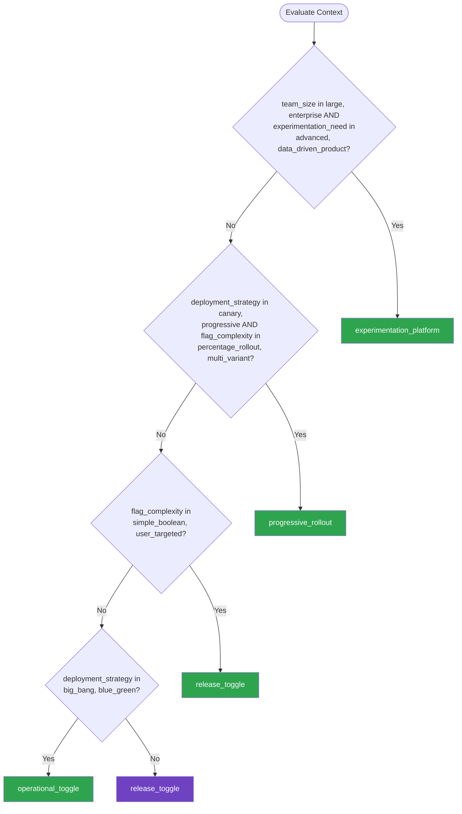

# Feature Flags — Summary

**Purpose**
- Feature flag and progressive delivery patterns for safe deployments, A/B testing, canary releases, and operational toggles
- Scope: flag lifecycle management, targeting rules, technical debt prevention, and integration with CI/CD pipelines

## Related Standards

| Standard | Relationship | Context |
|----------|-------------|---------|
| [ci-cd](../../infrastructure/ci-cd/) | complementary | Feature flags enable trunk-based development and progressive delivery in CI/CD |
| [configuration-management](../../foundational/configuration-management/) | complementary | Feature flags are a specialized form of runtime configuration |
| [logging-observability](../../foundational/logging-observability/) | complementary | Flag evaluation must be observable for debugging and analytics |

## Context Inputs

These inputs drive the decision tree — provide them to get a tailored recommendation.

| Input | Type | Required | Default | Values | Description |
|-------|------|----------|---------|--------|-------------|
| deployment_strategy | enum | yes | progressive | big_bang, blue_green, canary, progressive | Primary deployment and release strategy |
| flag_complexity | enum | yes | simple_boolean | simple_boolean, user_targeted, percentage_rollout, multi_variant | Complexity of flag targeting and rules |
| team_size | enum | yes | medium | small, medium, large, enterprise | Size of the engineering organization |
| experimentation_need | enum | yes | basic | none, basic, advanced, data_driven_product | Need for A/B testing and experimentation |

## Decision Tree

### Mermaid Diagram



### Text Fallback

- **Priority 1** → `experimentation_platform` — when team_size in [large, enterprise] AND experimentation_need in [advanced, data_driven_product]. Large teams with data-driven product development need a full experimentation platform with statistical rigor, mutual exclusion, and automated analysis.
- **Priority 2** → `progressive_rollout` — when deployment_strategy in [canary, progressive] AND flag_complexity in [percentage_rollout, multi_variant]. Progressive delivery with percentage rollouts enables safe deployments with automatic rollback on metric degradation.
- **Priority 3** → `release_toggle` — when flag_complexity in [simple_boolean, user_targeted]. Simple release toggles and user-targeted flags cover most development team needs without complex infrastructure.
- **Priority 4** → `operational_toggle` — when deployment_strategy in [big_bang, blue_green]. Operational toggles as kill switches and graceful degradation controls, independent of deployment strategy.
- **Fallback** → `release_toggle` — Simple release toggles are the safest starting point for any team

> **Confidence**: high | **Risk if wrong**: medium

---

## Patterns

### 1. Release Toggles

> Feature flags that control the visibility of new features in production. Enables trunk-based development by allowing incomplete features to be deployed but hidden. Release toggles are short-lived and should be removed after full rollout.

**Maturity**: standard

**Use when**
- Deploying incomplete features to production (dark launch)
- Trunk-based development with continuous deployment
- Want to decouple deployment from release
- Need to release features to specific users first (beta)

**Avoid when**
- Feature is complete and unconditionally released — remove the flag

**Tradeoffs**

| Pros | Cons |
|------|------|
| Deploy anytime without waiting for feature completion | Technical debt if flags are not cleaned up |
| Instant rollback without redeployment | Code paths become conditional — harder to reason about |
| Test in production with real traffic | Flag configuration becomes a dependency |
| Targeted release to beta users or internal team | |

**Implementation Guidelines**
- Create flag with metadata: owner, creation date, expected removal date, JIRA ticket
- Default to off (feature hidden) for new release flags
- Flag naming convention: {team}_{feature}_{purpose} (e.g., payments_new_checkout_release)
- Implement flag evaluation at the highest level possible (not deep in business logic)
- When flag is on for 100% of users and stable, schedule flag removal
- Set flag expiry alerts: flag older than 30 days without removal plan triggers warning
- Track flag inventory: dashboard showing all flags, their state, age, and owner
- Remove both the flag evaluation AND the old code path when cleaning up

**Common Errors**

| Error | Impact | Fix |
|-------|--------|-----|
| Flags that never get removed | Codebase becomes a maze of conditional logic; no one knows which path is active | Enforce flag lifecycle: creation date, expected removal date, automated stale flag alerts |
| Flag evaluation deep in business logic | Difficult to understand behavior; flag removal requires touching many files | Evaluate flags at the entry point (controller/handler) and pass the result down |

**Standards & References**

| Standard | Type | Role | Reference |
|----------|------|------|-----------|
| Martin Fowler — Feature Toggles | reference | Canonical reference for feature toggle categorization | https://martinfowler.com/articles/feature-toggles.html |

---

### 2. Progressive Rollout (Percentage-Based)

> Gradually roll out a feature to increasing percentages of users. Monitor key metrics at each stage. Automatically pause or rollback if metrics degrade beyond thresholds. Provides safe, data-informed feature releases.

**Maturity**: standard

**Use when**
- Deploying risky or high-impact changes
- Want data-informed rollout decisions
- Need automatic rollback on metric degradation

**Avoid when**
- Feature must be all-or-nothing (database migration)
- Feature has no measurable metrics

**Tradeoffs**

| Pros | Cons |
|------|------|
| Limits blast radius of defective releases | Requires metric monitoring integration |
| Data-informed go/no-go decisions | Percentage targeting must be sticky (same user gets same experience) |
| Automatic rollback reduces incident impact | Slower release timeline than big-bang |
| Builds deployment confidence | |

**Implementation Guidelines**
- Stage rollout: 1% -> 5% -> 25% -> 50% -> 100%
- Soak time at each stage: 1h at 1%, 4h at 5%, 24h at 25%, 48h at 50%
- Sticky targeting: user always gets the same variant (hash user_id % 100)
- Define key metrics: error rate, latency P99, conversion rate, revenue
- Auto-pause if error rate increases >5% or latency P99 increases >20%
- Auto-rollback if critical alerts fire
- Manual promotion gate at 50% -> 100% for final review
- Log flag evaluation with user cohort for analytics

**Common Errors**

| Error | Impact | Fix |
|-------|--------|-----|
| Non-sticky percentage targeting | User sees feature on one request, doesn't see it on next — inconsistent UX | Hash user identifier to determine bucket; same user always in same bucket |
| No automated rollback criteria | Degraded experience rolls out to 100% before anyone notices | Define metric thresholds and wire them to automatic pause/rollback |

**Standards & References**

| Standard | Type | Role | Reference |
|----------|------|------|-----------|
| OpenFeature Specification | standard | Vendor-neutral feature flag evaluation API | https://openfeature.dev/ |

---

### 3. Operational Toggles (Kill Switches)

> Feature flags used as operational controls to degrade or disable functionality in production during incidents. Kill switches provide instant mitigation without redeployment. Operational toggles are long-lived and always present for critical features.

**Maturity**: standard

**Use when**
- Need instant mitigation during incidents
- Expensive features that can be disabled under load
- Third-party integrations that may become unavailable
- Graceful degradation strategy

**Avoid when**
- Core functionality that cannot be degraded (authentication)

**Tradeoffs**

| Pros | Cons |
|------|------|
| Instant incident mitigation without deployment | Must be tested regularly (untested kill switches fail when needed) |
| Graceful degradation under extreme load | Permanently present in codebase |
| Operational flexibility for on-call engineers | Requires operational runbooks documenting which toggles to use when |

**Implementation Guidelines**
- Identify features that can be degraded: search, recommendations, analytics, notifications
- Name clearly: ops_kill_{feature} (e.g., ops_kill_recommendations)
- Default to ON (feature enabled) — toggle to OFF to disable
- Make toggleable from operations dashboard (no code deployment)
- Include in incident runbooks: 'If recommendation service is down, disable ops_kill_recommendations'
- Test kill switches in chaos experiments: verify feature disables cleanly
- Monitor toggle state: alert if critical kill switch is OFF for >1 hour
- Document fallback behavior when each toggle is off

**Common Errors**

| Error | Impact | Fix |
|-------|--------|-----|
| Kill switch never tested | During incident, kill switch doesn't work — disabling causes errors | Test kill switches in chaos experiments; validate fallback path works |
| No documentation of which toggle to use for which scenario | On-call engineer doesn't know which toggles exist or what they do | Runbook per toggle: what it controls, when to use, expected impact |

**Standards & References**

| Standard | Type | Role | Reference |
|----------|------|------|-----------|
| Netflix Feature Flag Practices | reference | Operational toggle patterns at scale | — |

---

### 4. Experimentation Platform (A/B Testing)

> Rigorous A/B testing infrastructure with statistical significance, mutual exclusion, and automated analysis. Enables data-driven product decisions by measuring the impact of changes on key metrics with scientific rigor.

**Maturity**: enterprise

**Use when**
- Product decisions driven by experimentation
- Need statistical confidence in feature impact
- Running multiple concurrent experiments
- Measuring business metrics (conversion, revenue, engagement)

**Avoid when**
- Features with no measurable business metric
- Infrastructure changes where A/B doesn't apply

**Tradeoffs**

| Pros | Cons |
|------|------|
| Data-informed product decisions | Requires sufficient traffic for statistical significance |
| Statistical confidence in results | Complex infrastructure (assignment, logging, analysis) |
| Measures actual impact, not assumptions | Experiments take time to reach significance |

**Implementation Guidelines**
- Define experiment: hypothesis, variants, primary metric, guardrail metrics
- Calculate required sample size for desired statistical power
- Assign users to variants using consistent hashing (sticky assignment)
- Implement mutual exclusion: user in experiment A excluded from experiment B if they share layers
- Log all variant assignments with timestamp for analysis
- Define guardrail metrics: metrics that must NOT degrade (page load time, error rate)
- Run for minimum duration to capture weekly patterns
- Automated significance calculation with multiple comparison correction
- Ship winning variant; remove experiment code

**Common Errors**

| Error | Impact | Fix |
|-------|--------|-----|
| Peeking at results and stopping early when favorable | False positives: apparent significance disappears with more data | Pre-commit to sample size; use sequential testing methods if early stopping is needed |
| No guardrail metrics | Feature improves primary metric but degrades performance or reliability | Always monitor guardrails: latency, error rate, engagement alongside primary metric |

**Standards & References**

| Standard | Type | Role | Reference |
|----------|------|------|-----------|
| Controlled Experiments on the Web | reference | Foundational paper on A/B testing | — |

---

## Examples

### Feature Flag Lifecycle — Release Toggle
**Context**: Implementing a release toggle with proper lifecycle management

**Correct** implementation:
```text
# Feature flag with lifecycle management
from datetime import datetime, timezone

# Flag definition with metadata
FLAG_REGISTRY = {
    "payments_new_checkout_release": {
        "owner": "payments-team",
        "created": "2026-04-01",
        "expected_removal": "2026-05-15",
        "jira": "PAY-1234",
        "type": "release",
        "default": False,
    }
}

# Flag evaluation at the entry point (not deep in logic)
async def checkout_handler(request):
    user = request.authenticated_user

    if feature_flags.is_enabled("payments_new_checkout_release", user):
        return await new_checkout_flow(request)
    else:
        return await legacy_checkout_flow(request)

# Flag stale detection
def check_stale_flags():
    """Alert on flags past expected removal date."""
    for name, meta in FLAG_REGISTRY.items():
        removal_date = datetime.fromisoformat(meta["expected_removal"])
        if datetime.now(timezone.utc).date() > removal_date.date():
            alert(f"Stale flag: {name} (owner: {meta['owner']}, "
                  f"expected removal: {meta['expected_removal']})")

# Progressive rollout
# 1% -> 5% -> 25% -> 50% -> 100%
feature_flags.set_rollout("payments_new_checkout_release", percentage=5)
# After soak period with good metrics:
feature_flags.set_rollout("payments_new_checkout_release", percentage=25)
```

**Incorrect** implementation:
```text
# WRONG: Feature flag anti-patterns
async def checkout_handler(request):
    user = request.user

    # WRONG: Flag deep in business logic (should be at entry point)
    total = calculate_cart_total(request.cart)

    if feature_flags.is_enabled("use_new_tax_calc"):
        # WRONG: No owner, no expiry, no lifecycle management
        tax = new_tax_calculation(total)
    else:
        tax = old_tax_calculation(total)

    # WRONG: Nested flags create combinatorial complexity
    if feature_flags.is_enabled("flag_a"):
        if feature_flags.is_enabled("flag_b"):
            if feature_flags.is_enabled("flag_c"):
                # 8 possible code paths — untestable
                pass

    # WRONG: Flag used as permanent configuration
    if feature_flags.is_enabled("enable_logging"):
        logger.info("processing")
    # This flag will never be removed — use config, not a flag
```

**Why**: The correct implementation has flag metadata (owner, expiry, ticket), evaluates at the entry point, implements progressive rollout, and detects stale flags. The incorrect version has flags deep in logic, nested flags creating combinatorial complexity, no lifecycle management, and misuses flags for permanent configuration.

---

## Security Hardening

### Transport
- Flag evaluation service communication encrypted (TLS)
- Flag configuration changes transmitted over authenticated channels

### Data Protection
- User targeting attributes minimized (hash user_id, don't store PII in flag service)
- Experiment assignment logs do not contain sensitive user data

### Access Control
- Flag creation/modification requires authorized role
- Production flag changes require approval or are audit-logged
- Kill switch toggling restricted to on-call engineers and above

### Input/Output
- Flag evaluation defaults to safe value on service unavailability
- Flag names validated against naming conventions

### Secrets
- Flag service API keys stored in secret manager
- Flag service admin credentials are not shared

### Monitoring
- Log all flag state changes with who, what, when
- Alert on unexpected flag changes in production
- Monitor flag evaluation latency (should be <5ms)

---

## Anti-Patterns

| Anti-Pattern | Severity | Description | Fix |
|-------------|----------|-------------|-----|
| Permanent Feature Flags | high | Feature flags that are never removed after the feature is fully released. Over time the codebase accumulates hundreds of flag evaluations, creating dead code paths and making the system impossible to reason about. | Enforce flag lifecycle: expiry date, stale flag alerts, scheduled cleanup sprints |
| Nested Flag Evaluation | medium | Evaluating multiple feature flags in nested conditionals, creating exponential code paths. With 3 nested boolean flags, there are 8 possible paths — most untested and some with unexpected behavior. | Flatten flag evaluation; avoid nesting; use composite flags if combinations are needed |
| Flags as Configuration | medium | Using feature flags for permanent configuration (log level, connection pool size, timeout values) instead of proper configuration management. These flags will never be removed and misuse the flag system. | Use configuration management for permanent settings; flags are for temporary toggles |

---

## Checklist

| ID | Category | Description | Severity |
|----|----------|-------------|----------|
| FF-01 | reliability | All feature flags have metadata: owner, creation date, expected removal | high |
| FF-02 | reliability | Stale flag detection alerts on flags past expected removal date | high |
| FF-03 | reliability | Flag evaluation at entry points, not deep in business logic | medium |
| FF-04 | reliability | Progressive rollout uses sticky targeting (consistent user experience) | high |
| FF-05 | reliability | Automated rollback criteria defined for progressive rollouts | high |
| FF-06 | reliability | Operational kill switches tested in chaos experiments | high |
| FF-07 | reliability | Flag changes audit-logged with who, what, when | high |
| FF-08 | reliability | Flag service unavailability defaults to safe values | high |

---

## Compliance

| Standard | Relevance |
|----------|-----------|
| OpenFeature Specification | Vendor-neutral feature flag API specification |
| Martin Fowler — Feature Toggles | Canonical reference for feature toggle types and lifecycle |

---

## Prompt Recipes

### Design feature flag strategy for a new project
**Scenario**: greenfield
```text
Design a feature flag strategy for a new project.

Context:
- Team size: [small/medium/large]
- Deployment frequency: [weekly/daily/continuous]
- Experimentation need: [none/basic/advanced]
- Flag service: [self-hosted/LaunchDarkly/Unleash/Flagsmith/Split]

Requirements:
- Flag types and naming conventions
- Lifecycle management (creation, expiry, cleanup)
- Progressive rollout stages
- Operational kill switches
- Flag evaluation architecture (SDK, API, edge)
- Governance and access control
```

### Audit feature flag practices
**Scenario**: audit
```text
Audit feature flag practices:

1. Do flags have metadata (owner, creation date, expected removal)?
2. Are stale flags detected and alerted?
3. Is flag evaluation at entry points (not deep in logic)?
4. Are nested flags avoided?
5. Are flags tested in both on and off states?
6. Are operational kill switches tested in chaos experiments?
7. Is flag evaluation latency monitored?
8. Are flag changes audit-logged?
9. Do progressive rollouts have automated rollback criteria?
10. Is there a flag cleanup process?
```

### Clean up stale feature flags
**Scenario**: operations
```text
Clean up stale feature flags.

Steps:
1. List all flags with creation date, expected removal, current state
2. Identify flags past expected removal date
3. For each stale flag:
   a. Verify it's at 100% rollout or permanently off
   b. Remove flag evaluation code
   c. Remove the unused code path
   d. Remove flag from flag service
   e. Update tests
4. Generate cleanup report (flags removed, code lines removed)
```

### Design an A/B test experiment
**Scenario**: optimization
```text
Design an A/B test experiment.

Experiment definition:
- Hypothesis: [what you expect to happen]
- Primary metric: [what to measure]
- Guardrail metrics: [what must NOT degrade]
- Variants: [control, treatment(s)]
- Target audience: [who to include/exclude]
- Duration: [minimum run time]
- Sample size: [calculated for desired power]
- Success criteria: [statistical significance + practical significance]
```

---

## Links
- Full standard: [feature-flags.yaml](feature-flags.yaml)
