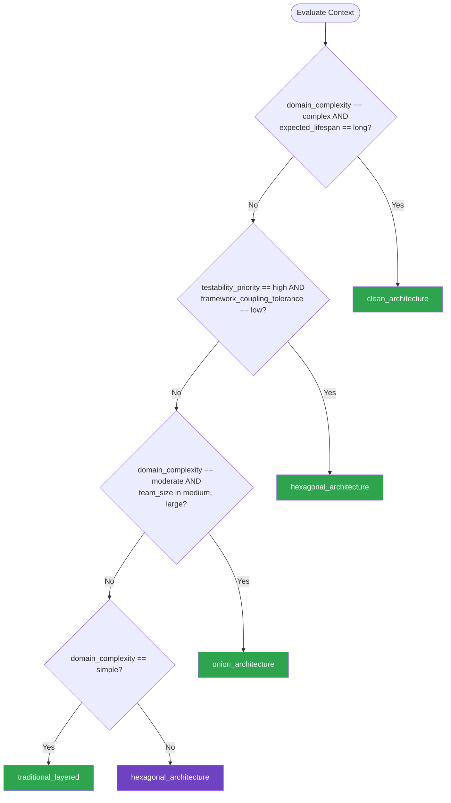

# Layered Architecture — Summary

**Purpose**
- Layered architecture patterns that separate concerns into horizontal or dependency-inverted layers
- Scope: traditional N-tier, clean architecture, hexagonal (ports & adapters), and onion architecture

## Related Standards

| Standard | Relationship | Context |
|----------|-------------|---------|
| [dependency-injection](../dependency-injection/) | complementary | DI is the mechanism that wires layers together while respecting dependency rules |
| [repository-pattern](../repository-pattern/) | complementary | Repository pattern implements the persistence port in hexagonal / clean architecture |
| [domain-driven-design](../domain-driven-design/) | complementary | DDD tactical patterns live in the domain layer of clean / hexagonal architectures |

## Context Inputs

These inputs drive the decision tree — provide them to get a tailored recommendation.

| Input | Type | Required | Default | Values | Description |
|-------|------|----------|---------|--------|-------------|
| team_size | enum | yes | medium | small, medium, large | Size of the development team maintaining the codebase |
| domain_complexity | enum | yes | moderate | simple, moderate, complex | Complexity of business rules and domain logic |
| testability_priority | enum | yes | high | low, medium, high | How critical is unit-testability of business logic in isolation? |
| framework_coupling_tolerance | enum | yes | low | low, medium, high | How acceptable is tight coupling to a specific framework? |
| expected_lifespan | enum | yes | long | short, medium, long | Expected lifespan of the application in years |

## Decision Tree

### Mermaid Diagram



### Text Fallback

- **Priority 1** → `clean_architecture` — when domain_complexity == complex AND expected_lifespan == long. Complex domains with long lifespans benefit most from strict dependency inversion; the domain layer remains framework-agnostic for decades.
- **Priority 2** → `hexagonal_architecture` — when testability_priority == high AND framework_coupling_tolerance == low. Hexagonal architecture naturally produces highly testable code through port interfaces; adapters are swapped in tests.
- **Priority 3** → `onion_architecture` — when domain_complexity == moderate AND team_size in [medium, large]. Onion architecture offers good layer separation without the full ceremony of clean architecture; suitable for most enterprise apps.
- **Priority 4** → `traditional_layered` — when domain_complexity == simple. For simple domains or short-lived projects, traditional layered architecture provides sufficient separation with minimal overhead.
- **Fallback** → `hexagonal_architecture` — Hexagonal is the safest default — good testability, moderate ceremony

> **Confidence**: high | **Risk if wrong**: medium

---

## Patterns

### 1. Clean Architecture

> Concentric ring architecture where dependencies point inward. The innermost ring (entities) has zero external dependencies. Use cases orchestrate entities. Interface adapters translate between use cases and external agencies. Frameworks and drivers live in the outermost ring.

**Maturity**: enterprise

**Use when**
- Complex business domain with many rules and policies
- Application expected to outlive its current framework
- Multiple delivery mechanisms (web, CLI, API, events)
- Regulatory requirements demand auditable business logic

**Avoid when**
- Simple CRUD application with little business logic
- Prototype or short-lived project
- Very small team where ceremony adds overhead

**Tradeoffs**

| Pros | Cons |
|------|------|
| Business logic is framework-agnostic and testable in isolation | More files, interfaces, and indirection than simpler approaches |
| Easy to swap infrastructure (DB, messaging, UI) without touching domain | Mapping between layers adds boilerplate |
| Clear boundaries make code reviews and onboarding easier | Over-engineering risk for simple domains |
| Naturally supports multiple delivery mechanisms | Team must understand dependency rule strictly |

**Implementation Guidelines**
- Entities contain enterprise-wide business rules — no framework imports
- Use cases contain application-specific business rules — one use case per class
- Define port interfaces in the domain layer, implement adapters outside
- Data crosses boundaries via simple DTOs or value objects — never entities
- Dependency injection wires adapters to ports at the composition root

**Common Errors**

| Error | Impact | Fix |
|-------|--------|-----|
| Entities importing framework or ORM annotations | Domain logic becomes coupled to persistence framework | Keep entities as plain objects; map to ORM models in the adapter layer |
| Use cases returning ORM entities to the controller | Leaks persistence details into the delivery layer | Map entities to response DTOs at the use case boundary |
| Skipping the use case layer for simple operations | Business rules scatter into controllers; inconsistent behavior | Even trivial operations should pass through a use case to centralize rules |

**Standards & References**

| Standard | Type | Role | Reference |
|----------|------|------|-----------|
| Clean Architecture (Robert C. Martin) | pattern | Primary architectural pattern defining the dependency rule | https://blog.cleancoder.com/uncle-bob/2012/08/13/the-clean-architecture.html |

---

### 2. Hexagonal Architecture (Ports & Adapters)

> Application core defines ports (interfaces) that external adapters implement. Primary/driving ports are called by the outside (e.g., REST controller), secondary/driven ports are called by the core (e.g., database, messaging).

**Maturity**: advanced

**Use when**
- High testability requirement — tests swap real adapters for fakes
- Multiple integration points with external systems
- Team wants framework independence without full clean architecture ceremony
- Service will be consumed via multiple protocols

**Avoid when**
- Application has very few external dependencies
- Team is unfamiliar with interface-based design

**Tradeoffs**

| Pros | Cons |
|------|------|
| Excellent testability — all external dependencies are behind ports | Port/adapter ceremony for every external dependency |
| Clear separation between what the app does and how it connects | Can feel over-engineered for apps with few integrations |
| Adapters can be developed and tested independently | Requires consistent discipline to keep ports in the right layer |
| Naturally supports test doubles (fakes, stubs, mocks) | |

**Implementation Guidelines**
- Define driving ports as interfaces the application exposes (e.g., OrderService)
- Define driven ports as interfaces the application requires (e.g., OrderRepository)
- Adapters implement ports — one adapter per external system per port
- Application core never imports adapter code — only port interfaces
- Use dependency injection to wire adapters at startup

**Common Errors**

| Error | Impact | Fix |
|-------|--------|-----|
| Putting business logic in adapters | Logic is duplicated across adapters or untestable | Adapters should only translate between external protocols and port contracts |
| Defining ports with framework-specific types | Port is no longer framework-agnostic | Use plain language types in port signatures; adapters handle conversion |

**Standards & References**

| Standard | Type | Role | Reference |
|----------|------|------|-----------|
| Hexagonal Architecture (Alistair Cockburn) | pattern | Primary pattern defining ports and adapters | https://alistair.cockburn.us/hexagonal-architecture/ |

---

### 3. Onion Architecture

> Similar to clean architecture but with concentric layers named Domain Model (center), Domain Services, Application Services, and Infrastructure (outer). All dependencies point inward. Infrastructure is always the outermost layer.

**Maturity**: advanced

**Use when**
- Enterprise application with moderate-to-complex domain
- Team prefers layered naming conventions over ports/adapters vocabulary
- Gradual migration from traditional N-tier to dependency-inverted design

**Avoid when**
- Very simple applications where three layers suffice
- Team is already comfortable with hexagonal or clean architecture

**Tradeoffs**

| Pros | Cons |
|------|------|
| Clear layering model familiar to enterprise developers | Less explicit about port/adapter distinction than hexagonal |
| Infrastructure layer keeps all framework code contained | Layer definitions can blur if not enforced by tooling |
| Good balance between purity and pragmatism | Similar learning curve to clean architecture |

**Implementation Guidelines**
- Domain Model layer contains entities and value objects — zero dependencies
- Domain Services layer contains domain logic that spans multiple entities
- Application Services orchestrate use cases and coordinate domain services
- Infrastructure layer implements persistence, messaging, and framework concerns
- Use interfaces in inner layers; implementations in Infrastructure

**Common Errors**

| Error | Impact | Fix |
|-------|--------|-----|
| Application Services directly accessing database | Bypasses domain layer; business rules not enforced | Application Services call Domain Services, which use repository interfaces |
| Placing validation in Infrastructure layer | Business rules leak out of domain; inconsistent validation | Validation belongs in Domain Model or Domain Services |

**Standards & References**

| Standard | Type | Role | Reference |
|----------|------|------|-----------|
| Onion Architecture (Jeffrey Palermo) | pattern | Layered dependency-inversion pattern | https://jeffreypalermo.com/2008/07/the-onion-architecture-part-1/ |

---

### 4. Traditional Layered (N-Tier) Architecture

> Classic horizontal layering: Presentation → Business Logic → Data Access. Each layer can only call the layer directly below it. Simple, well-understood, suitable for applications with straightforward business rules.

**Maturity**: standard

**Use when**
- Simple CRUD applications with minimal business logic
- Small team or solo developer needs fast delivery
- Short-lived application or prototype
- Framework provides natural layering (e.g., MVC)

**Avoid when**
- Complex domain logic that needs isolation from infrastructure
- Application will outlive its current framework
- Multiple integration points requiring testable boundaries

**Tradeoffs**

| Pros | Cons |
|------|------|
| Simple to understand and implement | Business logic tends to couple to data access patterns |
| Minimal boilerplate and ceremony | Hard to test business rules without infrastructure |
| Maps directly to most web framework conventions | Difficult to swap frameworks or databases |
| Low learning curve for junior developers | Tends to degrade into big ball of mud over time |

**Implementation Guidelines**
- Presentation layer handles HTTP, rendering, and input validation
- Business layer contains all business rules and orchestration
- Data Access layer encapsulates all persistence operations
- Never skip layers — presentation must not call data access directly
- Use interfaces between layers even in simple designs for future flexibility

**Common Errors**

| Error | Impact | Fix |
|-------|--------|-----|
| Controllers containing business logic | Logic duplication; cannot reuse across delivery mechanisms | Extract all business rules into the business layer |
| Business layer returning ORM entities to presentation | Presentation couples to database schema | Map to DTOs or view models at the layer boundary |

**Standards & References**

| Standard | Type | Role | Reference |
|----------|------|------|-----------|
| N-Tier Architecture | pattern | Classic horizontal layering approach | — |

---

## Examples

### Clean Architecture — Use Case with Port and Adapter
**Context**: Implementing a CreateOrder use case with dependency-inverted persistence

**Correct** implementation:
```text
# Domain entity (innermost ring — no framework imports)
class Order:
    def __init__(self, customer_id, items):
        self.customer_id = customer_id
        self.items = items
        self.total = sum(item.price for item in items)
        self.validate()

    def validate(self):
        if not self.items:
            raise DomainError("Order must have at least one item")

# Port (interface in domain layer)
class OrderRepository(Protocol):
    def save(self, order: Order) -> str: ...

# Use case (application layer — depends only on domain)
class CreateOrder:
    def __init__(self, repo: OrderRepository):
        self.repo = repo

    def execute(self, customer_id, items) -> str:
        order = Order(customer_id, items)
        return self.repo.save(order)

# Adapter (infrastructure — implements the port)
class SqlOrderRepository(OrderRepository):
    def save(self, order: Order) -> str:
        record = self.mapper.to_record(order)
        self.db.insert("orders", record)
        return record.id
```

**Incorrect** implementation:
```text
# WRONG: Use case directly uses ORM and framework
class CreateOrderHandler:
    def handle(self, request):
        order = OrderModel(
            customer_id=request.POST["customer_id"],
            items=json.loads(request.POST["items"])
        )
        order.save()  # Direct ORM call in use case
        send_email(order.customer.email)  # Side effect in use case
        return JsonResponse({"id": order.pk})  # Framework type in use case
```

**Why**: The correct version keeps the domain entity and use case free of framework dependencies. The repository port is defined as an interface in the domain; the SQL implementation lives in infrastructure. This allows testing the use case with a fake repository and swapping persistence without touching business logic.

---

### Hexagonal Architecture — Driving and Driven Ports
**Context**: Showing the distinction between driving (primary) and driven (secondary) ports

**Correct** implementation:
```text
# Driving port — what the outside calls into the application
class OrderService(Protocol):
    def place_order(self, cmd: PlaceOrderCommand) -> OrderId: ...

# Driven port — what the application calls out to
class PaymentGateway(Protocol):
    def charge(self, amount: Money, method: PaymentMethod) -> PaymentResult: ...

# Application core implements driving port, depends on driven port
class OrderApplicationService(OrderService):
    def __init__(self, payments: PaymentGateway, orders: OrderRepository):
        self.payments = payments
        self.orders = orders

    def place_order(self, cmd: PlaceOrderCommand) -> OrderId:
        order = Order.create(cmd.customer_id, cmd.items)
        result = self.payments.charge(order.total, cmd.payment_method)
        if not result.success:
            raise PaymentFailed(result.reason)
        return self.orders.save(order)

# Driving adapter (REST controller calls the driving port)
class OrderController:
    def __init__(self, service: OrderService):
        self.service = service

    def post(self, request):
        cmd = PlaceOrderCommand.from_request(request)
        order_id = self.service.place_order(cmd)
        return Response({"id": order_id})

# Driven adapter (implements the driven port)
class StripePaymentGateway(PaymentGateway):
    def charge(self, amount, method):
        return self.stripe_client.create_charge(amount, method)
```

**Incorrect** implementation:
```text
# WRONG: Application core directly calls Stripe SDK
class OrderService:
    def place_order(self, request):
        stripe.Charge.create(  # Direct vendor SDK call in core
            amount=request.total,
            source=request.token
        )
        db.session.add(Order(...))  # Direct DB call in core
        db.session.commit()
```

**Why**: The correct version defines explicit driving and driven ports. The application core depends only on port interfaces. Adapters handle Stripe SDK and database details. Tests can substitute fakes for both payment gateway and repository without touching the application logic.

---

## Security Hardening

### Transport
- Enforce HTTPS for all inter-layer communication when layers are distributed
- Use mTLS between service layers in microservice deployments

### Data Protection
- Domain entities must not expose sensitive fields through public DTOs without explicit mapping
- Apply field-level access control when mapping domain objects to response DTOs

### Access Control
- Authorization checks belong in the application/use-case layer, not in adapters
- Domain layer may enforce domain-level invariants (e.g., ownership checks)

### Input/Output
- Input validation at the adapter/controller boundary before reaching domain
- Output encoding applied in the presentation adapter, not in domain

### Secrets
- Secrets injected via dependency injection at the composition root, never hardcoded in any layer
- Infrastructure adapters read secrets from vault/environment; domain layer is unaware

### Monitoring
- Cross-cutting logging via middleware or decorator — not scattered across layers
- Structured logs include layer context for easy filtering

---

## Anti-Patterns

| Anti-Pattern | Severity | Description | Fix |
|-------------|----------|-------------|-----|
| Big Ball of Mud | critical | No discernible architecture — any module can call any other module. Business logic, persistence, and presentation interleave freely. | Introduce explicit layers with enforced dependency rules and interface boundaries |
| Leaky Abstraction Layers | high | Layer boundaries exist on paper but domain entities carry ORM annotations, framework types, or serialization concerns — breaking isolation. | Use plain domain objects and map to/from infrastructure types at boundaries |
| Anemic Domain Model | medium | Domain entities are data-only objects with no behavior. All business logic resides in service classes, defeating the purpose of a rich domain layer. | Move behavior into entities and value objects; services orchestrate, not compute |
| Layer Skipping | high | Presentation directly calls data access, bypassing the business layer. Common shortcut that scatters business rules across the codebase. | Enforce strict layer-only-calls-next-layer rule; use architecture tests |

---

## Checklist

| ID | Category | Description | Severity |
|----|----------|-------------|----------|
| LA-01 | design | Architecture style explicitly chosen and documented (clean, hexagonal, onion, N-tier) | high |
| LA-02 | design | Dependency rule enforced — inner layers never import from outer layers | critical |
| LA-03 | maintainability | Port interfaces defined for every external dependency | high |
| LA-04 | correctness | Domain entities free of framework annotations and infrastructure imports | high |
| LA-05 | maintainability | DTOs used at every layer boundary — entities never leak across layers | medium |
| LA-06 | reliability | Composition root wires all dependencies; no hidden service-locator calls | high |
| LA-07 | security | Authorization enforced in application/use-case layer, not in adapters | high |
| LA-08 | correctness | Input validation occurs at adapter boundary before reaching domain | high |
| LA-09 | maintainability | Architecture fitness tests enforce layer boundaries in CI | medium |
| LA-10 | observability | Cross-cutting concerns (logging, metrics) applied via middleware, not per-layer duplication | medium |
| LA-11 | design | Layer responsibilities documented and understood by the team | medium |
| LA-12 | compliance | Layering approach aligns with organizational architecture standards | low |

---

## Compliance

| Standard | Relevance |
|----------|-----------|
| ISO/IEC 25010 | Layered architecture directly supports maintainability and modularity quality attributes |
| OWASP Secure Design Principles | Separation of concerns and defense-in-depth align with layered boundaries |

---

## Prompt Recipes

### Generate a new project with clean architecture folder structure
**Scenario**: greenfield
```text
Create a {language} project using Clean Architecture. Set up the following layers:
- Domain: entities, value objects, domain services, repository interfaces
- Application: use cases (one per file), DTOs, port interfaces
- Infrastructure: database adapters, external service adapters, framework config
- Presentation: controllers/handlers, request/response mapping

Apply the dependency rule: inner layers MUST NOT import from outer layers.
Use dependency injection to wire adapters to ports.
Include a composition root that bootstraps all dependencies.
```

### Migrate an existing N-tier application to hexagonal architecture
**Scenario**: migration
```text
I have an existing {language} application using traditional N-tier (controller → service → repository).
Migrate it to hexagonal architecture:

1. Identify current business logic in service classes
2. Extract port interfaces for each external dependency (DB, APIs, messaging)
3. Move business logic into an application core that depends only on ports
4. Create adapter implementations for each port
5. Set up a composition root to wire adapters

Preserve existing behavior. Add tests that use fake adapters to verify
business logic independently of infrastructure.
```

### Audit an existing codebase for layering violations
**Scenario**: audit
```text
Audit this {language} codebase for layered architecture violations:

1. Check dependency direction: do inner layers import from outer layers?
2. Find business logic in controllers or data access layers
3. Identify domain entities with framework annotations (ORM, serialization)
4. Find direct database/API calls in business logic (should use ports)
5. Check for missing DTOs at layer boundaries (entity leaking)

For each violation, classify severity (high/medium/low) and provide a fix.
```

### Generate architecture fitness tests that enforce layer boundaries
**Scenario**: architecture
```text
Generate architecture fitness tests for this {language} project to enforce:

1. Domain layer has zero imports from infrastructure or presentation
2. Application layer imports only from domain
3. Infrastructure layer does not import from presentation
4. All ports defined in domain/application are implemented in infrastructure
5. No circular dependencies between modules

Use {testing_framework} and any architecture testing library available for {language}.
```

---

## Links
- Full standard: [layered-architecture.yaml](layered-architecture.yaml)
