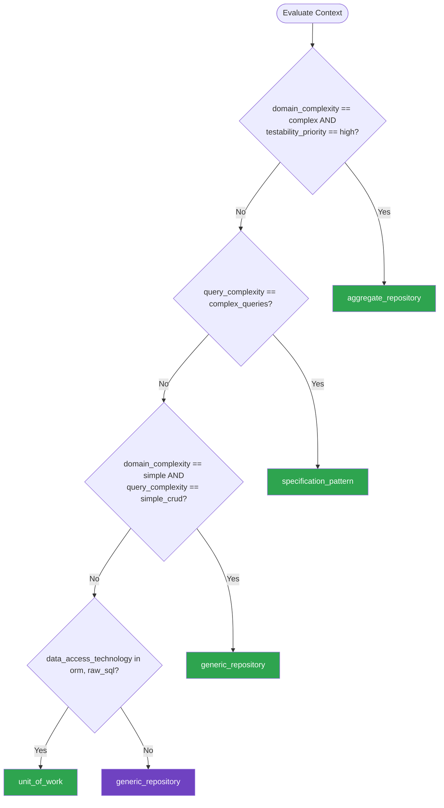

# Repository Pattern — Summary

**Purpose**
- Repository and data access patterns that abstract persistence from domain logic
- Scope: generic repository, specification pattern, unit of work, and query object patterns

## Related Standards

| Standard | Relationship | Context |
|----------|-------------|---------|
| [domain-driven-design](../domain-driven-design/) | complementary | DDD defines aggregate roots that repositories persist and retrieve |
| [dependency-injection](../dependency-injection/) | complementary | Repositories are injected into services via DI to maintain abstraction |
| [layered-architecture](../layered-architecture/) | complementary | Repository implementations live in the infrastructure layer; interfaces in domain |
| [data-persistence](../../foundational/data-persistence/) | complementary | Repository pattern abstracts the data persistence technology choices |

## Context Inputs

These inputs drive the decision tree — provide them to get a tailored recommendation.

| Input | Type | Required | Default | Values | Description |
|-------|------|----------|---------|--------|-------------|
| domain_complexity | enum | yes | moderate | simple, moderate, complex | Complexity of the business domain and query requirements |
| query_complexity | enum | yes | moderate | simple_crud, moderate, complex_queries | How complex are the data query requirements? |
| data_access_technology | enum | yes | orm | raw_sql, orm, document_store, mixed | Primary data access approach |
| testability_priority | enum | yes | high | low, medium, high | How critical is testing persistence logic in isolation? |

## Decision Tree

### Mermaid Diagram



### Text Fallback

- **Priority 1** → `aggregate_repository` — when domain_complexity == complex AND testability_priority == high. Complex domains with DDD aggregates need repositories per aggregate root that load and save complete aggregates.
- **Priority 2** → `specification_pattern` — when query_complexity == complex_queries. Complex query requirements benefit from the specification pattern — composable, testable query criteria.
- **Priority 3** → `generic_repository` — when domain_complexity == simple AND query_complexity == simple_crud. Simple CRUD operations are well-served by a generic repository with standard CRUD operations.
- **Priority 4** → `unit_of_work` — when data_access_technology in [orm, raw_sql]. When multiple repository operations must be atomic, Unit of Work coordinates the transaction across repositories.
- **Fallback** → `generic_repository` — Generic repository is the simplest abstraction with broad applicability

> **Confidence**: high | **Risk if wrong**: medium

---

## Patterns

### 1. Aggregate Repository (DDD)

> One repository per aggregate root. The repository loads and saves the entire aggregate as a unit. No repositories for child entities — they are accessed only through the aggregate root. Enforces DDD aggregate boundaries.

**Maturity**: advanced

**Use when**
- Using DDD with aggregate roots
- Aggregates have complex invariants that must be enforced on load/save
- Need to ensure aggregate consistency boundaries are respected

**Avoid when**
- Simple CRUD without meaningful business rules
- No aggregate root design — entities are independent

**Tradeoffs**

| Pros | Cons |
|------|------|
| Enforces aggregate boundaries at the persistence level | Loading entire aggregates can be expensive for large aggregates |
| Aggregate loaded as a whole — invariants always checked | Query-heavy read paths may need separate read models (CQRS) |
| Clear API: find by ID, save aggregate, delete aggregate | One more abstraction layer on top of ORM |
| Natural fit for event-sourced aggregates | |

**Implementation Guidelines**
- Repository interface defined in domain layer — implementation in infrastructure
- Find methods return complete aggregates, not partial projections
- Save method persists entire aggregate state atomically
- No generic CRUD — repository API reflects aggregate operations
- Use specifications or query objects for complex find criteria

**Common Errors**

| Error | Impact | Fix |
|-------|--------|-----|
| Repository for every entity instead of only aggregate roots | Aggregate boundaries bypassed; child entities modified independently | Only aggregate roots get repositories; access children through the root |
| Repository returning partial aggregates or projections | Aggregate invariants not enforced; inconsistent state | Always load and return complete aggregates; use CQRS read models for projections |

**Standards & References**

| Standard | Type | Role | Reference |
|----------|------|------|-----------|
| DDD Repository Pattern (Eric Evans) | pattern | Persistence abstraction for aggregate roots | — |

---

### 2. Generic Repository

> A reusable repository base providing standard CRUD operations for any entity type. Reduces boilerplate by providing common operations through a generic interface parameterized by entity type.

**Maturity**: standard

**Use when**
- Multiple entities with similar CRUD patterns
- Want to reduce repository boilerplate
- Simple to moderate domain complexity
- ORM-based data access with standard operations

**Avoid when**
- DDD aggregates with complex domain logic — use aggregate repository instead
- Every entity has unique query requirements with no shared patterns

**Tradeoffs**

| Pros | Cons |
|------|------|
| Eliminates boilerplate — standard CRUD for free | May expose operations that shouldn't be allowed (e.g., delete on immutable entities) |
| Consistent API across all entities | Complex queries don't fit the generic interface — need extension points |
| Easy to test with in-memory implementations | Can become a leaky abstraction if ORM specifics leak through |
| Quick to set up for new entities | |

**Implementation Guidelines**
- Define generic interface: find_by_id, find_all, save, delete
- Allow extension: entity-specific repositories extend generic with custom queries
- Use specifications or query objects for dynamic filtering
- Don't force-fit complex domain operations into generic CRUD

**Common Errors**

| Error | Impact | Fix |
|-------|--------|-----|
| Generic repository as the only abstraction — no entity-specific extensions | Complex queries forced through awkward generic methods | Generic base for CRUD; entity-specific interface for domain queries |
| Exposing IQueryable or ORM-specific types through the generic interface | Repository is no longer an abstraction — ORM leaks to consumers | Return domain objects; use specifications for query criteria |

**Standards & References**

| Standard | Type | Role | Reference |
|----------|------|------|-----------|
| Generic Repository Pattern | pattern | Reusable CRUD abstraction | — |

---

### 3. Specification Pattern

> Encapsulates query criteria in reusable, composable specification objects. Specifications can be combined with AND, OR, NOT operators. Keeps query logic testable and out of repository implementations.

**Maturity**: advanced

**Use when**
- Complex, dynamic query requirements
- Query criteria need to be reusable across different contexts
- Business rules determine what data to query
- Need testable query logic without database dependency

**Avoid when**
- Simple CRUD with fixed, straightforward queries
- Team unfamiliar with the pattern — adds learning curve

**Tradeoffs**

| Pros | Cons |
|------|------|
| Query logic is testable without database | Adds abstraction complexity — more classes to manage |
| Specifications are composable — combine with AND, OR, NOT | Translation to SQL/query language can be complex |
| Reusable across repositories and services | Over-engineering for simple queries |
| Business rules in specifications, not scattered in services | |

**Implementation Guidelines**
- Specification encapsulates a single criterion (e.g., IsActiveCustomer)
- Composite specifications combine criteria (e.g., IsActive AND InRegion)
- Repository accepts specification as query parameter
- Infrastructure layer translates specification to SQL/ORM query

**Common Errors**

| Error | Impact | Fix |
|-------|--------|-----|
| Specification containing persistence-specific logic | Specification is coupled to ORM; not testable in isolation | Specification defines criteria in domain terms; translator in infrastructure |

**Standards & References**

| Standard | Type | Role | Reference |
|----------|------|------|-----------|
| Specification Pattern (Eric Evans, Martin Fowler) | pattern | Composable query criteria | — |

---

### 4. Unit of Work

> Maintains a list of objects affected by a business transaction and coordinates writing changes and resolving concurrency issues. Groups multiple repository operations into a single atomic transaction.

**Maturity**: advanced

**Use when**
- Multiple repository operations must be atomic
- Need to track changes across multiple aggregates/entities
- ORM provides change tracking (e.g., EF Core, Hibernate)
- Complex business transactions spanning multiple repositories

**Avoid when**
- Single aggregate operations (aggregate is its own unit of work)
- Event-sourced systems where each aggregate saves independently

**Tradeoffs**

| Pros | Cons |
|------|------|
| Atomic commits across multiple repositories | Can mask performance issues by batching too many changes |
| Change tracking reduces boilerplate save operations | Adds complexity when not needed (single-aggregate operations) |
| Consistent transaction management | Transaction scope can grow too large |

**Implementation Guidelines**
- Unit of Work wraps a database transaction
- Repositories registered with the Unit of Work share the transaction
- Commit once at the end of the business operation
- Rollback on any failure — atomic all-or-nothing
- Keep transaction scope small — don't batch unrelated operations

**Common Errors**

| Error | Impact | Fix |
|-------|--------|-----|
| Unit of Work spanning too many aggregates | Long transactions; lock contention; reduced throughput | Limit to a single bounded context; use domain events for cross-aggregate coordination |
| Forgetting to call commit | Changes never persisted; data loss | Use context manager / using pattern that commits on success, rolls back on exception |

**Standards & References**

| Standard | Type | Role | Reference |
|----------|------|------|-----------|
| Unit of Work Pattern (Martin Fowler) | pattern | Transaction coordination across repositories | https://martinfowler.com/eaaCatalog/unitOfWork.html |

---

## Examples

### Aggregate Repository — Loading and Saving Complete Aggregates
**Context**: Order aggregate with line items persisted as a whole

**Correct** implementation:
```text
# Repository interface — defined in domain layer
class OrderRepository(Protocol):
    def find_by_id(self, order_id: str) -> Order | None: ...
    def save(self, order: Order) -> None: ...
    def next_id(self) -> str: ...

# Infrastructure implementation
class SqlOrderRepository:
    def find_by_id(self, order_id):
        # Load entire aggregate — order + line items + status history
        row = self.db.query("SELECT * FROM orders WHERE id = ?", order_id)
        items = self.db.query("SELECT * FROM line_items WHERE order_id = ?", order_id)
        return OrderMapper.to_domain(row, items)  # Returns complete aggregate

    def save(self, order):
        # Save entire aggregate atomically
        with self.db.transaction():
            self.db.upsert("orders", OrderMapper.to_row(order))
            self.db.delete("line_items", {"order_id": order.id})
            for item in order.line_items:
                self.db.insert("line_items", ItemMapper.to_row(item))

# Usage — aggregate loaded whole, modified, saved whole
class PlaceOrderUseCase:
    def __init__(self, orders: OrderRepository):
        self.orders = orders

    def execute(self, cmd):
        order = Order.create(self.orders.next_id(), cmd.customer_id)
        for item in cmd.items:
            order.add_item(item.product_id, item.quantity, item.price)
        order.submit()
        self.orders.save(order)
```

**Incorrect** implementation:
```text
# WRONG: Separate repositories for entities inside the aggregate
class OrderRepository:
    def save(self, order): ...

class LineItemRepository:  # Should NOT exist — LineItem is inside Order aggregate
    def save(self, item): ...
    def find_by_order(self, order_id): ...
    def delete(self, item_id): ...  # Can delete items bypassing Order rules!

class OrderService:
    def add_item(self, order_id, product_id, qty, price):
        item = LineItem(order_id, product_id, qty, price)
        self.line_item_repo.save(item)  # Bypasses Order.add_item() invariants
```

**Why**: The correct version has a single OrderRepository that loads and saves the complete Order aggregate including line items. Business rules are enforced through the Order aggregate root. The incorrect version has a separate LineItemRepository allowing direct modification of child entities, bypassing the Order's business rules.

---

### Specification Pattern — Composable Query Criteria
**Context**: Finding customers matching complex, dynamic criteria

**Correct** implementation:
```text
# Specification interface
class Specification(Protocol):
    def is_satisfied_by(self, entity) -> bool: ...

# Concrete specifications
class IsActiveCustomer(Specification):
    def is_satisfied_by(self, customer):
        return customer.status == "active"

class InRegion(Specification):
    def __init__(self, region):
        self.region = region
    def is_satisfied_by(self, customer):
        return customer.region == self.region

class HasMinimumOrders(Specification):
    def __init__(self, min_count):
        self.min_count = min_count
    def is_satisfied_by(self, customer):
        return customer.order_count >= self.min_count

# Composite specification
class AndSpecification(Specification):
    def __init__(self, *specs):
        self.specs = specs
    def is_satisfied_by(self, entity):
        return all(s.is_satisfied_by(entity) for s in self.specs)

# Usage — composable, readable, testable
spec = AndSpecification(
    IsActiveCustomer(),
    InRegion("EMEA"),
    HasMinimumOrders(5)
)
eligible_customers = customer_repo.find_matching(spec)
```

**Incorrect** implementation:
```text
# WRONG: Query logic scattered in service methods
class CustomerService:
    def find_eligible_emea(self):
        return self.db.query(
            "SELECT * FROM customers WHERE status = 'active' "
            "AND region = 'EMEA' AND order_count >= 5"
        )
    # Every new query variation = new method with duplicated SQL
    def find_eligible_apac(self):
        return self.db.query(
            "SELECT * FROM customers WHERE status = 'active' "
            "AND region = 'APAC' AND order_count >= 5"
        )
```

**Why**: The correct version encapsulates each criterion in a reusable specification that can be composed dynamically. The incorrect version duplicates query logic for each combination of criteria, leading to combinatorial explosion of methods.

---

## Security Hardening

### Transport
- Database connections use encrypted transport (TLS)
- Connection strings stored securely, not logged

### Data Protection
- Repository never returns more data than the consumer needs
- Sensitive fields encrypted at the repository layer before persistence

### Access Control
- Repository implementations use parameterized queries — never string concatenation
- Multi-tenant repositories enforce tenant isolation at the query level

### Input/Output
- All query parameters validated and sanitized before use
- Specification criteria validated against allowed values

### Secrets
- Database credentials injected via DI — never hardcoded in repository
- Connection pooling configured securely with credential rotation support

### Monitoring
- Slow query detection and alerting at the repository layer
- Repository operation counts and durations exposed as metrics

---

## Anti-Patterns

| Anti-Pattern | Severity | Description | Fix |
|-------------|----------|-------------|-----|
| Repository Per Entity | high | Creating a repository for every database entity instead of per aggregate root. Allows bypassing aggregate invariants by modifying child entities directly. | One repository per aggregate root; access child entities only through the root |
| Leaky Repository Abstraction | medium | Repository interface exposes ORM-specific types (IQueryable, Session, DbSet) or returns ORM entity objects instead of domain objects. | Repository returns domain objects; all ORM specifics contained in implementation |
| God Repository | medium | Single repository class handling queries for multiple unrelated entities. Grows into a massive class with dozens of methods and mixed responsibilities. | Separate repositories per aggregate; use specifications for query variations |
| SQL Injection via Repository | critical | Repository methods using string concatenation or interpolation to build SQL queries with user-provided values. | Always use parameterized queries; validate inputs at repository boundary |

---

## Checklist

| ID | Category | Description | Severity |
|----|----------|-------------|----------|
| RP-01 | design | One repository per aggregate root — not per entity | high |
| RP-02 | design | Repository interface defined in domain layer; implementation in infrastructure | high |
| RP-03 | security | All queries use parameterized statements — no string concatenation | critical |
| RP-04 | correctness | Repository returns domain objects, not ORM entities or raw data | high |
| RP-05 | maintainability | In-memory repository implementations available for unit testing | high |
| RP-06 | correctness | Aggregate loaded and saved as a whole — no partial updates | high |
| RP-07 | reliability | Unit of Work used for multi-aggregate transactional operations | medium |
| RP-08 | performance | N+1 query problems addressed via eager loading or batch queries | high |
| RP-09 | security | Multi-tenant isolation enforced at repository query level | high |
| RP-10 | observability | Repository operations instrumented with timing metrics | medium |
| RP-11 | maintainability | Specification pattern used for complex dynamic queries | low |
| RP-12 | compliance | Repository supports data deletion for right-to-erasure compliance | high |

---

## Compliance

| Standard | Relevance |
|----------|-----------|
| OWASP SQL Injection Prevention | Repository implementations must prevent SQL injection via parameterized queries |
| GDPR | Repository layer must support data deletion and export for right-to-erasure |

---

## Prompt Recipes

### Set up repository pattern for a new project
**Scenario**: greenfield
```text
Implement the repository pattern for a {language} project using {orm}:

1. Define repository interfaces in the domain layer
2. Create infrastructure implementations using {orm}
3. Set up a generic repository base with CRUD operations
4. Add entity-specific repositories extending the generic base
5. Configure DI registration for all repositories
6. Create in-memory implementations for unit testing

Follow DDD: one repository per aggregate root.
Use parameterized queries only — no string concatenation.
```

### Introduce repository pattern to existing direct-database-access code
**Scenario**: migration
```text
Refactor this {language} codebase to use the repository pattern:

1. Find all direct database calls in services and controllers
2. Group related queries by entity/aggregate
3. Extract repository interfaces with appropriate method signatures
4. Move query implementations into repository classes
5. Wire repositories via dependency injection
6. Add unit tests with in-memory repository implementations

Migrate one entity at a time. Ensure no raw SQL in services after migration.
```

### Audit repository implementations for issues
**Scenario**: audit
```text
Audit the repository layer in this {language} project:

1. Find SQL injection vulnerabilities (string concatenation in queries)
2. Check for repository methods returning ORM entities instead of domain objects
3. Identify repositories for non-aggregate-root entities
4. Find N+1 query problems in repository methods
5. Check for missing transaction management (Unit of Work)
6. Verify all repositories have test doubles for unit testing
```

### Implement the specification pattern for complex queries
**Scenario**: architecture
```text
Implement the specification pattern in {language} for the {entity_name} entity:

1. Define a Specification interface with is_satisfied_by method
2. Create concrete specifications for each business criterion
3. Implement AND, OR, NOT composite specifications
4. Add a repository method that accepts specifications
5. Implement specification-to-SQL translation in the infrastructure layer
6. Show unit tests verifying specification logic without database
```

---

## Links
- Full standard: [repository-pattern.yaml](repository-pattern.yaml)
