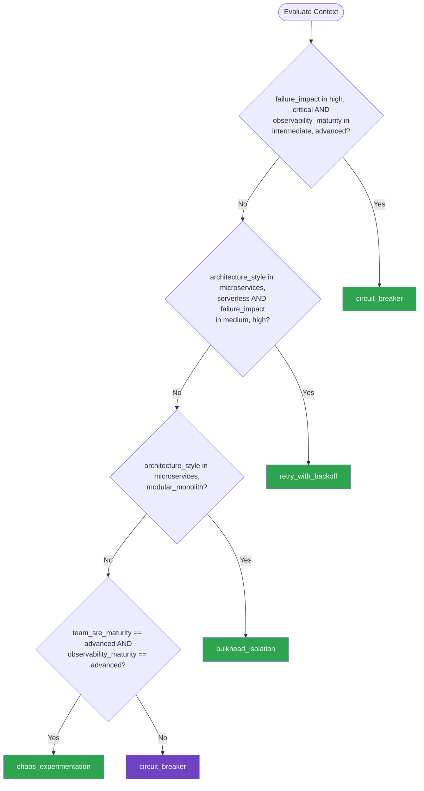

# Resilience & Chaos Engineering — Summary

**Purpose**
- Resilience patterns (circuit breaker, retry, bulkhead, timeout) and chaos engineering practices for building fault-tolerant distributed systems
- Scope: failure detection, graceful degradation, blast-radius reduction, and systematic fault injection

## Related Standards

| Standard | Relationship | Context |
|----------|-------------|---------|
| [error-handling](../../foundational/error-handling/) | prerequisite | Resilience patterns build on top of structured error handling |
| [logging-observability](../../foundational/logging-observability/) | prerequisite | Observability is required to detect failures and measure resilience |
| [service-architecture](../service-architecture/) | complementary | Resilience patterns are essential for distributed service architectures |

## Context Inputs

These inputs drive the decision tree — provide them to get a tailored recommendation.

| Input | Type | Required | Default | Values | Description |
|-------|------|----------|---------|--------|-------------|
| architecture_style | enum | yes | microservices | monolith, modular_monolith, microservices, serverless | System architecture style |
| failure_impact | enum | yes | high | low, medium, high, critical | Impact of downstream service failures |
| observability_maturity | enum | yes | intermediate | basic, intermediate, advanced | Current observability and monitoring capabilities |
| team_sre_maturity | enum | yes | intermediate | beginner, intermediate, advanced | Team experience with reliability engineering |

## Decision Tree

### Mermaid Diagram



### Text Fallback

- **Priority 1** → `circuit_breaker` — when failure_impact in [high, critical] AND observability_maturity in [intermediate, advanced]. High-impact failures need circuit breakers to prevent cascade failures and provide fast fail behavior.
- **Priority 2** → `retry_with_backoff` — when architecture_style in [microservices, serverless] AND failure_impact in [medium, high]. Transient failures in distributed systems are best handled with retry + exponential backoff + jitter.
- **Priority 3** → `bulkhead_isolation` — when architecture_style in [microservices, modular_monolith]. Bulkhead isolation prevents a failing dependency from consuming all resources and affecting other operations.
- **Priority 4** → `chaos_experimentation` — when team_sre_maturity == advanced AND observability_maturity == advanced. Chaos experimentation proactively discovers weaknesses — only for teams with mature SRE practices and observability.
- **Fallback** → `circuit_breaker` — Circuit breaker is the safest starting point for resilience

> **Confidence**: high | **Risk if wrong**: high

---

## Patterns

### 1. Circuit Breaker with Fallback

> Monitors calls to a downstream service. When failures exceed a threshold, the circuit "opens" and all subsequent calls fail fast or return a fallback response — without hitting the failing service. After a cooldown period, the circuit allows a few test calls through (half-open state) to check recovery.

**Maturity**: standard

**Use when**
- Downstream service has known reliability issues
- High-impact failure that would cascade through the system
- Fallback behavior is available (cached data, default response, degraded UX)
- Need to protect upstream resources from wasting time on doomed calls

**Avoid when**
- Downstream failure has no fallback — circuit breaking just changes the error message
- Synchronous request-response is not the integration pattern (use messaging instead)

**Tradeoffs**

| Pros | Cons |
|------|------|
| Prevents cascade failures — failing fast saves resources | Requires meaningful fallback for open-circuit state |
| Gives downstream time to recover without load | Configuration tuning (thresholds, timeouts, cooldown) requires testing |
| Improves overall system response time during outages | False positives: circuit opens on transient issues |
| Observable: circuit state is a leading indicator | Added complexity to every external call |

**Implementation Guidelines**
- Three states: Closed (normal), Open (failing fast), Half-Open (testing recovery)
- Threshold: open circuit after N failures in M seconds (e.g., 5 failures in 30s)
- Cooldown: wait T seconds before testing (half-open) (e.g., 60s)
- Half-open: allow 1-3 test calls; if they succeed, close the circuit
- Fallback strategy: cached data, default response, or degraded feature
- Expose circuit state as a metric and health check
- Alert when circuit opens — it indicates a downstream problem

**Common Errors**

| Error | Impact | Fix |
|-------|--------|-----|
| No fallback for open circuit | Circuit opens but user sees an error anyway — no benefit | Always implement a fallback: cached data, default, or graceful degradation |
| Same circuit for all operations | One failing operation opens the circuit for all operations to that service | Separate circuits per operation or endpoint |

**Standards & References**

| Standard | Type | Role | Reference |
|----------|------|------|-----------|
| Microsoft Cloud Design Patterns — Circuit Breaker | pattern | Primary reference for circuit breaker implementation | https://learn.microsoft.com/en-us/azure/architecture/patterns/circuit-breaker |

---

### 2. Retry with Exponential Backoff

> Automatically retry failed operations with increasing delays between attempts. Jitter (randomized delay) prevents thundering herd when multiple clients retry simultaneously. Essential for handling transient failures in distributed systems.

**Maturity**: standard

**Use when**
- Transient failures are common (network blips, temporary overload)
- Operation is idempotent (safe to retry)
- Downstream service is expected to recover quickly
- Network communication between services

**Avoid when**
- Operation is not idempotent (retry could cause duplicates)
- Failure is permanent (bad request, authentication failure)
- Very time-sensitive operations where retries add unacceptable latency

**Tradeoffs**

| Pros | Cons |
|------|------|
| Handles transient failures transparently | Adds latency for permanent failures (retries waste time) |
| Exponential backoff gives service time to recover | Without idempotency, retries can cause duplicate operations |
| Jitter prevents thundering herd | Total retry time can exceed user's patience (timeout needed) |
| Simple to implement with standard libraries | |

**Implementation Guidelines**
- Classify errors: retry only transient failures (5xx, timeout, connection reset)
- Do NOT retry: 4xx client errors (bad request, auth failure, not found)
- Exponential backoff: delay = base * 2^attempt (e.g., 100ms, 200ms, 400ms, 800ms)
- Add jitter: delay = random(0, calculated_delay) to prevent thundering herd
- Set maximum retries (e.g., 3-5 attempts)
- Set overall timeout: cancel all retries after T seconds
- Ensure operations are idempotent before enabling retries

**Common Errors**

| Error | Impact | Fix |
|-------|--------|-----|
| Retrying non-idempotent operations | Duplicate orders, double payments, repeated side effects | Ensure idempotency (idempotency keys) before enabling retries |
| Retrying non-transient errors (400 Bad Request) | Wasted resources; will never succeed no matter how many retries | Classify errors; only retry transient failures (5xx, timeouts) |
| No jitter on backoff | Thundering herd: all clients retry at exact same time, overwhelming service | Add random jitter: random(0, calculated_delay) |

**Standards & References**

| Standard | Type | Role | Reference |
|----------|------|------|-----------|
| AWS Exponential Backoff and Jitter | reference | Implementation guide for backoff with jitter | https://aws.amazon.com/blogs/architecture/exponential-backoff-and-jitter/ |

---

### 3. Bulkhead Isolation

> Partition system resources into isolated pools (bulkheads) so that a failure in one pool does not exhaust resources used by others. Named after ship bulkheads that prevent flooding from spreading. Applied to thread pools, connection pools, and process-level isolation.

**Maturity**: advanced

**Use when**
- Multiple downstream dependencies with different reliability profiles
- One slow dependency can consume all available threads/connections
- Need to guarantee resources for critical operations
- System handles mixed workloads (critical + non-critical)

**Avoid when**
- Single downstream dependency — nothing to isolate
- System is not resource-constrained

**Tradeoffs**

| Pros | Cons |
|------|------|
| Failure in one dependency doesn't affect others | Resource fragmentation — reserved capacity may be underutilized |
| Critical operations get guaranteed resources | More complex configuration and monitoring |
| Limits blast radius of slow operations | Requires understanding workload resource profiles |
| Complements circuit breakers well | |

**Implementation Guidelines**
- Identify dependencies and their resource consumption patterns
- Create separate thread pools / connection pools per dependency or workload
- Size bulkheads based on measured traffic patterns and SLAs
- Reject requests when bulkhead is full (fast failure) rather than queueing indefinitely
- Monitor bulkhead utilization: near-capacity means right-sizing or dependency issue

**Common Errors**

| Error | Impact | Fix |
|-------|--------|-----|
| Bulkheads too small | Legitimate traffic rejected even when overall system has capacity | Size based on measured peak load + headroom; monitor rejection rates |
| Shared thread pool for all HTTP calls | One slow dependency starves others — defeats the purpose | Dedicated pools per dependency; reject when pool exhausted |

**Standards & References**

| Standard | Type | Role | Reference |
|----------|------|------|-----------|
| Microsoft Cloud Design Patterns — Bulkhead | pattern | Bulkhead isolation pattern | https://learn.microsoft.com/en-us/azure/architecture/patterns/bulkhead |

---

### 4. Chaos Experimentation

> Systematically inject failures into production (or production-like) systems to discover weaknesses before they cause outages. Follow the scientific method: hypothesis, experiment, measure, learn. Build confidence that the system can withstand real-world turbulence.

**Maturity**: enterprise

**Use when**
- Mature observability and monitoring in place
- Team has SRE practices and incident response procedures
- Need to validate resilience patterns actually work under failure
- Want to discover unknown failure modes proactively

**Avoid when**
- No observability — can't measure experiment impact
- No incident response — can't stop experiments safely
- Team is new to reliability engineering

**Tradeoffs**

| Pros | Cons |
|------|------|
| Discovers unknown failure modes before users do | Requires mature operational practices to run safely |
| Validates that resilience patterns (circuit breakers, retries) work | Risk of real user impact if experiments are poorly scoped |
| Builds team confidence in system reliability | Requires investment in chaos tooling and experiment frameworks |
| Creates institutional knowledge of system behavior under stress | |

**Implementation Guidelines**
- Start in non-production: staging, load test environment
- Define steady state: what "normal" looks like in metrics
- Form hypothesis: "When X fails, the system will Y"
- Scope blast radius: target one service, one region, limited traffic
- Automated rollback: kill switch to stop experiment immediately
- Monitor closely during experiment: dashboards, alerts, on-call awareness
- Run experiments during business hours with team present
- Graduate to production only after staging experiments are mature

**Common Errors**

| Error | Impact | Fix |
|-------|--------|-----|
| Chaos experiments without observability | Can't measure impact; don't know if experiment caused harm | Establish observability first: metrics, traces, and dashboards before chaos |
| No automated kill switch | Experiment causes prolonged outage because it can't be stopped | Every experiment has an automated abort condition and manual kill switch |

**Standards & References**

| Standard | Type | Role | Reference |
|----------|------|------|-----------|
| Principles of Chaos Engineering | standard | Foundational principles for chaos experimentation | https://principlesofchaos.org/ |

---

## Examples

### Circuit Breaker — Product Catalog Fallback to Cache
**Context**: Product catalog service calling a recommendation engine that occasionally fails

**Correct** implementation:
```text
# Circuit breaker with fallback to cached recommendations
class RecommendationClient:
    def __init__(self, cache, circuit_breaker):
        self.cache = cache
        self.cb = circuit_breaker  # threshold=5 failures in 30s, cooldown=60s

    def get_recommendations(self, user_id, product_id):
        try:
            result = self.cb.call(
                lambda: self.http_client.get(
                    f"/recommendations/{product_id}",
                    params={"user_id": user_id},
                    timeout=2.0  # 2 second timeout per call
                )
            )
            # Cache successful responses for fallback
            self.cache.set(f"recs:{product_id}", result, ttl=3600)
            return result
        except CircuitOpenError:
            # Circuit is open — use fallback immediately (don't even try)
            return self.get_fallback(product_id)
        except TimeoutError:
            return self.get_fallback(product_id)

    def get_fallback(self, product_id):
        # Try cached recommendations first
        cached = self.cache.get(f"recs:{product_id}")
        if cached:
            return cached
        # Last resort: return popular items (always available)
        return self.cache.get("popular_items")

# Circuit breaker state exposed as health check and metric
# GET /health -> includes { "recommendations_circuit": "closed" }
# Metric: circuit_breaker_state{service="recommendations"} = 0|1|2
```

**Incorrect** implementation:
```text
# WRONG: No circuit breaker; every request waits for timeout
class RecommendationClient:
    def get_recommendations(self, user_id, product_id):
        try:
            return self.http_client.get(
                f"/recommendations/{product_id}",
                timeout=30.0  # Way too long timeout
            )
        except Exception:
            return []  # Silent failure, no caching, no metrics

# When recommendation service is down:
# - Every request waits 30 seconds (user gives up after 3)
# - Thread pool exhausted waiting on timeouts
# - Entire product page becomes unresponsive
# - No one knows the circuit should be open
```

**Why**: The correct implementation uses a circuit breaker that opens after 5 failures, redirecting subsequent calls to cached data without waiting for timeouts. The circuit state is observable. The incorrect version waits 30 seconds per timeout, exhausts thread pools, and makes the entire page unresponsive when the recommendation service is down.

---

## Security Hardening

### Transport
- Timeout on all external calls — no unbounded waits
- Connection pools with hard limits prevent resource exhaustion

### Data Protection
- Fallback responses do not expose internal error details
- Cached fallback data has same access controls as live data

### Access Control
- Chaos experiments require explicit authorization and audit trail
- Experiment scope limited by role — production chaos requires senior approval

### Input/Output
- Retry logic does not replay sensitive data in logs
- Circuit breaker state changes logged with context (which endpoint, failure count)

### Secrets
- Retry logic does not log request bodies that may contain secrets
- Chaos experiment configurations stored securely

### Monitoring
- Circuit breaker state changes generate alerts
- Retry attempt counts and reasons tracked as metrics
- Bulkhead utilization and rejection rates monitored
- Chaos experiment results documented and reviewed

---

## Anti-Patterns

| Anti-Pattern | Severity | Description | Fix |
|-------------|----------|-------------|-----|
| Retry Storm | high | Unbounded retries without backoff or jitter cause a thundering herd that overwhelms the already-struggling downstream service, turning a partial failure into a complete outage. | Exponential backoff with jitter; maximum retry count; circuit breaker to stop retries when service is down |
| Missing Timeout | critical | No timeout on external calls. A hanging downstream service holds resources indefinitely, eventually exhausting thread pools and causing cascading failure. | Set timeouts on every external call: connection timeout + request timeout; use circuit breaker |
| Chaos Without Observability | high | Running chaos experiments without sufficient monitoring. Team can't tell if the experiment is causing harm or if the system is degrading. | Establish observability baseline first: metrics, dashboards, alerts; only then introduce chaos |

---

## Checklist

| ID | Category | Description | Severity |
|----|----------|-------------|----------|
| RES-01 | reliability | Circuit breaker implemented for all critical downstream dependencies | high |
| RES-02 | reliability | Circuit breaker has meaningful fallback behavior (not just error message) | high |
| RES-03 | reliability | Retry with exponential backoff and jitter for transient failures | high |
| RES-04 | correctness | Retries only for idempotent operations and transient errors | critical |
| RES-05 | reliability | Timeouts configured on every external call (connection + request) | critical |
| RES-06 | reliability | Bulkhead isolation for dependencies with different reliability profiles | medium |
| RES-07 | observability | Circuit breaker state, retry counts, and bulkhead utilization monitored | high |
| RES-08 | reliability | Chaos experiments have automated kill switches and blast radius limits | high |
| RES-09 | operations | Fallback behavior tested regularly (not just during incidents) | medium |
| RES-10 | compliance | Chaos experiment results documented with findings and remediations | medium |

---

## Compliance

| Standard | Relevance |
|----------|-----------|
| Principles of Chaos Engineering | Foundational principles for running chaos experiments safely and effectively |
| Microsoft Cloud Design Patterns | Reference patterns for circuit breaker, retry, and bulkhead |

---

## Prompt Recipes

### Add resilience patterns to an existing service
**Scenario**: brownfield
```text
Add resilience patterns to this {language} service:

1. Identify all external dependencies (HTTP calls, database, messaging)
2. Add timeouts to every external call
3. Implement circuit breakers for critical dependencies
4. Add retry with exponential backoff for idempotent operations
5. Implement bulkhead isolation for independent dependency pools
6. Add fallback behavior for each circuit breaker
7. Expose resilience metrics (circuit state, retry counts, bulkhead utilization)

Use {resilience_library} for implementation.
```

### Design a chaos experiment
**Scenario**: operations
```text
Design a chaos experiment for the {service_name} service:

1. Define steady state: what metrics indicate normal behavior?
2. Hypothesis: "When {failure_scenario}, the system will {expected_behavior}"
3. Experiment scope:
   - Target: {specific component or dependency}
   - Blast radius: {percentage of traffic or instances}
   - Duration: {experiment length}
4. Abort conditions: {metrics thresholds that trigger kill switch}
5. Monitoring plan: {dashboards and alerts to watch}
6. Expected findings and remediation plan
```

### Audit resilience patterns for completeness
**Scenario**: audit
```text
Audit resilience patterns in this {language} service:

1. Do all external calls have timeouts? (connection + request)
2. Are circuit breakers in place for critical dependencies?
3. Do circuit breakers have meaningful fallbacks?
4. Are retries limited and using exponential backoff with jitter?
5. Are only idempotent operations retried?
6. Is bulkhead isolation used for mixed workloads?
7. Are resilience metrics monitored and alerted on?
8. Are fallback paths tested regularly?
```

### Implement circuit breaker for a specific dependency
**Scenario**: greenfield
```text
Implement a circuit breaker for the {dependency_name} integration in {language}:

1. Configure thresholds:
   - Failure threshold: {N} failures in {M} seconds to open
   - Cooldown period: {T} seconds before half-open
   - Success threshold: {S} successes in half-open to close
2. Implement fallback behavior for open circuit
3. Expose circuit state as health check endpoint
4. Add metrics: state transitions, call counts, latency
5. Add alerting: alert when circuit opens

Use {resilience_library} (e.g., Polly, resilience4j, Hystrix).
```

---

## Links
- Full standard: [resilience-chaos-engineering.yaml](resilience-chaos-engineering.yaml)
