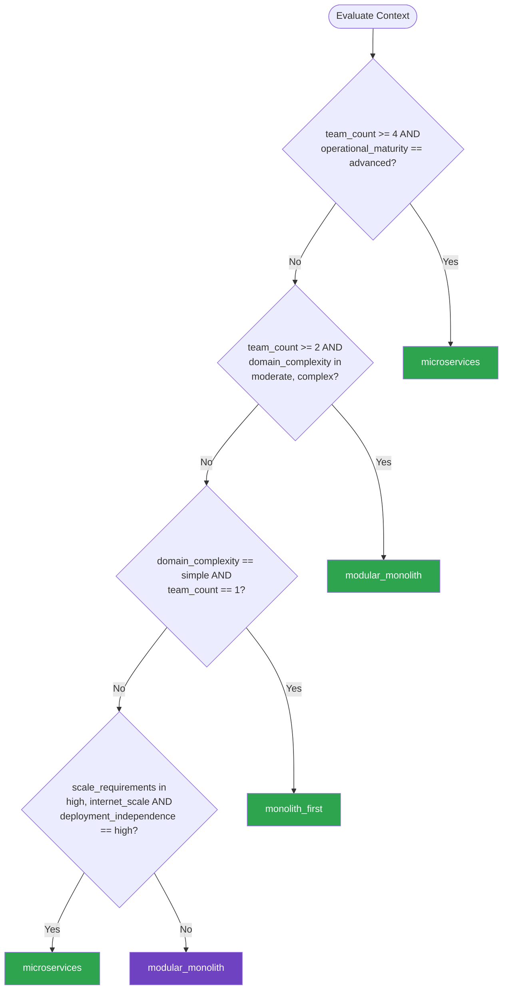

# Service Architecture — Summary

**Purpose**
- Service decomposition patterns for choosing between monolith, modular monolith, microservices, and their transitions
- Scope: service boundaries, inter-service communication, data ownership, and evolutionary architecture paths

## Related Standards

| Standard | Relationship | Context |
|----------|-------------|---------|
| [domain-driven-design](../domain-driven-design/) | complementary | Bounded contexts from DDD define service boundaries |
| [messaging-events](../../foundational/messaging-events/) | complementary | Async messaging enables loose coupling between services |
| [api-design](../../foundational/api-design/) | prerequisite | Service interfaces follow API design standards |
| [error-handling](../../foundational/error-handling/) | complementary | Distributed error handling across service boundaries |

## Context Inputs

These inputs drive the decision tree — provide them to get a tailored recommendation.

| Input | Type | Required | Default | Values | Description |
|-------|------|----------|---------|--------|-------------|
| team_count | integer | yes | 1 | — | Number of independent teams building the system |
| domain_complexity | enum | yes | moderate | simple, moderate, complex | Complexity of the business domain |
| scale_requirements | enum | yes | moderate | low, moderate, high, internet_scale | Expected traffic and scaling needs |
| deployment_independence | enum | yes | moderate | low, moderate, high | How critical is it to deploy components independently? |
| operational_maturity | enum | yes | intermediate | beginner, intermediate, advanced | Team maturity in DevOps and distributed systems operations |

## Decision Tree

### Mermaid Diagram



### Text Fallback

- **Priority 1** → `microservices` — when team_count >= 4 AND operational_maturity == advanced. Multiple independent teams with advanced operations benefit from microservices: independent deployment, scaling, and technology choices.
- **Priority 2** → `modular_monolith` — when team_count >= 2 AND domain_complexity in [moderate, complex]. Modular monolith gives domain separation without distributed system complexity — ideal stepping stone.
- **Priority 3** → `monolith_first` — when domain_complexity == simple AND team_count == 1. Single team with simple domain: start with a monolith and extract services when boundaries become clear.
- **Priority 4** → `microservices` — when scale_requirements in [high, internet_scale] AND deployment_independence == high. Internet-scale workloads requiring independent deployment benefit from microservices even with smaller teams.
- **Fallback** → `modular_monolith` — Modular monolith is the safest default — gives structure without distributed complexity

> **Confidence**: high | **Risk if wrong**: high

---

## Patterns

### 1. Microservices Architecture

> Independently deployable services, each owning its data and communicating via well-defined APIs or asynchronous messaging. Services are organized around business capabilities, not technical layers. Each service can be built, tested, deployed, and scaled independently.

**Maturity**: enterprise

**Use when**
- Multiple independent teams need autonomous deployment
- Different components have different scaling requirements
- Domain has clear bounded contexts with distinct data ownership
- Organization needs polyglot technology choices per service
- Internet-scale with different availability requirements per capability

**Avoid when**
- Small team (1-2 developers) — overhead outweighs benefits
- Domain boundaries are unclear — premature decomposition
- Team lacks distributed systems operational experience
- Simple CRUD application with uniform scaling needs

**Tradeoffs**

| Pros | Cons |
|------|------|
| Independent deployment and scaling | Network latency and partial failure complexity |
| Team autonomy — own tech stack, release cycle | Data consistency across services is challenging |
| Fault isolation — one service failure doesn't take down all | Operational overhead: monitoring, tracing, deployment per service |
| Evolutionary — replace one service without affecting others | Testing across service boundaries is harder |

**Implementation Guidelines**
- One service per bounded context — service owns its data completely
- Prefer async communication (events) over sync (REST/gRPC) between services
- Each service has its own database — no shared databases
- API gateway for external consumers; service mesh for internal communication
- Implement circuit breakers and retries for inter-service calls
- Correlation IDs in all requests for distributed tracing
- Contract tests between services — avoid integration test environments

**Common Errors**

| Error | Impact | Fix |
|-------|--------|-----|
| Shared database between services | Tight coupling; schema changes break multiple services; defeats independence | Each service owns its database; share data via APIs or events |
| Synchronous chains (A calls B calls C calls D) | Latency compounds; any failure breaks the chain; hard to reason about | Use async events; choreography over orchestration; avoid deep call chains |
| Too many fine-grained services | Operational overhead explosion; distributed monolith | Start coarser; split only when there's a clear independent deployment or scaling need |

**Standards & References**

| Standard | Type | Role | Reference |
|----------|------|------|-----------|
| 12-Factor App | standard | Foundational practices for cloud-native services | https://12factor.net/ |
| OWASP API Security | standard | Security practices for service APIs | https://owasp.org/www-project-api-security/ |

---

### 2. Modular Monolith

> Single deployable unit with strict internal module boundaries. Each module owns its data, exposes a well-defined API, and communicates with other modules through explicit interfaces — not direct database access. The monolith is modular: easy to extract into services later.

**Maturity**: advanced

**Use when**
- Domain has identifiable bounded contexts but team is not ready for distributed systems
- 2-5 developers who want domain separation without operational complexity
- Want the option to extract services later — modular design prepares for it
- Starting a new project where domain boundaries will emerge over time

**Avoid when**
- Need independent deployment now (different release cadences per module)
- Different modules need fundamentally different scaling profiles

**Tradeoffs**

| Pros | Cons |
|------|------|
| Domain separation without distributed complexity | Single deployment unit — all modules must deploy together |
| In-process communication — no network latency | Shared runtime: one module's memory leak affects all |
| Simpler testing: all modules in one process | Requires discipline to maintain module boundaries (easy to cheat) |
| Easy to extract to microservices when ready | Shared database runtime may tempt cross-module queries |

**Implementation Guidelines**
- Each module has a public API (interfaces) and private internals
- Modules communicate only through public APIs — never access another module's database tables
- Use in-process events for cross-module notifications
- Module data isolation: separate schemas, separate ORM contexts, or table-prefix conventions
- Enforce boundaries with architecture tests (e.g., ArchUnit)
- Each module has its own integration tests

**Common Errors**

| Error | Impact | Fix |
|-------|--------|-----|
| Modules directly querying each other's database tables | Tight coupling; module boundaries are just folders, not real boundaries | Enforce data isolation: each module's tables are private; access via API only |
| No architecture tests enforcing boundaries | Module boundaries erode over time as developers take shortcuts | Use ArchUnit or similar to enforce import rules and dependency directions |

**Standards & References**

| Standard | Type | Role | Reference |
|----------|------|------|-----------|
| Modular Monolith (Simon Brown) | pattern | Architecture pattern for structured monoliths | — |

---

### 3. Monolith First (Start Simple)

> Start with a simple monolith and extract services only when clear boundaries emerge through real usage. Avoid premature decomposition. The monolith provides fast iteration, simple debugging, and easy deployment while domain understanding grows.

**Maturity**: standard

**Use when**
- New project with uncertain domain boundaries
- Small team (1-3 developers)
- Need to iterate quickly on product-market fit
- Domain experts not available for upfront bounded context analysis

**Avoid when**
- Domain boundaries are well-known from prior experience
- Multiple teams need independent deployment from day one
- Regulatory requirements mandate service isolation

**Tradeoffs**

| Pros | Cons |
|------|------|
| Fastest time to first release | May accumulate technical debt if not modularized |
| Simplest debugging and testing | Extraction to services later requires refactoring |
| Single deployment pipeline | Scaling requires scaling everything together |
| Domain boundaries emerge from real usage, not speculation | |

**Implementation Guidelines**
- Start with a well-organized monolith — not a big ball of mud
- Use package/namespace organization by domain area
- Keep business logic separated from infrastructure (clean architecture)
- When a module needs independent scaling or deployment, extract it
- Extraction signals: different release cadence, different team ownership, different scaling profile

**Common Errors**

| Error | Impact | Fix |
|-------|--------|-----|
| Monolith without any module organization | Big ball of mud — impossible to extract anything later | Organize by domain from day one even in a monolith |
| Staying monolith too long when team and domain have outgrown it | Developer productivity drops; long build times; merge conflicts | Monitor for extraction signals and extract proactively |

**Standards & References**

| Standard | Type | Role | Reference |
|----------|------|------|-----------|
| MonolithFirst (Martin Fowler) | pattern | Strategy for starting with a monolith | https://martinfowler.com/bliki/MonolithFirst.html |

---

### 4. Distributed Monolith (Anti-Pattern Recognition)

> Recognizes the anti-pattern of services that are independently deployed but tightly coupled — requiring coordinated deployments, sharing databases, or making synchronous chains. Looks like microservices but has none of the benefits and all of the complexity.

**Maturity**: standard

**Use when**
- Auditing existing microservice architecture for coupling issues
- Team suspects they have a distributed monolith
- Planning remediation of coupled services

**Avoid when**
- Not applicable as a target architecture — this is an anti-pattern to detect and fix

**Tradeoffs**

| Pros | Cons |
|------|------|
| Recognition of the pattern is the first step to fixing it | — |
| Clear diagnostic criteria help teams identify the problem | — |

**Implementation Guidelines**
- Detect: services that must be deployed together (lock-step releases)
- Detect: shared database accessed by multiple services
- Detect: synchronous call chains (A → B → C → D) where any failure breaks all
- Detect: shared libraries containing business logic
- Remediate: introduce async events to break synchronous coupling
- Remediate: migrate to per-service databases with data replication
- Remediate: consider re-merging overly fine-grained services into a modular monolith

**Common Errors**

| Error | Impact | Fix |
|-------|--------|-----|
| Treating symptoms (slow deploys) without addressing coupling | Problems recur; team adds more process instead of fixing architecture | Address root cause: shared database, synchronous chains, shared business logic |

**Standards & References**

| Standard | Type | Role | Reference |
|----------|------|------|-----------|
| Distributed Monolith Anti-pattern | anti-pattern | Pattern recognition for tightly coupled microservices | — |

---

## Examples

### Service Boundaries Defined by Domain Events
**Context**: E-commerce system with Orders, Payments, and Shipping as separate services communicating via events

**Correct** implementation:
```text
# Order Service — publishes events when order state changes
class OrderService:
    def place_order(self, cmd):
        order = Order.create(cmd.customer_id, cmd.items)
        self.order_repo.save(order)
        # Publish event — other services react asynchronously
        self.event_bus.publish(OrderPlaced(
            order_id=order.id,
            customer_id=order.customer_id,
            items=order.items,
            total=order.total,
            timestamp=now()
        ))
        return order.id

# Payment Service — subscribes to OrderPlaced, publishes PaymentProcessed
class PaymentEventHandler:
    def handle_order_placed(self, event: OrderPlaced):
        result = self.payment_gateway.charge(event.customer_id, event.total)
        if result.success:
            self.event_bus.publish(PaymentProcessed(
                order_id=event.order_id,
                payment_id=result.payment_id
            ))
        else:
            self.event_bus.publish(PaymentFailed(
                order_id=event.order_id,
                reason=result.reason
            ))

# Shipping Service — subscribes to PaymentProcessed
class ShippingEventHandler:
    def handle_payment_processed(self, event: PaymentProcessed):
        shipment = Shipment.create_for_order(event.order_id)
        self.shipment_repo.save(shipment)

# Each service owns its own database
# Services are loosely coupled via events
# Any service can fail without immediately affecting others
```

**Incorrect** implementation:
```text
# WRONG: Synchronous call chain
class OrderService:
    def place_order(self, cmd):
        order = Order.create(cmd.customer_id, cmd.items)
        self.order_repo.save(order)

        # Synchronous call to payment — blocks until done
        payment_result = self.payment_client.charge(order.total)
        if not payment_result.success:
            raise PaymentFailed()

        # Synchronous call to shipping — blocks until done
        self.shipping_client.create_shipment(order.id)

        # All three services must be up; any failure = order fails
        # Payment or Shipping downtime = Order service is down too
        return order.id
```

**Why**: The correct version uses domain events for async communication. Services are independent: payment failure doesn't prevent order creation (it publishes a PaymentFailed event for compensation). The incorrect version creates a synchronous chain where any downstream failure cascades to the caller.

---

### Modular Monolith — Module Boundaries with Internal APIs
**Context**: Setting up a modular monolith with strict module boundaries

**Correct** implementation:
```text
# Module structure — each module exposes a public API
project/
├── modules/
│   ├── orders/
│   │   ├── api.py          # Public interface (what other modules call)
│   │   ├── models.py       # Private: Order, LineItem entities
│   │   ├── repository.py   # Private: OrderRepository
│   │   └── events.py       # Events this module publishes
│   ├── payments/
│   │   ├── api.py          # Public interface
│   │   ├── models.py       # Private: Payment, Refund entities
│   │   └── handlers.py     # Private: event handlers
│   └── shipping/
│       ├── api.py          # Public interface
│       └── ...

# orders/api.py — the ONLY thing other modules can import
class OrderModule:
    def place_order(self, customer_id, items) -> str: ...
    def get_order_status(self, order_id) -> str: ...

# payments/handlers.py — reacts to order events via in-process bus
class PaymentHandler:
    def on_order_placed(self, event: OrderPlaced):
        self.payment_module.process_payment(event.order_id, event.total)

# Architecture test enforcing boundaries
def test_module_boundaries():
    """No module imports another module's internals."""
    for module in ["orders", "payments", "shipping"]:
        imports = get_all_imports(f"modules/{module}/")
        for imp in imports:
            for other in ["orders", "payments", "shipping"]:
                if other != module:
                    assert not imp.startswith(f"modules.{other}.models")
                    assert not imp.startswith(f"modules.{other}.repository")
                    # Only api.py imports are allowed
```

**Incorrect** implementation:
```text
# WRONG: Modules reach into each other's internals
from modules.orders.models import Order  # Direct import of internal model
from modules.orders.repository import OrderRepository  # Direct DB access

class PaymentService:
    def process(self, order_id):
        # Directly querying another module's database table
        order = OrderRepository().find(order_id)
        order.status = "paid"  # Modifying another module's entity!
        OrderRepository().save(order)
```

**Why**: The correct version has each module expose a public API. Other modules only import from api.py. Architecture tests enforce boundaries. The incorrect version reaches into another module's private internals, directly modifying its entities and bypassing its business rules.

---

## Security Hardening

### Transport
- Inter-service communication uses mTLS or service mesh encryption
- API gateway terminates external TLS and enforces authentication

### Data Protection
- Each service owns its data — no shared database access
- PII stored only in services that need it (data minimization)

### Access Control
- Service-to-service authentication (mTLS, API keys, or service tokens)
- API gateway enforces authorization for external requests
- Each service enforces its own authorization rules

### Input/Output
- Input validation at each service boundary — don't trust other services
- Output encoding before sending responses to consumers

### Secrets
- Service secrets managed per-service in vault
- No shared credentials between services

### Monitoring
- Distributed tracing with correlation IDs across all services
- Centralized logging with per-service context
- Health checks and readiness probes per service

---

## Anti-Patterns

| Anti-Pattern | Severity | Description | Fix |
|-------------|----------|-------------|-----|
| Distributed Monolith | critical | Services deployed independently but tightly coupled through shared databases, synchronous chains, or shared libraries. Has all the complexity of microservices with none of the benefits. | Break coupling: per-service databases, async events, remove shared business logic |
| Premature Decomposition | high | Splitting into microservices before domain boundaries are clear. Results in wrong service boundaries that need expensive re-merging later. | Start with modular monolith; extract services only when boundaries are validated by real usage |
| Shared Database | high | Multiple services reading and writing to the same database. Schema changes require coordinated deployments. Data ownership is unclear. | Each service owns its database; share data through APIs or events |
| God Service | medium | One service that handles too many responsibilities, becoming a bottleneck for development and deployment. Typically the "order service" or "user service" that everyone depends on. | Decompose by bounded context; split into focused services with clear ownership |

---

## Checklist

| ID | Category | Description | Severity |
|----|----------|-------------|----------|
| SA-01 | design | Service boundaries aligned with bounded contexts and business capabilities | critical |
| SA-02 | design | Each service owns its data — no shared databases | high |
| SA-03 | reliability | Async communication (events) preferred over synchronous chains | high |
| SA-04 | security | Service-to-service authentication enforced (mTLS or tokens) | high |
| SA-05 | observability | Distributed tracing with correlation IDs across all services | high |
| SA-06 | reliability | Circuit breakers on all synchronous inter-service calls | high |
| SA-07 | maintainability | Contract tests between services in CI pipeline | medium |
| SA-08 | design | API gateway for external traffic; direct for internal traffic | medium |
| SA-09 | correctness | Idempotent message handling for event consumers | high |
| SA-10 | operations | Independent deployment pipeline per service | high |
| SA-11 | design | Modular monolith boundaries enforced by architecture tests | medium |
| SA-12 | compliance | Service architecture documented with data ownership and communication patterns | medium |

---

## Compliance

| Standard | Relevance |
|----------|-----------|
| 12-Factor App | Foundational practices for building cloud-native services |
| OWASP API Security | Security practices for service interfaces and inter-service communication |

---

## Prompt Recipes

### Decompose a monolith into services
**Scenario**: migration
```text
Decompose this monolith into services:

1. Identify bounded contexts using domain events and data ownership
2. Map current modules to potential services
3. Determine data ownership: which service owns which data?
4. Plan communication: sync (REST/gRPC) vs async (events) per interaction
5. Define extraction order: least coupled module first
6. For each service:
   - API contract (OpenAPI/protobuf)
   - Data migration plan
   - Event schema for published/consumed events
   - Communication pattern with other services

Output a service architecture diagram and migration roadmap.
```

### Design a new system with service architecture
**Scenario**: greenfield
```text
Design the service architecture for a {system_description}.

Context:
- Team count: {N}
- Expected scale: {low/moderate/high/internet_scale}
- Operational maturity: {beginner/intermediate/advanced}

Deliverables:
1. Service boundaries with owned business capabilities
2. Data ownership per service
3. Communication patterns (sync vs async) per interaction
4. API contracts between services
5. Event schemas for async communication
6. Deployment and scaling strategy per service
```

### Audit existing microservices for coupling
**Scenario**: audit
```text
Audit this microservice architecture for coupling issues:

1. Do any services share a database? (distributed monolith indicator)
2. Are there synchronous call chains deeper than 2 levels?
3. Do services require coordinated deployments?
4. Are there shared libraries containing business logic?
5. Can any service be deployed and tested independently?
6. Do all inter-service calls have circuit breakers?
7. Is there distributed tracing with correlation IDs?

For each finding, classify severity and provide remediation steps.
```

### Set up a modular monolith with extraction readiness
**Scenario**: architecture
```text
Set up a modular monolith in {language} that is ready for future service extraction:

1. Define modules based on bounded contexts: {list of modules}
2. Each module:
   - Public API (interface): what other modules can call
   - Private internals: models, repositories, services
   - Owned database schema (separate schema/prefix per module)
   - Published events for cross-module communication
3. Architecture tests enforcing module boundaries
4. In-process event bus for cross-module events
5. Document extraction criteria: when should a module become a service?
```

---

## Links
- Full standard: [service-architecture.yaml](service-architecture.yaml)
