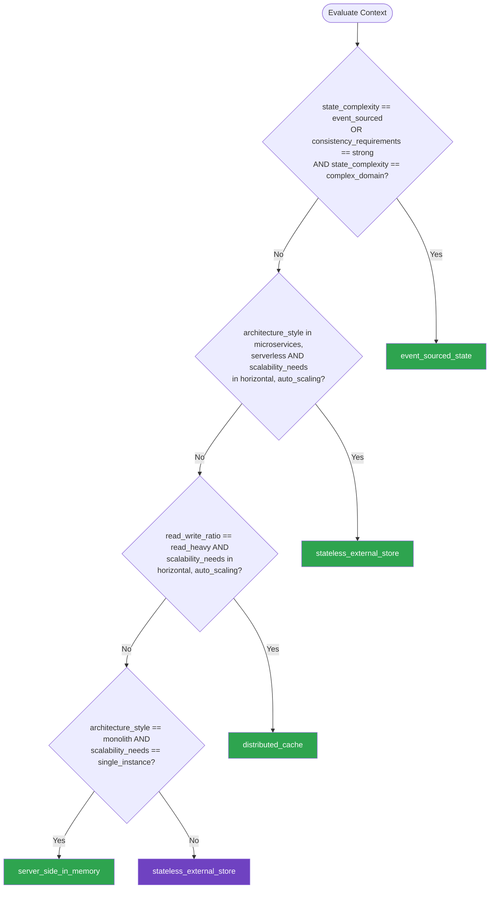

# State Management — Summary

**Purpose**
- State management patterns for choosing between stateless architectures, distributed caches, event-sourced state, and server-side in-memory state
- Scope: session state, application state, cache strategies, event sourcing, and state consistency across distributed systems

## Related Standards

| Standard | Relationship | Context |
|----------|-------------|---------|
| [data-persistence](../../foundational/data-persistence/) | prerequisite | State management patterns build on persistence technology choices |
| [messaging-events](../../foundational/messaging-events/) | complementary | Event-sourced state relies on messaging infrastructure for event streams |
| [configuration-management](../../foundational/configuration-management/) | complementary | Runtime configuration is a form of state that must be managed |
| [error-handling](../../foundational/error-handling/) | complementary | State management errors need structured handling and recovery |

## Context Inputs

These inputs drive the decision tree — provide them to get a tailored recommendation.

| Input | Type | Required | Default | Values | Description |
|-------|------|----------|---------|--------|-------------|
| architecture_style | enum | yes | microservices | monolith, modular_monolith, microservices, serverless | System architecture style |
| consistency_requirements | enum | yes | eventual | strong, eventual, mixed | How strong are state consistency requirements? |
| state_complexity | enum | yes | moderate | simple_session, moderate, complex_domain, event_sourced | Complexity and nature of the state being managed |
| read_write_ratio | enum | yes | read_heavy | read_heavy, balanced, write_heavy | Ratio of reads to writes for stateful operations |
| scalability_needs | enum | yes | horizontal | single_instance, vertical, horizontal, auto_scaling | Scaling strategy and requirements |

## Decision Tree

### Mermaid Diagram



### Text Fallback

- **Priority 1** → `event_sourced_state` — when state_complexity == event_sourced OR (consistency_requirements == strong AND state_complexity == complex_domain). Complex domain state with strong consistency benefits from event sourcing — full audit trail and temporal queries.
- **Priority 2** → `stateless_external_store` — when architecture_style in [microservices, serverless] AND scalability_needs in [horizontal, auto_scaling]. Horizontally scaled distributed services need stateless instances with state externalized to a persistent store.
- **Priority 3** → `distributed_cache` — when read_write_ratio == read_heavy AND scalability_needs in [horizontal, auto_scaling]. Read-heavy workloads at scale benefit from distributed caching to reduce database load and improve response times.
- **Priority 4** → `server_side_in_memory` — when architecture_style == monolith AND scalability_needs == single_instance. Single-instance monoliths can use in-memory state for simplicity and performance — no network hop for state access.
- **Fallback** → `stateless_external_store` — Stateless with external store is the safest default for most modern architectures

> **Confidence**: high | **Risk if wrong**: high

---

## Patterns

### 1. Stateless with External Store

> Application instances are stateless — all state is stored in an external persistent store (database, Redis, managed session store). Any instance can serve any request. Enables horizontal scaling and zero-downtime deployments.

**Maturity**: standard

**Use when**
- Horizontally scaled services behind a load balancer
- Serverless or containerized deployments
- Need zero-downtime rolling deployments
- Multiple instances must share state consistently

**Avoid when**
- Single-instance deployment with no scaling needs
- Ultra-low latency requirements where external store adds unacceptable latency

**Tradeoffs**

| Pros | Cons |
|------|------|
| Horizontal scaling: add instances freely | External store adds network latency for every state access |
| Zero-downtime deployments: any instance can be replaced | External store is a dependency — its failure affects all instances |
| Simple load balancing: no sticky sessions needed | Serialization/deserialization overhead for state |
| Instances are disposable: crash and restart without state loss | |

**Implementation Guidelines**
- Store session state in Redis, database, or managed session store
- Use short, opaque session IDs — not sensitive data
- Set TTL on all stored state to prevent unbounded growth
- Encrypt sensitive state at rest and in transit
- Use connection pooling for external store connections
- Monitor external store latency and availability

**Common Errors**

| Error | Impact | Fix |
|-------|--------|-----|
| Storing large objects in session state | External store becomes a bottleneck; serialization is expensive | Store only essential state (user ID, role); fetch details on demand |
| No TTL on stored state | State store grows unbounded until it runs out of memory/disk | Set TTL on all keys; implement cleanup for expired state |
| Session ID as sensitive data (JWT with PII in session cookie) | Exposure of user data if session ID is intercepted | Session ID is an opaque token; sensitive data stays server-side |

**Standards & References**

| Standard | Type | Role | Reference |
|----------|------|------|-----------|
| OWASP Session Management Cheat Sheet | standard | Security practices for session state management | https://cheatsheetseries.owasp.org/cheatsheets/Session_Management_Cheat_Sheet.html |

---

### 2. Distributed Cache

> Cache layer (Redis, Memcached, or similar) sitting between the application and the primary data store. Serves read-heavy workloads with low latency. Requires explicit cache invalidation strategy to maintain consistency with the source of truth.

**Maturity**: standard

**Use when**
- Read-heavy workloads where database is the bottleneck
- Data that changes infrequently but is read thousands of times
- Need to reduce database load and improve response times
- Geographic distribution requires low-latency reads from edge caches

**Avoid when**
- Data changes frequently and strong consistency is required
- Write-heavy workload with few reads
- Data set is small enough to fit in application memory

**Tradeoffs**

| Pros | Cons |
|------|------|
| Dramatically reduces database load for read-heavy workloads | Stale data risk: cache and database can be out of sync |
| Sub-millisecond reads from cache | Cache invalidation is hard — one of the two hard problems in CS |
| Reduces latency for frequently accessed data | Additional infrastructure to manage and monitor |
| Can absorb traffic spikes that would overwhelm the database | Cold cache after restart: thundering herd on database |

**Implementation Guidelines**
- Cache-aside (lazy loading): read from cache first, on miss read from DB and populate cache
- Write-through: write to cache and DB simultaneously
- Write-behind: write to cache, asynchronously flush to DB (risky: data loss on cache failure)
- Set TTL on all cached entries — even if you also invalidate explicitly
- Use cache-aside for most cases; write-through for critical data
- Implement cache warming for cold start scenarios
- Monitor cache hit rate: <80% indicates cache is not effective

**Common Errors**

| Error | Impact | Fix |
|-------|--------|-----|
| No explicit invalidation strategy | Stale data served indefinitely; users see outdated information | Combine TTL with event-driven invalidation; invalidate on write |
| Caching mutable data without TTL | Cache grows unbounded; stale data accumulates | Every cache entry must have a TTL — even if also invalidated explicitly |
| Thundering herd on cache miss | All instances simultaneously query DB on cache miss; DB overwhelmed | Use locking (single-flight): only one instance populates cache; others wait |

**Standards & References**

| Standard | Type | Role | Reference |
|----------|------|------|-----------|
| Cache-Aside Pattern | pattern | Primary caching strategy for read-heavy workloads | https://learn.microsoft.com/en-us/azure/architecture/patterns/cache-aside |

---

### 3. Event-Sourced State

> Instead of storing current state, store a sequence of events that led to the current state. Current state is derived by replaying events. Provides a complete audit trail, temporal queries ("what was the state at time T?"), and enables event-driven architectures.

**Maturity**: enterprise

**Use when**
- Complete audit trail is required (financial, regulatory, compliance)
- Need temporal queries — what was the state at a specific point in time?
- Complex domain with many state transitions
- Event-driven architecture where events are the primary integration pattern
- Need to rebuild state from scratch (projections, read models)

**Avoid when**
- Simple CRUD where current state is all that matters
- Team unfamiliar with event sourcing concepts
- Read-heavy workload without need for audit trail or temporal queries

**Tradeoffs**

| Pros | Cons |
|------|------|
| Complete audit trail: every state change recorded | Event schema evolution is complex (versioning, upcasting) |
| Temporal queries: state at any point in time | Rebuilding state from events can be slow for long event streams |
| Natural fit for event-driven integration | Higher learning curve — different mental model from CRUD |
| Enables CQRS: separate read and write models | Debugging requires understanding event sequences |

**Implementation Guidelines**
- Events are immutable facts: something that happened (past tense)
- Aggregate stores events, not current state
- Current state derived by replaying events on the aggregate
- Snapshots for performance: periodically save current state to avoid replaying all events
- Event versioning: support old event formats as schema evolves
- Read models (projections): build optimized views by projecting events
- CQRS: separate write model (events) from read model (projections)

**Common Errors**

| Error | Impact | Fix |
|-------|--------|-----|
| Events as mutable records (updating events) | Audit trail is meaningless if events can change; defeats the purpose | Events are immutable: never update or delete; add compensating events instead |
| No snapshots for long-lived aggregates | State rebuild becomes slow as event stream grows | Take snapshots periodically; rebuild from last snapshot + subsequent events |
| Event schema evolution not planned | Old events can't be deserialized; projections break | Version events from day one; implement upcasters for old versions |

**Standards & References**

| Standard | Type | Role | Reference |
|----------|------|------|-----------|
| Event Sourcing (Martin Fowler) | pattern | Primary reference for event sourcing | https://martinfowler.com/eaaDev/EventSourcing.html |

---

### 4. Server-Side In-Memory State

> Application state stored in the server process memory (e.g., dictionaries, in-memory databases, caches). Fast access with no network hop. Suitable for single-instance deployments or when state is local to a single process.

**Maturity**: standard

**Use when**
- Single-instance deployment (no horizontal scaling)
- State is local to one process (no sharing between instances)
- Ultra-low latency requirements where external store is too slow
- Caching within a request lifecycle (request-scoped state)

**Avoid when**
- Multiple instances need to share state
- State must survive process restart
- Memory is limited and state is large

**Tradeoffs**

| Pros | Cons |
|------|------|
| Zero network latency for state access | State lost on process restart or crash |
| Simple: no external dependencies for state | Cannot scale horizontally — state is not shared |
| Fastest possible read/write performance | Memory is limited — unbounded state growth causes OOM |

**Implementation Guidelines**
- Use for request-scoped or short-lived state only
- If long-lived state: implement persistence as backup (write-through to DB)
- Set memory limits and eviction policies (LRU, LFU)
- Monitor memory usage: alert on approaching limits
- If horizontal scaling needed later: plan migration to external store

**Common Errors**

| Error | Impact | Fix |
|-------|--------|-----|
| In-memory state with horizontal scaling (multiple instances) | Each instance has different state; users see inconsistent data | Use external store (Redis, DB) when scaling horizontally |
| No memory limits or eviction | Memory grows unbounded; OOM kills the process | Set max size; implement LRU or TTL-based eviction |
| Assuming state survives restart | Data loss after deployment, crash, or scaling event | Persist critical state to external store; treat in-memory as cache |

**Standards & References**

| Standard | Type | Role | Reference |
|----------|------|------|-----------|
| In-Memory Data Grid Patterns | pattern | Patterns for in-memory state management | — |

---

## Examples

### Stateless API with Redis Session Store
**Context**: Horizontally scaled API service using Redis for session state

**Correct** implementation:
```text
# Stateless service with externalized session state
class SessionStore:
    def __init__(self, redis_client):
        self.redis = redis_client

    def create_session(self, user_id, metadata):
        session_id = generate_opaque_token()  # Cryptographically random
        session_data = {
            "user_id": user_id,
            "role": metadata["role"],
            "created_at": now().isoformat()
        }
        # Store in Redis with TTL (30 minutes)
        self.redis.setex(
            f"session:{session_id}",
            timedelta(minutes=30),
            json.dumps(session_data)
        )
        return session_id

    def get_session(self, session_id):
        data = self.redis.get(f"session:{session_id}")
        if not data:
            return None
        session = json.loads(data)
        # Refresh TTL on access (sliding expiration)
        self.redis.expire(f"session:{session_id}", timedelta(minutes=30))
        return session

# API handler — stateless, any instance can serve any request
class UserProfileHandler:
    def get(self, request):
        session = self.session_store.get_session(request.session_id)
        if not session:
            return Response(status=401)
        user = self.user_repo.find(session["user_id"])
        return Response(user.to_public_dto())

# Load balancer routes to any instance — no sticky sessions
# Instances can be scaled up/down freely
# Redis is the single source of session truth
```

**Incorrect** implementation:
```text
# WRONG: Session state stored in-memory on the server
user_sessions = {}  # Global mutable state — lost on restart

class UserProfileHandler:
    def login(self, request):
        user = authenticate(request)
        session_id = str(uuid4())
        user_sessions[session_id] = {  # Stored in process memory
            "user": user,
            "cart": [],  # Large objects in session
            "preferences": user.all_preferences,
            "browsing_history": []
        }
        return Response({"session_id": session_id})

# Problems:
# - Requires sticky sessions (load balancer must route same user to same instance)
# - State lost on restart or deployment
# - Memory grows unbounded (no TTL, no eviction)
# - Cannot scale horizontally
# - Session stores large objects (should store only user_id, role)
```

**Why**: The correct implementation externalizes session state to Redis. Sessions have TTL, store minimal data, and any instance can serve any request. The incorrect version uses in-memory global state, requiring sticky sessions, losing state on restart, and storing large objects.

---

### Event-Sourced Bank Account
**Context**: Bank account using event sourcing for complete audit trail

**Correct** implementation:
```text
# Events — immutable facts that happened
class AccountOpened:
    def __init__(self, account_id, owner_id, initial_balance):
        self.account_id = account_id
        self.owner_id = owner_id
        self.initial_balance = initial_balance
        self.timestamp = now()

class MoneyDeposited:
    def __init__(self, account_id, amount, reference):
        self.account_id = account_id
        self.amount = amount
        self.reference = reference
        self.timestamp = now()

class MoneyWithdrawn:
    def __init__(self, account_id, amount, reference):
        self.account_id = account_id
        self.amount = amount
        self.reference = reference
        self.timestamp = now()

# Aggregate — current state derived from events
class BankAccount:
    def __init__(self):
        self.balance = 0
        self.events = []

    def apply(self, event):
        if isinstance(event, AccountOpened):
            self.balance = event.initial_balance
        elif isinstance(event, MoneyDeposited):
            self.balance += event.amount
        elif isinstance(event, MoneyWithdrawn):
            self.balance -= event.amount

    def withdraw(self, amount, reference):
        if amount > self.balance:
            raise InsufficientFunds(self.balance, amount)
        event = MoneyWithdrawn(self.id, amount, reference)
        self.apply(event)
        self.events.append(event)

    @classmethod
    def from_events(cls, events):
        account = cls()
        for event in events:
            account.apply(event)
        return account

# Event store — append-only, immutable log
class EventStore:
    def load(self, aggregate_id):
        return self.db.query(
            "SELECT * FROM events WHERE aggregate_id = ? ORDER BY sequence",
            aggregate_id
        )

    def save(self, aggregate_id, new_events, expected_version):
        # Optimistic concurrency: fail if another write happened
        with self.db.transaction():
            current_version = self.get_version(aggregate_id)
            if current_version != expected_version:
                raise ConcurrencyConflict()
            for event in new_events:
                self.db.insert("events", serialize(event))
```

**Incorrect** implementation:
```text
# WRONG: Event sourcing anti-patterns
class BankAccount:
    def withdraw(self, amount):
        self.balance -= amount
        # WRONG: Updating the event (events must be immutable)
        last_event = self.event_store.get_last(self.id)
        last_event.balance = self.balance
        self.event_store.update(last_event)

    def fix_balance(self, correct_balance):
        # WRONG: Deleting events to "fix" state
        self.event_store.delete_all(self.id)
        self.event_store.append(BalanceSet(self.id, correct_balance))
```

**Why**: The correct implementation stores immutable events and derives state by replaying them. The event store is append-only with optimistic concurrency. The incorrect version mutates and deletes events, destroying the audit trail and defeating the purpose of event sourcing.

---

## Security Hardening

### Transport
- State store connections encrypted (TLS for Redis, database)
- Session tokens transmitted only over HTTPS

### Data Protection
- Session state encrypted at rest in external store
- Sensitive data (PII) minimized in session state — store only IDs and roles
- Cache entries with sensitive data have shorter TTL

### Access Control
- Session tokens are opaque and cryptographically random
- Session fixation prevention: regenerate session ID on privilege change
- Session invalidation on logout (delete from store, not just expire cookie)

### Input/Output
- Session data deserialization validates expected structure
- Cache key construction prevents injection (parameterize, don't concatenate)

### Secrets
- External store credentials in secret manager
- Redis AUTH password rotated periodically

### Monitoring
- Session creation and destruction logged (not session content)
- Cache hit/miss rates monitored — anomalies may indicate cache poisoning
- Event store append rate and size monitored

---

## Anti-Patterns

| Anti-Pattern | Severity | Description | Fix |
|-------------|----------|-------------|-----|
| Global Mutable State | critical | Application state stored in global variables or static fields accessible by all components. Causes race conditions, makes testing impossible, and prevents horizontal scaling. | Externalize state to a managed store; use dependency injection for state access |
| Session State Bloat | high | Storing large objects, entire user profiles, or shopping carts in session state. Increases serialization cost, memory usage, and session store load. | Store only essential identifiers in session; fetch details from services on demand |
| Missing Cache Invalidation | high | Using caches without an explicit invalidation strategy. Stale data served indefinitely or until TTL expires, causing incorrect behavior that's hard to debug. | Combine TTL with event-driven invalidation; always set TTL even with explicit invalidation |
| Sticky Session Dependency | medium | Architecture requires load balancer sticky sessions because state is stored in-process. Prevents horizontal scaling, causes uneven load distribution, and makes deployments disruptive. | Externalize state to shared store (Redis, DB); remove sticky session requirement |

---

## Checklist

| ID | Category | Description | Severity |
|----|----------|-------------|----------|
| SM-01 | design | State management pattern explicitly chosen and documented | high |
| SM-02 | reliability | Application instances are stateless — state externalized to managed store | high |
| SM-03 | security | Session tokens are opaque and cryptographically random | critical |
| SM-04 | security | Session state encrypted at rest and in transit | high |
| SM-05 | reliability | All cached and session entries have TTL to prevent unbounded growth | high |
| SM-06 | security | Session ID regenerated on authentication and privilege change | high |
| SM-07 | reliability | Cache invalidation strategy documented and implemented | high |
| SM-08 | performance | Cache hit rate monitored — below 80% triggers investigation | medium |
| SM-09 | correctness | Event store is append-only — events are never updated or deleted | critical |
| SM-10 | reliability | Event-sourced aggregates have snapshot strategy for performance | medium |
| SM-11 | compliance | Session and state data retention aligned with data privacy requirements | high |
| SM-12 | observability | State store latency and availability monitored with alerts | medium |

---

## Compliance

| Standard | Relevance |
|----------|-----------|
| OWASP Session Management Cheat Sheet | Security best practices for session state management |
| GDPR | State stores containing PII must support right to erasure and data portability |

---

## Prompt Recipes

### Design state management for a new distributed service
**Scenario**: greenfield
```text
Design the state management strategy for a {language} {architecture_style} service:

1. Identify all state:
   - Session state (user identity, preferences)
   - Application state (cached data, computed values)
   - Domain state (business entities)
2. For each state type, choose storage:
   - External store (Redis, database, managed session)
   - In-memory cache with TTL
   - Event-sourced log
3. Define consistency requirements per state type
4. Design cache invalidation strategy
5. Plan for horizontal scaling: no sticky sessions
6. Security: encryption, TTL, session fixation prevention
```

### Migrate from in-memory state to external store
**Scenario**: migration
```text
Migrate this {language} application from in-memory state to external state store:

1. Identify all in-memory state (global variables, static fields, in-process caches)
2. Classify: which state must be shared? Which is instance-local?
3. For shared state:
   - Move to Redis/database
   - Add TTL
   - Remove sticky session configuration
4. For instance-local state:
   - Convert to in-memory cache with TTL and size limit
5. Update load balancer: remove sticky sessions
6. Test with multiple instances
```

### Implement event sourcing for a domain aggregate
**Scenario**: architecture
```text
Implement event sourcing for the {aggregate_name} aggregate in {language}:

1. Define events (past tense, immutable):
   - {AggregateCreated}, {StateChanged}, etc.
2. Implement the aggregate:
   - State derived by replaying events
   - Commands validated against current state, then produce events
3. Implement event store:
   - Append-only persistence
   - Optimistic concurrency control
4. Add snapshots for performance
5. Build read model/projection for queries
6. Add event versioning strategy
```

### Audit state management for security and scalability issues
**Scenario**: audit
```text
Audit state management in this {language} application:

1. Is there global mutable state? (global variables, static fields)
2. Is session state externalized or in-memory?
3. Do all cache entries have TTL?
4. Is there a cache invalidation strategy?
5. Are session tokens opaque and cryptographically random?
6. Is session state encrypted at rest?
7. Does the load balancer require sticky sessions? (bad sign)
8. Are event store events immutable?
9. Is PII in state stores minimized?
10. Are state store connections encrypted?
```

---

## Links
- Full standard: [state-management.yaml](state-management.yaml)
