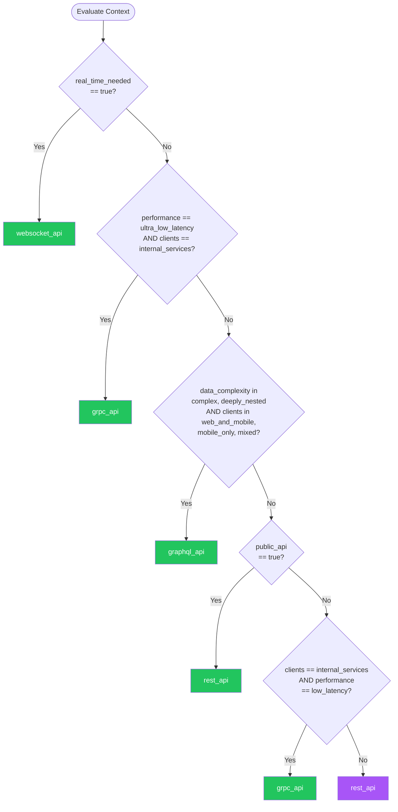

# API Design — Summary

**Purpose**
- API design decision framework covering REST, GraphQL, gRPC, and WebSocket protocols
- Scope: Context-aware recommendations based on client types, data complexity, performance needs, and team expertise

## Related Standards

| Standard | Relationship | Context |
|----------|-------------|---------|
| [authentication](../authentication/) | complementary | All APIs require authentication — apply authentication standard to every API endpoint |
| [input-validation](../input-validation/) | complementary | All API inputs must be validated per input-validation standard |
| [error-handling](../error-handling/) | complementary | APIs must implement structured error responses per error-handling standard |
| [rate-limiting](../../security-quality/rate-limiting/) | complementary | Public APIs require rate limiting to prevent abuse |
| [versioning](../../integration-data/versioning/) | complementary | APIs must follow versioning strategies for backward compatibility |

## Context Inputs

These inputs drive the decision tree — provide them to get a tailored recommendation.

| Input | Type | Required | Default | Values | Description |
|-------|------|----------|---------|--------|-------------|
| client_types | enum | yes | web_and_mobile | web_only, mobile_only, web_and_mobile, internal_services, third_party, mixed | Primary consumers of the API |
| data_complexity | enum | yes | moderate | simple, moderate, complex, deeply_nested | Complexity of the data graph clients need to query |
| performance_requirement | enum | yes | standard | relaxed, standard, low_latency, ultra_low_latency | Latency and throughput requirements |
| real_time_needed | boolean | yes | false | — | Does the API need to push real-time updates to clients? |
| team_expertise | enum | no | rest_familiar | rest_familiar, graphql_experienced, grpc_experienced, polyglot | Team familiarity with API paradigms |
| public_api | boolean | yes | false | — | Is this a public-facing API for external consumers? |
| contract_strictness | enum | no | moderate | loose, moderate, strict | How strict should the API contract be? |

## Decision Tree

### Mermaid Diagram



### Text Fallback

- **Priority 1** → `websocket_api` — when real_time_needed == true. Real-time bidirectional communication requires WebSocket or SSE; WebSocket is preferred for bidirectional
- **Priority 2** → `grpc_api` — when performance_requirement == ultra_low_latency AND client_types == internal_services. Internal service-to-service with ultra-low latency needs binary protocol
- **Priority 3** → `graphql_api` — when data_complexity in [complex, deeply_nested] AND client_types in [web_and_mobile, mobile_only, mixed]. Complex data graphs with multiple client types benefit from client-driven queries
- **Priority 4** → `rest_api` — when public_api == true. Public APIs should use REST for maximum ecosystem compatibility and discoverability
- **Priority 5** → `grpc_api` — when client_types == internal_services AND performance_requirement == low_latency. Internal services with low-latency requirements benefit from gRPC's binary protocol and streaming
- **Fallback** → `rest_api` — REST with OpenAPI 3.x specification — universally understood, rich ecosystem, lowest adoption risk

> **Confidence**: high | **Risk if wrong**: medium

---

## Patterns

### 1. RESTful API

> Resource-oriented API design using HTTP methods, status codes, and content negotiation. The most widely adopted API paradigm with the richest ecosystem of tools, libraries, and developer familiarity.

**Maturity**: standard

**Use when**
- Public-facing APIs requiring broad ecosystem support
- Simple to moderate data models with clear resource boundaries
- Team is REST-experienced and timeline is tight
- Need for extensive caching (HTTP cache semantics)
- Hypermedia-driven workflows (HATEOAS)

**Avoid when**
- Deeply nested data graphs with many client-specific query patterns
- Ultra-low-latency internal service communication
- Real-time bidirectional communication needed

**Tradeoffs**

| Pros | Cons |
|------|------|
| Universal HTTP support — works everywhere | Over-fetching/under-fetching when data needs vary by client |
| Rich caching via HTTP cache headers | Multiple round-trips for complex data (chatty APIs) |
| OpenAPI/Swagger tooling for documentation, code generation, testing | No built-in schema enforcement at runtime |
| Stateless — each request is self-contained | Versioning complexity over time |
| Largest developer community and ecosystem | |

**Implementation Guidelines**
- Use nouns for resources, HTTP methods for actions (GET, POST, PUT, PATCH, DELETE)
- Return appropriate HTTP status codes (2xx success, 4xx client error, 5xx server error)
- Use OpenAPI 3.x specification as the API contract
- Implement HATEOAS links for discoverable APIs
- Use consistent pagination (cursor-based preferred over offset for large datasets)
- Support content negotiation (Accept header) for multiple formats
- Use ETag/If-None-Match for conditional requests and caching

**Common Errors**

| Error | Impact | Fix |
|-------|--------|-----|
| Using POST for everything | Loses HTTP semantic benefits — caching, idempotency, discoverability | Map operations to correct HTTP methods: GET (read), POST (create), PUT (full update), PATCH (partial update), DELETE (remove) |
| Using verbs in URLs (e.g., /api/getUser/123) | Breaks REST resource model, inconsistent naming | Use noun-based URLs (/api/users/123) with HTTP methods for actions |
| Returning 200 for every response with error in body | Clients cannot use HTTP status for error detection; breaks intermediary caching/routing | Use proper HTTP status codes: 400 (bad request), 404 (not found), 422 (validation), 500 (server error) |

**Standards & References**

| Standard | Type | Role | Reference |
|----------|------|------|-----------|
| OpenAPI 3.x | spec | API contract specification and documentation | https://spec.openapis.org/oas/latest.html |
| JSON:API | spec | Standardized JSON response format for REST APIs | https://jsonapi.org/format/ |
| HTTP Semantics | spec | HTTP method and status code semantics | RFC 9110 |

---

### 2. GraphQL API

> Client-driven query language that allows consumers to request exactly the data they need in a single request. Eliminates over-fetching and under-fetching by letting clients specify their data requirements.

**Maturity**: standard

**Use when**
- Multiple client types need different data shapes from the same backend
- Complex, deeply nested data graphs
- Rapid frontend iteration without backend changes
- Aggregating data from multiple backend services into a unified API

**Avoid when**
- Simple CRUD with flat resources (REST is simpler)
- Public APIs where discoverability and caching matter (REST is better here)
- Team lacks GraphQL experience and timeline is tight
- File uploads are the primary use case

**Tradeoffs**

| Pros | Cons |
|------|------|
| Eliminates over-fetching and under-fetching | Complex caching (no HTTP cache semantics per field) |
| Single endpoint reduces round-trips | N+1 query problem requires dataloader pattern |
| Strong typing via schema introspection | Potential for expensive queries (needs query complexity analysis) |
| Frontend can evolve independently of backend | Smaller ecosystem than REST for tooling |

**Implementation Guidelines**
- Implement query complexity analysis and depth limiting
- Use DataLoader pattern to batch and deduplicate backend queries
- Implement persisted queries for production (whitelist allowed queries)
- Use cursor-based pagination (Relay connection spec)
- Separate query and mutation types cleanly
- Implement field-level authorization, not just endpoint-level

**Common Errors**

| Error | Impact | Fix |
|-------|--------|-----|
| No query complexity limits | Malicious or accidental deeply nested queries cause denial of service | Implement query depth limiting, complexity scoring, and timeout enforcement |
| N+1 database queries | Resolving nested fields triggers separate DB queries per parent record | Use DataLoader to batch and cache backend calls within a single request |
| Exposing entire database schema via GraphQL | Leaks internal data model, increases attack surface | Design a purpose-built GraphQL schema that abstracts the database model |

**Standards & References**

| Standard | Type | Role | Reference |
|----------|------|------|-----------|
| GraphQL Specification | spec | Query language specification | https://spec.graphql.org/ |
| Relay Connection Specification | spec | Cursor-based pagination standard | https://relay.dev/graphql/connections.htm |

---

### 3. gRPC API

> High-performance RPC framework using Protocol Buffers for binary serialization and HTTP/2 for transport. Ideal for internal service-to-service communication where latency and throughput are critical.

**Maturity**: advanced

**Use when**
- Internal microservice-to-microservice communication
- Low-latency, high-throughput requirements
- Strong contract enforcement needed (schema-first with protobuf)
- Streaming data (server-side, client-side, or bidirectional)
- Polyglot microservices needing auto-generated client libraries

**Avoid when**
- Browser clients without a proxy (gRPC-Web adds complexity)
- Public APIs where REST ecosystem support matters
- Simple CRUD that does not justify protobuf toolchain overhead
- Team unfamiliar with Protocol Buffers

**Tradeoffs**

| Pros | Cons |
|------|------|
| Binary serialization — smaller payloads, faster parsing than JSON | Not human-readable (binary protocol) |
| HTTP/2 multiplexing — multiple RPCs over one connection | Limited browser support without gRPC-Web proxy |
| Built-in streaming (server, client, bidirectional) | Toolchain setup for protobuf compilation |
| Code generation for multiple languages from .proto files | Harder to debug than REST/JSON |
| Strong contract via protobuf schema | |

**Implementation Guidelines**
- Define all services and messages in .proto files (schema-first)
- Use server-side streaming for large result sets
- Implement deadlines/timeouts on every RPC call
- Use gRPC interceptors for cross-cutting concerns (auth, logging, tracing)
- Use gRPC-Web proxy for browser clients that must use gRPC
- Version protobuf messages using field numbers (never reuse deleted field numbers)

**Common Errors**

| Error | Impact | Fix |
|-------|--------|-----|
| No deadlines on RPC calls | Slow or unresponsive services cause cascading timeouts across the mesh | Set deadline/timeout on every RPC call; propagate remaining deadline downstream |
| Breaking protobuf backward compatibility | Deployed clients crash when fields change | Never remove or renumber existing fields; use reserved keyword for deleted fields |
| Using gRPC for everything including public APIs | External developers struggle with protobuf toolchain and limited browser support | Use gRPC internally, expose REST+OpenAPI gateway for public consumers |

**Standards & References**

| Standard | Type | Role | Reference |
|----------|------|------|-----------|
| gRPC | protocol | High-performance RPC framework | https://grpc.io/docs/ |
| Protocol Buffers | format | Binary serialization format for gRPC messages | https://protobuf.dev/ |

---

### 4. WebSocket API

> Full-duplex communication channel over a single TCP connection, enabling real-time bidirectional data exchange between client and server without the overhead of HTTP request-response cycles.

**Maturity**: standard

**Use when**
- Real-time features (chat, live dashboards, collaborative editing)
- Server-push notifications to connected clients
- High-frequency data updates (financial tickers, gaming)
- Bidirectional communication (client sends and receives simultaneously)

**Avoid when**
- Request-response patterns where REST or GraphQL suffice
- Infrequent updates (SSE or long-polling are simpler)
- Clients behind restrictive proxies that block WebSocket upgrades
- Stateless architecture where connection state is unwanted

**Tradeoffs**

| Pros | Cons |
|------|------|
| True real-time — minimal latency for push updates | Stateful connections — harder to scale horizontally |
| Bidirectional — both client and server initiate messages | No built-in request-response semantics (must build message protocol) |
| Lower overhead than HTTP polling for high-frequency updates | Connection management complexity (reconnection, heartbeats) |
| Single persistent connection reduces handshake costs | Load balancer configuration for sticky sessions or connection-aware routing |

**Implementation Guidelines**
- Implement heartbeat/ping-pong to detect dead connections
- Build automatic reconnection with exponential backoff on client
- Define a message protocol with types, IDs, and correlation for request-response patterns
- Use rooms/channels for topic-based message routing
- Authenticate on connection upgrade (token in handshake), not per message
- Consider Server-Sent Events (SSE) if only server-to-client push is needed

**Common Errors**

| Error | Impact | Fix |
|-------|--------|-----|
| No reconnection logic | Clients silently disconnect and miss updates | Implement exponential backoff reconnection with event replay for missed messages |
| Authenticating per-message instead of on connection | Unnecessary overhead and complexity on every message | Authenticate during WebSocket upgrade handshake, maintain auth for connection lifetime |
| No message protocol (sending raw strings) | Cannot distinguish message types, correlate responses, or handle errors | Define structured message format with type, id, payload, and error fields |

**Standards & References**

| Standard | Type | Role | Reference |
|----------|------|------|-----------|
| WebSocket Protocol | protocol | Full-duplex communication over TCP | RFC 6455 |
| Server-Sent Events | protocol | Server-to-client push over HTTP (simpler alternative) | https://html.spec.whatwg.org/multipage/server-sent-events.html |

---

## Examples

### RESTful Resource Design

**Context**: Designing a REST API for a user management system

**Correct** implementation:

```text
# Resource-oriented URLs with HTTP methods
GET    /api/v1/users           # List users (paginated)
GET    /api/v1/users/{id}      # Get single user
POST   /api/v1/users           # Create user
PATCH  /api/v1/users/{id}      # Partial update
DELETE /api/v1/users/{id}      # Delete user

# Nested resources for relationships
GET    /api/v1/users/{id}/orders   # User's orders

# Response with proper status codes
# 200 OK — successful GET/PATCH
# 201 Created — successful POST (with Location header)
# 204 No Content — successful DELETE
# 400 Bad Request — validation failure
# 404 Not Found — resource doesn't exist
# 422 Unprocessable Entity — semantic validation error
```

**Incorrect** implementation:

```text
# WRONG: Verb-based URLs, single method
POST /api/getUser         { "id": 123 }
POST /api/createUser      { "name": "Alice" }
POST /api/deleteUser      { "id": 123 }
POST /api/getUserOrders   { "userId": 123 }

# Always returns 200 with error in body
# Response: { "status": "error", "message": "User not found" }
```

**Why**: REST uses nouns for resources and HTTP methods for operations. This enables HTTP caching (GET is cacheable), idempotency guarantees (PUT, DELETE), and standard error handling via status codes. Verb-based APIs lose all HTTP semantic benefits.

---

### GraphQL with DataLoader

**Context**: Resolving nested data without N+1 queries

**Correct** implementation:

```text
# Schema
type Query {
  users(first: Int, after: String): UserConnection!
}
type User {
  id: ID!
  name: String!
  orders: [Order!]!
}

# Resolver with DataLoader (batched)
resolve User.orders(user):
  return orderLoader.load(user.id)
  # DataLoader batches all user.id calls in this tick
  # into a single SQL: SELECT * FROM orders WHERE user_id IN (...)

# Query complexity limit
max_depth: 5
max_complexity: 1000
```

**Incorrect** implementation:

```text
# WRONG: N+1 query — separate DB call per user
resolve User.orders(user):
  return db.query("SELECT * FROM orders WHERE user_id = ?", user.id)
  # For 50 users: 1 query for users + 50 queries for orders = 51 queries

# No depth/complexity limit — attacker sends:
# { users { orders { items { product { reviews { author { orders ... }}}}}} }
```

**Why**: DataLoader batches and deduplicates backend calls within a single GraphQL request, turning N+1 database queries into a single batched query. Combined with query complexity limits, this prevents both performance degradation and denial-of-service via deeply nested queries.

---

## Security Hardening

### Transport
- TLS 1.2+ required for all API endpoints
- HSTS header with min 1-year max-age
- CORS configured with explicit origin allowlist (never wildcard for authenticated APIs)

### Data Protection
- Never expose internal IDs that reveal record counts or sequence patterns
- Implement field-level access control for sensitive data
- Redact sensitive fields in API logs

### Access Control
- Authentication required on all non-public endpoints
- Authorization checked at resource level, not just endpoint
- Rate limiting on all endpoints (stricter on unauthenticated)

### Input/Output
- Validate all input against schema (OpenAPI, GraphQL schema, protobuf)
- Sanitize all output to prevent injection in downstream consumers
- Content-Type validation — reject unexpected content types
- Request size limits enforced

### Secrets
- API keys transmitted only in headers, never in URLs
- API keys rotatable without downtime
- Service-to-service auth uses short-lived tokens, not static keys

### Monitoring
- Log all API requests with method, path, status, latency, caller identity
- Alert on error rate spikes (5xx > threshold)
- Monitor and alert on unusual traffic patterns
- Track API usage per consumer for billing and capacity planning

---

## Anti-Patterns

| Anti-Pattern | Severity | Description | Fix |
|-------------|----------|-------------|-----|
| Verb-based URLs | medium | Using action verbs in API URLs (e.g., /api/getUser, /api/createOrder). This abandons REST's resource model and HTTP method semantics, losing caching, idempotency, and standard HTTP tooling benefits. | Use noun-based resource URLs with HTTP methods for actions |
| 200 OK for everything | high | Returning HTTP 200 for all responses, including errors, with the actual status in the response body. Breaks HTTP semantics, intermediary caching, load balancer health checks, and client error handling. | Use appropriate HTTP status codes (4xx for client errors, 5xx for server errors) |
| No query complexity limits on GraphQL | critical | Exposing a GraphQL API without depth limiting or query complexity scoring. Attackers can send deeply nested queries that cause exponential backend load (denial of service). | Implement query depth limits, complexity scoring, and request timeouts |
| N+1 queries in GraphQL resolvers | high | Each nested field resolver makes a separate database query. For a list of N parent items, this results in 1 + N queries, degrading performance dramatically as list size grows. | Use DataLoader pattern to batch and deduplicate backend calls per request |
| Chatty microservice APIs | medium | Multiple fine-grained API calls needed to assemble a single view. Each call adds network latency, authentication overhead, and failure points. Common when REST resources are too granular. | Use BFF (Backend for Frontend) pattern, GraphQL aggregation, or composite APIs |

---

## Checklist

| ID | Category | Description | Severity |
|----|----------|-------------|----------|
| API-01 | design | API paradigm chosen based on context (REST/GraphQL/gRPC/WebSocket) | **high** |
| API-02 | design | API contract defined (OpenAPI spec, GraphQL schema, or .proto files) | **critical** |
| API-03 | security | Authentication enforced on all non-public endpoints | **critical** |
| API-04 | security | Rate limiting applied on all endpoints | **high** |
| API-05 | design | Pagination implemented for list endpoints (cursor-based for large datasets) | **high** |
| API-06 | security | Input validation on all request parameters and bodies | **critical** |
| API-07 | design | Consistent error response format across all endpoints | **high** |
| API-08 | security | CORS configured with explicit origin allowlist | **high** |
| API-09 | design | API versioning strategy defined and implemented | **high** |
| API-10 | reliability | Request size limits enforced on all endpoints | **medium** |
| API-11 | observability | All API requests logged with method, path, status, latency, caller | **high** |
| API-12 | security | GraphQL query complexity limits enforced (if using GraphQL) | **critical** |

---

## Compliance

### Standards

| Standard | Relevance | Reference |
|----------|-----------|-----------|
| OWASP API Security Top 10 | Primary security standard for API design | https://owasp.org/www-project-api-security/ |
| OpenAPI Specification | API contract standard for documentation and validation | https://spec.openapis.org/oas/latest.html |
| RFC 9110 (HTTP Semantics) | HTTP method and status code semantics | https://www.rfc-editor.org/rfc/rfc9110 |

### Requirements Mapping

| Control | Description | Maps To |
|---------|-------------|---------|
| api_authentication | All API endpoints enforce authentication | OWASP API2:2023 Broken Authentication |
| api_authorization | Resource-level authorization on all operations | OWASP API1:2023 Broken Object Level Authorization |
| rate_limiting | Rate limiting prevents abuse | OWASP API4:2023 Unrestricted Resource Consumption |

---

## Prompt Recipes

### Design an API for a new application
**Scenario**: greenfield

```text
Design an API for a new application.

Context:
- Client types: [web/mobile/internal_services/third_party]
- Data complexity: [simple/moderate/complex/deeply_nested]
- Performance requirement: [relaxed/standard/low_latency/ultra_low_latency]
- Real-time needed: [yes/no]
- Public API: [yes/no]

If public or simple data: Use REST with OpenAPI 3.x specification.
If complex nested data + multiple clients: Use GraphQL with query complexity limits.
If internal services + low latency: Use gRPC with Protocol Buffers.
If real-time: Use WebSocket with structured message protocol.

Always: TLS, authentication, rate limiting, input validation, proper error responses.
```

---

### Audit an existing REST API design
**Scenario**: audit

```text
Audit the existing REST API against these criteria:

1. Are URLs resource-oriented (nouns, not verbs)?
2. Are HTTP methods used correctly (GET=read, POST=create, etc.)?
3. Are HTTP status codes used properly (not 200-for-everything)?
4. Is pagination implemented (cursor-based for large datasets)?
5. Is an OpenAPI spec maintained and up-to-date?
6. Is versioning implemented (URL or header)?
7. Are error responses consistent and structured?
8. Is CORS configured properly (no wildcard for auth APIs)?
9. Are request size limits enforced?
10. Is rate limiting applied on all endpoints?

For each item: report compliant/non-compliant/not-applicable with evidence.
```

---

### Evaluate migrating from REST to GraphQL
**Scenario**: migration

```text
Evaluate whether migrating from REST to GraphQL is justified.

Current state: [describe existing REST API]

Evaluate:
- Are multiple clients fetching different data shapes from same endpoints?
- Are clients making multiple round-trips to assemble one view?
- Is over-fetching causing performance issues on mobile?
- Does the team have GraphQL experience?

If yes to most: GraphQL may be justified.
If no: REST is likely sufficient — optimize with sparse fieldsets or BFF pattern.

Migration approach: Run GraphQL alongside REST during transition.
Use GraphQL as a gateway that calls existing REST services internally.
```

---

### Design an API gateway for microservices
**Scenario**: architecture

```text
Design an API gateway for a microservices architecture.

Requirements:
- Route requests to correct backend service
- Aggregate responses from multiple services when needed
- Handle authentication and rate limiting at the edge
- Protocol translation (REST for external, gRPC for internal)

Gateway responsibilities:
- Authentication/authorization (verify tokens, not issue them)
- Rate limiting and throttling
- Request/response transformation
- Load balancing and circuit breaking
- API versioning routing
- Observability (logging, tracing, metrics)

Avoid: Business logic in gateway, tight coupling to backend schemas.
```

---

## Notes
- The decision tree evaluates patterns in priority order; the first matching pattern is recommended
- REST is the safest default when no strong signals favor other patterns
- gRPC and REST can coexist: use gRPC internally and expose a REST gateway for external consumers
- GraphQL can serve as an aggregation layer over existing REST services during migration

## Links
- Full standard: [api-design.yaml](api-design.yaml)
