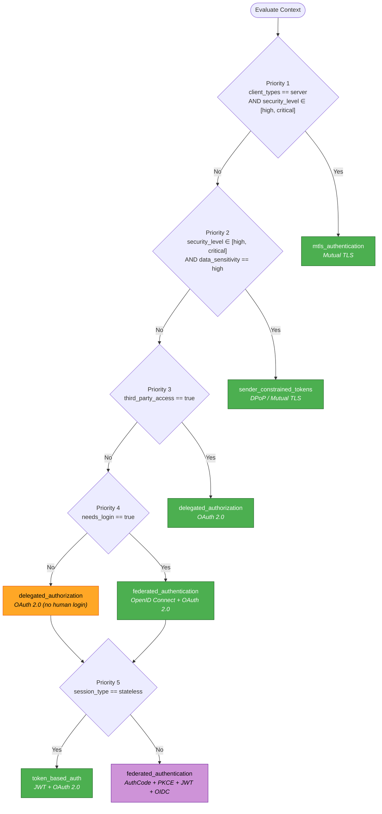

# Authentication — Summary

Purpose
- Guidance for choosing authentication patterns (OIDC, OAuth2, JWT, DPoP, mTLS) and practical hardening for web, mobile, and service-to-service scenarios.
- Scope: User login flows, delegated authorization, token strategies, and proof-of-possession for high-security APIs.

## Related Standards

| Standard | Relationship | Context |
|----------|-------------|---------|
| [encryption](../../security-quality/encryption/) | complementary | Encryption standards apply to token storage and transport security |
| [input-validation](../input-validation/) | complementary | All authentication inputs must be validated per input-validation standard |
| [rate-limiting](../../security-quality/rate-limiting/) | complementary | Login endpoints require rate limiting to prevent brute-force attacks |

## Context Inputs

These inputs drive the decision tree — provide them to get a tailored recommendation.

| Input | Type | Required | Default | Values | Description |
|-------|------|----------|---------|--------|-------------|
| `client_types` | enum | yes | `web` | web, mobile, server, third_party | Primary client type that will authenticate |
| `needs_login` | boolean | yes | `true` | — | Does the system require user login (human identity)? |
| `third_party_access` | boolean | yes | `false` | — | Do external parties need delegated access to resources? |
| `session_type` | enum | yes | `stateless` | stateful, stateless | How is user session maintained? |
| `security_level` | enum | yes | `medium` | low, medium, high, critical | Required security posture |
| `data_sensitivity` | enum | yes | `medium` | low, medium, high | Sensitivity classification of data being protected |
| `regulatory_required` | boolean | no | `false` | — | Subject to regulatory compliance (HIPAA, PCI-DSS, SOX)? |
| `user_count` | enum | no | `medium` | small, medium, large, massive | Expected number of concurrent authenticated users |

## Decision Tree

### Mermaid Diagram



### Text Fallback

- **Priority 1** → `mtls_authentication` — when `client_types == server` AND `security_level ∈ [high, critical]`. Machine-to-machine in high-security environments requires certificate-based mutual authentication.
- **Priority 2** → `sender_constrained_tokens` — when `security_level ∈ [high, critical]` AND `data_sensitivity == high`. Prevent token replay and theft via cryptographic sender binding.
- **Priority 3** → `delegated_authorization` — when `third_party_access == true`. Third-party access always requires explicit authorization grants with scoped permissions.
- **Priority 4** → `federated_authentication` — when `needs_login == true`. Never use OAuth2 alone for authentication — it is an authorization protocol. Else → `delegated_authorization` for M2M.
- **Priority 5** → `token_based_auth` — when `session_type == stateless`. Stateless architectures require self-contained tokens for request authentication.
- **Fallback** → `federated_authentication` — OAuth2 Authorization Code + PKCE + short-lived JWT with OpenID Connect.

> **Confidence**: high | **Risk if wrong**: critical

---

## Patterns

### 1. Federated Authentication

> Delegates identity verification to a trusted Identity Provider (IdP) using OpenID Connect. Enables SSO, centralizes credential management, and separates authentication concerns from application logic.

**Maturity**: standard

**Use when**
- Multiple client types (web, mobile, SPA) need to authenticate
- Single Sign-On (SSO) is required across applications
- Centralized identity management is needed
- Regulatory compliance requires auditable authentication

**Avoid when**
- System has no human users (pure machine-to-machine)
- Extreme latency constraints prevent IdP round-trips (rare)

**Tradeoffs**

| Pros | Cons |
|------|------|
| Centralizes credential management and rotation | Depends on external IdP availability |
| Enables SSO across multiple applications | Additional network latency for token exchange |
| IdP handles password policies, MFA, brute-force protection | Complexity of OIDC/OAuth2 flows |
| Reduces application attack surface | |

**Implementation Guidelines**
- Use Authorization Code Flow for server-side applications
- Enforce PKCE for all public clients (SPA, mobile, CLI)
- Validate ID token signature, issuer (iss), audience (aud), and expiration (exp)
- Use state parameter to prevent CSRF in authorization requests
- Store tokens securely — never in localStorage for web apps

**Common Errors**

| Error | Impact | Fix |
|-------|--------|-----|
| Using OAuth2 Implicit Flow | Token exposed in URL fragment, vulnerable to interception | Use Authorization Code Flow + PKCE instead |
| Skipping ID token validation | Accepting forged or expired tokens allows impersonation | Validate signature, iss, aud, exp, and nonce on every ID token |
| Storing tokens in localStorage | XSS can steal tokens | Use httpOnly cookies or in-memory storage with refresh token rotation |

**Standards & References**

| Standard | Type | Role | Reference |
|----------|------|------|-----------|
| OpenID Connect | protocol | Authentication layer on top of OAuth 2.0 | [OpenID Connect Core 1.0](https://openid.net/specs/openid-connect-core-1_0.html) |
| OAuth 2.0 | protocol | Authorization framework for delegated access | RFC 6749 |

---

### 2. Delegated Authorization

> Grants scoped, time-limited access to resources on behalf of a user or service without sharing credentials. Core OAuth 2.0 pattern for third-party integrations.

**Maturity**: standard

**Use when**
- Third-party applications need access to user resources
- Service-to-service authorization with scoped permissions
- API marketplace or partner integration scenarios

**Avoid when**
- You need to verify user identity (use federated_authentication instead)
- Internal services in a trusted network with mutual TLS

**Tradeoffs**

| Pros | Cons |
|------|------|
| User never shares credentials with third party | Complex grant flows to implement correctly |
| Granular scope control | Token management overhead |
| Revocable access without changing credentials | |

**Implementation Guidelines**
- Use Authorization Code Flow for user-facing apps
- Use Client Credentials Flow for machine-to-machine
- Define minimal scopes — never grant blanket access
- Implement token revocation endpoints

**Common Errors**

| Error | Impact | Fix |
|-------|--------|-----|
| Overly broad OAuth scopes | Third parties get more access than needed | Define granular, resource-specific scopes |
| No token revocation mechanism | Cannot revoke compromised third-party access | Implement RFC 7009 token revocation |

**Standards & References**

| Standard | Type | Role | Reference |
|----------|------|------|-----------|
| OAuth 2.0 | protocol | Delegated authorization framework | RFC 6749 |
| OAuth 2.0 Token Revocation | spec | Token revocation mechanism | RFC 7009 |

---

### 3. Token-Based Authentication

> Uses self-contained signed tokens (JWT) to authenticate requests without server-side session state. Enables horizontal scaling and stateless architectures.

**Maturity**: standard

**Use when**
- Stateless architecture required (microservices, serverless)
- Horizontal scaling without sticky sessions
- API-first or mobile-first applications

**Avoid when**
- Immediate token revocation is critical (prefer stateful sessions)
- Token payload size becomes a concern (many claims)

**Tradeoffs**

| Pros | Cons |
|------|------|
| No server-side session storage needed | Cannot be revoked before expiration without a denylist |
| Scales horizontally without session affinity | Token payload adds to every request size |
| Self-contained — reduces database lookups per request | Clock skew between services can cause issues |

**Implementation Guidelines**
- Short-lived access tokens (5–15 minutes)
- Refresh token rotation — issue new refresh token on each use
- Asymmetric signing (RS256 or ES256) — never symmetric for distributed systems
- Minimal claims — only include what the resource server needs
- Validate exp, iss, aud on every request

**Common Errors**

| Error | Impact | Fix |
|-------|--------|-----|
| Long-lived access tokens (hours or days) | Extended window for stolen token abuse | 5-15 minute TTL with refresh token rotation |
| Sensitive data in JWT payload | JWT payload is base64-encoded, not encrypted — visible to anyone | Minimal claims only; use token introspection for sensitive data |
| Symmetric signing (HS256) in distributed systems | Shared secret must be distributed to all services | Use asymmetric signing (RS256/ES256) with public key distribution via JWKS |

**Standards & References**

| Standard | Type | Role | Reference |
|----------|------|------|-----------|
| JWT | format | Self-contained signed token format | RFC 7519 |
| JWK | format | JSON Web Key format for key distribution | RFC 7517 |

---

### 4. Proof-of-Possession Tokens

> Tokens cryptographically bound to a specific client, preventing token replay and theft. The token is useless without the corresponding proof key.

**Maturity**: enterprise

**Use when**
- High-security APIs handling financial or personal data
- Zero-trust architectures where network position is not trusted
- Regulatory requirements mandate token binding

**Avoid when**
- Low-security internal tools where implementation cost is unjustified
- Client environments cannot perform cryptographic operations

**Tradeoffs**

| Pros | Cons |
|------|------|
| Prevents token theft and replay attacks | Higher implementation complexity |
| Strong cryptographic client binding | Client must manage cryptographic keys |
| Aligns with zero-trust principles | Additional latency for proof generation and validation |

**Implementation Guidelines**
- Prefer DPoP for public clients (SPA, mobile, CLI)
- Prefer mTLS certificate binding for backend services
- Validate proof on every request — not just at token issuance
- Include token hash in DPoP proof to bind proof to specific token

**Common Errors**

| Error | Impact | Fix |
|-------|--------|-----|
| Validating proof only at token issuance | Stolen token can be replayed without proof after issuance | Validate DPoP proof or mTLS certificate on every API request |
| Reusing DPoP proof JWTs | Replay attack possible with captured proof | Require unique jti and enforce nonce freshness |

**Standards & References**

| Standard | Type | Role | Reference |
|----------|------|------|-----------|
| DPoP | spec | Demonstrating Proof-of-Possession for OAuth tokens | RFC 9449 |
| Mutual TLS Client Certificate Binding | spec | TLS certificate-based token binding | RFC 8705 |

---

### 5. Mutual TLS Authentication

> Both client and server present X.509 certificates during TLS handshake, providing strong mutual identity verification at the transport layer.

**Maturity**: enterprise

**Use when**
- Service-to-service communication in high-security environments
- Zero-trust network architectures
- Regulatory requirements mandate transport-level authentication

**Avoid when**
- Client environments cannot manage certificates (end-user browsers)
- Certificate management infrastructure is not available
- Dynamic or ephemeral clients that cannot be pre-provisioned

**Tradeoffs**

| Pros | Cons |
|------|------|
| Strong identity at transport layer — before application code runs | Certificate provisioning and rotation complexity |
| No tokens to steal — identity tied to TLS session | Requires PKI infrastructure |
| Works with or without application-layer authentication | Cannot traverse certain proxies/load balancers without termination handling |

**Implementation Guidelines**
- Issue client certificates from a private CA — never self-signed in production
- Validate full certificate chain including revocation (CRL or OCSP)
- Automate certificate rotation with short lifetimes
- Configure TLS termination points to pass client certificate to backend

**Common Errors**

| Error | Impact | Fix |
|-------|--------|-----|
| Self-signed certificates in production | No trust chain — any self-signed cert would be accepted | Use a private CA with proper certificate chain validation |
| No certificate revocation checking | Compromised certificates remain valid until expiration | Enable CRL or OCSP checking on all TLS endpoints |

**Standards & References**

| Standard | Type | Role | Reference |
|----------|------|------|-----------|
| Mutual TLS | protocol | Transport-layer mutual authentication | RFC 8446 (TLS 1.3) |
| X.509 | format | Certificate format for identity | RFC 5280 |

---

## Examples

### Authorization Code Flow with PKCE

**Context**: Web or mobile app authenticating a user via OpenID Connect

**Correct** implementation:

```text
# 1. Generate PKCE code verifier and challenge
code_verifier = random_string(43..128)
code_challenge = base64url(sha256(code_verifier))

# 2. Redirect to IdP with PKCE challenge
redirect_to(idp_authorize_url,
  response_type = "code",
  client_id = CLIENT_ID,
  redirect_uri = CALLBACK_URL,
  scope = "openid profile email",
  state = random_csrf_token(),
  code_challenge = code_challenge,
  code_challenge_method = "S256"
)

# 3. Exchange code for tokens (server-side)
tokens = post(idp_token_url,
  grant_type = "authorization_code",
  code = received_code,
  code_verifier = code_verifier,
  client_id = CLIENT_ID,
  redirect_uri = CALLBACK_URL
)

# 4. Validate ID token
assert tokens.id_token.iss == EXPECTED_ISSUER
assert tokens.id_token.aud == CLIENT_ID
assert tokens.id_token.exp > now()
assert verify_signature(tokens.id_token, idp_jwks)
```

**Incorrect** implementation:

```text
# WRONG: Implicit flow — token exposed in URL
redirect_to(idp_authorize_url,
  response_type = "token",    # BAD: implicit flow
  client_id = CLIENT_ID,
  redirect_uri = CALLBACK_URL
)
# Token appears in URL fragment — vulnerable to interception
# No PKCE, no code exchange, no server-side validation
```

**Why**: Authorization Code + PKCE keeps tokens off the URL, exchanges a short-lived code server-side, and PKCE prevents code interception attacks. Implicit flow is deprecated (OAuth 2.0 Security BCP).

---

### JWT Access Token Validation

**Context**: API resource server validating an incoming access token

**Correct** implementation:

```text
function validate_token(token, jwks, expected_issuer, expected_audience):
  header = decode_header(token)
  key = jwks.find_key(header.kid)

  claims = verify_and_decode(token, key)

  assert claims.iss == expected_issuer
  assert claims.aud == expected_audience
  assert claims.exp > now()
  assert claims.iat <= now()

  return claims
```

**Incorrect** implementation:

```text
# WRONG: No validation — just decode and trust
function validate_token(token):
  claims = base64_decode(token.split(".")[1])
  return claims    # No signature check, no expiry check
```

**Why**: JWTs are signed, not encrypted. Anyone can read the payload. Without signature verification, an attacker can forge tokens. Without expiry checks, stolen tokens work forever.

---

## Security Hardening

### Transport
- TLS 1.2+ required for all authentication endpoints
- HSTS enabled with min 1-year max-age and includeSubDomains
- Secure cookie flag set on all authentication cookies

### Data Protection
- Tokens stored in httpOnly cookies (web) or secure keychain (mobile)
- Never store tokens in localStorage or sessionStorage
- Refresh tokens encrypted at rest if persisted server-side

### Access Control
- Authorization Code Flow for all user-facing auth
- PKCE enforced for all public clients
- State parameter validated to prevent CSRF

### Input / Output
- Redirect URIs validated against registered allowlist
- Token claims validated on every request (iss, aud, exp)
- ID token nonce validated to prevent replay

### Secrets
- JWKS endpoint for public key distribution
- Key rotation on a regular schedule
- Asymmetric keys only (RS256 or ES256)
- Client secrets stored in secrets manager, never in code

### Monitoring
- Log all authentication events (success and failure)
- Alert on repeated authentication failures (brute-force detection)
- Monitor token issuance rates for anomalies
- Track and alert on authentication from unusual geographies

---

## Anti-Patterns

| Anti-Pattern | Severity | Description | Fix |
|-------------|----------|-------------|-----|
| OAuth2 without OIDC for user authentication | **critical** | Using OAuth2 alone for login. OAuth2 is an authorization protocol — it proves what you can access, not who you are. Without OIDC's ID token, there is no standard, validated assertion of user identity. | Always use OpenID Connect on top of OAuth2 when authenticating users |
| Bearer tokens in high-security environments | **high** | Using plain bearer tokens (anyone who has the token can use it) in environments handling sensitive data. A stolen bearer token gives full access until expiration. | Use sender-constrained tokens (DPoP or mTLS certificate binding) |
| Long-lived access tokens | **high** | Access tokens with TTL of hours or days. Extends the window for stolen token abuse and makes revocation difficult in stateless architectures. | Short TTL (5-15 min) with refresh token rotation |
| Implicit Flow | **critical** | OAuth2 Implicit Flow (response_type=token) returns tokens in URL fragments, exposing them to browser history, referrer headers, and intermediary proxies. Deprecated by OAuth 2.0 Security Best Current Practice. | Authorization Code Flow + PKCE |
| Tokens in localStorage | **high** | Storing access or refresh tokens in browser localStorage. Any XSS vulnerability gives attackers direct access to stored tokens. | Use httpOnly cookies with Secure, SameSite=Strict flags, or in-memory storage with refresh rotation |
| Symmetric signing (HS256) in distributed systems | **medium** | Using HS256 requires sharing the signing secret with every service that validates tokens. Secret compromise affects all services simultaneously. | Use asymmetric signing (RS256 or ES256) with JWKS public key distribution |
| Resource Owner Password Credentials (ROPC) grant | **critical** | The ROPC grant type collects user credentials directly in the client application and sends them to the authorization server. This defeats the purpose of OAuth2, exposes passwords to the client, and prevents the IdP from enforcing MFA or adaptive authentication. | Use Authorization Code Flow + PKCE. For legacy migration, implement a bridge that wraps ROPC behind an Authorization Code endpoint during transition |

---

## Checklist

| ID | Category | Description | Severity |
|----|----------|-------------|----------|
| AUTH-01 | security | OpenID Connect used for all user authentication (not raw OAuth2) | **critical** |
| AUTH-02 | security | PKCE enforced for all public clients (SPA, mobile, CLI) | **critical** |
| AUTH-03 | security | Access tokens are short-lived (≤15 minutes) | **high** |
| AUTH-04 | security | Refresh token rotation implemented (new token on each use) | **high** |
| AUTH-05 | security | Asymmetric signing used (RS256 or ES256), not HS256 | **high** |
| AUTH-06 | correctness | All token claims validated on every request (iss, aud, exp) | **critical** |
| AUTH-07 | security | Proof-of-Possession (DPoP/mTLS) used when security_level is high/critical | **high** |
| AUTH-08 | security | HTTPS enforced on all authentication endpoints (TLS 1.2+) | **critical** |
| AUTH-09 | security | Signing keys rotated on a regular schedule via JWKS | **high** |
| AUTH-10 | security | Brute-force protection on login endpoints (lockout, delay, or CAPTCHA) | **high** |
| AUTH-11 | security | Tokens stored securely (httpOnly cookies for web, keychain for mobile) | **high** |
| AUTH-12 | compliance | Authentication meets NIST AAL2 or higher for regulated environments | **high** |
| AUTH-13 | reliability | Redirect URIs validated against registered allowlist | **critical** |
| AUTH-14 | security | No deprecated flows used (Implicit, Resource Owner Password) | **critical** |

---

## Compliance

### Standards

| Standard | Relevance | Reference |
|----------|-----------|-----------|
| ISO/IEC 27001 | Information Security Management System — authentication controls | ISO/IEC 27001:2022 |
| ISO/IEC 27002 | Security controls — access control and cryptography | ISO/IEC 27002:2022 Section 8 |
| NIST SP 800-63 | Digital Identity Guidelines — authentication assurance levels | [NIST 800-63-4](https://pages.nist.gov/800-63-4/) |
| OWASP ASVS | Application Security Verification Standard — auth requirements | [OWASP ASVS](https://owasp.org/www-project-application-security-verification-standard/) |

### Requirements Mapping

| Control | Description | Maps To |
|---------|-------------|---------|
| authentication_strength | Authentication mechanisms meet required assurance level | NIST SP 800-63 AAL2, OWASP ASVS 2.x (Authentication) |
| session_management | Sessions are securely created, maintained, and destroyed | OWASP ASVS 3.x (Session Management), ISO 27002 8.5 (Secure Authentication) |
| credential_storage | Credentials stored using adaptive hashing algorithms | OWASP ASVS 2.4 (Credential Storage), NIST SP 800-63B Section 5.1.1.2 |

---

## Prompt Recipes

### Greenfield Authentication
**Scenario**: Design authentication for a new application

```text
Design an authentication system for a new application.

Context:
- Client type: [web/mobile/server/third_party]
- Needs user login: [yes/no]
- Session type: [stateful/stateless]
- Security level: [low/medium/high/critical]

Requirements:
- Use OpenID Connect for user authentication
- Enforce PKCE for all public clients
- Short-lived access tokens (5-15 min) with refresh token rotation
- Validate all token claims (iss, aud, exp) on every request

Avoid: Implicit flow, long-lived tokens, localStorage token storage,
symmetric signing in distributed systems.
```

### High-Security API
**Scenario**: Design authentication for high-security API with PoP tokens

```text
Design an authentication system for a high-security API handling sensitive data.

Requirements:
- Prevent token replay attacks using Proof-of-Possession
- Stateless architecture with JWT access tokens
- Support web and mobile clients
- Zero-trust: do not rely on network position for security

Use:
- OAuth2 Authorization Code with PKCE
- OpenID Connect for identity
- DPoP for public clients, mTLS for backend services
- Asymmetric signing (ES256 preferred)

Avoid: Bearer tokens without sender binding, implicit flow,
symmetric signing, long-lived tokens.
```

### Audit Existing Implementation
**Scenario**: Audit an existing authentication implementation

```text
Audit the existing authentication implementation against these criteria:

1. Is OIDC used for authentication (not raw OAuth2)?
2. Is PKCE enforced for all public clients?
3. Are access tokens short-lived (≤15 minutes)?
4. Is refresh token rotation implemented?
5. Are tokens signed asymmetrically (RS256/ES256)?
6. Are all claims validated (iss, aud, exp) on every request?
7. Is token storage secure (httpOnly cookies, not localStorage)?
8. Is brute-force protection on login endpoints?
9. Are credentials hashed with adaptive algorithms?
10. Is PoP (DPoP/mTLS) used if security_level is high/critical?

For each item: report compliant/non-compliant/not-applicable with evidence.
```

### Migration from Sessions to Tokens
**Scenario**: Migrate from session-based to token-based authentication

```text
Plan a migration from server-side session authentication to token-based (JWT)
authentication.

Current state: [describe current session-based auth]

Migration plan must:
- Support both old (session) and new (token) auth during transition
- Not require all clients to upgrade simultaneously
- Maintain security guarantees during migration
- Include rollback plan if issues arise

Key decisions:
- Token signing algorithm: ES256 (recommended) or RS256
- Token lifetime: 5-15 minutes with refresh rotation
- Session-to-token bridge: validate existing session, issue token
```

---

## Notes
- Patterns can be layered: e.g., OIDC for identity plus sender-constrained tokens for binding; the decision tree orders specific, high-security rules first so they remain reachable.

## Links
- Full standard: [authentication.yaml](authentication.yaml)
