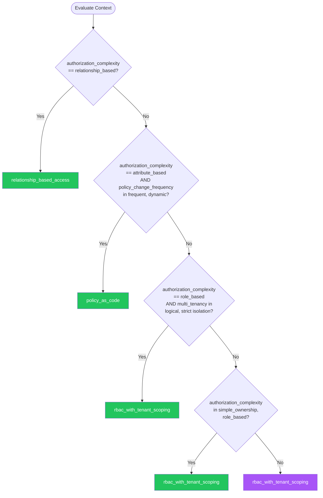

# Authorization — Summary

**Purpose**
- Authorization patterns including RBAC, ABAC, ReBAC, and policy-as-code for access control design
- Scope: Permission models, policy engines, least privilege enforcement, and authorization for APIs, data, and UI elements

## Related Standards

| Standard | Relationship | Context |
|----------|-------------|---------|
| [authentication](../authentication/) | complementary | Authentication establishes identity; authorization determines what that identity can do |
| [api-design](../api-design/) | complementary | API endpoints enforce authorization decisions |
| [service-architecture](../../application-architecture/service-architecture/) | complementary | Inter-service authorization in microservices architectures |

## Context Inputs

These inputs drive the decision tree — provide them to get a tailored recommendation.

| Input | Type | Required | Default | Values | Description |
|-------|------|----------|---------|--------|-------------|
| authorization_complexity | enum | yes | role_based | simple_ownership, role_based, attribute_based, relationship_based | Complexity of authorization rules needed |
| multi_tenancy | enum | yes | none | none, logical_isolation, strict_isolation | Multi-tenant isolation requirements |
| policy_change_frequency | enum | yes | infrequent | static, infrequent, frequent, dynamic | How often authorization policies change |
| enforcement_points | enum | yes | api_layer | api_layer, multi_layer, distributed | Where authorization is enforced |

## Decision Tree

### Mermaid Diagram



### Text Fallback

- **Priority 1** → `relationship_based_access` — when authorization_complexity == relationship_based. Relationship-based access control (ReBAC) is ideal for social graphs, document sharing, organizational hierarchies, and any domain where access depends on relationships between entities.
- **Priority 2** → `policy_as_code` — when authorization_complexity == attribute_based AND policy_change_frequency in [frequent, dynamic]. Frequently changing attribute-based policies benefit from externalized policy-as-code engines that decouple policy from application code.
- **Priority 3** → `rbac_with_tenant_scoping` — when authorization_complexity == role_based AND multi_tenancy in [logical_isolation, strict_isolation]. Multi-tenant RBAC requires roles scoped to tenants — a user's admin role in Tenant A must not grant access to Tenant B.
- **Priority 4** → `rbac_with_tenant_scoping` — when authorization_complexity in [simple_ownership, role_based]. Standard RBAC is sufficient for most applications with well-defined user roles and straightforward permission requirements.
- **Fallback** → `rbac_with_tenant_scoping` — RBAC with proper scoping is the safe default for most applications

> **Confidence**: high | **Risk if wrong**: critical

---

## Patterns

### 1. RBAC with Tenant Scoping

> Role-Based Access Control where permissions are grouped into roles and roles are assigned to users. In multi-tenant systems, role assignments are scoped to a specific tenant to prevent cross-tenant access.

**Maturity**: standard

**Use when**
- Well-defined user roles (admin, editor, viewer)
- Permissions are relatively stable
- Multi-tenant SaaS applications

**Avoid when**
- Access depends on relationships between objects (use ReBAC)
- Access depends on dynamic attributes (use ABAC)

**Tradeoffs**

| Pros | Cons |
|------|------|
| Simple to understand and implement | Role explosion: too many fine-grained roles become unmanageable |
| Easy to audit: enumerate role memberships | Cannot express contextual rules (time, location, resource attributes) |
| Well-supported by frameworks and libraries | Coarse-grained: all users in a role get same permissions |

**Implementation Guidelines**
- Define roles around job functions, not individual permissions
- Use hierarchical roles: admin inherits editor permissions, editor inherits viewer
- Scope role assignments to tenant: (user_id, tenant_id, role) tuple
- Enforce at the API layer: middleware checks role before handler executes
- Default deny: if no role grants access, deny
- Implement least privilege: start with viewer, grant higher roles explicitly
- Log all authorization decisions (especially denials)
- Review role assignments quarterly: remove stale permissions
- Never check roles in business logic — check permissions; roles map to permissions

**Common Errors**

| Error | Impact | Fix |
|-------|--------|-----|
| Checking role names in code instead of permissions | Tight coupling: adding a new role requires code changes everywhere | Check permissions, not roles. Roles are containers for permissions. |
| No tenant scoping on role assignments | User with admin role in Tenant A can access Tenant B | Always include tenant_id in role assignment and authorization checks |

**Standards & References**

| Standard | Type | Role | Reference |
|----------|------|------|-----------|
| NIST RBAC Model (SP 800-162) | standard | Formal RBAC model definition | |

---

### 2. Policy-as-Code Authorization

> Externalize authorization logic into a dedicated policy engine using a policy language. Policies are version-controlled, testable, and deployable independently of application code. Supports ABAC by evaluating attributes at decision time.

**Maturity**: enterprise

**Use when**
- Complex, frequently changing authorization rules
- Need to audit and test policies independently
- Multiple services need consistent authorization
- Attribute-based decisions (time, geography, resource properties)

**Avoid when**
- Simple RBAC is sufficient
- Team lacks capacity to manage policy infrastructure

**Tradeoffs**

| Pros | Cons |
|------|------|
| Policies decoupled from application code | Additional infrastructure (policy engine) |
| Policies are testable and version-controlled | Policy language learning curve |
| Consistent authorization across services | Latency for policy evaluation (mitigated by local caching) |
| Supports complex rules: time-based, attribute-based, contextual | |

**Implementation Guidelines**
- Choose a policy engine: OPA/Rego, Cedar, Casbin, or cloud-native (AWS IAM, Azure Policy)
- Structure policies: one policy file per resource type or domain
- Test policies: unit tests for each policy rule with allow and deny scenarios
- Version control policies alongside application code (or dedicated policy repo)
- Deploy policies via CI/CD — same rigor as application deployment
- Cache policy decisions where safe (immutable inputs = cacheable)
- Implement policy decision logging for audit trail
- Use policy bundles for distributing policies to sidecar/embedded engines

**Common Errors**

| Error | Impact | Fix |
|-------|--------|-----|
| Embedding policy engine without input validation | Malformed policy input leads to unexpected allow/deny decisions | Validate all policy inputs; define schema for policy input objects |
| No policy testing | Policy changes break authorization — too permissive or too restrictive | Write policy unit tests; run in CI before deployment; test both allow and deny paths |

**Standards & References**

| Standard | Type | Role | Reference |
|----------|------|------|-----------|
| NIST SP 800-162 (ABAC Guide) | standard | Attribute-Based Access Control definition and guidance | |

---

### 3. Relationship-Based Access Control (ReBAC)

> Determine access based on the relationship between the requesting user and the target resource. Ideal for systems where access is inherently relational: document sharing, organizational hierarchies, social networks, and collaborative workspaces.

**Maturity**: enterprise

**Use when**
- Document sharing and collaboration platforms
- Organizational hierarchies (manager can see report's data)
- Social features (friends, followers, team members)
- Nested resource ownership (project > folder > document)

**Avoid when**
- Simple role-based access is sufficient
- No relational data model

**Tradeoffs**

| Pros | Cons |
|------|------|
| Natural model for collaboration and sharing | More complex to implement and reason about |
| Fine-grained: access per resource per user relationship | Relationship graph can become performance bottleneck |
| Handles complex hierarchies and inheritance | Requires specialized infrastructure (relationship graph store) |

**Implementation Guidelines**
- Model relationships as tuples: (user, relation, object) — e.g., (alice, editor, doc:123)
- Define relation schemas: document has viewer, editor, owner; folder has viewer, editor
- Implement relation inheritance: folder editor implies document editor for documents in folder
- Use a dedicated authorization service (SpiceDB, Ory Keto, Auth0 FGA)
- Evaluate access by traversing the relationship graph from user to resource
- Cache frequently checked relationships for performance
- Implement relationship consistency: when resource is deleted, clean up relationships
- Test with complex scenarios: transitive access, revocation, concurrent modifications

**Common Errors**

| Error | Impact | Fix |
|-------|--------|-----|
| Not handling relationship revocation propagation | User removed from team but still has access via cached/stale relationships | Implement relationship change events; invalidate caches; check consistency |
| Unbounded graph traversal for deeply nested hierarchies | Authorization check takes seconds for deep folder structures | Limit traversal depth; materialize frequently checked paths; use purpose-built graph stores |

**Standards & References**

| Standard | Type | Role | Reference |
|----------|------|------|-----------|
| Google Zanzibar | reference | Foundational paper for ReBAC at scale | https://research.google/pubs/pub48190/ |

---

### 4. Resource-Level Authorization

> Enforce authorization at the individual resource level, ensuring users can only access specific resources they own or have been granted access to. Prevents horizontal privilege escalation where a user accesses another user's resources by manipulating IDs.

**Maturity**: standard

**Use when**
- Users own resources (profiles, documents, orders)
- Need to prevent IDOR (Insecure Direct Object Reference)
- API endpoints accept resource IDs from client

**Avoid when**
- Resources are public or access is uniform

**Tradeoffs**

| Pros | Cons |
|------|------|
| Prevents IDOR and horizontal privilege escalation | Requires ownership/permission check on every resource access |
| Fine-grained access at individual resource level | Additional database query per request for ownership verification |
| Simple to implement as middleware or decorator | |

**Implementation Guidelines**
- Always verify resource ownership: fetch resource, check owner matches authenticated user
- Never trust client-supplied IDs without authorization check
- Use query scoping: WHERE user_id = :authenticated_user_id (prevents returning other users' data)
- Implement as middleware or decorator to ensure consistent enforcement
- For shared resources: check explicit sharing record or role-based access
- Log all access attempts including the resource ID and authorization decision
- Return 404 (not 403) for unauthorized resources to prevent enumeration

**Common Errors**

| Error | Impact | Fix |
|-------|--------|-----|
| Trusting client-supplied resource IDs without ownership check | IDOR vulnerability — user accesses any resource by guessing/enumerating IDs | Always verify ownership or permission before returning resource data |
| Returning 403 for unauthorized resources | Reveals resource existence — enables enumeration | Return 404 for resources the user is not authorized to access |

**Standards & References**

| Standard | Type | Role | Reference |
|----------|------|------|-----------|
| OWASP IDOR Prevention | reference | Prevention of Insecure Direct Object Reference | |

---

## Examples

### Authorization Middleware — Permission Check

**Context**: Implementing API authorization that checks permissions, not roles

**Correct** implementation:

```text
# Authorization middleware — check permissions, not roles
from functools import wraps

def require_permission(permission, resource_param=None):
    """Decorator that checks the user has a specific permission.
    Optionally checks resource-level ownership."""
    def decorator(handler):
        @wraps(handler)
        async def wrapper(request, *args, **kwargs):
            user = request.authenticated_user
            tenant_id = request.tenant_id

            # Check permission (role -> permission mapping is in auth service)
            if not await auth_service.has_permission(
                user_id=user.id,
                tenant_id=tenant_id,
                permission=permission
            ):
                # Log authorization failure
                security_log.warning({
                    "event": "authorization_denied",
                    "user_id": user.id,
                    "permission": permission,
                    "resource": request.path,
                })
                raise NotFoundError()  # 404 not 403 — prevent enumeration

            # Resource-level check if applicable
            if resource_param:
                resource_id = kwargs.get(resource_param)
                if not await auth_service.can_access_resource(
                    user_id=user.id,
                    tenant_id=tenant_id,
                    resource_id=resource_id
                ):
                    raise NotFoundError()

            return await handler(request, *args, **kwargs)
        return wrapper
    return decorator

# Usage
@require_permission("documents:read", resource_param="doc_id")
async def get_document(request, doc_id):
    return await document_service.get(doc_id)
```

**Incorrect** implementation:

```text
# WRONG: Checking role names in code + no resource-level check
async def get_document(request, doc_id):
    user = request.user
    # WRONG: Checking role name, not permission
    if user.role != "admin" and user.role != "editor":
        raise ForbiddenError()  # WRONG: 403 reveals existence

    # WRONG: No resource-level check — any editor can access any document
    doc = await db.documents.find_one({"_id": doc_id})
    # WRONG: No tenant scoping — cross-tenant access possible
    return doc
```

**Why**: The correct implementation checks permissions (not roles), enforces resource-level ownership, scopes to tenant, returns 404 instead of 403, and logs authorization failures. The incorrect version hardcodes role names, has no resource-level check, and enables cross-tenant access.

---

## Security Hardening

### Transport
- Authorization tokens transmitted only over TLS
- Policy engine communication encrypted (mTLS for sidecar pattern)

### Data Protection
- Role assignments and permissions are not exposed to unauthorized users
- Policy evaluation inputs do not leak sensitive attributes

### Access Control
- Authorization configuration changes require privileged access
- Role assignment changes logged as administrative security events

### Input/Output
- Resource IDs validated against expected format before authorization check
- Authorization decisions are deterministic: same input always produces same output

### Secrets
- Policy engine admin credentials stored in secret manager
- Service-to-service authorization uses short-lived tokens

### Monitoring
- All authorization denials logged with full context
- Alert on spike in authorization failures (potential enumeration attack)
- Monitor for privilege escalation: user gaining new admin roles

---

## Anti-Patterns

| Anti-Pattern | Severity | Description | Fix |
|-------------|----------|-------------|-----|
| Role Checking Instead of Permission Checking | high | Checking role names directly in application code (if user.role == "admin") instead of checking permissions. Adding a new role requires changing code everywhere instead of just updating the role-to-permission mapping. | Check permissions, not roles. Roles are containers that map to permissions. |
| Missing Resource-Level Authorization (IDOR) | critical | Verifying the user's role but not checking if they own or have access to the specific resource. Any authenticated user can access any resource by manipulating the ID parameter. | Always verify resource ownership or explicit access grant; use query scoping |
| Client-Side Authorization Only | critical | Hiding UI elements based on role but not enforcing authorization on the server side. Users can access any API endpoint directly, bypassing UI restrictions entirely. | Server-side authorization is mandatory. Client-side is cosmetic only. |

---

## Checklist

| ID | Category | Description | Severity |
|----|----------|-------------|----------|
| AUTHZ-01 | security | Authorization enforced server-side on every API endpoint | **critical** |
| AUTHZ-02 | security | Permissions checked, not role names, in application code | **high** |
| AUTHZ-03 | security | Resource-level ownership verified (IDOR prevention) | **critical** |
| AUTHZ-04 | security | Tenant isolation enforced in all data queries | **critical** |
| AUTHZ-05 | security | Default deny: no role/permission = no access | **critical** |
| AUTHZ-06 | security | Authorization denials logged with full context | **high** |
| AUTHZ-07 | security | 404 returned for unauthorized resources (not 403) | **medium** |
| AUTHZ-08 | security | Role assignments scoped to tenant | **high** |

---

## Compliance

### Standards

| Standard | Relevance | Reference |
|----------|-----------|-----------|
| NIST SP 800-162 (ABAC) | Attribute-Based Access Control implementation guidance | |
| OWASP Access Control Cheat Sheet | Web application access control best practices | https://cheatsheetseries.owasp.org/cheatsheets/Access_Control_Cheat_Sheet.html |

### Requirements Mapping

| Control | Description | Maps To |
|---------|-------------|---------|
| access_control_enforcement | Enforce authorization on every request to protected resources | OWASP Top 10 A01:2021 (Broken Access Control), SOC 2 CC6.1 |
| least_privilege | Users have minimum permissions needed for their function | NIST SP 800-53 AC-6, PCI DSS 7.1 |

---

## Prompt Recipes

### Design authorization for a new application
**Scenario**: greenfield

```text
Design the authorization model for a new application.

Context:
- User types: [list roles/personas]
- Resources: [list resource types]
- Multi-tenant: [yes/no]
- Access patterns: [ownership/role/attribute/relationship]

Requirements:
- Define permission model (RBAC/ABAC/ReBAC)
- Map roles to permissions
- Define resource-level access rules
- Tenant isolation strategy
- API enforcement approach (middleware/decorator/gateway)
```

---

### Audit authorization implementation
**Scenario**: audit

```text
Audit the authorization implementation:

1. Is authorization enforced on every API endpoint?
2. Are permissions checked (not role names)?
3. Is resource-level ownership verified (IDOR prevention)?
4. Is tenant isolation enforced in all queries?
5. Is default deny implemented (no role = no access)?
6. Are authorization denials logged?
7. Are role assignments reviewed regularly?
8. Is the authorization model documented?
9. Are there tests for authorization rules?
10. Can authorization be bypassed via alternate paths?
```

---

### Migrate from simple role checks to proper authorization
**Scenario**: migration

```text
Migrate from hardcoded role checks to a proper authorization model.

Steps:
1. Inventory all authorization checks in codebase
2. Extract permissions from role checks
3. Build role-to-permission mapping
4. Replace role checks with permission checks
5. Add resource-level authorization where missing
6. Implement authorization middleware/decorator
7. Add tenant scoping to all authorization checks
8. Add authorization denial logging
9. Write authorization tests
10. Validate no authorization bypass paths remain
```

---

### Implement externalized policy-as-code
**Scenario**: optimization

```text
Implement policy-as-code authorization with a policy engine.

Context:
- Policy engine: [OPA/Cedar/Casbin/cloud-native]
- Current authorization: [describe current approach]
- Policy complexity: [simple RBAC/ABAC/ReBAC]

Steps:
1. Define policy schema and input format
2. Write policies in policy language
3. Write policy unit tests
4. Deploy policy engine (sidecar/embedded/service)
5. Integrate application with policy engine
6. Implement policy decision caching
7. Set up policy deployment pipeline
8. Add policy evaluation logging
```

---

## Notes
- Authentication is a prerequisite — authorization assumes identity is already established
- RBAC is the safe default; escalate to ABAC/ReBAC only when RBAC cannot express the needed rules
- Always return 404 (not 403) for unauthorized resources to prevent enumeration
- Resource-level authorization complements role-based authorization — both are needed

## Links
- Full standard: [authorization.yaml](authorization.yaml)
