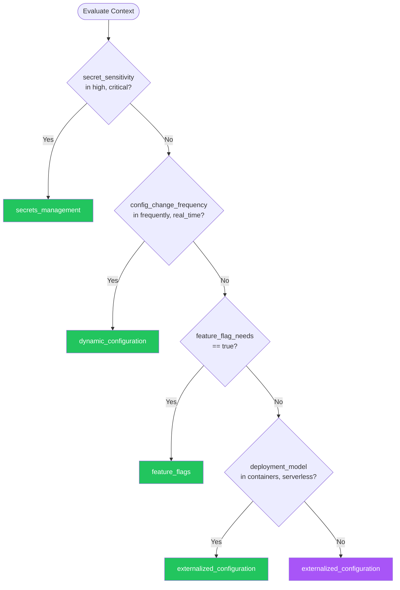

# Configuration Management — Summary

**Purpose**
- Configuration management patterns for externalizing configuration, managing secrets, feature flags, and environment-specific settings
- Scope: Covers the spectrum from static config files to dynamic runtime configuration

## Related Standards

| Standard | Relationship | Context |
|----------|-------------|---------|
| [authentication](../authentication/) | complementary | Authentication configuration (issuer, audience) must be externalized |
| [logging-observability](../logging-observability/) | complementary | Log levels and sampling rates should be dynamically configurable |
| [data-persistence](../data-persistence/) | complementary | Database connection strings must use secrets management |
| [api-design](../api-design/) | complementary | API timeouts and rate limits should be configurable per environment |

## Context Inputs

These inputs drive the decision tree — provide them to get a tailored recommendation.

| Input | Type | Required | Default | Values | Description |
|-------|------|----------|---------|--------|-------------|
| deployment_model | enum | yes | containers | traditional_servers, containers, serverless, edge | How the application is deployed |
| environment_count | enum | yes | standard | single, standard, many | Number of environments to manage |
| secret_sensitivity | enum | yes | high | low, medium, high, critical | Sensitivity level of secrets in the system |
| config_change_frequency | enum | yes | moderate | rarely, moderate, frequently, real_time | How often configuration changes without code deployment |
| feature_flag_needs | boolean | yes | true | — | Does the system need feature flags for progressive rollout? |

## Decision Tree

### Mermaid Diagram



### Text Fallback

- **Priority 1** → `secrets_management` — when secret_sensitivity in [high, critical]. High-sensitivity secrets must use a dedicated secrets manager, never env vars or files
- **Priority 2** → `dynamic_configuration` — when config_change_frequency in [frequently, real_time]. Frequently changing config needs dynamic configuration without redeployment
- **Priority 3** → `feature_flags` — when feature_flag_needs == true. Progressive rollout and experimentation require feature flags
- **Priority 4** → `externalized_configuration` — when deployment_model in [containers, serverless]. Container and serverless deployments should externalize all configuration
- **Fallback** → `externalized_configuration` — Externalize all configuration per Twelve-Factor App; use secrets manager for credentials

> **Confidence**: high | **Risk if wrong**: high

---

## Patterns

### 1. Externalized Configuration

> All configuration is external to the application code and artifact. The same build artifact runs in any environment, with environment-specific configuration injected at runtime. Follows Twelve-Factor App principle III.

**Maturity**: standard

**Use when**
- Any application deployed to multiple environments
- Container-based deployments (Docker, Kubernetes)
- Need to change configuration without rebuilding

**Avoid when**
- Single-use scripts or tools with hardcoded settings

**Tradeoffs**

| Pros | Cons |
|------|------|
| Same artifact in all environments (build once, deploy anywhere) | Additional infrastructure for config management |
| Configuration changes don't require code changes or rebuilds | Must validate configuration at startup (fail fast if misconfigured) |
| Clear separation of code and config | Environment variable sprawl without structure |
| Environment parity — reduce config drift | |

**Implementation Guidelines**
- Configuration sources in priority order: env vars > config files > defaults
- Use structured configuration (YAML/JSON files) for complex settings
- Validate all configuration at application startup (fail fast)
- Use typed configuration objects — not raw string lookups everywhere
- Document every configuration parameter with type, default, and description
- Never commit environment-specific values to source control

**Common Errors**

| Error | Impact | Fix |
|-------|--------|-----|
| Hardcoded configuration in application code | Must rebuild and redeploy to change any setting | Externalize to environment variables or config files |
| No validation at startup | Application starts with missing or invalid config, fails at runtime | Validate all required config at startup; fail fast with clear error message |
| Environment variables for complex nested config | Dozens of flat env vars, hard to manage and document | Use structured config files (YAML/JSON) for complex settings; env vars for simple overrides |

**Standards & References**

| Standard | Type | Role | Reference |
|----------|------|------|-----------|
| Twelve-Factor App (Factor III) | spec | Store config in the environment | https://12factor.net/config |

---

### 2. Secrets Management

> Dedicated secrets manager for storing, rotating, and accessing credentials, API keys, certificates, and other sensitive configuration. Secrets are never stored in code, config files, or plain environment variables.

**Maturity**: standard

**Use when**
- Any system with database credentials, API keys, or certificates
- Compliance requires audit trail for secret access
- Secrets need automated rotation
- Multiple services need shared secrets (service mesh, shared APIs)

**Avoid when**
- Local development with no sensitive data (use .env files with .gitignore)

**Tradeoffs**

| Pros | Cons |
|------|------|
| Secrets encrypted at rest and in transit | Additional infrastructure dependency (secrets manager availability) |
| Access control and audit logging for every secret access | Latency for secret retrieval (mitigate with caching) |
| Automated rotation without redeployment | Cost for managed secrets services |
| Centralized management across services | |

**Implementation Guidelines**
- Use a dedicated secrets manager (HashiCorp Vault, AWS Secrets Manager, Azure Key Vault)
- Never store secrets in source code, config files, or plain env vars
- Implement automated secret rotation with zero-downtime
- Use short-lived credentials where possible (temporary tokens > static keys)
- Cache secrets in memory with TTL — don't fetch on every request
- Audit all secret access — who accessed what, when

**Common Errors**

| Error | Impact | Fix |
|-------|--------|-----|
| Secrets in source code or Git history | Credentials exposed to anyone with repo access; persist in Git history forever | Use secrets manager; scan Git history for leaked secrets and rotate immediately |
| Secrets in plain-text environment variables | Visible in process listings, container inspect, and crash dumps | Use secrets manager that injects secrets into memory, not env vars |
| No secret rotation | Compromised credential remains valid indefinitely | Automate rotation; use short-lived tokens; alert on rotation failures |

**Standards & References**

| Standard | Type | Role | Reference |
|----------|------|------|-----------|
| OWASP Secrets Management | spec | Best practices for secrets handling | https://cheatsheetseries.owasp.org/cheatsheets/Secrets_Management_Cheat_Sheet.html |

---

### 3. Feature Flags

> Runtime toggles that control feature visibility and behavior without code deployment. Enables progressive rollout, A/B testing, kill switches, and operational controls.

**Maturity**: standard

**Use when**
- Progressive rollout of new features (percentage, user segment)
- A/B testing and experimentation
- Kill switches for features that may cause issues
- Trunk-based development with incomplete features behind flags

**Avoid when**
- Permanent configuration (use externalized config instead)
- Security controls (feature flags are not access control)

**Tradeoffs**

| Pros | Cons |
|------|------|
| Deploy without releasing — decouple deployment from release | Technical debt if flags are not cleaned up |
| Progressive rollout reduces blast radius | Testing complexity — must test with flags on and off |
| Kill switch for instant rollback without redeploy | Flag management overhead at scale |
| Enable trunk-based development (incomplete features behind flags) | |

**Implementation Guidelines**
- Use a feature flag service (LaunchDarkly, Unleash, Flagsmith, or custom)
- Categorize flags: release (temporary), ops (permanent), experiment (temporary)
- Set expiration dates on release flags — enforce cleanup
- Default flags to 'off' in production (new features disabled by default)
- Log flag evaluations for debugging
- Test both flag states in CI (on and off)

**Common Errors**

| Error | Impact | Fix |
|-------|--------|-----|
| Never cleaning up old feature flags | Hundreds of flags — nobody knows which are still needed; dead code accumulates | Set expiration dates; track flag lifecycle; remove flags after full rollout |
| Using feature flags for permanent config | Flag management overhead for settings that never change | Use externalized configuration for permanent settings; flags for temporary rollout only |
| Feature flags as access control | Users can potentially manipulate flags; no audit trail for authorization | Use proper authorization (RBAC, ABAC) for access control, not feature flags |

**Standards & References**

| Standard | Type | Role | Reference |
|----------|------|------|-----------|
| OpenFeature | spec | Vendor-neutral feature flag API | https://openfeature.dev/ |

---

### 4. Dynamic Configuration

> Configuration that can be changed at runtime without restart or redeployment. Changes propagate to running instances via polling or push notification.

**Maturity**: advanced

**Use when**
- Need to change behavior (rate limits, thresholds) without redeploy
- Configuration must respond to operational events in real-time
- Log level changes during incident investigation

**Avoid when**
- Configuration changes are rare (static externalized config suffices)
- Startup-only configuration (connection pools, thread counts)

**Tradeoffs**

| Pros | Cons |
|------|------|
| Instant configuration changes without deployment | Complexity of config change propagation and consistency |
| Respond to operational events in real-time | Risk of runtime misconfiguration affecting live traffic |
| Reduce deployment frequency for config-only changes | Need rollback mechanism for bad config changes |

**Implementation Guidelines**
- Use a configuration service (Consul, etcd, Azure App Configuration)
- Poll for changes with reasonable interval (30s-5min) or use push/watch
- Validate config changes before applying
- Support rollback of config changes
- Log every config change with who, what, when
- Gradual rollout: apply config changes to canary instances first

**Common Errors**

| Error | Impact | Fix |
|-------|--------|-----|
| No validation of dynamic config changes | Invalid configuration applied to production — outage | Validate all config changes before applying; reject invalid values |
| No audit trail for config changes | Cannot determine who changed what during incident investigation | Log every config change with author, timestamp, old value, new value |

**Standards & References**

| Standard | Type | Role | Reference |
|----------|------|------|-----------|
| Configuration as a Service | pattern | Centralized dynamic configuration | |

---

## Examples

### Configuration Hierarchy with Validation

**Context**: Application startup with layered configuration sources

**Correct** implementation:

```text
# Configuration loaded in priority order (later overrides earlier):
# 1. Defaults (code)     — safe fallbacks
# 2. Config file (YAML)  — structured settings
# 3. Environment vars    — per-environment overrides
# 4. Secrets manager     — credentials (never in files)

config = load_defaults()
config.merge(load_yaml("config/app.yaml"))
config.merge(load_environment_vars(prefix="APP_"))
config.merge(load_secrets("vault/app/production"))

# Validate ALL configuration at startup
errors = validate_config(config, schema)
if errors:
  log.error("Configuration validation failed", errors=errors)
  exit(1)  # Fail fast — do not start with invalid config

# Access via typed configuration objects
db_config = config.database   # { host, port, pool_size, ssl }
api_config = config.api       # { timeout, rate_limit, cors_origins }
```

**Incorrect** implementation:

```text
# WRONG: Hardcoded config, secrets in code
DB_HOST = "prod-db.example.com"
DB_PASSWORD = "s3cret!"  # Secret in source code!
API_TIMEOUT = 30

# No validation — app starts with any config
# No hierarchy — cannot override per environment
```

**Why**: Layered configuration with validation ensures the application starts correctly in every environment. Secrets from a dedicated manager, structured config from files, and environment variable overrides provide flexibility without security risks.

---

### Progressive Feature Rollout with Feature Flags

**Context**: Rolling out a new checkout flow to users gradually

**Correct** implementation:

```text
# Feature flag configuration (in flag service)
# flag: new_checkout_flow
# type: release (temporary — remove after full rollout)
# default: false
# rules:
#   - internal_users: true (dogfood)
#   - beta_users: true (opt-in beta)
#   - percentage: 10% (gradual rollout)
# expiration: 2026-06-01

function get_checkout_handler(user):
  if feature_flags.is_enabled("new_checkout_flow", user_context=user):
    return new_checkout_handler
  else:
    return legacy_checkout_handler

# Monitor both paths
metrics.increment("checkout.started", tags={"flow": "new" if flag else "legacy"})
```

**Incorrect** implementation:

```text
# WRONG: Feature flag hardcoded, never cleaned up
NEW_CHECKOUT = True  # Hardcoded — cannot roll back without deploy

# Or: old flags never removed
if feature_flags.is_enabled("experiment_from_2023"):  # 3 years old, still in code
  ...
```

**Why**: Feature flags enable progressive rollout with percentage-based targeting. Setting an expiration date prevents flag accumulation. Monitoring both code paths ensures issues are detected during rollout.

---

## Security Hardening

### Transport
- Configuration service connections use TLS
- Secret retrieval uses authenticated, encrypted channels

### Data Protection
- Secrets encrypted at rest in the secrets manager
- Configuration files do not contain secrets
- Secrets not logged even at DEBUG level

### Access Control
- Least-privilege access to secrets (each service sees only its secrets)
- Config changes require authorized approval
- Secret access audit logged

### Input/Output
- Configuration values validated against expected types and ranges
- Reject configuration that fails validation (fail fast)

### Secrets
- All credentials, API keys, and certificates in secrets manager
- Automated secret rotation with zero-downtime
- Git history scanned for leaked secrets; leaked secrets rotated immediately
- Short-lived credentials preferred over static keys

### Monitoring
- Alert on secret rotation failures
- Monitor for secrets in source code (pre-commit hooks, CI scanning)
- Log all configuration changes with author and timestamp

---

## Anti-Patterns

| Anti-Pattern | Severity | Description | Fix |
|-------------|----------|-------------|-----|
| Secrets in source code | critical | Storing credentials, API keys, or certificates in application code or configuration files committed to source control. Once in Git history, secrets persist even after removal — anyone with repo access can extract them. | Use a dedicated secrets manager; scan Git history for leaks; rotate any leaked secrets |
| Hardcoded configuration | high | Embedding environment-specific values (URLs, ports, timeouts) directly in code. Requires rebuild and redeployment for any configuration change. Different environments require different builds. | Externalize all configuration per Twelve-Factor App; same artifact in all environments |
| Feature flag graveyard | high | Accumulating hundreds of feature flags that are never cleaned up. Code becomes littered with dead branches, testing complexity multiplies, and nobody knows which flags are still needed. | Set expiration dates on release flags; enforce cleanup process; track flag lifecycle |
| No config validation at startup | high | Application starts without validating configuration, then fails at runtime when it first tries to use a missing or invalid value. May run for hours before the error surfaces. | Validate all required configuration at startup; fail fast with clear error messages |

---

## Checklist

| ID | Category | Description | Severity |
|----|----------|-------------|----------|
| CFG-01 | security | All secrets in dedicated secrets manager (not in code, files, or env vars) | **critical** |
| CFG-02 | security | Git history scanned for leaked secrets; any found are rotated | **critical** |
| CFG-03 | security | Automated secret rotation implemented with zero-downtime | **high** |
| CFG-04 | design | All configuration externalized (same artifact in all environments) | **high** |
| CFG-05 | reliability | Configuration validated at startup (fail fast on invalid config) | **high** |
| CFG-06 | design | Configuration hierarchy defined: defaults → files → env vars → secrets | **medium** |
| CFG-07 | design | Feature flags categorized (release/ops/experiment) with expiration dates | **high** |
| CFG-08 | design | Stale feature flags cleaned up regularly | **medium** |
| CFG-09 | observability | Configuration changes logged with author and timestamp | **high** |
| CFG-10 | security | Least-privilege access to secrets (per-service scoping) | **high** |
| CFG-11 | security | Pre-commit hooks or CI scanning for secrets in code | **high** |
| CFG-12 | design | Every configuration parameter documented with type, default, and description | **medium** |

---

## Compliance

### Standards

| Standard | Relevance | Reference |
|----------|-----------|-----------|
| Twelve-Factor App | Factor III: Store config in the environment | https://12factor.net/config |
| OWASP Secrets Management | Secrets handling best practices | https://cheatsheetseries.owasp.org/cheatsheets/Secrets_Management_Cheat_Sheet.html |
| PCI DSS | Cryptographic key management requirements | PCI DSS v4.0 Requirement 3.6 |

### Requirements Mapping

| Control | Description | Maps To |
|---------|-------------|---------|
| secrets_protection | Secrets stored in dedicated secrets manager, encrypted at rest | OWASP Secrets Management, PCI DSS Requirement 3.6 |
| config_audit | All configuration changes logged with author and timestamp | SOC 2 CC6.1 (Change Management) |

---

## Prompt Recipes

### Design configuration management for a new application
**Scenario**: greenfield

```text
Design configuration management for a new application.

Context:
- Deployment model: [traditional_servers/containers/serverless/edge]
- Environment count: [single/standard/many]
- Secret sensitivity: [low/medium/high/critical]
- Feature flag needs: [yes/no]

Requirements:
- Externalize all configuration (Twelve-Factor Factor III)
- Layer: defaults → config files → env vars → secrets manager
- Validate all config at startup (fail fast)
- Use secrets manager for all credentials and API keys
- Implement feature flags for progressive rollout (if needed)
- Document every configuration parameter
```

---

### Audit existing configuration management
**Scenario**: audit

```text
Audit the configuration management implementation:

1. Is all configuration externalized (not hardcoded)?
2. Are secrets in a dedicated secrets manager (not env vars or files)?
3. Are secrets absent from source code and Git history?
4. Is automated secret rotation implemented?
5. Is configuration validated at application startup?
6. Are configuration changes logged with author and timestamp?
7. Are feature flags categorized with expiration dates?
8. Are stale feature flags cleaned up regularly?
9. Is least-privilege access enforced for secrets?
10. Are pre-commit hooks scanning for secret leaks?

For each item: report compliant/non-compliant/not-applicable with evidence.
```

---

### Implement automated secret rotation
**Scenario**: operations

```text
Implement automated secret rotation for the application.

For each secret type:
- Database credentials: Rotate via secrets manager; use dual-user rotation for zero-downtime
- API keys: Rotate via provider API; update secrets manager; old key valid during grace period
- Certificates: Auto-renew via ACME/Let's Encrypt; update before expiration
- Service tokens: Use short-lived tokens (JWT with expiry) where possible

Requirements:
- Zero downtime during rotation
- Alert on rotation failure
- Audit log for all rotations
- Test rotation in staging before production
```

---

### Clean up stale feature flags
**Scenario**: maintenance

```text
Clean up stale feature flags in the codebase.

Steps:
1. List all feature flags with their creation date and status
2. Identify flags past their expiration date
3. For each stale flag:
   a. Verify the feature is fully rolled out (100% enabled)
   b. Remove the flag check in code (keep the enabled code path)
   c. Remove the flag from the flag service
   d. Delete associated test fixtures for the disabled path
4. Update documentation
```

---

## Notes
- Secrets management and externalized configuration are complementary — apply both
- Feature flags are for temporary rollout, not permanent configuration
- Dynamic configuration adds complexity; use only when config changes are frequent
- The layered config hierarchy (defaults → files → env vars → secrets) is the recommended approach

## Links
- Full standard: [configuration-management.yaml](configuration-management.yaml)
