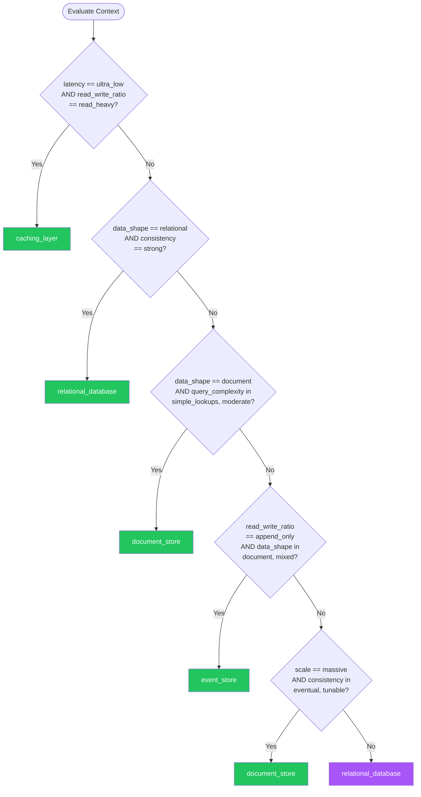

# Data Persistence — Summary

**Purpose**
- Data persistence decision framework covering relational databases, document stores, key-value stores, caching layers, and event stores
- Scope: Context-aware recommendations based on data shape, consistency needs, scale, and query patterns

## Related Standards

| Standard | Relationship | Context |
|----------|-------------|---------|
| [authentication](../authentication/) | complementary | Database access must use authenticated connections with least-privilege roles |
| [encryption](../../security-quality/encryption/) | complementary | Data at rest and in transit must be encrypted per encryption standard |
| [input-validation](../input-validation/) | complementary | All data written to persistence must be validated and sanitized |
| [database-migration](../../infrastructure/database-migration/) | complementary | Schema changes must follow migration strategy for zero-downtime deployments |

## Context Inputs

These inputs drive the decision tree — provide them to get a tailored recommendation.

| Input | Type | Required | Default | Values | Description |
|-------|------|----------|---------|--------|-------------|
| data_shape | enum | yes | relational | relational, document, key_value, graph, time_series, mixed | Structure of the primary data model |
| consistency_requirement | enum | yes | strong | eventual, strong, tunable | Required consistency level |
| read_write_ratio | enum | yes | read_heavy | read_heavy, write_heavy, balanced, append_only | Predominant workload pattern |
| scale_requirement | enum | yes | moderate | small, moderate, large, massive | Expected data volume and throughput |
| query_complexity | enum | yes | moderate | simple_lookups, moderate, complex_joins, full_text_search, aggregations | Complexity of queries needed |
| latency_requirement | enum | no | standard | relaxed, standard, low, ultra_low | Required read latency |

## Decision Tree

### Mermaid Diagram



### Text Fallback

- **Priority 1** → `caching_layer` — when latency_requirement == ultra_low AND read_write_ratio == read_heavy. Ultra-low latency reads require a caching layer in front of the primary store
- **Priority 2** → `relational_database` — when data_shape == relational AND consistency_requirement == strong. Relational data with strong consistency needs an RDBMS with ACID transactions
- **Priority 3** → `document_store` — when data_shape == document AND query_complexity in [simple_lookups, moderate]. Document-shaped data with moderate query needs fits document stores
- **Priority 4** → `event_store` — when read_write_ratio == append_only AND data_shape in [document, mixed]. Append-only workloads with audit requirements fit event stores
- **Priority 5** → `document_store` — when scale_requirement == massive AND consistency_requirement in [eventual, tunable]. Massive scale with relaxed consistency — use distributed NoSQL with horizontal scaling
- **Fallback** → `relational_database` — Relational database with ACID transactions — safest default for most applications

> **Confidence**: high | **Risk if wrong**: high

---

## Patterns

### 1. Relational Database

> Structured data storage with ACID transactions, referential integrity, and SQL query language. The default choice for most business applications where data relationships matter and consistency is required.

**Maturity**: standard

**Use when**
- Data has clear relationships (foreign keys, joins)
- ACID transactions required (financial, inventory, bookings)
- Complex queries with joins, aggregations, and reporting
- Data integrity and referential integrity are critical

**Avoid when**
- Data is inherently unstructured or schema-less
- Horizontal scaling beyond single-node capacity is needed
- Ultra-low latency key lookups are the primary pattern
- Schema changes are frequent and unpredictable

**Tradeoffs**

| Pros | Cons |
|------|------|
| ACID guarantees — data integrity by default | Horizontal scaling is limited (read replicas, not horizontal writes) |
| Powerful query language (SQL) with decades of optimization | Schema changes require migrations |
| Referential integrity via foreign keys | Join-heavy queries can degrade at massive scale |
| Rich ecosystem of tools, ORMs, and expertise | Object-relational impedance mismatch with application code |

**Implementation Guidelines**
- Use connection pooling — never open a connection per request
- Index columns used in WHERE, JOIN, and ORDER BY clauses
- Use parameterized queries (never concatenate SQL strings)
- Design schema in third normal form; denormalize for proven performance needs
- Use transactions for multi-step operations that must be atomic
- Implement read replicas for read-heavy workloads

**Common Errors**

| Error | Impact | Fix |
|-------|--------|-----|
| No connection pooling | Connection overhead per request; connection exhaustion under load | Use a connection pool (HikariCP, PgBouncer, etc.) sized to expected concurrency |
| SQL injection via string concatenation | Attackers can read, modify, or delete any data in the database | Always use parameterized queries / prepared statements |
| Missing indexes on query columns | Full table scans on every query; response time degrades with data growth | Add indexes on columns used in WHERE, JOIN, and ORDER BY; use EXPLAIN to verify |

**Standards & References**

| Standard | Type | Role | Reference |
|----------|------|------|-----------|
| ACID | spec | Transaction guarantee model (Atomicity, Consistency, Isolation, Durability) | |
| SQL | spec | Structured Query Language standard | ISO/IEC 9075 |

---

### 2. Document Store

> Schema-flexible storage for semi-structured data (JSON/BSON documents). Supports horizontal scaling, denormalized data models, and flexible queries without predefined schema.

**Maturity**: standard

**Use when**
- Data is naturally document-shaped (product catalogs, content, user profiles)
- Schema evolves frequently and unpredictably
- Horizontal scaling is a primary requirement
- Most queries access a single document or simple aggregations

**Avoid when**
- Data requires multi-document ACID transactions
- Complex joins across collections are needed
- Referential integrity between entities is critical

**Tradeoffs**

| Pros | Cons |
|------|------|
| Flexible schema — no migration for new fields | No native joins — data must be denormalized or joined in application |
| Horizontal scaling via sharding | Eventual consistency in distributed mode (by default) |
| Natural mapping to application objects (JSON to object) | Data duplication from denormalization increases storage and update complexity |
| High write throughput for denormalized models | |

**Implementation Guidelines**
- Model data by access patterns, not entity relationships
- Embed related data that is always accessed together (denormalize)
- Reference data that is accessed independently or changes frequently
- Use compound indexes for common query patterns
- Set appropriate write/read concern levels for consistency needs
- Plan sharding strategy before data grows (shard key selection is critical)

**Common Errors**

| Error | Impact | Fix |
|-------|--------|-----|
| Relational modeling in a document database | Multiple queries needed to assemble related data (simulating joins) | Denormalize — embed data that is read together; reference only when necessary |
| Bad shard key selection | Hot shards — uneven data distribution causing one shard to be overloaded | Choose shard key with high cardinality, even distribution, and common in queries |
| Unbounded array growth in documents | Document size exceeds limits; updates become slow | Use bucket pattern for arrays that grow over time; reference when array is large |

**Standards & References**

| Standard | Type | Role | Reference |
|----------|------|------|-----------|
| Document Database | spec | Semi-structured data storage model | |

---

### 3. Caching Layer

> In-memory data store providing sub-millisecond read latency for frequently accessed data. Acts as a fast-path in front of slower primary storage.

**Maturity**: standard

**Use when**
- Read-heavy workloads where same data is accessed repeatedly
- Primary database cannot meet latency requirements
- Computed results are expensive and cacheable
- Session storage needs fast access

**Avoid when**
- Data changes frequently and stale reads are unacceptable
- Working set does not fit in memory (cache miss rate too high)
- Write-through consistency is required for every operation

**Tradeoffs**

| Pros | Cons |
|------|------|
| Sub-millisecond read latency | Cache invalidation complexity (stale data risk) |
| Offloads read traffic from primary database | Additional infrastructure to manage |
| Enables horizontal scaling of read capacity | Memory cost for caching layer |
| | Cache stampede risk during cold start or invalidation |

**Implementation Guidelines**
- Use cache-aside (lazy loading) as default pattern
- Set TTL on all cache entries — never cache without expiration
- Implement cache invalidation on write (invalidate or update-through)
- Use consistent hashing for distributed cache clusters
- Implement cache stampede protection (locking, probabilistic early expiry)
- Monitor cache hit rate — below 80% indicates poor caching strategy

**Common Errors**

| Error | Impact | Fix |
|-------|--------|-----|
| No TTL on cache entries | Stale data served indefinitely; cache grows unbounded | Set TTL on every cache entry; shorter TTL for frequently changing data |
| Cache stampede on popular keys | Hundreds of concurrent requests rebuild the same cache entry simultaneously | Use lock-based or probabilistic early expiration to prevent stampede |
| Caching everything | Memory exhaustion; evicts useful cache entries for rarely accessed data | Cache only frequently accessed data with clear access patterns; monitor hit rates |

**Standards & References**

| Standard | Type | Role | Reference |
|----------|------|------|-----------|
| Cache-Aside Pattern | spec | Lazy-loading cache pattern | https://learn.microsoft.com/en-us/azure/architecture/patterns/cache-aside |

---

### 4. Event Store

> Append-only persistence that stores every state change as an immutable event. The current state is derived by replaying events. Provides complete audit trail and enables temporal queries.

**Maturity**: advanced

**Use when**
- Complete audit trail is required (financial, healthcare, legal)
- Need to reconstruct state at any point in time
- Event-driven architecture with event sourcing
- Write workload is primarily append-only

**Avoid when**
- Simple CRUD with no audit requirements
- Queries primarily need current state (event replay adds latency)
- Team unfamiliar with event sourcing patterns

**Tradeoffs**

| Pros | Cons |
|------|------|
| Complete audit trail — every change recorded | Complexity of event replay for current state |
| Temporal queries — state at any point in time | Event schema evolution is challenging |
| Natural fit for event-driven architectures | Read model must be projected (CQRS pattern) |
| No data loss — events are immutable | Storage grows with every state change |

**Implementation Guidelines**
- Events are immutable — never update or delete events
- Use snapshots to avoid replaying entire event stream (snapshot every N events)
- Implement CQRS — separate read models projected from event stream
- Version event schemas — support old and new event formats
- Use optimistic concurrency on event streams

**Common Errors**

| Error | Impact | Fix |
|-------|--------|-----|
| Querying event store directly for current state | Replaying thousands of events per read request is slow | Project read models (CQRS) that maintain current state |
| Breaking event schema backward compatibility | Existing events cannot be replayed with new code | Version events; support upcasting old events to new format |

**Standards & References**

| Standard | Type | Role | Reference |
|----------|------|------|-----------|
| Event Sourcing | spec | Append-only event persistence pattern | https://learn.microsoft.com/en-us/azure/architecture/patterns/event-sourcing |

---

### 5. Polyglot Persistence

> Using multiple database technologies in a single system, each chosen for its strength in handling a specific data access pattern. Different services own different stores.

**Maturity**: advanced

**Use when**
- Different parts of the system have fundamentally different data needs
- Microservices architecture where each service owns its data
- Single database type creates significant impedance mismatch

**Avoid when**
- Team cannot support multiple database technologies
- Monolith with uniform data access patterns
- Cross-store transactions are frequently needed

**Tradeoffs**

| Pros | Cons |
|------|------|
| Each data store optimized for its access pattern | Operational complexity — multiple technologies to manage |
| Better performance per use case | Cross-store consistency requires saga or event-based coordination |
| Service independence in microservices | Team must have expertise across multiple databases |

**Implementation Guidelines**
- Choose database per service based on primary access pattern
- Use events for cross-service data synchronization (not shared databases)
- Each service owns its data store exclusively
- Implement saga pattern for cross-service transactions
- Standardize operational practices (backup, monitoring) across all stores

**Common Errors**

| Error | Impact | Fix |
|-------|--------|-----|
| Shared database across microservices | Tight coupling — schema changes affect all services | Each service owns its database; synchronize via events or APIs |
| Cross-store distributed transactions | Two-phase commit across different databases is fragile and slow | Use saga pattern with compensating transactions |

**Standards & References**

| Standard | Type | Role | Reference |
|----------|------|------|-----------|
| Database per Service | spec | Microservice data isolation pattern | |

---

## Examples

### Connection Pooling and Parameterized Queries

**Context**: Accessing a relational database from an application service

**Correct** implementation:

```text
# Connection pool configured at application startup
pool = create_connection_pool(
  host = config.db_host,
  max_connections = 20,
  min_connections = 5,
  max_idle_time = 300_seconds
)

# Parameterized query (safe from SQL injection)
function get_user(user_id):
  connection = pool.acquire()
  try:
    result = connection.execute(
      "SELECT id, name, email FROM users WHERE id = $1",
      [user_id]
    )
    return result.first()
  finally:
    pool.release(connection)
```

**Incorrect** implementation:

```text
# WRONG: New connection per request + SQL injection
function get_user(user_id):
  connection = database.connect(host, user, password)  # New connection every time
  result = connection.execute(
    "SELECT * FROM users WHERE id = " + user_id  # SQL injection!
  )
  connection.close()
  return result
```

**Why**: Connection pooling avoids the overhead of creating connections per request. Parameterized queries prevent SQL injection by separating code from data. String concatenation allows attackers to inject arbitrary SQL.

---

### Cache-Aside with Stampede Protection

**Context**: Implementing caching for frequently accessed product data

**Correct** implementation:

```text
function get_product(product_id):
  # Try cache first
  cached = cache.get("product:" + product_id)
  if cached is not None:
    return cached

  # Cache miss — acquire lock to prevent stampede
  lock = cache.acquire_lock("lock:product:" + product_id, timeout=5_seconds)
  if lock:
    try:
      # Double-check after acquiring lock
      cached = cache.get("product:" + product_id)
      if cached is not None:
        return cached

      # Fetch from database
      product = database.query("SELECT ... WHERE id = $1", [product_id])
      cache.set("product:" + product_id, product, ttl=300_seconds)
      return product
    finally:
      lock.release()
  else:
    # Could not acquire lock — wait and retry cache
    wait(100_milliseconds)
    return get_product(product_id)
```

**Incorrect** implementation:

```text
# WRONG: No TTL, no stampede protection
function get_product(product_id):
  cached = cache.get("product:" + product_id)
  if cached:
    return cached
  # 100 concurrent requests all miss cache and hit DB simultaneously
  product = database.query("SELECT * FROM products WHERE id = " + product_id)
  cache.set("product:" + product_id, product)  # No TTL — never expires
  return product
```

**Why**: Cache-aside with lock-based stampede protection ensures only one request rebuilds the cache while others wait. TTL prevents stale data. Without these protections, popular keys cause thundering herd on cache miss.

---

## Security Hardening

### Transport
- Database connections use TLS (encrypted in transit)
- Connection strings never include plaintext credentials in source code

### Data Protection
- Sensitive data encrypted at rest (column-level or full-disk)
- PII data identified, classified, and retention-policy enforced
- Backup data encrypted with same or stronger controls

### Access Control
- Least-privilege database users per service (not shared superuser)
- Network-level access control (firewall, VPC, private endpoints)
- No direct database access from public networks

### Input/Output
- Parameterized queries only — no SQL string concatenation
- ORM configured to prevent mass assignment vulnerabilities
- Query result sets bounded (LIMIT/pagination) to prevent memory exhaustion

### Secrets
- Database credentials in secrets manager, not environment variables or code
- Credential rotation automated with zero-downtime
- Service accounts use short-lived tokens where supported

### Monitoring
- Monitor query performance (slow query log)
- Alert on connection pool exhaustion
- Track and alert on failed authentication attempts
- Audit log for DDL operations and privileged access

---

## Anti-Patterns

| Anti-Pattern | Severity | Description | Fix |
|-------------|----------|-------------|-----|
| SQL injection via string concatenation | critical | Building SQL queries by concatenating user input into the query string. Allows attackers to execute arbitrary SQL commands, potentially reading, modifying, or deleting all data in the database. | Always use parameterized queries / prepared statements |
| Shared database across microservices | high | Multiple microservices reading from and writing to the same database tables. Creates tight coupling — any schema change affects all services. Loses the independent deployability that is the core benefit of microservices. | Database per service; synchronize via events or APIs |
| No connection pooling | high | Opening a new database connection for every request. Connection creation involves TCP handshake, TLS negotiation, and authentication — taking 50-200ms per connection. Under load, connection limits are exhausted. | Use connection pooling (HikariCP, PgBouncer) sized to expected concurrency |
| Unbounded queries without pagination | high | Querying a table without LIMIT, returning all rows. As data grows, response size and memory consumption grow unbounded, eventually causing out-of-memory errors or timeout. | Always paginate queries; use cursor-based pagination for large datasets |
| Cache without TTL | high | Storing data in cache without expiration. Data becomes permanently stale and cache grows unbounded until memory is exhausted, causing evictions of more useful entries or out-of-memory crashes. | Set TTL on every cache entry; monitor hit rates and stale data percentage |

---

## Checklist

| ID | Category | Description | Severity |
|----|----------|-------------|----------|
| DATA-01 | security | All database queries use parameterized statements (no SQL injection) | **critical** |
| DATA-02 | performance | Connection pooling configured and properly sized | **high** |
| DATA-03 | performance | Indexes present on all frequently queried columns | **high** |
| DATA-04 | security | Data encrypted at rest (sensitive columns or full-disk) | **high** |
| DATA-05 | security | Database connections use TLS | **critical** |
| DATA-06 | security | Database credentials stored in secrets manager | **critical** |
| DATA-07 | design | Cache entries have TTL — no permanent cache without expiration | **high** |
| DATA-08 | performance | Cache stampede protection implemented for popular keys | **high** |
| DATA-09 | design | All list queries use pagination (cursor or offset+limit) | **high** |
| DATA-10 | security | Least-privilege database users per service | **high** |
| DATA-11 | observability | Slow query monitoring enabled with alerting | **medium** |
| DATA-12 | reliability | Backups tested for restore; encrypted at rest | **critical** |

---

## Compliance

### Standards

| Standard | Relevance | Reference |
|----------|-----------|-----------|
| OWASP Injection | SQL injection prevention | https://owasp.org/Top10/A03_2021-Injection/ |
| PCI DSS | Cardholder data storage requirements | PCI DSS v4.0 Requirement 3 |
| GDPR | Personal data storage, retention, and deletion | GDPR Article 5 (storage limitation) |

### Requirements Mapping

| Control | Description | Maps To |
|---------|-------------|---------|
| sql_injection_prevention | All database queries use parameterized statements | OWASP A03:2021 Injection, CWE-89: SQL Injection |
| data_encryption | Sensitive data encrypted at rest and in transit | PCI DSS Requirement 3.5, GDPR Article 32 |

---

## Prompt Recipes

### Choose a persistence strategy for a new application
**Scenario**: greenfield

```text
Choose a data persistence strategy for a new application.

Context:
- Data shape: [relational/document/key_value/graph/time_series/mixed]
- Consistency requirement: [eventual/strong/tunable]
- Read/write ratio: [read_heavy/write_heavy/balanced/append_only]
- Scale requirement: [small/moderate/large/massive]
- Query complexity: [simple_lookups/moderate/complex_joins/full_text_search]

Default: Relational database with ACID transactions unless evidence
against it. Use parameterized queries, connection pooling, and indexes.

Add caching layer if: read-heavy + latency-sensitive.
Add event store if: audit trail required + append-only workload.
```

---

### Audit existing data persistence implementation
**Scenario**: audit

```text
Audit the data persistence implementation:

1. Are all queries parameterized (no SQL injection)?
2. Is connection pooling configured and properly sized?
3. Are indexes present on all queried columns?
4. Is data encrypted at rest?
5. Are database connections encrypted (TLS)?
6. Are credentials in a secrets manager (not in code)?
7. Is the cache layer using TTL on all entries?
8. Are cache stampede protections in place?
9. Is query performance monitored (slow query log)?
10. Are backups encrypted and tested for restore?

For each item: report compliant/non-compliant/not-applicable with evidence.
```

---

### Evaluate migrating from relational to NoSQL
**Scenario**: migration

```text
Evaluate whether migrating to NoSQL is justified.

Current state: [describe current RDBMS, pain points, scale]

Evaluate:
- Are joins causing performance problems at scale?
- Is schema rigidity slowing feature development?
- Is horizontal write scaling needed beyond RDBMS limits?
- Can the team support a different database technology?
- Can eventual consistency be tolerated?

If yes to most: NoSQL may be justified (document store or key-value).
If no: Optimize the relational database (read replicas, indexing, caching).
```

---

### Design a caching strategy
**Scenario**: architecture

```text
Design a caching strategy for the application.

For each cached entity, define:
- Cache pattern: cache-aside, read-through, write-through, write-behind
- TTL: How long before expiration
- Invalidation: When and how to invalidate
- Stampede protection: Lock-based or probabilistic early expiry
- Monitoring: Hit rate target (>80%), miss rate alerting

Rules:
- Never cache without TTL
- Never cache sensitive data without encryption
- Never cache user-specific data in shared cache without proper key isolation
```

---

## Notes
- Relational database is the safest default for most applications
- Polyglot persistence is an advanced pattern — only adopt when a single database type creates clear impedance mismatch
- Caching is a complement to the primary store, not a replacement
- Event sourcing requires CQRS for efficient reads — plan for both from the start

## Links
- Full standard: [data-persistence.yaml](data-persistence.yaml)
