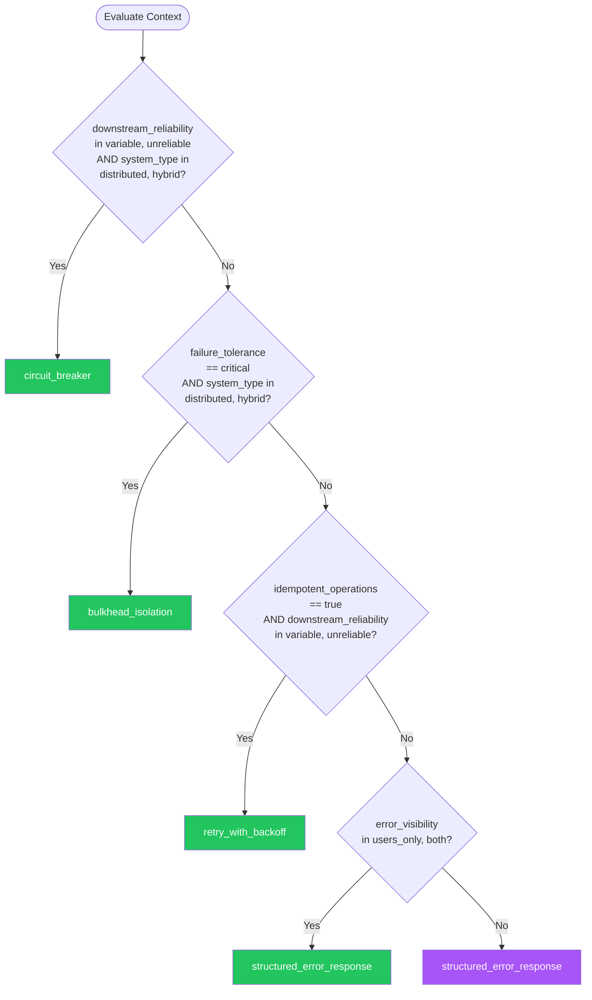

# Error Handling — Summary

**Purpose**
- Error handling and resilience decision framework covering circuit breakers, retries, fallbacks, bulkheads, and structured error responses
- Scope: Building fault-tolerant distributed systems with proper error propagation and user-safe error messages

## Related Standards

| Standard | Relationship | Context |
|----------|-------------|---------|
| [logging-observability](../logging-observability/) | complementary | All errors must be logged and monitored per logging-observability standard |
| [api-design](../api-design/) | complementary | APIs must return structured error responses per this standard |
| [messaging-events](../messaging-events/) | complementary | Async messaging failures require dead-letter queues and retry policies |

## Context Inputs

These inputs drive the decision tree — provide them to get a tailored recommendation.

| Input | Type | Required | Default | Values | Description |
|-------|------|----------|---------|--------|-------------|
| system_type | enum | yes | distributed | monolith, distributed, serverless, hybrid | Architecture style of the system |
| failure_tolerance | enum | yes | high | low, medium, high, critical | How critical is uptime? Determines resilience investment |
| downstream_reliability | enum | yes | variable | reliable, variable, unreliable | How reliable are downstream dependencies? |
| error_visibility | enum | yes | both | users_only, developers_only, both | Who sees the errors — end users, developers, or both? |
| idempotent_operations | boolean | yes | false | — | Are the operations safe to retry (idempotent)? |
| latency_budget | enum | no | standard | tight, standard, relaxed | Maximum acceptable response time including retries |

## Decision Tree

### Mermaid Diagram



### Text Fallback

- **Priority 1** → `circuit_breaker` — when downstream_reliability in [variable, unreliable] AND system_type in [distributed, hybrid]. Unreliable downstream services in distributed systems require circuit breakers to prevent cascade failures
- **Priority 2** → `bulkhead_isolation` — when failure_tolerance == critical AND system_type in [distributed, hybrid]. Critical uptime requires isolating failures to prevent total system collapse
- **Priority 3** → `retry_with_backoff` — when idempotent_operations == true AND downstream_reliability in [variable, unreliable]. Idempotent operations can be safely retried with exponential backoff
- **Priority 4** → `structured_error_response` — when error_visibility in [users_only, both]. User-facing errors must be structured, safe, and actionable
- **Fallback** → `structured_error_response` — Return structured error responses with proper HTTP status codes and safe error messages

> **Confidence**: high | **Risk if wrong**: high

---

## Patterns

### 1. Circuit Breaker

> Prevents cascading failures by wrapping calls to external services in a circuit that trips open after repeated failures, redirecting to a fallback and periodically testing if the service has recovered.

**Maturity**: standard

**Use when**
- Calling unreliable external services or APIs
- Downstream failures could cascade to upstream callers
- System must remain partially functional during dependency outages

**Avoid when**
- Single-process monolith with no external dependencies
- Operation is critical and must always attempt (use retry instead)

**Tradeoffs**

| Pros | Cons |
|------|------|
| Prevents cascade failures across services | Adds latency monitoring and state management |
| Fails fast — no waiting for timeout on known-broken dependencies | Half-open state testing can mask partial recovery |
| Allows graceful degradation via fallback | Threshold tuning requires production traffic analysis |
| Self-healing — periodically retests broken service | |

**Implementation Guidelines**
- Track failure count within a rolling time window
- Trip circuit to OPEN after failure threshold exceeded
- Return fallback response immediately when circuit is OPEN
- Transition to HALF-OPEN after recovery timeout — test with one request
- Reset to CLOSED if test succeeds; back to OPEN if it fails
- Configure per-dependency — different services have different failure profiles

**Common Errors**

| Error | Impact | Fix |
|-------|--------|-----|
| Single global circuit for all dependencies | One failing service trips the circuit for all services | Separate circuit breaker instance per downstream dependency |
| Circuit never trips (threshold too high) | System keeps hammering a dead service, wasting resources | Start conservative (5 failures in 30s), tune based on traffic patterns |
| No fallback when circuit is open | Users see raw errors instead of degraded but functional experience | Implement fallback: cached data, default response, or queued-for-later |

**Standards & References**

| Standard | Type | Role | Reference |
|----------|------|------|-----------|
| Circuit Breaker Pattern | spec | Resilience pattern for external service calls | https://learn.microsoft.com/en-us/azure/architecture/patterns/circuit-breaker |

---

### 2. Retry with Exponential Backoff

> Automatically retries failed operations with increasing delays between attempts, optionally with jitter to prevent thundering herd. Only safe for idempotent operations.

**Maturity**: standard

**Use when**
- Transient failures (network timeouts, temporary unavailability)
- Operations are idempotent (safe to repeat)
- Downstream service is generally reliable but has occasional blips

**Avoid when**
- Operation is not idempotent (could cause duplicate side effects)
- Error is permanent (4xx client errors — retrying won't help)
- Tight latency budget that cannot accommodate retry delays

**Tradeoffs**

| Pros | Cons |
|------|------|
| Handles transient failures transparently | Increases latency on failure paths |
| Simple to implement and reason about | Can amplify load on already-struggling services without circuit breaker |
| Jitter prevents synchronized retry storms | Dangerous for non-idempotent operations |

**Implementation Guidelines**
- Only retry idempotent operations (GET, PUT, DELETE — never blind POST retry)
- Use exponential backoff: delay = base * 2^attempt (e.g., 100ms, 200ms, 400ms, 800ms)
- Add jitter: delay = random(0, exponential_delay) to prevent thundering herd
- Set maximum retry count (typically 3-5 attempts)
- Set maximum total timeout (don't retry beyond the caller's deadline)
- Only retry on retriable errors (5xx, timeout, connection refused — not 400, 401, 403)

**Common Errors**

| Error | Impact | Fix |
|-------|--------|-----|
| Retrying non-idempotent operations | Duplicate charges, duplicate records, duplicate notifications | Only retry operations that produce the same result when repeated (GET, PUT, DELETE) |
| No jitter on retry delays | All clients retry simultaneously after an outage, overwhelming the recovering service | Add random jitter to spread retries over time |
| Retrying 4xx client errors | Wasted resources — client errors won't resolve by retrying | Only retry 5xx, timeouts, and connection errors |

**Standards & References**

| Standard | Type | Role | Reference |
|----------|------|------|-----------|
| Exponential Backoff with Jitter | spec | Retry delay algorithm | https://aws.amazon.com/builders-library/timeouts-retries-and-backoff-with-jitter/ |

---

### 3. Bulkhead Isolation

> Isolates components into pools so that failure in one does not consume all system resources. Named after ship bulkheads that prevent water from flooding the entire hull. Limits the blast radius of failures.

**Maturity**: advanced

**Use when**
- Multiple downstream dependencies with different reliability profiles
- Critical paths must be protected from non-critical path failures
- Thread/connection pool exhaustion is a risk

**Avoid when**
- Single dependency with uniform failure characteristics
- System resources are too limited for partitioning

**Tradeoffs**

| Pros | Cons |
|------|------|
| Limits blast radius of failures | Reduces overall resource utilization (partitioned pools) |
| Protects critical paths from non-critical failures | Configuration complexity — sizing pools requires traffic analysis |
| Prevents resource exhaustion cascades | Can cause failures under spiky traffic if pools are undersized |

**Implementation Guidelines**
- Assign separate thread/connection pools per downstream dependency
- Size pools based on expected traffic and acceptable queue depth
- Monitor pool utilization and rejection rates
- Combine with circuit breaker — bulkhead limits resources, circuit breaker limits attempts
- Use queue-based bulkheads for async workloads

**Common Errors**

| Error | Impact | Fix |
|-------|--------|-----|
| Undersized bulkhead pools | Legitimate traffic rejected during normal spikes | Size pools based on P99 traffic, not average; monitor rejection rates |
| No monitoring on bulkhead state | Pools silently saturate without alerting | Monitor pool utilization, queue depth, and rejection counts |

**Standards & References**

| Standard | Type | Role | Reference |
|----------|------|------|-----------|
| Bulkhead Pattern | spec | Failure isolation pattern | https://learn.microsoft.com/en-us/azure/architecture/patterns/bulkhead |

---

### 4. Structured Error Response

> Returns consistent, machine-parseable error responses with safe user messages, developer-useful details, and correlation IDs for debugging. Follows RFC 9457 Problem Details format for HTTP APIs.

**Maturity**: standard

**Use when**
- Any API that returns errors to clients
- User-facing applications needing safe error messages
- Distributed systems needing error correlation

**Avoid when**
- Internal batch jobs where log-based error handling suffices

**Tradeoffs**

| Pros | Cons |
|------|------|
| Consistent error format across all services | Requires discipline to maintain consistency across teams |
| Machine-parseable for automated error handling | Additional error mapping layer for legacy services |
| Safe user messages prevent information leakage | |
| Correlation IDs enable cross-service debugging | |

**Implementation Guidelines**
- Use RFC 9457 Problem Details format for HTTP APIs
- Include correlation ID in every error response and log entry
- Never expose stack traces, SQL errors, or internal paths to clients
- Map internal errors to safe user-facing messages
- Use error codes (not just messages) for programmatic handling
- Log full error context server-side; send safe summary to client

**Common Errors**

| Error | Impact | Fix |
|-------|--------|-----|
| Stack traces in production error responses | Exposes internal implementation details, file paths, dependency versions | Return generic error message to client; log full details server-side with correlation ID |
| Inconsistent error format across services | Clients need different parsing logic for each service | Standardize on RFC 9457 Problem Details across all services |
| No correlation ID | Cannot trace errors across multiple services in distributed system | Generate correlation ID at edge, propagate through all services, include in error response |

**Standards & References**

| Standard | Type | Role | Reference |
|----------|------|------|-----------|
| RFC 9457 | spec | Problem Details for HTTP APIs | https://www.rfc-editor.org/rfc/rfc9457 |

---

## Examples

### Circuit Breaker State Machine

**Context**: Implementing a circuit breaker for an external payment service

**Correct** implementation:

```text
circuit = CircuitBreaker(
  failure_threshold = 5,
  recovery_timeout = 30_seconds,
  half_open_max_calls = 1
)

function call_payment_service(request):
  if circuit.state == OPEN:
    return fallback_response("Payment service temporarily unavailable")

  try:
    response = http.post(payment_url, request, timeout=5_seconds)
    circuit.record_success()
    return response
  catch TimeoutError, ConnectionError:
    circuit.record_failure()
    if circuit.should_trip():
      circuit.trip()  # CLOSED -> OPEN
      log.warn("Circuit tripped for payment service")
    return fallback_response("Payment processing delayed")
```

**Incorrect** implementation:

```text
# WRONG: No circuit breaker — keeps hammering dead service
function call_payment_service(request):
  for attempt in 1..10:
    try:
      return http.post(payment_url, request, timeout=30_seconds)
    catch:
      continue  # Keep retrying with long timeout
  raise "Payment failed after 10 attempts"
  # 10 attempts * 30s timeout = 5 minutes of blocked thread
```

**Why**: A circuit breaker fails fast when a dependency is down, returning a fallback in milliseconds instead of blocking for minutes. The retry-forever approach wastes threads, amplifies load on the struggling service, and gives users a terrible experience.

---

### RFC 9457 Problem Details Response

**Context**: API returning a structured error for a validation failure

**Correct** implementation:

```text
# HTTP 422 Unprocessable Entity
{
  "type": "https://api.example.com/errors/validation",
  "title": "Validation Error",
  "status": 422,
  "detail": "The email field must be a valid email address",
  "instance": "/api/v1/users",
  "correlation_id": "req-abc-123-def",
  "errors": [
    { "field": "email", "message": "Invalid email format", "code": "INVALID_FORMAT" }
  ]
}
```

**Incorrect** implementation:

```text
# WRONG: 200 with error in body + stack trace
# HTTP 200 OK
{
  "success": false,
  "error": "ValueError: invalid email at UserService.java:142\n  at Validator.validate(Validator.java:89)\n  at ...",
  "data": null
}
```

**Why**: RFC 9457 provides a standard error format that HTTP clients can parse programmatically. Correlation IDs enable debugging across services. Never expose stack traces — they reveal implementation details.

---

## Security Hardening

### Transport
- Error responses must not vary based on authentication state (prevent user enumeration)

### Data Protection
- Never expose internal error details (stack traces, SQL errors, file paths) to clients
- Sanitize error messages to prevent information leakage
- Log full error context server-side only

### Access Control
- Error handling must not bypass authorization checks
- Rate limit error-triggering requests to prevent error-based scanning

### Input/Output
- Validate error response format before sending (prevent injection via error messages)
- Sanitize any user input reflected in error messages

### Secrets
- Never include credentials, tokens, or secrets in error messages or logs
- Redact sensitive parameters in error context

### Monitoring
- Alert on error rate spikes (5xx rate > threshold)
- Track error distribution by type, service, and endpoint
- Monitor circuit breaker state changes
- Alert when fallback usage exceeds threshold

---

## Anti-Patterns

| Anti-Pattern | Severity | Description | Fix |
|-------------|----------|-------------|-----|
| Swallowing exceptions | critical | Catching exceptions and silently ignoring them. The failure is invisible — no logging, no alerting, no error response. Data may be silently corrupted or operations may silently fail. | Log every caught exception with context; re-throw or return an error if the operation failed |
| Retry storms on non-idempotent operations | critical | Automatically retrying operations that are not idempotent (e.g., payment charges, email sends). Can result in duplicate charges, duplicate messages, or data corruption. | Only retry idempotent operations; use idempotency keys for non-idempotent APIs |
| Cascading failures from missing circuit breakers | critical | When service A calls service B which calls service C, and C goes down, all threads in B block on C's timeout, causing B to also become unresponsive, which cascades to A. The entire chain fails from one dependency. | Circuit breaker per dependency with fast fallback; bulkhead isolation for critical paths |
| Exposing stack traces to clients | high | Returning raw exception stack traces in API responses. Reveals internal file paths, class names, dependency versions, and database structure to potential attackers. | Return safe, structured error messages; log full details server-side with correlation ID |

---

## Checklist

| ID | Category | Description | Severity |
|----|----------|-------------|----------|
| ERR-01 | reliability | Circuit breaker implemented per external dependency | **critical** |
| ERR-02 | reliability | Retries limited to idempotent operations only | **critical** |
| ERR-03 | reliability | Exponential backoff with jitter used for retries | **high** |
| ERR-04 | security | No stack traces or internal details in client-facing error responses | **critical** |
| ERR-05 | observability | Correlation ID present in all error responses and log entries | **high** |
| ERR-06 | design | Structured error response format used (RFC 9457 or equivalent) | **high** |
| ERR-07 | reliability | Fallback strategy defined for each critical dependency | **high** |
| ERR-08 | reliability | Bulkhead isolation separates critical from non-critical paths | **high** |
| ERR-09 | observability | Error rates monitored and alerted on threshold breach | **high** |
| ERR-10 | reliability | Circuit breaker state changes are logged and monitored | **medium** |
| ERR-11 | reliability | Maximum retry count and total timeout configured per dependency | **high** |
| ERR-12 | security | Sensitive data (credentials, tokens) never included in error messages | **critical** |

---

## Compliance

### Standards

| Standard | Relevance | Reference |
|----------|-----------|-----------|
| RFC 9457 | Standard format for HTTP API error responses | https://www.rfc-editor.org/rfc/rfc9457 |
| OWASP Error Handling | Secure error handling to prevent information leakage | https://owasp.org/www-project-web-security-testing-guide/latest/4-Web_Application_Security_Testing/08-Testing_for_Error_Handling/ |

### Requirements Mapping

| Control | Description | Maps To |
|---------|-------------|---------|
| error_information_leakage | Error responses do not reveal internal system details | OWASP Error Handling, CWE-209: Generation of Error Message Containing Sensitive Information |
| error_logging | All errors logged with context for debugging | ISO 27001 A.12.4 (Logging and Monitoring) |

---

## Prompt Recipes

### Design error handling for a new distributed system
**Scenario**: greenfield

```text
Design error handling and resilience for a new distributed system.

Context:
- System type: [monolith/distributed/serverless]
- Failure tolerance: [low/medium/high/critical]
- Downstream reliability: [reliable/variable/unreliable]

Requirements:
- Circuit breaker per external dependency (threshold: 5 failures in 30s)
- Retry with exponential backoff + jitter for idempotent operations only
- Bulkhead isolation for critical vs non-critical paths
- Structured error responses (RFC 9457)
- Correlation IDs propagated through all services
- Never expose internal errors to clients
```

---

### Audit existing error handling implementation
**Scenario**: audit

```text
Audit the error handling implementation against these criteria:

1. Are circuit breakers used for external service calls?
2. Are retries limited to idempotent operations only?
3. Is exponential backoff with jitter used for retries?
4. Are error responses structured (RFC 9457 or equivalent)?
5. Are correlation IDs present in all error responses and logs?
6. Are stack traces hidden from client-facing responses?
7. Is error rate monitored and alerted?
8. Are circuit breaker state changes logged?
9. Are fallback strategies defined for critical dependencies?
10. Are bulkheads in place for resource isolation?

For each item: report compliant/non-compliant/not-applicable with evidence.
```

---

### Select appropriate resilience patterns
**Scenario**: architecture

```text
Select resilience patterns for a service with these dependencies:

Dependencies:
[List each dependency with: name, reliability, criticality, idempotent?]

For each dependency, determine:
- Circuit breaker: Yes if reliability is variable/unreliable
- Retry: Yes if operations are idempotent and errors are transient
- Bulkhead: Yes if failure must not affect other dependencies
- Fallback: Define degraded behavior when dependency is unavailable
- Timeout: Define maximum wait time per dependency
```

---

### Add resilience to an existing system without circuit breakers
**Scenario**: migration

```text
Add resilience patterns to an existing system.

Current state: [describe current error handling]

Migration plan:
1. Add structured error response format (RFC 9457) — lowest risk
2. Add correlation IDs — requires header propagation
3. Add circuit breakers per dependency — requires state management
4. Add retry with backoff for idempotent operations — requires idempotency audit
5. Add bulkheads for critical paths — requires resource pool configuration

Implement in order. Each step is independently valuable.
```

---

## Notes
- Resilience patterns layer: circuit breaker + retry + bulkhead work together, not as alternatives
- Structured error responses are always needed, regardless of resilience patterns
- Never retry non-idempotent operations without idempotency keys
- Circuit breakers should be configured per-dependency, not globally

## Links
- Full standard: [error-handling.yaml](error-handling.yaml)
