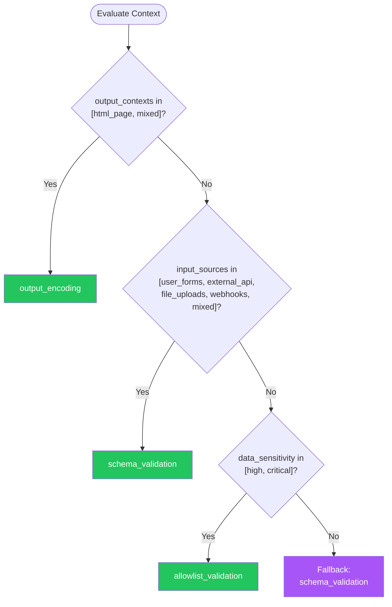

# Input Validation — Summary

**Purpose**
- Input validation and sanitization decision framework for preventing injection attacks, ensuring data integrity, and maintaining system security at all system boundaries
- Scope: schema-based validation, allowlist validation, context-aware output encoding, XSS/injection prevention

## Related Standards

| Standard | Relationship | Context |
|----------|-------------|---------|
| [api-design](../api-design/) | complementary | All API inputs must be validated per this standard |
| [data-persistence](../data-persistence/) | complementary | Data written to storage must be validated and sanitized |
| [authentication](../authentication/) | complementary | Authentication inputs (credentials, tokens) require strict validation |
| [error-handling](../error-handling/) | complementary | Validation failures must return structured error responses |

## Context Inputs

These inputs drive the decision tree — provide them to get a tailored recommendation.

| Input | Type | Required | Default | Values | Description |
|-------|------|----------|---------|--------|-------------|
| input_sources | enum | yes | external_api | user_forms, external_api, file_uploads, webhooks, internal_api, mixed | Where does untrusted input originate? |
| data_sensitivity | enum | yes | medium | low, medium, high, critical | Sensitivity of data being processed |
| output_contexts | enum | yes | api_response | html_page, api_response, database_query, shell_command, file_system, mixed | Where will the validated data be rendered or used? |
| validation_strictness | enum | no | strict | permissive, moderate, strict | How strict should validation be? |

## Decision Tree

### Mermaid Diagram



### Text Fallback

- **Priority 1** → `output_encoding` — when output_contexts in [html_page, mixed]. Any data rendered in HTML must be context-encoded to prevent XSS.
- **Priority 2** → `schema_validation` — when input_sources in [user_forms, external_api, file_uploads, webhooks, mixed]. All external input must be validated against a schema before processing.
- **Priority 3** → `allowlist_validation` — when data_sensitivity in [high, critical]. High-sensitivity contexts require allowlist validation (accept known good, reject everything else).
- **Fallback** → `schema_validation` — Validate all input against a strict schema; reject anything that doesn't conform.

> **Confidence**: high | **Risk if wrong**: critical

---

## Patterns

### 1. Schema-Based Validation

> Validates input against a predefined schema that specifies expected types, formats, ranges, and constraints. Rejects any input that does not conform. The primary defense against malformed and malicious input.

**Maturity**: standard

**Use when**
- API endpoints receiving structured input (JSON, XML, form data)
- File format validation before processing
- Configuration input that must conform to a specification

**Avoid when**
- Free-text input where schema cannot fully describe valid content (use sanitization)

**Tradeoffs**

| Pros | Cons |
|------|------|
| Declarative — schema is documentation and validation in one | Cannot catch all semantic validation (business rules) |
| Catches malformed input early (fail fast) | Schema maintenance overhead |
| Auto-generated from OpenAPI, GraphQL schema, or protobuf | May reject valid edge cases if schema is too strict |
| Consistent validation across all endpoints | |

**Implementation Guidelines**
- Validate at the system boundary (before any processing)
- Use JSON Schema, OpenAPI, GraphQL schema, or protobuf for structural validation
- Enforce type, format, min/max length, pattern (regex), and required fields
- Reject unknown fields (additionalProperties: false in JSON Schema)
- Validate nested objects recursively
- Return structured validation errors listing all failures (not just the first)

**Common Errors**

| Error | Impact | Fix |
|-------|--------|-----|
| Validating only on the client side | Attackers bypass client-side validation completely | Always validate on the server; client validation is for UX only |
| Allowing unknown fields | Unexpected fields may cause mass-assignment vulnerabilities | Set additionalProperties: false; whitelist accepted fields explicitly |
| Stopping at first validation error | User must fix one error at a time, submitting repeatedly | Collect and return all validation errors in one response |

**Standards & References**

| Standard | Type | Role | Reference |
|----------|------|------|-----------|
| JSON Schema | spec | Structural validation for JSON data | https://json-schema.org/ |
| OWASP Input Validation Cheat Sheet | spec | Security-focused input validation guidance | https://cheatsheetseries.owasp.org/cheatsheets/Input_Validation_Cheat_Sheet.html |

---

### 2. Allowlist Validation

> Accepts only explicitly known-good input values and rejects everything else. The most secure validation approach — defines what IS allowed rather than trying to enumerate what is NOT allowed.

**Maturity**: standard

**Use when**
- High-security contexts (financial, healthcare, authentication)
- Input has a finite set of valid values (enums, codes, identifiers)
- File type validation (accept only specific MIME types)
- URL validation (accept only known domains)

**Avoid when**
- Free-text input where valid values cannot be enumerated
- Fields requiring high variability (names, addresses)

**Tradeoffs**

| Pros | Cons |
|------|------|
| Strongest security — unknown input is rejected by default | Cannot handle free-text or highly variable input |
| Simple to reason about and audit | Requires maintenance when valid values change |
| Immune to bypass via encoding tricks or novel attack vectors | May reject legitimate edge cases |

**Implementation Guidelines**
- Define explicit lists of allowed values, patterns, or character sets
- For identifiers: use regex patterns (e.g., `^[a-zA-Z0-9_-]{1,64}$`)
- For file uploads: validate MIME type AND file magic bytes (not just extension)
- For URLs: validate against known allowlist of domains
- For enums: validate against the exact set of allowed values
- Reject first, then validate — default deny

**Common Errors**

| Error | Impact | Fix |
|-------|--------|-----|
| Validating file type by extension only | Attacker renames malicious.exe to safe.jpg | Validate MIME type, file magic bytes, and extension together |
| Using denylist instead of allowlist | Attacker finds encoding or bypass not on the denylist | Use allowlist — define what is accepted, reject everything else |

**Standards & References**

| Standard | Type | Role | Reference |
|----------|------|------|-----------|
| OWASP Input Validation | spec | Allowlist validation best practices | https://cheatsheetseries.owasp.org/cheatsheets/Input_Validation_Cheat_Sheet.html |

---

### 3. Context-Aware Output Encoding

> Encodes output data based on the context where it will be rendered (HTML body, HTML attribute, JavaScript, CSS, URL). Prevents injection attacks by ensuring data cannot be interpreted as code.

**Maturity**: standard

**Use when**
- Any user-supplied data rendered in HTML, JavaScript, CSS, or URLs
- Data from any untrusted source displayed to users
- Email templates containing dynamic content

**Avoid when**
- Pure API-to-API communication with no rendering context

**Tradeoffs**

| Pros | Cons |
|------|------|
| Prevents XSS regardless of input validation failures | Must know the output context to encode correctly |
| Context-specific — correct encoding for each output context | Double-encoding bugs if applied multiple times |
| Defense in depth — works even if validation is bypassed | Doesn't prevent stored XSS if data is not encoded on output |

**Implementation Guidelines**
- Encode on output, not on input (data may be used in multiple contexts)
- Use context-specific encoding: HTML entity encoding for HTML body, attribute encoding for attributes, JavaScript encoding for JS context, URL encoding for URLs
- Use a trusted encoding library (never hand-roll encoding)
- Use Content Security Policy (CSP) header as additional XSS mitigation
- Never use innerHTML or equivalent with untrusted data — use textContent
- Sanitize rich text with allowlist-based HTML sanitizer

**Common Errors**

| Error | Impact | Fix |
|-------|--------|-----|
| Encoding on input instead of output | Data stored encoded, then double-encoded on output, or wrong encoding for different contexts | Store raw data; encode at the point of output based on rendering context |
| Using innerHTML with user data | Direct XSS — user-controlled HTML is parsed and executed | Use textContent for plain text; use allowlist-based sanitizer for rich text |
| Missing Content Security Policy | Inline scripts and external script injection possible even with encoding | Implement strict CSP: script-src 'self'; report-uri for monitoring |

**Standards & References**

| Standard | Type | Role | Reference |
|----------|------|------|-----------|
| OWASP XSS Prevention Cheat Sheet | spec | XSS prevention best practices | https://cheatsheetseries.owasp.org/cheatsheets/Cross-Site_Scripting_Prevention_Cheat_Sheet.html |
| Content Security Policy | spec | Browser-enforced script execution policy | https://www.w3.org/TR/CSP3/ |

---

## Examples

### API Input Schema Validation

**Context**: Validating a user creation API request

**Correct** implementation:

```text
# JSON Schema for user creation
schema = {
  "type": "object",
  "required": ["email", "name"],
  "additionalProperties": false,
  "properties": {
    "email": { "type": "string", "format": "email", "maxLength": 254 },
    "name": { "type": "string", "minLength": 1, "maxLength": 200, "pattern": "^[\\p{L}\\s'-]+$" },
    "age": { "type": "integer", "minimum": 0, "maximum": 150 }
  }
}

function create_user(request):
  errors = validate(request.body, schema)
  if errors:
    return response(422, {
      "type": "validation_error",
      "errors": errors  # All errors, not just first
    })
  # Process validated input
  user = user_service.create(request.body)
  return response(201, user)
```

**Incorrect** implementation:

```text
# WRONG: No validation, trusting input directly
function create_user(request):
  # No validation — trusting whatever the client sends
  user = database.insert("users", request.body)
  # Mass assignment: client can set { "role": "admin", "verified": true }
  return response(201, user)
```

**Why**: Schema validation catches malformed input, prevents mass assignment by rejecting unknown fields, enforces type constraints, and returns all validation errors at once. Without it, attackers can inject arbitrary fields and values.

---

### Context-Aware Output Encoding

**Context**: Displaying user-generated content in HTML

**Correct** implementation:

```text
# Stored in database: user_comment = '<script>alert("xss")</script>'

# HTML body context — entity encoding
html_output = html_encode(user_comment)
# Output: &lt;script&gt;alert(&quot;xss&quot;)&lt;/script&gt;
# Rendered as text, not executed

# HTML attribute context — attribute encoding
<div title="{{attr_encode(user_comment)}}">...</div>

# JavaScript context — JS encoding
<script>var name = "{{js_encode(user_comment)}}";</script>

# URL context — URL encoding
<a href="/search?q={{url_encode(user_comment)}}">Search</a>

# CSP header for defense in depth
Content-Security-Policy: script-src 'self'; object-src 'none'
```

**Incorrect** implementation:

```text
# WRONG: Direct insertion without encoding
<div>{{user_comment}}</div>
# Renders: <script>alert("xss")</script>
# Browser executes the script — XSS!

<div title="{{user_comment}}">...</div>
# Attribute injection possible

<script>var name = "{{user_comment}}";</script>
# JavaScript injection possible
```

**Why**: Each output context (HTML body, attribute, JS, URL) requires different encoding. Using the wrong encoding or no encoding enables XSS attacks. CSP provides an additional layer of defense against script injection.

---

## Security Hardening

### Transport
- All input validation happens server-side (client validation is UX only)

### Data Protection
- Sanitize data before storage to prevent stored injection
- Encode data on output to prevent reflected injection
- Log validation failures for security monitoring

### Access Control
- Reject requests that fail validation (do not process partially valid input)

### Input/Output
- Validate at every system boundary (API, message consumer, file processor)
- Use allowlist validation for security-sensitive fields
- Implement Content Security Policy for web applications
- Validate file uploads: MIME type, magic bytes, size limits, content scanning
- Reject unknown/unexpected fields (additionalProperties: false)

### Secrets
- Never reflect credentials or tokens in validation error messages

### Monitoring
- Log all validation failures with input source and violation type
- Alert on validation failure spikes (potential attack probing)
- Monitor CSP violation reports

---

## Anti-Patterns

| Anti-Pattern | Severity | Description | Fix |
|-------------|----------|-------------|-----|
| Client-side only validation | critical | Relying on JavaScript form validation or HTML5 validation attributes as the only defense. Attackers bypass client-side validation entirely using direct API calls, browser dev tools, or proxy tools. | Always validate on the server; client validation is for UX only |
| Denylist-based validation | high | Trying to block known-bad input patterns (e.g., blocking `<script>`). Attackers consistently find encoding tricks, alternative syntax, and novel vectors that bypass denylists. | Use allowlist validation — define what IS allowed, reject everything else |
| No output encoding | critical | Inserting user-controlled data directly into HTML, JavaScript, or SQL without encoding. Enables XSS, injection, and other attacks even if input was validated (defense in depth failure). | Encode all output based on rendering context; use trusted encoding library |
| Trusting Content-Type header for file validation | high | Validating file uploads only by checking the Content-Type header sent by the client. Attackers can set any Content-Type on any file. | Validate file magic bytes (first N bytes) in addition to MIME type and extension |

---

## Checklist

| ID | Category | Description | Severity |
|----|----------|-------------|----------|
| VAL-01 | security | All input validated server-side at every system boundary | **critical** |
| VAL-02 | security | Schema validation used for all structured input (JSON Schema, OpenAPI) | **high** |
| VAL-03 | security | Unknown fields rejected (additionalProperties: false) | **high** |
| VAL-04 | security | Allowlist validation used for security-sensitive fields | **high** |
| VAL-05 | security | Output encoding applied context-aware (HTML, JS, URL, attribute) | **critical** |
| VAL-06 | security | Content Security Policy header implemented for web apps | **high** |
| VAL-07 | security | File uploads validated: MIME type + magic bytes + size + extension | **critical** |
| VAL-08 | security | SQL queries parameterized (no string concatenation) | **critical** |
| VAL-09 | observability | Validation failures logged with input source and violation type | **high** |
| VAL-10 | design | All validation errors returned in single response (not one at a time) | **medium** |

---

## Compliance

### Standards

| Standard | Relevance | Reference |
|----------|-----------|-----------|
| OWASP Top 10 A03 Injection | Primary standard for injection prevention | https://owasp.org/Top10/A03_2021-Injection/ |
| OWASP Top 10 A07 XSS | Cross-site scripting prevention | https://owasp.org/Top10/A07_2017-Cross-Site_Scripting_(XSS)/ |
| CWE-20 | Improper Input Validation | https://cwe.mitre.org/data/definitions/20.html |

### Requirements Mapping

| Control | Description | Maps To |
|---------|-------------|---------|
| injection_prevention | All input validated and parameterized before use in queries, commands, or markup | OWASP A03:2021 Injection, CWE-89 (SQL), CWE-79 (XSS), CWE-78 (OS Command) |
| xss_prevention | All output encoded based on rendering context | OWASP A07:2017 XSS, CWE-79: Cross-Site Scripting |

---

## Prompt Recipes

### Design input validation for a new application
**Scenario**: greenfield

```text
Design input validation for a new application.

Context:
- Input sources: [user_forms/external_api/file_uploads/webhooks/mixed]
- Data sensitivity: [low/medium/high/critical]
- Output contexts: [html_page/api_response/database_query/mixed]

Requirements:
- Schema validation on all external input (JSON Schema / OpenAPI)
- Allowlist validation for security-sensitive fields
- Output encoding for all rendered content
- Content Security Policy for web applications
- File upload validation: MIME type, magic bytes, size limits
- Server-side validation mandatory (client-side optional for UX)
```

---

### Audit existing input validation
**Scenario**: audit

```text
Audit the input validation implementation:

1. Is all input validated server-side (not just client-side)?
2. Is schema validation used (JSON Schema, OpenAPI, etc.)?
3. Are unknown fields rejected (additionalProperties: false)?
4. Are all validation errors returned in one response?
5. Is output encoding context-aware (HTML, JS, URL, attribute)?
6. Is Content Security Policy implemented?
7. Are file uploads validated (MIME type + magic bytes + size)?
8. Are SQL queries parameterized?
9. Are validation failures logged for security monitoring?
10. Are allowlists used for security-sensitive fields?

For each item: report compliant/non-compliant/not-applicable with evidence.
```

---

### Fix an XSS vulnerability
**Scenario**: remediation

```text
Fix an XSS vulnerability found in the application.

Steps:
1. Identify the injection point (where user data enters)
2. Trace data flow to output point (where it's rendered)
3. Apply context-appropriate output encoding at the render point
4. Add Content Security Policy header as defense in depth
5. Verify fix: test with common XSS payloads
6. Add automated test to prevent regression

Remember: Encode on OUTPUT, not on input. Data may be used in multiple contexts.
```

---

### Secure file upload handling
**Scenario**: security

```text
Implement secure file upload handling.

Validation layers:
1. File size limit (reject before reading full body)
2. File extension allowlist (.pdf, .jpg, .png — not .exe, .sh)
3. MIME type validation (Content-Type header)
4. Magic bytes validation (read file header, verify matches claimed type)
5. Filename sanitization (strip path traversal, special characters)
6. Content scanning (virus scan for high-security environments)
7. Storage: never store in web-accessible directory with execute permissions
```

---

## Notes
- The three patterns (schema validation, allowlist validation, output encoding) are complementary — most applications should use all three as layers of defense in depth
- Schema validation is the primary defense for structured input; allowlist is used for high-security fields; output encoding prevents injection regardless of validation

## Links
- Full standard: [input-validation.yaml](input-validation.yaml)
