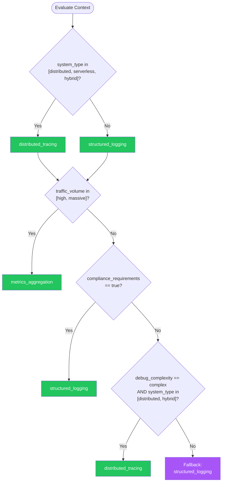

# Logging Observability — Summary

**Purpose**
- Structured logging, distributed tracing, metrics collection, and alerting framework for production observability
- Scope: covers the three pillars of observability (logs, traces, metrics) and their integration, plus alerting

## Related Standards

| Standard | Relationship | Context |
|----------|-------------|---------|
| [error-handling](../error-handling/) | complementary | All errors must be logged with correlation IDs per error-handling standard |
| [api-design](../api-design/) | complementary | API requests must emit structured logs, traces, and metrics |
| [configuration-management](../configuration-management/) | complementary | Log levels and sampling rates should be configurable without redeployment |

## Context Inputs

These inputs drive the decision tree — provide them to get a tailored recommendation.

| Input | Type | Required | Default | Values | Description |
|-------|------|----------|---------|--------|-------------|
| system_type | enum | yes | distributed | monolith, distributed, serverless, hybrid | Architecture style affecting observability approach |
| traffic_volume | enum | yes | medium | low, medium, high, massive | Expected log and trace volume |
| compliance_requirements | boolean | yes | false | — | Are there regulatory requirements for log retention and auditing? |
| debug_complexity | enum | yes | moderate | simple, moderate, complex | How difficult is debugging in the current environment? |
| real_time_alerting | boolean | yes | true | — | Does the system need real-time alerting on anomalies? |
| budget_constraints | enum | no | moderate | minimal, moderate, generous | Budget for observability infrastructure |

## Decision Tree

### Mermaid Diagram



### Text Fallback

- **Priority 1** → `distributed_tracing` — when system_type in [distributed, serverless, hybrid]. Distributed systems require distributed tracing to follow requests across service boundaries. Else → `structured_logging` for monoliths with correlation IDs.
- **Priority 2** → `metrics_aggregation` — when traffic_volume in [high, massive]. High-volume systems should use metrics aggregation and trace sampling rather than logging every event.
- **Priority 3** → `structured_logging` — when compliance_requirements == true. Compliance requires immutable, structured audit logs with retention policies.
- **Priority 4** → `distributed_tracing` — when debug_complexity == complex AND system_type in [distributed, hybrid]. Complex distributed debugging requires all three pillars: logs, traces, and metrics correlated together.
- **Fallback** → `structured_logging` — Structured JSON logging with correlation IDs and appropriate log levels.

> **Confidence**: high | **Risk if wrong**: high

---

## Patterns

### 1. Structured Logging

> Emitting log entries as structured data (JSON) rather than free-text strings. Enables machine parsing, filtering, alerting, and correlation across services. The foundation of all observability.

**Maturity**: standard

**Use when**
- Any production system (universally applicable)
- Need to query and filter logs programmatically
- Compliance requires auditable log records
- Debugging requires correlation across requests

**Avoid when**
- Quick prototypes where console.log suffices (temporary)

**Tradeoffs**

| Pros | Cons |
|------|------|
| Machine-parseable for automated alerting and dashboards | Slightly more verbose than plain text |
| Queryable by any field (user_id, correlation_id, status) | Requires discipline to maintain consistent field names |
| Consistent format across all services | JSON parsing overhead (negligible in practice) |
| Enables log-based metrics and alerting | |

**Implementation Guidelines**
- Use JSON format for all log entries
- Include timestamp, level, message, service, correlation_id in every entry
- Use consistent field names across all services (define a schema)
- Log at appropriate levels: ERROR (failures), WARN (degradation), INFO (business events), DEBUG (development)
- Never log sensitive data (passwords, tokens, PII) — redact or mask
- Include request context: method, path, status, latency, user_id
- Use correlation IDs to link logs across services in a single request flow

**Common Errors**

| Error | Impact | Fix |
|-------|--------|-----|
| Logging sensitive data (passwords, tokens, PII) | Credentials exposed in log aggregation systems | Implement automatic PII redaction in logging framework; never log request bodies containing credentials |
| Inconsistent log levels (everything at INFO) | Cannot filter noise from signal during incidents | ERROR = failures, WARN = degradation, INFO = business events, DEBUG = dev only |
| Unstructured string concatenation logs | Cannot query, filter, or alert on specific fields | Use structured logging library that emits JSON with named fields |

**Standards & References**

| Standard | Type | Role | Reference |
|----------|------|------|-----------|
| Structured Logging | spec | Log format standard | — |
| ECS (Elastic Common Schema) | spec | Common field naming standard for logs | https://www.elastic.co/guide/en/ecs/current/index.html |

---

### 2. Distributed Tracing

> Propagates trace context across service boundaries to reconstruct the full path of a request through a distributed system. Each service adds spans with timing, status, and metadata.

**Maturity**: standard

**Use when**
- Distributed systems with multiple communicating services
- Need to identify which service causes latency in a request chain
- Debugging cross-service failures
- Performance optimization of multi-service workflows

**Avoid when**
- Single-process monolith (structured logging with correlation IDs suffices)
- Budget cannot support trace collection infrastructure

**Tradeoffs**

| Pros | Cons |
|------|------|
| Visual request flow across services | Infrastructure cost for trace collection and storage |
| Identifies latency bottlenecks per service | Requires instrumentation in every service |
| Root cause analysis for distributed failures | Sampling needed at high volumes (may miss rare events) |
| Enables service dependency mapping | |

**Implementation Guidelines**
- Use OpenTelemetry SDK for trace instrumentation
- Propagate W3C Trace Context headers (traceparent, tracestate) across all service calls
- Create spans for: HTTP requests, database calls, cache lookups, queue operations
- Include meaningful span names and attributes (http.method, db.operation, etc.)
- Implement head-based or tail-based sampling for high-volume services
- Link traces to logs using trace_id and span_id fields in log entries

**Common Errors**

| Error | Impact | Fix |
|-------|--------|-----|
| Not propagating trace context across async boundaries | Trace is broken — downstream spans are orphaned | Propagate trace context in message headers (Kafka, RabbitMQ, SQS) |
| Sampling rate too aggressive | Rare errors are never captured in traces | Use tail-based sampling (decide after seeing the result) for error traces; sample successful traces |
| Not instrumenting database calls | Cannot identify slow queries as latency source | Add spans for all database operations including query text (sanitized) |

**Standards & References**

| Standard | Type | Role | Reference |
|----------|------|------|-----------|
| OpenTelemetry | spec | Observability framework for traces, metrics, and logs | https://opentelemetry.io/docs/ |
| W3C Trace Context | spec | Standard header format for trace propagation | https://www.w3.org/TR/trace-context/ |

---

### 3. Metrics Aggregation

> Collecting numeric measurements (counters, gauges, histograms) that summarize system behavior over time. Metrics are the most efficient observability signal — low overhead, high compression, fast querying.

**Maturity**: standard

**Use when**
- Need dashboards showing system health over time
- Alerting on thresholds (error rate, latency percentiles)
- High-traffic systems where logging every event is too expensive
- Capacity planning and trend analysis

**Avoid when**
- Need to debug individual request failures (use tracing)
- Need full context of what happened (use logging)

**Tradeoffs**

| Pros | Cons |
|------|------|
| Lowest overhead of all observability signals | No individual event context (aggregated values only) |
| Highly compressible — efficient long-term storage | Cardinality explosion risk with high-dimension labels |
| Fast querying for dashboards and alerts | Requires separate tool for root cause analysis |
| Pre-aggregated — no log parsing required | |

**Implementation Guidelines**
- Instrument the RED metrics for every service: Rate, Errors, Duration
- Use USE metrics for infrastructure: Utilization, Saturation, Errors
- Use histograms for latency (not averages — P50, P95, P99 matter)
- Keep label cardinality low (no user IDs or request IDs as metric labels)
- Use OpenTelemetry Metrics API for vendor-neutral instrumentation
- Define SLOs (Service Level Objectives) based on key metrics

**Common Errors**

| Error | Impact | Fix |
|-------|--------|-----|
| Using averages for latency metrics | Averages hide tail latency — P99 may be 10x the average | Use histogram-based percentiles (P50, P95, P99) |
| High-cardinality labels (user_id as metric label) | Cardinality explosion — millions of unique time series, crashing metrics backend | Only use bounded labels (status_code, endpoint, service_name) |
| No SLOs defined | No objective measure of whether the system is healthy | Define SLOs: e.g., P99 latency < 500ms, error rate < 0.1%, availability > 99.9% |

**Standards & References**

| Standard | Type | Role | Reference |
|----------|------|------|-----------|
| OpenTelemetry Metrics | spec | Vendor-neutral metrics instrumentation | https://opentelemetry.io/docs/specs/otel/metrics/ |
| Prometheus Exposition Format | format | Widely adopted metrics exposition format | https://prometheus.io/docs/instrumenting/exposition_formats/ |

---

### 4. Alerting Framework

> Systematic approach to defining, routing, and managing alerts based on SLOs and error budgets. Reduces alert fatigue by focusing on symptoms (user impact) rather than causes.

**Maturity**: advanced

**Use when**
- Production systems requiring incident response
- SLOs defined and need enforcement
- Team on-call rotation needs actionable alerts

**Avoid when**
- Development/staging environments (use dashboards instead)
- No on-call process exists (alerts with no responder add noise)

**Tradeoffs**

| Pros | Cons |
|------|------|
| Proactive incident detection before users notice | Alert fatigue if thresholds are wrong |
| SLO-based alerts focus on user impact | Requires ongoing tuning as traffic patterns change |
| Error budget tracking prevents over-alerting | On-call burden if alerting is too sensitive |

**Implementation Guidelines**
- Alert on symptoms (error rate, latency), not causes (CPU, disk)
- Define severity levels: P1 (user-impacting), P2 (degraded), P3 (informational)
- Use multi-window multi-burn-rate alerting for SLO breaches
- Every alert must have a runbook link
- Deduplicate and group related alerts
- Review and tune alerts regularly (remove noisy, add missing)

**Common Errors**

| Error | Impact | Fix |
|-------|--------|-----|
| Alerting on every metric threshold | Alert fatigue — responders ignore all alerts | Alert on symptoms (user impact), investigate causes via dashboards |
| Alerts without runbooks | On-call responder doesn't know what to do | Every alert must link to a runbook with investigation steps |

**Standards & References**

| Standard | Type | Role | Reference |
|----------|------|------|-----------|
| Google SRE Alerting | spec | SLO-based alerting methodology | https://sre.google/workbook/alerting-on-slos/ |

---

## Examples

### Structured JSON Log Entry

**Context**: Logging an API request with all required fields

**Correct** implementation:

```text
{
  "timestamp": "2026-04-22T10:15:30.123Z",
  "level": "INFO",
  "service": "user-service",
  "trace_id": "abc123def456",
  "span_id": "span789",
  "correlation_id": "req-abc-123",
  "message": "Request completed",
  "http": {
    "method": "GET",
    "path": "/api/v1/users/42",
    "status": 200,
    "latency_ms": 45
  },
  "user_id": "usr_12345"
}
```

**Incorrect** implementation:

```text
# WRONG: Unstructured string log
print("[2026-04-22 10:15:30] GET /api/v1/users/42 - 200 - 45ms - user: usr_12345")
# Cannot query by field, no trace correlation, no consistent format
```

**Why**: Structured JSON logs are machine-parseable, enabling automated alerting, dashboards, and cross-service correlation via trace_id. Plain text logs require regex parsing and break when formats change.

---

### OpenTelemetry Trace Propagation

**Context**: Propagating trace context between services via HTTP

**Correct** implementation:

```text
# Service A — outgoing request
span = tracer.start_span("call-service-b")
headers = {}
propagator.inject(headers, context=span.context)
# Headers now contain: traceparent: 00-{trace_id}-{span_id}-01

response = http.get("http://service-b/api/data", headers=headers)
span.set_attribute("http.status_code", response.status)
span.end()

# Service B — incoming request
context = propagator.extract(request.headers)
span = tracer.start_span("handle-request", parent=context)
# This span is now a child of Service A's span
# Full trace: Service A -> Service B visible in trace viewer
```

**Incorrect** implementation:

```text
# WRONG: No trace propagation
# Service A
log("Calling service B")
response = http.get("http://service-b/api/data")  # No trace headers

# Service B
log("Received request")  # No correlation to Service A
# Result: Two isolated log entries, no way to correlate
```

**Why**: W3C Trace Context propagation via the traceparent header links spans across service boundaries into a single trace. Without propagation, each service logs independently and debugging cross-service issues requires manual timestamp correlation.

---

## Security Hardening

### Transport
- Log aggregation endpoints use TLS
- Log shipping uses authenticated connections

### Data Protection
- PII automatically redacted or masked in log entries
- Logs encrypted at rest in aggregation systems
- Log retention policies enforce data minimization
- Access to logs restricted by role (RBAC)

### Access Control
- Log modification/deletion restricted to authorized operators
- Audit trail for log access in compliance environments

### Input/Output
- Log injection prevention — sanitize user-controlled fields
- Never log raw request bodies containing credentials or tokens

### Secrets
- API keys for log shipping stored in secrets manager
- Log aggregation credentials rotated regularly

### Monitoring
- Alert on log pipeline failures (gaps in log delivery)
- Monitor log volume anomalies (sudden spikes or drops)

---

## Anti-Patterns

| Anti-Pattern | Severity | Description | Fix |
|-------------|----------|-------------|-----|
| Unstructured logging | high | Using string concatenation or printf-style logging that produces free-text log lines. Cannot be queried by field, correlated across services, or used for automated alerting without fragile regex parsing. | Use structured logging library that emits JSON with named fields |
| Logging PII/credentials | critical | Including passwords, API keys, tokens, or personally identifiable information in log entries. These persist in log aggregation systems and may be accessible to operators, third-party tools, or attackers. | Implement automatic PII redaction; never log request bodies containing credentials |
| Averages-only latency metrics | high | Reporting only average latency. Averages hide tail latency — a P99 of 5 seconds is invisible when the average is 50ms. | Use histogram-based metrics and track P50, P95, P99 percentiles |
| Alert fatigue from cause-based alerting | high | Alerting on every infrastructure metric (CPU > 80%, disk > 70%) instead of user-facing symptoms. Generates hundreds of alerts that responders learn to ignore. | Alert on symptoms (error rate, latency SLO breach); investigate causes via dashboards |

---

## Checklist

| ID | Category | Description | Severity |
|----|----------|-------------|----------|
| LOG-01 | design | All logs are structured (JSON) with consistent field names | **high** |
| LOG-02 | observability | Correlation ID present in every log entry | **critical** |
| LOG-03 | security | PII and credentials automatically redacted from logs | **critical** |
| LOG-04 | observability | Distributed tracing with W3C Trace Context propagation across all services | **critical** |
| LOG-05 | observability | RED metrics (Rate, Errors, Duration) collected per service | **high** |
| LOG-06 | observability | Latency metrics use histograms (P50, P95, P99), not averages | **high** |
| LOG-07 | observability | SLOs defined with alerting on breach (multi-window burn rate) | **high** |
| LOG-08 | observability | Every alert has a linked runbook | **high** |
| LOG-09 | compliance | Log retention policy defined and enforced per compliance requirements | **high** |
| LOG-10 | observability | Trace context propagated across async boundaries (queues, events) | **high** |
| LOG-11 | observability | Log pipeline health monitored and alerted on failures | **medium** |
| LOG-12 | security | Log access restricted by RBAC; audit trail for log access in compliance envs | **high** |

---

## Compliance

### Standards

| Standard | Relevance | Reference |
|----------|-----------|-----------|
| ISO 27001 | Information security logging and monitoring requirements | ISO/IEC 27001:2022 A.12.4 |
| GDPR | PII in logs must comply with data protection regulations | GDPR Article 5 (data minimization) |
| SOC 2 | Logging and monitoring controls for service organizations | SOC 2 CC7.2 (System Monitoring) |

### Requirements Mapping

| Control | Description | Maps To |
|---------|-------------|---------|
| log_retention | Logs retained for required period and then purged | ISO 27001 A.12.4.1, SOC 2 CC7.2 |
| pii_protection | PII redacted or pseudonymized in logs | GDPR Article 5(1)(c), ISO 27001 A.18.1.4 |

---

## Prompt Recipes

### Design observability for a new system
**Scenario**: greenfield

```text
Design an observability stack for a new system.

Context:
- System type: [monolith/distributed/serverless]
- Traffic volume: [low/medium/high/massive]
- Compliance requirements: [yes/no]
- Budget: [minimal/moderate/generous]

Requirements:
- Structured JSON logging with correlation IDs
- Distributed tracing with OpenTelemetry (if distributed)
- RED metrics (Rate, Errors, Duration) per service
- SLO-based alerting with runbooks
- PII redaction in all logs
- Log retention per compliance needs
```

---

### Audit existing observability implementation
**Scenario**: audit

```text
Audit the observability implementation against these criteria:

1. Are logs structured (JSON) with consistent field names?
2. Do all log entries include correlation_id and trace_id?
3. Is PII automatically redacted from logs?
4. Are distributed traces propagated across all service boundaries?
5. Are trace context headers (W3C traceparent) used?
6. Are RED metrics collected for every service?
7. Are latency metrics histogram-based (not averages)?
8. Are SLOs defined with alerting on breaches?
9. Do all alerts have runbooks?
10. Are logs retained per compliance requirements?

For each item: report compliant/non-compliant/not-applicable with evidence.
```

---

### Reduce observability costs without losing visibility
**Scenario**: optimization

```text
Optimize observability costs for a high-traffic system.

Current state: [describe current stack and costs]

Strategies to evaluate:
- Trace sampling: head-based (fast) vs tail-based (error-aware)
- Log level reduction: reduce INFO volume, keep ERROR/WARN
- Metrics cardinality reduction: eliminate high-cardinality labels
- Tiered storage: hot (7d), warm (30d), cold (1y) for logs
- Aggregate before ship: pre-process logs to extract metrics locally
```

---

### Debug a latency issue in a distributed system
**Scenario**: debugging

```text
Debug a latency issue using observability tools.

Steps:
1. Check metrics dashboard: Which service has increased P99 latency?
2. Search traces: Find slow traces (>Xms) in the affected time window
3. Analyze spans: Which span in the trace is the bottleneck?
4. Check logs: Query logs with the trace_id for error context
5. Check dependencies: Is the bottleneck service's downstream dependency slow?
6. Correlate: Match the issue with recent deployments, config changes, or traffic shifts
```

---

## Notes
- The four patterns form a layered observability stack: structured logging is the foundation, distributed tracing adds cross-service visibility, metrics provide dashboards and alerting, and the alerting framework enforces SLOs
- In practice, most distributed systems should adopt all four patterns simultaneously

## Links
- Full standard: [logging-observability.yaml](logging-observability.yaml)
