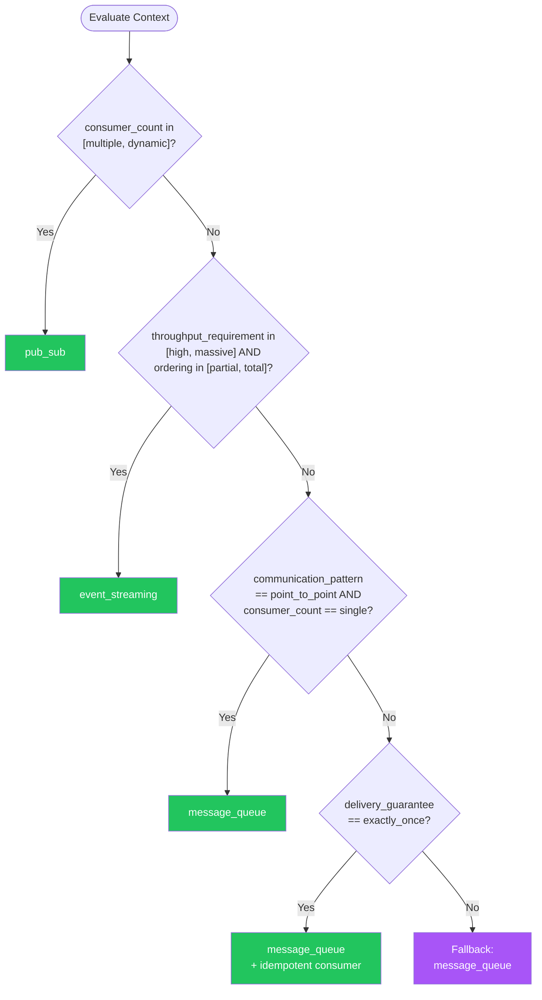

# Messaging Events — Summary

**Purpose**
- Asynchronous messaging and event-driven communication patterns including message queues, pub/sub, event streaming, and choreography
- Scope: covers delivery guarantees, ordering, failure handling, transactional outbox, and idempotent consumers

## Related Standards

| Standard | Relationship | Context |
|----------|-------------|---------|
| [error-handling](../error-handling/) | complementary | Dead-letter queues and retry strategies must follow error-handling patterns |
| [logging-observability](../logging-observability/) | complementary | Messages must carry trace context for distributed tracing |
| [api-design](../api-design/) | complementary | Event schemas require versioning like API contracts |
| [data-persistence](../data-persistence/) | complementary | Transactional outbox pattern bridges persistence and messaging |

## Context Inputs

These inputs drive the decision tree — provide them to get a tailored recommendation.

| Input | Type | Required | Default | Values | Description |
|-------|------|----------|---------|--------|-------------|
| communication_pattern | enum | yes | point_to_point | point_to_point, fan_out, streaming, request_reply_async | Primary async communication need |
| delivery_guarantee | enum | yes | at_least_once | at_most_once, at_least_once, exactly_once | Required message delivery guarantee |
| ordering_requirement | enum | yes | partial | none, partial, total | Message ordering requirements |
| throughput_requirement | enum | yes | moderate | low, moderate, high, massive | Expected message throughput |
| consumer_count | enum | yes | single | single, multiple, dynamic | Number of independent consumers per message |

## Decision Tree

### Mermaid Diagram



### Text Fallback

- **Priority 1** → `pub_sub` — when consumer_count in [multiple, dynamic]. Multiple consumers receiving the same event requires pub/sub or topic-based messaging.
- **Priority 2** → `event_streaming` — when throughput_requirement in [high, massive] AND ordering_requirement in [partial, total]. High-throughput ordered messaging fits event streaming platforms.
- **Priority 3** → `message_queue` — when communication_pattern == point_to_point AND consumer_count == single. Point-to-point with single consumer fits a message queue.
- **Priority 4** → `message_queue` — when delivery_guarantee == exactly_once. Exactly-once delivery is achieved via at-least-once + idempotent consumer.
- **Fallback** → `message_queue` — Point-to-point message queue with at-least-once delivery and idempotent consumers.

> **Confidence**: high | **Risk if wrong**: high

---

## Patterns

### 1. Message Queue (Point-to-Point)

> Dedicated queue where each message is consumed by exactly one consumer. Provides decoupling between producer and consumer, load leveling, and reliable delivery with acknowledgment.

**Maturity**: standard

**Use when**
- One producer, one consumer (or competing consumers for load balancing)
- Work distribution — tasks that need exactly one worker
- Load leveling — buffer traffic spikes for steady processing
- Guaranteed delivery with retry on failure

**Avoid when**
- Multiple independent consumers need the same message (use pub/sub)
- Real-time streaming analytics needed
- Message ordering must span across all consumers

**Tradeoffs**

| Pros | Cons |
|------|------|
| Decouples producer from consumer (temporal and spatial) | Adds latency compared to synchronous calls |
| Load leveling — absorbs traffic spikes | Message ordering only guaranteed per partition/group |
| At-least-once delivery with acknowledgment | Exactly-once semantics require idempotent consumer design |
| Dead-letter queue for poison messages | |

**Implementation Guidelines**
- Use at-least-once delivery with idempotent consumers (safe default)
- Set message TTL to prevent unbounded queue growth
- Configure dead-letter queue for messages that fail processing after N retries
- Include correlation_id and trace_id in message metadata
- Acknowledge messages only after successful processing (not on receive)
- Use competing consumers for horizontal scaling of processing

**Common Errors**

| Error | Impact | Fix |
|-------|--------|-----|
| Acknowledging message before processing | Message lost if processing fails — data loss | Acknowledge only after successful processing (post-processing ack) |
| No dead-letter queue | Poison messages block the queue forever | Configure DLQ with max delivery attempts (e.g., 5); alert on DLQ depth |
| No idempotency in consumer | Duplicate processing on retry — double charges, duplicate records | Use idempotency key (message ID) and check before processing |

**Standards & References**

| Standard | Type | Role | Reference |
|----------|------|------|-----------|
| AMQP | protocol | Advanced Message Queuing Protocol | https://www.amqp.org/ |

---

### 2. Publish/Subscribe

> Topic-based messaging where publishers send events to a topic and all subscribed consumers receive a copy. Enables event-driven architectures with loose coupling between producers and consumers.

**Maturity**: standard

**Use when**
- Multiple independent systems need to react to the same event
- Event-driven architecture with domain events
- Fan-out pattern — one event triggers multiple workflows
- New consumers can be added without changing the producer

**Avoid when**
- Only one consumer per message (use queue — simpler)
- Strict ordering across all consumers needed (use streaming)
- Request-reply semantics needed

**Tradeoffs**

| Pros | Cons |
|------|------|
| Complete decoupling — producer doesn't know about consumers | Message ordering not guaranteed across consumers |
| New consumers added without producer changes | Debugging is harder (who consumed what?) |
| Fan-out — one event, many reactions | No built-in reply mechanism |
| Natural fit for domain events and event-driven architecture | |

**Implementation Guidelines**
- Use topic-based routing (event type as topic)
- Define event schemas with versioning (CloudEvents format)
- Each consumer has its own subscription with independent progress
- Include event metadata: event_id, event_type, timestamp, source, trace_id
- Use durable subscriptions for at-least-once delivery
- Implement subscription filtering to avoid processing irrelevant events

**Common Errors**

| Error | Impact | Fix |
|-------|--------|-----|
| No event schema versioning | Schema change breaks all consumers simultaneously | Version events (e.g., user.created.v1); support backward-compatible evolution |
| Fat events with entire entity state | Tight coupling — consumers depend on producer's internal model | Use thin events (entity ID + event type); consumers query for details if needed |
| No subscription filtering | Every consumer processes every event, discarding most — wasted compute | Use topic filtering or subscription filters to receive only relevant events |

**Standards & References**

| Standard | Type | Role | Reference |
|----------|------|------|-----------|
| CloudEvents | spec | Standard event format for interoperability | https://cloudevents.io/ |

---

### 3. Event Streaming

> Ordered, durable log of events that consumers can replay from any position. Events are retained for a configurable period, allowing new consumers to process historical events.

**Maturity**: advanced

**Use when**
- High-throughput event processing (millions of events/day)
- Event replay needed (new consumers must process historical events)
- Ordered processing within partitions is required
- Stream processing / real-time analytics

**Avoid when**
- Low throughput with simple queue semantics (overkill)
- Global ordering across all events is required
- Message-level routing or filtering is the primary need

**Tradeoffs**

| Pros | Cons |
|------|------|
| Durable log — replay events from any offset | Operational complexity (partition management, consumer groups) |
| High throughput via partitioning | No per-message routing (partition key only) |
| Ordered within partition | Consumer must handle out-of-order across partitions |
| Multiple consumer groups with independent progress | |

**Implementation Guidelines**
- Choose partition key carefully — determines ordering and parallelism
- Use consumer groups for horizontal scaling (one partition per consumer)
- Commit offsets only after successful processing
- Handle partition rebalancing gracefully
- Set retention period based on replay needs and storage budget
- Use schema registry for event schema evolution

**Common Errors**

| Error | Impact | Fix |
|-------|--------|-----|
| Wrong partition key choice | Hot partitions — all traffic goes to one partition, no parallelism | Choose key with high cardinality and even distribution (entity ID, not country) |
| Committing offsets before processing | Data loss on consumer crash — offset advanced but processing not completed | Commit offset only after successful processing (at-least-once semantics) |
| No schema registry | Producer schema changes break consumers; no compatibility checks | Use schema registry with backward-compatible evolution rules |

**Standards & References**

| Standard | Type | Role | Reference |
|----------|------|------|-----------|
| Apache Kafka Protocol | protocol | Event streaming platform protocol | — |
| CloudEvents | spec | Event format standard | — |

---

### 4. Transactional Outbox

> Writes events to an outbox table in the same database transaction as the business operation. A separate process reads the outbox and publishes events to the message broker. Guarantees exactly-once publishing without distributed transactions.

**Maturity**: advanced

**Use when**
- Need to publish events reliably when database state changes
- Cannot tolerate lost events (financial, ordering, inventory)
- Database and message broker are separate systems (no shared transaction)

**Avoid when**
- Event loss is acceptable (best-effort publishing)
- Database supports native change data capture

**Tradeoffs**

| Pros | Cons |
|------|------|
| Atomic: event published if and only if transaction commits | Additional outbox table and polling/CDC process |
| No distributed transactions needed | Slight delay between commit and publish |
| Works with any database and any message broker | Outbox table must be cleaned up after publishing |

**Implementation Guidelines**
- Write business data and outbox event in the same database transaction
- Outbox table: id, event_type, payload, created_at, published_at
- Use polling or CDC (Change Data Capture) to read outbox and publish
- Mark events as published after successful broker acknowledgment
- Clean up published events periodically
- Consumers must still be idempotent (outbox ensures at-least-once)

**Common Errors**

| Error | Impact | Fix |
|-------|--------|-----|
| Publishing event outside the transaction | Transaction rolls back but event was already published — inconsistency | Write event to outbox table inside the same transaction |
| Not cleaning up outbox table | Outbox grows unbounded, degrading database performance | Delete or archive published events on a schedule |

**Standards & References**

| Standard | Type | Role | Reference |
|----------|------|------|-----------|
| Transactional Outbox Pattern | pattern | Reliable event publishing from database transactions | https://microservices.io/patterns/data/transactional-outbox.html |

---

## Examples

### Idempotent Message Consumer

**Context**: Processing a payment message that may be delivered more than once

**Correct** implementation:

```text
function process_payment(message):
  idempotency_key = message.metadata.message_id

  # Check if already processed
  if database.exists("processed_messages", idempotency_key):
    log.info("Duplicate message, skipping", message_id=idempotency_key)
    message.acknowledge()
    return

  # Process in a transaction
  transaction = database.begin()
  try:
    payment_service.charge(message.body.amount, message.body.customer_id)
    transaction.insert("processed_messages", {
      "message_id": idempotency_key,
      "processed_at": now()
    })
    transaction.commit()
    message.acknowledge()  # Acknowledge AFTER processing
  except:
    transaction.rollback()
    # Do NOT acknowledge — message will be redelivered
    raise
```

**Incorrect** implementation:

```text
# WRONG: No idempotency, ack before processing
function process_payment(message):
  message.acknowledge()  # ACK first — if crash below, message is lost!
  payment_service.charge(message.body.amount, message.body.customer_id)
  # No duplicate check — retried message charges customer twice
```

**Why**: Idempotent consumers use a unique message ID to detect duplicates, preventing double-processing on retry. Acknowledgment only after successful processing ensures messages are not lost on failure.

---

### Transactional Outbox for Reliable Event Publishing

**Context**: Publishing an order-created event when creating an order

**Correct** implementation:

```text
function create_order(order_data):
  transaction = database.begin()
  try:
    # Business operation
    order = transaction.insert("orders", order_data)

    # Write event to outbox in SAME transaction
    transaction.insert("outbox", {
      "id": generate_uuid(),
      "event_type": "order.created.v1",
      "payload": { "order_id": order.id, "total": order.total },
      "created_at": now(),
      "published_at": null
    })

    transaction.commit()
    return order
  except:
    transaction.rollback()
    raise

# Separate process: outbox publisher (polling or CDC)
function publish_outbox_events():
  events = database.query("SELECT * FROM outbox WHERE published_at IS NULL ORDER BY created_at LIMIT 100")
  for event in events:
    broker.publish(event.event_type, event.payload)
    database.update("outbox", event.id, { "published_at": now() })
```

**Incorrect** implementation:

```text
# WRONG: Publishing outside transaction
function create_order(order_data):
  order = database.insert("orders", order_data)
  # If this fails, order exists but event was never published
  # If DB fails after this, event published but no order exists
  broker.publish("order.created", { "order_id": order.id })
  return order
```

**Why**: The transactional outbox writes the event in the same database transaction as the business operation. A separate publisher process reads the outbox and publishes to the broker, ensuring events are published if and only if the transaction committed.

---

## Security Hardening

### Transport
- Message broker connections use TLS
- Inter-service messaging encrypted in transit

### Data Protection
- Sensitive data in message payloads encrypted (field-level or envelope)
- PII in messages minimized — use references (IDs) over full data
- Message payloads do not contain credentials or secrets

### Access Control
- Producers and consumers authenticated to the message broker
- Topic/queue access controlled per service (least privilege)
- Admin operations (create topic, purge queue) restricted

### Input/Output
- Message schemas validated on both produce and consume
- Message size limits enforced to prevent resource exhaustion

### Secrets
- Broker credentials stored in secrets manager
- Connection strings not hardcoded in application code

### Monitoring
- Monitor queue depth and consumer lag
- Alert on dead-letter queue depth (messages failing processing)
- Track message processing latency and error rates

---

## Anti-Patterns

| Anti-Pattern | Severity | Description | Fix |
|-------------|----------|-------------|-----|
| Acknowledge before processing | critical | Acknowledging a message as soon as it is received, before processing is complete. If the consumer crashes during processing, the message is lost. | Acknowledge only after successful processing; let broker redeliver on crash |
| No idempotency in consumers | critical | Consumers that process every message as if it's the first time. When at-least-once delivery retries a message, the operation is duplicated. | Track processed message IDs; check before processing; make operations idempotent |
| No dead-letter queue | high | Messages that fail processing are retried indefinitely, blocking the queue for other messages. Poison messages cause permanent blockage. | Configure DLQ with max retry count; alert on DLQ depth; investigate and replay |
| Publishing event outside database transaction | high | Publishing an event to the broker separately from the database write. If either fails, the system is inconsistent. | Use transactional outbox — write event in same DB transaction, publish via outbox |
| Unversioned event schemas | high | Changing event payload structure without versioning. All consumers break simultaneously when the producer changes the schema. | Version events (v1, v2); maintain backward compatibility; deprecate old versions |

---

## Checklist

| ID | Category | Description | Severity |
|----|----------|-------------|----------|
| MSG-01 | reliability | Message delivery is at-least-once (not at-most-once) | **critical** |
| MSG-02 | reliability | All consumers are idempotent (safe for duplicate delivery) | **critical** |
| MSG-03 | reliability | Messages acknowledged only after successful processing | **critical** |
| MSG-04 | reliability | Dead-letter queue configured with max retries and alerting | **high** |
| MSG-05 | design | Event schemas versioned (CloudEvents format) | **high** |
| MSG-06 | observability | Trace context (trace_id, correlation_id) included in messages | **high** |
| MSG-07 | security | Broker connections use TLS; producers/consumers authenticated | **critical** |
| MSG-08 | observability | Consumer lag and queue depth monitored with alerting | **high** |
| MSG-09 | reliability | Transactional outbox used for reliable event publishing from DB | **high** |
| MSG-10 | security | Message payloads free of credentials and unnecessary PII | **high** |
| MSG-11 | design | Message size limits enforced | **medium** |
| MSG-12 | performance | Partition key chosen for even distribution (streaming) | **high** |

---

## Compliance

### Standards

| Standard | Relevance | Reference |
|----------|-----------|-----------|
| CloudEvents | Standard event format for interoperability | https://cloudevents.io/ |
| AMQP | Standard messaging protocol | https://www.amqp.org/ |

### Requirements Mapping

| Control | Description | Maps To |
|---------|-------------|---------|
| reliable_delivery | Messages delivered at-least-once with idempotent consumers | CloudEvents delivery guarantee |
| dead_letter_handling | Failed messages routed to DLQ with alerting | Operational reliability requirements |

---

## Prompt Recipes

### Design messaging for a new system
**Scenario**: greenfield

```text
Design the messaging architecture for a new system.

Context:
- Communication pattern: [point_to_point/fan_out/streaming/request_reply_async]
- Delivery guarantee: [at_most_once/at_least_once/exactly_once]
- Ordering requirement: [none/partial/total]
- Throughput: [low/moderate/high/massive]

Requirements:
- Choose appropriate pattern (queue, pub/sub, or streaming)
- Design for at-least-once delivery + idempotent consumers
- Configure dead-letter queues with alerting
- Include trace context in all messages (correlation_id, trace_id)
- Version event schemas (CloudEvents format)
- Plan for consumer scaling (competing consumers or partitions)
```

---

### Audit existing messaging implementation
**Scenario**: audit

```text
Audit the messaging implementation:

1. Is delivery guarantee at-least-once (not at-most-once)?
2. Are consumers idempotent (safe for duplicate delivery)?
3. Is message acknowledgment done after processing (not before)?
4. Is a dead-letter queue configured with alerting?
5. Are event schemas versioned?
6. Is trace context (trace_id) included in messages?
7. Are broker connections authenticated and encrypted (TLS)?
8. Is consumer lag monitored with alerting?
9. Are message payloads free of credentials and excessive PII?
10. Is the transactional outbox used for reliable publishing from DB?

For each item: report compliant/non-compliant/not-applicable with evidence.
```

---

### Migrate synchronous calls to async messaging
**Scenario**: migration

```text
Evaluate migrating synchronous service calls to asynchronous messaging.

For each candidate:
- Does the caller need the result immediately? (If yes, keep sync)
- Can the operation tolerate delay? (If yes, async candidate)
- Does failure of the downstream affect the caller? (If should be isolated, use async)
- Do multiple services need to react? (If yes, pub/sub)

Migration steps:
1. Identify synchronous calls that can be async
2. Introduce message broker (queue or topic)
3. Implement transactional outbox if needed
4. Add idempotent consumer with DLQ
5. Add monitoring (queue depth, consumer lag)
6. Run parallel: sync + async, compare results
7. Cut over to async only
```

---

### Debug message loss or duplication issues
**Scenario**: debugging

```text
Debug messaging issues in a distributed system.

For message loss:
1. Check if consumer acknowledges before processing (fix: ack after)
2. Check if queue has TTL shorter than processing time
3. Check if messages are being routed to wrong queue/topic
4. Check dead-letter queue for rejected messages

For message duplication:
1. Check if consumer is idempotent (use message_id as key)
2. Check if producer retries without deduplication
3. Check consumer group rebalancing causing re-processing
```

---

## Notes
- The four patterns can be combined: use queues for task distribution, pub/sub for domain events, streaming for analytics, and transactional outbox for reliable publishing
- At-least-once delivery + idempotent consumers is the recommended default for most systems

## Links
- Full standard: [messaging-events.yaml](messaging-events.yaml)
