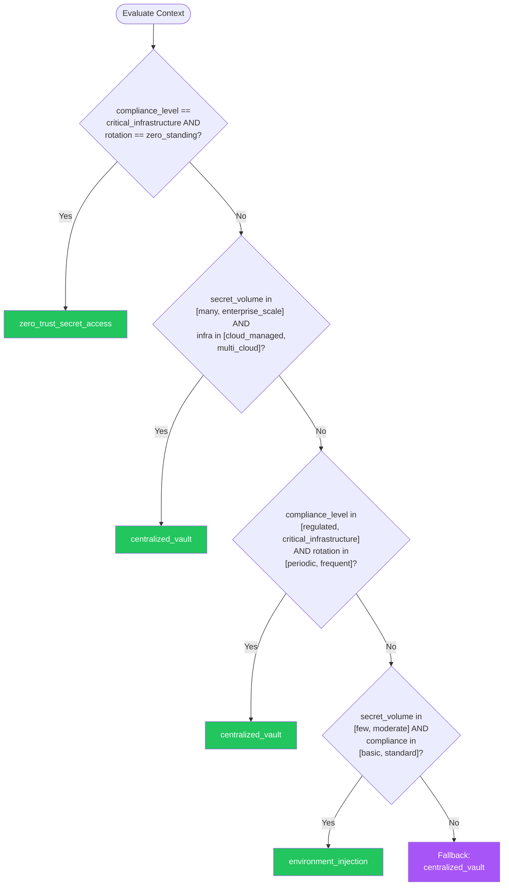

# Secrets Management — Summary

**Purpose**
- Secrets management patterns for securely storing, accessing, and rotating credentials, API keys, certificates, and encryption keys
- Scope: covers vault services, environment-based injection, automatic rotation, zero-trust secret access, and workload identity

## Related Standards

| Standard | Relationship | Context |
|----------|-------------|---------|
| [encryption](../../security-quality/encryption/) | complementary | Encryption keys are secrets managed by this pattern |
| [configuration-management](../configuration-management/) | complementary | Secrets are a special category of configuration requiring additional protection |
| [ci-cd](../../infrastructure/ci-cd/) | complementary | CI/CD pipelines need secure secret injection |
| [containerization](../../infrastructure/containerization/) | complementary | Container workloads need secure secret mounting |

## Context Inputs

These inputs drive the decision tree — provide them to get a tailored recommendation.

| Input | Type | Required | Default | Values | Description |
|-------|------|----------|---------|--------|-------------|
| infrastructure | enum | yes | cloud_managed | on_premises, cloud_managed, multi_cloud, hybrid | Primary infrastructure platform |
| secret_volume | enum | yes | moderate | few, moderate, many, enterprise_scale | Number and variety of secrets managed |
| rotation_requirement | enum | yes | periodic | manual, periodic, frequent, zero_standing | How frequently secrets must rotate |
| compliance_level | enum | yes | standard | basic, standard, regulated, critical_infrastructure | Compliance requirements for secret handling |

## Decision Tree

### Mermaid Diagram



### Text Fallback

- **Priority 1** → `zero_trust_secret_access` — when compliance_level == critical_infrastructure AND rotation_requirement == zero_standing. Critical infrastructure with zero standing privilege requires just-in-time secret access with dynamic credentials that expire after single use.
- **Priority 2** → `centralized_vault` — when secret_volume in [many, enterprise_scale] AND infrastructure in [cloud_managed, multi_cloud]. Enterprise-scale cloud deployments should use a centralized vault service with automatic rotation, audit logging, and policy-based access control.
- **Priority 3** → `centralized_vault` — when compliance_level in [regulated, critical_infrastructure] AND rotation_requirement in [periodic, frequent]. Regulated environments require centralized secret management with audit trails, automatic rotation, and access policies.
- **Priority 4** → `environment_injection` — when secret_volume in [few, moderate] AND compliance_level in [basic, standard]. Standard deployments with few secrets can use environment-based injection from platform secret stores.
- **Fallback** → `centralized_vault` — A centralized vault is the safest default for any production secret management.

> **Confidence**: high | **Risk if wrong**: critical

---

## Patterns

### 1. Centralized Vault Service

> Store all secrets in a dedicated vault service with access control policies, audit logging, automatic rotation, and dynamic secret generation. Applications authenticate to the vault to retrieve secrets at runtime.

**Maturity**: enterprise

**Use when**
- Production systems with multiple services
- Need audit trail for secret access
- Compliance requires controlled secret management
- Multiple teams sharing infrastructure

**Avoid when**
- Single developer local development (use environment variables)

**Tradeoffs**

| Pros | Cons |
|------|------|
| Centralized control and audit trail | Additional infrastructure to maintain |
| Automatic rotation without application changes | Vault availability is critical (apps cannot start without it) |
| Policy-based access control | Initial setup and migration effort |
| Dynamic secret generation (short-lived credentials) | |

**Implementation Guidelines**
- Choose vault: HashiCorp Vault, AWS Secrets Manager, Azure Key Vault, GCP Secret Manager
- Authenticate applications using workload identity (not static credentials to access the vault)
- Organize secrets by path: /{environment}/{service}/{secret-name}
- Implement least privilege: each service can only access its own secrets
- Enable audit logging for all secret read/write operations
- Configure automatic rotation for database credentials and API keys
- Use dynamic secrets where possible: vault generates short-lived DB credentials on demand
- Implement secret caching in application with TTL (avoid vault calls on every request)
- Set up high availability: vault outage should not cause application outage
- Back up vault data (encrypted) and test restoration procedures

**Common Errors**

| Error | Impact | Fix |
|-------|--------|-----|
| Using a static API key to authenticate to the vault | Chicken-and-egg problem: the vault credential is itself an unmanaged secret | Use workload identity (AWS IAM role, Kubernetes service account, Azure managed identity) |
| No caching — vault call on every request | High latency and vault overload; vault outage causes immediate application failure | Cache secrets locally with TTL; refresh before expiry; handle vault unavailability gracefully |

**Standards & References**

| Standard | Type | Role | Reference |
|----------|------|------|-----------|
| NIST SP 800-57 (Key Management) | standard | Key management recommendations | — |

---

### 2. Environment-Based Secret Injection

> Inject secrets into the application runtime via environment variables or mounted files, managed by the deployment platform's secret store. Secrets never appear in application code, config files, or container images.

**Maturity**: standard

**Use when**
- Container and serverless deployments
- 12-factor application architecture
- Platform-native secret management is sufficient

**Avoid when**
- Need dynamic rotation without redeployment
- Need cross-service secret sharing with fine-grained access control

**Tradeoffs**

| Pros | Cons |
|------|------|
| Simple: uses platform-native capabilities | Rotation requires redeployment or restart |
| No additional infrastructure | Environment variables visible via process inspection on the host |
| Follows 12-factor app principles | Limited audit trail compared to vault |

**Implementation Guidelines**
- Store secrets in platform secret store: Kubernetes Secrets (encrypted at rest), AWS SSM Parameter Store, etc.
- Inject as environment variables or mounted files (prefer mounted files for large secrets like certificates)
- Never commit secrets to version control — use .gitignore and pre-commit hooks
- Use separate secret stores per environment (dev, staging, production)
- Mark Kubernetes Secrets for encryption at rest (EncryptionConfiguration)
- Limit who can read secrets in the platform (RBAC on secret resources)
- Rotate secrets by updating the secret store and restarting affected pods/functions
- Use external-secrets operator or similar to sync from vault to Kubernetes Secrets

**Common Errors**

| Error | Impact | Fix |
|-------|--------|-----|
| Secrets in container image layers or Dockerfile | Anyone with image access can extract secrets; they persist in image history | Inject at runtime via environment variables or volume mounts; never copy secrets during build |
| Kubernetes Secrets without encryption at rest | Secrets stored as base64 in etcd — readable by anyone with etcd access | Enable encryption at rest for Kubernetes Secrets (EncryptionConfiguration with KMS provider) |

**Standards & References**

| Standard | Type | Role | Reference |
|----------|------|------|-----------|
| 12-Factor App (Config) | practice | Configuration management best practices | https://12factor.net/config |

---

### 3. Zero-Trust Secret Access

> No standing credentials. All secrets are dynamic, short-lived, and issued just-in-time based on verified workload identity. Database credentials, API keys, and service tokens are generated on demand and expire after use.

**Maturity**: enterprise

**Use when**
- Critical infrastructure with zero standing privilege requirements
- Maximum security posture needed
- Insider threat protection

**Avoid when**
- Infrastructure does not support workload identity
- Applications cannot handle credential refresh

**Tradeoffs**

| Pros | Cons |
|------|------|
| No long-lived credentials to steal | Significant infrastructure complexity |
| Automatic expiration limits breach window | Application must handle credential refresh |
| Full audit trail of every credential issuance | Credential issuer availability is critical |
| No credential sprawl | |

**Implementation Guidelines**
- Authenticate workloads via platform identity (SPIFFE/SPIRE, cloud IAM, Kubernetes service accounts)
- Generate database credentials on demand with vault dynamic secrets (e.g., Vault database engine)
- Issue short-lived API tokens: minutes to hours, not days
- Use mutual TLS with auto-rotating certificates (cert-manager, Vault PKI)
- Implement credential lease: application renews or gets new credential before expiry
- No human access to production credentials — all access through approved automation
- Break-glass procedure: emergency access with enhanced logging and automatic revocation
- Monitor for credential misuse: access patterns inconsistent with workload profile

**Common Errors**

| Error | Impact | Fix |
|-------|--------|-----|
| Dynamic credentials without lease renewal | Application loses database connection when credential expires | Implement proactive lease renewal: refresh at 50-75% of TTL |
| No break-glass procedure | Cannot access production during emergency when automation fails | Define break-glass with strong authentication, enhanced logging, and time-limited access |

**Standards & References**

| Standard | Type | Role | Reference |
|----------|------|------|-----------|
| SPIFFE (Secure Production Identity Framework) | standard | Workload identity framework | https://spiffe.io/ |

---

### 4. Automatic Secret Rotation

> Automate the rotation of secrets on a defined schedule without application downtime. Supports dual-credential strategies where old and new credentials are valid during rotation window.

**Maturity**: standard

**Use when**
- All production environments (rotation is always recommended)
- Compliance requirements mandate periodic rotation
- After a suspected credential compromise

**Avoid when**
- Never skip rotation for production secrets

**Tradeoffs**

| Pros | Cons |
|------|------|
| Limits window of exposure for compromised credentials | Rotation logic can be complex (dual-credential, grace period) |
| Compliance with rotation requirements | Failed rotation can cause outage |
| No human intervention needed | |

**Implementation Guidelines**
- Define rotation schedule: database passwords (90 days), API keys (180 days), certificates (before expiry)
- Use dual-credential rotation: issue new credential, update consumers, revoke old credential
- During rotation window: both old and new credentials are valid (grace period)
- Automate rotation with vault rotation lambdas/functions or built-in rotation
- Test rotation in non-production first: verify application handles credential refresh
- Alert on rotation failure: failed rotation is a security risk
- Implement emergency rotation: ability to rotate immediately on suspected compromise
- Certificate rotation: use short-lived certificates (hours/days) with auto-renewal

**Common Errors**

| Error | Impact | Fix |
|-------|--------|-----|
| Rotating without a grace period | Application using old credential fails immediately when new credential is activated | Dual-credential strategy: old credential remains valid for grace period after new one is active |
| No monitoring of rotation success | Rotation silently fails; credentials never actually change | Monitor rotation execution; alert on failure; verify new credential works before revoking old |

**Standards & References**

| Standard | Type | Role | Reference |
|----------|------|------|-----------|
| PCI DSS 3.6 | standard | Cryptographic key management requirements | — |

---

## Examples

### Application Secret Access — Vault with Workload Identity

**Context**: Application authenticating to vault using workload identity and caching secrets

**Correct** implementation:

```text
# Application secret access via vault with workload identity
import os
from functools import lru_cache
from datetime import datetime, timedelta, timezone

class SecretManager:
    def __init__(self, vault_client):
        self.vault = vault_client
        self._cache = {}

    def _authenticate(self):
        """Authenticate using workload identity — no static credentials."""
        # Kubernetes: uses service account token
        # Cloud: uses instance metadata / managed identity
        self.vault.auth.kubernetes(
            role="my-service",
            jwt=read_service_account_token()
        )

    def get_secret(self, path, ttl_seconds=300):
        """Retrieve secret with caching."""
        cached = self._cache.get(path)
        if cached and cached["expires_at"] > datetime.now(timezone.utc):
            return cached["value"]

        # Fetch from vault
        secret = self.vault.secrets.kv.read(path)
        self._cache[path] = {
            "value": secret["data"],
            "expires_at": datetime.now(timezone.utc) + timedelta(seconds=ttl_seconds)
        }
        return secret["data"]

    def get_dynamic_db_credential(self):
        """Get short-lived database credential from vault."""
        cred = self.vault.secrets.database.generate_credentials("my-db-role")
        # Credential has a lease — vault will revoke it after TTL
        return {
            "username": cred["data"]["username"],
            "password": cred["data"]["password"],
            "lease_id": cred["lease_id"],
            "lease_duration": cred["lease_duration"],
        }

# Usage
secrets = SecretManager(vault_client)
db_cred = secrets.get_dynamic_db_credential()
api_key = secrets.get_secret("my-service/api-keys/payment-provider")
```

**Incorrect** implementation:

```text
# WRONG: Secrets in code and environment without protection
import os

# WRONG: Hardcoded secret in source code
DATABASE_PASSWORD = "super-secret-password-123"

# WRONG: API key in config file committed to git
config = {
    "api_key": "sk-live-abcdef123456",
    "db_host": "prod-db.example.com",
    "db_password": DATABASE_PASSWORD,
}

# WRONG: Secret in Dockerfile
# ENV API_KEY=sk-live-abcdef123456

# WRONG: No rotation, no expiry, no audit trail
# WRONG: Same credentials across all environments
```

**Why**: The correct implementation uses workload identity to authenticate to vault (no static credentials), caches secrets with TTL, uses dynamic database credentials that expire automatically, and has audit trail via vault logging. The incorrect version has hardcoded secrets, secrets in config files committed to git, and no rotation or auditing.

---

## Security Hardening

### Transport
- All vault communication over mTLS
- Secret values never logged or transmitted in plaintext

### Data Protection
- Vault storage backend encrypted at rest
- Secrets in memory cleared after use where language supports it

### Access Control
- Vault access policies enforce least privilege per service
- Human access to production secrets requires approval workflow

### Input/Output
- Secrets never appear in error messages, logs, or API responses
- Secret values masked in CI/CD pipeline logs

### Secrets
- Vault unseal keys distributed using Shamir's Secret Sharing
- Root tokens generated, used, and revoked immediately

### Monitoring
- All secret read/write operations logged with service identity
- Alert on unauthorized secret access attempts
- Monitor rotation success and failure

---

## Anti-Patterns

| Anti-Pattern | Severity | Description | Fix |
|-------------|----------|-------------|-----|
| Secrets in Source Code | critical | Hardcoding API keys, database passwords, or tokens directly in source code. Secrets are exposed to anyone with repository access, persist in git history even after removal, and leak via public repos. | Use vault or environment injection; run secret detection in CI to prevent commits |
| Shared Credentials Across Environments | high | Using the same database password, API key, or service account across development, staging, and production. A compromise in any environment exposes all environments. | Unique credentials per environment; separate vault paths per environment |
| Never-Rotated Credentials | high | Credentials that have never been rotated since creation. The longer a credential exists, the more likely it has been compromised. | Implement automatic rotation; start with database passwords and API keys |

---

## Checklist

| ID | Category | Description | Severity |
|----|----------|-------------|----------|
| SEC-01 | security | No secrets hardcoded in source code or config files committed to git | **critical** |
| SEC-02 | security | Secrets stored in vault or platform secret store | **critical** |
| SEC-03 | security | Workload identity used for vault authentication (no static vault credentials) | **high** |
| SEC-04 | security | Automatic rotation configured for database credentials and API keys | **high** |
| SEC-05 | security | All secret access logged with service identity | **high** |
| SEC-06 | security | Secrets never appear in logs, error messages, or API responses | **critical** |
| SEC-07 | security | Development and production secrets are completely separate | **high** |
| SEC-08 | security | Secret detection running in CI pipeline (gitleaks, detect-secrets) | **high** |
| SEC-09 | security | Emergency rotation procedure documented and tested | **high** |
| SEC-10 | security | Vault high availability configured (no SPOF) | **high** |

---

## Compliance

### Standards

| Standard | Relevance | Reference |
|----------|-----------|-----------|
| NIST SP 800-57 (Key Management) | Cryptographic key management lifecycle | — |
| PCI DSS Requirement 3.5-3.6 | Protecting stored cryptographic keys | — |
| SOC 2 CC6.1 | Logical and physical access controls | — |

### Requirements Mapping

| Control | Description | Maps To |
|---------|-------------|---------|
| secret_storage | Secrets stored in dedicated secure storage, not application code or config | PCI DSS 3.5, SOC 2 CC6.1 |
| secret_rotation | Automated rotation of credentials on defined schedule | PCI DSS 3.6.4, NIST SP 800-57 |
| secret_access_audit | All secret access logged with identity and timestamp | SOC 2 CC7.2, PCI DSS 10.2 |

---

## Prompt Recipes

### Design secrets management for a new application
**Scenario**: greenfield

```text
Design secrets management for a new application.

Context:
- Infrastructure: [Kubernetes/cloud serverless/VMs/hybrid]
- Cloud provider: [AWS/Azure/GCP/multi-cloud]
- Number of services: [specify]
- Compliance: [standard/regulated/critical]

Requirements:
- Vault service selection
- Authentication strategy (workload identity)
- Secret organization and access policies
- Rotation strategy and schedule
- CI/CD secret injection
- Emergency rotation procedure
```

---

### Audit secrets management practices
**Scenario**: audit

```text
Audit secrets management:

1. Are any secrets hardcoded in source code?
2. Are any secrets in configuration files committed to git?
3. Are secrets in environment variables or vault?
4. Is workload identity used for vault authentication?
5. Are secrets rotated automatically?
6. Is secret access logged and audited?
7. Are least privilege policies enforced per service?
8. Are development and production secrets separated?
9. Is there an emergency rotation procedure?
10. Are secret detection tools running in CI (gitleaks, detect-secrets)?
```

---

### Migrate from hardcoded secrets to vault
**Scenario**: migration

```text
Migrate from hardcoded/environment secrets to centralized vault.

Steps:
1. Inventory all secrets (scan code, config, environment variables)
2. Set up vault service with HA
3. Configure workload identity authentication
4. Migrate secrets to vault (one service at a time)
5. Update applications to read from vault
6. Configure automatic rotation
7. Set up monitoring and alerting
8. Rotate all migrated secrets (old values may be compromised)
9. Verify no secrets remain in old locations
10. Enable secret detection in CI to prevent regression
```

---

### Implement automatic secret rotation
**Scenario**: operations

```text
Implement automatic secret rotation.

For each secret type:
1. Database passwords: dual-credential rotation every 90 days
2. API keys: rotate every 180 days or on suspected compromise
3. TLS certificates: auto-renew 30 days before expiry
4. Service tokens: short-lived (hours), auto-refresh
5. Encryption keys: annual rotation with re-encryption schedule

For each, define:
- Rotation trigger (schedule or event)
- Rotation procedure (dual-credential, generate-new, etc.)
- Validation (verify new secret works)
- Rollback (revert if rotation fails)
- Monitoring (alert on failure)
```

---

## Notes
- The four patterns form a maturity progression: environment injection → centralized vault → automatic rotation → zero-trust secret access
- Prerequisites include encryption and authentication standards
- Centralized vault is the safest default for any production environment

## Links
- Full standard: [secrets-management.yaml](secrets-management.yaml)
