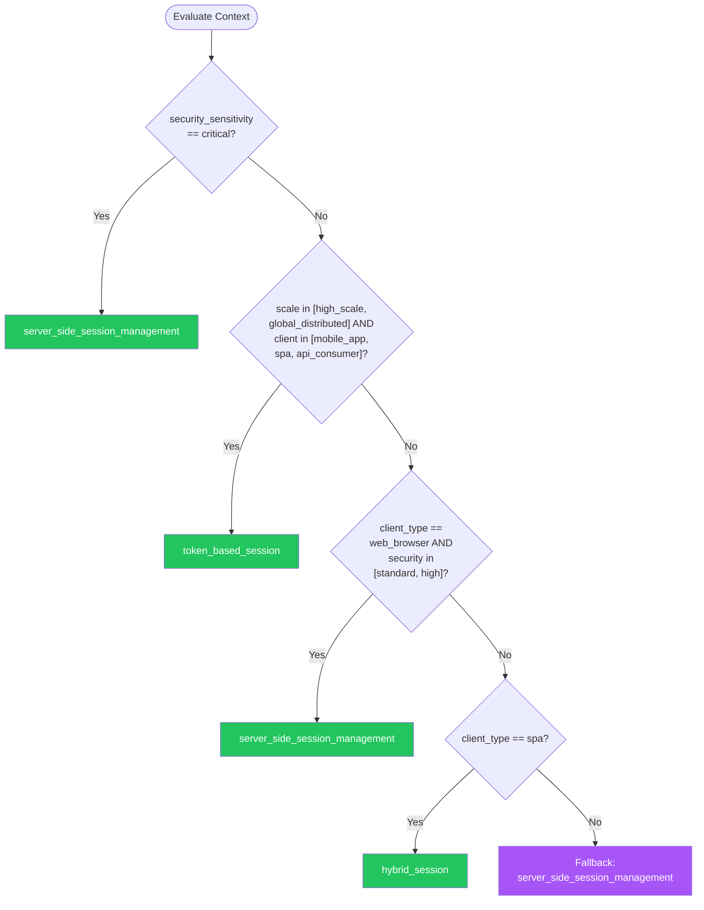

# Session Management — Summary

**Purpose**
- Session management patterns covering stateful and stateless sessions, token lifecycle, session fixation prevention, idle and absolute timeouts, concurrent session controls, and secure session storage
- Scope: server-side sessions, JWT + refresh token rotation, BFF hybrid pattern, and session hardening techniques

## Related Standards

| Standard | Relationship | Context |
|----------|-------------|---------|
| [authentication](../authentication/) | complementary | Sessions are created after successful authentication |
| [encryption](../../security-quality/encryption/) | complementary | Session tokens and cookies require cryptographic protection |
| [rate-limiting](../../security-quality/rate-limiting/) | complementary | Rate limiting protects session endpoints from brute force |

## Context Inputs

These inputs drive the decision tree — provide them to get a tailored recommendation.

| Input | Type | Required | Default | Values | Description |
|-------|------|----------|---------|--------|-------------|
| session_type | enum | yes | stateless_token | server_side_session, stateless_token, hybrid | Primary session mechanism |
| client_type | enum | yes | web_browser | web_browser, mobile_app, spa, api_consumer | Primary client consuming sessions |
| security_sensitivity | enum | yes | standard | low, standard, high, critical | Security sensitivity of the application |
| scale_requirements | enum | yes | moderate | single_server, moderate, high_scale, global_distributed | Scale and distribution requirements |

## Decision Tree

### Mermaid Diagram



### Text Fallback

- **Priority 1** → `server_side_session_management` — when security_sensitivity == critical. Critical security applications should use server-side sessions for immediate revocation capability. Financial services, healthcare, and government applications require server-side session control.
- **Priority 2** → `token_based_session` — when scale_requirements in [high_scale, global_distributed] AND client_type in [mobile_app, spa, api_consumer]. High-scale APIs and SPAs benefit from stateless token-based sessions with short-lived access tokens and refresh token rotation.
- **Priority 3** → `server_side_session_management` — when client_type == web_browser AND security_sensitivity in [standard, high]. Traditional web applications with standard or high security should use server-side sessions with secure cookie transport.
- **Priority 4** → `hybrid_session` — when client_type == spa. SPAs benefit from a Backend-for-Frontend pattern where the server manages the session and issues secure cookies to the browser.
- **Fallback** → `server_side_session_management` — Server-side sessions with secure cookies provide the strongest security baseline.

> **Confidence**: high | **Risk if wrong**: high

---

## Patterns

### 1. Server-Side Session Management

> Maintain session state on the server, referenced by an opaque session ID stored in a secure HTTP cookie. Provides immediate revocation, server-side timeout enforcement, and no client-side session data exposure.

**Maturity**: standard

**Use when**
- Traditional web applications
- High security requirements
- Need immediate session revocation
- Session data contains sensitive information

**Avoid when**
- Stateless API-to-API communication
- Global distribution where session store replication is impractical

**Tradeoffs**

| Pros | Cons |
|------|------|
| Immediate revocation (delete session from store) | Requires session store (Redis, database) |
| Session data not exposed to client | Session store is a scaling bottleneck |
| Server controls all session state | Session affinity or replication needed for multi-server |
| Simple CSRF protection with SameSite cookies | |

**Implementation Guidelines**
- Generate session ID using cryptographically secure random generator (≥128 bits entropy)
- Store session in server-side store: Redis (preferred), database, or encrypted cookie
- Transport session ID via cookie: Secure, HttpOnly, SameSite=Lax (or Strict), Path=/
- Regenerate session ID after authentication (prevent session fixation)
- Implement idle timeout: invalidate after 15-30 minutes of inactivity
- Implement absolute timeout: invalidate after 8-24 hours regardless of activity
- Invalidate session on logout (delete from store)
- Limit concurrent sessions per user (configurable per security level)
- Log session lifecycle events: creation, access, timeout, explicit logout

**Common Errors**

| Error | Impact | Fix |
|-------|--------|-----|
| Not regenerating session ID after login | Session fixation: attacker pre-sets session ID, victim authenticates, attacker hijacks session | Always regenerate session ID after successful authentication |
| Missing cookie security flags | Session cookie exposed via HTTP (no Secure flag), JavaScript (no HttpOnly), cross-site requests (no SameSite) | Set Secure, HttpOnly, and SameSite flags on all session cookies |

**Standards & References**

| Standard | Type | Role | Reference |
|----------|------|------|-----------|
| OWASP Session Management Cheat Sheet | reference | Comprehensive session management guidance | https://cheatsheetseries.owasp.org/cheatsheets/Session_Management_Cheat_Sheet.html |

---

### 2. Token-Based Session (JWT + Refresh Token Rotation)

> Use short-lived access tokens (JWT) for API authentication with refresh token rotation for session continuity. Access tokens are stateless and verifiable without a database lookup. Refresh tokens provide revocation capability and session lifecycle management.

**Maturity**: standard

**Use when**
- API-first architectures
- Mobile applications
- Microservices needing distributed authentication
- High-scale systems where session store is a bottleneck

**Avoid when**
- Need immediate revocation (access tokens are valid until expiry)
- Critical security where even short-lived token compromise is unacceptable

**Tradeoffs**

| Pros | Cons |
|------|------|
| Stateless verification: no session store lookup needed | Cannot revoke access tokens before expiry (mitigated by short TTL) |
| Works across services without shared session store | Token size larger than session ID |
| Scales horizontally without session replication | Token theft gives access for token lifetime |

**Implementation Guidelines**
- Access token: short-lived (5-15 minutes), contains user claims, signed (RS256 or ES256)
- Refresh token: longer-lived (hours to days), opaque, stored server-side
- Implement refresh token rotation: new refresh token issued with each access token refresh
- Detect refresh token reuse: if a rotated-out refresh token is used, revoke all tokens for that session
- Store refresh tokens server-side with: user_id, device_id, issued_at, expires_at, revoked_at
- Access token claims: sub, iat, exp, iss, aud, roles/permissions (minimal claims)
- Never store sensitive data in JWT (it is base64-encoded, not encrypted)
- Validate all JWT fields on every request: signature, exp, iss, aud
- Bind refresh tokens to device/client: require device fingerprint for refresh

**Common Errors**

| Error | Impact | Fix |
|-------|--------|-----|
| Long-lived access tokens (hours or days) | Stolen token provides extended access with no revocation capability | Access tokens should be 5-15 minutes; use refresh tokens for session continuity |
| No refresh token rotation | Stolen refresh token provides indefinite access | Issue new refresh token with each use; detect reuse of old refresh tokens |

**Standards & References**

| Standard | Type | Role | Reference |
|----------|------|------|-----------|
| RFC 7519 (JSON Web Token) | standard | JWT specification | — |
| OAuth 2.0 Security Best Current Practice | standard | Security considerations for token-based auth | — |

---

### 3. Hybrid Session (BFF Pattern)

> Backend-for-Frontend pattern where the server manages tokens and sessions, while the browser receives only secure HTTP cookies. Combines the security of server-side sessions with the scalability of tokens for backend service communication.

**Maturity**: enterprise

**Use when**
- Single-Page Applications (SPAs)
- Need OAuth/OIDC integration without exposing tokens to browser
- Want server-side session security with token-based backend

**Avoid when**
- Pure API-to-API communication (tokens suffice)
- Simple server-rendered applications (server-side sessions suffice)

**Tradeoffs**

| Pros | Cons |
|------|------|
| Tokens never exposed to browser JavaScript | Additional BFF server component |
| Server-side revocation capability | BFF is a single point of failure |
| Secure cookie transport to browser | More complex architecture |
| Token-based communication to backend services | |

**Implementation Guidelines**
- BFF server handles OAuth/OIDC flows and stores tokens server-side
- BFF issues secure HTTP-only cookie to browser (opaque session ID)
- BFF proxies API requests, attaching access token from server-side session
- BFF handles token refresh transparently
- Never send access or refresh tokens to the browser
- Implement CSRF protection on BFF (SameSite cookies + CSRF token for mutations)
- BFF session timeout aligns with token lifetime

**Common Errors**

| Error | Impact | Fix |
|-------|--------|-----|
| Storing tokens in browser localStorage or sessionStorage | XSS attack can steal tokens — no HttpOnly protection for storage APIs | Tokens stay server-side in BFF; browser gets only HttpOnly cookie |
| BFF without CSRF protection | Cross-site requests can trigger authenticated actions via cookie | Use SameSite=Lax/Strict cookies and CSRF tokens for state-changing operations |

**Standards & References**

| Standard | Type | Role | Reference |
|----------|------|------|-----------|
| OAuth 2.0 for Browser-Based Apps | standard | Security guidance for SPAs using OAuth | — |

---

### 4. Session Hardening & Attack Prevention

> Cross-cutting security hardening for all session types. Covers session fixation prevention, concurrent session limits, device binding, and anomaly detection on session usage patterns.

**Maturity**: standard

**Use when**
- All applications — these are hardening techniques applied on top of any session pattern

**Avoid when**
- Never skip hardening

**Tradeoffs**

| Pros | Cons |
|------|------|
| Prevents common session attacks | Some measures may affect UX (concurrent session limits, re-authentication) |
| Detects session theft | |
| Limits blast radius of compromised sessions | |

**Implementation Guidelines**
- Session fixation: regenerate session ID after authentication, privilege change, and role change
- Concurrent sessions: limit to N active sessions per user; notify on new session from new device
- Device binding: associate session with device fingerprint (user agent, client hints); challenge on mismatch
- IP binding (optional, cautious): flag session if source IP changes significantly (different country)
- Step-up authentication: require re-authentication for sensitive operations (password change, payment)
- Session enumeration prevention: use cryptographically random session IDs, no sequential patterns
- Cookie prefix: use __Host- prefix for session cookies (enforces Secure, Path=/, no Domain)
- Clear all session data on logout: server-side state, cookies, and instruct client to clear local state

**Common Errors**

| Error | Impact | Fix |
|-------|--------|-----|
| Strict IP binding on mobile networks | Legitimate users constantly logged out as mobile IPs change | Use IP as a risk signal, not a hard binding; flag but don't invalidate on IP change |
| No session invalidation on password change | Attacker who has stolen session remains authenticated after password reset | Invalidate all other sessions when password is changed |

**Standards & References**

| Standard | Type | Role | Reference |
|----------|------|------|-----------|
| OWASP Session Management Cheat Sheet | reference | Session hardening practices | — |

---

## Examples

### Secure Session Cookie Configuration

**Context**: Configuring session cookies with all security flags

**Correct** implementation:

```text
# Secure session cookie configuration
session_config = {
    "cookie_name": "__Host-session",  # __Host- prefix enforces Secure + Path=/
    "cookie_secure": True,            # Only sent over HTTPS
    "cookie_httponly": True,           # Not accessible via JavaScript
    "cookie_samesite": "Lax",         # Prevents CSRF for most cases
    "cookie_path": "/",               # Required by __Host- prefix
    "session_id_length": 32,          # 256 bits of entropy
    "idle_timeout_minutes": 30,       # Invalidate after 30 min inactivity
    "absolute_timeout_hours": 8,      # Max 8 hours regardless of activity
    "regenerate_on_auth": True,       # New session ID after login
    "max_concurrent_sessions": 3,     # Limit active sessions per user
}

# Session creation after authentication
def create_session(user, request):
    # Regenerate session ID to prevent fixation
    session_id = generate_secure_random(32)

    session = {
        "session_id": session_id,
        "user_id": user.id,
        "created_at": now(),
        "last_active": now(),
        "device": request.user_agent,
        "ip_address": request.remote_ip,
    }
    session_store.save(session_id, session, ttl=absolute_timeout)

    # Enforce concurrent session limit
    enforce_session_limit(user.id, max_concurrent=3)

    return set_cookie(
        name="__Host-session",
        value=session_id,
        secure=True, httponly=True,
        samesite="Lax", path="/"
    )
```

**Incorrect** implementation:

```text
# WRONG: Insecure session configuration
session_config = {
    "cookie_name": "sid",                # No __Host- prefix
    # Missing: secure flag (sent over HTTP)
    # Missing: httponly flag (accessible via JS)
    # Missing: samesite flag (CSRF vulnerable)
    "session_id": str(user.id),          # WRONG: Predictable session ID!
    # No idle timeout
    # No absolute timeout
    # No session regeneration after auth
    # No concurrent session limit
}
```

**Why**: The correct configuration uses __Host- cookie prefix, all security flags, cryptographically random session ID, timeout enforcement, session regeneration, and concurrent session limits. The incorrect version has predictable IDs, no security flags, and no timeouts.

---

## Security Hardening

### Transport
- Session cookies use Secure flag (HTTPS only)
- Session tokens transmitted only over TLS

### Data Protection
- Session store encrypted at rest
- Session data does not contain plaintext credentials

### Access Control
- Session management configuration requires privileged access
- Session store access restricted to application service accounts

### Input/Output
- Session IDs validated format before lookup (prevent injection)
- Session cookie uses __Host- prefix where supported

### Secrets
- JWT signing keys stored in secret manager, not application config
- Session store credentials in secret manager

### Monitoring
- Log session lifecycle: creation, timeout, logout, revocation
- Alert on concurrent session limit exceeded
- Monitor for session fixation attempts (pre-auth session ID reuse)

---

## Anti-Patterns

| Anti-Pattern | Severity | Description | Fix |
|-------------|----------|-------------|-----|
| Tokens in localStorage | critical | Storing access or refresh tokens in browser localStorage or sessionStorage. Any XSS vulnerability can steal tokens because storage APIs are accessible from JavaScript, unlike HttpOnly cookies. | Store tokens server-side (BFF pattern); browser gets only HttpOnly cookies |
| No Session Timeout | high | Sessions that never expire. A stolen session token or cookie provides indefinite access. Abandoned sessions on shared devices remain active. | Implement both idle timeout (15-30 min) and absolute timeout (8-24h) |
| Predictable Session IDs | critical | Using sequential numbers, timestamps, or user IDs as session identifiers. Attackers can guess or enumerate valid session IDs. | Use cryptographically secure random generator with ≥128 bits entropy |

---

## Checklist

| ID | Category | Description | Severity |
|----|----------|-------------|----------|
| SESS-01 | security | Session IDs are cryptographically random (≥128 bits entropy) | **critical** |
| SESS-02 | security | Session cookies have Secure, HttpOnly, and SameSite flags | **critical** |
| SESS-03 | security | Session ID regenerated after authentication | **critical** |
| SESS-04 | security | Idle timeout configured (15-30 minutes) | **high** |
| SESS-05 | security | Absolute timeout configured (8-24 hours) | **high** |
| SESS-06 | security | Logout invalidates session server-side | **high** |
| SESS-07 | security | Access tokens short-lived (≤15 minutes) with refresh rotation | **high** |
| SESS-08 | security | Concurrent sessions limited per user | **medium** |
| SESS-09 | security | Tokens never stored in localStorage or sessionStorage | **critical** |
| SESS-10 | security | All other sessions invalidated on password change | **high** |

---

## Compliance

### Standards

| Standard | Relevance | Reference |
|----------|-----------|-----------|
| OWASP Session Management Cheat Sheet | Comprehensive session management security guidance | https://cheatsheetseries.owasp.org/cheatsheets/Session_Management_Cheat_Sheet.html |
| RFC 7519 (JWT) | JSON Web Token specification for token-based sessions | — |

### Requirements Mapping

| Control | Description | Maps To |
|---------|-------------|---------|
| session_security | Secure session management with proper timeouts and regeneration | OWASP Top 10 A07:2021 (Identification and Authentication Failures), SOC 2 CC6.1 |
| session_revocation | Ability to revoke sessions immediately | PCI DSS 8.2.8, NIST SP 800-63B |

---

## Prompt Recipes

### Design session management for a new application
**Scenario**: greenfield

```text
Design session management for a new application.

Context:
- Client type: [web browser/SPA/mobile/API]
- Security level: [standard/high/critical]
- Scale: [single server/moderate/high scale/global]
- Auth mechanism: [password/OAuth/SAML]

Requirements:
- Session type recommendation (server-side/token/hybrid)
- Cookie or token configuration
- Timeout policy (idle + absolute)
- Concurrent session limits
- Session fixation prevention
- Logout and revocation strategy
```

---

### Audit session management security
**Scenario**: audit

```text
Audit session management security:

1. Are session IDs cryptographically random (≥128 bits)?
2. Are session cookies Secure, HttpOnly, SameSite?
3. Is session ID regenerated after authentication?
4. Are idle and absolute timeouts configured?
5. Is logout implemented (server-side invalidation)?
6. Are concurrent sessions limited?
7. Is step-up auth required for sensitive operations?
8. Are JWT access tokens short-lived (≤15 minutes)?
9. Is refresh token rotation implemented?
10. Are session lifecycle events logged?
```

---

### Migrate from insecure to secure session management
**Scenario**: migration

```text
Migrate session management to secure configuration.

Steps:
1. Audit current session configuration
2. Add missing cookie security flags (Secure, HttpOnly, SameSite)
3. Implement session ID regeneration on authentication
4. Configure idle timeout (30 min) and absolute timeout (8h)
5. Add concurrent session limits
6. Implement proper logout (server-side invalidation)
7. Add __Host- cookie prefix
8. Add session lifecycle logging
9. Test session fixation prevention
10. Test concurrent session enforcement
```

---

### Implement BFF pattern for SPA session management
**Scenario**: optimization

```text
Implement the Backend-for-Frontend (BFF) pattern for SPA.

Architecture:
- BFF server handles OAuth/OIDC token exchange
- Tokens stored server-side (never sent to browser)
- Browser receives HttpOnly session cookie
- BFF proxies API calls with access token
- BFF handles token refresh transparently

Implementation steps and security considerations.
```

---

## Notes
- The four patterns serve different architectural needs: server-side for traditional web, token-based for APIs, hybrid BFF for SPAs, and session hardening as a cross-cutting concern applied to all patterns
- Prerequisite: authentication standard must be implemented before session management

## Links
- Full standard: [session-management.yaml](session-management.yaml)
