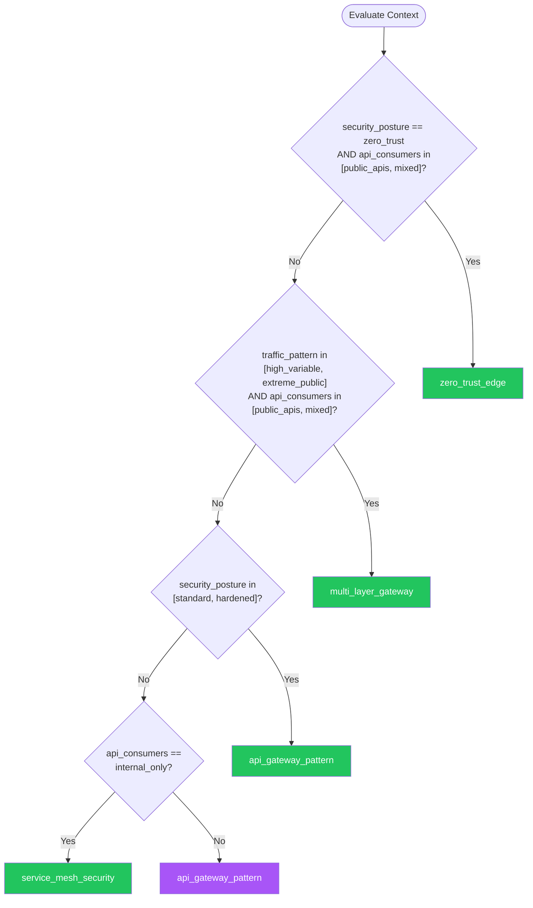

# API Gateway & Edge Security — Summary

**Purpose**
- API gateway and edge security patterns covering request routing, rate limiting, authentication offloading, WAF integration, DDoS protection, API versioning at the edge, request/response transformation, and zero-trust network architecture.
- Scope: defense-in-depth at the network edge — from CDN/DDoS through WAF, API gateway, and service mesh layers.

## Related Standards

| Standard | Relationship | Context |
|----------|-------------|---------|
| [api-design](../../foundational/api-design/) | complementary | API gateway enforces API design standards at the edge |
| [rate-limiting](../../security-quality/rate-limiting/) | complementary | Rate limiting is a core gateway capability |
| [authentication](../../foundational/authentication/) | complementary | Gateway offloads authentication from backend services |
| [containerization](../containerization/) | complementary | Service mesh and gateway work together in container orchestration |

## Context Inputs

These inputs drive the decision tree — provide them to get a tailored recommendation.

| Input | Type | Required | Default | Values | Description |
|-------|------|----------|---------|--------|-------------|
| traffic_pattern | enum | yes | moderate_steady | low_internal, moderate_steady, high_variable, extreme_public | Expected traffic pattern and scale |
| api_consumers | enum | yes | mixed | internal_only, partner_apis, public_apis, mixed | Who consumes the APIs |
| security_posture | enum | yes | standard | basic, standard, hardened, zero_trust | Required edge security level |
| deployment_topology | enum | yes | cloud_native | single_region, multi_region, cloud_native, hybrid | Infrastructure deployment model |

## Decision Tree

### Mermaid Diagram



### Text Fallback

- **Priority 1** → `zero_trust_edge` — when security_posture == zero_trust AND api_consumers in [public_apis, mixed]. Zero-trust with public API exposure requires mTLS, per-request authentication, request signing, and comprehensive WAF with bot management.
- **Priority 2** → `multi_layer_gateway` — when traffic_pattern in [high_variable, extreme_public] AND api_consumers in [public_apis, mixed]. High-traffic public APIs need multi-layer protection: CDN/DDoS at edge, WAF, API gateway, and service mesh.
- **Priority 3** → `api_gateway_pattern` — when security_posture in [standard, hardened]. Standard API gateway with authentication offloading, rate limiting, request validation, and monitoring.
- **Priority 4** → `service_mesh_security` — when api_consumers == internal_only. Internal-only APIs in microservices benefit from service mesh for mTLS, traffic management, and observability.
- **Fallback** → `api_gateway_pattern` — API gateway with WAF and rate limiting covers most deployment scenarios.

> **Confidence**: high | **Risk if wrong**: high

---

## Patterns

### 1. API Gateway Pattern

> Centralized API gateway that serves as the single entry point for all API traffic. Handles cross-cutting concerns: authentication, rate limiting, request routing, protocol translation, and monitoring. Backend services focus on business logic.

**Maturity**: standard

**Use when**
- Multiple backend services behind a unified API
- Need centralized authentication and rate limiting
- API versioning and routing at the edge
- Request/response transformation needed

**Avoid when**
- Single backend service (reverse proxy sufficient)
- Gateway becomes a bottleneck (consider distributed gateways)

**Tradeoffs**

| Pros | Cons |
|------|------|
| Single entry point simplifies client interaction | Single point of failure (requires HA) |
| Cross-cutting concerns handled once, not per-service | Additional network hop (latency) |
| Centralized monitoring and access logging | Configuration complexity at scale |
| API versioning without backend changes | |

**Implementation Guidelines**
- Deploy gateway in HA: multiple instances behind load balancer
- Offload authentication: gateway validates tokens, passes user context to backends
- Implement rate limiting per client/API key with configurable limits
- Enable request validation: reject malformed requests before reaching backend
- Configure timeouts per route: connect, read, and write timeouts
- Implement request/response logging with PII masking
- Enable health checks for backend services: remove unhealthy backends from routing
- Implement request size limits: prevent oversized payloads
- Enable compression: gzip/brotli for response bodies
- Use circuit breakers in gateway for backend protection

**Common Errors**

| Error | Impact | Fix |
|-------|--------|-----|
| Gateway as a monolithic bottleneck | All API traffic funneled through single instance; outage takes down everything | Deploy gateway in HA with auto-scaling; consider team-specific gateway instances |
| Business logic in gateway | Gateway becomes hard to maintain; coupling between gateway and business domain | Gateway handles only cross-cutting concerns: auth, routing, rate limiting, transformation |

**Standards & References**

| Standard | Type | Role | Reference |
|----------|------|------|-----------|
| OWASP API Security Top 10 | reference | API security risks and mitigations | https://owasp.org/API-Security/ |

---

### 2. Multi-Layer Edge Protection

> Defense-in-depth at the network edge with multiple layers: CDN/DDoS protection, WAF (Web Application Firewall), API gateway, and optionally service mesh. Each layer handles specific threat categories, and no single layer compromise exposes the backend.

**Maturity**: enterprise

**Use when**
- Public-facing APIs with high traffic
- Compliance requiring WAF (PCI DSS)
- DDoS protection needed
- Multiple threat vectors to address

**Avoid when**
- Internal-only services (over-engineered)
- Simple APIs with low traffic

**Tradeoffs**

| Pros | Cons |
|------|------|
| Defense in depth: multiple security layers | Higher infrastructure cost |
| DDoS absorbed at edge before reaching infrastructure | More complex troubleshooting (which layer blocked?) |
| WAF protects against OWASP Top 10 | Latency from multiple processing layers |
| Each layer specializes in specific protections | |

**Implementation Guidelines**
- Layer 1 (CDN/DDoS): Cloudflare, AWS CloudFront+Shield, Azure Front Door — absorb volumetric attacks
- Layer 2 (WAF): OWASP Core Rule Set — block SQLi, XSS, path traversal, etc.
- Layer 3 (API Gateway): authentication, rate limiting, request validation, routing
- Layer 4 (Service Mesh, optional): mTLS between services, east-west traffic control
- Configure WAF in detection mode first; review blocked requests; switch to prevention mode
- Implement bot management: distinguish bots from legitimate traffic
- Set up geographic blocking if API is region-specific
- Enable real-time WAF logging for security monitoring
- Tune WAF rules: false positives break legitimate traffic

**Common Errors**

| Error | Impact | Fix |
|-------|--------|-----|
| WAF in prevention mode without tuning | Legitimate requests blocked by overly aggressive rules | Deploy in detection mode first; analyze logs; tune rules; then enable prevention |
| No DDoS protection for public APIs | Volumetric attack overwhelms infrastructure; legitimate users locked out | Use CDN/DDoS service as first layer; absorb attack at edge |

**Standards & References**

| Standard | Type | Role | Reference |
|----------|------|------|-----------|
| OWASP ModSecurity Core Rule Set | standard | WAF rule set for common web attacks | |

---

### 3. Zero-Trust Edge Architecture

> Every request is authenticated and authorized regardless of network location. No implicit trust based on IP, VPN, or network segment. mTLS for all service communication, per-request token validation, and continuous verification.

**Maturity**: enterprise

**Use when**
- High-security environments
- Remote workforce (no corporate network perimeter)
- Multi-cloud or hybrid deployments
- Compliance requiring zero-trust (FedRAMP, NIST)

**Avoid when**
- Isolated lab environments with no external access

**Tradeoffs**

| Pros | Cons |
|------|------|
| No implicit trust — every request verified | Certificate management complexity (mTLS) |
| Effective against lateral movement attacks | Performance overhead for per-request verification |
| Works across network boundaries and clouds | Requires workload identity infrastructure |

**Implementation Guidelines**
- mTLS everywhere: all service-to-service communication encrypted and mutually authenticated
- Per-request authentication: validate token on every request, even internal
- No network-based allow lists: do not trust requests just because they come from a 'trusted' network
- Implement workload identity: SPIFFE/SPIRE for service identity
- Short-lived certificates: auto-rotate (hours, not years)
- Request signing: clients sign requests; servers verify signatures (prevents replay)
- Implement network segmentation as defense-in-depth, not as a trust boundary
- Log all access decisions for audit trail

**Common Errors**

| Error | Impact | Fix |
|-------|--------|-----|
| mTLS with long-lived certificates | Compromised certificate provides prolonged access | Use short-lived certificates (hours/days) with automatic rotation |
| Trusting internal network segments | Attacker who gains internal access moves laterally without detection | Authenticate and authorize every request regardless of source network |

**Standards & References**

| Standard | Type | Role | Reference |
|----------|------|------|-----------|
| NIST SP 800-207 (Zero Trust Architecture) | standard | Zero trust architecture reference | https://csrc.nist.gov/publications/detail/sp/800-207/final |

---

### 4. Service Mesh Security

> Use a service mesh (Istio, Linkerd, Consul Connect) for service-to-service security: automatic mTLS, traffic policies, observability, and access control without application code changes.

**Maturity**: enterprise

**Use when**
- Microservices architecture with many services
- Need mTLS without application changes
- East-west traffic security and observability
- Kubernetes-based infrastructure

**Avoid when**
- Few services (overhead not justified)
- Non-container infrastructure

**Tradeoffs**

| Pros | Cons |
|------|------|
| Automatic mTLS without app changes | Significant infrastructure complexity |
| Traffic policies declarative (not in code) | Resource overhead (sidecar proxy per pod) |
| Built-in observability (traces, metrics) | Debugging is more complex (proxy layer) |
| Access control between services | |

**Implementation Guidelines**
- Enable strict mTLS mode: reject plaintext connections between mesh services
- Define authorization policies: which service can call which service
- Implement traffic management: retries, timeouts, circuit breakers in mesh config
- Enable observability: distributed tracing and metrics from mesh sidecars
- Gradual adoption: start with permissive mode, move to strict after baseline
- Manage mesh upgrade lifecycle: sidecar version consistency

**Common Errors**

| Error | Impact | Fix |
|-------|--------|-----|
| Permissive mTLS mode in production | Services accept both encrypted and plaintext — no real security | Switch to strict mTLS mode after validating all services are in the mesh |
| No authorization policies — only mTLS | Any service in the mesh can call any other service (flat trust) | Define service-level authorization policies: explicitly allow required call paths |

**Standards & References**

| Standard | Type | Role | Reference |
|----------|------|------|-----------|
| NIST SP 800-204A | standard | Security strategies for microservices | |

---

## Examples

### API Gateway Configuration — Rate Limiting + Auth
**Context**: Configuring API gateway with authentication offloading and rate limiting

**Correct** implementation:
```yaml
# API Gateway configuration (conceptual — applies to any gateway)
gateway:
  listeners:
    - port: 443
      protocol: HTTPS
      tls:
        min_version: "1.2"
        cipher_suites: ["TLS_AES_256_GCM_SHA384", "TLS_CHACHA20_POLY1305_SHA256"]

  global_policies:
    # Request size limit
    max_request_body: "10MB"
    # Request timeout
    timeout: "30s"
    # WAF integration
    waf:
      enabled: true
      mode: "prevention"
      ruleset: "owasp-crs-4.0"

  routes:
    - path: "/api/v1/public/**"
      backend: "public-service"
      rate_limit:
        requests_per_second: 100
        burst: 20
        key: "client_ip"
      authentication: "api_key"

    - path: "/api/v1/users/**"
      backend: "user-service"
      rate_limit:
        requests_per_second: 50
        burst: 10
        key: "authenticated_user"
      authentication: "jwt"  # Gateway validates JWT, passes user context
      authorization:
        required_scopes: ["users:read"]

    - path: "/api/internal/**"
      backend: "internal-service"
      access: "deny_external"  # Only from service mesh
      authentication: "mtls"

  health_check:
    path: "/health"
    interval: "10s"
    unhealthy_threshold: 3
```

**Incorrect** implementation:
```yaml
# WRONG: No security at gateway level
gateway:
  routes:
    - path: "/**"
      backend: "monolith"
      # WRONG: No rate limiting — vulnerable to abuse
      # WRONG: No authentication at gateway — every request hits backend
      # WRONG: No WAF — OWASP Top 10 attacks reach backend
      # WRONG: No request size limit — oversized payloads accepted
      # WRONG: No TLS configuration — may accept weak ciphers
      # WRONG: No timeout — slow requests tie up resources
      # WRONG: No health checks — routes to unhealthy backends
```

**Why**: The correct configuration implements defense-in-depth at the gateway: TLS with modern ciphers, WAF with OWASP rules, per-route rate limiting, authentication offloading, request size limits, and health checks. The incorrect configuration passes all traffic through without any security controls.

---

## Security Hardening

### Transport
- TLS 1.2+ enforced; TLS 1.0/1.1 disabled
- Strong cipher suites only; no CBC mode ciphers
- HSTS header with long max-age

### Data Protection
- Request/response logging masks PII and sensitive headers
- Gateway does not log request bodies for sensitive endpoints

### Access Control
- Gateway configuration changes require approval
- Admin API for gateway management restricted to operations team

### Input/Output
- Request size limits enforced at gateway
- Request validation (content-type, required headers) at gateway
- WAF protects against injection attacks

### Secrets
- TLS certificates and private keys in secret manager
- API keys and JWT signing keys not embedded in gateway config

### Monitoring
- All requests logged with response code, latency, and client info
- Alert on spike in 4xx/5xx responses
- WAF block events forwarded to SIEM
- Rate limit hit events monitored

---

## Anti-Patterns

| Anti-Pattern | Severity | Description | Fix |
|-------------|----------|-------------|-----|
| Gateway as Single Point of Failure | critical | Deploying API gateway as a single instance without high availability. Gateway failure takes down all API traffic. | Deploy gateway in HA: multiple instances, load balanced, auto-scaling, health monitored |
| WAF in Detection-Only Mode in Production | high | Running WAF in detection mode permanently, never switching to prevention. Attacks are logged but not blocked. | Tune rules in staging, then switch to prevention mode in production; monitor false positive rate |
| Trusting Internal Network | critical | Assuming that requests from the internal network are safe and skipping authentication/authorization for internal APIs. | Authenticate and authorize all requests regardless of network source; implement zero-trust |

---

## Checklist

| ID | Category | Description | Severity |
|----|----------|-------------|----------|
| GW-01 | security | TLS 1.2+ enforced with strong cipher suites | critical |
| GW-02 | security | WAF enabled in prevention mode with tuned rules | high |
| GW-03 | security | Rate limiting configured per client and per API | high |
| GW-04 | security | Authentication offloaded at gateway | high |
| GW-05 | security | Request size limits configured | high |
| GW-06 | reliability | Gateway deployed in HA with auto-scaling | critical |
| GW-07 | security | HSTS header configured with adequate max-age | high |
| GW-08 | reliability | Health checks active for all backend services | high |
| GW-09 | security | Gateway admin API access restricted | high |
| GW-10 | security | All gateway requests logged with response code and latency | high |

---

## Compliance

| Standard | Relevance |
|----------|-----------|
| OWASP API Security Top 10 | API-specific security risks and mitigations |
| NIST SP 800-207 (Zero Trust Architecture) | Zero trust principles for edge security |
| PCI DSS Requirement 6.6 | WAF requirement for web-facing applications |

**Requirements Mapping**

| Control | Description | Maps To |
|---------|-------------|---------|
| edge_protection | WAF, DDoS protection, and rate limiting at network edge | PCI DSS 6.6, SOC 2 CC6.6 |
| transport_security | TLS enforcement with modern cipher suites | PCI DSS 4.1, NIST SP 800-52 |

---

## Prompt Recipes

### Design API Gateway Architecture (Greenfield)
```text
Design API gateway architecture for a new system.

Context:
- API consumers: [internal/partner/public/mixed]
- Traffic volume: [low/moderate/high/extreme]
- Backend services: [list services and their APIs]
- Cloud provider: [AWS/Azure/GCP/multi-cloud]
- Security requirements: [standard/hardened/zero-trust]

Requirements:
- Gateway selection (Kong, NGINX, Envoy, cloud-native)
- Routing configuration
- Authentication strategy (offload to gateway vs. pass-through)
- Rate limiting strategy (per-client, per-API, global)
- WAF integration
- TLS configuration
- Health checks and circuit breakers
```

### Audit API Gateway Security
```text
Audit API gateway security:

1. Is TLS 1.2+ enforced with strong ciphers?
2. Is rate limiting configured per client/API?
3. Is WAF enabled in prevention mode?
4. Is authentication offloaded at the gateway?
5. Are request size limits configured?
6. Are timeouts set per route?
7. Is HSTS header configured?
8. Are health checks active for all backends?
9. Is the gateway deployed in HA?
10. Are gateway configuration changes audit-logged?
```

### Tune WAF Rules for Production (Optimization)
```text
Tune WAF rules for production deployment.

Steps:
1. Deploy in detection mode
2. Run for 2 weeks collecting blocked and allowed requests
3. Analyze false positives (legitimate requests blocked)
4. Create exception rules for validated false positives
5. Switch to prevention mode
6. Monitor block rate and false positive rate
7. Review and tune monthly
```

### Migrate to Zero-Trust Network Architecture
```text
Migrate from perimeter security to zero-trust architecture.

Steps:
1. Inventory all service-to-service communication
2. Implement workload identity (SPIFFE/SPIRE or cloud-native)
3. Deploy service mesh with permissive mTLS
4. Enable mTLS strict mode (one service at a time)
5. Define authorization policies per service pair
6. Remove network-based trust (VPN, IP allow lists)
7. Implement continuous monitoring for all access
8. Validate with chaos experiments (network partition)
```

---

## Links
- Full standard: [api-gateway-edge-security.yaml](api-gateway-edge-security.yaml)
