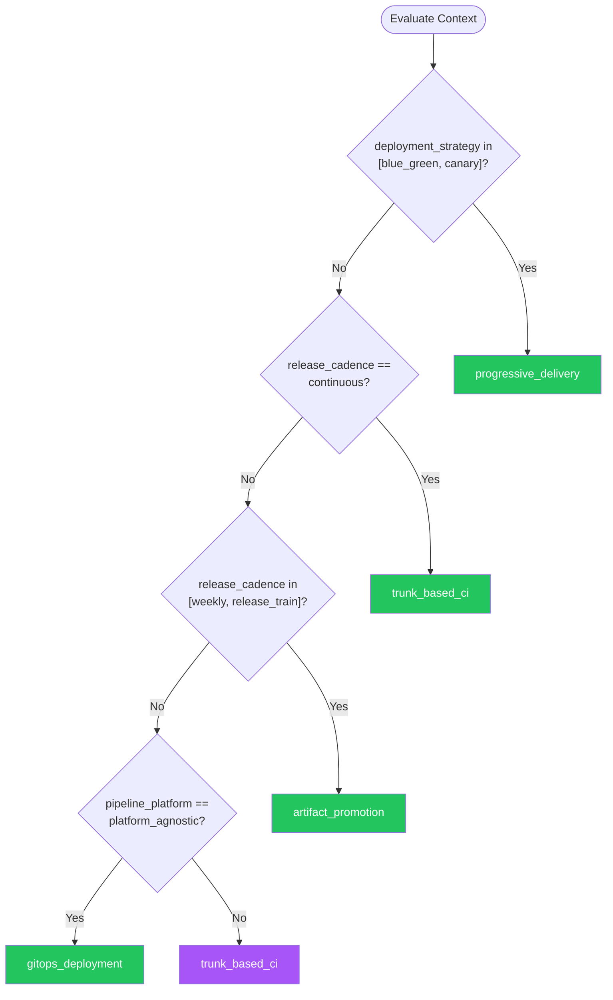

# CI/CD — Summary

**Purpose**
- Continuous integration and delivery pipelines, artifact management, and release strategies.
- Scope: pipeline design, build caching, deployment patterns (blue-green, canary, rolling), and release governance.

## Related Standards

| Standard | Relationship | Context |
|----------|-------------|---------|
| [containerization](../containerization/) | complementary | CI/CD pipelines build and push container images |
| [orchestration](../orchestration/) | complementary | CI/CD deploys to orchestration platforms |
| [infrastructure-as-code](../infrastructure-as-code/) | complementary | IaC changes applied through CI/CD pipelines |

## Context Inputs

These inputs drive the decision tree — provide them to get a tailored recommendation.

| Input | Type | Required | Default | Values | Description |
|-------|------|----------|---------|--------|-------------|
| deployment_strategy | enum | yes | rolling_update | rolling_update, blue_green, canary, recreate, feature_flags | How releases are deployed to production |
| pipeline_platform | enum | yes | github_actions | github_actions, gitlab_ci, azure_devops, jenkins, circleci, platform_agnostic | CI/CD platform in use |
| release_cadence | enum | yes | continuous | continuous, daily, weekly, release_train | How frequently releases are deployed |

## Decision Tree

### Mermaid Diagram



### Text Fallback

- **Priority 1** → `progressive_delivery` — when deployment_strategy in [blue_green, canary]. Progressive delivery gradually shifts traffic to new versions with automated analysis and rollback.
- **Priority 2** → `trunk_based_ci` — when release_cadence == continuous. Trunk-based development with automated testing enables continuous deployment — every merge to main is a release candidate.
- **Priority 3** → `artifact_promotion` — when release_cadence in [weekly, release_train]. Build once, promote the same artifact through environments. Tag artifacts for release trains.
- **Priority 4** → `gitops_deployment` — when pipeline_platform == platform_agnostic. GitOps uses Git as the single source of truth for infrastructure and application state.
- **Fallback** → `trunk_based_ci` — Trunk-based CI with automated testing is the universal safe starting point.

> **Confidence**: high | **Risk if wrong**: high

---

## Patterns

### 1. Trunk-Based CI with Automated Quality Gates

> Developers commit to main/trunk frequently (at least daily). Every commit triggers automated build, lint, test, and security scan. The pipeline enforces quality gates — broken builds block merges. This is the foundation of continuous delivery.

**Maturity**: standard

**Use when**
- Any project aiming for continuous delivery
- Teams practicing small, frequent commits
- Need fast feedback on code changes

**Avoid when**
- Extremely long-running test suites that can't be parallelized

**Tradeoffs**

| Pros | Cons |
|------|------|
| Fast feedback — broken code caught in minutes | Requires investment in test automation |
| Small changes are easier to review and debug | Feature flags needed for incomplete features on main |
| Always-releasable main branch | Flaky tests can block the entire team |
| Merge conflicts minimized | |

**Implementation Guidelines**
- Pipeline stages: lint → build → unit test → integration test → security scan → deploy
- Run tests in parallel; fail fast on first failure
- Build artifacts once, promote through environments
- Cache dependencies between builds (node_modules, .m2, pip cache)
- Branch protection: require passing CI before merge

**Common Errors**

| Error | Impact | Fix |
|-------|--------|-----|
| Running all tests sequentially | 30-minute pipeline; developers context-switch and lose focus | Parallelize test suites; split by module or feature |
| No branch protection rules | Broken code merged to main; team blocked | Require CI pass + code review before merge to main |

**Standards & References**

| Standard | Type | Role | Reference |
|----------|------|------|-----------|
| Continuous Integration (Martin Fowler) | practice | Foundational CI practice | |

---

### 2. Progressive Delivery (Canary / Blue-Green)

> Gradually shifts traffic from the old version to the new version with automated analysis at each step. Canary starts with a small percentage; blue-green switches all traffic at once. Both support instant rollback.

**Maturity**: advanced

**Use when**
- Production services requiring zero-downtime deployments
- High-traffic services where bad deploys are costly
- Need automated rollback based on error rate or latency

**Avoid when**
- Internal tools where brief downtime is acceptable
- Simple services without traffic metrics

**Tradeoffs**

| Pros | Cons |
|------|------|
| Blast radius limited to canary percentage | Requires robust monitoring and metrics |
| Automated rollback on metric degradation | Database schema changes must be backward-compatible |
| Zero-downtime for users | More complex infrastructure (two versions running simultaneously) |
| Confidence in production releases | |

**Implementation Guidelines**
- Canary: 5% → 25% → 50% → 100% with metric gates at each step
- Blue-green: deploy to inactive environment, run smoke tests, switch traffic
- Define success metrics: error rate, latency p99, business KPIs
- Automate rollback when metrics breach thresholds
- Database migrations must be backward-compatible (expand-contract pattern)

**Common Errors**

| Error | Impact | Fix |
|-------|--------|-----|
| No rollback criteria defined | Bad release progresses to 100% before anyone notices | Define automated analysis rules: error rate >1% → rollback, p99 latency >500ms → rollback |
| Breaking database schema change with canary | Old version can't read data written by new version | Use expand-contract migrations; ensure both versions work with the same schema |

**Standards & References**

| Standard | Type | Role | Reference |
|----------|------|------|-----------|
| Argo Rollouts | tool | Kubernetes-native progressive delivery controller | |

---

### 3. Artifact Promotion Pipeline

> Build the artifact once, then promote the identical artifact through environments (dev → staging → production). Environment-specific configuration applied at deploy time, not build time. Ensures what you tested is exactly what you deploy.

**Maturity**: standard

**Use when**
- Multiple environments (dev, staging, production)
- Compliance requires proving artifact identity across environments
- Want to eliminate 'works in staging but not production' issues

**Avoid when**
- Single environment deployments

**Tradeoffs**

| Pros | Cons |
|------|------|
| Exact same artifact in all environments | Configuration management complexity |
| Audit trail — artifact promoted through gates | Need robust secret management per environment |
| Configuration externalized from build | |
| Faster deploys — no rebuild per environment | |

**Implementation Guidelines**
- Build image once with commit SHA tag
- Push to artifact registry (container registry, Maven, npm)
- Deploy to dev → run smoke tests → promote to staging → run integration tests → promote to production
- Environment config via ConfigMaps, env vars, or Helm values
- Sign artifacts for supply chain security (cosign, Sigstore)

**Common Errors**

| Error | Impact | Fix |
|-------|--------|-----|
| Rebuilding for each environment | Different artifacts in each environment; 'works in staging' not guaranteed in prod | Build once, promote the same artifact; inject config at deploy time |
| No artifact signing or verification | Supply chain attack — tampered artifact deployed to production | Sign artifacts in CI; verify signatures before deployment |

**Standards & References**

| Standard | Type | Role | Reference |
|----------|------|------|-----------|
| SLSA Framework | standard | Supply chain security for build artifacts | |

---

### 4. GitOps Deployment

> Git is the single source of truth for both application and infrastructure state. Changes are made via pull requests to a GitOps repo; a controller (ArgoCD, Flux) reconciles the cluster state to match the repo.

**Maturity**: advanced

**Use when**
- Kubernetes-based deployments
- Want declarative, auditable infrastructure changes
- Multiple clusters or environments to keep in sync

**Avoid when**
- Non-Kubernetes deployments
- Team unfamiliar with Git-based workflows

**Tradeoffs**

| Pros | Cons |
|------|------|
| Full audit trail — every change is a Git commit | Secret management requires additional tooling (Sealed Secrets, SOPS) |
| Declarative — desired state in Git, controller reconciles | Learning curve for GitOps controllers |
| Drift detection — controller alerts on manual changes | Reconciliation latency (seconds to minutes) |
| Rollback is git revert | |

**Implementation Guidelines**
- Separate app repo from GitOps config repo
- CI pipeline builds and pushes image; updates GitOps repo with new tag
- ArgoCD/Flux watches GitOps repo and syncs cluster
- Use Kustomize or Helm for environment overlays
- Sealed Secrets or External Secrets Operator for encrypted secrets in Git

**Common Errors**

| Error | Impact | Fix |
|-------|--------|-----|
| Committing plain-text secrets to GitOps repo | Secrets in version control history — security breach | Use Sealed Secrets, SOPS, or External Secrets Operator |
| Single repo for app code and GitOps config | App changes trigger reconciliation; config changes trigger CI — circular | Separate repos: app repo for code + CI, config repo for GitOps state |

**Standards & References**

| Standard | Type | Role | Reference |
|----------|------|------|-----------|
| OpenGitOps Principles | standard | Community standard for GitOps practices | |

---

## Examples

### GitHub Actions CI/CD Pipeline
**Context**: Complete CI/CD pipeline for a containerized Node.js service

**Correct** implementation:
```yaml
# .github/workflows/ci-cd.yml
name: CI/CD Pipeline
on:
  push:
    branches: [main]
  pull_request:
    branches: [main]

env:
  REGISTRY: ghcr.io
  IMAGE_NAME: ${{ github.repository }}

jobs:
  lint-and-test:
    runs-on: ubuntu-latest
    steps:
      - uses: actions/checkout@v4
      - uses: actions/setup-node@v4
        with:
          node-version: 20
          cache: npm
      - run: npm ci
      - run: npm run lint
      - run: npm run test:unit -- --coverage
      - run: npm run test:integration

  security-scan:
    runs-on: ubuntu-latest
    steps:
      - uses: actions/checkout@v4
      - uses: aquasecurity/trivy-action@master
        with:
          scan-type: fs
          severity: CRITICAL,HIGH

  build-and-push:
    needs: [lint-and-test, security-scan]
    if: github.ref == 'refs/heads/main'
    runs-on: ubuntu-latest
    permissions:
      packages: write
    steps:
      - uses: actions/checkout@v4
      - uses: docker/login-action@v3
        with:
          registry: ${{ env.REGISTRY }}
          username: ${{ github.actor }}
          password: ${{ secrets.GITHUB_TOKEN }}
      - uses: docker/build-push-action@v5
        with:
          push: true
          tags: |
            ${{ env.REGISTRY }}/${{ env.IMAGE_NAME }}:${{ github.sha }}
            ${{ env.REGISTRY }}/${{ env.IMAGE_NAME }}:latest
          cache-from: type=gha
          cache-to: type=gha,mode=max

  deploy-staging:
    needs: build-and-push
    runs-on: ubuntu-latest
    environment: staging
    steps:
      - run: echo "Deploy ${{ github.sha }} to staging"

  deploy-production:
    needs: deploy-staging
    runs-on: ubuntu-latest
    environment:
      name: production
      url: https://api.example.com
    steps:
      - run: echo "Deploy ${{ github.sha }} to production"
```

**Incorrect** implementation:
```yaml
# WRONG: No caching, no security scan, deploys on every branch
name: Deploy
on: push
jobs:
  deploy:
    runs-on: ubuntu-latest
    steps:
      - uses: actions/checkout@v4
      - run: npm install
      - run: npm test
      - run: docker build -t app:latest .
      - run: docker push app:latest
      # Deploys on every push to any branch
      # No security scanning
      # No environment gates
      # Uses :latest tag
      # No dependency caching
```

**Why**: The correct version separates lint/test, security scan, build, and deploy into distinct jobs with proper dependencies. Only main branch deploys. Uses GitHub environment protection rules, build caching, and commit SHA tags. The incorrect version runs everything in one job with no gates.

---

### Artifact Promotion Through Environments
**Context**: Promoting a container image from dev to staging to production

**Correct** implementation:
```bash
# Build once (in CI)
IMAGE=registry.example.com/api:${COMMIT_SHA}
docker build -t $IMAGE .
docker push $IMAGE
cosign sign $IMAGE  # Sign for supply chain security

# Promote to staging (after dev tests pass)
# No rebuild — same image, different config
helm upgrade api-service ./chart \
  -f values.yaml \
  -f values-staging.yaml \
  --set image.tag=${COMMIT_SHA} \
  --namespace staging

# Promote to production (after staging validation)
cosign verify $IMAGE  # Verify signature before deploy
helm upgrade api-service ./chart \
  -f values.yaml \
  -f values-production.yaml \
  --set image.tag=${COMMIT_SHA} \
  --namespace production
```

**Incorrect** implementation:
```bash
# WRONG: Rebuild for each environment
# Dev build
docker build -t api:dev .
docker push api:dev

# Staging build (different artifact!)
docker build -t api:staging .
docker push api:staging

# Production build (yet another artifact!)
docker build -t api:production .
docker push api:production
# Each environment gets a DIFFERENT binary
# No guarantee staging artifact == production artifact
```

**Why**: The correct version builds once, signs the artifact, and promotes the identical image through environments with environment-specific Helm values. The incorrect version rebuilds for each environment — three different binaries with no guarantee of consistency.

---

## Security Hardening

### Transport
- All CI/CD platform connections over TLS
- Webhook secrets for pipeline triggers

### Data Protection
- Build logs do not contain secrets or credentials
- Artifacts signed for supply chain integrity

### Access Control
- Branch protection rules enforce CI pass before merge
- Environment protection rules require approvals for production
- CI/CD service accounts follow least-privilege

### Input/Output
- Pipeline inputs (PR labels, commit messages) do not control security-critical decisions

### Secrets
- Secrets stored in CI/CD platform secret store, never in code
- Secrets masked in build logs
- Rotate CI/CD service account credentials regularly

### Monitoring
- Pipeline execution logged and auditable
- Deployment events tracked with who/what/when/where

---

## Anti-Patterns

| Anti-Pattern | Severity | Description | Fix |
|-------------|----------|-------------|-----|
| Snowflake Deployments | critical | Manual deployments that differ each time. No runbook, no automation, different steps for different environments. | Automate all deployments through CI/CD pipeline; same process for every environment |
| Long-Running Feature Branches | high | Feature branches that live for weeks or months, diverging from main. Massive merge conflicts, integration pain, and delayed feedback. | Trunk-based development with feature flags; merge to main at least daily |
| No Rollback Strategy | critical | Deploying without a plan for reverting bad releases. When production breaks, team scrambles to hotfix forward under pressure. | Automated rollback in progressive delivery; or one-click redeploy of previous version |
| Build-Per-Environment | high | Rebuilding the application for each environment. Dev, staging, and production run different binaries. | Build once, promote the same artifact; inject environment config at deploy time |

---

## Checklist

| ID | Category | Description | Severity |
|----|----------|-------------|----------|
| CICD-01 | reliability | Pipeline runs on every commit to main and every PR | high |
| CICD-02 | security | Branch protection requires CI pass before merge | high |
| CICD-03 | security | Security scanning (SAST, dependency, container) in pipeline | high |
| CICD-04 | reliability | Artifacts built once, promoted through environments | high |
| CICD-05 | security | Secrets stored in platform secret store, masked in logs | critical |
| CICD-06 | reliability | Rollback strategy defined and tested | high |
| CICD-07 | performance | Pipeline uses dependency and build caching | medium |
| CICD-08 | reliability | Production deployment requires approval gate | high |
| CICD-09 | compliance | Deployment events auditable (who/what/when) | high |
| CICD-10 | reliability | Staging environment validates artifact before production | high |
| CICD-11 | security | Artifacts signed for supply chain integrity | medium |
| CICD-12 | performance | Tests parallelized for fast pipeline execution | medium |

---

## Compliance

| Standard | Relevance |
|----------|-----------|
| SLSA Framework | Supply chain security levels for software artifacts |
| DORA Metrics | Deployment frequency, lead time, failure rate, MTTR |

**Requirements Mapping**

| Control | Description | Maps To |
|---------|-------------|---------|
| build_integrity | Artifacts built in isolated, reproducible environments | SLSA Level 2 |
| deployment_audit | All deployments traceable to source commit and approver | SLSA Level 3 |

---

## Prompt Recipes

### Create CI/CD Pipeline (Greenfield)
```text
Create a CI/CD pipeline for a {language} {framework} project using {platform}:

1. **CI stage**: Lint, build, unit tests, integration tests (parallel where possible)
2. **Security stage**: Dependency scanning, container image scanning
3. **Build stage**: Build artifact/container, cache dependencies
4. **Deploy stage**: Staging with smoke tests → Production with approval gate
5. Include caching strategy for build dependencies
6. Include branch protection rules recommendation
```

### Migrate CI/CD Pipeline
```text
Migrate this CI/CD pipeline from {source_platform} to {target_platform}:

1. Map each stage to the target platform equivalent
2. Migrate secrets and environment variables
3. Convert caching mechanisms
4. Preserve deployment gates and environment protections
5. Show before/after pipeline definitions
```

### Optimize Slow CI/CD Pipeline
```text
Optimize this CI/CD pipeline — current run time is {current_time}:

1. Identify parallelizable stages
2. Add dependency caching (package managers, Docker layers)
3. Split test suites for parallel execution
4. Use incremental builds where possible
5. Cache container image layers across builds
6. Show before/after pipeline with expected time savings
```

### Harden CI/CD Pipeline Security
```text
Harden this CI/CD pipeline for security:

1. Pin action/image versions with SHA digests
2. Add SAST, DAST, and dependency scanning stages
3. Implement artifact signing (cosign/Sigstore)
4. Restrict permissions to minimum required
5. Add environment protection rules
6. Ensure secrets are masked in logs
```

---

## Links
- Full standard: [ci-cd.yaml](ci-cd.yaml)
