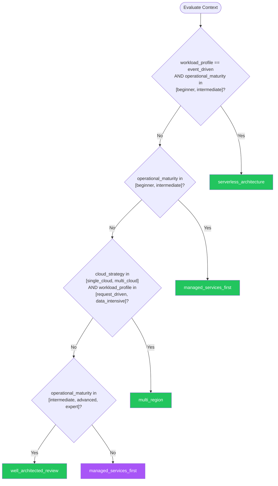

# Cloud Architecture — Summary

**Purpose**
- Cloud-native design patterns, well-architected principles, multi-cloud strategies, and managed service selection.
- Scope: architectural decisions that determine how workloads run in cloud environments — compute, storage, networking, and operational models.

## Related Standards

| Standard | Relationship | Context |
|----------|-------------|---------|
| [orchestration](../orchestration/) | complementary | Orchestration platforms are a core component of cloud architecture |
| [infrastructure-as-code](../infrastructure-as-code/) | complementary | IaC implements the cloud architecture decisions |
| [containerization](../containerization/) | complementary | Containers are a primary workload packaging for cloud |

## Context Inputs

These inputs drive the decision tree — provide them to get a tailored recommendation.

| Input | Type | Required | Default | Values | Description |
|-------|------|----------|---------|--------|-------------|
| cloud_strategy | enum | yes | single_cloud | single_cloud, multi_cloud, hybrid, cloud_agnostic | Cloud adoption strategy |
| workload_profile | enum | yes | request_driven | request_driven, event_driven, batch_processing, data_intensive, mixed | Primary workload characteristics |
| operational_maturity | enum | yes | intermediate | beginner, intermediate, advanced, expert | Team's cloud operational maturity |

## Decision Tree

### Mermaid Diagram



### Text Fallback

- **Priority 1** → `serverless_architecture` — when workload_profile == event_driven AND operational_maturity in [beginner, intermediate]. Serverless minimizes operational overhead for event-driven workloads.
- **Priority 2** → `managed_services_first` — when operational_maturity in [beginner, intermediate]. Use managed services to offload operational complexity.
- **Priority 3** → `multi_region` — when cloud_strategy in [single_cloud, multi_cloud] AND workload_profile in [request_driven, data_intensive]. Multi-region provides disaster recovery and global latency reduction.
- **Priority 4** → `well_architected_review` — when operational_maturity in [intermediate, advanced, expert]. Evaluate workloads against the pillars: reliability, security, cost, performance, operations, sustainability.
- **Fallback** → `managed_services_first` — Start with managed services — optimize later.

> **Confidence**: high | **Risk if wrong**: high

---

## Patterns

### 1. Managed Services First

> Default to cloud-managed services (databases, queues, caches, compute) instead of self-managing open-source alternatives. Trade flexibility for reduced operational burden. Self-manage only when managed services demonstrably cannot meet requirements.

**Maturity**: standard

**Use when**
- Team wants to focus on application logic, not infrastructure
- Operational maturity is growing
- Standard workloads without exotic requirements
- Want built-in HA, backups, and monitoring

**Avoid when**
- Need to avoid vendor lock-in at all costs
- Managed service doesn't support required feature
- Cost at scale exceeds self-managed alternative significantly

**Tradeoffs**

| Pros | Cons |
|------|------|
| Dramatically reduced operational burden | Vendor lock-in for specific services |
| Built-in HA, backups, patching, monitoring | Cost may exceed self-managed at very large scale |
| Cloud provider SLAs for availability | Less control over configuration and behavior |
| Focus engineering effort on business value | Feature availability depends on cloud provider roadmap |

**Implementation Guidelines**
- Evaluate managed service first; self-manage only with documented justification
- Wrap cloud-specific services behind interfaces for portability
- Use cloud-native IAM for service-to-service authentication
- Enable all available monitoring and alerting
- Review cost regularly — managed services can surprise at scale

**Common Errors**

| Error | Impact | Fix |
|-------|--------|-----|
| Self-managing Postgres/Redis/Kafka without dedicated ops team | Data loss, missed backups, security patches delayed, outages | Use RDS/ElastiCache/MSK — managed services handle operations |
| Using managed service without understanding billing model | Unexpected cloud bill — often 5-10x expected | Model costs before provisioning; set billing alerts; review monthly |

**Standards & References**

| Standard | Type | Role | Reference |
|----------|------|------|-----------|
| Cloud Provider Well-Architected Frameworks | framework | Provider-specific guidance for cloud workloads | |

---

### 2. Serverless Architecture

> Event-driven compute without server management. Functions as a Service (Lambda, Cloud Functions, Azure Functions) scale automatically from zero to peak. Combined with managed services for storage, queues, and APIs to build fully serverless applications.

**Maturity**: standard

**Use when**
- Event-driven workloads (API Gateway → Lambda → DynamoDB)
- Unpredictable or spiky traffic patterns
- Want zero infrastructure management
- Cost optimization for intermittent workloads

**Avoid when**
- Long-running processes (>15 minutes)
- Workloads requiring persistent connections (WebSocket servers)
- Latency-sensitive workloads where cold starts are unacceptable
- High-throughput steady-state workloads (containers cheaper)

**Tradeoffs**

| Pros | Cons |
|------|------|
| Zero server management — no patching, scaling, or capacity planning | Cold start latency (100ms–10s depending on runtime) |
| Scale to zero — pay nothing when idle | Vendor lock-in to cloud provider's FaaS platform |
| Automatic scaling to handle any traffic spike | Debugging distributed serverless systems is harder |
| Fast time-to-market for event-driven features | Maximum execution duration limits |

**Implementation Guidelines**
- One function per responsibility (SRP applies to functions)
- Keep functions stateless — state in managed storage
- Use provisioned concurrency for latency-sensitive functions
- Bundle only required dependencies to minimize cold start
- Structured logging with correlation IDs across function invocations

**Common Errors**

| Error | Impact | Fix |
|-------|--------|-----|
| Monolithic Lambda function handling all routes | Large package size, slow cold starts, tight coupling | One function per API route or event type; use API Gateway routing |
| Not accounting for cold start latency | User-facing latency spikes; SLA violations | Use provisioned concurrency for critical paths; or use containers for steady-state |

**Standards & References**

| Standard | Type | Role | Reference |
|----------|------|------|-----------|
| Serverless Framework / SAM | tool | Serverless application deployment frameworks | |

---

### 3. Multi-Region Architecture

> Deploy workloads across multiple geographic regions for disaster recovery, lower latency for global users, and regulatory compliance (data residency). Active-active for maximum availability; active-passive for cost efficiency.

**Maturity**: advanced

**Use when**
- RPO/RTO requirements demand cross-region failover
- Global user base needing low latency
- Data residency requirements (GDPR, data sovereignty)
- SLA requires >99.99% availability

**Avoid when**
- Single-region availability meets SLA requirements
- Data synchronization complexity exceeds the benefit
- Budget doesn't support multi-region cost (2x+ infrastructure)

**Tradeoffs**

| Pros | Cons |
|------|------|
| Disaster recovery with minimal RPO/RTO | 2x+ infrastructure cost |
| Lower latency for global users | Data consistency challenges (CAP theorem) |
| Compliance with data residency regulations | Significant operational complexity |
| Survive entire region failure | Testing failover scenarios is difficult |

**Implementation Guidelines**
- Active-passive: secondary region on standby, failover on primary failure
- Active-active: both regions serve traffic, data replicated
- Use global load balancers (Route 53, Azure Front Door, Cloud DNS)
- Database replication strategy: async for performance, sync for consistency
- Test failover regularly — untested DR is not DR

**Common Errors**

| Error | Impact | Fix |
|-------|--------|-----|
| Multi-region without testing failover | DR doesn't work when you need it; false confidence | Regular chaos engineering / failover drills; automate failover testing |
| Synchronous cross-region replication for all data | Every write incurs cross-region latency (100ms+); throughput drops | Async replication for most data; sync only for critical consistency needs |

**Standards & References**

| Standard | Type | Role | Reference |
|----------|------|------|-----------|
| Cloud Provider Multi-Region Documentation | reference | Provider-specific multi-region guidance | |

---

### 4. Well-Architected Review

> Systematic evaluation of cloud workloads against the six pillars: operational excellence, security, reliability, performance efficiency, cost optimization, and sustainability. Identifies risks and improvement opportunities using the cloud provider's well-architected framework.

**Maturity**: standard

**Use when**
- New workload going to production — pre-launch review
- Annual review of existing production workloads
- Post-incident review to prevent recurrence
- Before major architecture changes

**Avoid when**
- Prototype or proof-of-concept (review before promoting to production)

**Tradeoffs**

| Pros | Cons |
|------|------|
| Systematic risk identification across all pillars | Time investment for thorough review |
| Cloud provider tooling to automate assessment | May surface more issues than team can address immediately |
| Documented improvement plan with priorities | |
| Industry-standard framework for architecture quality | |

**Implementation Guidelines**
- Use cloud provider WAR tool (AWS Well-Architected Tool, Azure Advisor)
- Review each pillar: operations, security, reliability, performance, cost, sustainability
- Prioritize findings by risk level and business impact
- Create improvement backlog and track remediation
- Schedule regular reviews (annually or after major changes)

**Common Errors**

| Error | Impact | Fix |
|-------|--------|-----|
| One-time review with no follow-up | Findings not addressed; architecture degrades over time | Create backlog from findings; schedule quarterly review cadence |
| Reviewing only security pillar, ignoring others | Cost overruns, reliability issues, performance problems | Review all six pillars; each addresses different failure modes |

**Standards & References**

| Standard | Type | Role | Reference |
|----------|------|------|-----------|
| AWS Well-Architected Framework | framework | Cloud architecture evaluation framework | |

---

## Examples

### Managed Services First — Web Application Stack
**Context**: Choosing between self-managed and managed services for a typical web app

**Correct** implementation:
```hcl
# Architecture using managed services
# Compute:    ECS Fargate (serverless containers)
# Database:   RDS PostgreSQL (managed, multi-AZ, automated backups)
# Cache:      ElastiCache Redis (managed, automatic failover)
# Queue:      SQS (fully managed, no broker to operate)
# Storage:    S3 (fully managed object storage)
# CDN:        CloudFront (global edge caching)
# Monitoring: CloudWatch + X-Ray (built-in)

# Terraform example:
module "database" {
  source = "./modules/rds"
  engine         = "postgres"
  engine_version = "16"
  instance_class = "db.r6g.large"
  multi_az       = true
  backup_retention_period = 7
  storage_encrypted = true
  deletion_protection = true
}

module "cache" {
  source = "./modules/elasticache"
  engine               = "redis"
  node_type            = "cache.r6g.large"
  automatic_failover   = true
  at_rest_encryption   = true
  transit_encryption   = true
}

# Total ops overhead: near zero — cloud provider handles HA, backups, patching
```

**Incorrect** implementation:
```text
# WRONG: Self-managing everything on EC2
# Compute:    EC2 instances (patch OS, manage scaling groups)
# Database:   PostgreSQL on EC2 (manage replication, backups, failover)
# Cache:      Redis on EC2 (manage cluster, persistence, failover)
# Queue:      RabbitMQ on EC2 (manage cluster, persistence, monitoring)
# Storage:    NFS on EC2 (manage storage, backups)

# Total ops overhead: 3+ full-time ops engineers
# Risk: missed backups, delayed security patches, manual failover
```

**Why**: The correct version uses managed services — RDS, ElastiCache, SQS, S3 — where the cloud provider handles HA, backups, patching, and monitoring. The incorrect version self-manages everything on EC2, requiring significant operational investment for the same functionality.

---

### Serverless Event-Driven Architecture
**Context**: Order processing pipeline using serverless components

**Correct** implementation:
```yaml
# Event-driven order processing — fully serverless
# 1. API Gateway receives order → triggers Lambda
# 2. Lambda validates and writes to DynamoDB
# 3. DynamoDB Stream triggers processing Lambda
# 4. Processing Lambda sends to SQS for async work
# 5. SQS triggers notification Lambda
# 6. Step Functions orchestrates complex multi-step workflows

# SAM template (sam-template.yaml)
Resources:
  OrderApi:
    Type: AWS::Serverless::Api
    Properties:
      StageName: prod

  CreateOrderFunction:
    Type: AWS::Serverless::Function
    Properties:
      Handler: src/create-order.handler
      Runtime: nodejs20.x
      MemorySize: 256
      Timeout: 10
      Events:
        PostOrder:
          Type: Api
          Properties:
            Path: /orders
            Method: post
            RestApiId: !Ref OrderApi
      Policies:
        - DynamoDBCrudPolicy:
            TableName: !Ref OrdersTable

  OrdersTable:
    Type: AWS::DynamoDB::Table
    Properties:
      BillingMode: PAY_PER_REQUEST
      StreamSpecification:
        StreamViewType: NEW_AND_OLD_IMAGES
```

**Incorrect** implementation:
```yaml
# WRONG: Monolithic Lambda doing everything
Resources:
  MonolithFunction:
    Type: AWS::Serverless::Function
    Properties:
      Handler: src/monolith.handler
      Runtime: nodejs20.x
      MemorySize: 3008  # Max memory — why?
      Timeout: 900      # Max timeout — doing too much
      Events:
        AnyRequest:
          Type: Api
          Properties:
            Path: /{proxy+}
            Method: ANY
      Policies:
        - AdministratorAccess  # Over-permissioned
# One function handles all routes, all logic
# Slow cold starts, impossible to scale individual features
```

**Why**: The correct version uses purpose-built serverless components — each Lambda has one responsibility, DynamoDB Streams drive event processing, and permissions are scoped. The incorrect version is a monolithic Lambda with max resources and admin access.

---

## Security Hardening

### Transport
- All cloud service endpoints accessed over TLS
- VPC endpoints for private access to cloud services

### Data Protection
- Encryption at rest enabled for all data stores
- Encryption in transit for all service-to-service communication

### Access Control
- Cloud IAM with least-privilege policies
- Service accounts with scoped permissions per workload
- No use of root/admin accounts for workloads

### Input/Output
- API Gateway with request validation and throttling
- WAF for public-facing endpoints

### Secrets
- Cloud secret managers (Secrets Manager, Key Vault) for all credentials
- Automatic secret rotation configured

### Monitoring
- Cloud-native monitoring and alerting enabled
- CloudTrail / Azure Activity Log / GCP Audit Logs enabled

---

## Anti-Patterns

| Anti-Pattern | Severity | Description | Fix |
|-------------|----------|-------------|-----|
| Lift and Shift Everything | high | Moving on-premises VMs directly to cloud IaaS without leveraging cloud-native services. Pays cloud prices for on-premises architecture. | Re-platform to managed services; reserve lift-and-shift for legacy systems with migration deadlines |
| Over-Provisioned Resources | high | Provisioning large instances 'just in case' instead of right-sizing based on actual usage. Cloud bills 3-10x what they should be. | Monitor actual usage; right-size instances; use auto-scaling for variable workloads |
| No Disaster Recovery Plan | critical | Production workloads running in a single availability zone or region with no failover plan. | Multi-AZ at minimum; multi-region for critical workloads; test failover regularly |
| Serverless for Everything | medium | Using Lambda/Functions for steady-state high-throughput workloads where containers would be cheaper and more efficient. | Use serverless for event-driven and bursty workloads; containers for steady-state |

---

## Checklist

| ID | Category | Description | Severity |
|----|----------|-------------|----------|
| CLD-01 | design | Managed services used by default — self-manage with justification only | high |
| CLD-02 | security | IAM policies follow least-privilege per service | critical |
| CLD-03 | reliability | Workloads deployed across multiple availability zones | high |
| CLD-04 | reliability | Backup and restore procedures defined and tested | high |
| CLD-05 | security | Encryption at rest and in transit for all data | critical |
| CLD-06 | performance | Compute resources right-sized based on actual usage | medium |
| CLD-07 | observability | Cloud-native monitoring, logging, and alerting enabled | high |
| CLD-08 | design | Serverless used for event-driven; containers for steady-state | medium |
| CLD-09 | compliance | Well-architected review completed before production launch | high |
| CLD-10 | security | VPC endpoints for private access to cloud services | high |
| CLD-11 | reliability | Auto-scaling configured for variable workloads | medium |
| CLD-12 | performance | CDN and caching layers deployed for public-facing content | medium |

---

## Compliance

| Standard | Relevance |
|----------|-----------|
| AWS Well-Architected Framework | Six-pillar framework for cloud architecture quality |
| Azure Well-Architected Framework | Microsoft's cloud architecture best practices |
| GCP Architecture Framework | Google's cloud architecture guidance |

**Requirements Mapping**

| Control | Description | Maps To |
|---------|-------------|---------|
| well_architected_review | Workloads reviewed against well-architected pillars before production | Cloud Provider WAR Programs |
| cost_optimization | Resources right-sized and unused resources cleaned up | FinOps Foundation Standards |

---

## Prompt Recipes

### Design Cloud Architecture (Greenfield)
```text
Design {cloud_provider} architecture for: {workload_description}

1. Choose compute model: containers, serverless, or VMs (justify choice)
2. Choose data stores: managed database, cache, object storage
3. Design networking: VPC, subnets, security groups, load balancers
4. Define IAM: service accounts, roles, least-privilege policies
5. Plan monitoring: metrics, logs, traces, alerts
6. Estimate monthly cost range
7. Provide IaC (Terraform/Bicep) for the architecture
```

### Well-Architected Review (Audit)
```text
Perform a well-architected review of this {cloud_provider} workload:

1. **Operational Excellence**: Automated? Observable? Runbooks?
2. **Security**: IAM least-privilege? Encryption? WAF? Logging?
3. **Reliability**: Multi-AZ? Backups? Auto-scaling? DR plan?
4. **Performance**: Right-sized? Caching? CDN? Database indexing?
5. **Cost**: Reserved/savings plans? Right-sized? Unused resources?
6. **Sustainability**: Efficient compute? Right region?

Prioritize findings by risk and provide remediation plan.
```

### Cloud Migration
```text
Migrate this on-premises workload to {cloud_provider}:

1. Assess current architecture and dependencies
2. Choose migration strategy: lift-and-shift, re-platform, or re-architect
3. Map on-premises services to cloud equivalents
4. Plan data migration with minimal downtime
5. Design cloud networking (VPN/Direct Connect for hybrid)
6. Create IaC for target architecture
7. Define cutover plan and rollback procedure
```

### Cloud Cost Optimization
```text
Optimize cloud costs for this {cloud_provider} workload:

1. Identify unused/underutilized resources
2. Right-size compute instances based on actual usage
3. Evaluate reserved instances / savings plans
4. Use spot/preemptible instances for fault-tolerant workloads
5. Optimize data transfer costs
6. Review storage tiers and lifecycle policies
7. Show before/after monthly cost estimate
```

---

## Links
- Full standard: [cloud-architecture.yaml](cloud-architecture.yaml)
