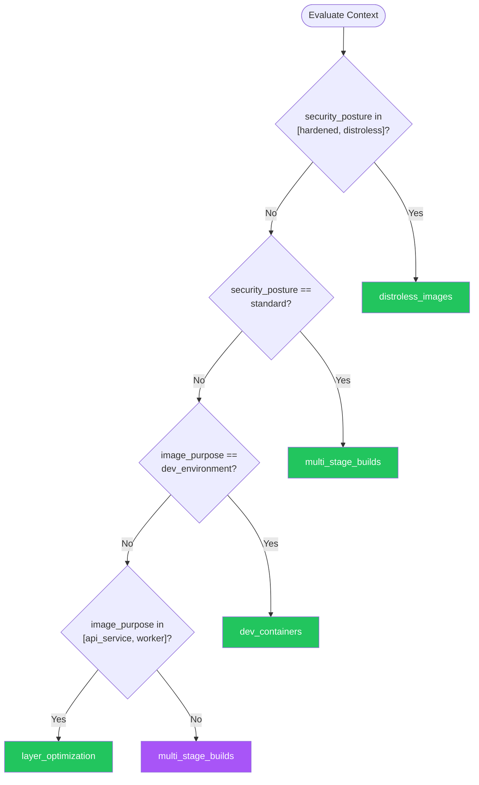

# Containerization — Summary

**Purpose**
- Container image construction, runtime configuration, and security hardening.
- Scope: Dockerfile best practices, multi-stage builds, image scanning, and production-ready container configurations for AI-assisted development.

## Related Standards

| Standard | Relationship | Context |
|----------|-------------|---------|
| [orchestration](../orchestration/) | complementary | Orchestration platforms consume container images produced by containerization standards |
| [ci-cd](../ci-cd/) | complementary | CI/CD pipelines build and push container images |

## Context Inputs

These inputs drive the decision tree — provide them to get a tailored recommendation.

| Input | Type | Required | Default | Values | Description |
|-------|------|----------|---------|--------|-------------|
| runtime_language | enum | yes | node | node, python, java, dotnet, go, rust, ruby, php, multi | Primary language/runtime for the container |
| image_purpose | enum | yes | api_service | api_service, worker, batch_job, static_site, database, dev_environment | What the container image is used for |
| security_posture | enum | yes | standard | minimal, standard, hardened, distroless | Security requirements for the container |

## Decision Tree

### Mermaid Diagram



### Text Fallback

- **Priority 1** → `distroless_images` — when security_posture in [hardened, distroless]. Distroless or scratch-based images minimize attack surface. No shell, no package manager, no unnecessary binaries.
- **Priority 2** → `multi_stage_builds` — when security_posture == standard. Multi-stage builds are the default for production containers.
- **Priority 3** → `dev_containers` — when image_purpose == dev_environment. Dev containers standardize development environments with all tools and extensions pre-configured.
- **Priority 4** → `layer_optimization` — when image_purpose in [api_service, worker]. Optimize layer ordering for build cache efficiency.
- **Fallback** → `multi_stage_builds` — Multi-stage builds are safe default for any container workload.

> **Confidence**: high | **Risk if wrong**: medium

---

## Patterns

### 1. Multi-Stage Builds

> Separate build dependencies from runtime using multiple FROM statements. The final stage contains only the application and its runtime dependencies, dramatically reducing image size and attack surface.

**Maturity**: standard

**Use when**
- Any production container image
- Compiled languages (Go, Java, .NET, Rust)
- Frontend apps needing build toolchains
- Want to reduce image size without sacrificing build capabilities

**Avoid when**
- Trivial scripts that don't need build tools

**Tradeoffs**

| Pros | Cons |
|------|------|
| Final image contains only runtime — no compilers, dev dependencies | More complex Dockerfiles |
| Build cache shared across stages | Debugging requires separate debug stage or overrides |
| Smaller images = faster pulls and deploys | |
| Reduced attack surface — no build tools in production | |

**Implementation Guidelines**
- First stage: full SDK/build tools, compile/build application
- Final stage: slim runtime image, COPY --from=build only artifacts
- Pin base image versions with SHA digests for reproducibility
- Use .dockerignore to exclude unnecessary context
- Order COPY commands from least-changing (deps) to most-changing (source)

**Common Errors**

| Error | Impact | Fix |
|-------|--------|-----|
| Copying entire build context into final stage | Image contains build tools and source code; large and insecure | COPY --from=build only the compiled artifact and runtime configs |
| Not pinning base image versions | Builds break when base image updates; non-reproducible | Use image@sha256:digest or specific version tags, never :latest in production |

**Standards & References**

| Standard | Type | Role | Reference |
|----------|------|------|-----------|
| Docker Multi-Stage Build Documentation | practice | Official Docker guidance for multi-stage patterns | |

---

### 2. Distroless / Minimal Base Images

> Use distroless, scratch, or Alpine-based images that contain only the application and its runtime. No shell, no package manager, no OS utilities. Minimizes CVE exposure and reduces image size.

**Maturity**: advanced

**Use when**
- High-security environments
- Compliance requires minimal attack surface
- Statically compiled binaries (Go, Rust)
- JVM or .NET runtime containers

**Avoid when**
- Need shell access for debugging in production
- Application requires OS-level utilities

**Tradeoffs**

| Pros | Cons |
|------|------|
| Minimal CVE surface — no unnecessary packages | No shell for debugging — must use debug sidecars or ephemeral containers |
| Very small images (often <50MB) | Must statically link or include all runtime dependencies |
| No shell access eliminates a class of attacks | More complex troubleshooting in production |
| Passes CIS Docker benchmarks easily | |

**Implementation Guidelines**
- Go/Rust: Build statically, use FROM scratch
- Java: Use gcr.io/distroless/java or eclipse-temurin slim
- .NET: Use mcr.microsoft.com/dotnet/runtime-deps
- Node: Use distroless/nodejs or Alpine with apk --no-cache
- Always run as non-root USER

**Common Errors**

| Error | Impact | Fix |
|-------|--------|-----|
| Using distroless but running as root | Non-root constraint is the other half of hardening | Add USER nonroot:nonroot or use the distroless nonroot variant |
| Missing required shared libraries in distroless | Application crashes at startup with missing .so errors | Use ldd to identify dependencies; include them in the build stage |

**Standards & References**

| Standard | Type | Role | Reference |
|----------|------|------|-----------|
| Google Distroless Images | practice | Minimal container images for production | |

---

### 3. Layer Caching & Optimization

> Structure Dockerfile instructions to maximize build cache efficiency. Least-changing layers first (OS packages, dependencies), most-changing layers last (application code). Each instruction creates a layer; minimize layer count while preserving cache boundaries.

**Maturity**: standard

**Use when**
- CI/CD builds where speed matters
- Large dependency trees (node_modules, pip packages)
- Frequent rebuilds during development

**Avoid when**
- Single-file applications with no dependencies

**Tradeoffs**

| Pros | Cons |
|------|------|
| Faster rebuilds — only changed layers rebuilt | Must be intentional about instruction ordering |
| CI/CD pipelines benefit from cached dependency layers | Some operations (apt-get) must be combined to avoid stale caches |
| Smaller push deltas to registries | |

**Implementation Guidelines**
- COPY package.json/requirements.txt BEFORE source code
- RUN dependency install BEFORE COPY source
- Combine apt-get update && apt-get install in one RUN
- Use --mount=type=cache for package manager caches (BuildKit)
- Group related RUN commands with && and backslash continuations

**Common Errors**

| Error | Impact | Fix |
|-------|--------|-----|
| COPY . . before dependency install | Any source change invalidates dependency cache; full rebuild every time | Copy only dependency manifests first, install, then copy source |
| Separate RUN apt-get update and RUN apt-get install | Stale package index cached; install may fail or get old versions | Combine: RUN apt-get update && apt-get install -y --no-install-recommends pkg |

**Standards & References**

| Standard | Type | Role | Reference |
|----------|------|------|-----------|
| Docker BuildKit Cache Mounts | practice | Advanced caching for faster builds | |

---

### 4. Dev Containers

> Standardized development environments using the Dev Containers specification. Defines tools, extensions, settings, and services in a devcontainer.json file that works across VS Code, GitHub Codespaces, and other IDEs.

**Maturity**: standard

**Use when**
- Team needs consistent development environments
- Onboarding new developers quickly
- Complex local setup with multiple services
- Using GitHub Codespaces or remote development

**Avoid when**
- Solo developer with simple local setup
- Team prefers native development environment

**Tradeoffs**

| Pros | Cons |
|------|------|
| Consistent environment across team — no 'works on my machine' | Requires Docker or compatible runtime |
| New developer productive in minutes, not hours | Performance overhead on some platforms |
| Environment as code — versioned alongside the application | IDE-specific features may not work identically everywhere |
| Supports GPU, Docker-in-Docker, and complex topologies | |

**Implementation Guidelines**
- Define devcontainer.json in .devcontainer/ directory
- Use official base images from mcr.microsoft.com/devcontainers
- Include all required extensions and settings
- Use docker-compose.yml for multi-service development (database, cache)
- Pin tool versions for reproducibility

**Common Errors**

| Error | Impact | Fix |
|-------|--------|-----|
| Dev container with excessive tools installed | Slow build, large image, long startup time | Include only tools needed for development; use features for optional tools |
| Not persisting data volumes between rebuilds | Database data lost every time container rebuilds | Use named volumes for databases and caches in docker-compose |

**Standards & References**

| Standard | Type | Role | Reference |
|----------|------|------|-----------|
| Dev Containers Specification | standard | Open standard for development containers | |

---

## Examples

### Multi-Stage Build — Node.js API
**Context**: Production Node.js API container with minimal runtime image

**Correct** implementation:
```dockerfile
# Stage 1: Build
FROM node:20-alpine AS build
WORKDIR /app
COPY package.json package-lock.json ./
RUN npm ci --production=false
COPY src/ src/
COPY tsconfig.json ./
RUN npm run build
RUN npm prune --production

# Stage 2: Runtime (minimal)
FROM node:20-alpine AS runtime
RUN addgroup -S app && adduser -S app -G app
WORKDIR /app
COPY --from=build --chown=app:app /app/dist ./dist
COPY --from=build --chown=app:app /app/node_modules ./node_modules
COPY --from=build --chown=app:app /app/package.json ./
USER app
EXPOSE 3000
HEALTHCHECK --interval=30s --timeout=3s CMD wget -qO- http://localhost:3000/health || exit 1
CMD ["node", "dist/index.js"]
```

**Incorrect** implementation:
```dockerfile
# WRONG: Single stage, runs as root, no health check
FROM node:20
WORKDIR /app
COPY . .
RUN npm install
RUN npm run build
EXPOSE 3000
CMD ["node", "dist/index.js"]
# Problems:
#   - Full node image (900MB+ vs 150MB)
#   - Dev dependencies in production
#   - Runs as root
#   - .dockerignore likely missing (copies .git, node_modules)
#   - No health check
#   - Source code in production image
```

**Why**: The correct version uses multi-stage build to separate build tools from runtime, runs as non-root user, includes health check, and only copies production artifacts. The incorrect version ships everything including dev dependencies and source code, runs as root, and uses the full 1GB+ Node image.

---

### Layer Optimization — Python Application
**Context**: Python FastAPI application with optimized layer caching

**Correct** implementation:
```dockerfile
FROM python:3.12-slim AS base
# System deps change rarely — cached layer
RUN apt-get update && apt-get install -y --no-install-recommends \
    libpq-dev \
    && rm -rf /var/lib/apt/lists/*

# Dependencies change occasionally — cached layer
COPY requirements.txt .
RUN pip install --no-cache-dir -r requirements.txt

# Source changes frequently — rebuilt layer
COPY src/ /app/src/
WORKDIR /app
RUN adduser --system --no-create-home app
USER app
CMD ["uvicorn", "src.main:app", "--host", "0.0.0.0", "--port", "8000"]
```

**Incorrect** implementation:
```dockerfile
# WRONG: Source copied before dependencies
FROM python:3.12
COPY . /app
WORKDIR /app
RUN pip install -r requirements.txt
CMD ["uvicorn", "src.main:app", "--host", "0.0.0.0", "--port", "8000"]
# Problems:
#   - Any source change invalidates pip cache
#   - Full python image (1GB+) instead of slim
#   - apt cache not cleaned
#   - Runs as root
```

**Why**: The correct version copies requirements.txt first, installs dependencies, then copies source code — so dependency layer is cached across source changes. Uses slim base, cleans apt cache, and runs as non-root.

---

## Security Hardening

### Transport
- Container health checks verify TLS endpoints where applicable

### Data Protection
- No secrets baked into images — use runtime injection via env vars or mounted secrets
- Multi-stage builds ensure source code and build artifacts excluded from runtime image

### Access Control
- All containers run as non-root USER
- Read-only root filesystem where possible (--read-only flag)
- Drop all capabilities, add back only what's needed (--cap-drop=ALL)

### Input/Output
- Container entrypoint validates required environment variables at startup

### Secrets
- Never COPY secrets into image layers — use BuildKit --mount=type=secret
- Use orchestrator secret management (Kubernetes Secrets, Docker Secrets)

### Monitoring
- HEALTHCHECK instruction in every Dockerfile
- Container logs written to stdout/stderr for log aggregation
- Image scanning (Trivy, Snyk) integrated into CI pipeline

---

## Anti-Patterns

| Anti-Pattern | Severity | Description | Fix |
|-------------|----------|-------------|-----|
| Fat Images | high | Using full OS base images (ubuntu:latest, node:20) with development tools, compilers, and unnecessary packages in production. Results in 1GB+ images with hundreds of CVEs. | Use multi-stage builds with slim/alpine/distroless runtime stage |
| Secrets in Image Layers | critical | Copying API keys, passwords, or certificates into the image via COPY or ENV. Even if deleted in a later layer, secrets persist in earlier layers. | Use BuildKit --mount=type=secret for build-time secrets; runtime secrets via env vars or mounted volumes |
| Running as Root | critical | Container processes running as UID 0 (root). A container escape vulnerability becomes a host root compromise. | Add USER directive with non-root user; use --cap-drop=ALL and add only needed capabilities |
| Cache-Busting Layer Order | medium | Copying entire application source before installing dependencies, causing dependency layer to rebuild on every source change. | Copy dependency manifests first, install, then copy source code |

---

## Checklist

| ID | Category | Description | Severity |
|----|----------|-------------|----------|
| CTR-01 | security | Container runs as non-root USER | critical |
| CTR-02 | security | No secrets baked into image layers | critical |
| CTR-03 | performance | Multi-stage build separates build and runtime | high |
| CTR-04 | performance | Layer ordering optimized for cache efficiency | medium |
| CTR-05 | security | Base image versions pinned (no :latest) | high |
| CTR-06 | reliability | HEALTHCHECK instruction defined | high |
| CTR-07 | security | Image scanned for CVEs in CI pipeline | high |
| CTR-08 | observability | Application logs to stdout/stderr | medium |
| CTR-09 | security | .dockerignore excludes secrets, .git, node_modules, build artifacts | medium |
| CTR-10 | maintainability | Dockerfile uses multi-stage with named stages for clarity | low |
| CTR-11 | security | Minimal capabilities — CAP_DROP ALL with explicit adds | high |
| CTR-12 | reliability | Container handles SIGTERM gracefully for zero-downtime deploys | medium |

---

## Compliance

| Standard | Relevance |
|----------|-----------|
| CIS Docker Benchmark | Industry standard for Docker security configuration |
| NIST SP 800-190 | Application container security guide |
| OCI Image Specification | Open standard for container image format |

**Requirements Mapping**

| Control | Description | Maps To |
|---------|-------------|---------|
| non_root_containers | All containers must run as non-root user | CIS Docker Benchmark 4.1 |
| image_scanning | All images scanned for vulnerabilities before deployment | NIST SP 800-190 Section 3 |

---

## Prompt Recipes

### Create Production-Ready Dockerfile (Greenfield)
```text
Create a production-ready Dockerfile for a {language} {framework} application:

1. Use multi-stage build (build stage + runtime stage)
2. Pin base image versions (no :latest)
3. Optimize layer ordering for cache efficiency
4. Run as non-root user
5. Include HEALTHCHECK instruction
6. Use .dockerignore to exclude unnecessary files
7. Apply security hardening (minimal base, no secrets in image)

Show the Dockerfile and .dockerignore file.
```

### Audit Existing Dockerfile
```text
Audit this Dockerfile for production readiness:

1. **Security**: Running as root? Secrets in image? Unnecessary packages?
2. **Size**: Multi-stage build used? Minimal base image? Layer count?
3. **Caching**: Layer order optimized? Dependencies before source?
4. **Health**: HEALTHCHECK defined? Proper signal handling?
5. **Reproducibility**: Pinned versions? .dockerignore present?

Rate each area and provide specific fixes.
```

### Optimize Container Image (Optimization)
```text
Optimize this container image for size and build speed:

1. Switch to multi-stage build if not already
2. Use slim/alpine/distroless base image
3. Optimize layer ordering for cache hits
4. Use BuildKit cache mounts for package managers
5. Remove unnecessary files and clean package caches
6. Show before/after image size comparison
```

### Harden Container for High-Security
```text
Harden this container image for a high-security environment:

1. Switch to distroless or scratch base image
2. Run as non-root with minimal capabilities (--cap-drop=ALL)
3. Read-only root filesystem
4. No shell access in final image
5. Image scanning with zero critical/high CVEs
6. Signed images with cosign/notation
7. Show the hardened Dockerfile and runtime flags
```

---

## Links
- Full standard: [containerization.yaml](containerization.yaml)
