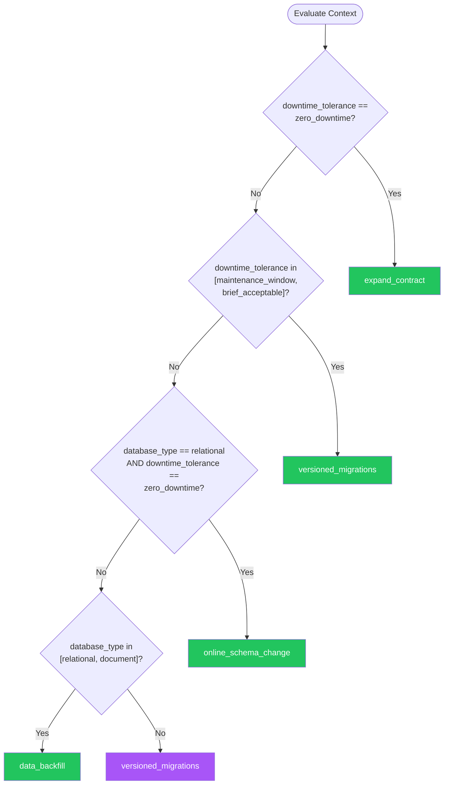

# Database Migration — Summary

**Purpose**
- Schema evolution, data migration strategies, and zero-downtime database changes.
- Scope: migration tooling, expand-contract pattern, backward-compatible changes, and rollback strategies for production databases.

## Related Standards

| Standard | Relationship | Context |
|----------|-------------|---------|
| [data-persistence](../../foundational/data-persistence/) | complementary | Database migrations manage the evolution of data persistence schemas |
| [ci-cd](../ci-cd/) | complementary | Database migrations integrated into CI/CD deployment pipelines |

## Context Inputs

These inputs drive the decision tree — provide them to get a tailored recommendation.

| Input | Type | Required | Default | Values | Description |
|-------|------|----------|---------|--------|-------------|
| downtime_tolerance | enum | yes | zero_downtime | zero_downtime, maintenance_window, brief_acceptable | How much downtime is acceptable during schema changes |
| migration_tool | enum | yes | tool_agnostic | flyway, liquibase, alembic, prisma, knex, django_migrations, ef_core, tool_agnostic | Database migration tool in use |
| database_type | enum | yes | relational | relational, document, graph, key_value, multi_model | Type of database being migrated |

## Decision Tree

### Mermaid Diagram



### Text Fallback

- **Priority 1** → `expand_contract` — when downtime_tolerance == zero_downtime. Expand-contract (parallel change) pattern enables zero-downtime schema changes by deploying additive changes first, migrating consumers, then cleaning up.
- **Priority 2** → `versioned_migrations` — when downtime_tolerance in [maintenance_window, brief_acceptable]. Versioned, sequential migrations are the safe default.
- **Priority 3** → `online_schema_change` — when database_type == relational AND downtime_tolerance == zero_downtime. Online schema change tools modify large tables without locking.
- **Priority 4** → `data_backfill` — when database_type in [relational, document]. Data backfill migrates existing data to match the new schema. Must be idempotent and resumable.
- **Fallback** → `versioned_migrations` — Versioned sequential migrations are the safe universal starting point.

> **Confidence**: high | **Risk if wrong**: critical

---

## Patterns

### 1. Versioned Sequential Migrations

> Each schema change is a numbered migration file applied in order. Forward-only by default; rollback scripts optional but recommended. The migration tool tracks which versions have been applied and runs only pending migrations. The standard approach for all database evolution.

**Maturity**: standard

**Use when**
- Any database schema evolution
- Standard development workflow with CI/CD
- Team needs auditable schema change history

**Avoid when**
- Schema changes on tables with billions of rows (need online schema change)

**Tradeoffs**

| Pros | Cons |
|------|------|
| Clear, auditable history of every schema change | Forward-only migration ordering can cause merge conflicts |
| Deterministic — same migrations produce same schema | Rollback scripts not always tested |
| Tooling support across all databases and languages | Large data changes can lock tables |
| Easy to review in pull requests | |

**Implementation Guidelines**
- One migration per schema change — never combine unrelated changes
- Naming: V001__create_users_table.sql (version + description)
- Migrations are immutable — never edit applied migrations
- Include rollback (down) migration for every forward (up) migration
- Run migrations in CI to validate before production
- Test with production-size data to catch slow migrations

**Common Errors**

| Error | Impact | Fix |
|-------|--------|-----|
| Editing a migration that has already been applied | Checksum mismatch; migration tool refuses to run | Never modify applied migrations; create a new migration for fixes |
| Not testing migration with production-size data | ALTER TABLE locks table for hours in production | Test migrations against production-size copies; measure execution time |

**Standards & References**

| Standard | Type | Role | Reference |
|----------|------|------|-----------|
| Flyway/Liquibase Conventions | practice | Industry-standard migration versioning | |

---

### 2. Expand-Contract (Parallel Change) Pattern

> Three-phase approach for zero-downtime schema changes. Expand: add new column/table alongside the old one. Migrate: update application to write to both, read from new. Contract: remove old column/table after all consumers migrated. Ensures backward compatibility throughout.

**Maturity**: advanced

**Use when**
- Zero-downtime requirement — can't take database offline
- Column rename, type change, or table restructuring
- Multiple application versions running simultaneously (rolling deploy)

**Avoid when**
- Simple additive changes (adding a nullable column)
- Maintenance window available and faster to apply directly

**Tradeoffs**

| Pros | Cons |
|------|------|
| Zero downtime — old and new application versions work throughout | 3 separate deployments for one logical change |
| Rollback possible at any phase | Temporary dual-write complexity |
| No table locks on production data | Must clean up old schema (contract phase often forgotten) |
| Safe for rolling deployments | |

**Implementation Guidelines**
- Phase 1 (Expand): Add new column/table; keep old one; default or trigger fills new
- Phase 2 (Migrate): Deploy app writing to both; backfill existing data
- Phase 3 (Contract): Deploy app reading only new; drop old column/table
- Each phase is a separate migration AND deployment
- Track expand-contract pairs — ensure contract phase completes

**Common Errors**

| Error | Impact | Fix |
|-------|--------|-----|
| Skipping the contract phase | Dead columns accumulate; schema becomes confusing; storage wasted | Track expand-contract pairs; schedule contract cleanup; add tech debt tickets |
| Not backfilling existing data during expand phase | Old rows have NULL in new column; application breaks reading old data | Backfill data as part of expand migration; validate completeness |

**Standards & References**

| Standard | Type | Role | Reference |
|----------|------|------|-----------|
| Evolutionary Database Design (Martin Fowler) | practice | Foundational reference for incremental database evolution | |

---

### 3. Online Schema Change

> Tools that perform ALTER TABLE on large tables without locking. Creates a shadow copy of the table, applies the change to the copy, syncs data via triggers or binlog, then atomically swaps. Essential for tables with millions+ rows where ALTER TABLE would lock for minutes/hours.

**Maturity**: advanced

**Use when**
- ALTER TABLE on tables with >1M rows where lock time exceeds tolerance
- Adding indexes on large tables
- Column type changes on large tables

**Avoid when**
- Small tables where ALTER TABLE completes in seconds
- Tables without primary keys (tools require them)

**Tradeoffs**

| Pros | Cons |
|------|------|
| No table lock during schema change | Temporary 2x storage requirement (shadow copy) |
| Production traffic unaffected | Slower than direct ALTER TABLE |
| Works on very large tables (billions of rows) | Requires primary key on source table |
| | Some operations still require brief lock for swap |

**Implementation Guidelines**
- MySQL: Use gh-ost (GitHub) or pt-online-schema-change (Percona)
- PostgreSQL: Use pg_repack or native CREATE INDEX CONCURRENTLY
- Test on production-size replica before production
- Monitor replication lag during operation
- Schedule during low-traffic periods even though zero-downtime

**Common Errors**

| Error | Impact | Fix |
|-------|--------|-----|
| Running online schema change during peak traffic | Additional load from data copy affects application performance | Schedule during low-traffic; throttle copy rate |
| Not checking for foreign key constraints | Tool fails or creates inconsistent references | Review table relationships; handle FK constraints in order |

**Standards & References**

| Standard | Type | Role | Reference |
|----------|------|------|-----------|
| gh-ost / pt-online-schema-change | tool | Online schema change tooling for MySQL | |

---

### 4. Data Backfill Strategy

> Migrating existing data to match new schema or business rules. Must be idempotent (safe to run multiple times), resumable (can restart from where it left off), and batched (doesn't overwhelm the database).

**Maturity**: standard

**Use when**
- New column needs to be populated from existing data
- Data format changing (e.g., splitting full_name into first + last)
- Migrating data between tables or databases

**Avoid when**
- New column can be NULL for existing rows and populated lazily

**Tradeoffs**

| Pros | Cons |
|------|------|
| All existing data consistent with new schema | Can take hours for large datasets |
| Idempotent — safe to retry on failure | Adds load to production database during execution |
| Batched — doesn't overwhelm database | Must handle concurrent reads/writes during backfill |

**Implementation Guidelines**
- Process in batches (1000-10000 rows per batch)
- Use cursor-based pagination (WHERE id > last_processed)
- Make backfill idempotent — safe to run again from any point
- Log progress — report rows processed, percentage complete
- Throttle rate to avoid overwhelming production database
- Validate completeness after backfill (count checks)

**Common Errors**

| Error | Impact | Fix |
|-------|--------|-----|
| Processing all rows in a single transaction | Transaction log fills; long lock; potential database crash | Batch into chunks of 1000-10000 rows; commit per batch |
| Backfill not idempotent | Restart from beginning on failure; duplicate data or errors | Use upsert or conditional updates; track progress cursor |

**Standards & References**

| Standard | Type | Role | Reference |
|----------|------|------|-----------|
| Data Migration Best Practices | practice | Guidance for large-scale data migration | |

---

## Examples

### Expand-Contract — Renaming a Column
**Context**: Renaming users.name to users.full_name without downtime

**Correct** implementation:
```sql
-- Phase 1: EXPAND — Add new column, keep old
-- Migration V010__expand_add_full_name.sql
ALTER TABLE users ADD COLUMN full_name VARCHAR(255);

-- Backfill existing data
UPDATE users SET full_name = name WHERE full_name IS NULL;

-- Add trigger to sync during transition (optional)
CREATE TRIGGER sync_name_to_full_name
BEFORE INSERT OR UPDATE ON users
FOR EACH ROW
EXECUTE FUNCTION sync_user_name();

-- Phase 2: MIGRATE — App writes both columns, reads new
-- Deploy application version that:
--   INSERT: writes both name AND full_name
--   SELECT: reads from full_name
--   UPDATE: updates both columns

-- Phase 3: CONTRACT — Remove old column
-- Migration V012__contract_remove_name.sql
-- Only after ALL app instances use full_name
DROP TRIGGER IF EXISTS sync_name_to_full_name ON users;
ALTER TABLE users DROP COLUMN name;
```

**Incorrect** implementation:
```sql
-- WRONG: Direct rename causes downtime
-- Migration V010__rename_name_column.sql
ALTER TABLE users RENAME COLUMN name TO full_name;

-- Problems:
--   - All queries using "name" break instantly
--   - Rolling deployment: old version uses "name", new uses "full_name"
--   - Cannot rollback without another rename (more downtime)
--   - On large tables, may acquire lock
```

**Why**: The correct version uses three phases: add new column (expand), update app to use both (migrate), remove old column (contract). At every point, both old and new application versions work. The incorrect version renames the column in one step, breaking all existing application instances instantly.

---

### Versioned Migration — Proper Structure
**Context**: Flyway-style migration files for a new feature

**Correct** implementation:
```sql
-- migrations/V001__create_orders_table.sql
CREATE TABLE orders (
    id UUID PRIMARY KEY DEFAULT gen_random_uuid(),
    customer_id UUID NOT NULL REFERENCES customers(id),
    status VARCHAR(20) NOT NULL DEFAULT 'pending',
    total_cents BIGINT NOT NULL,
    created_at TIMESTAMPTZ NOT NULL DEFAULT now(),
    updated_at TIMESTAMPTZ NOT NULL DEFAULT now()
);

CREATE INDEX idx_orders_customer_id ON orders(customer_id);
CREATE INDEX idx_orders_status ON orders(status);

-- migrations/V002__add_orders_shipping_address.sql
ALTER TABLE orders ADD COLUMN shipping_address_id UUID REFERENCES addresses(id);

-- migrations/V003__add_orders_notes.sql
ALTER TABLE orders ADD COLUMN notes TEXT;

-- Each migration: one change, descriptive name, immutable after applied
-- Rollback scripts in separate directory:
-- rollback/U001__drop_orders_table.sql
-- DROP TABLE IF EXISTS orders;
```

**Incorrect** implementation:
```sql
-- WRONG: Multiple unrelated changes in one migration
-- migrations/V001__initial.sql
CREATE TABLE orders (...);
CREATE TABLE products (...);
CREATE TABLE customers (...);
CREATE TABLE reviews (...);
ALTER TABLE orders ADD COLUMN shipping_address TEXT;
INSERT INTO products VALUES (...);  -- Seed data mixed with schema

-- Problems:
--   - Can't rollback orders without losing products
--   - Seed data mixed with schema changes
--   - "initial" is not descriptive
--   - Single point of failure for all tables
```

**Why**: The correct version creates one migration per logical change with descriptive names. Each is independently deployable and reversible. The incorrect version combines unrelated changes, making partial rollback impossible and history unclear.

---

## Security Hardening

### Transport
- Database connections use TLS for migration tool access

### Data Protection
- Migration scripts do not log sensitive data
- Backfill scripts handle PII according to data classification

### Access Control
- Migration tool runs with minimal database privileges required
- Production migrations run through CI/CD, not developer machines

### Input/Output
- Migration scripts validated in CI before production execution

### Secrets
- Database credentials for migration tool from secret manager, not config files

### Monitoring
- Migration execution logged with version, duration, and result
- Failed migrations trigger alerts

---

## Anti-Patterns

| Anti-Pattern | Severity | Description | Fix |
|-------------|----------|-------------|-----|
| Destructive Migrations Without Expand-Contract | critical | Directly renaming columns, changing types, or dropping columns in production without the expand-contract pattern. Causes instant failures for running application instances. | Use expand-contract pattern: add new, migrate data, remove old |
| Untested Large Table Migrations | critical | Running ALTER TABLE on million-row tables without testing execution time on production-size data. The migration locks the table for minutes or hours. | Test migrations on production-size copies; use online schema change tools for large tables |
| No Rollback Scripts | high | Creating forward migrations without corresponding rollback scripts. When a migration causes issues, the only option is to manually write and apply a fix under pressure. | Write rollback (down) migration for every forward (up) migration; test both |
| Non-Idempotent Backfills | high | Data backfill scripts that produce different results when run multiple times. If the script fails partway through, restarting produces duplicates or errors. | Use upsert/conditional updates; track progress cursor; verify with count checks |

---

## Checklist

| ID | Category | Description | Severity |
|----|----------|-------------|----------|
| DBM-01 | correctness | Each migration contains one logical schema change | high |
| DBM-02 | reliability | Rollback scripts exist and are tested for every migration | high |
| DBM-03 | reliability | Migrations tested with production-size data | critical |
| DBM-04 | design | Destructive changes use expand-contract pattern | critical |
| DBM-05 | reliability | Data backfills are idempotent and resumable | high |
| DBM-06 | reliability | Data backfills process in batches (not single transaction) | high |
| DBM-07 | compliance | All migrations tracked in version control with audit trail | high |
| DBM-08 | reliability | Migrations run in CI/CD — not from developer machines | high |
| DBM-09 | security | Migration tool credentials from secret manager | high |
| DBM-10 | reliability | Large table changes use online schema change tools | high |
| DBM-11 | correctness | Applied migrations never modified — new migration for fixes | critical |
| DBM-12 | observability | Migration execution logged with version, duration, and status | medium |

---

## Compliance

| Standard | Relevance |
|----------|-----------|
| Evolutionary Database Design | Foundational practice for incremental, safe schema evolution |
| Database Change Management | Audit trail for all schema changes required by SOC 2, PCI-DSS |

**Requirements Mapping**

| Control | Description | Maps To |
|---------|-------------|---------|
| schema_audit | All schema changes tracked with author, timestamp, and description | SOC 2 CC8.1 |
| rollback_capability | Every migration has a tested rollback script | Change Management Best Practices |

---

## Prompt Recipes

### Set Up Database Migration Framework (Greenfield)
```text
Set up database migration framework for a {language} {framework} project
using {database_type}:

1. Choose migration tool ({migration_tool} or recommend one)
2. Configure migration directory structure
3. Create initial migration with base schema
4. Integrate migration execution into CI/CD pipeline
5. Show development workflow (create, test, apply migrations)
6. Include rollback script template
```

### Plan Zero-Downtime Database Migration (Architecture)
```text
Plan a zero-downtime migration for: {schema_change_description}

1. Analyze the change — can it be done as a single additive migration?
2. If not, plan expand-contract phases:
   - Phase 1 (Expand): What to add, backfill script
   - Phase 2 (Migrate): App changes for dual-write
   - Phase 3 (Contract): What to remove, cleanup
3. For each phase: migration SQL + rollback SQL
4. Estimated data migration time based on table size
5. Monitoring plan during migration
```

### Audit Database Migration Practices
```text
Audit database migration practices for this project:

1. **Tooling**: Migration tool configured? Running in CI?
2. **Structure**: One change per migration? Descriptive names?
3. **Rollback**: Down migrations exist? Tested?
4. **Safety**: Tested with production-size data? Lock analysis done?
5. **Zero-downtime**: Expand-contract used for breaking changes?
6. **Backfill**: Idempotent? Batched? Resumable?
```

### Debug Failed Database Migration
```text
Debug this failed database migration: {error_message}

1. Identify the root cause (lock timeout, constraint violation, syntax error)
2. Check if migration was partially applied (transaction support?)
3. Determine rollback path:
   - If transactional: automatic rollback, fix and retry
   - If non-transactional: manual cleanup required
4. Fix the migration and test against production-size data
5. Plan re-execution with monitoring
```

---

## Links
- Full standard: [database-migration.yaml](database-migration.yaml)
