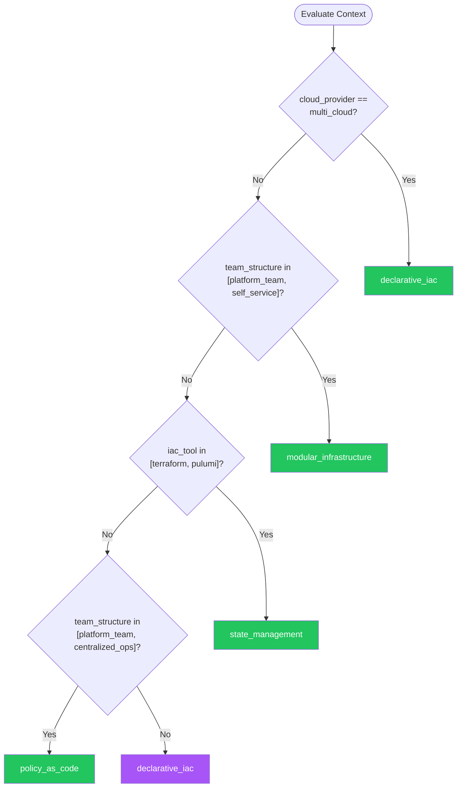

# Infrastructure as Code — Summary

**Purpose**
- Declarative infrastructure provisioning, state management, and drift detection.
- Scope: Terraform, Pulumi, Bicep, CloudFormation, and general IaC patterns for reproducible, auditable infrastructure.

## Related Standards

| Standard | Relationship | Context |
|----------|-------------|---------|
| [ci-cd](../ci-cd/) | complementary | IaC changes applied through CI/CD pipelines |
| [cloud-architecture](../cloud-architecture/) | complementary | IaC implements the cloud architecture design |

## Context Inputs

These inputs drive the decision tree — provide them to get a tailored recommendation.

| Input | Type | Required | Default | Values | Description |
|-------|------|----------|---------|--------|-------------|
| iac_tool | enum | yes | terraform | terraform, pulumi, bicep, cloudformation, cdk, crossplane, tool_agnostic | Primary IaC tool or framework |
| cloud_provider | enum | yes | multi_cloud | aws, azure, gcp, multi_cloud, on_premises | Target cloud provider |
| team_structure | enum | yes | platform_team | platform_team, embedded_in_dev, centralized_ops, self_service | How infrastructure is managed |

## Decision Tree

### Mermaid Diagram



### Text Fallback

- **Priority 1** → `declarative_iac` — when cloud_provider == multi_cloud. Terraform and Pulumi support multiple cloud providers with a single tool.
- **Priority 2** → `modular_infrastructure` — when team_structure in [platform_team, self_service]. Modular infrastructure lets platform teams publish reusable modules that development teams consume as self-service.
- **Priority 3** → `state_management` — when iac_tool in [terraform, pulumi]. State management is critical for Terraform and Pulumi. Remote state with locking prevents concurrent modifications.
- **Priority 4** → `policy_as_code` — when team_structure in [platform_team, centralized_ops]. Policy as code enforces guardrails — ensuring IaC changes comply with organizational standards before apply.
- **Fallback** → `declarative_iac` — Declarative IaC is the foundation — start here.

> **Confidence**: high | **Risk if wrong**: high

---

## Patterns

### 1. Declarative Infrastructure as Code

> Define infrastructure in declarative configuration files that describe the desired end state. The IaC tool computes the diff and applies changes. Version-controlled, reviewable, and reproducible. The foundation of all modern infrastructure management.

**Maturity**: standard

**Use when**
- Any cloud infrastructure provisioning
- Need reproducible environments (dev, staging, production)
- Infrastructure changes must be auditable
- Multiple team members manage infrastructure

**Avoid when**
- One-off experimental resources (use console, clean up after)

**Tradeoffs**

| Pros | Cons |
|------|------|
| Infrastructure is versioned, reviewable, and reproducible | Learning curve for IaC languages and concepts |
| Drift detection shows when reality diverges from config | State management complexity (Terraform, Pulumi) |
| Consistent environments across dev, staging, production | Some resources easier to create manually (one-time setup) |
| Audit trail via version control | |

**Implementation Guidelines**
- All infrastructure defined in code — no manual console changes
- Use terraform plan / pulumi preview before apply
- Review IaC changes in pull requests like application code
- Tag all resources with team, environment, cost-center
- Use data sources to reference existing resources, not hardcoded IDs

**Common Errors**

| Error | Impact | Fix |
|-------|--------|-----|
| Hardcoded resource IDs and ARNs | Config breaks across environments; not portable | Use data sources, outputs, and variables for all references |
| No terraform plan review before apply | Unexpected resource destruction; production outage | Always run plan in CI; require approval before apply |

**Standards & References**

| Standard | Type | Role | Reference |
|----------|------|------|-----------|
| Infrastructure as Code (Kief Morris) | practice | Foundational reference for IaC practices | |

---

### 2. Modular Infrastructure (Reusable Modules)

> Decompose infrastructure into reusable modules — each encapsulating a logical group of resources (VPC, EKS cluster, database). Modules accept inputs, produce outputs, and can be versioned independently. Platform teams publish modules; dev teams consume them.

**Maturity**: standard

**Use when**
- Multiple services need similar infrastructure patterns
- Platform team provides self-service infrastructure
- Want to standardize infrastructure patterns across teams

**Avoid when**
- Simple infrastructure with no reuse potential
- Single project with unique resources

**Tradeoffs**

| Pros | Cons |
|------|------|
| DRY infrastructure — define once, reuse everywhere | Module design requires upfront planning |
| Standardized patterns across teams | Breaking changes in modules affect all consumers |
| Module versioning — update independently | Over-abstraction can make modules hard to use |
| Self-service for development teams | |

**Implementation Guidelines**
- One module per logical resource group (networking, compute, database)
- Expose only necessary variables; use sensible defaults
- Version modules with semantic versioning
- Document inputs, outputs, and usage examples
- Publish modules to private registry or Git

**Common Errors**

| Error | Impact | Fix |
|-------|--------|-----|
| God module that provisions everything | Blast radius of changes is the entire stack; impossible to update incrementally | Decompose into focused modules; compose in root configuration |
| No module versioning | Upstream changes break all consumers without warning | Pin module versions; use semantic versioning; changelog for breaking changes |

**Standards & References**

| Standard | Type | Role | Reference |
|----------|------|------|-----------|
| Terraform Module Best Practices | practice | Guidance for module design and composition | |

---

### 3. Remote State Management

> Store IaC state remotely with locking to prevent concurrent modifications. State tracks the mapping between config and real resources. Remote backends (S3, Azure Blob, GCS) provide team access, versioning, and locking.

**Maturity**: standard

**Use when**
- Team of >1 managing infrastructure
- CI/CD pipeline applies infrastructure changes
- Need state history and rollback capability

**Avoid when**
- Solo developer with local-only infrastructure experiments

**Tradeoffs**

| Pros | Cons |
|------|------|
| Team can safely collaborate on infrastructure | Remote state backend is itself infrastructure to manage |
| State locking prevents concurrent modifications | State file contains sensitive data (must be encrypted) |
| State versioning enables rollback | State corruption can be difficult to recover from |
| CI/CD pipeline can access state | |

**Implementation Guidelines**
- Use remote backend: S3+DynamoDB (AWS), Azure Blob (Azure), GCS (GCP)
- Enable state encryption at rest
- Enable state locking to prevent concurrent modifications
- Split state by domain — separate state per component/service
- Never manually edit state files; use terraform state commands

**Common Errors**

| Error | Impact | Fix |
|-------|--------|-----|
| Single state file for all infrastructure | Blast radius is everything; slow plans; state lock contention | Split state by domain (networking, compute, database); use data sources to cross-reference |
| State file committed to version control | Secrets in state exposed; concurrent access without locking | Use remote backend; add *.tfstate to .gitignore |

**Standards & References**

| Standard | Type | Role | Reference |
|----------|------|------|-----------|
| Terraform Remote State Documentation | standard | Authoritative reference for state management | |

---

### 4. Policy as Code

> Define infrastructure compliance policies in code and enforce them before changes are applied. Policies validate that IaC configurations meet security, cost, and compliance requirements. Shift-left infrastructure governance.

**Maturity**: advanced

**Use when**
- Organization has compliance requirements for infrastructure
- Need guardrails for developer self-service
- Want to catch policy violations before apply

**Avoid when**
- Small team with full infrastructure visibility
- No compliance or security requirements

**Tradeoffs**

| Pros | Cons |
|------|------|
| Violations caught before deployment — shift-left governance | Additional tooling and learning curve |
| Policies versioned and reviewed like code | Overly strict policies slow development |
| Consistent enforcement across all teams | False positives require exception mechanisms |
| Self-service with guardrails | |

**Implementation Guidelines**
- Use OPA/Conftest for open-source policy; Sentinel for Terraform Cloud
- Policies run in CI before terraform apply
- Start with critical policies (no public S3 buckets, encrypted storage)
- Provide exception mechanism for legitimate overrides
- Test policies against both compliant and non-compliant configurations

**Common Errors**

| Error | Impact | Fix |
|-------|--------|-----|
| Policies too restrictive with no exception mechanism | Developers can't deploy legitimate infrastructure; shadow IT | Provide documented exception process; tag exceptions for audit |
| Policies not tested | False positives block legitimate changes; false negatives miss violations | Unit test policies with known-good and known-bad configurations |

**Standards & References**

| Standard | Type | Role | Reference |
|----------|------|------|-----------|
| Open Policy Agent (OPA) | tool | General-purpose policy engine | |

---

## Examples

### Terraform Module — Reusable VPC
**Context**: Platform team module consumed by development teams

**Correct** implementation:
```hcl
# modules/vpc/main.tf
resource "aws_vpc" "main" {
  cidr_block           = var.cidr_block
  enable_dns_hostnames = true
  enable_dns_support   = true

  tags = merge(var.tags, {
    Name        = "${var.name}-vpc"
    Environment = var.environment
    ManagedBy   = "terraform"
  })
}

resource "aws_subnet" "private" {
  count             = length(var.availability_zones)
  vpc_id            = aws_vpc.main.id
  cidr_block        = cidrsubnet(var.cidr_block, 8, count.index)
  availability_zone = var.availability_zones[count.index]

  tags = merge(var.tags, {
    Name = "${var.name}-private-${var.availability_zones[count.index]}"
    Tier = "private"
  })
}

# modules/vpc/variables.tf
variable "name" {
  type        = string
  description = "Name prefix for all resources"
}

variable "cidr_block" {
  type        = string
  description = "VPC CIDR block"
  default     = "10.0.0.0/16"
}

variable "environment" {
  type        = string
  description = "Environment name (dev, staging, production)"
}

variable "availability_zones" {
  type        = list(string)
  description = "List of AZs to use"
}

variable "tags" {
  type        = map(string)
  description = "Additional tags for all resources"
  default     = {}
}

# Consumer usage:
# module "vpc" {
#   source      = "git::https://github.com/org/modules.git//vpc?ref=v1.2.0"
#   name        = "order-service"
#   environment = "production"
#   cidr_block  = "10.0.0.0/16"
#   availability_zones = ["us-east-1a", "us-east-1b", "us-east-1c"]
# }
```

**Incorrect** implementation:
```hcl
# WRONG: Hardcoded values, no module, no tags
resource "aws_vpc" "main" {
  cidr_block = "10.0.0.0/16"
}

resource "aws_subnet" "subnet1" {
  vpc_id     = aws_vpc.main.id
  cidr_block = "10.0.1.0/24"
  availability_zone = "us-east-1a"
}

resource "aws_subnet" "subnet2" {
  vpc_id     = aws_vpc.main.id
  cidr_block = "10.0.2.0/24"
  availability_zone = "us-east-1b"
}
# Problems:
#   - Hardcoded CIDRs, AZs, and count
#   - No tags — untrackable resources
#   - Not a module — can't reuse
#   - Copy-paste for each subnet
```

**Why**: The correct version uses a reusable module with variables, dynamic subnet creation, consistent tagging, and version-pinned consumption. The incorrect version hardcodes everything and uses copy-paste instead of loops.

---

### Remote State Configuration
**Context**: Terraform remote state with S3 backend and DynamoDB locking

**Correct** implementation:
```hcl
# backend.tf — Remote state with encryption and locking
terraform {
  backend "s3" {
    bucket         = "myorg-terraform-state"
    key            = "services/order-service/terraform.tfstate"
    region         = "us-east-1"
    encrypt        = true
    dynamodb_table = "terraform-locks"
  }
}

# Cross-reference another component's state (read-only)
data "terraform_remote_state" "networking" {
  backend = "s3"
  config = {
    bucket = "myorg-terraform-state"
    key    = "infrastructure/networking/terraform.tfstate"
    region = "us-east-1"
  }
}

# Use output from networking state
resource "aws_instance" "api" {
  subnet_id = data.terraform_remote_state.networking.outputs.private_subnet_ids[0]
  # ...
}
```

**Incorrect** implementation:
```hcl
# WRONG: Local state, no locking
# terraform.tfstate committed to Git
# No encryption, no locking
# Team members overwrite each other's state
terraform {
  # No backend configured — defaults to local
}
```

**Why**: The correct version uses S3 remote backend with encryption and DynamoDB locking. State split per service with cross-references via data sources. The incorrect version uses local state with no encryption or locking.

---

## Security Hardening

### Transport
- IaC state stored in encrypted remote backends over TLS

### Data Protection
- State files encrypted at rest (contain resource details and sometimes secrets)
- Sensitive outputs marked as sensitive in IaC code

### Access Control
- IaC pipeline service accounts follow least-privilege
- State backend access restricted to authorized pipelines and operators

### Input/Output
- Policy as code validates all IaC changes before apply
- terraform plan output reviewed before apply

### Secrets
- Secrets never hardcoded in IaC files — use secret manager references
- State backends encrypted to protect any secrets that leak into state

### Monitoring
- All terraform apply / pulumi up operations logged in audit trail
- Drift detection alerts when resources change outside IaC

---

## Anti-Patterns

| Anti-Pattern | Severity | Description | Fix |
|-------------|----------|-------------|-----|
| ClickOps | critical | Creating and managing infrastructure through cloud console UI. No version control, no reproducibility, no audit trail. Each environment is a unique snowflake. | Define all infrastructure in IaC; treat console as read-only for debugging |
| Monolithic State | high | Single state file for all infrastructure. Every plan touches everything, blast radius is the entire estate, and state locking blocks everyone. | Split state by domain (networking, compute, database); use data sources for cross-references |
| Hardcoded Values | high | Resource IDs, CIDRs, regions, and account numbers hardcoded in configuration. Not portable across environments. | Use variables with defaults, data sources for lookups, and outputs for cross-references |
| Unencrypted State | critical | State file stored without encryption. State contains resource attributes including database passwords, API keys, and connection strings. | Enable encryption at rest on state backend; restrict access with IAM policies |

---

## Checklist

| ID | Category | Description | Severity |
|----|----------|-------------|----------|
| IAC-01 | design | All infrastructure defined in code — no manual console changes | critical |
| IAC-02 | security | State encrypted at rest with locking enabled | critical |
| IAC-03 | design | State split by domain — not monolithic | high |
| IAC-04 | maintainability | Reusable modules for common patterns (VPC, compute, database) | medium |
| IAC-05 | maintainability | Modules versioned with semantic versioning | medium |
| IAC-06 | security | No secrets hardcoded in IaC files | critical |
| IAC-07 | compliance | Policy as code validates changes before apply | high |
| IAC-08 | observability | All resources tagged (team, environment, cost-center) | high |
| IAC-09 | reliability | Plan reviewed before apply — no blind applies | high |
| IAC-10 | security | IaC pipeline service accounts follow least-privilege | high |
| IAC-11 | reliability | Drift detection alerts on manual changes | medium |
| IAC-12 | maintainability | No hardcoded values — variables and data sources used throughout | high |

---

## Compliance

| Standard | Relevance |
|----------|-----------|
| CIS Cloud Benchmarks | IaC should provision resources that meet CIS benchmarks |
| Well-Architected Frameworks (AWS/Azure/GCP) | IaC patterns should follow cloud provider best practices |

**Requirements Mapping**

| Control | Description | Maps To |
|---------|-------------|---------|
| infrastructure_audit | All infrastructure changes traceable via version control | SOC 2 CC8.1 |
| encryption_at_rest | IaC state and provisioned resources encrypted at rest | CIS Cloud Benchmark — Encryption |

---

## Prompt Recipes

### Create IaC for New Infrastructure (Greenfield)
```text
Create {iac_tool} configuration for {cloud_provider} infrastructure:

1. Remote state backend with encryption and locking
2. Networking module (VPC/VNet, subnets, security groups)
3. Compute module (EKS/AKS/GKE or EC2/VM)
4. Database module (RDS/Cloud SQL with encryption)
5. All resources tagged (team, environment, cost-center, managed-by)
6. Variables file with environment-specific defaults
7. Outputs for cross-module references
```

### Audit IaC for Best Practices
```text
Audit this {iac_tool} codebase for best practices:

1. **State**: Remote backend? Encryption? Locking? Split per domain?
2. **Modules**: Reusable? Versioned? Well-documented?
3. **Security**: No hardcoded secrets? Encryption enabled? Least privilege?
4. **Tagging**: All resources tagged? Consistent naming?
5. **DRY**: Variables and locals used? No hardcoded values?
6. **Policy**: Compliance checks in pipeline?
```

### Migrate to IaC
```text
Migrate existing {cloud_provider} resources to {iac_tool}:

1. Import existing resources into state (terraform import / pulumi import)
2. Generate configuration from current state
3. Verify plan shows no changes (config matches reality)
4. Add tags, variables, and module structure
5. Set up remote state backend
6. Integrate with CI/CD pipeline
```

### Refactor IaC for Modularity
```text
Refactor this {iac_tool} codebase for modularity:

1. Identify reusable patterns (VPC, EKS, RDS provisioned multiple times)
2. Extract into versioned modules with inputs/outputs
3. Split monolithic state into domain-specific states
4. Add variable validation and type constraints
5. Document module usage with examples
6. Show before/after structure
```

---

## Links
- Full standard: [infrastructure-as-code.yaml](infrastructure-as-code.yaml)
