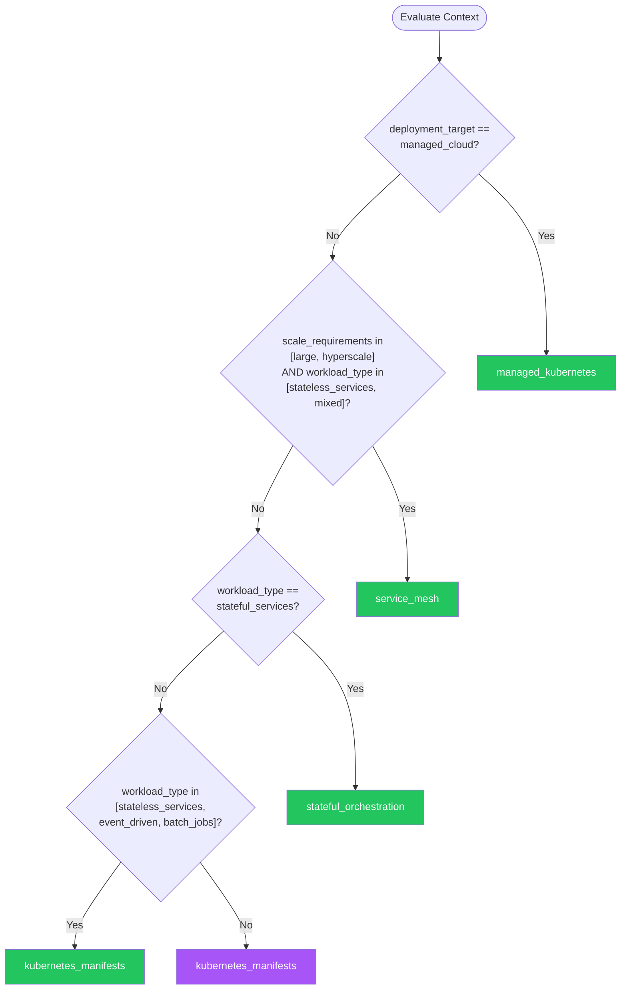

# Orchestration — Summary

**Purpose**
- Container orchestration platforms, service mesh, and workload management.
- Scope: Kubernetes patterns, service discovery, scaling strategies, and production-grade deployment topologies.

## Related Standards

| Standard | Relationship | Context |
|----------|-------------|---------|
| [containerization](../containerization/) | complementary | Orchestration manages the lifecycle of containerized workloads |
| [ci-cd](../ci-cd/) | complementary | CI/CD pipelines deploy to orchestration platforms |
| [cloud-architecture](../cloud-architecture/) | complementary | Orchestration is a core component of cloud-native architecture |

## Context Inputs

These inputs drive the decision tree — provide them to get a tailored recommendation.

| Input | Type | Required | Default | Values | Description |
|-------|------|----------|---------|--------|-------------|
| workload_type | enum | yes | stateless_services | stateless_services, stateful_services, batch_jobs, event_driven, mixed | Primary workload type being orchestrated |
| scale_requirements | enum | yes | medium | small, medium, large, hyperscale | Expected scale of the orchestrated workloads |
| deployment_target | enum | yes | managed_cloud | managed_cloud, self_managed, hybrid, edge | Where the orchestration platform runs |

## Decision Tree

### Mermaid Diagram



### Text Fallback

- **Priority 1** → `managed_kubernetes` — when deployment_target == managed_cloud. Managed Kubernetes (EKS, AKS, GKE) removes control plane overhead and provides integrated cloud services.
- **Priority 2** → `service_mesh` — when scale_requirements in [large, hyperscale] AND workload_type in [stateless_services, mixed]. Service mesh provides mTLS, observability, and traffic management at scale without application code changes.
- **Priority 3** → `stateful_orchestration` — when workload_type == stateful_services. StatefulSets provide stable network identities and persistent storage for databases and stateful services.
- **Priority 4** → `kubernetes_manifests` — when workload_type in [stateless_services, event_driven, batch_jobs]. Standard Kubernetes manifests are the foundation for all workloads.
- **Fallback** → `kubernetes_manifests` — Standard Kubernetes manifests are the universal foundation.

> **Confidence**: high | **Risk if wrong**: medium

---

## Patterns

### 1. Kubernetes Manifests & Resource Management

> Declarative YAML manifests for Kubernetes workloads. Covers Deployments, Services, ConfigMaps, Secrets, resource requests/limits, liveness/readiness probes, and pod disruption budgets. The foundation of all orchestration.

**Maturity**: standard

**Use when**
- Any Kubernetes workload deployment
- Standardizing resource definitions across services
- Need declarative, version-controlled infrastructure

**Avoid when**
- Simple single-container deployments where Docker Compose suffices

**Tradeoffs**

| Pros | Cons |
|------|------|
| Declarative, version-controlled, reproducible | YAML verbosity for complex deployments |
| Self-healing with liveness/readiness probes | Learning curve for Kubernetes concepts |
| Rolling updates with zero-downtime | Over-engineering for simple applications |
| Resource limits prevent noisy neighbor problems | |

**Implementation Guidelines**
- Always set resource requests AND limits (CPU, memory)
- Define liveness, readiness, and startup probes
- Use PodDisruptionBudgets for high-availability services
- Namespace isolation for environments (dev, staging, prod)
- Use labels and annotations consistently for discoverability
- ConfigMaps for config, Secrets for sensitive data — never hardcode

**Common Errors**

| Error | Impact | Fix |
|-------|--------|-----|
| No resource limits set | Single pod can consume all node resources, starving other workloads | Set requests (scheduling guarantee) and limits (hard cap) for CPU and memory |
| No readiness probe defined | Traffic routed to pods before they're ready; user-facing errors during deploys | Define readiness probe that checks application health (HTTP, TCP, or exec) |
| Using default namespace for everything | No isolation between services; accidental cross-service access | Create namespaces per team/environment; use NetworkPolicies for isolation |

**Standards & References**

| Standard | Type | Role | Reference |
|----------|------|------|-----------|
| Kubernetes API Documentation | standard | Authoritative reference for all resource types | |

---

### 2. Managed Kubernetes (EKS / AKS / GKE)

> Cloud-managed Kubernetes services that handle control plane operations, upgrades, and integration with cloud-native services (IAM, load balancers, storage, monitoring). Reduces operational burden significantly.

**Maturity**: standard

**Use when**
- Running on a major cloud provider
- Team wants to focus on workloads, not cluster operations
- Need integrated IAM, networking, and monitoring

**Avoid when**
- Multi-cloud portability is the primary concern
- Regulatory requirements mandate self-managed infrastructure

**Tradeoffs**

| Pros | Cons |
|------|------|
| Control plane managed — no etcd backups, API server maintenance | Cloud vendor lock-in for cluster management features |
| Integrated with cloud IAM, networking, storage | Less control over control plane configuration |
| Automatic cluster upgrades and patching | Managed services have their own limitations and quirks |
| Reduced operational overhead | |

**Implementation Guidelines**
- Use node pools/groups for workload isolation (system vs application)
- Enable cluster autoscaler for dynamic scaling
- Use cloud-native ingress controllers (ALB, Application Gateway, GCE)
- Integrate with cloud IAM for pod-level identity (IRSA, Workload Identity)
- Use managed add-ons where available (monitoring, logging, policy)

**Common Errors**

| Error | Impact | Fix |
|-------|--------|-----|
| Single node pool for all workloads | No isolation between system and application workloads; scaling inefficient | Separate system node pool (taints for system pods) from application pools |
| Not using pod identity (IRSA/Workload Identity) | Pods use node-level IAM role; over-permissioned access | Configure pod-level IAM identity for least-privilege access |

**Standards & References**

| Standard | Type | Role | Reference |
|----------|------|------|-----------|
| Cloud Provider Kubernetes Best Practices | practice | Provider-specific guidance for managed Kubernetes | |

---

### 3. Service Mesh

> Infrastructure layer for service-to-service communication that provides mTLS encryption, traffic management, observability, and resilience without application code changes. Implemented via sidecar proxies (Istio, Linkerd) or eBPF (Cilium).

**Maturity**: advanced

**Use when**
- Large microservice deployments (>10 services)
- Need mTLS between all services without app code changes
- Complex traffic management (canary, A/B, fault injection)
- Deep observability into service-to-service communication

**Avoid when**
- Small number of services (<5) where complexity doesn't justify mesh
- Performance-sensitive workloads where sidecar overhead matters
- Team lacks Kubernetes expertise for mesh operations

**Tradeoffs**

| Pros | Cons |
|------|------|
| Automatic mTLS — zero-trust networking without app changes | Significant operational complexity |
| Rich traffic management (canary, circuit breaking, retries) | Sidecar resource overhead (CPU, memory per pod) |
| Deep observability (request traces, golden signals per service) | Debugging network issues through proxy layers |
| Policy enforcement at the network level | Latency added per hop |

**Implementation Guidelines**
- Start with mTLS and observability — add traffic management later
- Use progressive rollout — mesh one namespace at a time
- Linkerd for simplicity; Istio for features; Cilium for eBPF performance
- Monitor mesh control plane health and proxy resource usage
- Document exception namespaces that opt out of mesh injection

**Common Errors**

| Error | Impact | Fix |
|-------|--------|-----|
| Enabling mesh for all namespaces at once | Network disruption across all services simultaneously | Progressive rollout — mesh non-critical services first, validate, then expand |
| Not budgeting for sidecar resource overhead | Node capacity exceeded; pods evicted or stuck pending | Account for ~50MB memory and 0.1 CPU per sidecar in capacity planning |

**Standards & References**

| Standard | Type | Role | Reference |
|----------|------|------|-----------|
| CNCF Service Mesh Landscape | reference | Overview of service mesh options and trade-offs | |

---

### 4. Stateful Workload Orchestration

> Kubernetes patterns for stateful services including databases, message brokers, and caches. Uses StatefulSets for stable identities, persistent volumes for data, and operators for lifecycle management.

**Maturity**: advanced

**Use when**
- Running databases on Kubernetes (Postgres, MySQL, Redis)
- Stateful services needing stable network identities
- Distributed systems requiring ordered deployment (Kafka, ZooKeeper)

**Avoid when**
- Managed database services are available and preferred
- Simple stateless services

**Tradeoffs**

| Pros | Cons |
|------|------|
| Stable pod names and DNS (pod-0, pod-1, etc.) | More complex than managed cloud databases |
| Persistent volume claims survive pod restarts | Storage provisioning and backup are your responsibility |
| Ordered, graceful deployment and scaling | Stateful workloads harder to migrate between clusters |
| Operators automate complex lifecycle (backup, failover) | |

**Implementation Guidelines**
- Use StatefulSets for stable identity and ordered deployment
- PersistentVolumeClaims with appropriate storage class
- Use operators (e.g., CloudNativePG, Strimzi) for database/broker lifecycle
- Implement backup and restore procedures
- Use headless services for direct pod DNS resolution

**Common Errors**

| Error | Impact | Fix |
|-------|--------|-----|
| Using Deployment instead of StatefulSet for databases | Pods get random names; no stable storage binding; data loss on reschedule | Use StatefulSet for any workload needing stable identity or persistent storage |
| No backup strategy for persistent volumes | Data loss on PV failure or accidental deletion | Implement VolumeSnapshot schedule or operator-managed backups |

**Standards & References**

| Standard | Type | Role | Reference |
|----------|------|------|-----------|
| Kubernetes StatefulSet Documentation | standard | Authoritative reference for stateful workloads | |

---

## Examples

### Production Kubernetes Deployment
**Context**: Deploying a stateless API service with proper resource management

**Correct** implementation:
```yaml
apiVersion: apps/v1
kind: Deployment
metadata:
  name: order-service
  namespace: production
  labels:
    app: order-service
    team: commerce
spec:
  replicas: 3
  selector:
    matchLabels:
      app: order-service
  template:
    metadata:
      labels:
        app: order-service
    spec:
      containers:
        - name: order-service
          image: registry.example.com/order-service:v1.2.3@sha256:abc123
          ports:
            - containerPort: 8080
          resources:
            requests:
              cpu: 250m
              memory: 256Mi
            limits:
              cpu: 500m
              memory: 512Mi
          readinessProbe:
            httpGet:
              path: /health/ready
              port: 8080
            initialDelaySeconds: 5
            periodSeconds: 10
          livenessProbe:
            httpGet:
              path: /health/live
              port: 8080
            initialDelaySeconds: 15
            periodSeconds: 20
          env:
            - name: DB_HOST
              valueFrom:
                configMapKeyRef:
                  name: order-config
                  key: db-host
            - name: DB_PASSWORD
              valueFrom:
                secretKeyRef:
                  name: order-secrets
                  key: db-password
      topologySpreadConstraints:
        - maxSkew: 1
          topologyKey: topology.kubernetes.io/zone
          whenUnsatisfiable: DoNotSchedule
          labelSelector:
            matchLabels:
              app: order-service
---
apiVersion: policy/v1
kind: PodDisruptionBudget
metadata:
  name: order-service-pdb
  namespace: production
spec:
  minAvailable: 2
  selector:
    matchLabels:
      app: order-service
```

**Incorrect** implementation:
```yaml
# WRONG: Missing resource limits, probes, security context
apiVersion: apps/v1
kind: Deployment
metadata:
  name: order-service
spec:
  replicas: 1
  selector:
    matchLabels:
      app: order-service
  template:
    metadata:
      labels:
        app: order-service
    spec:
      containers:
        - name: order-service
          image: order-service:latest
          ports:
            - containerPort: 8080
          env:
            - name: DB_PASSWORD
              value: "supersecret123"
# Problems:
#   - No resource requests/limits
#   - No health probes
#   - :latest tag, no digest
#   - Password in plain text
#   - Single replica
#   - Default namespace
#   - No PDB
```

**Why**: The correct version defines resource requests and limits, readiness and liveness probes, secrets via SecretKeyRef, topology spread for HA, and a PodDisruptionBudget. The incorrect version has none of these and hardcodes secrets in the manifest.

---

### Helm Chart Values — Environment Overrides
**Context**: Using Helm values for multi-environment deployments

**Correct** implementation:
```yaml
# values.yaml (defaults)
replicaCount: 2
image:
  repository: registry.example.com/api-service
  tag: ""  # Set by CI/CD via --set image.tag=...
  pullPolicy: IfNotPresent
resources:
  requests:
    cpu: 250m
    memory: 256Mi
  limits:
    cpu: 500m
    memory: 512Mi

# values-production.yaml (environment override)
replicaCount: 3
resources:
  requests:
    cpu: 500m
    memory: 512Mi
  limits:
    cpu: "1"
    memory: 1Gi

# Deploy: helm upgrade --install api-service ./chart \
#   -f values.yaml -f values-production.yaml \
#   --set image.tag=$CI_COMMIT_SHA
```

**Incorrect** implementation:
```yaml
# WRONG: Hardcoded values, no environment separation
# values.yaml
replicaCount: 1
image:
  repository: api-service
  tag: latest
# No resource limits defined
# Same values used for dev, staging, and production
# Image tag set to :latest
```

**Why**: The correct version uses base values with environment-specific overrides, image tags set by CI/CD (never :latest), and proper resource definitions. The incorrect version uses hardcoded values with no environment separation.

---

## Security Hardening

### Transport
- Service mesh mTLS for all inter-service communication
- Ingress TLS termination with valid certificates

### Data Protection
- Kubernetes Secrets encrypted at rest (EncryptionConfiguration)
- Use external secret stores (Vault, AWS Secrets Manager) for sensitive data

### Access Control
- RBAC with least-privilege roles per namespace
- NetworkPolicies to restrict pod-to-pod communication
- Pod Security Standards enforced (restricted profile)

### Input/Output
- Admission controllers validate manifests before deployment

### Secrets
- Never commit Secrets manifests to version control
- Use Sealed Secrets or External Secrets Operator for GitOps workflows

### Monitoring
- Prometheus/Grafana stack for cluster and workload metrics
- Audit logging enabled for all API server requests

---

## Anti-Patterns

| Anti-Pattern | Severity | Description | Fix |
|-------------|----------|-------------|-----|
| No Resource Limits | critical | Deploying pods without resource requests or limits. A single pod can consume all node CPU and memory, causing cascading failures. | Always set resource requests (scheduling guarantee) and limits (hard cap) for CPU and memory |
| Using :latest Tag | high | Deploying with image:latest tag. No rollback possible, no audit trail, and different pods may run different image versions. | Use specific version tags or SHA digests; set image tag from CI/CD pipeline |
| Hardcoded Secrets in Manifests | critical | Putting passwords, API keys, or tokens directly in Deployment manifests or values files committed to version control. | Use Kubernetes Secrets with external secret management (Vault, Sealed Secrets, ESO) |
| Premature Service Mesh | medium | Adopting a service mesh for <5 services. The operational complexity of the mesh exceeds the value for small deployments. | Start with Kubernetes-native features; adopt service mesh when scale demands it |

---

## Checklist

| ID | Category | Description | Severity |
|----|----------|-------------|----------|
| ORC-01 | reliability | Resource requests and limits defined for all containers | critical |
| ORC-02 | reliability | Readiness and liveness probes configured | high |
| ORC-03 | reliability | PodDisruptionBudget defined for critical services | high |
| ORC-04 | security | RBAC roles follow least-privilege per namespace | high |
| ORC-05 | security | NetworkPolicies restrict pod-to-pod communication | high |
| ORC-06 | security | Pod Security Standards enforced (restricted profile) | high |
| ORC-07 | observability | Monitoring stack deployed (metrics, logs, traces) | high |
| ORC-08 | reliability | HorizontalPodAutoscaler configured for variable workloads | medium |
| ORC-09 | security | Secrets managed via external store, not inline in manifests | critical |
| ORC-10 | reliability | Topology spread constraints for multi-zone availability | medium |
| ORC-11 | maintainability | Helm or Kustomize used for manifest templating | medium |
| ORC-12 | security | Image pull from private registry with authentication | high |

---

## Compliance

| Standard | Relevance |
|----------|-----------|
| CIS Kubernetes Benchmark | Industry standard for Kubernetes security configuration |
| CNCF Cloud Native Best Practices | Community standards for cloud-native workloads |

**Requirements Mapping**

| Control | Description | Maps To |
|---------|-------------|---------|
| resource_limits | All pods must define resource requests and limits | CIS Kubernetes Benchmark 5.2 |
| network_policies | Default-deny NetworkPolicies per namespace | CIS Kubernetes Benchmark 5.3 |

---

## Prompt Recipes

### Create Kubernetes Manifests (Greenfield)
```text
Create production-ready Kubernetes manifests for a {language} {service_type} service:

1. Deployment with resource requests/limits, probes, and security context
2. Service (ClusterIP or LoadBalancer based on exposure needs)
3. ConfigMap for non-sensitive configuration
4. Secret references (external secret store, not inline)
5. HorizontalPodAutoscaler with CPU/memory targets
6. PodDisruptionBudget for high availability
7. NetworkPolicy for ingress/egress rules
```

### Migrate Docker Compose to Kubernetes
```text
Migrate this Docker Compose application to Kubernetes:

1. Convert each service to a Deployment + Service
2. Convert volumes to PersistentVolumeClaims
3. Convert environment variables to ConfigMaps/Secrets
4. Add resource limits, probes, and security context
5. Create namespace and NetworkPolicies
6. Show Helm chart structure if >3 services
```

### Audit Kubernetes Manifests
```text
Audit these Kubernetes manifests for production readiness:

1. **Resources**: Requests and limits defined for all containers?
2. **Probes**: Readiness, liveness, and startup probes configured?
3. **Security**: Non-root, read-only filesystem, capabilities dropped?
4. **HA**: Multiple replicas, PDB, topology spread?
5. **Secrets**: No hardcoded secrets? Using external secret management?
6. **Networking**: NetworkPolicies defined? Ingress TLS?
```

### Debug Kubernetes Workload Issues
```text
Debug this Kubernetes workload issue: {issue_description}

1. Check pod status and events: kubectl describe pod
2. Check container logs: kubectl logs
3. Verify resource constraints: requests vs actual usage
4. Check probe failures: readiness/liveness timing
5. Verify networking: Service endpoints, DNS resolution
6. Check RBAC: ServiceAccount permissions
7. Provide the fix and explain root cause
```

---

## Links
- Full standard: [orchestration.yaml](orchestration.yaml)
