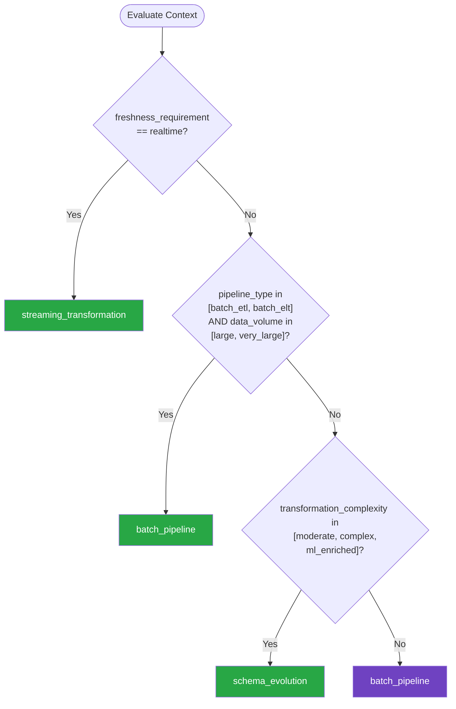

# Data Transformation — Summary

Purpose
- Data transformation patterns including ETL/ELT pipelines, schema evolution, data mapping, validation, and format conversion
- Scope: Covers both batch and streaming data transformation for integration, migration, and analytics use cases

## Related Standards

| Standard | Relationship | Context |
|----------|-------------|---------|
| [search](../search/) | complementary | Search indexing pipelines are a data transformation use case |
| [messaging-events](../../foundational/messaging-events/) | complementary | Event streams are a common data source for transformation pipelines |
| [input-validation](../../foundational/input-validation/) | complementary | Data validation is a core transformation step |

## Context Inputs

These inputs drive the decision tree — provide them to get a tailored recommendation.

| Input | Type | Required | Default | Values | Description |
|-------|------|----------|---------|--------|-------------|
| pipeline_type | enum | yes | batch_etl | batch_etl, batch_elt, streaming, micro_batch | Type of data transformation pipeline |
| data_volume | enum | yes | medium | small, medium, large, very_large | Volume of data being transformed |
| transformation_complexity | enum | no | moderate | simple, moderate, complex, ml_enriched | Complexity of transformation logic |
| freshness_requirement | enum | no | daily | realtime, hourly, daily, weekly | How fresh the transformed data must be |

## Decision Tree

### Mermaid Diagram



### Text Fallback

- **Priority 1** → `streaming_transformation` — when freshness_requirement == realtime. Real-time freshness requires streaming transformation processing events as they arrive.
- **Priority 2** → `batch_pipeline` — when pipeline_type in [batch_etl, batch_elt] AND data_volume in [large, very_large]. Large batch transformations need distributed processing frameworks for performance and reliability.
- **Priority 3** → `schema_evolution` — when transformation_complexity in [moderate, complex, ml_enriched]. Complex transformations inevitably encounter schema changes. Plan for schema evolution from the start.
- **Fallback** → `batch_pipeline` — Batch pipelines are simpler, well-understood, and sufficient for most use cases

> **Confidence**: high | **Risk if wrong**: medium

---

## Patterns

### 1. Batch ETL/ELT Pipeline

> Process data in scheduled batches: extract from sources, transform (clean, validate, enrich, aggregate), and load to destinations. ETL transforms before loading; ELT loads raw then transforms in the destination (usually a data warehouse). Batch is simpler, cheaper, and sufficient when real-time freshness is not required.

**Maturity**: standard

**Use when**
- Data freshness measured in hours or days (not seconds)
- Bounded datasets that can be processed completely in a batch
- Analytics and reporting pipelines
- Data warehouse loading

**Avoid when**
- Real-time or near-real-time freshness required
- Unbounded data streams (use streaming)

**Tradeoffs**

| Pros | Cons |
|------|------|
| Simple to understand, build, and debug | Data latency — freshness depends on batch schedule |
| Complete data available — can do global aggregations | Large batches take long to process |
| Easier error recovery — rerun the entire batch | All-or-nothing failure risk without checkpointing |
| Lower infrastructure cost than streaming | |

**Implementation Guidelines**
- Idempotent pipelines: rerunning the same batch produces the same result
- Partition data by time or key for parallel processing
- Validate data at entry (schema, types, ranges) — reject or quarantine bad records
- Checkpoint progress for long-running batches (resume from checkpoint on failure)
- Log record counts at each stage (extracted, transformed, loaded, rejected)
- Use staging tables — load to staging, validate, then promote to production
- Store rejected records with reasons for investigation

**Common Errors**

| Error | Impact | Fix |
|-------|--------|-----|
| Non-idempotent pipeline — rerun creates duplicates | Recovery from failure corrupts data | Use UPSERT/MERGE semantics; truncate-and-load or partition-based overwrite |
| No data validation between stages | Bad data propagates through pipeline and corrupts downstream systems | Validate after extract and after transform; quarantine bad records |
| No record count reconciliation | Silent data loss — records disappear without detection | Log counts at each stage; alert on unexpected count differences |

**Standards & References**

| Standard | Type | Role | Reference |
|----------|------|------|-----------|
| dbt | tool | SQL-based transformation framework for ELT | — |
| Apache Airflow | tool | Workflow orchestration for batch pipelines | — |

---

### 2. Streaming Data Transformation

> Process data records as they arrive in a continuous stream. Each record is transformed independently or in windowed aggregations. Enables real-time dashboards, alerts, and derived data products.

**Maturity**: advanced

**Use when**
- Real-time or near-real-time data freshness required
- Unbounded event streams (logs, IoT, user activity)
- Event-driven architectures producing continuous events

**Avoid when**
- Bounded datasets with batch schedule (simpler as batch)
- Global aggregations requiring complete dataset
- Simple one-time data migrations

**Tradeoffs**

| Pros | Cons |
|------|------|
| Real-time data freshness | More complex than batch — ordering, late events, state management |
| Processes data incrementally — constant resource usage | Harder to debug and test |
| Natural fit for event-driven architectures | Higher infrastructure cost (always running) |

**Implementation Guidelines**
- Design for exactly-once semantics (or idempotent at-least-once)
- Handle late-arriving events with watermarks and allowed lateness
- Use windowing for time-based aggregations (tumbling, sliding, session)
- Manage state carefully — use framework-provided state stores
- Dead-letter topic for records that fail transformation
- Monitor consumer lag as a key health metric
- Build replay capability for reprocessing from offset

**Common Errors**

| Error | Impact | Fix |
|-------|--------|-----|
| Assuming events arrive in order | Incorrect aggregations and calculations | Use event timestamps and watermarks for ordering; handle late events |
| Unbounded state accumulation | Memory exhaustion and crash | Use windowed state with TTL; evict old state |
| No dead-letter handling for failed transformations | Bad records block the stream or are silently dropped | Route failed records to dead-letter topic with error context |

**Standards & References**

| Standard | Type | Role | Reference |
|----------|------|------|-----------|
| Apache Kafka Streams | framework | Stream processing library for Java/Kotlin | — |
| Apache Flink | framework | Distributed stream processing framework | — |

---

### 3. Schema Evolution & Versioning

> Manage changes to data schemas over time without breaking existing pipelines or consumers. Use schema registries to track versions, enforce compatibility rules, and enable gradual migration. Critical for long-lived data systems where source schemas change frequently.

**Maturity**: advanced

**Use when**
- Data schemas change over time (new fields, type changes)
- Multiple consumers read the same data with different schema versions
- Long-term data retention where old data has old schemas

**Avoid when**
- One-time data migration (transform once, no ongoing changes)
- Single producer-single consumer with coordinated deployments

**Tradeoffs**

| Pros | Cons |
|------|------|
| Non-breaking schema changes without pipeline downtime | Additional infrastructure (schema registry) |
| Multiple schema versions coexist (gradual migration) | Must plan schema changes carefully (compatibility constraints) |
| Schema registry provides documentation and governance | Migration of existing data may still be needed for breaking changes |
| Backward/forward compatibility enforced automatically | |

**Implementation Guidelines**
- Use a schema registry (Confluent, AWS Glue, Apicurio)
- Default to backward-compatible changes (add optional fields)
- Never remove or rename fields without deprecation period
- Version schemas explicitly (semantic versioning)
- Encode schema ID with each record (Avro, Protobuf)
- Test schema compatibility before deploying changes
- Document migration path for breaking changes

**Common Errors**

| Error | Impact | Fix |
|-------|--------|-----|
| Breaking schema change without versioning | All downstream consumers break simultaneously | Version schemas; use compatibility modes; deprecate before removing |
| No schema registry — schemas defined in code | No central documentation; compatibility not enforced | Use schema registry with compatibility checking |
| Renaming fields instead of adding new ones | Existing consumers can't find the field — breaking change | Add new field, populate both, deprecate old field, remove after migration |

**Standards & References**

| Standard | Type | Role | Reference |
|----------|------|------|-----------|
| Apache Avro | format | Schema-based data serialization with evolution support | — |
| Protocol Buffers | format | Google's schema-based serialization format | — |

---

## Examples

### Idempotent Batch ETL Pipeline
**Context**: Daily pipeline loading customer orders into analytics warehouse

**Correct** implementation:
```python
# Python — Idempotent batch pipeline with validation
from datetime import date

class DailyOrdersPipeline:
    """Idempotent ETL: rerunning for the same date produces identical results."""

    def run(self, run_date: date) -> PipelineResult:
        # EXTRACT — bounded by date partition
        raw_orders = self.extract_orders(run_date)
        extracted_count = len(raw_orders)

        # VALIDATE — quarantine bad records
        valid, rejected = self.validate(raw_orders)

        # TRANSFORM — clean, enrich, aggregate
        transformed = [self.transform_order(o) for o in valid]

        # LOAD — partition overwrite (idempotent!)
        self.load_to_warehouse(
            records=transformed,
            partition_key=run_date.isoformat(),
            mode="overwrite",  # Rerunnable — same result
        )

        # QUARANTINE — store rejected with reasons
        if rejected:
            self.quarantine_records(rejected, run_date)

        # RECONCILE — count check
        loaded_count = self.count_loaded(run_date)
        return PipelineResult(
            extracted=extracted_count,
            valid=len(valid),
            rejected=len(rejected),
            loaded=loaded_count,
            reconciled=(len(valid) == loaded_count),
        )

    def validate(self, records):
        valid, rejected = [], []
        for r in records:
            errors = self.schema_validator.validate(r)
            if errors:
                rejected.append({"record": r, "errors": errors})
            else:
                valid.append(r)
        return valid, rejected
```

**Incorrect** implementation:
```python
# WRONG: Non-idempotent pipeline with no validation
def load_daily_orders(run_date):
    orders = db.query("SELECT * FROM orders WHERE date = :d", d=run_date)

    for order in orders:
        # INSERT — not idempotent! Rerun creates duplicates
        warehouse.execute(
            "INSERT INTO fact_orders VALUES (:id, :amount, :date)",
            id=order.id, amount=order.amount, date=run_date,
        )

    # No validation — bad data flows through
    # No record counts — silent data loss possible
    # No rejected record handling — bad records just fail silently
    # No partitioning — can't rerun cleanly
```

**Why**: The correct pipeline uses partition-based overwrite for idempotency, validates records before transformation, quarantines rejected records with reasons, and reconciles record counts. Rerunning for the same date produces identical results.

---

### Backward-Compatible Schema Evolution
**Context**: Adding a field to an event schema without breaking consumers

**Correct** implementation:
```python
# Schema evolution — backward compatible change

# Version 1 (existing)
# {
#   "type": "record",
#   "name": "OrderCreated",
#   "fields": [
#     {"name": "order_id", "type": "string"},
#     {"name": "customer_id", "type": "string"},
#     {"name": "total_amount", "type": "double"},
#     {"name": "created_at", "type": "string"}
#   ]
# }

# Version 2 — ADD optional field with default (backward compatible)
schema_v2 = {
    "type": "record",
    "name": "OrderCreated",
    "fields": [
        {"name": "order_id", "type": "string"},
        {"name": "customer_id", "type": "string"},
        {"name": "total_amount", "type": "double"},
        {"name": "created_at", "type": "string"},
        # NEW: optional field with default — existing consumers unaffected
        {"name": "currency", "type": "string", "default": "USD"},
        {"name": "shipping_method", "type": ["null", "string"], "default": None},
    ]
}

# Existing consumers reading v1 schema:
# - New fields are ignored (forward compatible)
# Existing consumers reading v2 schema on old data:
# - New fields get default values (backward compatible)
```

**Incorrect** implementation:
```python
# WRONG: Breaking schema changes
# Renamed field: total_amount → order_total
# Removed field: customer_id
# Changed type: created_at from string to long

# All existing consumers break:
# - "total_amount" field not found
# - "customer_id" field not found
# - "created_at" type mismatch
```

**Why**: Backward-compatible changes add optional fields with defaults. Existing consumers are unaffected. Breaking changes (rename, remove, type change) require a new schema version and coordinated consumer migration.

---

## Security Hardening

### Transport
- Pipeline connections to data sources use encrypted transport
- Inter-node communication in distributed pipelines uses TLS

### Data Protection
- PII fields masked or tokenized during transformation
- Temporary pipeline storage encrypted at rest

### Access Control
- Pipeline service accounts have least-privilege access to sources and sinks
- Schema registry changes require approval workflow

### Input/Output
- All input data validated against expected schema before transformation
- Rejected records quarantined with full error context

### Secrets
- Database credentials and API keys in pipeline configs stored in secrets manager
- Pipeline credentials rotated on schedule

### Monitoring
- Pipeline run status, duration, and record counts monitored
- Data quality metrics tracked (rejection rate, null rates, distribution shifts)

---

## Anti-Patterns

| Anti-Pattern | Severity | Description | Fix |
|-------------|----------|-------------|-----|
| Non-Idempotent Pipeline | critical | Pipeline that creates duplicate records when rerun. After a failure and rerun, the destination has duplicated data. Recovery requires manual cleanup of partial results before rerunning. | Use partition overwrite, UPSERT/MERGE, or truncate-and-reload per partition |
| No Data Validation | high | Pipeline accepts any input without validation. Bad data flows through transformation and corrupts the destination. Downstream systems and reports produce incorrect results. | Validate at entry (schema, types, ranges) and quarantine bad records |
| Silent Data Loss | critical | Records disappear during transformation without detection. No record count reconciliation between stages. Missing data is only discovered when downstream reports show gaps. | Log record counts at each stage; reconcile extracted vs loaded; alert on differences |
| Breaking Schema Changes | high | Changing data schemas without versioning or compatibility checking. All downstream consumers break simultaneously. No rollback path for schema changes. | Use schema registry with compatibility enforcement; add fields, don't remove |

---

## Checklist

| ID | Category | Description | Severity |
|----|----------|-------------|----------|
| DT-01 | correctness | Pipeline is idempotent — rerun produces identical results | critical |
| DT-02 | correctness | Schema validation at pipeline entry and exit | high |
| DT-03 | correctness | Record count reconciliation at each stage | high |
| DT-04 | correctness | Rejected records quarantined with error reasons | high |
| DT-05 | security | PII masked or tokenized during transformation | high |
| DT-06 | security | Pipeline credentials stored in secrets manager | critical |
| DT-07 | reliability | Checkpoint/resume capability for long-running pipelines | high |
| DT-08 | design | Schema evolution with backward compatibility enforced | high |
| DT-09 | observability | Pipeline run status, duration, and record counts monitored | high |
| DT-10 | observability | Data quality metrics tracked (rejection rate, null rate) | medium |
| DT-11 | compliance | Data lineage tracked from source to destination | medium |
| DT-12 | reliability | Dead-letter handling for streaming transformation failures | high |

---

## Compliance

| Standard | Relevance |
|----------|-----------|
| GDPR | PII handling, data minimization, and right to erasure in pipelines |
| SOC 2 | Data processing controls and audit trails |

---

## Prompt Recipes

| ID | Scenario | Description |
|----|----------|-------------|
| dt_greenfield | greenfield | Design data transformation pipeline |
| dt_debugging | debugging | Debug data pipeline failures |
| dt_migration | migration | Migrate data between systems |
| dt_audit | audit | Audit data pipeline quality |

---

## Links
- Full standard: [data-transformation.yaml](data-transformation.yaml)
