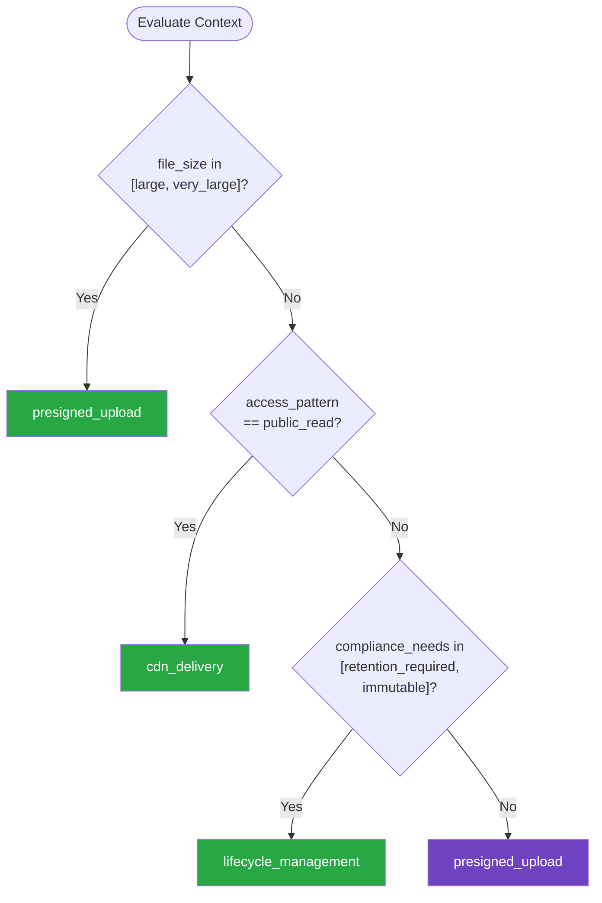

# File Storage — Summary

Purpose
- File and object storage patterns including upload handling, CDN integration, access control, lifecycle management, and secure presigned URLs
- Scope: Covers both cloud object storage and structured file management

## Related Standards

| Standard | Relationship | Context |
|----------|-------------|---------|
| [cloud-architecture](../../infrastructure/cloud-architecture/) | complementary | Object storage is a core cloud service primitive |
| [performance-optimization](../../security-quality/performance-optimization/) | complementary | CDN and caching strategies for file delivery |
| [api-design](../../foundational/api-design/) | complementary | File upload/download APIs follow RESTful patterns |

## Context Inputs

These inputs drive the decision tree — provide them to get a tailored recommendation.

| Input | Type | Required | Default | Values | Description |
|-------|------|----------|---------|--------|-------------|
| storage_type | enum | yes | object_storage | object_storage, block_storage, file_system, database_blob | Type of file storage needed |
| access_pattern | enum | yes | public_read | public_read, authenticated_read, private, write_once_read_many | How files are primarily accessed |
| file_size | enum | no | medium | small, medium, large, very_large | Typical file size range |
| compliance_needs | enum | no | standard | standard, retention_required, immutable, gdpr_deletable | Regulatory requirements for stored files |

## Decision Tree

### Mermaid Diagram



### Text Fallback

- **Priority 1** → `presigned_upload` — when file_size in [large, very_large]. Large files must bypass your application server. Use presigned URLs for direct client-to-storage uploads to avoid memory pressure and timeout issues.
- **Priority 2** → `cdn_delivery` — when access_pattern == public_read. Public files should be served through a CDN for performance and to reduce origin load.
- **Priority 3** → `lifecycle_management` — when compliance_needs in [retention_required, immutable]. Compliance requirements need lifecycle policies, retention locks, and audit trails for all file operations.
- **Fallback** → `presigned_upload` — Presigned URLs are the safest default for most file storage needs

> **Confidence**: high | **Risk if wrong**: medium

---

## Patterns

### 1. Presigned URL Upload/Download

> Client uploads files directly to object storage using time-limited, pre-authorized URLs. Your server generates the presigned URL with constraints (max size, content type, expiration) but never handles the file bytes. Eliminates server as a bottleneck for large uploads.

**Maturity**: standard

**Use when**
- Any file upload from client to object storage
- Large files that would strain application servers
- Reducing server bandwidth and memory usage

**Avoid when**
- Files need server-side processing before storage (virus scan, transformation)
- File content must be validated by application logic before storing

**Tradeoffs**

| Pros | Cons |
|------|------|
| Server never handles file bytes — no memory/bandwidth pressure | Two-step process: get URL, then upload |
| Direct client-to-storage transfer — faster for users | Post-upload processing must be event-driven (storage trigger) |
| Time-limited and constrained — secure by default | Client must handle the presigned URL flow |
| Scales independently of application servers | |

**Implementation Guidelines**
- Set short expiration on presigned URLs (5-15 minutes)
- Constrain by content type, max file size, and target path
- Use unique object keys (UUID prefix) to prevent collisions
- Trigger post-upload processing via storage events (S3 notification, etc.)
- Validate file after upload — virus scan, content type verification
- Store metadata (uploader, purpose, original name) in database, not filename
- Never expose internal storage paths to clients

**Common Errors**

| Error | Impact | Fix |
|-------|--------|-----|
| Long-lived presigned URLs (hours or days) | URL can be shared and reused beyond intended recipient | Set expiration to 5-15 minutes; generate fresh URL per upload |
| No content type constraint on presigned URL | Client can upload any file type, bypassing validation | Set allowed content types in presigned URL conditions |
| Storing files with user-provided filenames | Path traversal attacks, filename collisions, encoding issues | Use UUID keys; store original filename as metadata in database |

**Standards & References**

| Standard | Type | Role | Reference |
|----------|------|------|-----------|
| AWS S3 Presigned URLs | reference | AWS documentation for presigned URL generation | — |
| Azure Blob SAS Tokens | reference | Azure shared access signatures for blob storage | — |

---

### 2. CDN-Based File Delivery

> Serve files through a Content Delivery Network for global low-latency access. Origin storage holds the master copy; CDN caches at edge locations. Use signed URLs for access control with CDN.

**Maturity**: standard

**Use when**
- Public or semi-public file access (images, documents, media)
- Global user base needing low latency
- High read volume relative to writes

**Avoid when**
- Strictly private files with per-request authorization
- Frequently changing files where caching causes staleness

**Tradeoffs**

| Pros | Cons |
|------|------|
| Low latency globally — served from edge | Cache invalidation complexity |
| Reduces origin storage load and bandwidth costs | Additional cost for CDN service |
| DDoS protection at CDN layer | Stale content risk for frequently changing files |
| Automatic scaling for traffic spikes | |

**Implementation Guidelines**
- Set appropriate Cache-Control headers per file type
- Use immutable URLs for versioned assets (hash in filename/path)
- Implement cache invalidation for mutable content
- Use signed CDN URLs for access-controlled content
- Configure origin shield to reduce origin requests
- Monitor cache hit ratio as a key metric (target >90%)

**Common Errors**

| Error | Impact | Fix |
|-------|--------|-----|
| No cache invalidation strategy | Users see stale content after updates | Use versioned URLs (content hash) or explicit invalidation |
| Caching private content without signed URLs | CDN serves cached private content to unauthorized users | Use signed CDN URLs with expiration for access-controlled content |
| Same cache policy for all file types | Static assets under-cached; dynamic content over-cached | Set per-type policies: immutable for hashed assets, short TTL for dynamic |

**Standards & References**

| Standard | Type | Role | Reference |
|----------|------|------|-----------|
| RFC 9111 | rfc | HTTP Caching specification | — |

---

### 3. Storage Lifecycle & Retention Management

> Automate file lifecycle transitions: hot storage for recent files, cool/archive for old files, deletion after retention period. Supports compliance requirements like retention locks and legal holds.

**Maturity**: advanced

**Use when**
- Files have different access patterns over time
- Regulatory retention requirements
- Cost optimization for large storage volumes
- GDPR right-to-deletion requirements

**Avoid when**
- All files are actively accessed throughout their lifetime
- Small storage volume where tiering savings are negligible

**Tradeoffs**

| Pros | Cons |
|------|------|
| Significant cost savings from storage tiering | Retrieval latency for archived files |
| Automated compliance with retention policies | Lifecycle transition costs (per-object) |
| Legal hold support for litigation | Complexity of managing multiple storage tiers |
| Automated cleanup of expired content | |

**Implementation Guidelines**
- Define lifecycle rules per object prefix or tag
- Transition to cool storage after 30 days, archive after 90 (adjust per use case)
- Set retention locks for compliance-required files (WORM)
- Implement soft-delete with recovery period before hard delete
- Tag files with retention class at upload time
- Build GDPR deletion pipeline that handles all storage tiers
- Monitor storage costs by tier and lifecycle transition metrics

**Common Errors**

| Error | Impact | Fix |
|-------|--------|-----|
| No lifecycle policy — files accumulate forever | Storage costs grow unbounded; no compliance enforcement | Define lifecycle rules with appropriate transitions and expiration |
| Hard-delete without retention period | Accidental deletions are unrecoverable | Soft-delete with 30-day recovery period before permanent deletion |
| No legal hold mechanism | Cannot preserve evidence during litigation | Implement legal hold that overrides lifecycle deletion |

**Standards & References**

| Standard | Type | Role | Reference |
|----------|------|------|-----------|
| SEC Rule 17a-4 | standard | Financial records retention requirements | — |
| GDPR Article 17 | standard | Right to erasure requirements | — |

---

## Examples

### Secure File Upload with Presigned URL
**Context**: User uploading a profile image through a web application

**Correct** implementation:
```python
# Server-side: Generate presigned upload URL
import boto3
import uuid

def create_upload_url(user_id: str, content_type: str, max_size_mb: int = 5):
    """Generate constrained presigned URL for direct upload."""
    s3 = boto3.client("s3")

    # UUID key — never use user-provided filenames
    object_key = f"uploads/{user_id}/{uuid.uuid4()}"

    # Constrained presigned URL
    presigned = s3.generate_presigned_post(
        Bucket=UPLOAD_BUCKET,
        Key=object_key,
        Conditions=[
            ["content-length-range", 1, max_size_mb * 1024 * 1024],
            ["starts-with", "$Content-Type", "image/"],
        ],
        ExpiresIn=300,  # 5 minutes
    )

    # Store metadata in database (not in filename)
    db.save_upload_record(
        user_id=user_id,
        object_key=object_key,
        status="pending",
    )

    return {"upload_url": presigned["url"], "fields": presigned["fields"]}

# S3 event trigger: validate after upload
def on_upload_complete(event):
    """Triggered by S3 PutObject event."""
    key = event["Records"][0]["s3"]["object"]["key"]
    # Verify content type matches (don't trust client)
    # Run virus scan
    # Generate thumbnails if image
    # Update DB record to "processed"
```

**Incorrect** implementation:
```python
# WRONG: Server handles file bytes with no validation
@app.route("/upload", methods=["POST"])
def upload_file():
    file = request.files["file"]
    # No size limit — 10GB upload will OOM the server
    # No content type validation — accepts any file
    # User-controlled filename — path traversal risk
    file.save(f"/uploads/{file.filename}")
    return "OK"

# Problems:
# 1. Server processes entire file — memory/bandwidth bottleneck
# 2. No file size limit — denial of service risk
# 3. No content type validation — any file type accepted
# 4. User-controlled filename — path traversal attack vector
# 5. No virus scanning — malicious files stored and served
# 6. Local filesystem — doesn't scale, no redundancy
```

**Why**: The correct example uses presigned URLs so the server never handles file bytes, constrains upload by content type and size, uses UUID keys to prevent path traversal, and validates files post-upload via event triggers.

---

### CDN Configuration for Static Assets
**Context**: Serving user-uploaded images with CDN and signed URLs

**Correct** implementation:
```python
# CloudFront signed URL for access-controlled content
import datetime
from botocore.signers import CloudFrontSigner

def get_signed_image_url(object_key: str, expiry_minutes: int = 60):
    """Generate signed CDN URL for authorized access."""
    cloudfront_signer = CloudFrontSigner(
        KEY_PAIR_ID, rsa_signer_function
    )

    url = f"https://cdn.example.com/{object_key}"
    expires = datetime.datetime.utcnow() + datetime.timedelta(
        minutes=expiry_minutes
    )

    signed_url = cloudfront_signer.generate_presigned_url(
        url, date_less_than=expires
    )
    return signed_url

# Cache-Control headers (set on S3 object metadata)
# Immutable hashed assets: max-age=31536000, immutable
# User content: max-age=3600, stale-while-revalidate=86400
# Profile images: max-age=300, must-revalidate
```

**Incorrect** implementation:
```python
# WRONG: Serving files directly from application server
@app.route("/images/<path:filename>")
def serve_image(filename):
    # Server handles every request — no caching
    # No CDN — high latency for distant users
    # No access control — any file accessible by path
    return send_from_directory("/uploads", filename)

# Problems:
# 1. Application server serves files — doesn't scale
# 2. No CDN — poor performance for global users
# 3. No signed URLs — anyone with the path gets the file
# 4. No Cache-Control — browser and proxy caching undefined
```

**Why**: The correct example uses CDN with signed URLs for access control, appropriate cache headers per content type, and separates origin from edge delivery. The incorrect example serves files directly from the application server with no caching or access control.

---

## Security Hardening

### Transport
- All file uploads and downloads over HTTPS only
- CDN configured with TLS 1.2+ and modern cipher suites

### Data Protection
- Server-side encryption enabled on all storage buckets
- Customer-managed encryption keys for sensitive file categories

### Access Control
- Storage buckets are private by default — no public access
- Presigned URLs are time-limited (5-15 minutes) and constrained

### Input/Output
- Validate file content type server-side (don't trust client Content-Type)
- Enforce maximum file size limits
- Virus/malware scan all uploaded files before making accessible

### Secrets
- Storage access keys rotated regularly
- Use IAM roles instead of static credentials where possible

### Monitoring
- Log all file access with requester identity
- Alert on unusual upload/download patterns

---

## Anti-Patterns

| Anti-Pattern | Severity | Description | Fix |
|-------------|----------|-------------|-----|
| Server-Side File Proxying | high | Application server reads file bytes from storage and streams to client. Server becomes a bandwidth bottleneck, ties up threads, and doesn't scale. | Use presigned URLs for direct client-to-storage transfer |
| Public Storage Buckets | critical | Setting storage buckets to public access for convenience. All files are accessible to anyone with the URL. Data breaches from public S3 buckets are among the most common cloud security incidents. | Private buckets by default; use presigned/signed URLs for controlled access |
| User-Controlled File Paths | critical | Using user-provided filenames as storage keys. Enables path traversal attacks, filename collisions, and encoding issues. | Use UUID-based keys; store original filename as metadata in database |
| No File Validation After Upload | critical | Trusting the client-provided Content-Type header without server-side validation. Users can upload executables disguised as images, or malware that bypasses client-side checks. | Validate file content server-side using magic bytes; virus scan all uploads |

---

## Checklist

| ID | Category | Description | Severity |
|----|----------|-------------|----------|
| FS-01 | security | Storage buckets are private — no public access policies | critical |
| FS-02 | security | Server-side encryption enabled on all storage | critical |
| FS-03 | security | Presigned URLs time-limited (5-15 min) and constrained | high |
| FS-04 | security | File uploads validated: type, size, virus scan | critical |
| FS-05 | security | UUID-based storage keys — no user-controlled paths | critical |
| FS-06 | performance | CDN configured for public/semi-public content | high |
| FS-07 | performance | CDN cache hit ratio monitored (target >90%) | medium |
| FS-08 | compliance | Lifecycle policies configured for storage tiering | high |
| FS-09 | compliance | GDPR deletion capability verified across all tiers | high |
| FS-10 | observability | File access logging enabled with requester identity | high |
| FS-11 | reliability | Cross-region replication for critical files | medium |
| FS-12 | design | File storage abstracted behind interface for portability | medium |

---

## Compliance

| Standard | Relevance |
|----------|-----------|
| GDPR Article 17 | Right to erasure — must be able to delete user files |
| SOC 2 Type II | Access controls and encryption for stored data |

---

## Prompt Recipes

| ID | Scenario | Description |
|----|----------|-------------|
| fs_greenfield | greenfield | Design file storage from scratch |
| fs_audit | audit | Audit file storage security |
| fs_optimization | optimization | Optimize file storage costs and performance |
| fs_migration | migration | Migrate file storage between providers |

---

## Links
- Full standard: [file-storage.yaml](file-storage.yaml)
