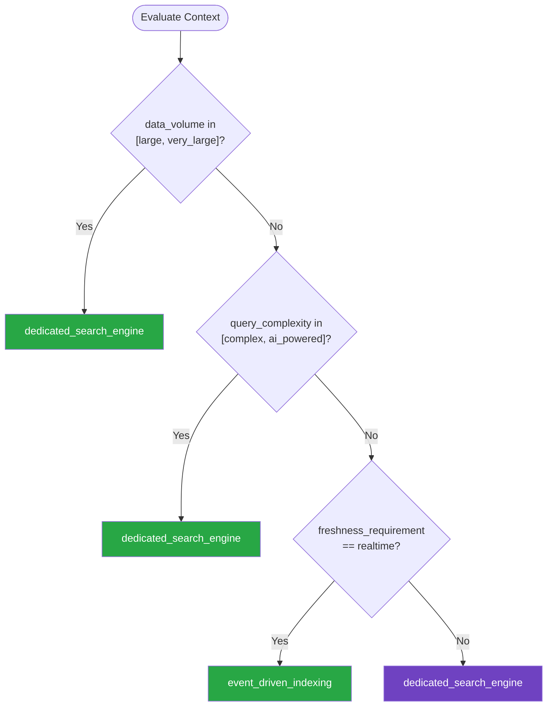

# Search — Summary

Purpose
- Search infrastructure patterns including full-text search engines, indexing strategies, query optimization, faceted search, and search relevance tuning
- Scope: Covers both dedicated search engines and database full-text search capabilities

## Related Standards

| Standard | Relationship | Context |
|----------|-------------|---------|
| [api-design](../../foundational/api-design/) | complementary | Search APIs follow RESTful query patterns |
| [logging-observability](../../foundational/logging-observability/) | complementary | Search query analytics drive relevance tuning |
| [data-transformation](../data-transformation/) | complementary | Data must be transformed and enriched before indexing |

## Context Inputs

These inputs drive the decision tree — provide them to get a tailored recommendation.

| Input | Type | Required | Default | Values | Description |
|-------|------|----------|---------|--------|-------------|
| search_engine | enum | yes | dedicated_engine | dedicated_engine, database_fulltext, hybrid | Search engine technology |
| data_volume | enum | yes | medium | small, medium, large, very_large | Volume of searchable data |
| query_complexity | enum | no | moderate | simple, moderate, complex, ai_powered | Complexity of search queries |
| freshness_requirement | enum | no | near_realtime | realtime, near_realtime, periodic, batch | How quickly new data must be searchable |

## Decision Tree

### Mermaid Diagram



### Text Fallback

- **Priority 1** → `dedicated_search_engine` — when data_volume in [large, very_large]. Large data volumes require dedicated search infrastructure. Database full-text search doesn't scale for complex queries across millions of documents.
- **Priority 2** → `dedicated_search_engine` — when query_complexity in [complex, ai_powered]. Complex queries (faceted search, fuzzy matching, boosting, synonyms, vector search) require a dedicated search engine.
- **Priority 3** → `event_driven_indexing` — when freshness_requirement == realtime. Real-time search freshness requires event-driven indexing that updates the search index as data changes occur.
- **Fallback** → `dedicated_search_engine` — A dedicated search engine handles most use cases and scales well

> **Confidence**: high | **Risk if wrong**: medium

---

## Patterns

### 1. Dedicated Search Engine (Elasticsearch/OpenSearch)

> Use a dedicated search engine as a read-optimized view of your data. The primary database remains the source of truth; the search engine is an eventually-consistent index optimized for query performance. Supports full-text search, facets, aggregations, fuzzy matching, and relevance scoring.

**Maturity**: standard

**Use when**
- Full-text search across large document collections
- Faceted search and filtering (e-commerce, catalogs)
- Complex queries: fuzzy matching, synonyms, boosting
- Aggregations and analytics on search data

**Avoid when**
- Simple keyword lookup on small datasets (< 100K records)
- Only need exact-match filtering (use database queries)

**Tradeoffs**

| Pros | Cons |
|------|------|
| Sub-second full-text search across millions of documents | Additional infrastructure to manage |
| Rich query DSL: fuzzy, proximity, boosting, synonyms | Eventually consistent with primary data store |
| Faceted search and aggregations built-in | Index mapping design affects query capabilities |
| Horizontal scaling with sharding | Operational complexity (sharding, replication, upgrades) |

**Implementation Guidelines**
- Index is a READ VIEW — primary database is source of truth
- Design index mapping for your query patterns, not your data model
- Use keyword fields for exact match/filter, text fields for full-text
- Configure analyzers per language and field type
- Implement query-time boosting for relevance tuning
- Set up index aliases for zero-downtime reindexing
- Monitor search latency, indexing lag, and cluster health

**Common Errors**

| Error | Impact | Fix |
|-------|--------|-----|
| Using search engine as primary database | Data loss risk — search engines optimize for read, not durability | Search engine is a derived read view; primary DB is source of truth |
| Indexing entire domain model as-is | Inefficient queries, bloated index, poor relevance | Design index mapping for query patterns — denormalize for search |
| No index aliases | Reindexing requires downtime or complex migration | Always query via alias; swap alias to new index for zero-downtime reindex |

**Standards & References**

| Standard | Type | Role | Reference |
|----------|------|------|-----------|
| Elasticsearch | tool | Distributed search and analytics engine | — |
| OpenSearch | tool | Open-source fork of Elasticsearch | — |

---

### 2. Event-Driven Search Indexing

> Keep search indexes fresh by reacting to data change events. When the primary database changes, publish an event that triggers index updates. Supports near-real-time search freshness without tightly coupling the write path to the search engine.

**Maturity**: advanced

**Use when**
- Search results must reflect recent data changes (< 1s delay)
- Multiple data sources feed into one search index
- Indexing logic is complex (enrichment, denormalization)

**Avoid when**
- Periodic batch reindexing is sufficient (e.g., nightly catalog refresh)
- Data changes very infrequently

**Tradeoffs**

| Pros | Cons |
|------|------|
| Near-real-time search freshness | Eventually consistent — brief lag between write and searchable |
| Decoupled from write path — doesn't slow down writes | Event infrastructure required (Kafka, SQS, etc.) |
| Can enrich/transform data during indexing | Must handle out-of-order and duplicate events |
| Replay events to rebuild index from scratch | |

**Implementation Guidelines**
- Publish domain events on data changes (CDC or application events)
- Index consumer processes events and updates search engine
- Make index updates idempotent — events may be delivered multiple times
- Include version/timestamp to handle out-of-order events
- Build full reindex capability by replaying all events
- Monitor indexing lag (time between event and searchable)
- Dead-letter queue for events that fail indexing

**Common Errors**

| Error | Impact | Fix |
|-------|--------|-----|
| Tight coupling: updating search index in the write transaction | Write performance degrades; search engine failures break writes | Publish event after commit; separate consumer updates search async |
| No full reindex capability | Index corruption or mapping changes require manual recovery | Build replay pipeline that can rebuild index from source of truth |
| Ignoring event ordering | Stale data overwrites fresh data in index | Use version numbers; only apply updates with higher version |

**Standards & References**

| Standard | Type | Role | Reference |
|----------|------|------|-----------|
| Change Data Capture | pattern | Capture database changes as events for downstream processing | — |

---

### 3. Database Full-Text Search

> Leverage built-in full-text search capabilities of relational databases (PostgreSQL tsvector, MySQL FULLTEXT). Sufficient for moderate data volumes with simple search requirements. Avoids the operational overhead of a dedicated search engine.

**Maturity**: standard

**Use when**
- Small to medium data volume (< 1M searchable records)
- Simple search requirements (keyword, phrase matching)
- Don't want to manage additional infrastructure
- Search data already in the primary database

**Avoid when**
- Complex queries: facets, fuzzy matching, synonyms, boosting
- Large data volume requiring horizontal scaling
- Sub-100ms search latency requirements at scale

**Tradeoffs**

| Pros | Cons |
|------|------|
| No additional infrastructure — uses existing database | Limited query capabilities compared to dedicated engines |
| Consistent with primary data (no sync lag) | Doesn't scale horizontally for search workloads |
| Simpler operations — one system to manage | Less control over relevance scoring and analyzers |
| Good enough for many use cases | |

**Implementation Guidelines**
- Create GIN index on tsvector column (PostgreSQL)
- Use language-specific text search configurations
- Materialize tsvector column (don't compute at query time)
- Combine full-text with standard WHERE clauses for filtering
- Use ts_rank for basic relevance scoring
- Monitor query performance — know when to graduate to dedicated engine

**Common Errors**

| Error | Impact | Fix |
|-------|--------|-----|
| LIKE '%search%' instead of full-text search | No index usage — full table scan on every query | Use proper full-text search: to_tsvector/to_tsquery in PostgreSQL |
| Computing tsvector at query time | Slow queries — text parsing on every search request | Store tsvector in a dedicated column; update via trigger |
| No plan for outgrowing database search | Expensive migration to dedicated engine under time pressure | Abstract search behind an interface; swap implementation when needed |

**Standards & References**

| Standard | Type | Role | Reference |
|----------|------|------|-----------|
| PostgreSQL Full-Text Search | reference | Built-in text search with tsvector and tsquery | — |

---

## Examples

### Search Architecture with Dedicated Engine
**Context**: E-commerce product search with facets and relevance

**Correct** implementation:
```python
# Architecture: Database (source of truth) → Events → Search Engine (read view)

# 1. Index mapping — designed for QUERIES, not data model
product_mapping = {
    "mappings": {
        "properties": {
            "name": {
                "type": "text",
                "analyzer": "standard",
                "fields": {"keyword": {"type": "keyword"}},  # For exact match/sort
            },
            "description": {"type": "text", "analyzer": "english"},
            "category": {"type": "keyword"},  # For faceted filtering
            "brand": {"type": "keyword"},
            "price": {"type": "float"},
            "rating": {"type": "float"},
            "in_stock": {"type": "boolean"},
            "tags": {"type": "keyword"},  # Multi-value facet
            "created_at": {"type": "date"},
        }
    }
}

# 2. Event-driven indexing
class ProductIndexer:
    def handle_product_updated(self, event: ProductUpdatedEvent):
        """Index product on change event — idempotent."""
        doc = {
            "name": event.product.name,
            "description": event.product.description,
            "category": event.product.category.name,
            "brand": event.product.brand,
            "price": float(event.product.price),
            "rating": float(event.product.avg_rating),
            "in_stock": event.product.stock > 0,
            "tags": [t.name for t in event.product.tags],
        }
        # Versioned upsert — handles out-of-order events
        self.es.index(
            index="products",
            id=str(event.product.id),
            body=doc,
            version=event.version,
            version_type="external",
        )

# 3. Search query with facets and boosting
def search_products(query: str, filters: dict, page: int = 1):
    body = {
        "query": {
            "bool": {
                "must": [
                    {"multi_match": {
                        "query": query,
                        "fields": ["name^3", "description", "tags^2"],
                        "fuzziness": "AUTO",
                    }}
                ],
                "filter": [
                    {"term": {"in_stock": True}},
                    *[{"term": {k: v}} for k, v in filters.items()],
                ],
            }
        },
        "aggs": {
            "categories": {"terms": {"field": "category"}},
            "brands": {"terms": {"field": "brand"}},
            "price_ranges": {"range": {"field": "price", "ranges": [
                {"to": 25}, {"from": 25, "to": 100}, {"from": 100},
            ]}},
        },
        "from": (page - 1) * 20,
        "size": 20,
    }
    return self.es.search(index="products", body=body)
```

**Incorrect** implementation:
```python
# WRONG: SQL LIKE search on large product catalog
def search_products(query, page=1):
    # Full table scan on every search — O(n) performance
    results = db.execute(
        "SELECT * FROM products WHERE name LIKE :q OR description LIKE :q",
        {"q": f"%{query}%"},
    ).fetchall()

    # No relevance scoring — results in database order
    # No faceted search — would require N additional queries
    # No fuzzy matching — "runnign shoes" finds nothing
    # No boosting — title matches ranked same as description

    return results[(page-1)*20 : page*20]

# Problems:
# 1. LIKE '%query%' = full table scan (no index usage)
# 2. No relevance scoring — irrelevant results ranked equally
# 3. No facets — can't show category/brand/price filters
# 4. No fuzzy matching — typos return no results
# 5. Application-level pagination — fetches ALL then slices
```

**Why**: The correct example uses a dedicated search engine with optimized index mapping, event-driven indexing for freshness, fuzzy matching, field boosting for relevance, and faceted search. The incorrect example uses SQL LIKE which doesn't scale and lacks search features.

---

### PostgreSQL Full-Text Search for Small Datasets
**Context**: Internal knowledge base search (< 100K articles)

**Correct** implementation:
```sql
-- PostgreSQL: Proper full-text search with GIN index

-- 1. Add tsvector column (materialized, not computed at query time)
ALTER TABLE articles ADD COLUMN search_vector tsvector;

-- 2. Populate and keep in sync via trigger
CREATE OR REPLACE FUNCTION articles_search_trigger() RETURNS trigger AS $$
BEGIN
  NEW.search_vector :=
    setweight(to_tsvector('english', COALESCE(NEW.title, '')), 'A') ||
    setweight(to_tsvector('english', COALESCE(NEW.body, '')), 'B');
  RETURN NEW;
END
$$ LANGUAGE plpgsql;

CREATE TRIGGER articles_search_update
  BEFORE INSERT OR UPDATE ON articles
  FOR EACH ROW EXECUTE FUNCTION articles_search_trigger();

-- 3. GIN index for fast search
CREATE INDEX idx_articles_search ON articles USING GIN (search_vector);

-- 4. Search query with ranking
SELECT id, title,
       ts_rank(search_vector, query) AS rank
FROM articles,
     to_tsquery('english', 'kubernetes & deployment') AS query
WHERE search_vector @@ query
ORDER BY rank DESC
LIMIT 20;
```

**Incorrect** implementation:
```sql
-- WRONG: LIKE search without full-text capabilities
SELECT * FROM articles
WHERE title LIKE '%kubernetes%' OR body LIKE '%kubernetes%';
-- Full table scan, no ranking, no stemming, no index
```

**Why**: PostgreSQL full-text search with tsvector, GIN index, and weighted ranking provides proper search capabilities without a dedicated engine. LIKE queries don't use indexes, don't rank results, and don't handle stemming or language-specific analysis.

---

## Security Hardening

### Transport
- Search engine cluster communication uses TLS
- Search API endpoints protected by authentication

### Data Protection
- Sensitive fields excluded from search index or field-level encrypted
- Search queries do not expose data beyond user's access scope

### Access Control
- Search results filtered by user's authorization scope
- Admin-only access to index management operations

### Input/Output
- Search queries sanitized — prevent injection into query DSL
- Result highlighting escaped to prevent XSS in rendered results

### Secrets
- Search engine credentials stored in secrets manager
- API keys for search service rotated regularly

### Monitoring
- Search query patterns logged for analytics and abuse detection
- Index health, cluster status, and query latency monitored

---

## Anti-Patterns

| Anti-Pattern | Severity | Description | Fix |
|-------------|----------|-------------|-----|
| LIKE '%query%' as Search | high | Using SQL LIKE with leading wildcard for search. Cannot use database indexes (full table scan on every query), no relevance ranking, no stemming, no fuzzy matching. | Use PostgreSQL full-text search (tsvector/tsquery) or dedicated search engine |
| Search Engine as Source of Truth | critical | Treating the search engine as the primary database. Search engines optimize for query performance, not data durability. | Search engine is a derived read view; primary database is source of truth |
| Indexing in the Write Path | high | Updating the search index synchronously in the database write transaction. Search engine latency slows every write; search engine failures block database writes. | Publish events after commit; update search index asynchronously |
| No Relevance Tuning | medium | Using default relevance scoring without tuning for the specific use case. Users get poor results, don't find what they need, and stop using search. | Implement field boosting, analyze search analytics, A/B test relevance changes |

---

## Checklist

| ID | Category | Description | Severity |
|----|----------|-------------|----------|
| SCH-01 | design | Search engine is a read view — primary DB is source of truth | critical |
| SCH-02 | design | Index mapping designed for query patterns, not data model | high |
| SCH-03 | reliability | Full reindex capability exists and tested regularly | high |
| SCH-04 | performance | Search latency p95 within SLA (typically < 200ms) | high |
| SCH-05 | correctness | Indexing lag monitored and within freshness SLA | high |
| SCH-06 | security | Search results filtered by user authorization scope | critical |
| SCH-07 | security | Query input sanitized to prevent injection | high |
| SCH-08 | observability | Search analytics collected (queries, no-results, click-through) | medium |
| SCH-09 | performance | Index aliases used for zero-downtime reindexing | high |
| SCH-10 | compliance | Deleted data removed from search index promptly | high |
| SCH-11 | observability | Cluster health and shard status monitored with alerts | high |
| SCH-12 | reliability | Dead-letter handling for failed indexing events | high |

---

## Compliance

| Standard | Relevance |
|----------|-----------|
| GDPR | Search indexes must respect data deletion and access controls |
| SOC 2 | Search data access controls and audit logging |

---

## Prompt Recipes

| ID | Scenario | Description |
|----|----------|-------------|
| search_greenfield | greenfield | Design search infrastructure from scratch |
| search_optimization | optimization | Optimize search relevance and performance |
| search_audit | audit | Audit search infrastructure |
| search_migration | migration | Migrate from database search to dedicated engine |

---

## Links
- Full standard: [search.yaml](search.yaml)
