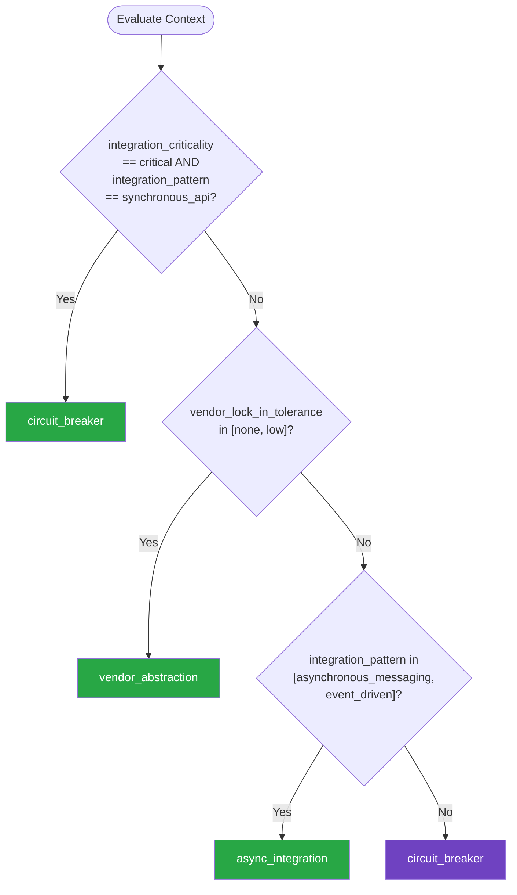

# Third Party Integration — Summary

Purpose
- Patterns for integrating with external APIs and third-party services covering vendor abstraction, resilience (circuit breakers, retries, bulkheads), contract management, and graceful degradation when dependencies fail
- Scope: Synchronous API, asynchronous messaging, batch import, and event-driven integration patterns

## Related Standards

| Standard | Relationship | Context |
|----------|-------------|---------|
| [rate-limiting](../../security-quality/rate-limiting/) | complementary | Respect third-party rate limits and implement client-side throttling |
| [authentication](../../foundational/authentication/) | complementary | API key management, OAuth client credentials for service-to-service auth |
| [encryption](../../security-quality/encryption/) | complementary | All external API communication must use TLS |
| [webhooks](../webhooks/) | complementary | Webhooks are an inbound integration pattern from third parties |

## Context Inputs

These inputs drive the decision tree — provide them to get a tailored recommendation.

| Input | Type | Required | Default | Values | Description |
|-------|------|----------|---------|--------|-------------|
| integration_criticality | enum | yes | important | critical, important, nice_to_have | How critical is the third-party service to your application |
| integration_pattern | enum | yes | synchronous_api | synchronous_api, asynchronous_messaging, batch_import, event_driven | Primary integration pattern |
| vendor_lock_in_tolerance | enum | no | low | none, low, medium, high | Tolerance for vendor-specific coupling |
| failure_tolerance | enum | no | degrade_gracefully | fail_fast, degrade_gracefully, queue_and_retry, use_cached_data | How the system should behave when the integration fails |

## Decision Tree

### Mermaid Diagram



### Text Fallback

- **Priority 1** → `circuit_breaker` — when integration_criticality == critical AND integration_pattern == synchronous_api. Critical synchronous integrations need circuit breakers to prevent cascading failures. Combine with retries and timeouts.
- **Priority 2** → `vendor_abstraction` — when vendor_lock_in_tolerance in [none, low]. When vendor lock-in must be minimized, wrap all external APIs behind an abstraction layer (adapter/port pattern).
- **Priority 3** → `async_integration` — when integration_pattern in [asynchronous_messaging, event_driven]. Asynchronous patterns decouple timing from external services. Use message queues or event streams for non-real-time integrations.
- **Fallback** → `circuit_breaker` — Circuit breakers protect against cascading failures from any integration

> **Confidence**: high | **Risk if wrong**: high

---

## Patterns

### 1. Circuit Breaker with Retry & Timeout

> Protect your application from cascading failures when third-party services are slow or unavailable. The circuit breaker monitors failure rates and trips open when a threshold is exceeded, failing fast instead of waiting. Combined with exponential backoff retries and hard timeouts.

**Maturity**: standard

**Use when**
- Synchronous calls to external APIs
- Service has history of intermittent failures
- Failure of external service could cascade to your users

**Avoid when**
- Fire-and-forget operations where failure is acceptable
- Batch jobs with built-in retry mechanisms

**Tradeoffs**

| Pros | Cons |
|------|------|
| Prevents cascading failures from slow/down services | Adds complexity to call paths |
| Fails fast — doesn't tie up threads waiting for timeouts | Tuning thresholds requires production traffic data |
| Auto-recovery via half-open state | Half-open probes may impact already-stressed services |
| Observable — circuit state is a health indicator | |

**Implementation Guidelines**
- Set aggressive timeouts (e.g., 3s connect, 10s read for most APIs)
- Use exponential backoff with jitter for retries (not fixed intervals)
- Limit retry count (typically 2-3 retries max)
- Circuit trips open after N failures in a sliding window (e.g., 5 in 60s)
- Half-open state allows single probe request to test recovery
- Log circuit state transitions for alerting
- Provide fallback behavior when circuit is open

**Common Errors**

| Error | Impact | Fix |
|-------|--------|-----|
| No timeout on HTTP client calls | Thread pool exhaustion when third-party hangs; cascading failure | Always set connect and read timeouts on every HTTP client |
| Retrying non-idempotent operations | Duplicate side effects (double charges, duplicate records) | Only retry idempotent operations (GET, PUT, DELETE with idempotency key) |
| Same retry timing for all services | Retry storms overwhelm recovering services | Use exponential backoff with jitter; tune per-service |

**Standards & References**

| Standard | Type | Role | Reference |
|----------|------|------|-----------|
| Resilience4j | framework | JVM circuit breaker and resilience library | — |
| Polly | framework | .NET resilience and transient-fault-handling library | — |

---

### 2. Vendor Abstraction Layer (Anti-Corruption Layer)

> Wrap third-party APIs behind your own interfaces to prevent vendor coupling from leaking into your domain. Uses the Ports & Adapters pattern: your code depends on a port (interface), and the vendor-specific adapter implements it. Switching vendors only requires a new adapter.

**Maturity**: standard

**Use when**
- Vendor lock-in must be minimized
- Multiple vendors may be evaluated or swapped
- Third-party API models conflict with your domain model

**Avoid when**
- Prototyping / proof-of-concept with a single known vendor
- One-time integrations with no future change risk

**Tradeoffs**

| Pros | Cons |
|------|------|
| Swap vendors without changing business logic | Upfront abstraction cost (define interfaces, map models) |
| Test with fakes/stubs instead of real API calls | Risk of leaky abstraction if interface is too vendor-shaped |
| Your domain model stays clean — no vendor types leaking in | May lose access to vendor-specific optimizations |
| Multiple implementations for multi-provider strategies | |

**Implementation Guidelines**
- Define interfaces in YOUR domain language, not the vendor's
- Map vendor responses to your domain models at the adapter boundary
- Keep adapter implementations thin — translate, don't add business logic
- Use dependency injection to wire adapters
- Create a stub/fake adapter for testing from day one
- Document vendor-specific quirks in the adapter, not in business code

**Common Errors**

| Error | Impact | Fix |
|-------|--------|-----|
| Interface shaped exactly like one vendor's API | Abstraction is useless — switching vendors still requires interface changes | Design interface around YOUR needs, not the vendor's endpoint shapes |
| Business logic in adapters | Logic must be duplicated across adapters when switching vendors | Adapters only translate — business logic lives in domain services |
| Vendor types in domain model | Vendor dependency spreads through codebase; switching is a rewrite | Map at the boundary; domain model uses its own types |

**Standards & References**

| Standard | Type | Role | Reference |
|----------|------|------|-----------|
| Hexagonal Architecture | pattern | Ports & Adapters pattern for external dependency isolation | — |
| Anti-Corruption Layer | pattern | DDD pattern for isolating external model influence | — |

---

### 3. Asynchronous Integration with Message Queues

> Decouple from third-party timing by using message queues or event streams as an intermediary. Your application publishes a message; a consumer processes it and calls the external API. Failures are retried from the queue with dead-letter handling for poison messages.

**Maturity**: standard

**Use when**
- Integration doesn't need synchronous response
- Third-party service is unreliable or slow
- Need to buffer/smooth traffic spikes to external APIs
- Batch processing of external API calls

**Avoid when**
- User expects immediate synchronous response from third party
- Simple request-response patterns with reliable services

**Tradeoffs**

| Pros | Cons |
|------|------|
| Decouples your latency from external service latency | Added infrastructure (message broker) |
| Built-in retry via queue redelivery | Eventual consistency — result not immediately available |
| Dead-letter queue captures persistent failures for investigation | More complex error handling and monitoring |
| Smooths traffic spikes — external API sees steady rate | |

**Implementation Guidelines**
- Use dead-letter queue for messages that fail after max retries
- Make consumers idempotent — messages may be delivered more than once
- Set visibility timeout longer than expected processing time
- Monitor queue depth and consumer lag as health indicators
- Implement poison message detection (repeated failures on same message)
- Store correlation IDs for tracing async flows end-to-end

**Common Errors**

| Error | Impact | Fix |
|-------|--------|-----|
| No dead-letter queue configured | Poison messages block the queue indefinitely | Always configure DLQ with alerting on DLQ depth |
| Non-idempotent consumers | Duplicate processing on redelivery | Use idempotency keys; check before processing |
| No visibility timeout tuning | Message redelivered while still being processed — duplicate work | Set visibility timeout to 2-3x expected processing time |

**Standards & References**

| Standard | Type | Role | Reference |
|----------|------|------|-----------|
| CloudEvents | spec | Specification for describing event data in a common format | — |

---

### 4. Consumer-Driven Contract Testing

> Verify that third-party API behavior matches your expectations by recording contract tests. Contracts capture the specific fields, types, and behaviors your code depends on — not the full API surface. Run contracts regularly to detect breaking changes early.

**Maturity**: advanced

**Use when**
- Depending on third-party APIs that may change without notice
- Multiple microservices consume the same external API differently
- Want early warning of breaking API changes

**Avoid when**
- Third-party provides their own contract/SDK with strong versioning
- One-off data imports with no ongoing dependency

**Tradeoffs**

| Pros | Cons |
|------|------|
| Early detection of breaking changes from third parties | Contracts must be maintained as your usage evolves |
| Documents exactly which API fields your code depends on | Can't test third-party business logic, only structure |
| Faster feedback than end-to-end tests | Requires running contracts on a schedule (not just on deploy) |

**Implementation Guidelines**
- Record contracts from actual API responses (not from docs alone)
- Test only fields your code reads — not the full response
- Run contract tests on schedule (daily) not just on your deploys
- Version your contracts alongside the code that depends on them
- Alert on contract failures — they indicate upstream breaking changes
- Use Pact or similar tool for consumer-driven contracts

**Common Errors**

| Error | Impact | Fix |
|-------|--------|-----|
| Testing the full API response instead of consumed fields | False positives on irrelevant field changes | Contract should only assert on fields your code actually uses |
| Running contracts only on deploy | Third-party changes between your deploys go undetected | Schedule contract tests to run daily regardless of your deploy cycle |
| Writing contracts from documentation instead of real responses | Contract may not match actual API behavior | Record from real API responses; update contracts from production traffic |

**Standards & References**

| Standard | Type | Role | Reference |
|----------|------|------|-----------|
| Pact | tool | Consumer-driven contract testing framework | — |
| OpenAPI | spec | API specification for structural contract definition | — |

---

## Examples

### Circuit Breaker with Fallback for Payment Gateway
**Context**: E-commerce service calling a payment gateway

**Correct** implementation:
```python
# Python — using tenacity for retries + custom circuit breaker
import httpx
from tenacity import retry, stop_after_attempt, wait_exponential_jitter

class PaymentGatewayAdapter:
    """Adapter wrapping payment vendor behind our PaymentPort interface."""

    def __init__(self, base_url: str, api_key: str):
        self._client = httpx.Client(
            base_url=base_url,
            timeout=httpx.Timeout(connect=3.0, read=10.0),  # Always set timeouts
            headers={"Authorization": f"Bearer {api_key}"},
        )
        self._circuit = CircuitBreaker(
            failure_threshold=5,
            recovery_timeout=30,
        )

    @retry(
        stop=stop_after_attempt(3),
        wait=wait_exponential_jitter(initial=1, max=10),
        retry=retry_if_exception_type(httpx.TransportError),
    )
    def charge(self, amount_cents: int, idempotency_key: str) -> ChargeResult:
        """Charge with circuit breaker, retries, and idempotency."""
        if self._circuit.is_open:
            raise ServiceUnavailableError("Payment gateway circuit open")

        try:
            response = self._client.post(
                "/v1/charges",
                json={"amount": amount_cents, "currency": "usd"},
                headers={"Idempotency-Key": idempotency_key},
            )
            response.raise_for_status()
            self._circuit.record_success()
            return self._map_to_domain(response.json())
        except httpx.HTTPStatusError as e:
            if e.response.status_code >= 500:
                self._circuit.record_failure()
                raise  # Retry on server errors
            raise PaymentError(self._map_error(e))  # Don't retry client errors

    def _map_to_domain(self, vendor_response: dict) -> ChargeResult:
        """Map vendor response to our domain model — adapter boundary."""
        return ChargeResult(
            id=vendor_response["id"],
            status=ChargeStatus(vendor_response["status"]),
            amount_cents=vendor_response["amount"],
        )
```

**Incorrect** implementation:
```python
# WRONG: No timeouts, no circuit breaker, vendor types leak through
import requests

def charge_customer(amount, card_token):
    # No timeout — will hang if gateway is slow
    response = requests.post(
        "https://api.payment-vendor.com/v1/charges",
        json={"amount": amount, "source": card_token},
        headers={"Authorization": f"Bearer {API_KEY}"},
    )
    # No retry logic — one failure = user error
    # No circuit breaker — keeps calling failing service
    return response.json()  # Vendor JSON leaks into domain

# Problems:
# 1. No timeout → thread pool exhaustion
# 2. No retry → transient failures become user-facing errors
# 3. No circuit breaker → cascading failure risk
# 4. No idempotency key → retries cause double charges
# 5. Vendor response leaks into domain
```

**Why**: The correct example uses timeouts, retries with exponential backoff, circuit breaker, idempotency keys, and maps vendor responses to domain types at the adapter boundary. The incorrect example has none of these protections.

---

### Vendor Abstraction for Email Service
**Context**: Application sending emails through a third-party email service

**Correct** implementation:
```python
# Domain port — defines what WE need, not what the vendor provides
from abc import ABC, abstractmethod

class EmailPort(ABC):
    @abstractmethod
    def send(self, to: str, subject: str, body_html: str,
             reply_to: str | None = None) -> EmailResult:
        ...

# Vendor adapter — translates between our model and vendor API
class SendGridAdapter(EmailPort):
    def __init__(self, api_key: str):
        self._client = sendgrid.SendGridAPIClient(api_key=api_key)

    def send(self, to: str, subject: str, body_html: str,
             reply_to: str | None = None) -> EmailResult:
        message = Mail(
            from_email=Email("noreply@ourapp.com"),
            to_emails=To(to),
            subject=subject,
            html_content=Content("text/html", body_html),
        )
        response = self._client.send(message)
        return EmailResult(
            success=response.status_code == 202,
            provider_id=response.headers.get("X-Message-Id"),
        )

# Test fake — no external calls needed
class FakeEmailAdapter(EmailPort):
    def __init__(self):
        self.sent: list[dict] = []

    def send(self, to, subject, body_html, reply_to=None) -> EmailResult:
        self.sent.append({"to": to, "subject": subject})
        return EmailResult(success=True, provider_id="fake-123")

# Switching to Mailgun = new adapter, zero business logic changes
```

**Incorrect** implementation:
```python
# WRONG: SendGrid coupled directly into business logic
import sendgrid
from sendgrid.helpers.mail import Mail, Email, To, Content

class OrderService:
    def complete_order(self, order):
        # SendGrid types used directly in business logic
        message = Mail(
            from_email=Email("noreply@ourapp.com"),
            to_emails=To(order.customer_email),
            subject=f"Order {order.id} confirmed",
            html_content=Content("text/html", render_template(order)),
        )
        sg = sendgrid.SendGridAPIClient(api_key=os.environ["SENDGRID_KEY"])
        sg.send(message)  # No error handling, no abstraction

# Problems:
# 1. SendGrid types in business logic — vendor lock-in
# 2. Can't test without calling SendGrid (or mocking their SDK)
# 3. Switching to Mailgun requires rewriting OrderService
# 4. No error handling for send failures
```

**Why**: The correct example defines an EmailPort in domain language, implements vendor-specific adapters, and provides a fake for testing. Switching vendors only requires a new adapter. The incorrect example couples vendor SDK types directly into business logic.

---

## Security Hardening

### Transport
- All external API calls use TLS 1.2+ — never plain HTTP
- Verify TLS certificates — never disable certificate validation

### Data Protection
- Do not log full request/response bodies from third parties (may contain PII)
- Sanitize external data before storing — treat as untrusted input

### Access Control
- Use least-privilege API keys scoped to required operations only
- Rotate API keys on a scheduled basis (at least annually)

### Input/Output
- Validate and sanitize all data received from third-party APIs
- Never pass external data directly to SQL, HTML, or shell execution

### Secrets
- Store API keys in secrets manager — never in code or config files
- Use separate API keys per environment (dev, staging, prod)

### Monitoring
- Monitor third-party API latency, error rates, and circuit breaker state
- Alert on rate limit proximity and circuit breaker state changes

---

## Anti-Patterns

| Anti-Pattern | Severity | Description | Fix |
|-------------|----------|-------------|-----|
| No Timeouts on External Calls | critical | Making HTTP calls to third-party services without setting connect and read timeouts. When the external service hangs, your threads hang with it, leading to thread pool exhaustion and cascading failure. | Always set connect timeout (3-5s) and read timeout (10-30s) on every HTTP client |
| Vendor Coupling in Domain Logic | high | Using third-party SDK types and vendor-specific data structures directly in business logic. Switching vendors requires rewriting business code. | Define ports in domain language; implement vendor adapters at the boundary |
| Retrying Non-Idempotent Operations | critical | Automatically retrying operations that have side effects without idempotency keys. Each retry creates a duplicate side effect. | Only retry idempotent operations; use idempotency keys for side-effecting calls |
| Swallowing Integration Errors | high | Catching all exceptions from third-party calls and returning empty/default data without logging or alerting. Integration failures go undetected. | Log errors with context, emit metrics, alert on error rate thresholds |

---

## Checklist

| ID | Category | Description | Severity |
|----|----------|-------------|----------|
| TPI-01 | reliability | All external HTTP calls have connect and read timeouts configured | critical |
| TPI-02 | reliability | Circuit breakers configured for synchronous third-party calls | critical |
| TPI-03 | reliability | Retries use exponential backoff with jitter | high |
| TPI-04 | correctness | Only idempotent operations are retried automatically | critical |
| TPI-05 | design | Vendor APIs wrapped behind domain-language abstractions | high |
| TPI-06 | security | API keys stored in secrets manager, not code or config | critical |
| TPI-07 | security | TLS 1.2+ enforced for all external API calls | critical |
| TPI-08 | observability | External call latency, error rate, and circuit state monitored | high |
| TPI-09 | correctness | Contract tests validate consumed third-party API fields | high |
| TPI-10 | reliability | Fallback behavior defined for critical integration failures | high |
| TPI-11 | security | Data received from third parties validated and sanitized | high |
| TPI-12 | observability | Distributed tracing spans cover external API calls | medium |

---

## Compliance

| Standard | Relevance |
|----------|-----------|
| OpenAPI 3.1 | Define and validate third-party API contracts |
| CloudEvents | Standard format for event-driven integrations |

---

## Prompt Recipes

| ID | Scenario | Description |
|----|----------|-------------|
| tpi_greenfield | greenfield | Design third-party integration from scratch |
| tpi_migration | migration | Migrate from direct SDK usage to abstracted integration |
| tpi_audit | audit | Audit third-party integration resilience |
| tpi_debugging | debugging | Debug third-party integration failures |

---

## Links
- Full standard: [third-party-integration.yaml](third-party-integration.yaml)
