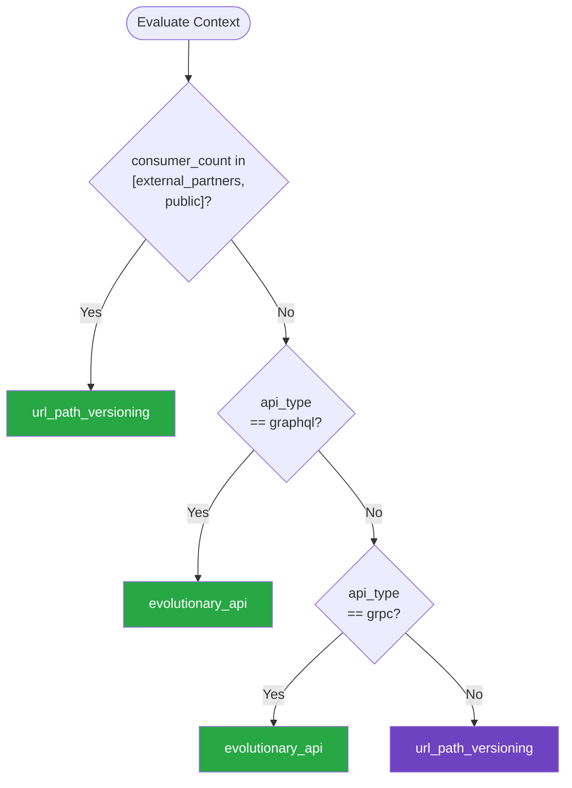

# Versioning — Summary

Purpose
- API versioning strategies, backward compatibility enforcement, deprecation policies, and migration planning
- Scope: Covers URL-based, header-based, and content-negotiation versioning with lifecycle management for evolving APIs

## Related Standards

| Standard | Relationship | Context |
|----------|-------------|---------|
| [third-party-integration](../third-party-integration/) | complementary | Third-party API consumers depend on version stability |
| [data-transformation](../data-transformation/) | complementary | Schema evolution is the data-layer analog of API versioning |
| [webhooks](../webhooks/) | complementary | Webhook payloads need versioning for consumer compatibility |

## Context Inputs

These inputs drive the decision tree — provide them to get a tailored recommendation.

| Input | Type | Required | Default | Values | Description |
|-------|------|----------|---------|--------|-------------|
| api_type | enum | yes | rest | rest, graphql, grpc, event_schema | Type of API being versioned |
| consumer_count | enum | yes | multiple_internal | single_internal, multiple_internal, external_partners, public | Number and type of API consumers |
| change_frequency | enum | no | moderate | rare, moderate, frequent | How often the API changes |
| breaking_change_tolerance | enum | no | low | none, low, moderate, high | Consumer tolerance for breaking changes |

## Decision Tree

### Mermaid Diagram



### Text Fallback

- **Priority 1** → `url_path_versioning` — when consumer_count in [external_partners, public]. Public APIs should use URL path versioning for maximum visibility and simplicity. Consumers can see the version in every request.
- **Priority 2** → `evolutionary_api` — when api_type == graphql. GraphQL APIs evolve by adding fields and deprecating old ones. Avoid breaking changes; use @deprecated directive.
- **Priority 3** → `evolutionary_api` — when api_type == grpc. gRPC/Protobuf APIs use package versioning and field numbering for backward-compatible evolution.
- **Fallback** → `url_path_versioning` — URL path versioning is the safest, most widely adopted approach

> **Confidence**: high | **Risk if wrong**: high

---

## Patterns

### 1. URL Path Versioning

> Include the API version in the URL path (e.g., /api/v1/users). The most widely adopted versioning strategy. Version is visible in every request, cacheable, and easy to understand. Multiple versions can run simultaneously behind a gateway.

**Maturity**: standard

**Use when**
- Public or partner-facing REST APIs
- APIs with many external consumers
- Want maximum visibility and simplicity

**Avoid when**
- GraphQL APIs (use evolutionary approach)
- Internal-only APIs that change frequently (overhead of maintaining versions)

**Tradeoffs**

| Pros | Cons |
|------|------|
| Most visible — version in every URL | URL bloat when version changes are frequent |
| Simple to understand and implement | Must maintain multiple API versions simultaneously |
| Easy to route at gateway/load balancer level | Temptation to increment version for every change |
| Cache-friendly — different versions are different URLs | |
| Widely adopted — consumers expect this pattern | |

**Implementation Guidelines**
- Use major version only in URL path: /api/v1/, /api/v2/
- Non-breaking changes DO NOT increment the version
- Run multiple versions simultaneously during migration period
- Gateway routes to version-specific backend services
- Set maximum number of concurrent versions (e.g., 2-3)
- Sunset policy: announce deprecation → grace period → remove
- Return Sunset and Deprecation headers on deprecated versions

**Common Errors**

| Error | Impact | Fix |
|-------|--------|-----|
| Incrementing version for non-breaking changes | Version proliferation — too many versions to maintain | Only new major versions for breaking changes; additive changes are non-breaking |
| No sunset policy for old versions | Old versions maintained indefinitely — growing maintenance burden | Define explicit sunset policy: 6-12 months notice, then remove |
| Versioning internal APIs used by one consumer | Overhead without benefit — just coordinate the deployment | Version only when consumers can't be updated simultaneously |

**Standards & References**

| Standard | Type | Role | Reference |
|----------|------|------|-----------|
| Semantic Versioning | spec | Version numbering standard (MAJOR.MINOR.PATCH) | https://semver.org/ |
| RFC 8594 | rfc | The Sunset HTTP Header Field | — |

---

### 2. Header-Based Versioning

> Specify API version in a custom header (e.g., Api-Version: 2) or Accept header with media type versioning (Accept: application/vnd.api.v2+json). Keeps URLs clean but makes versioning less visible.

**Maturity**: advanced

**Use when**
- Want to keep URLs clean and resource-oriented
- API evolution mostly additive with occasional breaking changes
- Sophisticated consumers that can set custom headers

**Avoid when**
- Public APIs with diverse consumer sophistication
- Consumers that cannot easily set custom headers

**Tradeoffs**

| Pros | Cons |
|------|------|
| Clean URLs — resources identified without version clutter | Less visible — version hidden in headers |
| Same URL for different representations | Harder to test in browser (can't just change URL) |
| Aligns with REST content negotiation principles | Some proxy/CDN layers don't vary on custom headers |

**Implementation Guidelines**
- Use custom header (Api-Version: 2) or Accept header versioning
- Default to latest stable version if no version header provided
- Return version in response headers for clarity
- Document header requirements prominently
- Configure CDN to vary on version header

**Common Errors**

| Error | Impact | Fix |
|-------|--------|-----|
| No default version when header is omitted | Requests without header fail or get unpredictable version | Default to latest stable version; return version in response header |
| CDN doesn't vary on version header | Cached v1 response served to v2 requester | Add version header to Vary response header; configure CDN accordingly |

**Standards & References**

| Standard | Type | Role | Reference |
|----------|------|------|-----------|
| RFC 9110 | rfc | HTTP Semantics — Content Negotiation | — |

---

### 3. Evolutionary API (Additive Changes Only)

> Evolve the API by only making additive, backward-compatible changes. Add new fields, endpoints, or operations without removing or changing existing ones. Deprecated items are marked but remain functional. Primary approach for GraphQL and gRPC APIs.

**Maturity**: advanced

**Use when**
- GraphQL APIs (primary approach)
- gRPC/Protobuf APIs (field numbering enables this)
- Internal APIs with coordinated consumers
- APIs where breaking changes are too costly

**Avoid when**
- Need to make fundamental structural changes
- Legacy field removal is necessary for security

**Tradeoffs**

| Pros | Cons |
|------|------|
| No version numbers to manage | API accumulates deprecated fields over time |
| Consumers upgrade at their own pace | Cannot remove fundamentally flawed designs easily |
| No parallel version maintenance | Requires discipline — easy to accidentally break compatibility |
| Continuous evolution without breaking changes | |

**Implementation Guidelines**
- Add new fields — never remove existing ones
- New fields must have defaults or be optional
- Mark deprecated fields with @deprecated (GraphQL) or comments
- Monitor usage of deprecated fields before removal
- Use field aliases for renames (add new, deprecate old)
- Protobuf: never reuse field numbers; mark removed fields as reserved
- Run backward-compatibility checks in CI

**Common Errors**

| Error | Impact | Fix |
|-------|--------|-----|
| Removing a field that consumers still use | Consumer applications break at runtime | Monitor field usage; deprecate; wait until usage drops to zero; then remove |
| Changing field type without new field | Serialization/deserialization failures for consumers | Add new field with new type; deprecate old field |
| Reusing Protobuf field numbers | Wire format corruption — data silently misinterpreted | Mark removed field numbers as reserved; never reuse them |

**Standards & References**

| Standard | Type | Role | Reference |
|----------|------|------|-----------|
| GraphQL | spec | Query language with built-in deprecation support | — |
| Protocol Buffers | format | Binary serialization with field number based evolution | — |

---

## Examples

### URL Path Versioning with Deprecation
**Context**: Public REST API migrating from v1 to v2

**Correct** implementation:
```python
# API Gateway configuration — run both versions simultaneously

# V1 — deprecated but still functional
# GET /api/v1/users/:id
@app.get("/api/v1/users/<user_id>")
def get_user_v1(user_id: str):
    user = user_service.get(user_id)
    response = jsonify({
        "id": user.id,
        "name": user.full_name,  # V1 flat name
        "email": user.email,
    })
    # Sunset headers — inform consumers of deprecation
    response.headers["Sunset"] = "Sat, 01 Nov 2026 00:00:00 GMT"
    response.headers["Deprecation"] = "true"
    response.headers["Link"] = '</api/v2/users>; rel="successor-version"'
    return response

# V2 — current version with improved structure
# GET /api/v2/users/:id
@app.get("/api/v2/users/<user_id>")
def get_user_v2(user_id: str):
    user = user_service.get(user_id)
    return jsonify({
        "id": user.id,
        "name": {  # V2 structured name
            "first": user.first_name,
            "last": user.last_name,
            "display": user.display_name,
        },
        "email": user.email,
        "created_at": user.created_at.isoformat(),
    })

# Breaking change rules:
# - Adding new fields to response: NOT breaking (v1 can add fields)
# - Removing a field from response: BREAKING (requires v2)
# - Adding optional query parameter: NOT breaking
# - Changing field type: BREAKING (requires v2)
# - Adding required parameter: BREAKING (requires v2)
```

**Incorrect** implementation:
```python
# WRONG: No versioning — breaking change in-place
@app.get("/api/users/<user_id>")
def get_user(user_id: str):
    user = user_service.get(user_id)
    return jsonify({
        "id": user.id,
        # BREAKING: Changed from "name" (string) to structured object
        "name": {
            "first": user.first_name,
            "last": user.last_name,
        },
        "email": user.email,
    })

# All consumers expecting "name" as string break simultaneously
# No deprecation notice — consumers had no warning
# No way for consumers to migrate gradually
# No rollback path — old format gone
```

**Why**: The correct example runs v1 and v2 simultaneously, includes Sunset headers to warn consumers of deprecation, and links to the successor version. Consumers can migrate at their own pace. The incorrect example makes a breaking change in-place with no version, no warning, and no migration path.

---

### Evolutionary GraphQL API
**Context**: Adding fields and deprecating old ones without breaking consumers

**Correct** implementation:
```graphql
# GraphQL schema — evolutionary approach

type User {
  id: ID!
  email: String!

  # Original field — deprecated but still functional
  name: String @deprecated(reason: "Use firstName and lastName instead")

  # New fields — additive change, non-breaking
  firstName: String
  lastName: String
  displayName: String

  # Added later — non-breaking (nullable by default)
  avatarUrl: String
  lastLoginAt: DateTime
}

# Query with both old and new fields works:
# query { user(id: "1") { name } }           ← still works
# query { user(id: "1") { firstName lastName } } ← new approach

# Deprecation lifecycle:
# 1. Add new fields (firstName, lastName)
# 2. Mark old field @deprecated
# 3. Monitor usage of deprecated field
# 4. When usage drops to zero → remove in future schema update
```

**Incorrect** implementation:
```graphql
# WRONG: Breaking change in GraphQL schema

type User {
  id: ID!
  email: String!
  # Field removed without deprecation — consumers break
  # name: String    ← deleted!
  firstName: String!  # Was nullable, now required — breaking
  lastName: String!
}

# Breaking changes:
# 1. Removed "name" field — queries using it fail
# 2. Changed nullability — clients not handling required break
# 3. No deprecation period — no migration warning
```

**Why**: Evolutionary API adds new fields and deprecates old ones with the @deprecated directive. Consumers are warned and can migrate at their pace. The incorrect example removes fields and changes nullability without deprecation, breaking all consumers.

---

## Security Hardening

### Transport
- All API versions served over TLS

### Data Protection
- Deprecated versions maintain same data protection as current

### Access Control
- Authentication required for all API versions equally
- Old API versions do not bypass newer security controls

### Input/Output
- Input validation applied to all active API versions
- Version parameter itself validated (reject invalid version strings)

### Secrets
- API keys valid across versions — no version-specific secrets

### Monitoring
- Track usage by API version for deprecation planning
- Alert when deprecated version usage exceeds threshold

---

## Anti-Patterns

| Anti-Pattern | Severity | Description | Fix |
|-------------|----------|-------------|-----|
| Breaking Changes Without Version Bump | critical | Making breaking changes (removing fields, changing types, renaming endpoints) without incrementing the API version. All consumers break simultaneously with no migration path and no warning. | Breaking changes require a new major version with parallel deployment |
| Version Proliferation | high | Incrementing the API version for every change, including non-breaking additive changes. Results in many concurrent versions that must all be maintained. | Only major versions for breaking changes; additive changes are non-breaking |
| No Sunset Policy | high | Old API versions maintained indefinitely because there's no defined deprecation timeline. The maintenance burden grows linearly with each new version. | Define sunset policy: deprecation notice → grace period (6-12mo) → removal |
| Deprecated Versions With Weaker Security | critical | Old API versions missing newer security controls (rate limiting, input validation, authentication improvements). Attackers target deprecated versions to bypass modern protections. | Apply all security controls equally to every active API version |

---

## Checklist

| ID | Category | Description | Severity |
|----|----------|-------------|----------|
| VER-01 | design | Versioning strategy defined and documented | high |
| VER-02 | design | Breaking vs non-breaking change definition documented | high |
| VER-03 | correctness | Backward compatibility checked in CI pipeline | high |
| VER-04 | compliance | Sunset policy defined with timeline | high |
| VER-05 | compliance | Deprecated versions include Sunset and Deprecation headers | medium |
| VER-06 | observability | API usage tracked per version for deprecation planning | high |
| VER-07 | security | All active versions have equal security controls | critical |
| VER-08 | design | Maximum concurrent active versions enforced (2-3) | medium |
| VER-09 | correctness | Migration guides provided for version transitions | high |
| VER-10 | security | Version parameter validated — invalid versions rejected | medium |
| VER-11 | maintainability | Non-breaking changes do not increment version | high |
| VER-12 | observability | Alerts configured when deprecated version usage exceeds threshold | medium |

---

## Compliance

| Standard | Relevance |
|----------|-----------|
| Semantic Versioning 2.0.0 | Standard for version numbering (MAJOR.MINOR.PATCH) |
| RFC 8594 | Sunset HTTP header for API deprecation |

---

## Prompt Recipes

| ID | Scenario | Description |
|----|----------|-------------|
| ver_greenfield | greenfield | Design API versioning strategy |
| ver_migration | migration | Migrate consumers between API versions |
| ver_audit | audit | Audit API versioning practices |
| ver_breaking_change | architecture | Handle a breaking API change |

---

## Links
- Full standard: [versioning.yaml](versioning.yaml)
