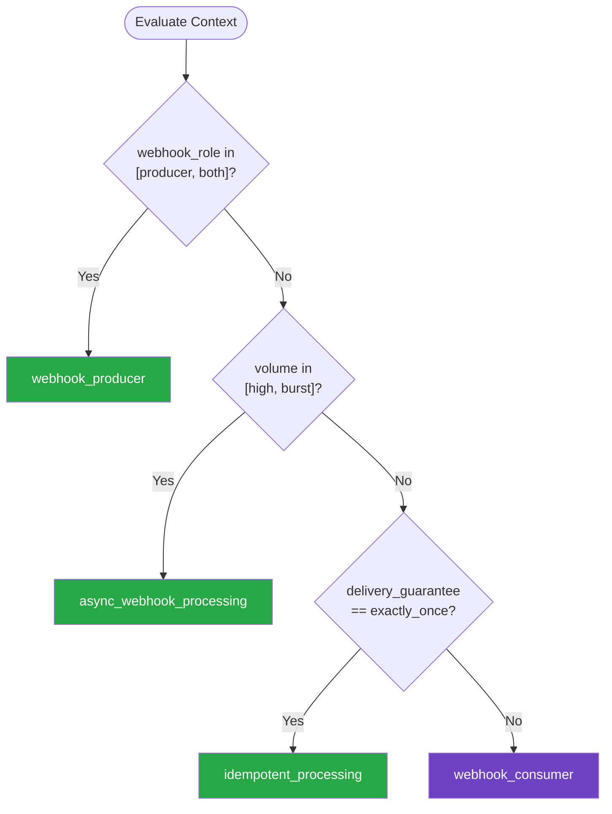

# Webhooks — Summary

Purpose
- Webhook design patterns for both producing and consuming event notifications over HTTP
- Scope: Covers delivery guarantees, signature verification, idempotent processing, retry policies, and security hardening for webhook endpoints

## Related Standards

| Standard | Relationship | Context |
|----------|-------------|---------|
| [third-party-integration](../third-party-integration/) | complementary | Webhooks are the inbound side of third-party integration |
| [rate-limiting](../../security-quality/rate-limiting/) | complementary | Webhook consumers may need to throttle high-volume producers |
| [error-handling](../../foundational/error-handling/) | complementary | Webhook delivery failures need structured retry and dead-letter handling |

## Context Inputs

These inputs drive the decision tree — provide them to get a tailored recommendation.

| Input | Type | Required | Default | Values | Description |
|-------|------|----------|---------|--------|-------------|
| webhook_role | enum | yes | consumer | producer, consumer, both | Are you producing or consuming webhooks |
| delivery_guarantee | enum | yes | at_least_once | best_effort, at_least_once, exactly_once | Required delivery guarantee level |
| volume | enum | no | moderate | low, moderate, high, burst | Expected webhook volume |
| security_requirement | enum | no | hmac_signature | none, shared_secret, hmac_signature, mutual_tls | Security level for webhook verification |

## Decision Tree

### Mermaid Diagram



### Text Fallback

- **Priority 1** → `webhook_producer` — when webhook_role in [producer, both]. Webhook producers must implement reliable delivery with retries, signature signing, and event type registration.
- **Priority 2** → `async_webhook_processing` — when volume in [high, burst]. High-volume webhook consumers should enqueue payloads immediately and process asynchronously to avoid back-pressure failures.
- **Priority 3** → `idempotent_processing` — when delivery_guarantee == exactly_once. Exactly-once semantics require idempotent processing since at-least-once delivery is the foundation — consumers deduplicate.
- **Fallback** → `webhook_consumer` — Most applications consume webhooks; focus on verification and idempotency

> **Confidence**: high | **Risk if wrong**: high

---

## Patterns

### 1. Reliable Webhook Producer

> Design a webhook delivery system that reliably notifies subscribers of events. Implements the outbox pattern for reliable publishing, cryptographic signature signing, exponential backoff retries, and event type registration for subscribers.

**Maturity**: advanced

**Use when**
- Your service needs to notify external systems of events
- Building a platform with partner/developer integrations
- Replacing polling-based integrations with push notifications

**Avoid when**
- Internal service-to-service events (use message broker instead)
- Real-time bidirectional communication needed (use WebSockets)

**Tradeoffs**

| Pros | Cons |
|------|------|
| Push-based — consumers get events immediately | Delivery reliability is your responsibility |
| HTTP-based — consumers don't need special infrastructure | Must handle consumer unavailability gracefully |
| Event type filtering — consumers subscribe to relevant events only | Signature verification adds complexity |

**Implementation Guidelines**
- Use outbox pattern: write event to DB in same transaction as domain change
- Sign payloads with HMAC-SHA256 using per-subscriber secrets
- Include timestamp in signature to prevent replay attacks
- Retry with exponential backoff: 1min, 5min, 30min, 2hr, 24hr
- Disable endpoint after N consecutive failures (e.g., 5 days)
- Provide webhook event log / delivery dashboard for subscribers
- Include event type, event ID, and timestamp in every payload
- Use POST with JSON body; return 2xx to acknowledge

**Common Errors**

| Error | Impact | Fix |
|-------|--------|-----|
| Sending webhook outside the database transaction | Event published but domain change rolled back — phantom event | Use transactional outbox: write to outbox table in same transaction |
| No signature on webhook payloads | Consumers cannot verify payload authenticity — spoofing risk | Sign all payloads with HMAC-SHA256; include signature in header |
| Blocking on webhook delivery in the request path | User request latency depends on webhook consumer response time | Deliver webhooks asynchronously — never in the user request path |

**Standards & References**

| Standard | Type | Role | Reference |
|----------|------|------|-----------|
| Standard Webhooks | spec | Specification for webhook signatures and delivery | https://www.standardwebhooks.com/ |
| CloudEvents | spec | Standard event envelope format | https://cloudevents.io/ |

---

### 2. Secure Webhook Consumer

> Safely receive and process webhook events from third-party services. Verify signatures before processing, respond quickly to acknowledge receipt, and process payloads asynchronously.

**Maturity**: standard

**Use when**
- Receiving events from third-party services (Stripe, GitHub, etc.)
- Any inbound webhook endpoint

**Avoid when**
- You control both producer and consumer (use message broker)

**Tradeoffs**

| Pros | Cons |
|------|------|
| Real-time event notification from third parties | Must handle duplicate deliveries (at-least-once semantics) |
| No polling required — reduces API calls and latency | Must secure the endpoint against spoofed payloads |
| Standard HTTP — no special client libraries needed | Consumer must be available (or miss events) |

**Implementation Guidelines**
- Verify signature BEFORE any payload processing
- Respond with 200/202 immediately — process asynchronously
- Use constant-time comparison for signature verification
- Validate payload schema after signature verification
- Store raw payload for replay/debugging before processing
- Implement idempotency — check event ID before processing
- Use allowlist of expected event types — ignore unknown types

**Common Errors**

| Error | Impact | Fix |
|-------|--------|-----|
| Processing payload without verifying signature | Attacker can send forged events to trigger business logic | Always verify HMAC signature before any processing |
| Synchronous processing before responding | Slow processing causes timeout; producer retries; duplicate events | Return 202 Accepted immediately; process in background worker |
| Using string equality for signature comparison | Timing attack can recover signature byte-by-byte | Use constant-time comparison (hmac.compare_digest in Python) |

**Standards & References**

| Standard | Type | Role | Reference |
|----------|------|------|-----------|
| Standard Webhooks | spec | Specification for webhook signature verification | — |

---

### 3. Idempotent Webhook Processing

> Ensure webhook events are processed exactly once even when delivered multiple times. Uses event ID deduplication with a processed-events store. Critical for financial transactions and state-changing operations.

**Maturity**: standard

**Use when**
- Processing webhooks that trigger state changes or financial operations
- At-least-once delivery where duplicates are possible
- Any webhook consumer that cannot safely reprocess events

**Avoid when**
- Naturally idempotent operations (read-only, upserts)

**Tradeoffs**

| Pros | Cons |
|------|------|
| Exactly-once processing semantics | Requires persistent deduplication store |
| Safe to retry failed webhook deliveries | Event ID storage adds a DB query per webhook |
| Prevents duplicate charges, notifications, state transitions | TTL management for the deduplication store |

**Implementation Guidelines**
- Store event ID + processing status in a deduplication table
- Check for existing event ID BEFORE processing
- Use database transaction: check + insert + process atomically
- Set TTL on deduplication records (e.g., 7-30 days)
- Return 200 for already-processed events (idempotent response)
- Log duplicate detections for monitoring

**Common Errors**

| Error | Impact | Fix |
|-------|--------|-----|
| Check-then-process race condition without transaction | Two concurrent deliveries both pass the check, both process | Use INSERT ... ON CONFLICT or transaction with SELECT FOR UPDATE |
| No TTL on deduplication records | Deduplication table grows unbounded | Set TTL (e.g., 30 days); clean up expired records periodically |

**Standards & References**

| Standard | Type | Role | Reference |
|----------|------|------|-----------|
| IETF Idempotency-Key | rfc | Standard header for idempotent request handling | — |

---

### 4. Async Webhook Processing with Queue

> Decouple webhook receipt from processing by immediately enqueuing the verified payload and processing it asynchronously. Essential for high-volume webhooks and operations that take longer than the producer's timeout.

**Maturity**: advanced

**Use when**
- High volume webhook traffic
- Processing takes longer than producer's timeout (typically 5-30s)
- Need to smooth traffic spikes from webhook bursts

**Avoid when**
- Low-volume webhooks with fast processing (< 1s)
- Synchronous response to webhook producer is required

**Tradeoffs**

| Pros | Cons |
|------|------|
| Immediate acknowledgment — no timeout risk | Additional infrastructure (message queue) |
| Queue buffers traffic spikes | Increased latency between receipt and processing |
| Processing failures don't affect receipt | More complex error handling and monitoring |
| Independent scaling of receipt and processing | |

**Implementation Guidelines**
- Verify signature → enqueue raw payload → return 202
- Include metadata in queue message: event type, received_at, source
- Process from queue with dead-letter handling for failures
- Idempotent processing in queue consumer (events may be requeued)
- Monitor queue depth and processing lag
- Set appropriate visibility timeout for processing time

**Common Errors**

| Error | Impact | Fix |
|-------|--------|-----|
| Enqueuing before signature verification | Forged events enter your processing pipeline | Always verify signature before enqueuing |
| No dead-letter queue for processing failures | Failed events disappear silently | Configure DLQ; alert on DLQ depth; build replay tooling |

**Standards & References**

| Standard | Type | Role | Reference |
|----------|------|------|-----------|
| CloudEvents | spec | Standard event format for queued webhook payloads | — |

---

## Examples

### Secure Webhook Consumer with Signature Verification
**Context**: Receiving Stripe payment webhooks

**Correct** implementation:
```python
# Python/Flask — Secure webhook consumer
import hmac
import hashlib
from flask import Flask, request, jsonify

app = Flask(__name__)

@app.route("/webhooks/stripe", methods=["POST"])
def handle_stripe_webhook():
    # 1. Get raw body BEFORE parsing (needed for signature)
    raw_body = request.get_data()
    signature = request.headers.get("Stripe-Signature", "")

    # 2. Verify signature FIRST — reject forged payloads
    if not verify_stripe_signature(raw_body, signature):
        return jsonify({"error": "Invalid signature"}), 401

    # 3. Parse and validate after verification
    event = request.get_json()
    event_id = event.get("id")
    event_type = event.get("type")

    # 4. Idempotency check — skip already-processed events
    if is_already_processed(event_id):
        return jsonify({"status": "already_processed"}), 200

    # 5. Respond immediately — process async
    enqueue_for_processing(event_id, event_type, raw_body)
    return jsonify({"status": "accepted"}), 202

def verify_stripe_signature(payload: bytes, signature: str) -> bool:
    """Constant-time signature verification."""
    expected = hmac.new(
        WEBHOOK_SECRET.encode(),
        payload,
        hashlib.sha256,
    ).hexdigest()
    # Constant-time comparison — prevents timing attacks
    return hmac.compare_digest(expected, signature)
```

**Incorrect** implementation:
```python
# WRONG: Insecure webhook consumer
@app.route("/webhooks/stripe", methods=["POST"])
def handle_stripe_webhook():
    event = request.get_json()  # No signature verification!

    # Process synchronously — blocks response
    if event["type"] == "payment_intent.succeeded":
        process_payment(event["data"])  # Slow operation
        send_confirmation_email(event["data"])  # Even slower

    # No idempotency check — duplicates processed twice
    return "OK", 200  # Returns after slow processing — timeout risk

# Problems:
# 1. No signature verification — accepts forged events
# 2. Synchronous processing — timeout risk
# 3. No idempotency — duplicate events processed twice
# 4. No event type allowlist — processes unknown events
# 5. Trusts event data without validation
```

**Why**: The correct example verifies the signature first using constant-time comparison, checks for duplicate events, and processes asynchronously. The incorrect example has no signature verification, processes synchronously (risking timeouts), and has no duplicate protection.

---

### Webhook Producer with Outbox Pattern
**Context**: Platform sending order status webhooks to merchant integrations

**Correct** implementation:
```python
# Transactional outbox pattern for reliable webhook delivery
class OrderService:
    def complete_order(self, order_id: str) -> None:
        with self.db.transaction() as tx:
            # Domain change and event in SAME transaction
            order = tx.query(Order).get(order_id)
            order.status = OrderStatus.COMPLETED

            # Write to outbox table — NOT directly to webhook
            tx.add(WebhookOutbox(
                event_id=uuid4(),
                event_type="order.completed",
                payload=json.dumps({
                    "id": order.id,
                    "status": "completed",
                    "completed_at": datetime.utcnow().isoformat(),
                }),
                created_at=datetime.utcnow(),
            ))

# Separate delivery worker reads from outbox
class WebhookDeliveryWorker:
    def deliver(self, outbox_entry: WebhookOutbox) -> None:
        for subscriber in self.get_subscribers(outbox_entry.event_type):
            signature = hmac.new(
                subscriber.secret.encode(),
                outbox_entry.payload.encode(),
                hashlib.sha256,
            ).hexdigest()

            response = httpx.post(
                subscriber.url,
                content=outbox_entry.payload,
                headers={
                    "Content-Type": "application/json",
                    "X-Webhook-Signature": signature,
                    "X-Event-Id": str(outbox_entry.event_id),
                    "X-Event-Type": outbox_entry.event_type,
                },
                timeout=10.0,
            )

            if response.status_code >= 200 and response.status_code < 300:
                self.mark_delivered(outbox_entry, subscriber)
            else:
                self.schedule_retry(outbox_entry, subscriber)
```

**Incorrect** implementation:
```python
# WRONG: Sending webhook directly in request path
class OrderService:
    def complete_order(self, order_id):
        order = self.db.query(Order).get(order_id)
        order.status = "completed"
        self.db.commit()

        # Webhook sent AFTER commit — if this fails, event is lost
        # Also blocks the user request until all webhooks are sent
        for subscriber in get_subscribers("order.completed"):
            requests.post(  # No timeout!
                subscriber.url,
                json={"id": order.id, "status": "completed"},
                # No signature — consumers can't verify authenticity
            )
```

**Why**: The outbox pattern ensures the domain change and event are written atomically. A separate worker handles delivery with retries and signatures. The incorrect example sends webhooks synchronously in the request path with no retry, no signature, and no transaction safety.

---

## Security Hardening

### Transport
- Webhook endpoints accept only HTTPS — reject plain HTTP
- Producer webhook delivery uses TLS 1.2+ with certificate verification

### Data Protection
- Minimize PII in webhook payloads — include IDs, not full records
- Store raw webhook payloads encrypted at rest for audit/replay

### Access Control
- Webhook endpoints are not publicly discoverable (unguessable URLs)
- Verify signature before any payload processing

### Input/Output
- Validate webhook payload schema after signature verification
- Treat all webhook data as untrusted input — sanitize before use

### Secrets
- Webhook signing secrets stored in secrets manager
- Per-subscriber signing secrets — not a shared global secret

### Monitoring
- Monitor webhook delivery success rate and latency
- Alert on signature verification failures (potential spoofing)

---

## Anti-Patterns

| Anti-Pattern | Severity | Description | Fix |
|-------------|----------|-------------|-----|
| No Signature Verification | critical | Processing webhook payloads without verifying the cryptographic signature. Any attacker who discovers the webhook URL can send forged events to trigger business logic. | Always verify HMAC signature before any payload processing |
| Synchronous Webhook Processing | high | Performing all processing before responding to the webhook producer. Slow processing causes timeout; producer retries; duplicate events pile up. | Return 202 immediately after verification; process in background worker |
| No Idempotency in Consumer | critical | Processing every webhook delivery as if it were unique. Since producers use at-least-once delivery, duplicate events are normal. Without deduplication, payments are charged twice, emails sent twice. | Check event ID in deduplication store before processing |
| Webhook Delivery in Request Path | high | Sending webhook notifications synchronously during user request processing. User latency depends on webhook consumer response time. | Use transactional outbox + async delivery worker |

---

## Checklist

| ID | Category | Description | Severity |
|----|----------|-------------|----------|
| WH-01 | security | Webhook payloads signed with HMAC-SHA256 (producer) | critical |
| WH-02 | security | Signature verified before any processing (consumer) | critical |
| WH-03 | security | Constant-time comparison used for signature verification | high |
| WH-04 | correctness | Idempotent processing with event ID deduplication | critical |
| WH-05 | reliability | Transactional outbox for reliable event publishing (producer) | critical |
| WH-06 | performance | Async processing — immediate 202 response (consumer) | high |
| WH-07 | reliability | Exponential backoff retries for failed deliveries (producer) | high |
| WH-08 | reliability | Dead-letter handling for processing failures | high |
| WH-09 | security | HTTPS-only webhook endpoints | critical |
| WH-10 | observability | Delivery success rate and latency monitored | high |
| WH-11 | security | Webhook payload validated after signature verification | high |
| WH-12 | observability | Signature verification failures alerted | high |

---

## Compliance

| Standard | Relevance |
|----------|-----------|
| Standard Webhooks | Standardized webhook signature and delivery specification |
| CloudEvents | Standard event envelope format for webhook payloads |

---

## Prompt Recipes

| ID | Scenario | Description |
|----|----------|-------------|
| wh_greenfield | greenfield | Design webhook system from scratch |
| wh_security | high-security | Harden webhook security |
| wh_debugging | debugging | Debug webhook delivery issues |
| wh_migration | migration | Migrate from polling to webhooks |

---

## Links
- Full standard: [webhooks.yaml](webhooks.yaml)
