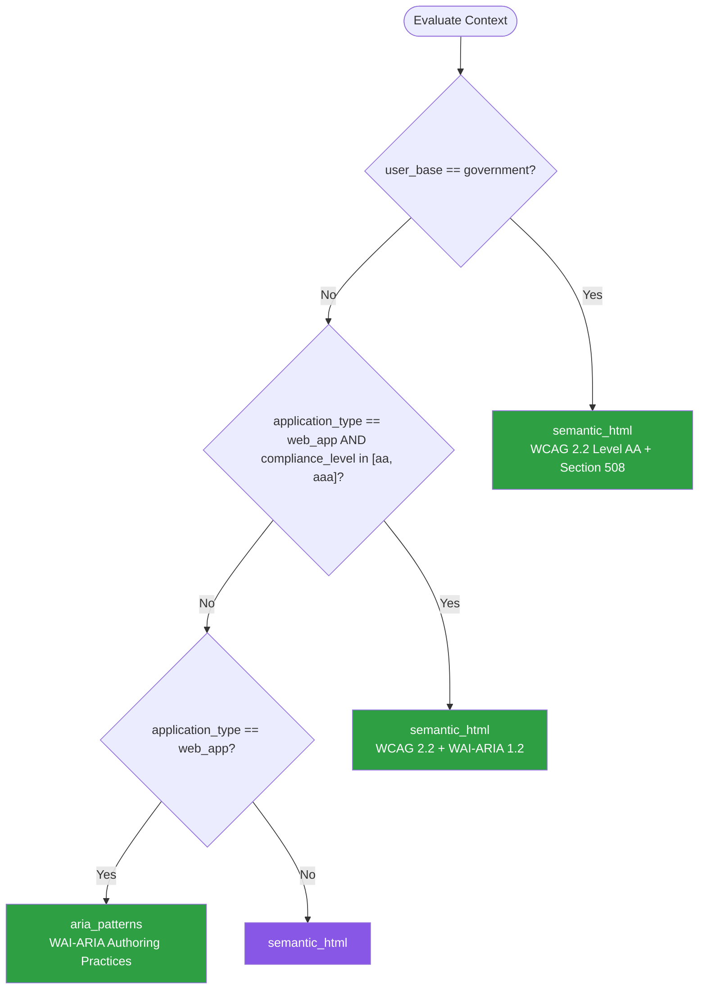

# Accessibility — Summary

Purpose
- Accessibility standards, inclusive design, and assistive technology compatibility
- Scope: WCAG compliance, ARIA patterns, keyboard navigation, and automated accessibility testing

## Related Standards

| Standard | Relationship | Context |
|----------|-------------|---------|
| [api-design](../../foundational/api-design/) | complementary | APIs powering accessible UIs must provide structured data for screen readers |
| [testing-strategies](../testing-strategies/) | complementary | Accessibility testing is a critical part of the quality strategy |
| [performance-optimization](../performance-optimization/) | complementary | Performance directly impacts accessibility — slow pages are inaccessible |

## Context Inputs

These inputs drive the decision tree — provide them to get a tailored recommendation.

| Input | Type | Required | Default | Values | Description |
|-------|------|----------|---------|--------|-------------|
| application_type | enum | yes | web_app | web_app, mobile_app, desktop_app, embedded_ui | Type of user-facing application |
| compliance_level | enum | yes | aa | a, aa, aaa | Target WCAG conformance level |
| user_base | enum | no | general_public | general_public, enterprise, government, education, healthcare | Primary user base characteristics |
| framework | enum | no | react | react, angular, vue, svelte, native_mobile, vanilla | UI framework being used |

## Decision Tree

### Mermaid Diagram



### Text Fallback

- **Priority 1** → `semantic_html` — when user_base is government. Government applications must meet Section 508 requirements, which align with WCAG 2.0 Level AA.
- **Priority 2** → `semantic_html` — when application_type is web_app and compliance_level is aa or aaa. Web applications must use semantic HTML as the foundation, with ARIA attributes only to enhance what HTML cannot express natively.
- **Priority 3** → `aria_patterns` — when application_type is web_app. Complex interactive widgets need ARIA patterns and keyboard interaction following WAI-ARIA practices.
- **Fallback** → `semantic_html` — Semantic HTML is the safest foundation — most issues come from not using it.

> **Confidence**: high | **Risk if wrong**: high

---

## Patterns

### 1. Semantic HTML & Document Structure

> Use native HTML elements for their intended purpose. Semantic elements provide built-in accessibility: buttons are focusable and activatable, headings create navigation landmarks, lists convey structure. Most accessibility issues come from using div/span where semantic elements should be used.

**Maturity**: standard

**Use when**
- Any web application or website
- Building UI components from scratch
- Refactoring existing UI for accessibility

**Avoid when**
- Never — semantic HTML is always the correct foundation

**Tradeoffs**

| Pros | Cons |
|------|------|
| Built-in keyboard support (button, a, input are focusable) | Default styling may need CSS overrides |
| Screen readers announce element roles automatically | Some complex UI patterns have no native HTML equivalent |
| No additional ARIA needed for standard elements | |
| Smaller code — no role/tabindex/event handler boilerplate | |

**Implementation Guidelines**
- Use button for clickable actions, not div or span with onClick
- Use a (anchor) for navigation, not div with onClick
- Use heading hierarchy (h1-h6) — one h1 per page, logical nesting
- Use nav, main, header, footer, aside for page landmarks
- Use ul/ol for lists, table for tabular data
- Use label associated with every form input (for=id or wrapping)
- Use fieldset/legend for related form field groups
- Provide alt text for all informational images; empty alt for decorative

**Common Errors**

| Error | Impact | Fix |
|-------|--------|-----|
| Using div with onClick instead of button | Not focusable by keyboard, not announced as interactive, no Enter/Space activation | Use `<button>` element; if styling is the concern, reset button CSS |
| Images without alt text | Screen readers announce file name or skip entirely; information lost | Add descriptive alt text for informational images; alt='' for decorative |
| Form inputs without labels | Screen readers cannot announce what the input is for; users cannot identify fields | Associate label with input using for=id attribute or wrap input in label |

**Standards & References**

| Standard | Type | Role | Reference |
|----------|------|------|-----------|
| WCAG 2.2 | standard | Web Content Accessibility Guidelines | https://www.w3.org/TR/WCAG22/ |
| HTML Living Standard | spec | Semantic HTML element definitions | — |

---

### 2. ARIA Patterns for Complex Widgets

> WAI-ARIA attributes and interaction patterns for complex widgets that have no native HTML equivalent: modals, comboboxes, tab panels, tree views, and drag-and-drop. ARIA supplements semantic HTML but never replaces it.

**Maturity**: advanced

**Use when**
- Building custom interactive widgets (modal, combobox, tabs)
- Dynamic content changes need to be announced
- Native HTML elements cannot express the intended behavior

**Avoid when**
- A native HTML element exists for the pattern (use semantic HTML first)
- Adding ARIA to fix what semantic HTML would solve

**Tradeoffs**

| Pros | Cons |
|------|------|
| Enables complex widget patterns to be accessible | ARIA is complex and easy to misuse |
| Live regions announce dynamic content changes | No ARIA is better than bad ARIA (wrong roles break accessibility) |
| Standardized interaction patterns users can learn once | Must implement all keyboard interactions manually |

**Implementation Guidelines**
- First rule of ARIA: don't use ARIA if native HTML works
- Use role only when no semantic HTML element exists for the purpose
- All interactive ARIA elements must be keyboard operable
- Use aria-live regions for dynamic content announcements
- Follow WAI-ARIA Authoring Practices for widget patterns (modal, tabs, etc.)
- Test with actual screen readers (NVDA, VoiceOver, JAWS)
- Use aria-label / aria-labelledby for custom controls

**Common Errors**

| Error | Impact | Fix |
|-------|--------|-----|
| role='button' on div instead of using button element | Must manually add tabindex, keydown handler, focus styles — or it breaks | Use `<button>` element; it has all behaviors built in |
| aria-hidden='true' on visible interactive content | Screen reader users cannot interact with visible content | Use aria-hidden only on truly decorative or redundant content |
| Modal dialog doesn't trap focus | Keyboard users can tab behind the modal to invisible content | Implement focus trap: Tab cycles within modal, close on Escape |

**Standards & References**

| Standard | Type | Role | Reference |
|----------|------|------|-----------|
| WAI-ARIA 1.2 | spec | Accessible Rich Internet Applications specification | https://www.w3.org/TR/wai-aria-1.2/ |
| ARIA Authoring Practices Guide | reference | Widget interaction patterns and keyboard conventions | https://www.w3.org/WAI/ARIA/apg/ |

---

### 3. Keyboard Navigation & Focus Management

> Ensure all interactive content is operable via keyboard alone. Manage focus order, visible focus indicators, and keyboard shortcuts. Critical for users who cannot use a mouse: motor disabilities, screen reader users, and power users.

**Maturity**: standard

**Use when**
- Any web application with interactive elements
- Single-page applications with dynamic content
- Custom widgets and controls

**Avoid when**
- Static content pages (still need basic tab navigation)

**Tradeoffs**

| Pros | Cons |
|------|------|
| Enables use by motor-disabled users | Focus management in SPAs requires careful engineering |
| Required by WCAG 2.1 Level A (criterion 2.1.1) | Custom keyboard shortcuts may conflict with assistive tech |
| Benefits power users who prefer keyboard | Testing keyboard navigation adds QA effort |
| Essential for screen reader operation | |

**Implementation Guidelines**
- All interactive elements must be reachable via Tab key
- Focus order follows visual/logical order (no tabindex > 0)
- Visible focus indicator on all focusable elements (never outline: none without replacement)
- Skip-to-content link as first focusable element
- Manage focus on route changes in SPAs (focus heading or main content)
- Trap focus in modals; return focus to trigger on close
- Support Escape to close overlays, menus, and dialogs
- Arrow keys for navigation within composite widgets (tabs, menus, lists)

**Common Errors**

| Error | Impact | Fix |
|-------|--------|-----|
| CSS outline: none without visible alternative | Keyboard users cannot see which element is focused | Replace with visible focus style: outline, box-shadow, or border |
| No focus management on SPA route changes | Screen reader users don't know the page changed; focus stays on old content | On route change, move focus to page heading or main content area |
| tabindex > 0 to force tab order | Creates unpredictable focus order that conflicts with natural flow | Use only tabindex='0' (natural order) or tabindex='-1' (programmatic focus only) |

**Standards & References**

| Standard | Type | Role | Reference |
|----------|------|------|-----------|
| WCAG 2.1 Criterion 2.1.1 Keyboard | standard | All functionality available from keyboard | https://www.w3.org/TR/WCAG21/#keyboard |

---

## Examples

### Semantic HTML vs Div Soup
**Context**: Building a navigation menu with interactive elements

**Correct** implementation:
```html
<!-- Semantic HTML — accessible by default -->
<nav aria-label="Main navigation">
  <ul>
    <li><a href="/home">Home</a></li>
    <li><a href="/products">Products</a></li>
    <li>
      <button aria-expanded="false" aria-controls="about-menu">
        About
      </button>
      <ul id="about-menu" hidden>
        <li><a href="/about/team">Team</a></li>
        <li><a href="/about/careers">Careers</a></li>
      </ul>
    </li>
  </ul>
</nav>

<main>
  <h1>Welcome to Our Store</h1>
  <section aria-labelledby="featured-heading">
    <h2 id="featured-heading">Featured Products</h2>
    <!-- Products list -->
  </section>
</main>
```

**Incorrect** implementation:
```html
<!-- WRONG: Div soup — inaccessible -->
<div class="nav">
  <div class="nav-item" onclick="go('/home')">Home</div>
  <div class="nav-item" onclick="go('/products')">Products</div>
  <div class="nav-item" onclick="toggleMenu()">
    About
    <div class="submenu" style="display:none">
      <div class="submenu-item" onclick="go('/about/team')">Team</div>
      <div class="submenu-item" onclick="go('/about/careers')">Careers</div>
    </div>
  </div>
</div>

<div class="content">
  <div class="title">Welcome to Our Store</div>
  <div class="section-title">Featured Products</div>
</div>
```

**Why**: Semantic HTML provides built-in accessibility: nav creates a landmark, a and button are focusable and keyboard-operable, headings create navigable structure. The div version requires extensive ARIA and JavaScript to achieve what HTML gives for free.

---

### Accessible Form — Labels and Error Handling
**Context**: Building an accessible signup form with validation errors

**Correct** implementation:
```html
<form aria-labelledby="signup-heading" novalidate>
  <h2 id="signup-heading">Create Account</h2>

  <div role="alert" aria-live="polite" id="error-summary" hidden>
    <h3>Please fix the following errors:</h3>
    <ul></ul>
  </div>

  <div>
    <label for="email">Email address (required)</label>
    <input id="email" type="email" required autocomplete="email"
           aria-describedby="email-error" aria-invalid="false" />
    <span id="email-error" role="alert" hidden>
      Please enter a valid email address.
    </span>
  </div>

  <div>
    <label for="password">Password (required)</label>
    <input id="password" type="password" required minlength="8"
           autocomplete="new-password"
           aria-describedby="password-hint password-error" />
    <span id="password-hint">Must be at least 8 characters</span>
    <span id="password-error" role="alert" hidden></span>
  </div>

  <button type="submit">Create Account</button>
</form>
```

**Incorrect** implementation:
```html
<!-- WRONG: Inaccessible form -->
<div class="form">
  <div class="title">Create Account</div>
  <div class="field">
    <span class="label">Email</span>
    <input type="text" placeholder="Enter email" />
    <span class="error" style="color: red;">Invalid!</span>
  </div>
  <div class="field">
    <span>Password</span>
    <input type="password" />
  </div>
  <div class="button" onclick="submit()">Create Account</div>
</div>
```

**Why**: The accessible form uses proper label-input association, aria-describedby for error messages, role=alert for dynamic announcements, and error summaries. The inaccessible form uses placeholders as labels, has no input-label association, and relies on color alone for errors.

---

## Security Hardening

### Transport
- Accessibility features do not expose additional attack surface

### Data Protection
- ARIA labels do not expose sensitive data not visible in the UI

### Access Control
- Accessible alternatives provide the same level of authentication security

### Input/Output
- Form validation errors are accessible but do not reveal system internals

### Secrets
- Password fields use autocomplete='new-password' or 'current-password'

### Monitoring
- Automated accessibility testing integrated into CI pipeline

---

## Anti-Patterns

| Anti-Pattern | Severity | Description | Fix |
|-------------|----------|-------------|-----|
| Div Soup | critical | Using div and span for everything instead of semantic HTML elements. Custom div-based buttons, links, and lists have no built-in accessibility. | Use semantic HTML: button, a, nav, main, h1-h6, ul/ol, table, label |
| Placeholder as Label | high | Using the placeholder attribute as the only label for form inputs. Placeholder text disappears when the user starts typing and is not reliably read by all screen readers. | Use visible label element associated with the input; placeholder is supplementary only |
| Color-Only Information | high | Conveying information through color alone. Users with color blindness cannot distinguish these states. Violates WCAG 1.4.1. | Use color + icon + text to convey status |
| Removing Focus Outline Without Replacement | critical | CSS outline: none on all elements to remove the focus ring. Keyboard users can no longer see which element is focused. | Replace with visible focus style: custom outline, box-shadow, or border |

---

## Checklist

| ID | Category | Description | Severity |
|----|----------|-------------|----------|
| ACC-01 | compliance | Semantic HTML used (button, a, nav, main, headings, lists, label) | critical |
| ACC-02 | compliance | All images have appropriate alt text | critical |
| ACC-03 | compliance | Color contrast ≥4.5:1 for normal text, ≥3:1 for large text | high |
| ACC-04 | compliance | All interactive elements keyboard-accessible | critical |
| ACC-05 | compliance | Visible focus indicator on all focusable elements | critical |
| ACC-06 | compliance | Form inputs have associated labels (not just placeholders) | critical |
| ACC-07 | compliance | Page landmarks present (nav, main, header, footer) | high |
| ACC-08 | compliance | Heading hierarchy logical (h1-h6, no skipping levels) | high |
| ACC-09 | compliance | ARIA used correctly (roles, states, properties per APG) | high |
| ACC-10 | compliance | Skip-to-content link present | medium |
| ACC-11 | correctness | Automated accessibility testing in CI (axe-core) | high |
| ACC-12 | correctness | Manual screen reader testing performed (NVDA or VoiceOver) | high |

---

## Compliance

| Standard | Relevance | Reference |
|----------|-----------|-----------|
| WCAG 2.2 | Web Content Accessibility Guidelines — definitive standard | https://www.w3.org/TR/WCAG22/ |
| Section 508 | US federal accessibility requirement | https://www.section508.gov/ |
| EN 301 549 | European accessibility standard for ICT products | — |
| ADA Title III | US Americans with Disabilities Act — web accessibility | — |

### Requirements Mapping

| Control | Description | Maps To |
|---------|-------------|---------|
| perceivable | All content perceivable by all users (text alternatives, captions, contrast) | WCAG 2.2 Principle 1 |
| operable | All functionality operable via keyboard and assistive technology | WCAG 2.2 Principle 2 |
| understandable | Content and operation are understandable (readable, predictable, input assistance) | WCAG 2.2 Principle 3 |

---

## Prompt Recipes

### Greenfield — Design accessible UI from the start
```
Design an accessible UI for a new application.
Context: Application type, Target conformance, UI framework.
Requirements: Semantic HTML, keyboard navigation, ARIA patterns, form labels, color contrast, skip nav, automated a11y testing.
```

### Audit — Audit application accessibility
```
Audit the application for accessibility compliance.
WCAG Checklist: images alt text, color contrast, keyboard access, focus indicator, heading hierarchy, landmarks, form labels, error messages, ARIA, skip-to-content, dynamic content, progressive enhancement.
```

### Remediation — Fix accessibility issues in existing application
```
Fix accessibility issues by priority order (impact × frequency):
Critical: no keyboard access, missing alt text, missing labels.
High: contrast, focus indicator, modal focus trap.
Medium: landmarks, headings, dynamic content.
Low: skip-to-content link.
```

### Architecture — Build an accessible component
```
Build an accessible component with semantic HTML foundation, ARIA, full keyboard interaction, focus management, screen reader announcements, and visible focus indicator.
```

---

## Links
- Full standard: [accessibility.yaml](accessibility.yaml)
