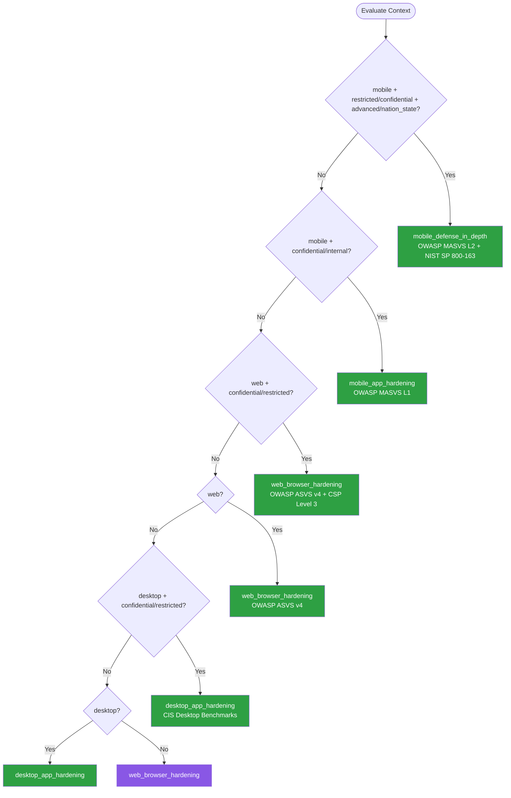

# Client Platform Security — Summary

Purpose
- Client-side security hardening for web, mobile (iOS/Android), and desktop applications
- Scope: SSL/TLS configuration, certificate pinning, root/jailbreak detection, secure local storage, code obfuscation, anti-tampering, and platform-specific security controls

## Related Standards

| Standard | Relationship | Context |
|----------|-------------|---------|
| [encryption](../encryption/) | complementary | Client-side encryption depends on proper key storage and TLS configuration |
| [authentication](../../foundational/authentication/) | complementary | Authentication tokens must be stored securely on client platforms |
| [input-validation](../../foundational/input-validation/) | complementary | Client-side validation is defense-in-depth; server validation is authoritative |
| [api-design](../../foundational/api-design/) | complementary | API transport security is configured at the client and enforced by the server |

## Context Inputs

These inputs drive the decision tree — provide them to get a tailored recommendation.

| Input | Type | Required | Default | Values | Description |
|-------|------|----------|---------|--------|-------------|
| platform | enum | yes | web | web, mobile_ios, mobile_android, desktop_electron, desktop_native, cross_platform | Target client platform |
| data_sensitivity | enum | yes | confidential | public, internal, confidential, restricted | Sensitivity of data handled on the client |
| threat_model | enum | yes | standard | basic, standard, advanced, nation_state | Expected adversary capability level |
| distribution_model | enum | yes | app_store | app_store, enterprise_sideload, web_browser, direct_download, managed_device | How the application is distributed to users |
| offline_capability | boolean | no | false | true, false | Whether the application must function offline with local data |

## Decision Tree

### Mermaid Diagram



### Text Fallback

- **Priority 1** → `mobile_defense_in_depth` — when platform is mobile, data is restricted/confidential, threat model is advanced/nation_state. High-value mobile apps require defense-in-depth.
- **Priority 2** → `mobile_app_hardening` — when platform is mobile, data is confidential/internal. Standard mobile apps need certificate pinning, secure storage, and root detection.
- **Priority 3** → `web_browser_hardening` — when platform is web, data is confidential/restricted. Strict CSP, CORS, SRI, secure cookies, and XSS/CSRF mitigation.
- **Priority 4** → `web_browser_hardening` — when platform is web. All web applications benefit from CSP and secure cookies.
- **Priority 5** → `desktop_app_hardening` — when platform is desktop, data is confidential/restricted. Code signing, secure auto-update, IPC hardening, and memory protection.
- **Priority 6** → `desktop_app_hardening` — when platform is desktop. Basic desktop hardening: code signing, secure update channel, minimal privilege.
- **Fallback** → `web_browser_hardening` — Web hardening covers the most common client platform with well-understood controls.

> **Confidence**: high | **Risk if wrong**: critical

---

## Patterns

### 1. Web Browser Security Hardening

> Comprehensive browser-side security using HTTP security headers, Content Security Policy, CORS restrictions, Subresource Integrity, secure cookie attributes, and XSS/CSRF mitigation to create defense layers within the browser execution environment.

**Maturity**: standard

**Use when**
- Any web application serving HTML/JS to browsers
- Single-page applications (SPAs) calling APIs
- Progressive web applications (PWAs)
- Web views embedded in mobile or desktop apps

**Avoid when**
- Pure API services with no browser-facing content

**Tradeoffs**

| Pros | Cons |
|------|------|
| No app store review required — deploy instantly | CSP can break legitimate functionality if too strict |
| Headers are declarative and easy to audit | Third-party scripts may not support strict CSP |
| CSP blocks entire classes of injection attacks | CORS misconfiguration is a common vulnerability |
| SRI prevents CDN compromise from affecting the app | Cannot prevent browser extension tampering |

**Implementation Guidelines**
- Deploy strict Content-Security-Policy: default-src 'self'; script-src 'self'; style-src 'self' 'unsafe-inline'; img-src 'self' data:; connect-src 'self' https://api.example.com; frame-ancestors 'none'
- Set X-Content-Type-Options: nosniff on all responses
- Set X-Frame-Options: DENY (or SAMEORIGIN for intentional framing)
- Enable Strict-Transport-Security: max-age=31536000; includeSubDomains; preload
- Configure CORS: whitelist specific origins, never use Access-Control-Allow-Origin: * for credentialed requests
- Add Subresource Integrity (SRI) hashes to all third-party script and stylesheet tags
- Set cookie attributes: Secure; HttpOnly; SameSite=Strict (or Lax); Path=/; Domain limited
- Implement CSRF tokens for state-changing requests
- Use Permissions-Policy to restrict browser features: camera, microphone, geolocation
- Sanitize all user-generated content server-side before rendering

**Common Errors**

| Error | Impact | Fix |
|-------|--------|-----|
| Using unsafe-inline or unsafe-eval in CSP script-src | Defeats purpose of CSP; allows inline script injection (XSS) | Use nonce-based CSP or hash-based CSP |
| Setting Access-Control-Allow-Origin: * with credentials | Any origin can make authenticated requests to the API | Whitelist specific origins; reflect only allowed origins from a trusted list |
| Missing SameSite attribute on cookies | Cookies sent on cross-site requests enabling CSRF attacks | Set SameSite=Strict for session cookies; SameSite=Lax as minimum |

**Standards & References**

| Standard | Type | Role | Reference |
|----------|------|------|-----------|
| OWASP ASVS v4 (V14: Configuration) | standard | Application security verification standard | https://owasp.org/www-project-application-security-verification-standard/ |
| CSP Level 3 (W3C) | standard | Content Security Policy specification | https://www.w3.org/TR/CSP3/ |

---

### 2. Mobile Application Hardening

> Secure mobile applications through certificate pinning, secure key storage using platform keystores, root/jailbreak detection, and binary integrity checks. Provides a layered defense model for iOS and Android applications.

**Maturity**: standard

**Use when**
- Mobile apps handling user credentials or tokens
- Apps processing financial or health data
- Apps that must resist man-in-the-middle attacks
- Enterprise apps distributed outside managed MDM

**Avoid when**
- Content-only apps with no sensitive data (e.g., news readers)
- Cost/complexity outweighs risk for low-sensitivity apps

**Tradeoffs**

| Pros | Cons |
|------|------|
| Certificate pinning prevents MitM even with compromised CA | Certificate pinning requires careful rotation planning |
| Secure enclave/keystore protects keys from OS-level extraction | Root detection has false positives (developer devices, custom ROMs) |
| Root detection warns against compromised device environments | Hardening is defense-in-depth — determined attackers can bypass |
| Binary protection raises the bar for reverse engineering | Adds development and maintenance complexity |

**Implementation Guidelines**
- Implement certificate pinning against the leaf or intermediate CA public key (not full certificate)
- Include backup pins for certificate rotation — pin current + next expected key
- Store authentication tokens in iOS Keychain or Android Keystore
- Detect rooted/jailbroken devices: check for su binary, Cydia, Magisk, test sandbox integrity
- On root detection: warn user, disable sensitive features, or refuse to run based on risk tolerance
- Enable App Transport Security (iOS) or Network Security Config (Android) to enforce TLS
- Disable WebView JavaScript when not needed; restrict URL schemes in WebViews
- Validate deep link URLs against a whitelist before processing
- Implement anti-debugging checks in release builds
- Use app attestation APIs: iOS DeviceCheck/App Attest, Android Play Integrity API

**Common Errors**

| Error | Impact | Fix |
|-------|--------|-----|
| Pinning the full certificate instead of the public key | Pin breaks on every certificate renewal forcing emergency app updates | Pin the Subject Public Key Info (SPKI) hash; it survives cert renewal |
| No backup pins — only pinning current certificate | If certificate is rotated, all existing app installs fail to connect | Pin current + next expected key; have emergency pin removal mechanism |
| Storing tokens in SharedPreferences/UserDefaults (plaintext) | Tokens readable on rooted devices or via backup extraction | Use Android Keystore or iOS Keychain with appropriate access controls |
| Root detection that only checks one indicator | Modern root tools (Magisk) hide individual indicators | Use multiple detection methods: su binary, build tags, test-keys, sandbox escape, SafetyNet/Play Integrity |

**Standards & References**

| Standard | Type | Role | Reference |
|----------|------|------|-----------|
| OWASP MASVS | standard | Comprehensive mobile app security baseline | https://mas.owasp.org/MASVS/ |
| NIST SP 800-163 Rev 1 | standard | Guidelines for vetting the security of mobile applications | — |

---

### 3. Mobile Defense-in-Depth (High-Security)

> Maximum protection for mobile apps handling restricted data. Combines all mobile hardening controls with runtime application self-protection, code obfuscation, anti-tampering, and hardware-backed attestation. Designed for financial, healthcare, and government applications.

**Maturity**: enterprise

**Use when**
- Banking, payments, and financial trading apps
- Healthcare apps handling PHI
- Government or classified information apps
- Apps requiring MASVS L2 or equivalent compliance

**Avoid when**
- Standard business apps — cost exceeds risk reduction
- Rapid prototyping or MVP phase

**Tradeoffs**

| Pros | Cons |
|------|------|
| Strongest mobile security posture available | Significant development and maintenance cost |
| Meets regulatory requirements (PCI DSS, HIPAA, government) | Performance overhead from runtime checks |
| Multi-layer defense — no single bypass defeats all controls | Aggressive root detection may reject legitimate users |
| Hardware attestation proves device and app integrity | Obfuscation complicates crash reporting and debugging |

**Implementation Guidelines**
- Apply all mobile_app_hardening guidelines as the foundation
- Implement code obfuscation: ProGuard/R8 (Android), bitcode + Swift symbol stripping (iOS)
- Add runtime integrity checks: verify app signature, detect debugger, detect instrumentation frameworks (Frida, Xposed)
- Use hardware-backed key attestation to verify key material is in secure hardware
- Implement app attestation: iOS App Attest with assertion validation, Android Key Attestation + Play Integrity
- Enable binary integrity verification: checksum critical code sections at runtime
- Implement secure screen capture prevention for sensitive views
- Use memory protection: clear sensitive data from memory after use
- Implement jailbreak/root detection with graceful degradation
- Perform server-side attestation validation — never trust client-only checks

**Common Errors**

| Error | Impact | Fix |
|-------|--------|-----|
| Client-only root detection without server-side validation | Attacker patches out detection in the binary | Send attestation result to server; validate server-side before granting access |
| Obfuscation without integrity verification | Attacker deobfuscates and patches the binary | Combine obfuscation with runtime checksum verification of critical code paths |
| Hard-blocking rooted devices instead of degrading gracefully | Alienates power users and developers; support tickets increase | Warn users; disable high-risk features; allow read-only access |

**Standards & References**

| Standard | Type | Role | Reference |
|----------|------|------|-----------|
| OWASP MASVS L2 + R | standard | Defense-in-depth plus resilience requirements | https://mas.owasp.org/MASVS/ |
| PCI Mobile Payment Acceptance Security Guidelines | standard | Security requirements for mobile payment applications | — |

---

### 4. Desktop Application Hardening

> Security controls for desktop applications including code signing, secure auto-update mechanisms, IPC hardening, memory protection, and Electron-specific isolation. Addresses the unique threat model of locally-installed software with full OS access.

**Maturity**: standard

**Use when**
- Native desktop applications (Windows, macOS, Linux)
- Electron or other web-runtime desktop apps
- Applications handling sensitive local data
- Enterprise software with privileged operations

**Avoid when**
- Thin clients that delegate all processing to the server

**Tradeoffs**

| Pros | Cons |
|------|------|
| Code signing proves publisher identity and detects tampering | Code signing requires certificate management and cost |
| Secure updates prevent supply chain attacks via update channel | Update mechanisms are complex to implement securely |
| IPC hardening prevents privilege escalation from other processes | Electron apps inherit web vulnerabilities plus node.js risks |
| OS-level protections (ASLR, DEP) are available on all modern platforms | Platform-specific implementation differences increase maintenance |

**Implementation Guidelines**
- Sign all binaries and installers with EV code signing certificates (Windows), Developer ID (macOS), GPG (Linux)
- Implement secure auto-update: HTTPS-only channel, signature verification of update packages, rollback capability
- Electron: enable contextIsolation, disable nodeIntegration, use preload scripts for IPC, enable sandbox
- Restrict IPC channels: validate all messages, use allowlisted channel names
- Implement memory protection: clear sensitive data after use
- Run with minimal OS privileges — never require admin/root unless absolutely necessary
- Enable platform protections: ASLR, DEP/NX, stack canaries, code integrity guard
- Use OS credential stores: Windows Credential Manager, macOS Keychain, Linux Secret Service API

**Common Errors**

| Error | Impact | Fix |
|-------|--------|-----|
| Electron app with nodeIntegration enabled | XSS in renderer process gains full Node.js access — arbitrary code execution | Set nodeIntegration: false, contextIsolation: true, use preload scripts |
| Auto-update over HTTP without signature verification | Man-in-the-middle can inject malicious update | HTTPS-only update channel with cryptographic signature verification |
| Running desktop app as admin/root by default | Any vulnerability escalates to full system compromise | Run with standard user privileges; use OS elevation prompts only when needed |

**Standards & References**

| Standard | Type | Role | Reference |
|----------|------|------|-----------|
| Electron Security Guidelines | reference | Official security best practices for Electron applications | https://www.electronjs.org/docs/latest/tutorial/security |
| Microsoft SDL | standard | Secure development practices for Windows applications | — |

---

## Examples

### Content Security Policy — Strict CSP for SPA
**Context**: Configuring a strict Content Security Policy for a single-page application

**Correct** implementation:
```text
Content-Security-Policy:
  default-src 'self';
  script-src 'self' 'nonce-{server_generated_random}';
  style-src 'self' 'nonce-{server_generated_random}';
  img-src 'self' data: https://cdn.example.com;
  connect-src 'self' https://api.example.com;
  font-src 'self' https://fonts.example.com;
  frame-ancestors 'none';
  base-uri 'self';
  form-action 'self';
  upgrade-insecure-requests;

X-Content-Type-Options: nosniff
X-Frame-Options: DENY
Referrer-Policy: strict-origin-when-cross-origin
Permissions-Policy: camera=(), microphone=(), geolocation=()
Strict-Transport-Security: max-age=31536000; includeSubDomains; preload

<script nonce="{server_generated_random}" src="/app.js"></script>
```

**Incorrect** implementation:
```text
Content-Security-Policy: default-src *; script-src * 'unsafe-inline' 'unsafe-eval';

# No X-Content-Type-Options — browser may MIME-sniff responses
# No X-Frame-Options — app can be framed (clickjacking)
# No HSTS — users can be downgraded to HTTP
```

**Why**: The correct CSP restricts script execution to same-origin with nonces, blocking inline script injection. Frame-ancestors 'none' prevents clickjacking. The incorrect version allows any source with unsafe-inline and unsafe-eval, providing no protection against XSS.

---

### Certificate Pinning — Public Key Pinning on Mobile
**Context**: Implementing SPKI hash-based certificate pinning with backup pins

**Correct** implementation:
```xml
<!-- Android — Network Security Config -->
<network-security-config>
  <domain-config>
    <domain includeSubdomains="true">api.example.com</domain>
    <pin-set expiration="2027-01-01">
      <pin digest="SHA-256">base64_hash_of_current_cert_spki</pin>
      <pin digest="SHA-256">base64_hash_of_next_cert_spki</pin>
    </pin-set>
  </domain-config>
</network-security-config>
```

**Incorrect** implementation:
```text
# WRONG: Pinning full certificate instead of SPKI
pinned_cert = load_certificate("api.example.com.cer")
# This breaks on EVERY certificate renewal!

# WRONG: Only one pin, no backup
pin_set = ["single_hash_no_backup"]

# WRONG: Disabling certificate validation as a "fix"
ssl_context.verify_mode = VERIFY_NONE  # Defeats ALL TLS security
```

**Why**: SPKI-based pinning survives certificate renewal because the public key typically stays the same. Backup pins prevent lockout during rotation. Pinning the full certificate forces emergency app updates on every renewal.

---

## Security Hardening

### Transport
- Certificate pinning on mobile apps — SPKI hash-based with backup pins
- TLS 1.2+ enforced on all client platforms
- HSTS on all web endpoints with preload
- Network Security Config (Android) or App Transport Security (iOS) enforced

### Data Protection
- Sensitive data stored in platform keystore: iOS Keychain, Android Keystore, OS credential manager
- No sensitive data in plaintext SharedPreferences, UserDefaults, or localStorage
- Clear sensitive data from memory after use
- Disable pasteboard for sensitive input fields

### Access Control
- Root/jailbreak detection with server-side validation
- App attestation: iOS App Attest, Android Play Integrity
- Biometric authentication for sensitive operations where available

### Input/Output
- Content Security Policy on all web responses
- Input sanitization on both client and server (server is authoritative)
- Deep link URL validation against whitelist
- WebView URL scheme restrictions

### Secrets
- No hardcoded secrets, API keys, or certificates in client code
- Use build-time environment injection for configuration endpoints
- Obfuscate sensitive string constants in mobile binaries

### Monitoring
- Report certificate pin failures to a monitoring endpoint
- Log root/jailbreak detection events server-side
- Monitor for unusual client behavior (automated scraping, emulator use)
- App crash analytics with symbolication (without exposing source)

---

## Anti-Patterns

| Anti-Pattern | Severity | Description | Fix |
|-------------|----------|-------------|-----|
| Disabling Certificate Validation | critical | Setting SSL/TLS verification to false to bypass certificate errors, then shipping to production. Completely defeats transport security. | Never disable verification; use proper certificates in all environments |
| Tokens in localStorage (Web) | high | Storing authentication tokens in browser localStorage. Any XSS vulnerability gives the attacker full access to the token. | Use HttpOnly, Secure, SameSite cookies for session tokens |
| Secrets in Client Bundle | critical | Embedding API keys, encryption keys, or other secrets directly in client-side code. Client code is always extractable. | Use server-side proxy for API keys; use OAuth tokens issued at runtime |
| Client-Only Security Checks | high | Implementing security controls only on the client side without server-side enforcement. Client code can always be modified or bypassed. | Enforce all security decisions server-side; use client checks only as UX improvements |

---

## Checklist

| ID | Category | Description | Severity |
|----|----------|-------------|----------|
| CPS-01 | security | TLS 1.2+ enforced on all client connections | critical |
| CPS-02 | security | Content Security Policy configured without unsafe-inline or unsafe-eval | critical |
| CPS-03 | security | Cookies set with Secure, HttpOnly, SameSite attributes | high |
| CPS-04 | security | Certificate pinning implemented on mobile apps (SPKI-based with backup pins) | high |
| CPS-05 | security | Authentication tokens stored in platform secure storage (Keychain/Keystore) | critical |
| CPS-06 | security | Root/jailbreak detection active with server-side validation | high |
| CPS-07 | security | No hardcoded secrets in client code | critical |
| CPS-08 | security | Desktop binaries code-signed with trusted certificates | high |
| CPS-09 | security | Auto-update uses HTTPS with cryptographic signature verification | high |
| CPS-10 | security | Electron apps: contextIsolation enabled, nodeIntegration disabled | critical |
| CPS-11 | security | App attestation configured (Play Integrity / App Attest) | high |
| CPS-12 | security | CORS restricted to specific allowed origins — no wildcard with credentials | critical |

---

## Compliance

| Standard | Relevance | Reference |
|----------|-----------|-----------|
| OWASP MASVS | Comprehensive mobile security requirements framework | https://mas.owasp.org/MASVS/ |
| OWASP ASVS v4 | Web application security verification requirements | https://owasp.org/www-project-application-security-verification-standard/ |
| NIST SP 800-163 Rev 1 | Vetting the security of mobile applications | — |
| CWE-295 | Common weakness for TLS implementation errors | https://cwe.mitre.org/data/definitions/295.html |

### Requirements Mapping

| Control | Description | Maps To |
|---------|-------------|---------|
| transport_security | All client-server communication over TLS 1.2+ with proper certificate validation | OWASP MASVS NETWORK-1, OWASP ASVS V9 |
| secure_storage | Sensitive data stored using platform-provided secure storage mechanisms | OWASP MASVS STORAGE-1, OWASP MASVS STORAGE-2 |
| binary_protection | App binary protected against reverse engineering and tampering | OWASP MASVS RESILIENCE-1, OWASP MASVS RESILIENCE-2 |

---

## Prompt Recipes

### Greenfield — Design client-platform security for a new application
```
Design the client-side security architecture.
Context: Platform, Data sensitivity, Threat model, Distribution.
Requirements: Transport security, secure local storage, token protection, platform-specific hardening, no hardcoded secrets.
```

### Audit — Audit client application security posture
```
Audit client application security: Web (CSP, cookies, HSTS, CORS, SRI), Mobile (cert pinning, Keychain/Keystore, root detection, obfuscation, attestation), Desktop (code signing, auto-update, nodeIntegration, IPC).
```

### Operations — Plan certificate rotation with pinning
```
Plan certificate rotation: generate new cert, compute SPKI hash, release app update with both pins, wait for adoption, deploy new cert, release next update removing old pin.
```

### Security — Respond to compromised client certificate or root CA
```
Respond to certificate compromise: revoke, issue new cert, deploy, emergency app release with updated pins, investigate scope, update rotation schedule.
```

---

## Links
- Full standard: [client-platform-security.yaml](client-platform-security.yaml)
