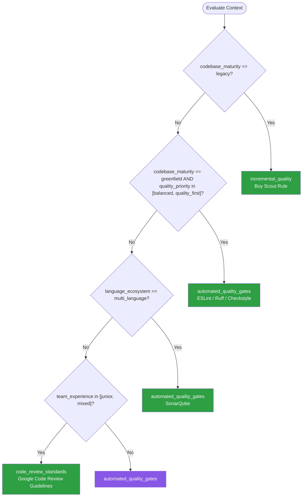

# Code Quality — Summary

Purpose
- Code quality standards, linting, static analysis, and maintainability practices
- Scope: Automated code quality enforcement, code review standards, and architectural fitness functions

## Related Standards

| Standard | Relationship | Context |
|----------|-------------|---------|
| [testing-strategies](../testing-strategies/) | complementary | Testable code is a key quality indicator; testing enforces quality |
| [ci-cd](../../infrastructure/ci-cd/) | complementary | Quality gates are enforced in CI/CD pipelines |
| [logging-observability](../../foundational/logging-observability/) | complementary | Observable code is easier to maintain and debug |

## Context Inputs

These inputs drive the decision tree — provide them to get a tailored recommendation.

| Input | Type | Required | Default | Values | Description |
|-------|------|----------|---------|--------|-------------|
| language_ecosystem | enum | yes | typescript | typescript, python, java, csharp, go, rust, ruby, kotlin, multi_language | Primary programming language ecosystem |
| codebase_maturity | enum | yes | active | greenfield, active, legacy, migration | Age and maturity of the codebase |
| team_experience | enum | no | mixed | junior, mixed, senior | Average team experience level |
| quality_priority | enum | no | balanced | speed_first, balanced, quality_first | Primary quality focus |

## Decision Tree

### Mermaid Diagram



### Text Fallback

- **Priority 1** → `incremental_quality` — when codebase_maturity is legacy. Apply the Boy Scout Rule: leave code better than you found it.
- **Priority 2** → `automated_quality_gates` — when greenfield and quality_priority is balanced or quality_first. Establish strict quality gates from day one.
- **Priority 3** → `automated_quality_gates` — when multi_language. Unified quality platform that supports all languages with consistent rules.
- **Priority 4** → `code_review_standards` — when team_experience is junior or mixed. Structured code review standards and automated style enforcement.
- **Fallback** → `automated_quality_gates` — Automated quality gates catch issues before they reach code review.

> **Confidence**: high | **Risk if wrong**: medium

---

## Patterns

### 1. Automated Quality Gates

> Automated enforcement of code quality standards through linters, formatters, static analysis, and CI/CD quality gates. Code that fails quality checks cannot be merged. Removes subjective style debates from code reviews.

**Maturity**: standard

**Use when**
- Any project with more than one contributor
- Greenfield projects (establish early)
- Teams wanting consistent code style
- CI/CD pipelines need automated quality checks

**Avoid when**
- Prototyping or hackathon code (temporary)

**Tradeoffs**

| Pros | Cons |
|------|------|
| Consistent style across entire codebase | Initial setup effort for rule configuration |
| Catches bugs and anti-patterns automatically | False positives may require rule exceptions |
| Removes style debates from code reviews (focus on logic) | Too strict initially can frustrate teams |
| Fast feedback — linting runs in seconds | |
| Enforced — cannot be bypassed (CI gate) | |

**Implementation Guidelines**
- Choose language-appropriate linter (ESLint, Ruff, Checkstyle, golangci-lint)
- Use opinionated formatter (Prettier, Black, gofmt) — zero configuration style
- Run linter + formatter as pre-commit hooks (fast feedback)
- Run SAST tool in CI (SonarQube, Semgrep, CodeQL)
- Define quality gate: zero new issues in changed code
- Start with recommended rule set; customize only with team consensus
- Track quality metrics over time (technical debt, complexity, duplication)

**Common Errors**

| Error | Impact | Fix |
|-------|--------|-----|
| Allowing --no-verify to bypass pre-commit hooks | Developers skip quality checks; issues found only in CI (slow feedback) | CI is the enforcer, not pre-commit. CI gate must be mandatory |
| Custom rule set from scratch instead of starting with recommended | Weeks spent debating rules; inconsistent initial setup | Start with recommended preset; adjust over time |
| Ignoring SAST findings as false positives without review | Real security issues hidden among dismissed findings | Triage all SAST findings; mark true false positives with documented reason |

**Standards & References**

| Standard | Type | Role | Reference |
|----------|------|------|-----------|
| ESLint | tool | JavaScript/TypeScript linting and static analysis | https://eslint.org/ |
| Ruff | tool | Fast Python linter and formatter | https://docs.astral.sh/ruff/ |
| SonarQube | tool | Multi-language static analysis platform | — |

---

### 2. Structured Code Review

> Standardized code review process with clear criteria, review checklists, and automated assistance. Reviews focus on correctness, design, and knowledge sharing — style is handled by automation.

**Maturity**: standard

**Use when**
- Team has more than one developer
- Knowledge sharing is important (junior developers)
- Critical business logic changes
- Security-sensitive code paths

**Avoid when**
- Solo developer (use automated checks instead)
- Trivial changes (auto-formatted, dependency bumps)

**Tradeoffs**

| Pros | Cons |
|------|------|
| Catches logic errors automated tools miss | Time-consuming if not structured |
| Knowledge sharing across team | Bottleneck if few reviewers available |
| Mentoring opportunity for junior developers | Can become rubber-stamping without standards |
| Multiple eyes on security-sensitive code | |

**Implementation Guidelines**
- Review for correctness, design, and security — not style (automated)
- Keep PRs small (<400 lines changed) for effective review
- Require at least one approval; two for security-sensitive code
- Review within 24 hours to avoid blocking
- Use review checklists for consistency
- Author provides context: what changed, why, how to test
- Use AI-assisted review for initial triage (Copilot, CodeRabbit)

**Common Errors**

| Error | Impact | Fix |
|-------|--------|-----|
| Reviewing style instead of substance | Bikeshedding on formatting; real bugs slip through | Automate all style checks; review only logic, design, and security |
| Large PRs (1000+ lines) | Reviewers skim instead of reviewing; bugs missed | Break into <400 line PRs; stack PRs for large features |

**Standards & References**

| Standard | Type | Role | Reference |
|----------|------|------|-----------|
| Google Code Review Guidelines | practice | Industry-recognized code review best practices | https://google.github.io/eng-practices/review/ |

---

### 3. Incremental Quality Improvement (Boy Scout Rule)

> Improve legacy code quality incrementally: leave every file better than you found it. Don't attempt big-bang rewrites. Add tests before refactoring. Use the strangler fig pattern for large-scale modernization.

**Maturity**: standard

**Use when**
- Legacy codebase with low test coverage
- Team cannot stop feature development for quality improvements
- Codebase has significant technical debt
- Gradual migration to modern patterns

**Avoid when**
- Greenfield project (do it right from the start)
- Codebase is being retired

**Tradeoffs**

| Pros | Cons |
|------|------|
| No big-bang risk — incremental improvement | Slow improvement — months to see significant change |
| Feature development continues alongside quality work | Inconsistent codebase during transition |
| Team learns codebase through refactoring | Requires discipline to not skip the improvement step |
| Measurable progress over time | |

**Implementation Guidelines**
- Add tests before changing any code (characterization tests)
- Refactor only code you're already changing (Boy Scout Rule)
- Track quality metrics: complexity, coverage, duplication trends
- Use strangler fig for module-level rewrites
- Never introduce new code that doesn't meet current standards
- Create architecture decision records (ADRs) for quality improvements

**Common Errors**

| Error | Impact | Fix |
|-------|--------|-----|
| Big-bang rewrite of legacy system | Project stalls, features delayed, new bugs introduced | Use strangler fig pattern: incrementally replace modules |
| Refactoring without tests | Refactoring introduces regressions with no safety net | Write characterization tests first — capture current behavior before changing |

**Standards & References**

| Standard | Type | Role | Reference |
|----------|------|------|-----------|
| Strangler Fig Pattern | pattern | Incremental system modernization strategy | https://martinfowler.com/bliki/StranglerFigApplication.html |

---

### 4. Architectural Fitness Functions

> Automated tests that verify the codebase adheres to architectural decisions: dependency rules, layer boundaries, naming conventions, and modularity constraints. Prevent architectural erosion over time.

**Maturity**: advanced

**Use when**
- Large codebases with defined architecture (layers, modules)
- Multiple teams contributing to the same codebase
- Architecture decisions need automated enforcement
- Preventing dependency cycles and layer violations

**Avoid when**
- Small projects with simple architecture
- Architecture is still evolving rapidly

**Tradeoffs**

| Pros | Cons |
|------|------|
| Architectural decisions enforced automatically | Requires tooling investment (ArchUnit, Dependency Cruiser) |
| Prevents erosion and dependency creep | Rules must evolve with architecture |
| Documentation-as-code for architecture rules | False positives if rules are too strict |
| Fast feedback in CI | |

**Implementation Guidelines**
- Define layer boundaries (presentation → application → domain → infrastructure)
- Enforce dependency direction: no reverse dependencies
- Detect and prevent circular dependencies
- Enforce naming conventions per layer
- Monitor module coupling and cohesion metrics
- Run fitness functions in CI alongside unit tests

**Common Errors**

| Error | Impact | Fix |
|-------|--------|-----|
| No enforcement of architecture decisions | Architecture erodes over time; everything depends on everything | Add ArchUnit/Dependency Cruiser tests for layer boundaries |
| Fitness functions not maintained as architecture evolves | Tests become obstacles to legitimate architectural changes | Update fitness functions as part of architecture decision records (ADRs) |

**Standards & References**

| Standard | Type | Role | Reference |
|----------|------|------|-----------|
| ArchUnit | framework | Architecture testing for Java/Kotlin | https://www.archunit.org/ |
| Dependency Cruiser | tool | Dependency analysis and rule enforcement for JavaScript/TypeScript | https://github.com/sverweij/dependency-cruiser |

---

## Examples

### CI Quality Gate — Multi-Stage
**Context**: CI pipeline with progressive quality gates

**Correct** implementation:
```text
stages:
  lint:
    - run: npm run lint          # ESLint — catches code issues
    - run: npm run format:check  # Prettier — formatting check

  test:
    - run: npm run test:unit
    - run: npm run test:integration
    - run: npm run coverage:check --threshold=80

  security:
    - run: npm audit --audit-level=high
    - run: semgrep --config=auto .
    - run: gitleaks detect

  quality:
    - run: sonar-scanner
    # Quality gate: zero new bugs, zero new vulnerabilities
```

**Incorrect** implementation:
```text
stages:
  build:
    - run: npm run build
  deploy:
    - run: npm run deploy
# No linting, no testing, no security scanning, no quality gate
```

**Why**: Progressive quality gates catch issues early and cheaply. The incorrect pipeline has no quality enforcement — issues are found only in production at 100x the cost.

---

### Incremental Quality — Legacy Code Improvement
**Context**: Improving a legacy function during feature work

**Correct** implementation:
```python
# Step 1: Write characterization test (capture current behavior)
def test_calculate_price_current_behavior():
    assert calculate_price(100, "US", True) == 107.0
    assert calculate_price(100, "EU", True) == 120.0
    assert calculate_price(100, "US", False) == 100.0

# Step 2: Refactor with test safety net
class TaxCalculator:
    def __init__(self, strategies):
        self.strategies = strategies

    def calculate(self, amount, region, taxable):
        if not taxable:
            return amount
        strategy = self.strategies.get(region, self.default_strategy)
        return strategy.apply(amount)

# Step 3: Verify characterization tests still pass
```

**Incorrect** implementation:
```text
# WRONG: Refactoring without tests
# "I'll just clean up this function while I'm here"
# No tests exist — no way to verify behavior is preserved
# Bug discovered in production 2 weeks later
```

**Why**: The Boy Scout Rule works safely when you first capture current behavior with characterization tests, then refactor with confidence. Refactoring without tests is gambling.

---

## Security Hardening

### Transport
- SAST tools run in CI with results sent over secure channels

### Data Protection
- Secret scanning prevents credentials from being committed

### Access Control
- Quality gate bypass requires explicit approval from security team

### Input/Output
- All SAST findings triaged within SLA (critical: 24h, high: 7d)

### Secrets
- Pre-commit hooks include secret detection (gitleaks, detect-secrets)

### Monitoring
- Quality metrics tracked over time (SonarQube dashboard)
- Alert on quality metric regression

---

## Anti-Patterns

| Anti-Pattern | Severity | Description | Fix |
|-------------|----------|-------------|-----|
| No Linting or Formatting Standards | high | No automated code style enforcement. Every PR becomes a style debate. | Add linter + formatter with CI enforcement; use opinionated defaults |
| Bypassing Quality Gates | high | Using --no-verify, force-merging, or admin override to bypass quality gates regularly. | Remove admin bypass; emergency exceptions require documented approval |
| Big-Bang Rewrite | high | Attempting to rewrite an entire legacy system from scratch. Most big-bang rewrites fail. | Use strangler fig pattern: incrementally replace modules |
| Premature Abstraction | medium | Creating abstractions, interfaces, and patterns before they're needed. | Follow Rule of Three: abstract only after seeing the same pattern three times |

---

## Checklist

| ID | Category | Description | Severity |
|----|----------|-------------|----------|
| CQ-01 | maintainability | Linter configured with enforced rules for primary language | high |
| CQ-02 | maintainability | Formatter enforced — zero style debates in code reviews | high |
| CQ-03 | security | SAST tool running in CI (SonarQube, Semgrep, or CodeQL) | high |
| CQ-04 | security | Secret scanning in pre-commit hooks and CI | critical |
| CQ-05 | security | Dependency vulnerability scanning in CI | high |
| CQ-06 | maintainability | Code review required before merge (min 1 approval) | high |
| CQ-07 | maintainability | PRs kept small (target <400 lines changed) | medium |
| CQ-08 | maintainability | Quality metrics tracked over time (complexity, coverage, duplication) | medium |
| CQ-09 | maintainability | Architecture fitness functions enforce dependency rules | medium |
| CQ-10 | correctness | No quality gate bypass without documented approval | high |
| CQ-11 | maintainability | Legacy code improved incrementally (Boy Scout Rule) | medium |
| CQ-12 | maintainability | Technical debt tracked and prioritized in backlog | medium |

---

## Compliance

| Standard | Relevance | Reference |
|----------|-----------|-----------|
| ISO 25010 Software Quality | Defines quality characteristics for software products | — |
| OWASP Secure Coding Practices | Security-focused code quality requirements | https://owasp.org/www-project-secure-coding-practices-quick-reference-guide/ |

### Requirements Mapping

| Control | Description | Maps To |
|---------|-------------|---------|
| static_analysis | All code passes static analysis with zero high/critical issues | ISO 25010 — Maintainability, OWASP Secure Coding |
| code_review | All changes reviewed by at least one other developer | ISO 25010 — Reliability |

---

## Prompt Recipes

### Greenfield — Set up code quality tooling
```
Set up code quality tooling for a new project.
Requirements: Linter, formatter, pre-commit hooks, CI quality gate, code coverage, secret scanning.
```

### Audit — Audit code quality practices
```
Audit: linter configured? formatter enforced? pre-commit hooks? CI quality gates? SAST running? secret scanning? dependency scanning? code review standards? small PRs? quality metrics tracked?
```

### Migration — Introduce quality standards to legacy codebase
```
Strategy: Add linter (report only), fix auto-fixable issues, enable rules incrementally, add formatter, enable CI quality gate on NEW code only, track quality trend, Boy Scout Rule.
```

### Maintenance — Plan a safe refactoring
```
Steps: Write characterization tests, identify code smells, plan refactoring steps, execute with test verification, run full test suite, measure improvement.
```

---

## Links
- Full standard: [code-quality.yaml](code-quality.yaml)
