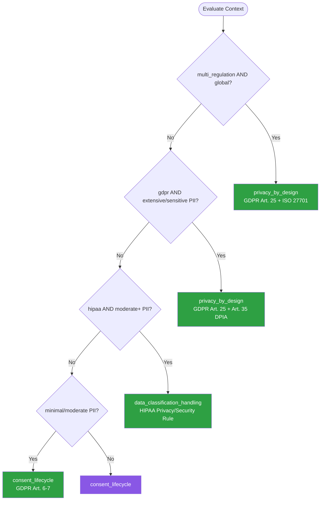

# Compliance Data Privacy — Summary

Purpose
- Data privacy and regulatory compliance patterns covering GDPR, CCPA, HIPAA, and SOC 2
- Scope: PII handling, consent management, data retention and deletion, data residency, audit trails, and privacy-by-design architecture

## Related Standards

| Standard | Relationship | Context |
|----------|-------------|---------|
| [encryption](../encryption/) | complementary | PII encryption at rest and in transit is a compliance requirement |
| [logging-observability](../../foundational/logging-observability/) | complementary | Audit logging is required for compliance evidence |
| [data-persistence](../../foundational/data-persistence/) | complementary | Data retention and deletion policies affect persistence layer design |
| [authentication](../../foundational/authentication/) | complementary | Consent and privacy preferences are tied to authenticated identities |

## Context Inputs

These inputs drive the decision tree — provide them to get a tailored recommendation.

| Input | Type | Required | Default | Values | Description |
|-------|------|----------|---------|--------|-------------|
| regulation | enum | yes | gdpr | gdpr, ccpa, hipaa, soc2, pci_dss, multi_regulation | Primary regulatory framework to comply with |
| pii_volume | enum | yes | moderate | minimal, moderate, extensive, sensitive_special_category | Volume and variety of PII processed |
| data_residency | enum | yes | single_region | no_restriction, single_region, multi_region_restricted, sovereign | Geographic constraints on data storage |
| user_base_geography | enum | yes | single_country | single_country, single_continent, global, mixed_jurisdictions | Geographic distribution of users/data subjects |

## Decision Tree

### Mermaid Diagram



### Text Fallback

- **Priority 1** → `privacy_by_design` — when multi_regulation and global user base. Most restrictive regulation as the baseline.
- **Priority 2** → `privacy_by_design` — when GDPR and extensive/sensitive PII. Requires DPIA, privacy-by-design, and explicit consent management.
- **Priority 3** → `data_classification_handling` — when HIPAA and moderate+ PII. Requires PHI classification, minimum necessary access, BAAs, and breach notification.
- **Priority 4** → `consent_lifecycle` — when minimal/moderate PII. Standard consent management, data minimization, and documented retention policies.
- **Fallback** → `consent_lifecycle` — Consent management with documented retention is the minimum for any PII processing.

> **Confidence**: high | **Risk if wrong**: critical

---

## Patterns

### 1. Privacy-by-Design Architecture

> Embed privacy controls into the system architecture from the start rather than bolting them on later. Data minimization, purpose limitation, and user control are architectural constraints, not features.

**Maturity**: enterprise

**Use when**
- New systems processing PII
- Multi-regulation environments (GDPR + CCPA + etc.)
- Systems handling special category data (health, biometric, financial)
- Global user base with mixed jurisdictions

**Avoid when**
- Systems that genuinely process no personal data

**Tradeoffs**

| Pros | Cons |
|------|------|
| Compliance is built-in, not retrofitted | Higher upfront design complexity |
| Reduces cost of future regulation changes | May constrain product feature design |
| User trust through demonstrable privacy controls | Requires cross-functional collaboration (legal, product, engineering) |
| Simplifies audit and certification processes | |

**Implementation Guidelines**
- Classify all data fields: PII, sensitive PII, special category, non-personal
- Implement data minimization: collect only what is necessary for the stated purpose
- Enforce purpose limitation: data collected for purpose A cannot be used for purpose B without new consent
- Design consent as a first-class entity: consent_id, purpose, granted_at, revoked_at, legal_basis
- Implement right-to-erasure as a system capability, not a manual process
- Use pseudonymization: replace direct identifiers with tokens; store mapping separately
- Build data residency into the persistence layer
- Conduct Data Protection Impact Assessment (DPIA) for high-risk processing
- Maintain a Record of Processing Activities (ROPA) as a living document

**Common Errors**

| Error | Impact | Fix |
|-------|--------|-----|
| Treating privacy as a feature flag instead of an architectural constraint | PII leaks into systems not designed for it (logs, analytics, caches) | PII handling is a data classification policy enforced at all layers |
| Collecting data because you might need it later | Violates data minimization; increases breach impact | Define and document purpose before collection; delete when purpose fulfilled |

**Standards & References**

| Standard | Type | Role | Reference |
|----------|------|------|-----------|
| GDPR Article 25 (Data Protection by Design) | standard | Legal requirement for privacy-by-design | — |
| ISO 27701 | standard | Privacy information management system extension to ISO 27001 | — |

---

### 2. Consent Lifecycle Management

> Manage user consent as a versioned, auditable lifecycle. Track what the user consented to, when, under which version of terms, and provide mechanisms to withdraw consent with downstream propagation.

**Maturity**: standard

**Use when**
- Any system processing PII with consent as legal basis
- Marketing, analytics, or profiling that requires opt-in
- Cookie consent and tracking preferences

**Avoid when**
- Processing based on legitimate interest, contractual necessity, or legal obligation (consent not the legal basis)

**Tradeoffs**

| Pros | Cons |
|------|------|
| Clear audit trail for regulatory inquiries | UX complexity for consent collection |
| User trust through transparent preference management | Consent withdrawal requires downstream propagation to all processors |
| Granular consent enables compliant personalization | Consent versioning adds data model complexity |

**Implementation Guidelines**
- Model consent as: {user_id, purpose, version, granted_at, source, revoked_at, legal_basis}
- Separate consent per purpose — never bundle
- Record the consent collection context: which UI, which version of privacy policy
- Implement consent withdrawal that propagates to all downstream processors
- Provide self-service consent dashboard (preference center)
- Re-request consent when privacy policy changes materially
- Default to opt-out for non-essential processing
- Log all consent events as immutable audit records

**Common Errors**

| Error | Impact | Fix |
|-------|--------|-----|
| Pre-checked consent boxes | Invalid consent under GDPR — must be freely given, specific, informed, unambiguous | All consent checkboxes unchecked by default; user must take affirmative action |
| No mechanism to withdraw consent | Regulatory violation — right to withdraw is as easy as granting | Provide consent withdrawal in preference center; propagate to all processors |

**Standards & References**

| Standard | Type | Role | Reference |
|----------|------|------|-----------|
| GDPR Articles 6-7 | standard | Legal basis for processing and conditions for consent | — |

---

### 3. Data Classification & Handling Framework

> Classify all data by sensitivity and apply handling rules proportional to the classification. Ensures sensitive data gets stronger controls while allowing efficient handling of non-sensitive data.

**Maturity**: standard

**Use when**
- Organizations handling mixed sensitivity data
- HIPAA or healthcare data environments
- Financial data subject to PCI DSS
- Government data classification requirements

**Avoid when**
- All data is the same classification (rare)

**Tradeoffs**

| Pros | Cons |
|------|------|
| Proportional security controls — strong where needed, efficient where not | Classification requires initial data audit effort |
| Clear handling rules reduce human error | Misclassification leads to under-protection or over-restriction |
| Enables automated policy enforcement | Ongoing classification of new data fields needed |

**Implementation Guidelines**
- Define classification levels: Public, Internal, Confidential, Restricted
- Map handling rules per level: encryption, access control, retention, logging
- Tag data fields with classification in schemas and data dictionaries
- Automate classification for known patterns (email, SSN, credit card via regex/ML)
- Implement data masking for non-production environments
- Restrict Restricted-class data to dedicated storage with enhanced access controls
- Log all access to Confidential and Restricted data
- Review and update classification quarterly

**Common Errors**

| Error | Impact | Fix |
|-------|--------|-----|
| Classifying everything as Confidential | Over-classification makes all controls equally burdensome; teams circumvent | Be specific — classify at field level; most data is Internal or Public |
| Not classifying data in logs and analytics | PII leaks into log aggregators accessible to many engineers | Include logs and analytics in data classification scope; mask/redact PII in logs |

**Standards & References**

| Standard | Type | Role | Reference |
|----------|------|------|-----------|
| NIST SP 800-60 (Information Types) | standard | Guide for mapping information types to security categories | — |
| HIPAA Security Rule (45 CFR 164) | standard | Security standards for electronic protected health information | — |

---

### 4. Data Retention & Right-to-Erasure

> Implement data retention policies with automated enforcement and honor data subject deletion requests (right to erasure) across all systems including backups, caches, and third-party processors.

**Maturity**: standard

**Use when**
- Any system storing PII with retention obligations
- GDPR right-to-erasure compliance
- CCPA right-to-delete compliance
- Reducing data liability through proactive deletion

**Avoid when**
- Legal hold or litigation preservation overrides retention policy (temporary)

**Tradeoffs**

| Pros | Cons |
|------|------|
| Reduces breach impact by limiting stored data | Deletion across distributed systems is complex |
| Demonstrates compliance with data minimization | Backup deletion may require special handling |
| Reduces storage costs over time | Legal hold exceptions add complexity |

**Implementation Guidelines**
- Define retention periods per data type: transactional (7 years), logs (90 days), analytics (2 years)
- Implement automated deletion jobs that run on schedule
- For right-to-erasure: delete or anonymize personal data within 30 days of request
- Propagate deletion to all processors: third-party APIs, analytics, email providers
- Handle backups: use crypto-shredding (encrypt each user's data with a unique key, destroy the key)
- Maintain deletion log as compliance evidence
- Implement soft-delete with grace period before hard-delete

**Common Errors**

| Error | Impact | Fix |
|-------|--------|-----|
| Deleting from primary database but not from backups, caches, or analytics | Data persists in secondary systems — non-compliant | Inventory all data locations per PII type; implement deletion across all systems or use crypto-shredding |
| No automated retention enforcement | Data accumulates indefinitely; retention policy exists on paper only | Implement scheduled deletion jobs; monitor execution; alert on failures |

**Standards & References**

| Standard | Type | Role | Reference |
|----------|------|------|-----------|
| GDPR Article 17 (Right to Erasure) | standard | Legal right to data deletion | — |
| CCPA Section 1798.105 | standard | Consumer right to delete personal information | — |

---

## Examples

### Consent Data Model — Granular Purpose-Based Consent
**Context**: Modeling user consent with per-purpose tracking and audit trail

**Correct** implementation:
```python
consent_record = {
    "consent_id": "uuid-v4",
    "user_id": "user-123",
    "purpose": "marketing_email",
    "legal_basis": "consent",
    "status": "granted",
    "granted_at": "2026-04-22T10:00:00Z",
    "revoked_at": None,
    "policy_version": "2.1",
    "collection_method": "web_form",
    "propagated_to": [
        {"processor": "email-service", "notified_at": "2026-04-22T10:00:05Z"},
        {"processor": "analytics", "notified_at": "2026-04-22T10:00:05Z"}
    ]
}

def withdraw_consent(user_id, purpose):
    consent = find_consent(user_id, purpose)
    consent.status = "withdrawn"
    consent.revoked_at = now()
    for processor in consent.propagated_to:
        notify_processor_withdrawal(processor, user_id, purpose)
    audit_log.append({"event": "consent_withdrawn", ...})
```

**Incorrect** implementation:
```text
# WRONG: Single boolean for all consent — no granularity
user = {
    "accepted_terms": True,
    "accepted_at": "2026-04-22"
    # No purpose tracking, no policy version, no withdrawal mechanism
}

# WRONG: Pre-checked consent in UI
<input type="checkbox" checked>  # Invalid — must be unchecked by default
```

**Why**: The correct model tracks consent per purpose with full audit trail, policy versioning, and downstream propagation. The incorrect version bundles all consent into one boolean with no granularity, versioning, or withdrawal capability.

---

## Security Hardening

### Transport
- All PII transmitted over TLS 1.2+ only
- Cross-border data transfers use approved mechanisms (SCCs, adequacy decisions)

### Data Protection
- PII encrypted at rest with per-user or per-tenant keys where feasible
- Pseudonymization applied to PII in analytics and non-production environments
- Data masking for PII in logs (email, phone, SSN redacted)

### Access Control
- PII access restricted to authorized personnel with documented need
- Access to Restricted-class data requires approval and is time-limited
- All PII access logged with user identity and timestamp

### Input/Output
- PII not exposed in URLs, error messages, or debug logs
- Export/download of PII requires authorization and audit logging

### Secrets
- Encryption keys for PII stored in KMS/HSM, not application config
- Crypto-shredding keys managed with same rigor as the data they protect

### Monitoring
- Alert on bulk PII access or export (potential data exfiltration)
- Monitor consent withdrawal rates for anomalies
- Track data deletion job execution and failures

---

## Anti-Patterns

| Anti-Pattern | Severity | Description | Fix |
|-------------|----------|-------------|-----|
| Consent Dark Patterns | high | UI designs that manipulate users into granting consent: pre-checked boxes, confusing opt-out flows, "accept all" prominent while "manage preferences" is hidden. | Equal prominence for accept and decline; all boxes unchecked by default; one-click opt-out |
| PII in Logs | high | Logging full email addresses, phone numbers, IP addresses, or other PII to application logs accessible to engineering teams. | Mask/redact PII in logs; use structured logging with PII fields tagged for automatic redaction |
| Retention Without Deletion | high | Defining data retention policies in documentation but never implementing automated deletion. Data accumulates indefinitely. | Implement automated retention enforcement with scheduled deletion jobs |
| Copy-Paste Compliance | medium | Copying another organization's privacy policy without mapping it to actual data processing activities. | Map privacy policy to actual processing activities; maintain ROPA |

---

## Checklist

| ID | Category | Description | Severity |
|----|----------|-------------|----------|
| CDP-01 | compliance | All PII fields classified and documented in data dictionary | critical |
| CDP-02 | compliance | Consent collected per purpose with audit trail | critical |
| CDP-03 | compliance | Right-to-erasure can be fulfilled within 30 days across all systems | critical |
| CDP-04 | compliance | Data retention policies defined and automated | high |
| CDP-05 | security | PII encrypted at rest and in transit | critical |
| CDP-06 | compliance | PII masked in logs and non-production environments | high |
| CDP-07 | compliance | Cross-border data transfers use approved mechanisms | high |
| CDP-08 | compliance | DPIA conducted for high-risk processing activities | high |
| CDP-09 | compliance | Record of Processing Activities (ROPA) maintained and current | high |
| CDP-10 | compliance | Consent withdrawal propagates to all downstream processors | critical |

---

## Compliance

| Standard | Relevance | Reference |
|----------|-----------|-----------|
| GDPR | EU data protection regulation — primary framework for PII handling | https://gdpr-info.eu/ |
| CCPA | California privacy law for consumer data rights | — |
| HIPAA | US healthcare data protection requirements | — |
| ISO 27701 | Privacy information management system standard | — |

### Requirements Mapping

| Control | Description | Maps To |
|---------|-------------|---------|
| consent_management | Granular, purpose-based consent with withdrawal capability | GDPR Art. 6-7, CCPA 1798.120 |
| data_subject_rights | Right to access, rectification, erasure, portability | GDPR Art. 15-20, CCPA 1798.100-125 |
| data_minimization | Collect only necessary data for stated purpose | GDPR Art. 5(1)(c) |

---

## Prompt Recipes

### Greenfield — Design privacy architecture for a new system
```
Design privacy and compliance architecture. Context: Regulations, PII types, User geography, Data residency. Requirements: Data classification, consent model, retention policy, right-to-erasure, audit trail.
```

### Audit — Audit privacy compliance posture
```
Audit: PII classified? Consent per purpose? Withdrawal propagated? Retention automated? Erasure within 30 days? PII encrypted? PII masked in logs? Cross-border transfers? DPIA conducted? ROPA maintained?
```

### Operations — Implement right-to-erasure across distributed systems
```
Steps: Inventory PII systems, design deletion API, implement per-system deletion, handle backups (crypto-shredding), notify third-party processors, generate deletion confirmation, 30-day SLA monitoring.
```

### Audit — Conduct a Data Protection Impact Assessment
```
DPIA sections: Processing description, necessity assessment, risk assessment, mitigation measures, consultation, decision, review schedule.
```

---

## Links
- Full standard: [compliance-data-privacy.yaml](compliance-data-privacy.yaml)
