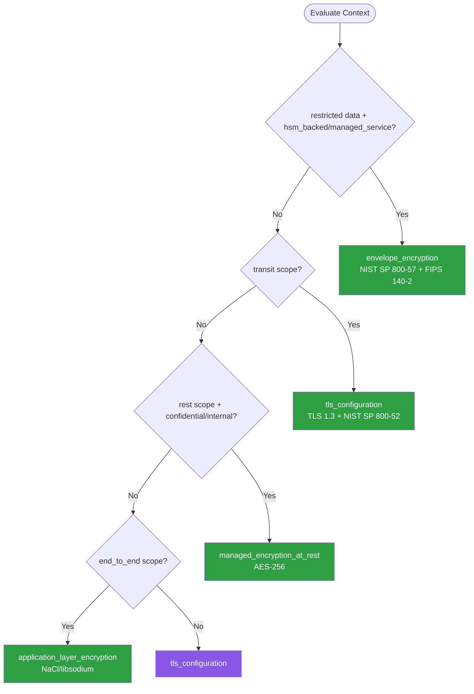

# Encryption — Summary

Purpose
- Data encryption at rest and in transit, key management lifecycle, and cryptographic best practices
- Scope: TLS configuration, symmetric/asymmetric encryption, envelope encryption, and secrets rotation

## Related Standards

| Standard | Relationship | Context |
|----------|-------------|---------|
| [authentication](../../foundational/authentication/) | complementary | Token encryption and transport security depend on encryption standards |
| [data-persistence](../../foundational/data-persistence/) | complementary | Stored data requires encryption at rest per this standard |
| [configuration-management](../../foundational/configuration-management/) | complementary | Encryption keys and certificates are sensitive configuration items |

## Context Inputs

These inputs drive the decision tree — provide them to get a tailored recommendation.

| Input | Type | Required | Default | Values | Description |
|-------|------|----------|---------|--------|-------------|
| data_classification | enum | yes | confidential | public, internal, confidential, restricted | Sensitivity level of the data to protect |
| encryption_scope | enum | yes | transit_and_rest | transit_only, rest_only, transit_and_rest, end_to_end | Where encryption is applied |
| key_management_model | enum | yes | managed_service | self_managed, managed_service, hsm_backed, hybrid | How encryption keys are managed |
| compliance_regime | enum | no | general | general, pci_dss, hipaa, gdpr, fedramp | Regulatory requirements affecting encryption |

## Decision Tree

### Mermaid Diagram



### Text Fallback

- **Priority 1** → `envelope_encryption` — when data_classification is restricted and key_management_model is hsm_backed or managed_service. Restricted data requires envelope encryption with HSM-backed key hierarchy.
- **Priority 2** → `tls_configuration` — when encryption_scope includes transit. All data in transit must use TLS 1.2+ with strong cipher suites.
- **Priority 3** → `managed_encryption_at_rest` — when encryption_scope includes rest and data is confidential/internal. Transparent managed encryption with automatic key rotation.
- **Priority 4** → `application_layer_encryption` — when encryption_scope is end_to_end. Application-layer cryptography where data is encrypted before leaving the client.
- **Fallback** → `tls_configuration` — TLS 1.2+ for transit and managed encryption at rest cover most use cases.

> **Confidence**: high | **Risk if wrong**: critical

---

## Patterns

### 1. TLS Configuration & Certificate Management

> Properly configure TLS for all network communication. Enforce modern protocol versions, strong cipher suites, certificate validation, and automated certificate lifecycle management.

**Maturity**: standard

**Use when**
- Any service exposing network endpoints
- Service-to-service communication
- API endpoints (REST, gRPC, GraphQL)
- Database connections

**Avoid when**
- Truly air-gapped environments with no network (extremely rare)

**Tradeoffs**

| Pros | Cons |
|------|------|
| Protects data in transit from eavesdropping and tampering | Certificate management overhead (rotation, renewal) |
| Certificate-based authentication provides mutual TLS | TLS termination adds CPU overhead (minimal with modern hardware) |
| Industry standard with broad tooling support | Debugging encrypted traffic requires additional tooling |
| TLS 1.3 reduces handshake latency | |

**Implementation Guidelines**
- Enforce TLS 1.2 minimum, prefer TLS 1.3 for new services
- Disable SSLv3, TLS 1.0, TLS 1.1 — no exceptions
- Use strong cipher suites: AES-256-GCM, ChaCha20-Poly1305
- Enable HSTS header with includeSubDomains and preload
- Automate certificate renewal with ACME (Let's Encrypt) or cloud CA
- Use short-lived certificates (90 days max, prefer 30 days)
- Enable OCSP stapling for certificate revocation
- Implement certificate pinning only for mobile apps (not web)

**Common Errors**

| Error | Impact | Fix |
|-------|--------|-----|
| Allowing TLS 1.0/1.1 for backward compatibility | Vulnerable to BEAST, POODLE, and other downgrade attacks | Disable TLS <1.2; all modern clients support TLS 1.2+ |
| Self-signed certificates in production without proper trust | Applications may disable certificate validation to work around errors | Use certificates from trusted CA; use internal CA for service mesh |
| Not renewing certificates before expiry | Service outage when certificate expires | Automate renewal with ACME; alert at 30, 14, 7 days before expiry |

**Standards & References**

| Standard | Type | Role | Reference |
|----------|------|------|-----------|
| TLS 1.3 (RFC 8446) | rfc | Current recommended transport security protocol | https://www.rfc-editor.org/rfc/rfc8446 |
| NIST SP 800-52 Rev 2 | standard | Guidelines for TLS implementation selection | — |

---

### 2. Managed Encryption at Rest

> Leverage cloud provider or database-managed encryption at rest. Data is transparently encrypted when written and decrypted when read, with keys managed by the platform. Minimal application changes required.

**Maturity**: standard

**Use when**
- Cloud-hosted databases and object storage
- Confidential data that must be encrypted at rest
- When transparency and simplicity are priorities
- Compliance requires encryption at rest documentation

**Avoid when**
- Need to control encryption keys entirely (use envelope encryption)
- Multi-tenant isolation requires per-tenant keys

**Tradeoffs**

| Pros | Cons |
|------|------|
| Zero application code changes — transparent to the app | Cloud provider has access to keys (unless customer-managed keys) |
| Automatic key rotation handled by the provider | Cannot encrypt at field level — entire volume/table encrypted |
| Compliant with most regulatory requirements | No protection if attacker has application-level access |
| Performance impact negligible (hardware-accelerated AES) | |

**Implementation Guidelines**
- Enable encryption at rest on all storage services (S3, RDS, Cosmos DB, etc.)
- Use customer-managed keys (CMK) for confidential/restricted data
- Configure automatic key rotation (annually minimum)
- Audit key access via cloud provider audit logs
- Verify encryption status in infrastructure-as-code (not just console)
- Use AES-256 as the minimum algorithm

**Common Errors**

| Error | Impact | Fix |
|-------|--------|-----|
| Assuming encryption is enabled by default | Data stored unencrypted; compliance violation | Explicitly enable encryption in IaC templates; add policy to block unencrypted resources |
| Using provider-managed keys for restricted data | Cloud provider retains key access; may not satisfy compliance | Use customer-managed keys (CMK) stored in your cloud KMS |

**Standards & References**

| Standard | Type | Role | Reference |
|----------|------|------|-----------|
| AES-256-GCM | standard | Symmetric encryption algorithm for data at rest | — |
| NIST SP 800-111 | standard | Guide to storage encryption technologies | — |

---

### 3. Envelope Encryption with Key Hierarchy

> Encrypt data with a Data Encryption Key (DEK), then encrypt the DEK with a Key Encryption Key (KEK) stored in a hardware security module or KMS. Enables per-record/per-tenant encryption with efficient key rotation.

**Maturity**: enterprise

**Use when**
- Multi-tenant systems needing per-tenant encryption
- Field-level encryption for sensitive columns
- Regulatory requirements mandating HSM-backed keys
- Large datasets where re-encrypting everything for key rotation is impractical

**Avoid when**
- Simple encryption at rest is sufficient (use managed encryption)
- Application cannot tolerate encryption/decryption latency

**Tradeoffs**

| Pros | Cons |
|------|------|
| Key rotation only re-wraps DEK — data doesn't need re-encryption | More complex implementation than managed encryption |
| Per-tenant/per-record key isolation | Additional KMS API calls for encrypt/decrypt operations |
| Master key never leaves HSM/KMS boundary | Must manage DEK storage and caching |
| Supports field-level encryption granularity | |

**Implementation Guidelines**
- Generate DEK locally, encrypt data, then wrap DEK with KEK via KMS
- Store wrapped (encrypted) DEK alongside the encrypted data
- Cache plaintext DEK in memory briefly — never persist to disk
- Rotate KEK periodically; re-wrap all DEKs (no data re-encryption)
- Use unique DEK per tenant, record, or logical partition
- Audit all KMS key usage via cloud audit logs

**Common Errors**

| Error | Impact | Fix |
|-------|--------|-----|
| Storing plaintext DEK alongside data | Attacker who accesses storage gets both data and key | Store only the KMS-wrapped DEK; retrieve plaintext DEK via KMS API |
| Using same DEK for all tenants | Compromise of one tenant's data exposes all tenants | Generate unique DEK per tenant; wrap each with the shared KEK |
| Not caching DEK, calling KMS for every operation | Excessive KMS costs and latency; potential rate limiting | Cache plaintext DEK in memory with short TTL; re-fetch on eviction |

**Standards & References**

| Standard | Type | Role | Reference |
|----------|------|------|-----------|
| NIST SP 800-57 Key Management | standard | Key management recommendations and lifecycle | https://csrc.nist.gov/publications/detail/sp/800-57-part-1/rev-5/final |
| FIPS 140-2 | standard | Security requirements for cryptographic modules (HSM) | — |

---

### 4. Application-Layer / End-to-End Encryption

> Encrypt data at the application layer before it leaves the client or service. Data remains encrypted through all intermediaries and is decrypted only by the intended recipient.

**Maturity**: advanced

**Use when**
- Zero-trust environments where intermediaries are untrusted
- Messaging systems requiring end-to-end privacy
- Client-side encryption before data reaches the backend
- Healthcare or financial data requiring encryption beyond TLS

**Avoid when**
- TLS is sufficient (most API scenarios)
- Server needs to process/query encrypted data (use searchable encryption)

**Tradeoffs**

| Pros | Cons |
|------|------|
| Data protected even if intermediary is compromised | Cannot search, index, or process encrypted data server-side |
| True zero-knowledge — server never sees plaintext | Key distribution is complex (requires secure key exchange) |
| Strongest privacy guarantee for sensitive data | Application complexity increases significantly |
| | Debugging is harder — encrypted payloads are opaque |

**Implementation Guidelines**
- Use NaCl/libsodium or Web Crypto API for encryption primitives
- Never implement custom cryptographic algorithms
- Use authenticated encryption (AEAD): AES-256-GCM or XChaCha20-Poly1305
- Implement secure key exchange (X25519 Diffie-Hellman)
- Include nonce/IV with every encrypted message (never reuse)
- Version the encryption scheme to allow algorithm migration

**Common Errors**

| Error | Impact | Fix |
|-------|--------|-----|
| Implementing custom encryption instead of using proven libraries | Subtle vulnerabilities in custom crypto; not peer-reviewed | Use NaCl/libsodium, Web Crypto API, or Tink — never roll your own |
| Reusing nonce/IV with the same key | Catastrophic — allows plaintext recovery with GCM | Generate random nonce for every encryption operation; use 96-bit minimum |

**Standards & References**

| Standard | Type | Role | Reference |
|----------|------|------|-----------|
| NaCl / libsodium | framework | High-level cryptographic library with safe defaults | https://doc.libsodium.org/ |
| Google Tink | framework | Multi-language crypto library with key management | — |

---

## Examples

### Envelope Encryption — Encrypt User PII
**Context**: Encrypting personally identifiable information per-user with envelope encryption

**Correct** implementation:
```python
# Generate DEK for this user
dek = crypto.generate_random_bytes(32)  # 256-bit AES key

# Encrypt the data with DEK
nonce = crypto.generate_random_bytes(12)  # 96-bit nonce
encrypted_data = aes_256_gcm_encrypt(dek, nonce, user_pii_json)

# Wrap (encrypt) the DEK with KEK via KMS
wrapped_dek = kms.encrypt(key_id="alias/user-data-kek", plaintext=dek)

# Store: encrypted data + nonce + wrapped DEK
database.store(user_id, {
    "encrypted_pii": encrypted_data,
    "nonce": nonce,
    "wrapped_dek": wrapped_dek,
    "kek_id": "alias/user-data-kek",
    "algorithm": "AES-256-GCM"
})

# Clear plaintext DEK from memory immediately
secure_zero(dek)
```

**Incorrect** implementation:
```text
# WRONG: Single shared key, stored in code, no envelope encryption
ENCRYPTION_KEY = "my-secret-key-do-not-share"  # hardcoded!
encrypted_data = aes_encrypt(ENCRYPTION_KEY, user_pii_json)
# No nonce — uses ECB mode implicitly
# Same key for all users — compromise exposes everything
```

**Why**: Envelope encryption uses per-user DEKs wrapped by a KMS-managed KEK. Key rotation only re-wraps DEKs. The incorrect version uses a hardcoded shared key with no nonce, making it vulnerable to key compromise and impossible to rotate.

---

### TLS Configuration — Web Server
**Context**: Configuring TLS for a production web server

**Correct** implementation:
```nginx
server {
    listen 443 ssl http2;
    ssl_protocols TLSv1.2 TLSv1.3;
    ssl_ciphers ECDHE-ECDSA-AES256-GCM-SHA384:ECDHE-RSA-AES256-GCM-SHA384:ECDHE-ECDSA-CHACHA20-POLY1305;
    ssl_prefer_server_ciphers on;
    ssl_certificate /etc/letsencrypt/live/example.com/fullchain.pem;
    ssl_certificate_key /etc/letsencrypt/live/example.com/privkey.pem;
    add_header Strict-Transport-Security "max-age=31536000; includeSubDomains; preload" always;
    ssl_stapling on;
    ssl_stapling_verify on;
}
server {
    listen 80;
    return 301 https://$host$request_uri;
}
```

**Incorrect** implementation:
```text
server {
    listen 443 ssl;
    ssl_protocols SSLv3 TLSv1 TLSv1.1 TLSv1.2;  # SSLv3 and TLS 1.0 vulnerable!
    ssl_ciphers ALL:!aNULL;  # Allows weak ciphers
    # No HSTS, no OCSP stapling, self-signed certificate
}
```

**Why**: The correct version enforces TLS 1.2+ only, uses strong cipher suites, includes HSTS, and enables OCSP stapling. The incorrect version allows known-vulnerable protocols and weak ciphers.

---

## Security Hardening

### Transport
- TLS 1.2 minimum for all network communication; TLS 1.3 preferred
- Disable SSLv3, TLS 1.0, TLS 1.1 — no exceptions
- HSTS header with min 1-year max-age, includeSubDomains

### Data Protection
- AES-256-GCM or ChaCha20-Poly1305 for symmetric encryption
- RSA-2048 minimum for asymmetric; prefer Ed25519 or ECDSA P-256
- Encryption at rest enabled on all storage services

### Access Control
- KMS key policies follow least privilege
- Separate keys per environment (dev/staging/prod)
- Audit all key usage via cloud audit logs

### Input/Output
- Use authenticated encryption (AEAD) — never unauthenticated modes (ECB, CBC without HMAC)
- Include nonce/IV with every ciphertext — never reuse nonces

### Secrets
- Encryption keys never stored in source code or environment variables
- Keys stored in KMS, HSM, or dedicated secret manager
- Automatic key rotation (annually minimum)

### Monitoring
- Monitor certificate expiry — alert at 30, 14, 7 days
- Audit KMS key access patterns for anomalies
- Alert on TLS handshake failures (potential downgrade attacks)

---

## Anti-Patterns

| Anti-Pattern | Severity | Description | Fix |
|-------------|----------|-------------|-----|
| Hardcoded Encryption Keys | critical | Embedding encryption keys directly in source code or configuration files committed to version control. | Store keys in KMS, HSM, or secret manager; inject at runtime |
| Rolling Your Own Crypto | critical | Implementing custom encryption algorithms instead of using vetted, peer-reviewed libraries. | Use NaCl/libsodium, Web Crypto API, Tink, or language standard crypto libraries |
| Using Deprecated Algorithms | high | Using MD5, SHA1, DES, 3DES, RC4, or ECB mode. These have known weaknesses. | Use AES-256-GCM for encryption, SHA-256+ for hashing, Argon2id for password hashing |
| Nonce/IV Reuse | critical | Reusing the same nonce with the same encryption key. For AES-GCM, allows authentication tag forgery and plaintext recovery. | Generate random nonce per encryption operation; use 96-bit minimum for GCM |

---

## Checklist

| ID | Category | Description | Severity |
|----|----------|-------------|----------|
| ENC-01 | security | TLS 1.2+ enforced for all network communication | critical |
| ENC-02 | security | Legacy protocols (SSLv3, TLS 1.0, TLS 1.1) disabled | critical |
| ENC-03 | security | Strong cipher suites configured (AES-256-GCM, ChaCha20-Poly1305) | high |
| ENC-04 | security | HSTS header enabled with includeSubDomains | high |
| ENC-05 | compliance | Encryption at rest enabled on all storage services | critical |
| ENC-06 | security | Encryption keys stored in KMS/HSM, not in code | critical |
| ENC-07 | security | Automatic key rotation configured | high |
| ENC-08 | security | Authenticated encryption used (AEAD) — no ECB or unauthenticated CBC | critical |
| ENC-09 | security | Unique nonce/IV per encryption operation — never reused | critical |
| ENC-10 | reliability | Certificate expiry monitored with automated renewal | high |
| ENC-11 | compliance | Customer-managed keys (CMK) used for restricted data | high |
| ENC-12 | security | No deprecated algorithms (MD5, SHA1, DES, RC4, ECB) in use | critical |

---

## Compliance

| Standard | Relevance | Reference |
|----------|-----------|-----------|
| NIST SP 800-57 Key Management | Comprehensive key management lifecycle guidance | https://csrc.nist.gov/publications/detail/sp/800-57-part-1/rev-5/final |
| PCI DSS Requirement 4 | Encrypt transmission of cardholder data across open networks | — |
| OWASP Cryptographic Failures (A02:2021) | Top-10 web application security risk for cryptographic issues | https://owasp.org/Top10/A02_2021-Cryptographic_Failures/ |

### Requirements Mapping

| Control | Description | Maps To |
|---------|-------------|---------|
| data_in_transit_encryption | All data transmitted over networks encrypted with TLS 1.2+ | PCI DSS 4.1, NIST SP 800-52 Rev 2 |
| data_at_rest_encryption | All sensitive data encrypted at rest with AES-256 | PCI DSS 3.4, NIST SP 800-111 |
| key_management | Encryption keys managed with proper lifecycle | NIST SP 800-57, PCI DSS 3.5, 3.6 |

---

## Prompt Recipes

### Greenfield — Design encryption strategy
```
Design encryption strategy. Context: Data classification, Encryption scope, Key management, Compliance. Requirements: TLS 1.2+, encryption at rest, key rotation strategy, certificate automation, no hardcoded keys.
```

### Audit — Audit existing encryption implementation
```
Audit: TLS 1.2+? Legacy protocols disabled? Strong ciphers? HSTS? Trusted CA certificates with auto-renewal? Encryption at rest? Keys in KMS/HSM? Key rotation automated? Unique nonces? Authenticated encryption?
```

### Migration — Migrate from weak to strong encryption
```
Steps: Inventory current encryption, identify gaps, plan migration (dual-write period), implement (update TLS, rotate keys, re-encrypt), verify, document.
```

### Operations — Implement encryption key rotation
```
Requirements: Rotate KEK annually, re-wrap DEKs, rotate TLS certificates, verify no disruption, audit log rotation events, test rollback.
```

---

## Links
- Full standard: [encryption.yaml](encryption.yaml)
