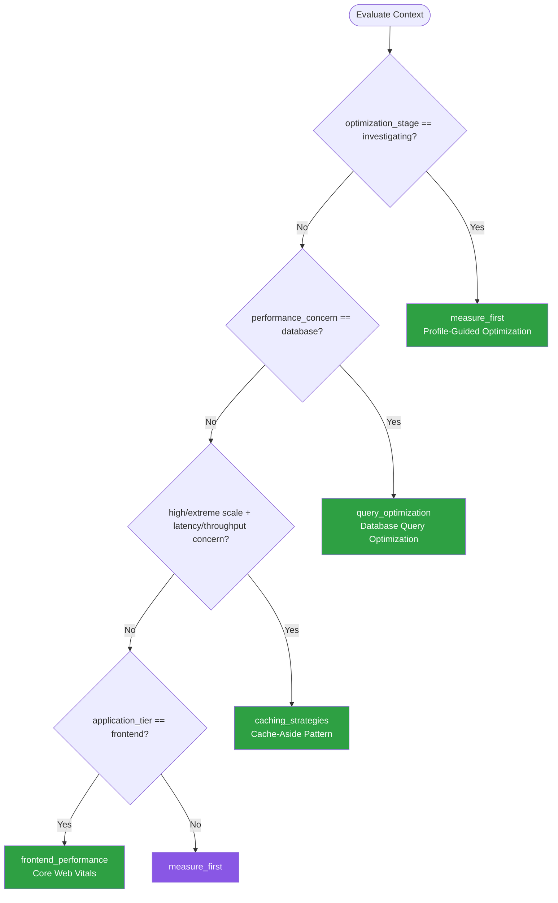

# Performance Optimization — Summary

Purpose
- Performance profiling, optimization patterns, caching strategies, and scalability
- Scope: Measure-first approach to performance, common optimization patterns, and when to apply them

## Related Standards

| Standard | Relationship | Context |
|----------|-------------|---------|
| [logging-observability](../../foundational/logging-observability/) | complementary | Observability provides the metrics needed to identify performance issues |
| [data-persistence](../../foundational/data-persistence/) | complementary | Database query optimization is a common performance bottleneck |
| [cloud-architecture](../../infrastructure/cloud-architecture/) | complementary | Cloud architecture decisions directly impact performance and scalability |

## Context Inputs

These inputs drive the decision tree — provide them to get a tailored recommendation.

| Input | Type | Required | Default | Values | Description |
|-------|------|----------|---------|--------|-------------|
| performance_concern | enum | yes | latency | latency, throughput, memory, startup_time, database, network | Primary performance area of concern |
| application_tier | enum | yes | backend | frontend, backend, database, network, full_stack | Which tier has the performance issue |
| optimization_stage | enum | yes | investigating | designing, investigating, optimizing, validating | Where you are in the optimization process |
| scale_requirements | enum | no | moderate | low, moderate, high, extreme | Expected scale of the system |

## Decision Tree

### Mermaid Diagram



### Text Fallback

- **Priority 1** → `measure_first` — when optimization_stage is investigating. Always profile before optimizing.
- **Priority 2** → `query_optimization` — when performance_concern is database. Database queries are the most common backend bottleneck.
- **Priority 3** → `caching_strategies` — when scale is high/extreme and concern is latency/throughput. Multi-layer caching to reduce backend load.
- **Priority 4** → `frontend_performance` — when application_tier is frontend. Focus on Core Web Vitals.
- **Fallback** → `measure_first` — Always measure before optimizing — find the real bottleneck first.

> **Confidence**: high | **Risk if wrong**: medium

---

## Patterns

### 1. Measure First — Profile-Guided Optimization

> Profile the application to identify actual bottlenecks before optimizing. Developers' intuition about performance hotspots is wrong more than half the time. Profiling provides data to focus effort where it matters most.

**Maturity**: standard

**Use when**
- Performance issue reported but root cause unknown
- Starting any optimization effort
- After deployment to validate performance meets SLOs
- Comparing before/after optimization effectiveness

**Avoid when**
- Applying well-known best practices during initial design (e.g., database indexing)

**Tradeoffs**

| Pros | Cons |
|------|------|
| Focus optimization effort on actual bottlenecks | Profiling adds overhead — may not reflect exact production behavior |
| Avoid wasting time optimizing code that isn't slow | Production profiling requires careful instrumentation |
| Data-driven decisions replace guesswork | Sampling profilers may miss short-lived hotspots |
| Provides baseline for measuring improvement | |

**Implementation Guidelines**
- Establish performance budget / SLOs before optimizing (e.g., p99 < 200ms)
- Profile in production-like conditions (same data volume, traffic pattern)
- Use language-appropriate profiler (pprof, py-spy, async-profiler, Chrome DevTools)
- Profile CPU, memory, I/O, and network separately
- Focus on p95/p99 latency, not average (averages hide tail latency)
- Create reproducible benchmarks for before/after comparison
- Optimize the top bottleneck, re-profile, repeat (Amdahl's Law)

**Common Errors**

| Error | Impact | Fix |
|-------|--------|-----|
| Optimizing without profiling (premature optimization) | Wasted effort on code that contributes <1% of total latency | Profile first; optimize only what the data shows is slow |
| Using average latency as the performance metric | Hides tail latency — 1% of users may see 10x slower response | Use percentile metrics: p50, p95, p99, p99.9 |
| Benchmarking on developer machine, not production-like environment | Results don't reflect production | Benchmark in staging with production-like data volume and traffic |

**Standards & References**

| Standard | Type | Role | Reference |
|----------|------|------|-----------|
| USE Method (Brendan Gregg) | practice | Systematic performance analysis methodology | https://www.brendangregg.com/usemethod.html |
| RED Method | practice | Request-focused performance monitoring (Rate, Errors, Duration) | — |

---

### 2. Multi-Layer Caching

> Implement caching at multiple layers to reduce redundant computation and I/O. Layers include: browser cache, CDN, API gateway cache, application cache (Redis/Memcached), and database query cache.

**Maturity**: standard

**Use when**
- Read-heavy workloads (read:write ratio > 10:1)
- Expensive computations with stable results
- Database queries that repeat frequently
- Static or semi-static content serving

**Avoid when**
- Write-heavy workloads where data changes constantly
- Data that must always be real-time fresh
- Simple applications where caching adds unnecessary complexity

**Tradeoffs**

| Pros | Cons |
|------|------|
| Dramatic latency reduction (cache hit: <1ms vs database: 5-50ms) | Cache invalidation complexity |
| Reduced backend load — fewer database queries | Stale data risk if TTL is too long |
| Improved throughput | Memory cost for cache storage |
| Cost reduction — less compute and database I/O | Cache stampede/thundering herd on expiry |

**Implementation Guidelines**
- Use cache-aside (lazy loading) as default pattern
- Set TTL based on data freshness requirements
- Implement cache warming for predictable traffic patterns
- Use distributed cache (Redis) for multi-instance deployments
- Cache at the highest layer possible (CDN > API gateway > app > DB)
- Monitor cache hit ratio — target >90% for effective caching
- Handle cache failures gracefully — fall back to origin

**Common Errors**

| Error | Impact | Fix |
|-------|--------|-----|
| No cache invalidation strategy | Users see stale data; data inconsistency | Implement TTL + event-driven invalidation; use write-through for critical data |
| Cache stampede on expiry (thundering herd) | All instances simultaneously query the database when cache expires | Use cache locking, jittered TTL, or stale-while-revalidate pattern |
| Caching unbounded data (no eviction policy) | Cache grows until memory is exhausted | Set max memory with LRU/LFU eviction policy |

**Standards & References**

| Standard | Type | Role | Reference |
|----------|------|------|-----------|
| Cache-Aside Pattern | pattern | Lazy-loading cache strategy | — |
| HTTP Cache-Control | rfc | Browser and CDN caching directives | https://www.rfc-editor.org/rfc/rfc9111 |

---

### 3. Database Query Optimization

> Optimize database queries, indexes, and access patterns to reduce latency and resource consumption. The database is the most common backend bottleneck.

**Maturity**: standard

**Use when**
- Database queries identified as bottleneck (via profiling)
- N+1 query patterns detected
- Slow queries appearing in database logs
- Growing data volume degrading performance

**Avoid when**
- Database is not the bottleneck (profile first)
- Premature optimization before measuring

**Tradeoffs**

| Pros | Cons |
|------|------|
| Often the highest-impact optimization (10-100x improvement) | Indexes consume storage and slow writes |
| Index additions require no code changes | Over-indexing degrades write performance |
| Query plan analysis provides clear optimization path | Query optimization can be database-specific |

**Implementation Guidelines**
- Enable slow query logging with a low threshold (100ms)
- Use EXPLAIN/EXPLAIN ANALYZE to understand query plans
- Add indexes for columns in WHERE, JOIN, and ORDER BY clauses
- Eliminate N+1 queries with eager loading or batch queries
- Use connection pooling (PgBouncer, HikariCP)
- Implement read replicas for read-heavy workloads
- Partition large tables by time or logical key
- Monitor query performance over time (pg_stat_statements, slow log)

**Common Errors**

| Error | Impact | Fix |
|-------|--------|-----|
| N+1 query pattern | 100 items = 101 queries instead of 2; linear performance degradation | Use eager loading (JOIN), batch loading (WHERE id IN (...)), or dataloader pattern |
| Missing indexes on frequently queried columns | Full table scan on every query; O(n) instead of O(log n) | Add indexes based on query patterns |
| SELECT * instead of specific columns | Fetches unnecessary data; prevents covering index optimization | Select only needed columns; use projections |

**Standards & References**

| Standard | Type | Role | Reference |
|----------|------|------|-----------|
| Database Query Optimization | practice | Systematic approach to query performance | — |

---

### 4. Frontend Performance (Core Web Vitals)

> Optimize frontend performance targeting Core Web Vitals metrics: Largest Contentful Paint (LCP), Interaction to Next Paint (INP), and Cumulative Layout Shift (CLS). Directly impacts SEO ranking and user experience.

**Maturity**: standard

**Use when**
- Web application with user-facing frontend
- SEO is important (Google uses Web Vitals for ranking)
- Mobile users on slow connections
- Core Web Vitals scores are below targets

**Avoid when**
- Internal tools with no public-facing component
- Backend-only services

**Tradeoffs**

| Pros | Cons |
|------|------|
| Better SEO ranking (Google uses Web Vitals) | Can require significant refactoring |
| Improved user experience and engagement | Trade-offs between functionality and performance |
| Reduced bounce rate on mobile | Requires ongoing monitoring (metrics drift) |
| Measurable with standardized metrics | |

**Implementation Guidelines**
- Target: LCP < 2.5s, INP < 200ms, CLS < 0.1
- Optimize critical rendering path: inline critical CSS, defer non-critical
- Use code splitting and lazy loading for JavaScript bundles
- Optimize images: use modern formats (WebP, AVIF), responsive sizes, lazy loading
- Implement resource hints: preload, prefetch, preconnect for critical resources
- Use CDN for static assets
- Minimize main-thread work: defer non-essential JavaScript
- Monitor with Real User Monitoring (RUM) and Lighthouse

**Common Errors**

| Error | Impact | Fix |
|-------|--------|-----|
| Render-blocking JavaScript and CSS | Page appears blank until large bundles download and parse | Code split, lazy load below-fold content, inline critical CSS |
| Unoptimized images | Images are often 50-80% of page weight; slow LCP | Use WebP/AVIF, responsive srcset, lazy loading for below-fold images |
| Layout shifts from dynamic content | Content jumps around during load; poor CLS score | Set explicit width/height on images/videos; reserve space for dynamic content |

**Standards & References**

| Standard | Type | Role | Reference |
|----------|------|------|-----------|
| Core Web Vitals | standard | Google's user experience metrics for web performance | https://web.dev/vitals/ |
| Lighthouse | tool | Automated web performance auditing | — |

---

## Examples

### Cache-Aside Pattern — Redis
**Context**: Implementing cache-aside with Redis for a product catalog

**Correct** implementation:
```python
CACHE_TTL_BASE = 300  # 5 minutes
CACHE_TTL_JITTER = 60  # ±60 seconds to prevent stampede

async def get_product(product_id):
    cache_key = f"product:{product_id}"
    cached = await redis.get(cache_key)
    if cached:
        metrics.increment("cache.hit")
        return deserialize(cached)

    metrics.increment("cache.miss")
    product = await database.query("SELECT ... WHERE id = ?", product_id)
    if not product:
        return None

    ttl = CACHE_TTL_BASE + random(-CACHE_TTL_JITTER, CACHE_TTL_JITTER)
    await redis.set(cache_key, serialize(product), ex=ttl)
    return product

async def update_product(product_id, data):
    await database.update("products", product_id, data)
    await redis.delete(f"product:{product_id}")  # Invalidate cache
```

**Incorrect** implementation:
```text
products_cache = {}  # In-memory — lost on restart, not shared

def get_product(product_id):
    if product_id in products_cache:
        return products_cache[product_id]
    product = database.query("SELECT * FROM products WHERE id = ?", product_id)
    products_cache[product_id] = product  # Never expires!
    return product
# No invalidation, no TTL, in-memory, no metrics
```

**Why**: Correct cache-aside uses Redis (shared), jittered TTL (prevents stampede), explicit invalidation on writes, and metrics. The incorrect version uses in-memory cache with no TTL, no invalidation, and no observability.

---

### N+1 Query Fix
**Context**: Fixing N+1 query pattern in order listing

**Correct** implementation:
```sql
-- Single query with JOIN
SELECT o.id, o.status, o.created_at,
       oi.product_id, oi.quantity, oi.price,
       p.name as product_name
FROM orders o
JOIN order_items oi ON o.id = oi.order_id
JOIN products p ON oi.product_id = p.id
WHERE o.user_id = ?
ORDER BY o.created_at DESC
LIMIT 20
-- Result: 1 query regardless of order count
```

**Incorrect** implementation:
```text
orders = query("SELECT * FROM orders WHERE user_id = ?", user_id)
for order in orders:  # N orders
    items = query("SELECT * FROM order_items WHERE order_id = ?", order.id)
    for item in items:  # M items per order
        product = query("SELECT * FROM products WHERE id = ?", item.product_id)
# 20 orders × 3 items each = 1 + 20 + 60 = 81 queries!
```

**Why**: N+1 queries scale linearly with data size. A single JOIN reduces 81 database round-trips to 1, providing 10-50x latency improvement.

---

## Security Hardening

### Transport
- CDN and cache layers use TLS for origin connections

### Data Protection
- Never cache sensitive data (PII, credentials, tokens) without encryption
- Cache-Control: private for user-specific responses
- Clear cache on user logout / permission change

### Access Control
- Cache keys include user context to prevent data leakage between users

### Input/Output
- Query parameters used in cache keys are validated (prevent cache poisoning)

### Secrets
- Redis/cache credentials managed via secret manager

### Monitoring
- Cache hit ratio monitored (target >90%)
- Slow query logging enabled with alerting
- Performance budgets monitored with Real User Monitoring

---

## Anti-Patterns

| Anti-Pattern | Severity | Description | Fix |
|-------------|----------|-------------|-----|
| Premature Optimization | high | Optimizing code before measuring where the bottleneck actually is. | Profile first; optimize only what the data shows is slow |
| N+1 Query Pattern | high | Loading a collection, then issuing one query per item to fetch related data. | Use eager loading (JOIN), batch loading (WHERE IN), or dataloader pattern |
| Unbounded Cache Growth | high | Cache with no TTL, no eviction policy, and no maximum size. | Set TTL on all cache entries; configure max memory with LRU/LFU eviction |
| Render-Blocking Resources | medium | Large JavaScript bundles and CSS files that block page rendering. | Code split, lazy load non-critical JS, inline critical CSS |

---

## Checklist

| ID | Category | Description | Severity |
|----|----------|-------------|----------|
| PERF-01 | performance | Performance SLOs defined (p95, p99 latency targets) | high |
| PERF-02 | performance | Application profiled before optimization (no premature optimization) | high |
| PERF-03 | performance | Database queries optimized (no N+1 patterns) | high |
| PERF-04 | performance | Caching implemented for read-heavy paths | medium |
| PERF-05 | performance | Cache hit ratio monitored (target >90%) | medium |
| PERF-06 | performance | Connection pooling configured for database and HTTP clients | high |
| PERF-07 | performance | Slow query logging enabled with alerting | medium |
| PERF-08 | performance | Frontend meets Core Web Vitals targets (if web application) | medium |
| PERF-09 | performance | Load testing performed for expected and peak traffic | medium |
| PERF-10 | observability | Real User Monitoring (RUM) in place for production | medium |
| PERF-11 | reliability | Cache failures handled gracefully (fallback to origin) | high |
| PERF-12 | security | Sensitive data never cached without encryption | critical |

---

## Compliance

| Standard | Relevance | Reference |
|----------|-----------|-----------|
| Core Web Vitals | Google's web performance metrics that affect SEO ranking | https://web.dev/vitals/ |
| ISO 25010 Performance Efficiency | Quality characteristic for time behavior, resource utilization, capacity | — |

### Requirements Mapping

| Control | Description | Maps To |
|---------|-------------|---------|
| performance_monitoring | Application performance monitored with SLOs for latency and throughput | ISO 25010 — Performance Efficiency |
| frontend_performance | Web frontend meets Core Web Vitals thresholds | Core Web Vitals (LCP < 2.5s, INP < 200ms, CLS < 0.1) |

---

## Prompt Recipes

### Greenfield — Design for performance
```
Design performance architecture. Context: Application tier, Expected scale, Primary concern. Requirements: SLOs, caching layers, database access patterns, performance monitoring, performance budget, load testing.
```

### Audit — Audit application performance
```
Audit: SLOs defined? Profiling data available? Queries optimized? Caching implemented? Cache hit ratio? Connection pooling? Core Web Vitals? Slow queries logged? RUM in place? Load test run?
```

### Optimization — Optimize a specific bottleneck
```
Process: Profile, identify top bottleneck (Amdahl's Law), establish baseline, apply targeted optimization, measure improvement, verify no regressions, document.
```

### Performance — Design and execute a load test
```
Steps: Define scenarios, set success criteria, use realistic data, ramp up gradually, run 30+ minutes, monitor all tiers, identify breaking point.
```

---

## Links
- Full standard: [performance-optimization.yaml](performance-optimization.yaml)
