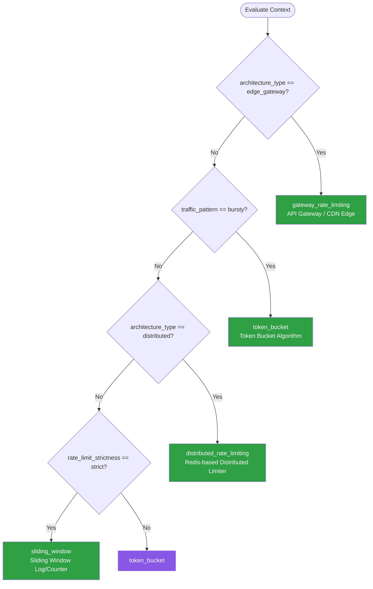

# Rate Limiting — Summary

Purpose
- Rate limiting, throttling, and abuse prevention for APIs and services
- Scope: Token bucket, sliding window, distributed rate limiting, and quota management strategies

## Related Standards

| Standard | Relationship | Context |
|----------|-------------|---------|
| [api-design](../../foundational/api-design/) | complementary | Rate limits are an API design concern — communicate limits via headers |
| [authentication](../../foundational/authentication/) | complementary | Rate limits are often scoped per authenticated identity |
| [logging-observability](../../foundational/logging-observability/) | complementary | Rate limit events must be logged and monitored for abuse detection |

## Context Inputs

These inputs drive the decision tree — provide them to get a tailored recommendation.

| Input | Type | Required | Default | Values | Description |
|-------|------|----------|---------|--------|-------------|
| rate_limit_scope | enum | yes | per_api_key | per_ip, per_api_key, per_user, per_tenant, global | Entity the rate limit is applied to |
| architecture_type | enum | yes | distributed | single_instance, distributed, edge_gateway | Deployment architecture |
| traffic_pattern | enum | yes | steady | steady, bursty, scheduled_spikes, unpredictable | Expected traffic characteristics |
| rate_limit_strictness | enum | no | standard | relaxed, standard, strict | How strictly limits are enforced |

## Decision Tree

### Mermaid Diagram



### Text Fallback

- **Priority 1** → `gateway_rate_limiting` — when architecture_type is edge_gateway. Rate limiting at the API gateway or CDN edge layer before requests reach backend services.
- **Priority 2** → `token_bucket` — when traffic_pattern is bursty. Token bucket allows temporary bursts while enforcing average rate.
- **Priority 3** → `distributed_rate_limiting` — when architecture_type is distributed. Shared counter in Redis/Memcached ensures consistent limits across all instances.
- **Priority 4** → `sliding_window` — when rate_limit_strictness is strict. Sliding window provides the most accurate rate limiting without boundary burst issues.
- **Fallback** → `token_bucket` — Token bucket is the most versatile default: handles bursts, simple to implement, and widely understood.

> **Confidence**: high | **Risk if wrong**: high

---

## Patterns

### 1. Token Bucket Algorithm

> Allow a fixed average rate of requests while permitting short bursts. Tokens are added to a bucket at a fixed rate; each request consumes a token. If the bucket is empty, the request is rejected. Burst capacity equals bucket size.

**Maturity**: standard

**Use when**
- Traffic is bursty (legitimate users send requests in clusters)
- Want to enforce average rate while allowing occasional spikes
- Simple single-instance rate limiting

**Avoid when**
- Need strict per-second enforcement with no burst tolerance
- Distributed system without shared state (use gateway or distributed pattern)

**Tradeoffs**

| Pros | Cons |
|------|------|
| Allows natural burst patterns | Burst allowance can be abused |
| Simple to implement and understand | Per-instance limits without shared state |
| O(1) per request (constant time) | Requires tuning bucket size vs. fill rate |
| Memory efficient — one counter per key | |

**Implementation Guidelines**
- Set bucket capacity (max burst size) and fill rate (sustained rate)
- Store last request timestamp and available tokens per key
- On each request: calculate tokens added since last request, consume one token
- Return 429 Too Many Requests when no tokens available
- Include rate limit headers in response: RateLimit-Limit, RateLimit-Remaining, RateLimit-Reset
- Include Retry-After header in 429 responses

**Common Errors**

| Error | Impact | Fix |
|-------|--------|-----|
| Bucket too large (high burst) | Burst can overwhelm downstream services | Set burst capacity to ~2x average expected burst; monitor downstream impact |
| Not including rate limit headers | Clients cannot adapt their request rate | Include RateLimit-Limit, RateLimit-Remaining, RateLimit-Reset headers |

**Standards & References**

| Standard | Type | Role | Reference |
|----------|------|------|-----------|
| Token Bucket Algorithm | pattern | Classic traffic shaping algorithm | — |

---

### 2. Sliding Window (Log/Counter)

> Track requests in a sliding time window for accurate rate limiting without fixed window boundary issues. Two variants: sliding window log (exact but memory-intensive) and sliding window counter (approximate but memory-efficient).

**Maturity**: advanced

**Use when**
- Strict rate enforcement required (no boundary burst exploitation)
- Financial APIs or security-sensitive endpoints
- Need accurate per-second rate limiting

**Avoid when**
- Burst tolerance is acceptable (token bucket is simpler)
- Memory constraints with many unique keys

**Tradeoffs**

| Pros | Cons |
|------|------|
| No boundary burst problem (unlike fixed window) | Sliding window log stores each request timestamp (higher memory) |
| Most accurate rate limiting | Sliding window counter is an approximation (good enough for most) |
| Predictable behavior for clients | More complex to implement than token bucket |

**Implementation Guidelines**
- Sliding window log: store each request timestamp, count entries within the window
- Sliding window counter: weighted average of current and previous window counts
- Use sorted sets in Redis for efficient sliding window implementation
- Set appropriate window size (1 second, 1 minute, 1 hour) based on use case

**Common Errors**

| Error | Impact | Fix |
|-------|--------|-----|
| Not cleaning up expired entries in sliding window log | Memory grows unbounded; performance degrades | Use Redis ZREMRANGEBYSCORE to remove expired entries on each request |
| Fixed window instead of sliding window for strict use cases | Boundary burst: 2x rate at window boundaries | Use sliding window or sliding window counter |

**Standards & References**

| Standard | Type | Role | Reference |
|----------|------|------|-----------|
| Sliding Window Rate Limiting | pattern | Accurate rate limiting without boundary issues | — |

---

### 3. Distributed Rate Limiting (Redis-Based)

> Enforce consistent rate limits across multiple application instances using a shared Redis counter. Ensures that the total rate across all instances respects the configured limit.

**Maturity**: advanced

**Use when**
- Multiple application instances behind a load balancer
- Rate limit must be global (not per-instance)
- Microservices architecture with shared rate limits

**Avoid when**
- Single instance deployment (use local rate limiter)
- Can tolerate per-instance limits (simpler, no external dependency)

**Tradeoffs**

| Pros | Cons |
|------|------|
| Consistent limits across all instances | Redis dependency — adds latency and failure mode |
| Global rate enforcement | Redis availability affects rate limiting (need fallback) |
| Centralized monitoring of rate limit hits | Network round-trip per request for limit check |
| Atomic operations prevent race conditions | |

**Implementation Guidelines**
- Use Redis INCR with EXPIRE for fixed window, or Lua scripts for token bucket / sliding window
- Use atomic Lua scripts to prevent race conditions between INCR and EXPIRE
- Implement local fallback if Redis is unavailable (degrade to per-instance limits)
- Use Redis Cluster or Sentinel for high availability
- Batch rate limit checks where possible to reduce round trips
- Set connection pool size and timeout appropriately

**Common Errors**

| Error | Impact | Fix |
|-------|--------|-----|
| INCR and EXPIRE as separate commands (race condition) | Key may increment without getting an expiry — counter grows forever | Use Lua script or INCR with EX option for atomic operation |
| No fallback when Redis is unavailable | All requests either fail or bypass limits | Fall back to per-instance local rate limiting when Redis is down |
| Using Redis WATCH/MULTI instead of Lua scripts | Transactions may fail under high contention | Use Lua scripts for atomic rate limit operations |

**Standards & References**

| Standard | Type | Role | Reference |
|----------|------|------|-----------|
| Redis Rate Limiting Patterns | pattern | Redis-based distributed rate limiting | — |

---

### 4. API Gateway Rate Limiting

> Enforce rate limits at the API gateway or CDN edge layer before requests reach backend services. Offloads rate limiting from application code and provides consistent enforcement across all services.

**Maturity**: standard

**Use when**
- API gateway is already in the architecture (Kong, NGINX, AWS API Gateway)
- Want rate limiting applied consistently across all backend services
- DDoS protection at the edge

**Avoid when**
- No API gateway in the architecture (don't add one just for rate limiting)
- Need per-endpoint custom rate limiting logic (gateway may be too coarse)

**Tradeoffs**

| Pros | Cons |
|------|------|
| No application code changes needed | Limited to gateway-supported rate limit algorithms |
| Applied before requests reach backend (saves resources) | May not support complex per-user quota logic |
| Centralized rate limit management | Additional infrastructure component |
| Typically handles distributed rate limiting automatically | |

**Implementation Guidelines**
- Configure rate limits per route, per API key, or per consumer
- Use gateway's built-in rate limiting plugin (Kong rate-limiting, NGINX limit_req)
- Set appropriate burst allowance for legitimate traffic patterns
- Return standard 429 status with Retry-After header
- Log rate-limited requests for abuse monitoring
- Implement tiered rate limits for different API consumer levels

**Common Errors**

| Error | Impact | Fix |
|-------|--------|-----|
| Same rate limit for all endpoints | Health checks and lightweight endpoints share limit with expensive operations | Set per-endpoint or per-route rate limits based on resource cost |
| Not rate limiting authenticated internal services | Runaway internal service consumes all capacity | Apply rate limits to all consumers, including internal services |

**Standards & References**

| Standard | Type | Role | Reference |
|----------|------|------|-----------|
| API Gateway Rate Limiting | practice | Edge-layer rate limiting patterns | — |

---

## Examples

### Token Bucket — Redis Implementation
**Context**: Implementing a distributed token bucket rate limiter using Redis

**Correct** implementation:
```lua
-- Lua script for atomic token bucket in Redis
local key = KEYS[1]
local capacity = tonumber(ARGV[1])    -- max tokens (burst capacity)
local fill_rate = tonumber(ARGV[2])    -- tokens per second
local now = tonumber(ARGV[3])          -- current timestamp (ms)
local requested = tonumber(ARGV[4])    -- tokens to consume (usually 1)

local bucket = redis.call('HMGET', key, 'tokens', 'last_refill')
local tokens = tonumber(bucket[1]) or capacity
local last_refill = tonumber(bucket[2]) or now

-- Calculate tokens to add since last request
local elapsed = (now - last_refill) / 1000
local new_tokens = math.min(capacity, tokens + (elapsed * fill_rate))

if new_tokens >= requested then
  new_tokens = new_tokens - requested
  redis.call('HMSET', key, 'tokens', new_tokens, 'last_refill', now)
  redis.call('EXPIRE', key, math.ceil(capacity / fill_rate) * 2)
  return {1, new_tokens, capacity}  -- allowed, remaining, limit
else
  redis.call('HMSET', key, 'tokens', new_tokens, 'last_refill', now)
  redis.call('EXPIRE', key, math.ceil(capacity / fill_rate) * 2)
  return {0, new_tokens, capacity}  -- denied, remaining, limit
end
```

**Incorrect** implementation:
```text
# WRONG: Non-atomic, race conditions, no burst control
def check_rate_limit(user_id):
    count = redis.get(f"ratelimit:{user_id}")  # Read
    if count and int(count) >= 100:
        return False
    redis.incr(f"ratelimit:{user_id}")         # Increment — RACE CONDITION
    redis.expire(f"ratelimit:{user_id}", 60)   # Expire — RACE CONDITION
    return True
```

**Why**: The Lua script executes atomically in Redis, preventing race conditions. It implements proper token bucket with configurable burst capacity and fill rate. The incorrect version has race conditions between INCR and EXPIRE, uses a simple counter (no burst control), and can lose the EXPIRE if a crash occurs between the two commands.

---

### API Gateway Rate Limiting — NGINX Configuration
**Context**: Configuring rate limiting at the NGINX API gateway

**Correct** implementation:
```nginx
http {
    # Define rate limit zones
    limit_req_zone $binary_remote_addr zone=ip_limit:10m rate=10r/s;
    limit_req_zone $http_x_api_key zone=api_key_limit:10m rate=100r/s;

    # Standard 429 response
    limit_req_status 429;

    server {
        # API endpoints — rate limited per API key
        location /api/ {
            limit_req zone=api_key_limit burst=20 nodelay;
            proxy_pass http://backend;

            # Rate limit headers
            add_header RateLimit-Limit 100;
            add_header RateLimit-Policy "100;w=1";
        }

        # Login endpoint — stricter limit per IP
        location /api/auth/login {
            limit_req zone=ip_limit burst=5 nodelay;
            proxy_pass http://backend;
        }
    }
}
```

**Incorrect** implementation:
```text
# WRONG: No rate limiting at all
server {
    location /api/ {
        proxy_pass http://backend;
    }
    # No limit_req, no rate limit headers, no abuse protection
}
```

**Why**: The correct configuration applies per-API-key and per-IP rate limits with appropriate burst allowances, returns standard 429 status codes, and includes rate limit headers. The incorrect version has no rate limiting, leaving the backend exposed to abuse.

---

## Security Hardening

### Transport
- Rate limit responses use same TLS configuration as normal responses

### Data Protection
- Rate limit state (keys, counters) does not contain sensitive data
- IP addresses in rate limit logs treated as PII where applicable

### Access Control
- Rate limits applied per authenticated identity (not just IP)
- Admin endpoints have separate, stricter rate limits

### Input/Output
- 429 responses include Retry-After header
- Error responses do not reveal rate limit implementation details

### Secrets
- Redis credentials for distributed rate limiting stored in secret manager

### Monitoring
- Rate limit hits logged and monitored for abuse patterns
- Alert on sustained rate limit violations from a single source
- Dashboard for rate limit utilization across endpoints

---

## Anti-Patterns

| Anti-Pattern | Severity | Description | Fix |
|-------------|----------|-------------|-----|
| No Rate Limiting | critical | API has no rate limiting. Any client can send unlimited requests. | Implement rate limiting at gateway or application level |
| Per-Instance Rate Limiting in Distributed Systems | high | Each instance enforces its own rate limit. With N instances, the effective global limit is N × configured limit. | Use shared state (Redis) or gateway-level rate limiting |
| Fixed Window Boundary Burst | medium | Using fixed time windows where a client can send 2× the limit at the window boundary (end of one window + start of next). | Use sliding window or token bucket algorithm |
| Missing Rate Limit Headers | medium | Not including rate limit information in response headers. Clients cannot adapt their request rate. | Include RateLimit-Limit, RateLimit-Remaining, RateLimit-Reset, Retry-After |

---

## Checklist

| ID | Category | Description | Severity |
|----|----------|-------------|----------|
| RL-01 | security | Rate limiting enabled on all public-facing endpoints | critical |
| RL-02 | security | Login/auth endpoints have strict per-IP rate limits | critical |
| RL-03 | correctness | Rate limit scope matches identity (per user/key/tenant, not just IP) | high |
| RL-04 | correctness | Distributed rate limiting uses shared state (Redis or gateway) | high |
| RL-05 | api | 429 Too Many Requests returned with Retry-After header | high |
| RL-06 | api | Rate limit headers included (RateLimit-Limit, RateLimit-Remaining) | medium |
| RL-07 | reliability | Fallback behavior when rate limit store is unavailable | high |
| RL-08 | security | Rate limits applied to internal services, not just external | medium |
| RL-09 | observability | Rate limit events logged and monitored | medium |
| RL-10 | correctness | Algorithm handles boundary conditions (no fixed-window burst exploit) | medium |
| RL-11 | security | Different rate limits for different endpoint tiers | medium |
| RL-12 | reliability | Rate limit configuration is tunable without redeployment | medium |

---

## Compliance

| Standard | Relevance | Reference |
|----------|-----------|-----------|
| IETF RateLimit Header Fields | Proposed standard for rate limit response headers | https://datatracker.ietf.org/doc/draft-ietf-httpapi-ratelimit-headers/ |
| OWASP API4:2023 Unrestricted Resource Consumption | API security risk for missing rate limiting | https://owasp.org/API-Security/editions/2023/en/0xa4-unrestricted-resource-consumption/ |

### Requirements Mapping

| Control | Description | Maps To |
|---------|-------------|---------|
| rate_limit_enforcement | All API endpoints enforce rate limits appropriate to their resource cost | OWASP API4:2023 |
| rate_limit_headers | Response headers communicate rate limit status to clients | IETF RateLimit Header Fields |

---

## Prompt Recipes

### Greenfield — Design rate limiting for a new API
```
Design rate limiting. Context: Rate limit scope, Architecture type, Traffic pattern, Strictness. Requirements: Algorithm selection, headers, distributed enforcement, monitoring, fallback behavior.
```

### Audit — Audit existing rate limiting
```
Audit: All endpoints rate limited? Scope correct? Shared state for distributed? 429 with Retry-After? Rate limit headers? Login/auth stricter? Internal services limited? Monitoring in place? Fallback behavior?
```

### Optimization — Tune rate limits for production traffic
```
Steps: Analyze traffic patterns, set baseline limits (p95 of normal traffic × 2), monitor 429 rates, adjust per-endpoint, add burst allowance for bursty endpoints, verify no legitimate traffic blocked.
```

### Operations — Respond to rate limit abuse / DDoS
```
Steps: Identify abusing source, reduce rate limit for source, block if confirmed abuse, scale if legitimate traffic, review logs, update WAF rules, post-incident review.
```

---

## Links
- Full standard: [rate-limiting.yaml](rate-limiting.yaml)
