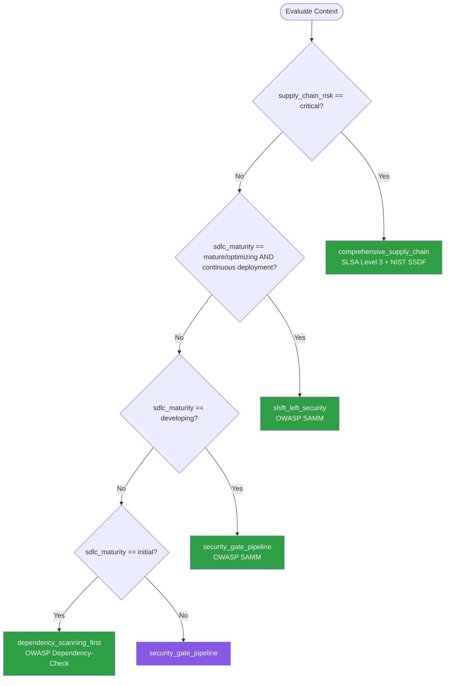

# Secure SDLC — Summary

Purpose
- Secure Software Development Lifecycle integrating SAST, DAST, SCA, and supply chain security into CI/CD pipelines
- Scope: Dependency scanning, SBOM generation, signed artifacts, threat modeling, and security gates

## Related Standards

| Standard | Relationship | Context |
|----------|-------------|---------|
| [ci-cd](../../infrastructure/ci-cd/) | complementary | Security gates are integrated into CI/CD pipelines |
| [code-quality](../code-quality/) | complementary | Code quality scanning and security scanning overlap and complement each other |
| [containerization](../../infrastructure/containerization/) | complementary | Container image scanning is part of the supply chain security |

## Context Inputs

These inputs drive the decision tree — provide them to get a tailored recommendation.

| Input | Type | Required | Default | Values | Description |
|-------|------|----------|---------|--------|-------------|
| sdlc_maturity | enum | yes | developing | initial, developing, mature, optimizing | Current security maturity level |
| deployment_frequency | enum | yes | daily | monthly, weekly, daily, continuous | How often code is deployed to production |
| supply_chain_risk | enum | yes | standard | low, standard, high, critical | Risk from third-party dependencies and build tools |
| regulatory_requirements | enum | no | general | general, soc2, pci_dss, hipaa, fedramp | Regulatory compliance requirements |

## Decision Tree

### Mermaid Diagram



### Text Fallback

- **Priority 1** → `comprehensive_supply_chain` — when supply_chain_risk is critical. Full supply chain security: signed builds, SBOM, provenance attestation, reproducible builds.
- **Priority 2** → `shift_left_security` — when sdlc_maturity is mature/optimizing and continuous deployment. Security integrated into every stage: IDE, pre-commit, CI, CD, runtime.
- **Priority 3** → `security_gate_pipeline` — when sdlc_maturity is developing. Security scanning gates in CI/CD with blocking thresholds.
- **Priority 4** → `dependency_scanning_first` — when sdlc_maturity is initial. Start with dependency scanning — highest ROI security activity.
- **Fallback** → `security_gate_pipeline` — CI/CD security gates provide the best balance of coverage and implementation effort.

> **Confidence**: high | **Risk if wrong**: high

---

## Patterns

### 1. Shift-Left Security (Mature)

> Integrate security scanning at every stage of development: IDE plugins, pre-commit hooks, CI pipeline, deployment gates, and runtime monitoring. Security feedback is continuous and fast.

**Maturity**: enterprise

**Use when**
- Mature security practice with dedicated AppSec team
- High deployment frequency (daily/continuous)
- Organization wants security as a development enabler, not a gate

**Avoid when**
- Team has no security experience (start with security_gate_pipeline)
- Low deployment frequency (overhead may not be justified)

**Tradeoffs**

| Pros | Cons |
|------|------|
| Fastest feedback loop — issues caught in IDE or pre-commit | Requires significant tooling investment |
| Security is everyone's responsibility, not just AppSec | Developer onboarding includes security tooling |
| Minimal CI bottleneck — most issues caught earlier | False positives in IDE can cause alert fatigue |
| Cultural shift — security is built in, not bolted on | |

**Implementation Guidelines**
- IDE: SAST plugin (Semgrep, SonarLint) for real-time feedback
- Pre-commit: secret detection (gitleaks), basic SAST rules
- CI: full SAST, SCA, container scanning, license compliance
- CD: DAST against staging environment, penetration test for releases
- Runtime: dependency monitoring for new CVEs, RASP for critical apps
- Threat modeling at design phase for new features
- Security champions program: one engineer per team trained in security

**Common Errors**

| Error | Impact | Fix |
|-------|--------|-----|
| Too many tools with overlapping findings | Developer fatigue; findings ignored | Consolidate tools; deduplicate findings; prioritize by severity |
| No SLA for vulnerability remediation | Findings accumulate without being fixed | Define SLAs: critical 24h, high 7d, medium 30d, low 90d |

**Standards & References**

| Standard | Type | Role | Reference |
|----------|------|------|-----------|
| OWASP SAMM (Software Assurance Maturity Model) | standard | Framework for measuring and improving security practices | https://owaspsamm.org/ |

---

### 2. CI/CD Security Gate Pipeline

> Integrate SAST, SCA, and secret scanning as mandatory quality gates in the CI/CD pipeline. Builds that fail security checks cannot proceed to deployment.

**Maturity**: standard

**Use when**
- Developing security maturity (most organizations)
- Existing CI/CD pipeline to add security gates to
- Need automated enforcement (not just advisory)

**Avoid when**
- No CI/CD pipeline exists (set up CI/CD first)

**Tradeoffs**

| Pros | Cons |
|------|------|
| Automated enforcement — no security bypass | Adds time to CI pipeline |
| Consistent scanning across all changes | False positives may block legitimate deployments |
| Clear pass/fail criteria for security | Requires initial rule tuning to reduce noise |
| Audit trail of all security scan results | |

**Implementation Guidelines**
- SAST: run on every PR (Semgrep, CodeQL, SonarQube)
- SCA: scan dependencies for known CVEs (Dependabot, Snyk, Trivy)
- Secret scanning: detect committed credentials (gitleaks, truffleHog)
- Container scanning: scan Docker images for vulnerabilities
- Define blocking thresholds: critical and high block merge; medium and low are advisory
- Store scan results as CI artifacts for audit
- Auto-create issues for new findings

**Common Errors**

| Error | Impact | Fix |
|-------|--------|-----|
| Security scanning without enforcement (advisory only) | Developers ignore findings; vulnerabilities ship to production | Make critical/high findings a blocking gate; auto-create tickets for others |
| No exception process for false positives | Legitimate code blocked; developers circumvent scanning | Document false positive suppression with justification in code |

**Standards & References**

| Standard | Type | Role | Reference |
|----------|------|------|-----------|
| NIST SP 800-218 (Secure Software Development Framework) | standard | Framework for integrating security into SDLC | — |

---

### 3. Comprehensive Supply Chain Security

> End-to-end supply chain security: signed builds, SBOM generation, provenance attestation, dependency pinning, and reproducible builds. Ensures the integrity of the software from source to deployment.

**Maturity**: enterprise

**Use when**
- Software distributed to customers or deployed in critical infrastructure
- Regulatory requirement for SBOM (Executive Order 14028, EU Cyber Resilience Act)
- High supply chain risk (many dependencies, public package registries)
- Software used in government, healthcare, or financial services

**Avoid when**
- Internal-only tools with low supply chain risk

**Tradeoffs**

| Pros | Cons |
|------|------|
| Protects against supply chain attacks (SolarWinds, Log4Shell) | Significant implementation and maintenance effort |
| Regulatory compliance (SBOM requirements) | Reproducible builds may require build system changes |
| Full provenance from source to deployment | Signing infrastructure adds complexity |
| Customer trust through transparency | |

**Implementation Guidelines**
- Generate SBOM (CycloneDX or SPDX format) for every build
- Sign build artifacts (Sigstore/cosign for containers, GPG for packages)
- Pin all dependency versions (lock files committed to source control)
- Verify dependency checksums on install
- Use provenance attestation (SLSA framework)
- Implement reproducible builds where possible
- Monitor dependencies for new CVEs post-deployment
- Maintain approved dependency list (allowlist for new dependencies)

**Common Errors**

| Error | Impact | Fix |
|-------|--------|-----|
| SBOM generated but not consumed or monitored | SBOM is a compliance checkbox; no value from it | Integrate SBOM into vulnerability monitoring; alert on new CVEs affecting SBOM components |
| Dependencies not pinned (using ^ or ~ ranges) | Build may pull in different versions including compromised ones | Pin exact versions; use lock files; verify checksums |

**Standards & References**

| Standard | Type | Role | Reference |
|----------|------|------|-----------|
| SLSA (Supply-chain Levels for Software Artifacts) | standard | Framework for supply chain integrity guarantees | https://slsa.dev/ |
| NIST SP 800-218 (SSDF) | standard | Secure Software Development Framework | — |

---

### 4. Dependency Scanning First (Getting Started)

> Start with dependency scanning as the first security activity. Dependency vulnerabilities are the most common attack vector and scanning has the highest return on investment.

**Maturity**: standard

**Use when**
- Organization with initial security maturity
- No existing security scanning in place
- Want the highest ROI first security investment

**Avoid when**
- Already have comprehensive security scanning

**Tradeoffs**

| Pros | Cons |
|------|------|
| Highest ROI — catches known CVEs with zero false positives | Only catches known vulnerabilities (not zero-days) |
| Minimal implementation effort (enable in CI) | Does not catch vulnerabilities in your own code (need SAST for that) |
| Automated fix PRs available (Dependabot, Renovate) | Transitive dependencies may be hard to update |
| Immediate visibility into dependency risk | |

**Implementation Guidelines**
- Enable Dependabot, Renovate, or Snyk for automated dependency updates
- Run dependency scan in CI (npm audit, pip-audit, Trivy)
- Block merges with critical/high dependency vulnerabilities
- Set up alerts for new CVEs affecting current dependencies
- Review and merge dependency update PRs weekly
- Document exceptions for vulnerabilities with no available fix

**Common Errors**

| Error | Impact | Fix |
|-------|--------|-----|
| Ignoring transitive (indirect) dependencies | Transitive deps make up ~80% of the dependency tree; many CVEs hide here | Use tools that scan the full dependency tree including transitive deps |
| Never merging dependency update PRs | Vulnerabilities accumulate; updates become harder over time | Set schedule for reviewing and merging dependency PRs (weekly) |

**Standards & References**

| Standard | Type | Role | Reference |
|----------|------|------|-----------|
| OWASP Dependency-Check | tool | Identifies known vulnerabilities in project dependencies | https://owasp.org/www-project-dependency-check/ |

---

## Examples

### CI/CD Security Gates — GitHub Actions
**Context**: Security scanning pipeline with blocking gates

**Correct** implementation:
```yaml
name: Security Pipeline

on: [pull_request]

jobs:
  secret-scanning:
    runs-on: ubuntu-latest
    steps:
      - uses: actions/checkout@v4
        with: { fetch-depth: 0 }
      - name: Secret Scanning
        uses: gitleaks/gitleaks-action@v2
        # Blocks PR if secrets detected

  sast:
    runs-on: ubuntu-latest
    steps:
      - uses: actions/checkout@v4
      - name: SAST Scan
        uses: returntocorp/semgrep-action@v1
        with:
          config: >-
            p/security-audit
            p/owasp-top-ten
        # Blocks PR if high/critical findings

  dependency-scan:
    runs-on: ubuntu-latest
    steps:
      - uses: actions/checkout@v4
      - name: Dependency Audit
        run: |
          npm audit --audit-level=high
          # Blocks if high/critical vulnerabilities

  container-scan:
    runs-on: ubuntu-latest
    needs: [sast, dependency-scan]
    steps:
      - uses: actions/checkout@v4
      - name: Build Image
        run: docker build -t app:${{ github.sha }} .
      - name: Scan Image
        uses: aquasecurity/trivy-action@master
        with:
          image-ref: app:${{ github.sha }}
          severity: CRITICAL,HIGH
          exit-code: 1  # Blocks PR
```

**Incorrect** implementation:
```text
# WRONG: Scanning without enforcement
- name: Security scan (advisory only)
  run: semgrep --config=auto .
  continue-on-error: true   # <-- Findings ignored!
# No secret scanning, no dependency scanning, no container scanning
```

**Why**: The correct pipeline runs secret scanning, SAST, dependency scanning, and container scanning as blocking gates. The incorrect version runs one scan in advisory mode that can be ignored, providing no real security enforcement.

---

## Security Hardening

### Transport
- CI/CD pipeline communication over TLS (artifact stores, registries)

### Data Protection
- Security scan results stored securely with restricted access
- SBOM may contain component details — distribute on need-to-know basis

### Access Control
- CI/CD pipeline configuration changes require code review
- Security gate bypass requires documented exception and approval

### Input/Output
- Signed artifacts verified before deployment
- Dependency checksums validated on install

### Secrets
- CI/CD secrets stored in pipeline secret management (not in code)
- Service account tokens scoped to minimum required permissions

### Monitoring
- Alert on new critical CVEs affecting dependencies
- Monitor for security gate bypass attempts
- Track mean time to remediate (MTTR) for security findings

---

## Anti-Patterns

| Anti-Pattern | Severity | Description | Fix |
|-------------|----------|-------------|-----|
| Security Scanning Without Enforcement | high | Running security scans in advisory mode with continue-on-error: true. Findings are generated but never block deployment. | Make critical/high findings a blocking CI gate |
| Committing Secrets to Version Control | critical | API keys, passwords, or tokens committed to git history. Even if removed, they persist in git history forever. | Pre-commit secret detection + CI secret scanning; rotate any committed secret immediately |
| Ignoring Transitive Dependencies | high | Only scanning direct dependencies. Transitive dependencies account for ~80% of the dependency tree and are a common attack vector. | Use tools that scan the full dependency tree; pin transitive dependency versions |
| SBOM as Checkbox Compliance | medium | Generating SBOM to satisfy a compliance requirement but never consuming or monitoring it. | Integrate SBOM into vulnerability monitoring workflow; alert on new CVEs affecting SBOM components |

---

## Checklist

| ID | Category | Description | Severity |
|----|----------|-------------|----------|
| SSDLC-01 | security | SAST scanning runs on every PR with blocking thresholds | high |
| SSDLC-02 | security | Dependency scanning covers full dependency tree (including transitive) | critical |
| SSDLC-03 | security | Secret scanning runs pre-commit and in CI | critical |
| SSDLC-04 | security | Container image scanning before deployment | high |
| SSDLC-05 | compliance | SBOM generated for every release (CycloneDX or SPDX) | high |
| SSDLC-06 | security | Build artifacts signed with verifiable signatures | high |
| SSDLC-07 | security | Dependency versions pinned with lock files committed | high |
| SSDLC-08 | process | Security findings have remediation SLAs (critical: 24h, high: 7d) | high |
| SSDLC-09 | security | CI/CD pipeline configuration changes require code review | high |
| SSDLC-10 | process | Threat modeling performed for new features and significant changes | medium |

---

## Compliance

| Standard | Relevance | Reference |
|----------|-----------|-----------|
| NIST SP 800-218 (SSDF) | Secure Software Development Framework | — |
| SLSA (Supply-chain Levels for Software Artifacts) | Framework for supply chain integrity guarantees | https://slsa.dev/ |
| OWASP SAMM | Software Assurance Maturity Model for measuring security practice | https://owaspsamm.org/ |

### Requirements Mapping

| Control | Description | Maps To |
|---------|-------------|---------|
| automated_security_testing | SAST, SCA, and secret scanning in CI/CD pipeline | NIST SSDF PW.7, PW.8 |
| supply_chain_integrity | Signed artifacts, SBOM, dependency pinning | SLSA Level 1-3, NIST SSDF PS.1 |
| vulnerability_management | Triage, remediation SLAs, and tracking for security findings | NIST SSDF RV.1, OWASP SAMM Implementation |

---

## Prompt Recipes

### Greenfield — Set up secure SDLC for a new project
```
Set up secure SDLC. Context: Maturity level, Deployment frequency, Supply chain risk, Regulatory requirements. Requirements: SAST, SCA, secret scanning, container scanning, SBOM, signing, remediation SLAs.
```

### Audit — Audit existing security pipeline
```
Audit: SAST in CI? SCA with transitive deps? Secret scanning? Container scanning? SBOM generated? Artifacts signed? Dependencies pinned? Remediation SLAs defined? Pipeline config reviewed? Threat modeling practiced?
```

### Operations — Generate SBOM and integrate into monitoring
```
Steps: Choose format (CycloneDX/SPDX), integrate SBOM generation into CI, store SBOMs per release, feed into vulnerability monitoring, alert on new CVEs, document component inventory.
```

### Migration — Mature security practices from initial to developing
```
Steps: Start with dependency scanning, add secret scanning, enable SAST (advisory mode first), tune rules, enable blocking, add container scanning, establish remediation SLAs, track metrics.
```

---

## Links
- Full standard: [secure-sdlc.yaml](secure-sdlc.yaml)
