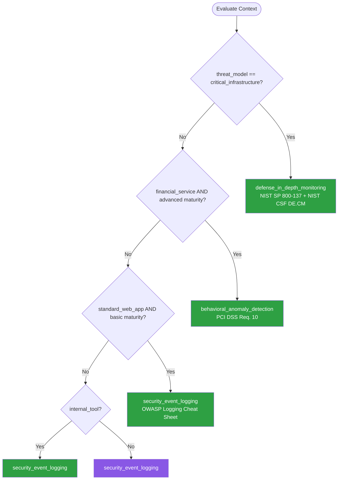

# Security Monitoring — Summary

Purpose
- Security monitoring and threat detection patterns for detecting anomalous access, failed login attempts, privilege escalation, and suspicious activity
- Scope: SIEM integration, runtime application self-protection (RASP), honeypots, alerting strategies, and incident response automation

## Related Standards

| Standard | Relationship | Context |
|----------|-------------|---------|
| [logging-observability](../../foundational/logging-observability/) | complementary | Security monitoring builds on top of structured logging and observability |
| [authentication](../../foundational/authentication/) | complementary | Authentication events are a primary source of security monitoring signals |
| [rate-limiting](../rate-limiting/) | complementary | Rate limiting provides automated response to detected abuse |
| [encryption](../encryption/) | complementary | Security logs and monitoring data must be protected in transit and at rest |

## Context Inputs

These inputs drive the decision tree — provide them to get a tailored recommendation.

| Input | Type | Required | Default | Values | Description |
|-------|------|----------|---------|--------|-------------|
| threat_model | enum | yes | standard_web_app | internal_tool, standard_web_app, financial_service, critical_infrastructure | Expected threat landscape and adversary capability |
| monitoring_maturity | enum | yes | basic | none, basic, intermediate, advanced | Current security monitoring capability |
| incident_response_capability | enum | yes | manual | manual, semi_automated, fully_automated | Level of automation in incident response |
| data_sensitivity | enum | yes | confidential | public, internal, confidential, restricted | Sensitivity of data the application handles |

## Decision Tree

### Mermaid Diagram



### Text Fallback

- **Priority 1** → `defense_in_depth_monitoring` — when threat_model is critical_infrastructure. Multi-layer monitoring with SIEM, IDS, honeypots, and automated response.
- **Priority 2** → `behavioral_anomaly_detection` — when financial_service and advanced maturity. Baseline normal behavior and detect deviations.
- **Priority 3** → `security_event_logging` — when standard_web_app and basic maturity. Structured security event logging as the foundation.
- **Priority 4** → `security_event_logging` — when internal_tool. Basic security events with authentication and authorization logging.
- **Fallback** → `security_event_logging` — Structured security event logging is the foundation for all monitoring.

> **Confidence**: high | **Risk if wrong**: high

---

## Patterns

### 1. Security Event Logging (Foundation)

> Emit structured security events for authentication, authorization, and suspicious activity. The foundation for all security monitoring — you cannot detect what you don't log.

**Maturity**: standard

**Use when**
- Any application handling user data
- Starting security monitoring journey
- Need audit trail for compliance

**Avoid when**
- Never — security event logging is always required

**Tradeoffs**

| Pros | Cons |
|------|------|
| Foundation for all other monitoring patterns | Must be careful not to log sensitive data (passwords, tokens) |
| Enables forensic analysis after incidents | Log volume management required |
| Compliance requirement for most frameworks | Structured logging requires discipline across all teams |
| Low implementation complexity | |

**Implementation Guidelines**
- Log all authentication events: login success/failure, logout, password change, MFA enrollment
- Log all authorization events: access denied, privilege escalation, role changes
- Log security-relevant actions: data export, admin actions, configuration changes
- Use structured format (JSON) with consistent schema
- Include: timestamp, event_type, user_id, source_ip, user_agent, resource, outcome, session_id
- Never log passwords, tokens, or full credit card numbers
- Set log retention to meet compliance requirements (typically 90 days to 1 year)
- Forward security events to centralized logging (ELK, Splunk, CloudWatch)

**Common Errors**

| Error | Impact | Fix |
|-------|--------|-----|
| Logging passwords or tokens in security events | Credential exposure in log storage; insider threat vector | Sanitize all security events; use allowlist of loggable fields |
| No centralized log collection | Logs scattered across instances; cannot correlate events | Forward to centralized SIEM or log aggregator |
| No log retention policy | Either keeping logs forever (storage cost) or deleting too soon (compliance violation) | Define retention per log type; automate rotation and deletion |

**Standards & References**

| Standard | Type | Role | Reference |
|----------|------|------|-----------|
| OWASP Logging Cheat Sheet | reference | What to log for security monitoring | https://cheatsheetseries.owasp.org/cheatsheets/Logging_Cheat_Sheet.html |

---

### 2. Behavioral Anomaly Detection

> Establish baselines of normal user and system behavior, then detect deviations. Catches attacks that bypass rule-based detection: compromised credentials used from unusual locations, insider threats, and sophisticated attack patterns.

**Maturity**: enterprise

**Use when**
- Financial services, healthcare, or high-value applications
- Advanced security maturity with baseline data
- Need to detect compromised credential abuse
- Rule-based detection is insufficient

**Avoid when**
- No baseline data (need months of security event data first)
- Basic maturity — start with security_event_logging

**Tradeoffs**

| Pros | Cons |
|------|------|
| Detects unknown attack patterns (not signature-based) | Requires baseline data collection period |
| Catches compromised credential misuse | False positives from legitimate behavior changes |
| Adapts to evolving threat landscape | Complex to implement and tune |
| Effective against insider threats | Requires data science / ML expertise to maintain models |

**Implementation Guidelines**
- Build baselines for: login times, source IPs/geolocations, accessed resources, data volume
- Detect anomalies: unusual login time, new IP/country, unusual data access pattern, impossible travel
- Score anomalies by severity: informational → warning → alert → incident
- Correlate across multiple signals (login from new country + large data export = high severity)
- Implement User and Entity Behavior Analytics (UEBA) if scale justifies
- Start with simple rules (new country, new device) before ML-based detection
- Tune regularly to reduce false positives

**Common Errors**

| Error | Impact | Fix |
|-------|--------|-----|
| No baseline period before enabling alerts | Constant false positives from normal behavior variations | Collect 30-90 days of baseline data before enabling anomaly alerts |
| Alert on every anomaly without severity scoring | Alert fatigue — analysts ignore all alerts | Score anomalies by severity; auto-close low severity; escalate high |

**Standards & References**

| Standard | Type | Role | Reference |
|----------|------|------|-----------|
| MITRE ATT&CK Framework | framework | Knowledge base of adversary tactics and techniques | https://attack.mitre.org/ |
| PCI DSS Requirement 10 | standard | Track and monitor all access to network resources and cardholder data | — |

---

### 3. Defense-in-Depth Monitoring (Critical Infrastructure)

> Multi-layer monitoring combining network monitoring, application security events, SIEM correlation, intrusion detection, honeypots, and automated response. Designed for critical infrastructure and high-value targets.

**Maturity**: enterprise

**Use when**
- Critical infrastructure (energy, finance, government, healthcare)
- Advanced persistent threat (APT) risk
- Regulatory requirements for continuous monitoring
- Dedicated security operations center (SOC)

**Avoid when**
- Standard web applications (overkill, high cost)
- No SOC or security team to manage alerts

**Tradeoffs**

| Pros | Cons |
|------|------|
| Maximum detection coverage across all layers | High cost (tooling, personnel, infrastructure) |
| Correlated alerts reduce false positives | Requires 24/7 SOC or MSSP |
| Automated response reduces mean time to contain | Complex architecture with many integration points |
| Meets stringent compliance requirements | |

**Implementation Guidelines**
- Deploy SIEM for log correlation across all systems
- Network monitoring: IDS/IPS, NetFlow analysis, DNS monitoring
- Application monitoring: security events, RASP, WAF
- Endpoint monitoring: EDR, file integrity monitoring
- Deploy honeypots/canary tokens to detect lateral movement
- Implement automated response playbooks (SOAR)
- 24/7 monitoring with defined escalation procedures
- Regular purple team exercises (attack simulation + defense validation)

**Common Errors**

| Error | Impact | Fix |
|-------|--------|-----|
| Monitoring without response plan | Detections logged but never acted upon; breaches persist | Define incident response playbooks for each alert type |
| Too many alert rules without tuning | Alert fatigue — analysts ignore noise; real threats missed | Tune rules quarterly; auto-close known false positives; prioritize by impact |

**Standards & References**

| Standard | Type | Role | Reference |
|----------|------|------|-----------|
| NIST SP 800-137 | standard | Information Security Continuous Monitoring (ISCM) | — |
| NIST Cybersecurity Framework (CSF) | standard | Detect function (DE.CM) for continuous monitoring | https://www.nist.gov/cyberframework |

---

### 4. Honeypot & Canary Tokens

> Deploy decoy resources (honeypots) and canary tokens to detect unauthorized access and lateral movement. Any interaction with a honeypot is malicious by definition, producing high-fidelity alerts with zero false positives.

**Maturity**: enterprise

**Use when**
- Need to detect lateral movement in the network
- Want high-fidelity alerts (no false positives)
- Augmenting existing monitoring for insider threat detection
- Simulating valuable targets to attract and identify attackers

**Avoid when**
- No security team to respond to honeypot alerts
- Basic maturity — focus on foundational logging first

**Tradeoffs**

| Pros | Cons |
|------|------|
| Zero false positive rate — any access is malicious | Requires deployment and maintenance of decoys |
| Detects lateral movement and insider threats | Doesn't prevent attacks, only detects them |
| Simple to implement (canary tokens are files/URLs) | Sophisticated attackers may recognize honeypots |
| Works even when other defenses fail | |

**Implementation Guidelines**
- Deploy internal-only honeypot services (fake database, admin panel)
- Place canary tokens in likely targets: admin dirs, credential files, database dumps
- Canary types: files (open = alert), URLs (access = alert), DNS (resolve = alert), AWS keys (use = alert)
- Route all honeypot alerts to security team with highest priority
- Never use honeypots as the only detection mechanism (defense-in-depth)
- Regularly verify honeypots are functioning

**Common Errors**

| Error | Impact | Fix |
|-------|--------|-----|
| Honeypot accessible from the internet | Generates noise from internet scanning bots, not targeted attacks | Deploy honeypots on internal network only; internet-facing canaries need IP filtering |
| No alert mechanism connected to honeypot | Honeypot detects nothing if nobody checks it | Wire honeypot alerts to SIEM/PagerDuty with high-priority escalation |

**Standards & References**

| Standard | Type | Role | Reference |
|----------|------|------|-----------|
| MITRE ATT&CK — Defense Evasion / Discovery | framework | Attack phases where honeypots are most effective | https://attack.mitre.org/ |

---

## Examples

### Structured Authentication Events
**Context**: Logging structured security events for authentication

**Correct** implementation:
```json
{
  "timestamp": "2026-03-15T14:22:05.123Z",
  "event_type": "authentication",
  "event_subtype": "login_success",
  "severity": "info",
  "user_id": "user-abc-123",
  "session_id": "sess-xyz-789",
  "source_ip": "203.0.113.42",
  "user_agent": "Mozilla/5.0 ...",
  "mfa_method": "totp",
  "geo": {
    "country": "US",
    "region": "CA"
  },
  "risk_score": 0.1,
  "context": {
    "known_device": true,
    "known_location": true
  }
}
```

**Also log on failure** (slightly different schema):
```json
{
  "timestamp": "2026-03-15T14:22:05.456Z",
  "event_type": "authentication",
  "event_subtype": "login_failure",
  "severity": "warning",
  "attempted_user": "admin@example.com",
  "source_ip": "198.51.100.23",
  "failure_reason": "invalid_password",
  "consecutive_failures": 4,
  "geo": {
    "country": "RU",
    "region": "MOW"
  },
  "risk_score": 0.8,
  "context": {
    "known_device": false,
    "known_location": false,
    "near_lockout_threshold": true
  }
}
```

**Why**: Structured events with consistent schema enable automated analysis, anomaly detection, and SIEM correlation. Including risk scoring and context fields enables intelligent alerting.

---

## Security Hardening

### Transport
- Security logs transmitted over encrypted channels (TLS) to SIEM
- Log forwarding agents authenticate to the log collector

### Data Protection
- Security logs are tamper-evident (append-only, signed, or write-once storage)
- No sensitive data in security events (no passwords, tokens, PII beyond identifiers)
- Log storage encrypted at rest

### Access Control
- Security logs accessible only to security team and auditors
- Separation of duties: application teams cannot modify security logs
- SIEM access requires MFA

### Input/Output
- Structured log format validated before ingestion
- Log injection attacks prevented (sanitize user-controlled fields)

### Secrets
- SIEM and monitoring credentials stored in secret manager
- Honeypot credentials unique and not used elsewhere

### Monitoring
- Monitor the monitoring: alert if security log pipeline fails
- Validate alert rules with regular testing (purple team)
- Track alert-to-response time (mean time to detect, mean time to respond)

---

## Anti-Patterns

| Anti-Pattern | Severity | Description | Fix |
|-------------|----------|-------------|-----|
| Alert Fatigue | high | Too many low-quality alerts — analysts ignore them. Real threats lost in noise. | Tune alert rules quarterly; severity scoring; auto-close false positives; focus on high-fidelity alerts |
| Monitoring Without Response | critical | Security events detected and logged but no incident response process exists. Breaches detected in logs post-mortem. | Define incident response playbooks per alert type; assign on-call responders; practice with tabletop exercises |
| Logging Sensitive Data in Security Events | critical | Including passwords, full tokens, or PII beyond identifiers in security log events. | Sanitize all security events; use allowlist of loggable fields; never log credentials |

---

## Checklist

| ID | Category | Description | Severity |
|----|----------|-------------|----------|
| SM-01 | security | All authentication events logged (success and failure) | critical |
| SM-02 | security | All authorization failures logged | critical |
| SM-03 | security | Security events use structured format with consistent schema | high |
| SM-04 | security | No sensitive data in security logs (passwords, tokens, PII) | critical |
| SM-05 | reliability | Security logs forwarded to centralized SIEM | high |
| SM-06 | security | Alerting configured for critical security events | high |
| SM-07 | process | Incident response playbooks defined for each alert type | high |
| SM-08 | security | Log retention meets compliance requirements | high |
| SM-09 | security | Security logs are tamper-evident (append-only or signed) | high |
| SM-10 | security | Monitor the monitoring — alert if log pipeline fails | medium |
| SM-11 | process | Regular alert rule tuning to reduce false positives | medium |
| SM-12 | security | Security monitoring tested with purple team exercises | medium |

---

## Compliance

| Standard | Relevance | Reference |
|----------|-----------|-----------|
| NIST SP 800-137 | Information Security Continuous Monitoring (ISCM) | — |
| PCI DSS Requirement 10 | Track and monitor all access to network resources and cardholder data | — |
| MITRE ATT&CK | Knowledge base of adversary tactics and techniques for detection engineering | https://attack.mitre.org/ |

### Requirements Mapping

| Control | Description | Maps To |
|---------|-------------|---------|
| security_event_logging | All authentication and authorization events logged with structured schema | PCI DSS 10.2, NIST CSF DE.CM-1 |
| continuous_monitoring | Security events correlated and analyzed in near real-time | NIST SP 800-137, NIST CSF DE.AE |
| incident_response | Defined response procedures for detected security events | NIST CSF RS.RP, PCI DSS 12.10 |

---

## Prompt Recipes

### Greenfield — Design security monitoring for a new application
```
Design security monitoring. Context: Threat model, Monitoring maturity, Incident response capability, Data sensitivity. Requirements: Security event schema, alerting rules, SIEM integration, incident response playbooks.
```

### Audit — Audit existing security monitoring
```
Audit: Auth events logged? Auth failures logged? Structured schema? No sensitive data in logs? Centralized SIEM? Alerting configured? Response playbooks? Log retention? Tamper-evident? Pipeline monitoring?
```

### Operations — Respond to a detected security incident
```
Incident response: Detect, contain (block source, revoke sessions), investigate (correlate logs, timeline), remediate (patch, rotate credentials), recover (restore service), document (post-incident report), improve (update rules).
```

### Architecture — Build threat detection rules using MITRE ATT&CK
```
Map MITRE ATT&CK to detection: Initial Access (phishing, credential stuffing), Persistence (new accounts, scheduled tasks), Privilege Escalation (role changes), Lateral Movement (honeypot triggers), Exfiltration (data export anomaly).
```

---

## Links
- Full standard: [security-monitoring.yaml](security-monitoring.yaml)
