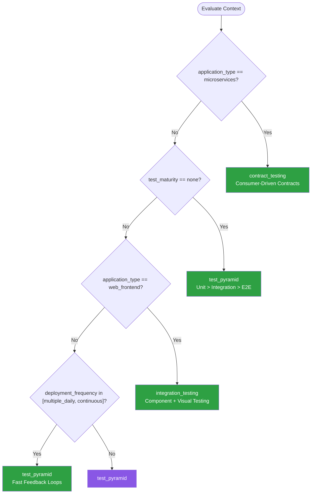

# Testing Strategies — Summary

Purpose
- Testing pyramids, strategies, and patterns for comprehensive quality assurance
- Scope: Unit testing, integration testing, end-to-end testing, contract testing, and test architecture decisions for AI-assisted development

## Related Standards

| Standard | Relationship | Context |
|----------|-------------|---------|
| [code-quality](../code-quality/) | complementary | Testable code is a key quality indicator; testing enforces quality |
| [ci-cd](../../infrastructure/ci-cd/) | complementary | Tests run as quality gates in CI/CD pipelines |
| [api-design](../../foundational/api-design/) | complementary | API contracts are validated with contract tests |

## Context Inputs

These inputs drive the decision tree — provide them to get a tailored recommendation.

| Input | Type | Required | Default | Values | Description |
|-------|------|----------|---------|--------|-------------|
| application_type | enum | yes | api_service | api_service, web_frontend, mobile, library, cli_tool, data_pipeline, microservices | Type of application being tested |
| test_maturity | enum | yes | developing | none, developing, established, advanced | Current testing maturity level |
| team_size | enum | no | small | solo, small, medium, large | Size of the development team |
| deployment_frequency | enum | no | daily | weekly, daily, multiple_daily, continuous | How often code is deployed |

## Decision Tree

### Mermaid Diagram



### Text Fallback

- **Priority 1** → `contract_testing` — when application_type is microservices. Validate API contracts between services without running all services.
- **Priority 2** → `test_pyramid` — when test_maturity is none. Start with the testing pyramid: many unit tests, fewer integration, minimal E2E.
- **Priority 3** → `integration_testing` — when application_type is web_frontend. Frontend testing benefits more from integration/component tests than pure unit tests.
- **Priority 4** → `test_pyramid` — when deployment_frequency is multiple_daily or continuous. Fast test suites enable high deployment frequency.
- **Fallback** → `test_pyramid` — The testing pyramid is the safest default for any application type and maturity.

> **Confidence**: high | **Risk if wrong**: high

---

## Patterns

### 1. Test Pyramid

> Structure tests as a pyramid: many fast unit tests at the base, fewer integration tests in the middle, and minimal end-to-end tests at the top. Optimizes for fast feedback and maintainability.

**Maturity**: standard

**Use when**
- Any application starting or improving its testing practice
- Need fast CI feedback (unit tests run in seconds)
- Want to balance coverage, speed, and maintenance cost

**Avoid when**
- UI-heavy applications where integration tests provide more value (use testing trophy instead)

**Tradeoffs**

| Pros | Cons |
|------|------|
| Fast feedback — unit tests run in seconds | Unit tests alone don't catch integration issues |
| Cheap to write and maintain | Over-mocking in unit tests can hide real bugs |
| Isolates failures to specific components | Requires discipline to maintain the pyramid shape |
| Easy to parallelize | |

**Implementation Guidelines**
- Unit tests (~70%): test individual functions/methods in isolation
- Integration tests (~20%): test component interactions with real dependencies
- E2E tests (~10%): test critical user journeys through the full stack
- Keep unit tests fast: <10ms each, total suite <60 seconds
- Use test doubles (mocks/stubs) only at boundaries (I/O, external services)
- Every bug fix includes a regression test
- Track code coverage (target 80% for new code) but don't chase 100%

**Common Errors**

| Error | Impact | Fix |
|-------|--------|-----|
| Testing implementation details instead of behavior | Tests break on every refactor; high maintenance cost | Test public API behavior, not internal implementation |
| Mocking everything (over-mocking) | Tests pass but code is broken; mocks don't match real behavior | Mock only I/O boundaries; use real dependencies in integration tests |
| Ignoring flaky tests | Erosion of trust in test suite; flaky test = no test | Fix or delete flaky tests immediately; never allow flaky tests in CI |

**Standards & References**

| Standard | Type | Role | Reference |
|----------|------|------|-----------|
| Test Pyramid (Martin Fowler) | practice | Canonical test distribution strategy | https://martinfowler.com/articles/practical-test-pyramid.html |

---

### 2. Integration / Component Testing

> Test components with their real dependencies (database, file system, message queue) in a controlled environment. Higher confidence than unit tests with mocks, lower cost than full E2E tests.

**Maturity**: standard

**Use when**
- Web frontend applications (component testing with Testing Library)
- API services with database interactions
- Any code where integration with dependencies is the primary risk

**Avoid when**
- Pure algorithmic code (unit tests are sufficient)
- Performance-sensitive CI where integration test startup time is a concern

**Tradeoffs**

| Pros | Cons |
|------|------|
| Tests real interactions, not mocks | Slower than unit tests (seconds vs. milliseconds) |
| Higher confidence that components work together | Requires test infrastructure (test database, containers) |
| Catches integration bugs that unit tests miss | Can be harder to pinpoint exact failure location |
| For frontends: tests user behavior, not implementation | |

**Implementation Guidelines**
- Use Testcontainers for database/service dependencies in tests
- Frontend: use Testing Library (React, Vue, Angular) for component tests
- Test the component's public interface, not internal state
- Use realistic test data (factories/fixtures, not production data)
- Run integration tests in CI but allow developers to skip locally for speed

**Common Errors**

| Error | Impact | Fix |
|-------|--------|-----|
| Using production data in tests | PII exposure; non-deterministic tests; GDPR violation | Use factories/fixtures to generate realistic test data |
| Testing internal component state instead of behavior | Brittle tests that break on refactoring | Test what the user sees/does, not internal state |

**Standards & References**

| Standard | Type | Role | Reference |
|----------|------|------|-----------|
| Testing Library | framework | Testing focused on user behavior | https://testing-library.com/ |
| Testcontainers | framework | Real dependencies in tests via containers | https://testcontainers.com/ |

---

### 3. Contract Testing

> Verify that service interactions conform to agreed-upon contracts without deploying all services. Consumers define expected interactions; providers verify they satisfy those expectations. Essential for microservices.

**Maturity**: advanced

**Use when**
- Microservices architecture with many service-to-service interactions
- Multiple teams owning different services
- Breaking API changes are a recurring problem
- Want to decouple service testing from deployment

**Avoid when**
- Monolithic application (no service contracts to test)
- Small team owning all services (communication is easy)

**Tradeoffs**

| Pros | Cons |
|------|------|
| Tests service compatibility without running all services | Initial setup complexity (Pact broker, CI integration) |
| Faster than E2E tests (no full stack needed) | Contracts must be maintained alongside code |
| Catches breaking changes before deployment | Team adoption requires cultural change |
| Enables independent service deployment | |

**Implementation Guidelines**
- Consumer writes contract (expected request → expected response)
- Provider verifies it satisfies all consumer contracts
- Use Pact (most popular), Spring Cloud Contract, or similar
- Run contract verification in provider's CI pipeline
- Store contracts in a Pact Broker or shared repository
- Contract changes trigger provider builds
- Version contracts alongside API versions

**Common Errors**

| Error | Impact | Fix |
|-------|--------|-----|
| Provider ignoring contract test failures | Breaking changes deployed; consumer services fail | Contract tests are blocking CI gates for provider deployments |
| Contracts written by provider, not consumer | Contracts don't reflect actual consumer needs | Consumer-driven contracts: consumer defines what it needs |

**Standards & References**

| Standard | Type | Role | Reference |
|----------|------|------|-----------|
| Pact | framework | Consumer-driven contract testing | https://docs.pact.io/ |
| Spring Cloud Contract | framework | Contract testing for Spring Boot services | — |

---

### 4. Property-Based Testing

> Instead of specific input-output examples, define properties that must hold for all inputs. The testing framework generates hundreds of random inputs and finds edge cases you wouldn't think to test.

**Maturity**: advanced

**Use when**
- Complex business logic with many edge cases
- Serialization/deserialization (round-trip property)
- Math or algorithm-heavy code
- Data transformation and parsing logic

**Avoid when**
- Simple CRUD operations (example-based tests are sufficient)
- UI testing (not applicable)

**Tradeoffs**

| Pros | Cons |
|------|------|
| Finds edge cases developers wouldn't think of | Harder to write than example-based tests |
| Generates hundreds of test cases automatically | Failures can be hard to interpret (large random input) |
| Shrinks failing cases to minimal reproductions | Not all properties are easy to express |
| Excellent for mathematical and data processing code | |

**Implementation Guidelines**
- Use framework: Hypothesis (Python), fast-check (JS/TS), jqwik (Java), QuickCheck (Haskell)
- Define properties: "for all valid inputs, this property holds"
- Common properties: round-trip (serialize → deserialize = identity), idempotency, commutativity
- Start with "does not throw" as a basic property
- Save and replay failing seeds for regression

**Common Errors**

| Error | Impact | Fix |
|-------|--------|-----|
| Over-constraining generators (only testing "nice" inputs) | Miss edge cases — the whole point of property-based testing | Use broad generators; let the framework find the edge cases |
| Not using shrinkers | Failing inputs are large and hard to debug | Enable shrinking; framework reduces to minimal failing case |

**Standards & References**

| Standard | Type | Role | Reference |
|----------|------|------|-----------|
| Hypothesis | framework | Property-based testing for Python | https://hypothesis.readthedocs.io/ |
| fast-check | framework | Property-based testing for JavaScript/TypeScript | https://fast-check.dev/ |

---

## Examples

### Test Pyramid Structure
**Context**: Structuring tests as a pyramid for an API service

**Correct** implementation:
```text
Test Distribution (API Service):
├── Unit Tests (~70%)              ← FAST (ms), run on every save
│   ├── Business logic functions
│   ├── Validation rules
│   ├── Data transformations
│   └── Utility functions
├── Integration Tests (~20%)       ← MEDIUM (seconds), run in CI
│   ├── API endpoint tests (with real DB via Testcontainers)
│   ├── Database query tests
│   ├── External service integration (with WireMock)
│   └── Message queue consumer tests
└── E2E Tests (~10%)               ← SLOW (minutes), run before deploy
    ├── Critical user journey: signup → login → purchase
    ├── Payment flow end-to-end
    └── Admin workflow

Total CI time target: <10 minutes
- Unit tests: <60 seconds
- Integration tests: <5 minutes
- E2E tests: <5 minutes (parallelized)
```

**Incorrect** implementation:
```text
# WRONG: Ice Cream Cone (inverted pyramid)
├── E2E Tests (80%)              ← SLOW, flaky, expensive
│   ├── Every feature tested through the UI
│   └── 45-minute test suite, 30% flaky
├── Integration Tests (15%)
│   └── A few happy-path tests
└── Unit Tests (5%)
    └── Barely any
# CI takes 1+ hour, is frequently red due to flaky E2E tests
```

**Why**: The pyramid provides fast feedback (unit tests catch most issues in seconds) with high confidence (integration tests catch interaction bugs) while minimizing slow, flaky E2E tests.

---

### Contract Test — Pact Example
**Context**: Consumer-driven contract test between API gateway and user service

**Correct** implementation:
```javascript
// Consumer side (API Gateway)
describe("User Service Contract", () => {
  it("returns user profile by ID", async () => {
    await provider.addInteraction({
      state: "user abc-123 exists",
      uponReceiving: "a request for user abc-123",
      withRequest: {
        method: "GET",
        path: "/users/abc-123",
        headers: { Authorization: "Bearer valid-token" }
      },
      willRespondWith: {
        status: 200,
        body: {
          id: like("abc-123"),
          email: like("user@example.com"),
          name: like("John Doe"),
          created_at: iso8601DateTime()
        }
      }
    });

    const user = await userServiceClient.getUser("abc-123");
    expect(user.id).toBe("abc-123");
  });
});

// Provider side (User Service) — verifies against consumer contracts
// Run: pact-verifier --provider-base-url=http://localhost:3000 --pact-broker-url=https://pact.example.com
```

**Why**: The consumer defines exactly what it needs. The provider verifies it can fulfill that contract. Neither needs the other running. Changes that break the contract are caught in CI before deployment.

---

## Security Hardening

### Transport
- Test infrastructure (Testcontainers, CI) communicates over secure channels

### Data Protection
- No production data in tests — use factories and fixtures
- Test databases use ephemeral data that is destroyed after test runs

### Access Control
- CI test results accessible to team members only
- Test credentials are separate from production credentials

### Input/Output
- Fuzz testing and property-based testing inputs are validated by the application

### Secrets
- Test secrets stored in CI secret management (not hardcoded)
- Test API keys scoped to test environment only

### Monitoring
- Test suite execution time tracked (alert on degradation)
- Flaky test rate monitored and addressed

---

## Anti-Patterns

| Anti-Pattern | Severity | Description | Fix |
|-------------|----------|-------------|-----|
| Ice Cream Cone Testing | high | Inverted test pyramid: many E2E tests, few unit tests. Slow, flaky, expensive CI pipeline. | Rebalance to pyramid: add unit tests, convert E2E to integration tests where possible |
| Testing Implementation Details | medium | Tests coupled to internal implementation (private methods, internal state). Every refactor breaks tests even when behavior is unchanged. | Test behavior through public API; if refactoring breaks tests but not behavior, the test is wrong |
| Flaky Tests Ignored | high | Test that sometimes passes and sometimes fails is left in the suite. Erodes trust in the entire test suite. | Fix immediately, quarantine temporarily, or delete. Never accept flaky tests |
| Production Data in Tests | critical | Using copies of production data for testing. PII exposure risk, non-deterministic tests, potential regulatory violation. | Use test data factories/fixtures with realistic but synthetic data |

---

## Checklist

| ID | Category | Description | Severity |
|----|----------|-------------|----------|
| TST-01 | quality | Test pyramid structure maintained (unit > integration > E2E) | high |
| TST-02 | quality | Tests run in CI on every PR | critical |
| TST-03 | quality | Test suite completes in <10 minutes | high |
| TST-04 | quality | Code coverage tracked (target ≥80% for new code) | medium |
| TST-05 | quality | No flaky tests in the suite | high |
| TST-06 | quality | Every bug fix includes a regression test | high |
| TST-07 | quality | Integration tests use real dependencies (Testcontainers) | medium |
| TST-08 | quality | Contract tests for service-to-service interactions (microservices) | high |
| TST-09 | security | No production data used in tests | critical |
| TST-10 | quality | Tests focus on behavior, not implementation details | medium |
| TST-11 | quality | Test data uses factories/fixtures (deterministic, realistic) | medium |
| TST-12 | quality | Performance tests run before major releases | medium |

---

## Compliance

| Standard | Relevance | Reference |
|----------|-----------|-----------|
| ISTQB Test Levels | International standard for test level definitions | — |
| ISO 25010 (Software Quality) | Quality characteristic: testability, reliability | — |

### Requirements Mapping

| Control | Description | Maps To |
|---------|-------------|---------|
| test_automation | Automated test suite runs on every code change in CI | ISO 25010 — Reliability, ISTQB Foundation — Test Automation |
| test_coverage | Adequate test coverage across unit, integration, and system levels | ISTQB Test Levels, ISO 25010 — Testability |

---

## Prompt Recipes

### Greenfield — Design testing strategy for a new application
```
Design testing strategy. Context: Application type, Team size, Deployment frequency. Requirements: Test pyramid structure, CI integration, code coverage targets, test data strategy, contract tests (if microservices).
```

### Audit — Audit existing testing practices
```
Audit: Test pyramid balanced? Tests in CI? Suite <10 min? Coverage tracked? No flaky tests? Bug fix regression tests? Real dependencies in integration? No production data? Behavior-focused? Factories for test data?
```

### Migration — Introduce testing to untested codebase
```
Steps: Start with integration tests for critical paths, add unit tests for new code, add characterization tests before refactoring, establish coverage baseline, set increasing coverage targets, eliminate flaky tests.
```

### Testing — Generate edge case tests
```
Generate edge cases: null/undefined/empty, boundary values (0, -1, MAX_INT), special characters, concurrent access, timeout/network failure, invalid state transitions, large inputs, Unicode/emoji.
```

---

## Links
- Full standard: [testing-strategies.yaml](testing-strategies.yaml)
